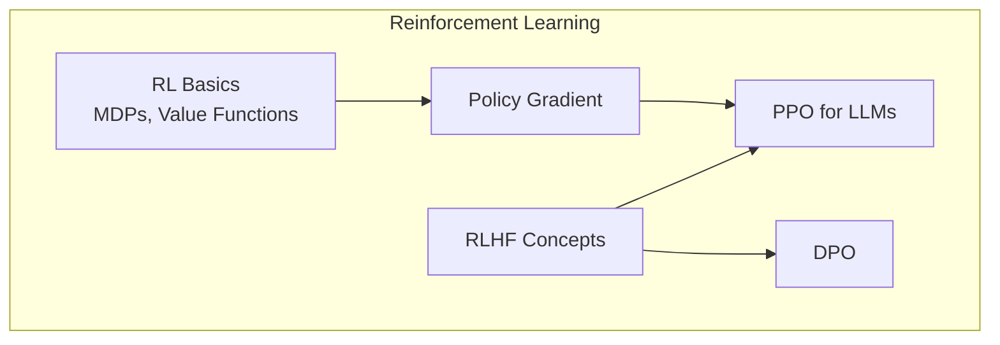
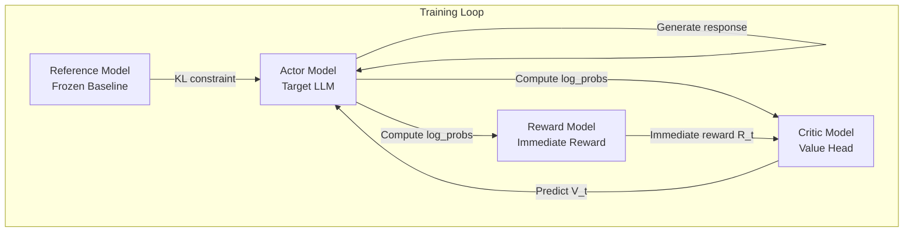
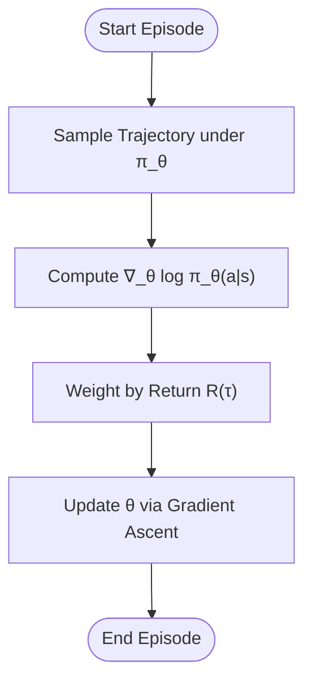
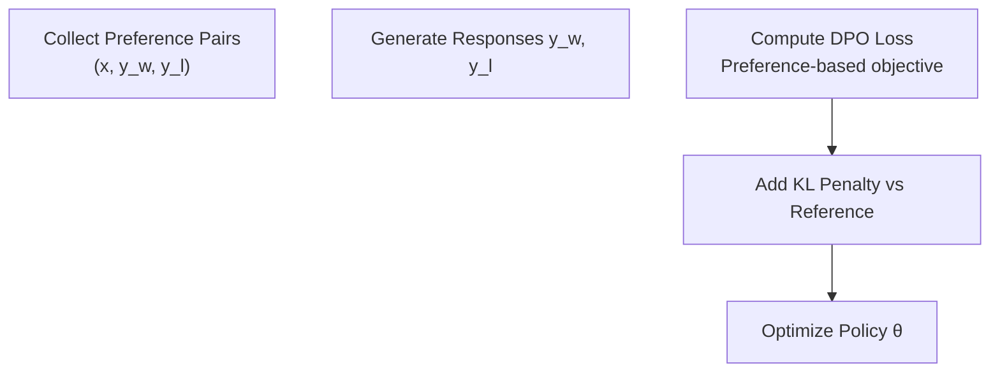
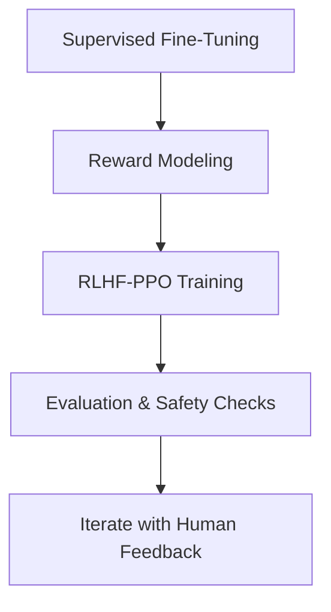
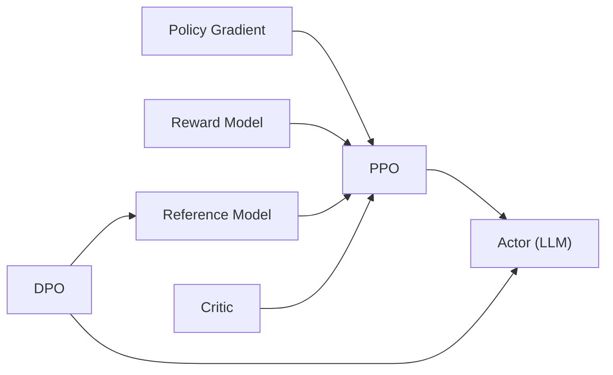

# Advanced Learning Methods

<cite>
**Referenced Files in This Document**
- [07.强化学习/1.rlhf相关/1.rlhf相关.md](file://07.强化学习/1.rlhf相关/1.rlhf相关.md)
- [07.强化学习/2.强化学习/2.强化学习.md](file://07.强化学习/2.强化学习/2.强化学习.md)
- [07.强化学习/策略梯度（pg）/策略梯度（pg）.md](file://07.强化学习/策略梯度（pg）/策略梯度（pg）.md)
- [07.强化学习/近端策略优化(ppo)/近端策略优化(ppo).md](file://07.强化学习/近端策略优化(ppo)/近端策略优化(ppo).md)
- [07.强化学习/DPO/DPO.md](file://07.强化学习/DPO/DPO.md)
- [07.强化学习/大模型RLHF：PPO原理与源码解读/大模型RLHF：PPO原理与源码解读.md](file://07.强化学习/大模型RLHF：PPO原理与源码解读/大模型RLHF：PPO原理与源码解读.md)
</cite>

## Table of Contents
1. [Introduction](#introduction)
2. [Project Structure](#project-structure)
3. [Core Components](#core-components)
4. [Architecture Overview](#architecture-overview)
5. [Detailed Component Analysis](#detailed-component-analysis)
6. [Dependency Analysis](#dependency-analysis)
7. [Performance Considerations](#performance-considerations)
8. [Troubleshooting Guide](#troubleshooting-guide)
9. [Conclusion](#conclusion)
10. [Appendices](#appendices)

## Introduction
This document presents advanced learning methods for large language models (LLMs) with a focus on reinforcement learning techniques. It explains Reinforcement Learning from Human Feedback (RLHF), policy gradient methods, proximal policy optimization (PPO), and direct preference optimization (DPO). It covers reward modeling, human preference alignment, safety considerations, and ethical implications. Practical guidance is provided for building RLHF pipelines, including reward function design, preference dataset creation, and evaluation methodologies. The document also addresses troubleshooting common issues and balancing performance with safety requirements, along with future directions in RL-based model alignment.

## Project Structure
The repository organizes reinforcement learning materials into focused topics:
- RL fundamentals and comparisons with supervised learning
- Policy gradient methods
- PPO for LLMs and RLHF pipelines
- DPO as a direct preference optimization alternative
- RLHF-related concepts and practical considerations



**Section sources**
- [07.强化学习/README.md:1-22](file://07.强化学习/README.md#L1-L22)

## Core Components
- RL basics and MDPs
- Policy gradient theory and implementation
- PPO for LLMs with actor-critic-reward-reference roles
- DPO as a direct preference optimization approach
- RLHF pipeline stages and practical challenges

**Section sources**
- [07.强化学习/2.强化学习/2.强化学习.md:1-444](file://07.强化学习/2.强化学习/2.强化学习.md#L1-L444)
- [07.强化学习/策略梯度（pg）/策略梯度（pg）.md:1-341](file://07.强化学习/策略梯度（pg）/策略梯度（pg）.md#L1-L341)
- [07.强化学习/近端策略优化(ppo)/近端策略优化(ppo).md](file://07.强化学习/近端策略优化(ppo)/近端策略优化(ppo).md#L1-L466)
- [07.强化学习/DPO/DPO.md:1-117](file://07.强化学习/DPO/DPO.md#L1-L117)
- [07.强化学习/1.rlhf相关/1.rlhf相关.md:1-172](file://07.强化学习/1.rlhf相关/1.rlhf相关.md#L1-L172)

## Architecture Overview
The RLHF pipeline integrates four major roles during training:
- Actor model: the target language model being trained
- Critic model: estimates total return V_t
- Reward model: computes immediate reward R_t
- Reference model: frozen baseline to constrain updates



**Diagram sources**
- [07.强化学习/大模型RLHF：PPO原理与源码解读/大模型RLHF：PPO原理与源码解读.md:81-170](file://07.强化学习/大模型RLHF：PPO原理与源码解读/大模型RLHF：PPO原理与源码解读.md#L81-L170)

**Section sources**
- [07.强化学习/大模型RLHF：PPO原理与源码解读/大模型RLHF：PPO原理与源码解读.md:81-170](file://07.强化学习/大模型RLHF：PPO原理与源码解读/大模型RLHF：PPO原理与源码解读.md#L81-L170)

## Detailed Component Analysis

### RL Fundamentals and Policy Gradient
- RL is framed as optimizing expected cumulative reward through agent-environment interaction.
- Policy gradient computes gradients of expected return with respect to policy parameters.
- Implementation highlights include trajectory sampling, log-prob gradients, and advantage estimation.



**Diagram sources**
- [07.强化学习/策略梯度（pg）/策略梯度（pg）.md:76-127](file://07.强化学习/策略梯度（pg）/策略梯度（pg）.md#L76-L127)

**Section sources**
- [07.强化学习/2.强化学习/2.强化学习.md:1-200](file://07.强化学习/2.强化学习/2.强化学习.md#L1-L200)
- [07.强化学习/策略梯度（pg）/策略梯度（pg）.md:32-133](file://07.强化学习/策略梯度（pg）/策略梯度（pg）.md#L32-L133)

### PPO for LLMs and RLHF
- PPO improves on policy gradient by clipping importance-weighted ratios and using generalized advantage estimation (GAE).
- In RLHF, PPO trains the actor while constraining shifts via KL divergence against a reference model, and estimates returns with a critic.
- The training loop iterates over batches, computes advantages and returns, and performs multiple epochs of updates with clipping.

```mermaid
sequenceDiagram
participant Env as "Environment"
participant Actor as "Actor Model"
participant Critic as "Critic Model"
participant RM as "Reward Model"
participant Ref as "Reference Model"
Env->>Actor : "Prompt"
Actor-->>Env : "Response"
Env-->>RM : "Prompt + Response"
RM-->>Env : "Immediate reward R_t"
Env-->>Critic : "Prompt + Response"
Critic-->>Env : "Value estimate V_t"
Env-->>Actor : "Advantages and Returns"
Actor-->>Ref : "Log-probabilities"
Ref-->>Actor : "KL penalty"
Actor-->>Env : "Updated policy parameters"
Critic-->>Env : "Updated value parameters"
```

**Diagram sources**
- [07.强化学习/大模型RLHF：PPO原理与源码解读/大模型RLHF：PPO原理与源码解读.md:391-430](file://07.强化学习/大模型RLHF：PPO原理与源码解读/大模型RLHF：PPO原理与源码解读.md#L391-L430)

**Section sources**
- [07.强化学习/近端策略优化(ppo)/近端策略优化(ppo).md](file://07.强化学习/近端策略优化(ppo)/近端策略优化(ppo).md#L101-L187)
- [07.强化学习/大模型RLHF：PPO原理与源码解读/大模型RLHF：PPO原理与源码解读.md:171-567](file://07.强化学习/大模型RLHF：PPO原理与源码解读/大模型RLHF：PPO原理与Source.md#L171-L567)

### Direct Preference Optimization (DPO)
- DPO bypasses explicit reward modeling by directly optimizing the policy against pairwise preferences.
- It minimizes a preference-based loss that encourages preferred completions and discourages dispreferred ones, using a reference model to stabilize updates.



**Diagram sources**
- [07.强化学习/DPO/DPO.md:54-106](file://07.强化学习/DPO/DPO.md#L54-L106)

**Section sources**
- [07.强化学习/DPO/DPO.md:54-117](file://07.强化学习/DPO/DPO.md#L54-L117)

### RLHF Pipeline and Practical Considerations
- RLHF consists of three stages: supervised fine-tuning (SFT), reward modeling (RM), and reinforcement learning fine-tuning (PPO).
- Practical challenges include cost of human feedback, subjectivity, sparsity, and computational demands of maintaining multiple models during PPO.
- Strategies to mitigate costs and improve throughput include simulation, active learning, online learning, and RRHF-style ranking losses.



**Diagram sources**
- [07.强化学习/1.rlhf相关/1.rlhf相关.md:17-41](file://07.强化学习/1.rlhf相关/1.rlhf相关.md#L17-L41)

**Section sources**
- [07.强化学习/1.rlhf相关/1.rlhf相关.md:17-106](file://07.强化学习/1.rlhf相关/1.rlhf相关.md#L17-L106)

## Dependency Analysis
- Policy gradient underpins PPO’s policy update mechanism.
- PPO relies on critic estimates and reward model outputs to compute advantages and returns.
- DPO depends on preference datasets and a reference model to guide policy updates without explicit reward modeling.
- RLHF integrates all four roles (actor, critic, reward, reference) in a coordinated training loop.



**Diagram sources**
- [07.强化学习/策略梯度（pg）/策略梯度（pg）.md:32-133](file://07.强化学习/策略梯度（pg）/策略梯度（pg）.md#L32-L133)
- [07.强化学习/近端策略优化(ppo)/近端策略优化(ppo).md](file://07.强化学习/近端策略优化(ppo)/近端策略优化(ppo).md#L101-L187)
- [07.强化学习/DPO/DPO.md:54-106](file://07.强化学习/DPO/DPO.md#L54-L106)

**Section sources**
- [07.强化学习/大模型RLHF：PPO原理与源码解读/大模型RLHF：PPO原理与源码解读.md:171-567](file://07.强化学习/大模型RLHF：PPO原理与源码解读/大模型RLHF：PPO原理与源码解读.md#L171-L567)

## Performance Considerations
- Computational efficiency: PPO requires four models (actor, critic, reward, reference), increasing memory and compute demands.
- Parallelization and distributed training can accelerate SFT, RM, and PPO stages.
- Transfer learning and pretraining reduce training time and sample requirements.
- Hyperparameter tuning (e.g., KL control, clipping ranges, GAE λ) impacts convergence speed and stability.

[No sources needed since this section provides general guidance]

## Troubleshooting Guide
Common issues and remedies:
- High cost and subjectivity of human feedback:
  - Mitigation: Simulation, active learning, online learning, and RRHF-style ranking losses.
- Slow iteration cycles:
  - Mitigation: Parallelization, distributed training, and improved optimization algorithms.
- Excessive compute for PPO:
  - Mitigation: RRHF-style training, reduced model count, and efficient sampling strategies.
- Instability in policy updates:
  - Mitigation: KL penalties, clipping, and careful hyperparameter tuning.

**Section sources**
- [07.强化学习/1.rlhf相关/1.rlhf相关.md:53-98](file://07.强化学习/1.rlhf相关/1.rlhf相关.md#L53-L98)

## Conclusion
This document outlined reinforcement learning techniques for LLMs, focusing on RLHF, policy gradient, PPO, and DPO. It described the RLHF pipeline, the roles of actor, critic, reward, and reference models, and provided practical guidance for designing reward functions, constructing preference datasets, and evaluating outcomes. It also addressed safety and ethical considerations, troubleshooting strategies, and future directions such as reducing reliance on explicit reward modeling and scaling training throughput.

[No sources needed since this section summarizes without analyzing specific files]

## Appendices

### Practical Implementation Guidance
- Reward modeling:
  - Train a reward model to score completions; use ranking losses to preserve orderings from human preferences.
- Preference dataset creation:
  - Collect pairs of completions per prompt; ensure diverse and representative samples; consider active learning to optimize annotation effort.
- Evaluation methodologies:
  - Human evaluations, automated metrics aligned with human preferences, and robustness checks under safety constraints.
- Safety and ethics:
  - Incorporate safety signals into reward modeling; monitor for harmful outputs; ensure fairness and transparency in preference collection.

[No sources needed since this section provides general guidance]