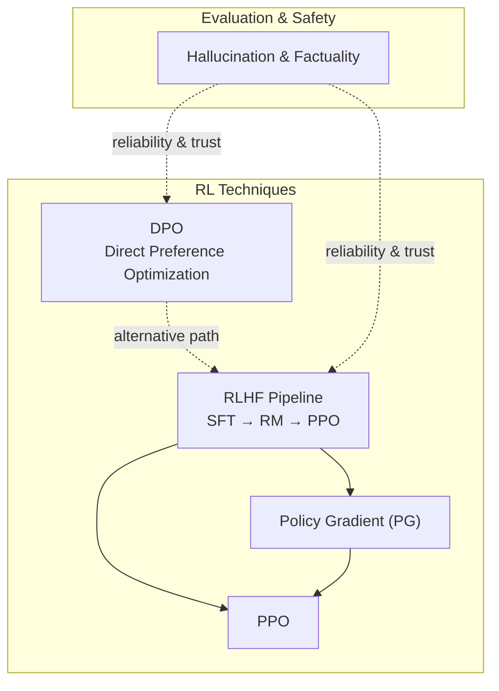
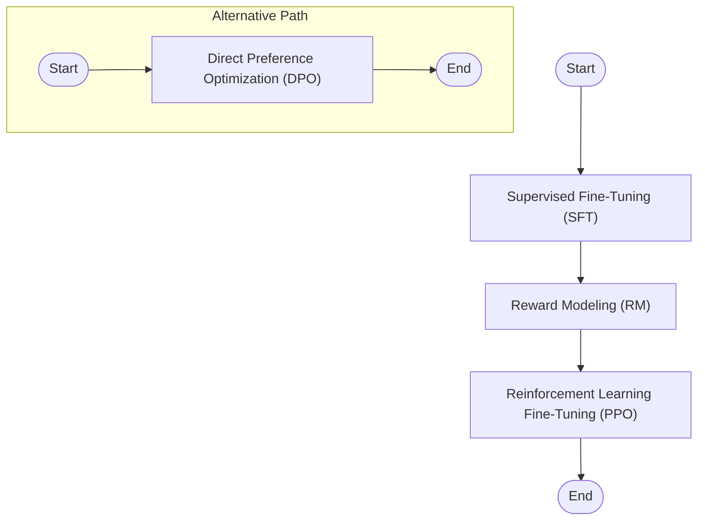
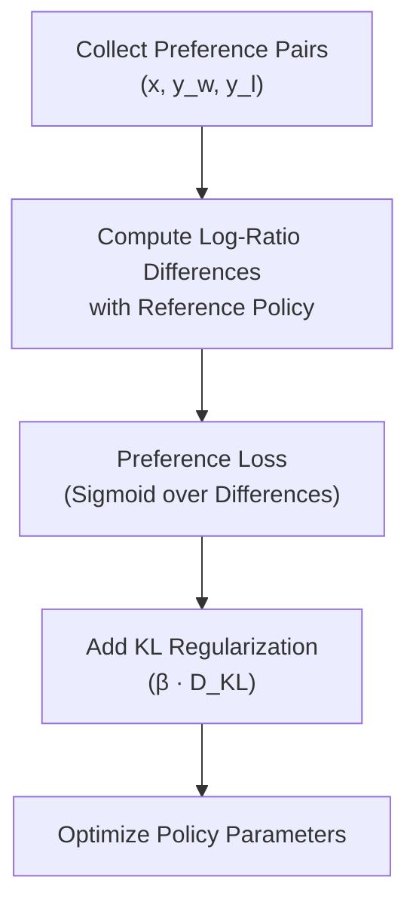
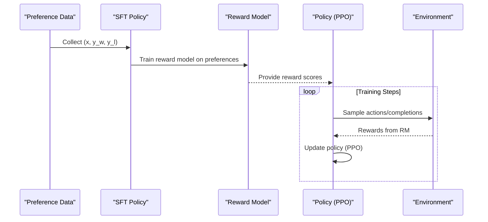
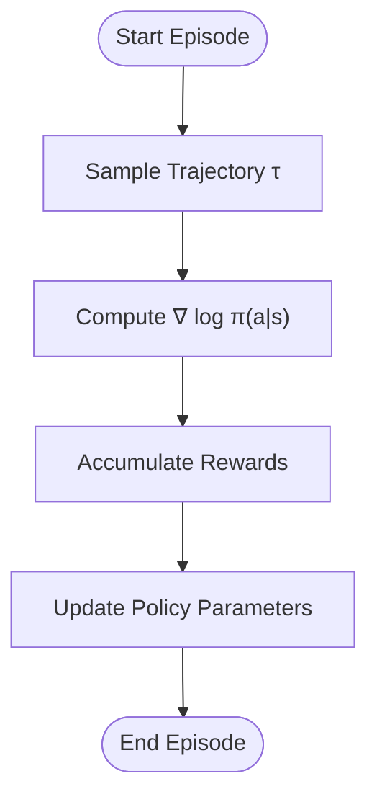
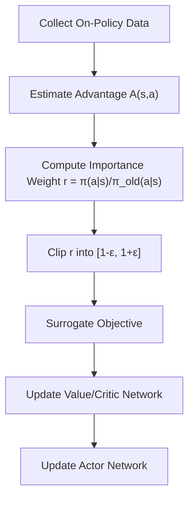
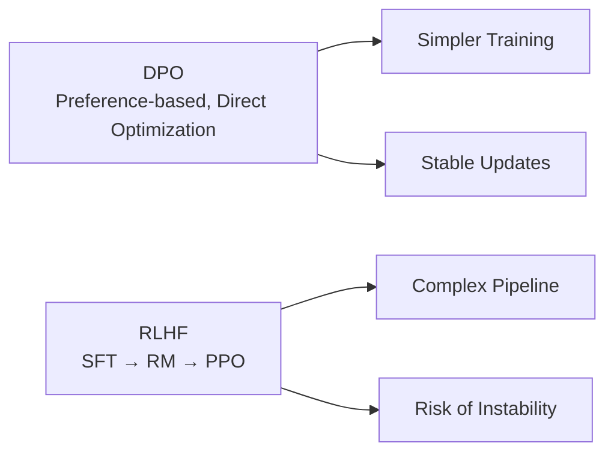
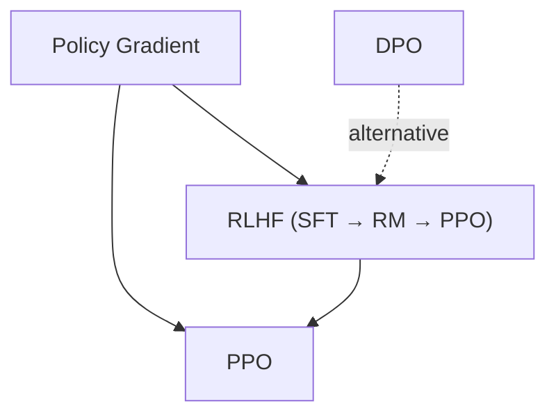

# Advanced RL Techniques

<cite>
**Referenced Files in This Document**
- [DPO.md](file://07.强化学习/DPO/DPO.md)
- [1.rlhf相关.md](file://07.强化学习/1.rlhf相关/1.rlhf相关.md)
- [策略梯度（pg）.md](file://07.强化学习/策略梯度（pg）/策略梯度（pg）.md)
- [近端策略优化(ppo).md](file://07.强化学习/近端策略优化(ppo)/近端策略优化(ppo).md)
- [README.md](file://07.强化学习/README.md)
- [1.大模型幻觉.md](file://09.大语言模型评估/1.大模型幻觉/1.大模型幻觉.md)
</cite>

## Table of Contents
1. [Introduction](#introduction)
2. [Project Structure](#project-structure)
3. [Core Components](#core-components)
4. [Architecture Overview](#architecture-overview)
5. [Detailed Component Analysis](#detailed-component-analysis)
6. [Dependency Analysis](#dependency-analysis)
7. [Performance Considerations](#performance-considerations)
8. [Troubleshooting Guide](#troubleshooting-guide)
9. [Conclusion](#conclusion)
10. [Appendices](#appendices)

## Introduction
This document synthesizes advanced reinforcement learning techniques for language models with a focus on Direct Preference Optimization (DPO) and cutting-edge methods beyond traditional RLHF. It explains how DPO simplifies training by bypassing explicit reward modeling and reinforcement learning loops, and compares it with RLHF stages (SFT → RM → PPO). We also outline recent trends in preference optimization, direct policy learning, and reward-free RL, and discuss comparative trade-offs among RL approaches. Advanced topics include preference uncertainty modeling, multi-objective optimization, and safety-constrained RL. Implementation guidelines, benchmark observations, and ethical considerations—especially bias mitigation and responsible deployment—are covered to guide practitioners building robust, reliable, and safe RL-based systems.

## Project Structure
The repository organizes RL-related materials under a dedicated folder. The DPO module provides a focused treatment of the DPO algorithm and its advantages over RLHF. RLHF fundamentals, policy gradient theory, and PPO are documented in separate files. Evaluation and hallucination concerns are covered in the evaluation section, which informs safety and reliability considerations.

**Diagram sources**
- [DPO.md:1-117](file://07.强化学习/DPO/DPO.md#L1-L117)
- [1.rlhf相关.md:17-107](file://07.强化学习/1.rlhf相关/1.rlhf相关.md#L17-L107)
- [策略梯度（pg）.md:32-132](file://07.强化学习/策略梯度（pg）/策略梯度（pg）.md#L32-L132)
- [近端策略优化(ppo).md:101-187](file://07.强化学习/近端策略优化(ppo)/近端策略优化(ppo).md#L101-L187)
- [1.大模型幻觉.md:1-109](file://09.大语言模型评估/1.大模型幻觉/1.大模型幻觉.md#L1-L109)

**Section sources**
- [README.md:1-22](file://07.强化学习/README.md#L1-L22)

## Core Components
- Direct Preference Optimization (DPO): A direct policy optimization approach that avoids explicit reward modeling and RL loops by optimizing against human preference pairs with a preference-based loss and KL regularization.
- RLHF Pipeline: Supervised fine-tuning (SFT), reward modeling (RM), and reinforcement learning fine-tuning (PPO), highlighting the computational overhead and instability associated with sampling from multiple models.
- Policy Gradient (PG): The foundational policy-based method that computes gradients of expected returns with respect to policy parameters, often used as motivation for later methods.
- PPO: A practical policy optimization method that constrains policy updates via clipping or KL penalties to improve stability and reduce variance.

**Section sources**
- [DPO.md:54-117](file://07.强化学习/DPO/DPO.md#L54-L117)
- [1.rlhf相关.md:17-107](file://07.强化学习/1.rlhf相关/1.rlhf相关.md#L17-L107)
- [策略梯度（pg）.md:32-132](file://07.强化学习/策略梯度（pg）/策略梯度（pg）.md#L32-L132)
- [近端策略优化(ppo).md:101-187](file://07.强化学习/近端策略优化(ppo)/近端策略优化(ppo).md#L101-L187)

## Architecture Overview
The RLHF pipeline involves three stages: supervised fine-tuning (SFT), reward modeling (RM), and reinforcement learning fine-tuning (PPO). DPO offers a streamlined alternative by directly optimizing the policy against preference pairs without training a separate reward model or performing RL updates.

**Diagram sources**
- [1.rlhf相关.md:17-107](file://07.强化学习/1.rlhf相关/1.rlhf相关.md#L17-L107)
- [DPO.md:54-117](file://07.强化学习/DPO/DPO.md#L54-L117)

## Detailed Component Analysis

### Direct Preference Optimization (DPO)
DPO formulates a preference-based objective that directly optimizes the policy against paired preferences without estimating a reward function or running RL loops. It stabilizes training by minimizing a sigmoid-based loss over preference differences and incorporating a KL term to prevent large policy drift.

Key characteristics:
- Preference-based loss: Optimizes the log-ratio difference between preferred and rejected completions relative to a reference policy.
- Reference policy: Often initialized from SFT or estimated from preference data to mitigate distribution shift.
- Stability: Reduces instability compared to PPO by avoiding explicit reward modeling and RL optimization.

**Diagram sources**
- [DPO.md:69-106](file://07.强化学习/DPO/DPO.md#L69-L106)

**Section sources**
- [DPO.md:54-117](file://07.强化学习/DPO/DPO.md#L54-L117)

### RLHF Pipeline: SFT → RM → PPO
RLHF proceeds through three stages:
- SFT: Supervised fine-tuning on high-quality instruction/data pairs to initialize a strong baseline policy.
- RM: Reward modeling from human preference pairs to estimate a scalar reward for given prompts and completions.
- PPO: Reinforcement learning fine-tuning using the learned reward model to maximize expected rewards while constraining policy changes.

Trade-offs:
- Complexity and cost: Requires maintaining and sampling from multiple models across stages.
- Instability: RL loops can be sensitive to reward estimation and distribution shifts.

**Diagram sources**
- [1.rlhf相关.md:17-107](file://07.强化学习/1.rlhf相关/1.rlhf相关.md#L17-L107)

**Section sources**
- [1.rlhf相关.md:17-107](file://07.强化学习/1.rlhf相关/1.rlhf相关.md#L17-L107)

### Policy Gradient (PG)
Policy gradient provides the theoretical foundation for policy-based RL. It computes the gradient of expected return with respect to policy parameters and updates policies accordingly. Variance reduction techniques (e.g., baselines) and discounting are commonly used to stabilize learning.

**Diagram sources**
- [策略梯度（pg）.md:32-132](file://07.强化学习/策略梯度（pg）/策略梯度（pg）.md#L32-L132)

**Section sources**
- [策略梯度（pg）.md:32-132](file://07.强化学习/策略梯度（pg）/策略梯度（pg）.md#L32-L132)

### PPO: Practical Policy Optimization
PPO improves upon policy gradient by constraining policy updates either via KL penalties (PPO-penalty) or clipping (PPO-clip). This reduces instability and variance during policy updates, especially in continuous control domains.

**Diagram sources**
- [近端策略优化(ppo).md:101-187](file://07.强化学习/近端策略优化(ppo)/近端策略优化(ppo).md#L101-L187)

**Section sources**
- [近端策略优化(ppo).md:101-187](file://07.强化学习/近端策略优化(ppo)/近端策略优化(ppo).md#L101-L187)

### Comparative Analysis: DPO vs. RLHF
- DPO advantages:
  - Simplified training: No reward model training; no RL loops; fewer model copies.
  - Stability: Avoids reward mismatch and policy drift typical in PPO.
  - Efficiency: Reduced computational overhead and hyperparameter sensitivity.
- RLHF trade-offs:
  - Expressiveness: Can incorporate complex reward shaping and multi-stage objectives.
  - Scalability: Requires careful coordination across SFT, RM, and PPO stages.

**Diagram sources**
- [DPO.md:54-117](file://07.强化学习/DPO/DPO.md#L54-L117)
- [1.rlhf相关.md:17-107](file://07.强化学习/1.rlhf相关/1.rlhf相关.md#L17-L107)

**Section sources**
- [DPO.md:54-117](file://07.强化学习/DPO/DPO.md#L54-L117)
- [1.rlhf相关.md:17-107](file://07.强化学习/1.rlhf相关/1.rlhf相关.md#L17-L107)

### Advanced Topics
- Preference uncertainty modeling: Incorporate uncertainty in human preferences (e.g., noisy pairwise comparisons) into the objective to improve robustness.
- Multi-objective optimization: Balance multiple goals (helpfulness, harmlessness, factuality) using weighted objectives or Pareto-efficient policies.
- Safety-constrained RL: Enforce hard constraints (e.g., safety thresholds) via penalty terms or constraint-aware policy optimization.

[No sources needed since this section provides general guidance]

### Implementation Guidelines
- Data preparation:
  - Prefer preference pairs over raw text for DPO; ensure balanced and representative samples.
  - For RLHF, collect diverse human preference pairs and ensure annotation quality.
- Reference policy initialization:
  - Initialize the reference policy from SFT or estimate it from preference data to reduce distribution shift.
- Training:
  - DPO: Optimize the preference loss with KL regularization; tune β to balance reward and stability.
  - RLHF: Train RM carefully; use PPO with clipped objectives and GAE for advantage estimation; monitor KL divergence.
- Evaluation:
  - Measure reward alignment, diversity, and factual consistency; track hallucination rates and safety metrics.

[No sources needed since this section provides general guidance]

### Performance Benchmarks and Research Directions
- Benchmark observations (DPO vs. PPO):
  - DPO achieves comparable or better reward alignment with smaller KL divergence and improved robustness across sampling temperatures.
  - DPO demonstrates superior performance in emotion control, summarization, and single-turn dialogue response quality.
- Research directions:
  - Preference uncertainty modeling and robust preference learning.
  - Reward-free methods combining preference optimization with intrinsic motivation.
  - Multi-objective and safety-constrained RL for aligned, safe, and efficient policy optimization.

**Section sources**
- [DPO.md:107-117](file://07.强化学习/DPO/DPO.md#L107-L117)

## Dependency Analysis
The RLHF pipeline depends on policy gradient foundations and PPO for stabilization. DPO is conceptually independent of reward modeling and RL loops, relying instead on preference-based objectives and KL regularization.

**Diagram sources**
- [策略梯度（pg）.md:32-132](file://07.强化学习/策略梯度（pg）/策略梯度（pg）.md#L32-L132)
- [近端策略优化(ppo).md:101-187](file://07.强化学习/近端策略优化(ppo)/近端策略优化(ppo).md#L101-L187)
- [1.rlhf相关.md:17-107](file://07.强化学习/1.rlhf相关/1.rlhf相关.md#L17-L107)
- [DPO.md:54-117](file://07.强化学习/DPO/DPO.md#L54-L117)

**Section sources**
- [策略梯度（pg）.md:32-132](file://07.强化学习/策略梯度（pg）/策略梯度（pg）.md#L32-L132)
- [近端策略优化(ppo).md:101-187](file://07.强化学习/近端策略优化(ppo)/近端策略优化(ppo).md#L101-L187)
- [1.rlhf相关.md:17-107](file://07.强化学习/1.rlhf相关/1.rlhf相关.md#L17-L107)
- [DPO.md:54-117](file://07.强化学习/DPO/DPO.md#L54-L117)

## Performance Considerations
- DPO’s preference-based objective and KL regularization generally yield lower KL divergence while maintaining reward alignment, improving robustness across sampling temperatures.
- RLHF’s PPO stage benefits from clipping and GAE-based advantage estimation to stabilize updates and reduce variance.

**Section sources**
- [DPO.md:107-117](file://07.强化学习/DPO/DPO.md#L107-L117)
- [近端策略优化(ppo).md:101-187](file://07.强化学习/近端策略优化(ppo)/近端策略优化(ppo).md#L101-L187)

## Troubleshooting Guide
- Hallucination and factuality:
  - Monitor hallucination rates and factual consistency; apply external verification and consistency checks.
  - Adjust decoding strategies and leverage multiple generations to detect inconsistencies.
- Preference data quality:
  - Ensure balanced and representative preference pairs; mitigate label noise and disagreement.
- Stability:
  - For RLHF, monitor KL divergence and adjust β; use PPO clipping to prevent large policy updates.
  - For DPO, tune β to balance reward gain and policy drift.

**Section sources**
- [1.大模型幻觉.md:53-109](file://09.大语言模型评估/1.大模型幻觉/1.大模型幻觉.md#L53-L109)
- [近端策略优化(ppo).md:101-187](file://07.强化学习/近端策略优化(ppo)/近端策略优化(ppo).md#L101-L187)
- [DPO.md:69-106](file://07.强化学习/DPO/DPO.md#L69-L106)

## Conclusion
DPO presents a compelling alternative to RLHF by eliminating reward modeling and RL loops, offering a simpler, more stable, and computationally efficient path to align language models with human preferences. RLHF remains powerful for complex, multi-faceted objectives but requires careful orchestration across stages. As the field evolves toward reward-free methods, preference uncertainty modeling, multi-objective optimization, and safety-constrained RL, practitioners should prioritize robust evaluation, responsible deployment, and mitigation of hallucinations and biases.

[No sources needed since this section summarizes without analyzing specific files]

## Appendices
- Appendix A: RLHF stages and roles
  - SFT: Initializes policy; RM: Learns reward from preferences; PPO: Optimizes policy with constraints.
- Appendix B: PG and PPO essentials
  - PG: Policy gradient updates; PPO: Clipped objective and advantage estimation.

**Section sources**
- [1.rlhf相关.md:17-107](file://07.强化学习/1.rlhf相关/1.rlhf相关.md#L17-L107)
- [策略梯度（pg）.md:32-132](file://07.强化学习/策略梯度（pg）/策略梯度（pg）.md#L32-L132)
- [近端策略优化(ppo).md:101-187](file://07.强化学习/近端策略优化(ppo)/近端策略优化(ppo).md#L101-L187)