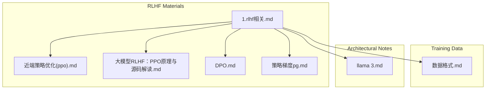
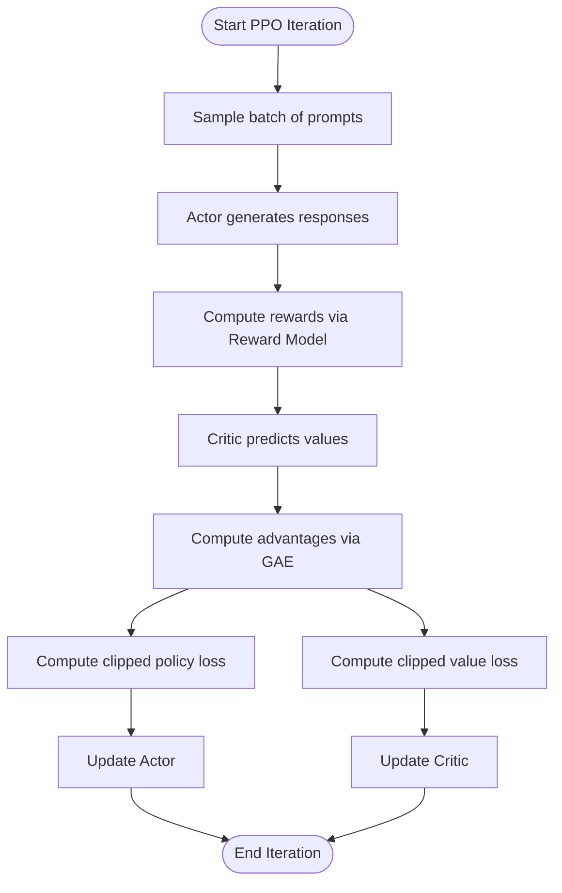
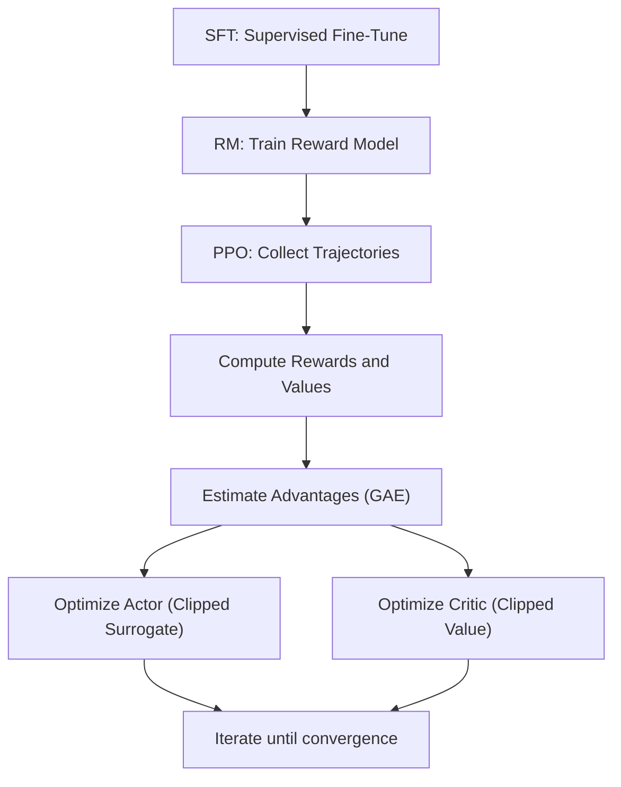
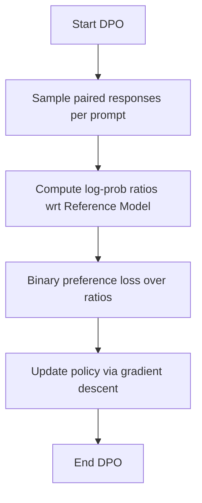
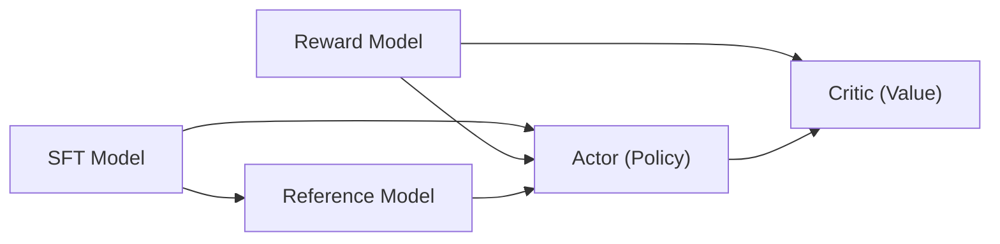

# RLHF Implementation

<cite>
**Referenced Files in This Document**
- [1.rlhf相关.md](file://07.强化学习/1.rlhf相关/1.rlhf相关.md)
- [近端策略优化(ppo).md](file://07.强化学习/近端策略优化(ppo)/近端策略优化(ppo).md)
- [大模型RLHF：PPO原理与源码解读.md](file://07.强化学习/大模型RLHF：PPO原理与源码解读/大模型RLHF：PPO原理与源码解读.md)
- [DPO.md](file://07.强化学习/DPO/DPO.md)
- [策略梯度（pg）.md](file://07.强化学习/策略梯度（pg）/策略梯度（pg）.md)
- [数据格式.md](file://03.训练数据集/数据格式/数据格式.md)
- [llama 3.md](file://02.大语言模型架构/llama 3/llama 3.md)
</cite>

## Table of Contents
1. [Introduction](#introduction)
2. [Project Structure](#project-structure)
3. [Core Components](#core-components)
4. [Architecture Overview](#architecture-overview)
5. [Detailed Component Analysis](#detailed-component-analysis)
6. [Dependency Analysis](#dependency-analysis)
7. [Performance Considerations](#performance-considerations)
8. [Troubleshooting Guide](#troubleshooting-guide)
9. [Conclusion](#conclusion)
10. [Appendices](#appendices)

## Introduction
This document presents a comprehensive, practical guide to Reinforcement Learning from Human Feedback (RLHF) with a focus on the PPO algorithm. It explains the actor-critic architecture, policy optimization, and value function approximation in the context of large language models. It documents the end-to-end RLHF pipeline from human preference collection to model fine-tuning, including reward modeling, preference dataset creation, and training procedures. It also covers hyperparameter tuning, convergence criteria, evaluation methodologies, common implementation challenges, debugging techniques, performance optimization strategies, and best practices for deploying RLHF systems in production.

## Project Structure
The repository organizes RLHF-related materials under the “强化学习” (Reinforcement Learning) section, with dedicated topics for RLHF fundamentals, PPO theory and implementation, reward modeling, and direct preference optimization (DPO). Training data formats and real-world deployment notes are covered in separate sections.



**Diagram sources**
- [1.rlhf相关.md:1-172](file://07.强化学习/1.rlhf相关/1.rlhf相关.md#L1-L172)
- [近端策略优化(ppo).md](file://07.强化学习/近端策略优化(ppo)/近端策略优化(ppo).md#L1-L466)
- [大模型RLHF：PPO原理与源码解读.md:1-568](file://07.强化学习/大模型RLHF：PPO原理与源码解读/大模型RLHF：PPO原理与源码解读.md#L1-L568)
- [DPO.md:1-117](file://07.强化学习/DPO/DPO.md#L1-L117)
- [策略梯度（pg）.md:1-341](file://07.强化学习/策略梯度（pg）/策略梯度（pg）.md#L1-L341)
- [数据格式.md:1-117](file://03.训练数据集/数据格式/数据格式.md#L1-L117)
- [llama 3.md:70-80](file://02.大语言模型架构/llama 3/llama 3.md#L70-L80)

**Section sources**
- [1.rlhf相关.md:1-172](file://07.强化学习/1.rlhf相关/1.rlhf相关.md#L1-L172)
- [近端策略优化(ppo).md:1-466](file://07.强化学习/近端策略优化(ppo)/近端策略优化(ppo).md#L1-L466)
- [大模型RLHF：PPO原理与源码解读.md:1-568](file://07.强化学习/大模型RLHF：PPO原理与源码解读/大模型RLHF：PPO原理与源码解读.md#L1-L568)
- [DPO.md:1-117](file://07.强化学习/DPO/DPO.md#L1-L117)
- [策略梯度（pg）.md:1-341](file://07.强化学习/策略梯度（pg）/策略梯度（pg）.md#L1-L341)
- [数据格式.md:1-117](file://03.训练数据集/数据格式/数据格式.md#L1-L117)
- [llama 3.md:70-80](file://02.大语言模型架构/llama 3/llama 3.md#L70-L80)

## Core Components
- RLHF pipeline stages:
  - Supervised Fine-Tuning (SFT)
  - Reward Modeling (RM)
  - Reinforcement Learning Fine-Tuning (PPO)
- Four-model architecture during PPO:
  - Actor (policy)
  - Critic (value)
  - Reward Model (fixed)
  - Reference Model (fixed)
- Alternative: Direct Preference Optimization (DPO) avoids explicit reward modeling.

Key implementation insights:
- PPO actor loss uses advantages derived from reward and value estimates, with clipping and KL regularization.
- Critic loss uses clipped value targets against returns estimated via Generalized Advantage Estimation (GAE).
- DPO optimizes directly on preference pairs without reward modeling.

**Section sources**
- [1.rlhf相关.md:17-120](file://07.强化学习/1.rlhf相关/1.rlhf相关.md#L17-L120)
- [大模型RLHF：PPO原理与源码解读.md:81-170](file://07.强化学习/大模型RLHF：PPO原理与源码解读/大模型RLHF：PPO原理与源码解读.md#L81-L170)
- [DPO.md:54-117](file://07.强化学习/DPO/DPO.md#L54-L117)

## Architecture Overview
The RLHF training loop integrates four models: Actor, Critic, Reward, and Reference. The Actor generates responses; the Reward Model scores them; the Critic estimates value; the Reference constrains policy updates.

```mermaid
sequenceDiagram
participant Env as "Environment"
participant Actor as "Actor (Policy)"
participant Critic as "Critic (Value)"
participant Reward as "Reward Model"
participant Ref as "Reference Model"
Env->>Actor : "Prompt"
Actor-->>Env : "Response"
Env->>Reward : "Prompt + Response"
Reward-->>Env : "Reward score"
Env->>Critic : "Prompt + Response"
Critic-->>Env : "Value estimate"
Env->>Ref : "Prompt + Response"
Ref-->>Env : "Reference log-prob"
Env-->>Actor : "Advantages (GAE)"
Env-->>Critic : "Returns"
Actor->>Actor : "Update via clipped surrogate"
Critic->>Critic : "Update via clipped value loss"
```

**Diagram sources**
- [大模型RLHF：PPO原理与源码解读.md:330-374](file://07.强化学习/大模型RLHF：PPO原理与源码解读/大模型RLHF：PPO原理与源码解读.md#L330-L374)
- [大模型RLHF：PPO原理与源码解读.md:458-484](file://07.强化学习/大模型RLHF：PPO原理与源码解读/大模型RLHF：PPO原理与源码解读.md#L458-L484)
- [大模型RLHF：PPO原理与源码解读.md:539-567](file://07.强化学习/大模型RLHF：PPO原理与源码解读/大模型RLHF：PPO原理与源码解读.md#L539-L567)

## Detailed Component Analysis

### PPO Actor-Critic Architecture and Loss Design
- Actor (policy) network:
  - Outputs action distribution conditioned on state (prompt + partial response).
  - Uses KL regularization against Reference Model and advantage-weighted policy gradient.
- Critic (value) network:
  - Predicts state-value for returns estimation.
  - Clipped value loss against returns computed via GAE.
- Reward Model:
  - Fixed; computes per-token reward for immediate feedback.
- Reference Model:
  - Fixed; provides baseline log-probabilities to constrain policy drift.

Implementation highlights:
- Advantage computation via GAE with discount and mixing parameter.
- Clipped surrogate objective for policy update.
- Clipped value objective for value update.



**Diagram sources**
- [大模型RLHF：PPO原理与源码解读.md:330-374](file://07.强化学习/大模型RLHF：PPO原理与源码解读/大模型RLHF：PPO原理与源码解读.md#L330-L374)
- [大模型RLHF：PPO原理与源码解读.md:458-484](file://07.强化学习/大模型RLHF：PPO原理与源码解读/大模型RLHF：PPO原理与源码解读.md#L458-L484)
- [大模型RLHF：PPO原理与源码解读.md:539-567](file://07.强化学习/大模型RLHF：PPO原理与源码解读/大模型RLHF：PPO原理与源码解读.md#L539-L567)

**Section sources**
- [大模型RLHF：PPO原理与源码解读.md:171-568](file://07.强化学习/大模型RLHF：PPO原理与源码解读/大模型RLHF：PPO原理与源码解读.md#L171-L568)

### Reward Modeling and Preference Dataset Creation
- Stage 2: Reward Modeling
  - Generate paired completions for each prompt using SFT model.
  - Collect human preferences over pairs to form a preference dataset.
  - Train a reward model to predict per-token reward or full-response reward.
- Dataset format:
  - Input: prompt.
  - Output: preferred and non-preferred responses (or logits/scores).
  - Optionally, per-token reward labels aligned with response tokens.

Practical guidance:
- Prefer ranking-style datasets (preferred vs non-preferred) for robustness.
- Normalize and clip reward scores to stabilize training.
- Use Reference Model log-probabilities to penalize policy drift.

**Section sources**
- [1.rlhf相关.md:25-41](file://07.强化学习/1.rlhf相关/1.rlhf相关.md#L25-L41)
- [DPO.md:30-41](file://07.强化学习/DPO/DPO.md#L30-L41)
- [数据格式.md:27-68](file://03.训练数据集/数据格式/数据格式.md#L27-L68)

### Training Procedure Implementation
- SFT stage:
  - Supervised fine-tuning on instruction-following or dialogue datasets.
- RM stage:
  - Binary preference classification loss over paired completions.
- RL stage (PPO):
  - Collect trajectories with fixed Actor and Critic.
  - Compute advantages via GAE.
  - Optimize clipped policy and value losses.
  - Apply KL regularization via Reference Model.



**Diagram sources**
- [1.rlhf相关.md:100-120](file://07.强化学习/1.rlhf相关/1.rlhf相关.md#L100-L120)
- [大模型RLHF：PPO原理与源码解读.md:330-374](file://07.强化学习/大模型RLHF：PPO原理与源码解读/大模型RLHF：PPO原理与源码解读.md#L330-L374)

**Section sources**
- [1.rlhf相关.md:100-120](file://07.强化学习/1.rlhf相关/1.rlhf相关.md#L100-L120)
- [近端策略优化(ppo).md:188-441](file://07.强化学习/近端策略优化(ppo)/近端策略优化(ppo).md#L188-L441)

### Direct Preference Optimization (DPO)
- Motivation:
  - Avoids explicit reward modeling and sampling from multiple models.
- Objective:
  - Minimize negative log-likelihood of preference ordering using reference model ratios.
- Benefits:
  - Simplified pipeline, fewer models, stable training.



**Diagram sources**
- [DPO.md:54-117](file://07.强化学习/DPO/DPO.md#L54-L117)

**Section sources**
- [DPO.md:54-117](file://07.强化学习/DPO/DPO.md#L54-L117)

### Hyperparameter Tuning and Convergence Criteria
- PPO hyperparameters:
  - Clipping range (commonly 0.1–0.2).
  - KL control coefficient for reference regularization.
  - GAE lambda and discount gamma.
  - Learning rate schedules and warmup steps.
- Convergence criteria:
  - Monitor policy loss, value loss, KL divergence, and reward metrics.
  - Early stopping on validation reward or stability thresholds.
- Evaluation:
  - Human preference scoring, automatic benchmarks (e.g., summarization, reasoning).
  - A/B testing for production deployments.

**Section sources**
- [大模型RLHF：PPO原理与源码解读.md:458-484](file://07.强化学习/大模型RLHF：PPO原理与源码解读/大模型RLHF：PPO原理与源码解读.md#L458-L484)
- [DPO.md:107-117](file://07.强化学习/DPO/DPO.md#L107-L117)

### Production Deployment Best Practices
- Model serving:
  - Separate inference endpoints for Actor, Critic, and Reward models.
  - Use efficient decoders and batching strategies.
- Monitoring:
  - Track reward scores, response quality, latency, and throughput.
  - Alert on reward degradation or policy drift.
- Safety:
  - Incorporate safety constraints and moderation filters.
  - Periodic red-teaming and preference re-evaluation.

**Section sources**
- [1.rlhf相关.md:89-100](file://07.强化学习/1.rlhf相关/1.rlhf相关.md#L89-L100)
- [llama 3.md:70-80](file://02.大语言模型架构/llama 3/llama 3.md#L70-L80)

## Dependency Analysis
- RLHF depends on:
  - SFT model initialization for Actor and Reference.
  - RM for reward signals.
  - Critic for value estimation.
- DPO removes explicit RM dependency, simplifying the pipeline.



**Diagram sources**
- [1.rlhf相关.md:109-120](file://07.强化学习/1.rlhf相关/1.rlhf相关.md#L109-L120)
- [DPO.md:54-117](file://07.强化学习/DPO/DPO.md#L54-L117)

**Section sources**
- [1.rlhf相关.md:109-120](file://07.强化学习/1.rlhf相关/1.rlhf相关.md#L109-L120)
- [DPO.md:54-117](file://07.强化学习/DPO/DPO.md#L54-L117)

## Performance Considerations
- Reduce computational overhead:
  - Use Reference Model to constrain updates and reduce variance.
  - Employ GAE to balance bias/variance in advantage estimation.
  - Clip value targets to stabilize value learning.
- Scaling:
  - Parallelize trajectory collection across multiple GPUs/nodes.
  - Use mixed precision and gradient accumulation.
- Data efficiency:
  - Prefer ranking datasets and synthetic preference generation where feasible.
  - Apply active learning to prioritize informative samples.

**Section sources**
- [1.rlhf相关.md:77-87](file://07.强化学习/1.rlhf相关/1.rlhf相关.md#L77-L87)
- [大模型RLHF：PPO原理与源码解读.md:539-567](file://07.强化学习/大模型RLHF：PPO原理与源码解读/大模型RLHF：PPO原理与源码解读.md#L539-L567)

## Troubleshooting Guide
- Common issues:
  - Reward mismatch: Ensure RM and Actor share consistent tokenization and padding.
  - Overfitting to RM: Increase KL regularization and monitor KL divergence.
  - Instability: Reduce learning rate, tighten clipping, and increase GAE lambda.
  - Poor reward signal: Improve preference labeling quality and remove noisy samples.
- Debugging tips:
  - Inspect advantages and returns distributions.
  - Verify GAE computation correctness.
  - Log per-token reward and value predictions.
  - Validate Reference Model alignment.

**Section sources**
- [大模型RLHF：PPO原理与源码解读.md:330-374](file://07.强化学习/大模型RLHF：PPO原理与源码解读/大模型RLHF：PPO原理与源码解读.md#L330-L374)
- [策略梯度（pg）.md:134-165](file://07.强化学习/策略梯度（pg）/策略梯度（pg）.md#L134-L165)

## Conclusion
RLHF with PPO provides a robust framework for aligning language models with human preferences. The four-model architecture enables principled policy optimization via advantages and value targets, while DPO offers a simpler alternative by optimizing directly on preference pairs. Effective deployment requires careful hyperparameter tuning, strong monitoring, and iterative evaluation. By combining best practices in data curation, model design, and operational excellence, teams can build reliable, scalable RLHF systems.

## Appendices

### Appendix A: RLHF Pipeline Summary
- SFT: Initialize policy with supervised fine-tuning.
- RM: Train reward model on human preference rankings.
- PPO: Optimize policy with clipped surrogates and value targets; constrain with Reference Model.
- DPO: Direct optimization on preference pairs without explicit reward modeling.

**Section sources**
- [1.rlhf相关.md:17-120](file://07.强化学习/1.rlhf相关/1.rlhf相关.md#L17-L120)
- [DPO.md:54-117](file://07.强化学习/DPO/DPO.md#L54-L117)