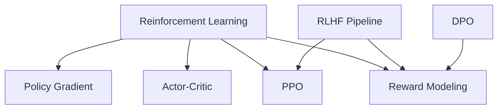
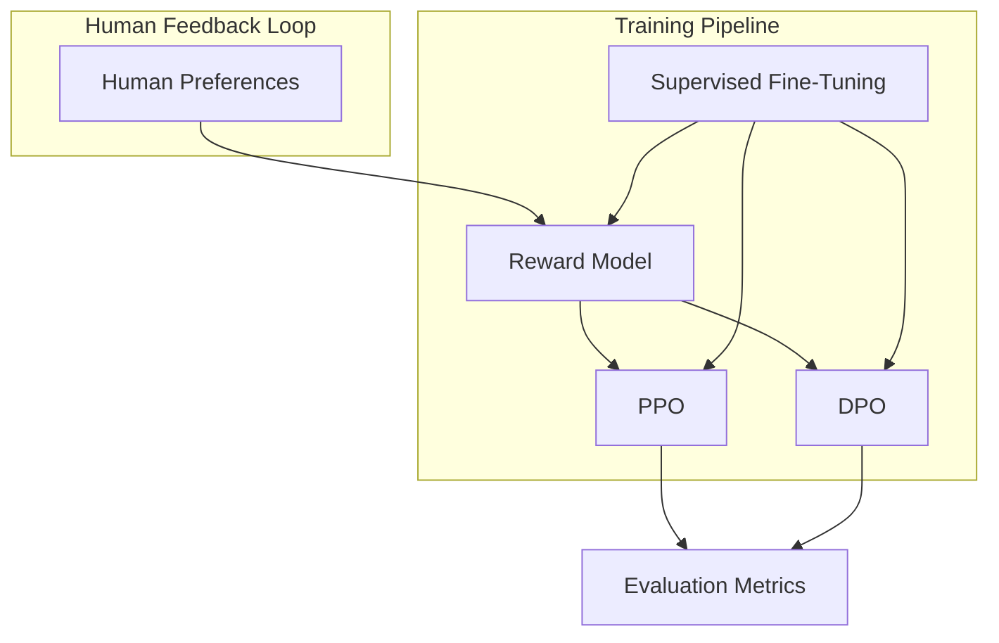
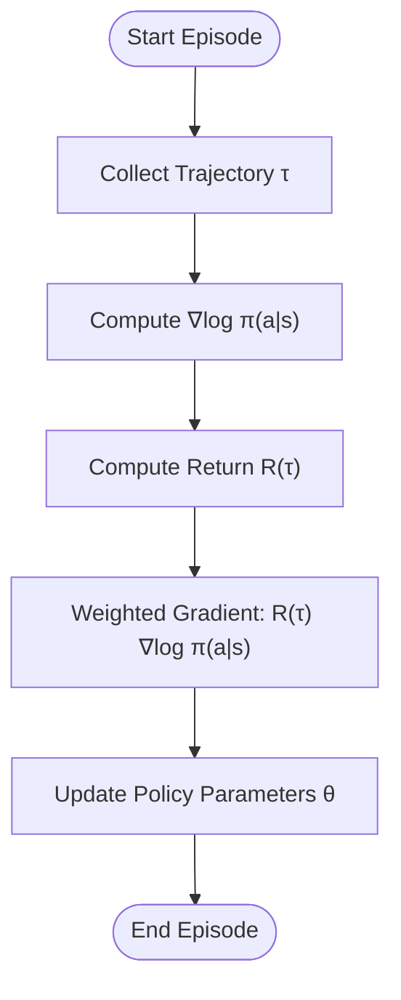
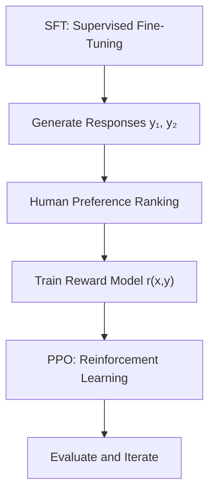
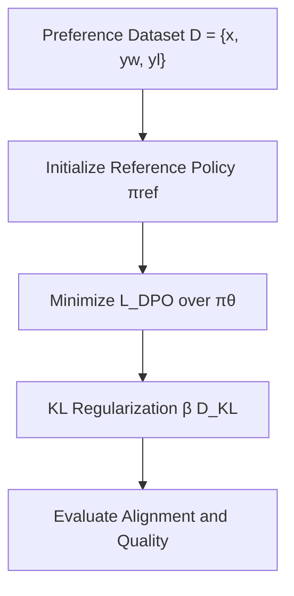
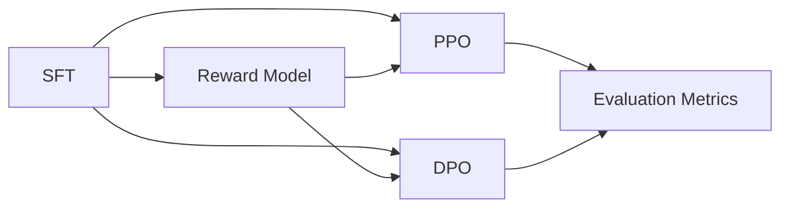

# Reinforcement Learning Fundamentals

<cite>
**Referenced Files in This Document**
- [07.强化学习/README.md](file://07.强化学习/README.md)
- [07.强化学习/1.rlhf相关/1.rlhf相关.md](file://07.强化学习/1.rlhf相关/1.rlhf相关.md)
- [07.强化学习/策略梯度（pg）/策略梯度（pg）.md](file://07.强化学习/策略梯度（pg）/策略梯度（pg）.md)
- [07.强化学习/近端策略优化(ppo)/近端策略优化(ppo).md](file://07.强化学习/近端策略优化(ppo)/近端策略优化(ppo).md)
- [07.强化学习/DPO/DPO.md](file://07.强化学习/DPO/DPO.md)
- [07.强化学习/2.强化学习/2.强化学习.md](file://07.强化学习/2.强化学习/2.强化学习.md)
</cite>

## Table of Contents
1. [Introduction](#introduction)
2. [Project Structure](#project-structure)
3. [Core Components](#core-components)
4. [Architecture Overview](#architecture-overview)
5. [Detailed Component Analysis](#detailed-component-analysis)
6. [Dependency Analysis](#dependency-analysis)
7. [Performance Considerations](#performance-considerations)
8. [Troubleshooting Guide](#troubleshooting-guide)
9. [Conclusion](#conclusion)
10. [Appendices](#appendices)

## Introduction
This document presents a comprehensive overview of Reinforcement Learning (RL) fundamentals with a focus on policy gradient methods, reward modeling, and human feedback integration. It synthesizes core RL concepts—Markov Decision Processes (MDPs), value functions, and policy gradients—and connects them to practical applications in large language models (LLMs), particularly in reward modeling and preference learning. It also covers evaluation metrics, theoretical guarantees, and practical guidance for designing reward functions aligned with human values, avoiding reward hacking, and ensuring robustness in preference learning.

## Project Structure
The repository organizes RL-related materials under a dedicated folder. The primary topics covered here include:
- Policy gradient fundamentals
- Actor-critic and policy optimization
- Reward modeling and human feedback integration
- Practical LLM applications (RLHF, DPO)



**Section sources**
- [07.强化学习/README.md:1-22](file://07.强化学习/README.md#L1-L22)

## Core Components
This section outlines the core RL concepts and methodologies documented in the repository, emphasizing policy gradients, value functions, and policy optimization.

- Policy gradient methods
  - Policy gradient aims to maximize expected return by updating policy parameters using gradient ascent. It computes the gradient of the expected return with respect to policy parameters and updates the policy accordingly.
  - The policy gradient theorem provides the foundation for policy-based methods, enabling direct optimization of stochastic policies.

- Value functions and Bellman equations
  - Value functions quantify the expected cumulative reward from a given state or state-action pair under a fixed policy.
  - Bellman equations define iterative relationships among values across states or actions, forming the basis for dynamic programming, Monte Carlo, and temporal difference learning.

- Policy optimization and actor-critic methods
  - Actor-critic combines policy-based (actor) and value-based (critic) approaches, leveraging the critic to estimate value functions and guide policy updates.
  - PPO refines policy updates by constraining policy changes to remain close to the previous policy, stabilizing training and improving sample efficiency.

- Reward modeling and human feedback
  - Reward modeling learns a reward function from human preferences over generated completions, enabling alignment with human values.
  - RLHF integrates supervised fine-tuning, reward modeling, and reinforcement learning to improve model behavior.
  - DPO offers a direct optimization approach that bypasses explicit reward modeling and reinforcement learning, optimizing policy directly against preference data.

**Section sources**
- [07.强化学习/2.强化学习/2.强化学习.md:29-76](file://07.强化学习/2.强化学习/2.强化学习.md#L29-L76)
- [07.强化学习/策略梯度（pg）/策略梯度（pg）.md:32-132](file://07.强化学习/策略梯度（pg）/策略梯度（pg）.md#L32-L132)
- [07.强化学习/近端策略优化(ppo)/近端策略优化(ppo).md:101-186](file://07.强化学习/近端策略优化(ppo)/近端策略优化(ppo).md#L101-L186)
- [07.强化学习/1.rlhf相关/1.rlhf相关.md:17-106](file://07.强化学习/1.rlhf相关/1.rlhf相关.md#L17-L106)
- [07.强化学习/DPO/DPO.md:54-117](file://07.强化学习/DPO/DPO.md#L54-L117)

## Architecture Overview
The RL architecture integrates policy optimization with reward modeling and human feedback. The following diagram maps the key components and their interactions.



**Diagram sources**
- [07.强化学习/1.rlhf相关/1.rlhf相关.md:100-121](file://07.强化学习/1.rlhf相关/1.rlhf相关.md#L100-L121)
- [07.强化学习/DPO/DPO.md:54-117](file://07.强化学习/DPO/DPO.md#L54-L117)

**Section sources**
- [07.强化学习/1.rlhf相关/1.rlhf相关.md:100-121](file://07.强化学习/1.rlhf相关/1.rlhf相关.md#L100-L121)
- [07.强化学习/DPO/DPO.md:54-117](file://07.强化学习/DPO/DPO.md#L54-L117)

## Detailed Component Analysis

### Policy Gradient Methods
Policy gradient methods optimize the policy directly by estimating the gradient of the expected return with respect to policy parameters. The repository documents:
- The policy gradient theorem and its derivation
- Practical considerations such as baselines and advantage estimation
- Implementation patterns for policy networks and gradient updates



**Diagram sources**
- [07.强化学习/策略梯度（pg）/策略梯度（pg）.md:76-132](file://07.强化学习/策略梯度（pg）/策略梯度（pg）.md#L76-L132)

**Section sources**
- [07.强化学习/策略梯度（pg）/策略梯度（pg）.md:32-132](file://07.强化学习/策略梯度（pg）/策略梯度（pg）.md#L32-L132)

### Actor-Critic and PPO
Actor-critic methods combine policy-based and value-based learning. PPO improves upon policy gradient by constraining policy updates to maintain stability and reduce variance.

```mermaid
sequenceDiagram
participant Env as "Environment"
participant Actor as "Actor (Policy)"
participant Critic as "Critic (Value)"
participant Buffer as "Rollout Buffer"
Actor->>Env : Sample action a ~ π(·|s)
Env-->>Actor : Next state s', reward r
Actor->>Buffer : Store (s, a, r)
Critic->>Buffer : Estimate value V(s')
Buffer-->>Actor : Advantage A(s,a)
Actor->>Actor : Update policy with clipped surrogate
Critic->>Critic : Update value function
```

**Diagram sources**
- [07.强化学习/近端策略优化(ppo)/近端策略优化(ppo).md:224-441](file://07.强化学习/近端策略优化(ppo)/近端策略优化(ppo).md#L224-L441)

**Section sources**
- [07.强化学习/近端策略优化(ppo)/近端策略优化(ppo).md:101-186](file://07.强化学习/近端策略优化(ppo)/近端策略优化(ppo).md#L101-L186)
- [07.强化学习/近端策略优化(ppo)/近端策略优化(ppo).md:224-441](file://07.强化学习/近端策略优化(ppo)/近端策略优化(ppo).md#L224-L441)

### Reward Modeling and RLHF
Reward modeling learns a reward function from human preferences over model outputs. RLHF integrates three stages: supervised fine-tuning, reward modeling, and reinforcement learning.



**Diagram sources**
- [07.强化学习/1.rlhf相关/1.rlhf相关.md:17-106](file://07.强化学习/1.rlhf相关/1.rlhf相关.md#L17-L106)

**Section sources**
- [07.强化学习/1.rlhf相关/1.rlhf相关.md:17-106](file://07.强化学习/1.rlhf相关/1.rlhf相关.md#L17-L106)

### Direct Preference Optimization (DPO)
DPO optimizes the policy directly against preference data without fitting a separate reward model or performing reinforcement learning during fine-tuning.



**Diagram sources**
- [07.强化学习/DPO/DPO.md:54-117](file://07.强化学习/DPO/DPO.md#L54-L117)

**Section sources**
- [07.强化学习/DPO/DPO.md:54-117](file://07.强化学习/DPO/DPO.md#L54-L117)

### Mathematical Foundations
This section summarizes the mathematical foundations documented in the repository, including MDPs, value functions, and policy gradients.

- Markov Decision Processes (MDPs)
  - MDPs are five-tuples defining states, actions, transition probabilities, rewards, and discount factor.
  - The Markov property ensures future states depend only on the current state and action.

- Value Functions and Bellman Equations
  - State-value and action-value functions capture expected returns under a policy.
  - Bellman equations express iterative relationships among values across states or actions.

- Policy Gradients
  - Policy gradient theorem enables direct policy optimization by computing gradients of expected returns with respect to policy parameters.

**Section sources**
- [07.强化学习/2.强化学习/2.强化学习.md:29-76](file://07.强化学习/2.强化学习/2.强化学习.md#L29-L76)
- [07.强化学习/策略梯度（pg）/策略梯度（pg）.md:32-132](file://07.强化学习/策略梯度（pg）/策略梯度（pg）.md#L32-L132)

## Dependency Analysis
The RL pipeline exhibits strong dependencies among components:
- SFT initializes the model before reward modeling and reinforcement learning.
- Reward modeling depends on human preferences and supervised outputs.
- PPO and DPO consume the reward model or operate directly on preference data.
- Evaluation metrics depend on both reward model quality and policy alignment.



**Diagram sources**
- [07.强化学习/1.rlhf相关/1.rlhf相关.md:100-121](file://07.强化学习/1.rlhf相关/1.rlhf相关.md#L100-L121)
- [07.强化学习/DPO/DPO.md:54-117](file://07.强化学习/DPO/DPO.md#L54-L117)

**Section sources**
- [07.强化学习/1.rlhf相关/1.rlhf相关.md:100-121](file://07.强化学习/1.rlhf相关/1.rlhf相关.md#L100-L121)
- [07.强化学习/DPO/DPO.md:54-117](file://07.强化学习/DPO/DPO.md#L54-L117)

## Performance Considerations
- Sample efficiency and stability
  - PPO’s clipping mechanism and KL regularization help stabilize training and reduce variance.
  - Baselines and advantage estimation improve policy gradient performance by reducing variance.

- Computational cost
  - RLHF involves multiple models and extensive data collection; DPO reduces computational overhead by eliminating explicit reward modeling and reinforcement learning during fine-tuning.

- Exploration vs. exploitation
  - Balancing exploration and exploitation remains crucial; intrinsic motivation and curriculum learning can aid exploration in sparse-reward environments.

[No sources needed since this section provides general guidance]

## Troubleshooting Guide
Common issues and remedies:
- High variance in policy gradients
  - Use baselines and advantage estimation to reduce variance.
  - Consider actor-critic methods for more efficient updates.

- Instability in policy updates
  - Apply PPO’s clipping or KL regularization to constrain policy changes.

- Poor reward modeling quality
  - Ensure diverse and representative preference data; consider human feedback quality and consistency.

- Overfitting to reward model
  - Monitor KL divergence from reference policy and adjust regularization strength.

**Section sources**
- [07.强化学习/近端策略优化(ppo)/近端策略优化(ppo).md:101-186](file://07.强化学习/近端策略优化(ppo)/近端策略优化(ppo).md#L101-L186)
- [07.强化学习/策略梯度（pg）/策略梯度（pg）.md:134-167](file://07.强化学习/策略梯度（pg）/策略梯度（pg）.md#L134-L167)

## Conclusion
This document synthesized core RL concepts—MDPs, value functions, and policy gradients—and demonstrated their practical application in reward modeling and preference learning for LLMs. It outlined the RLHF pipeline and compared it with DPO, highlighting trade-offs in stability, computational cost, and alignment quality. Guidance was provided for designing reward functions aligned with human values, mitigating reward hacking, and ensuring robustness in preference learning.

[No sources needed since this section summarizes without analyzing specific files]

## Appendices
- Evaluation metrics for RL agents
  - Common metrics include average episodic return, episode length, and KL divergence from reference policy.
  - Additional qualitative measures assess safety, helpfulness, and coherence in language tasks.

- Preference learning and human alignment
  - Preference datasets should reflect diverse human judgments and be balanced across domains.
  - Iterative refinement and human-in-the-loop validation improve alignment and reduce unintended behaviors.

[No sources needed since this section provides general guidance]