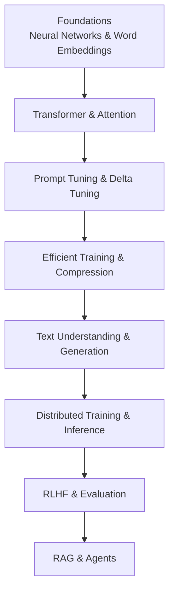
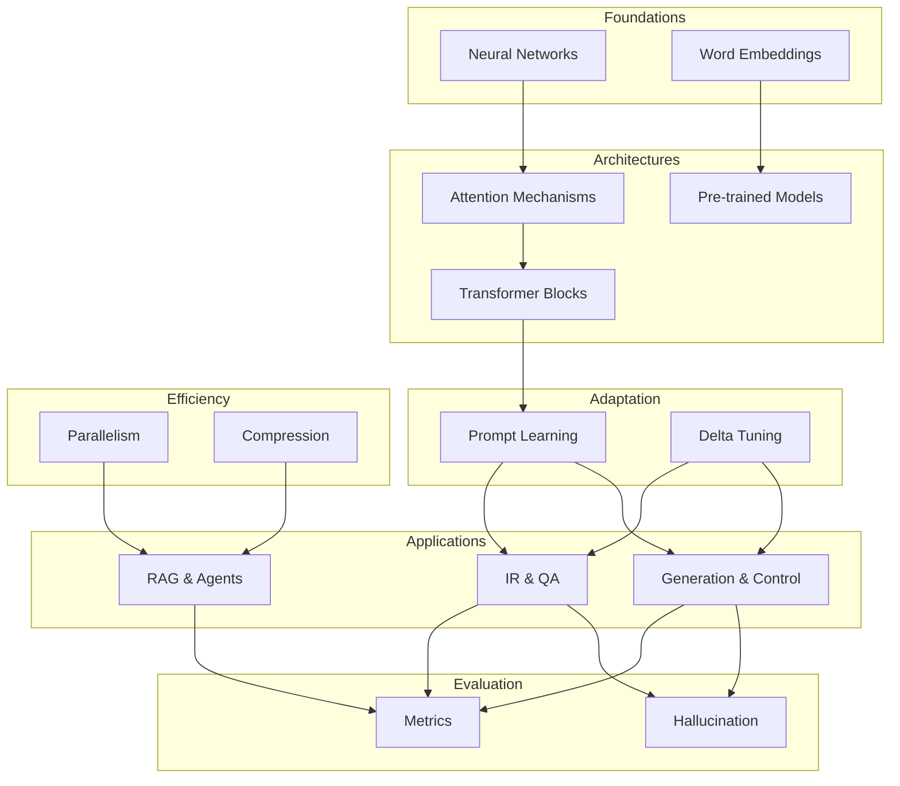
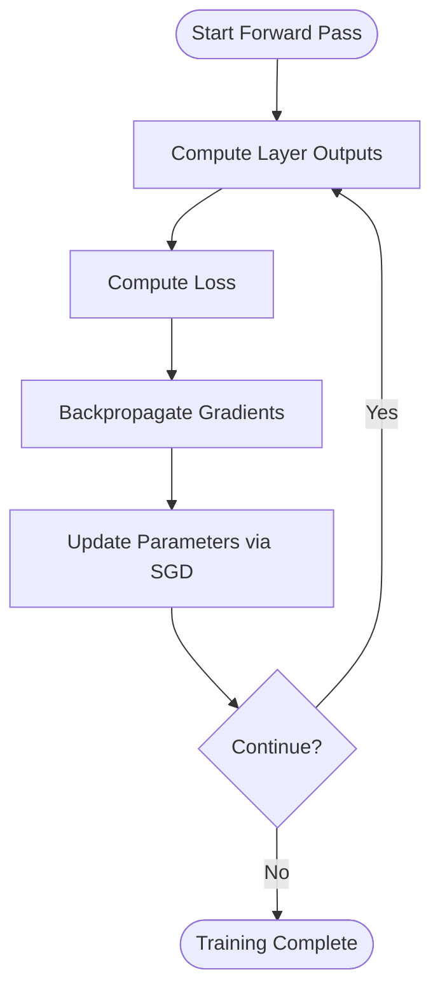
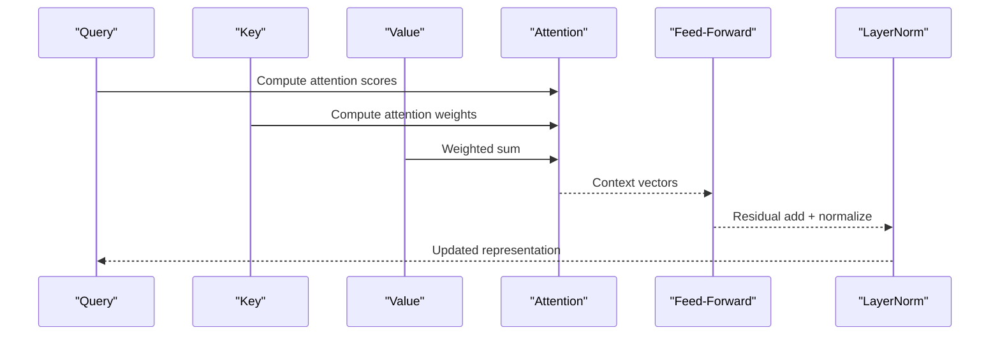
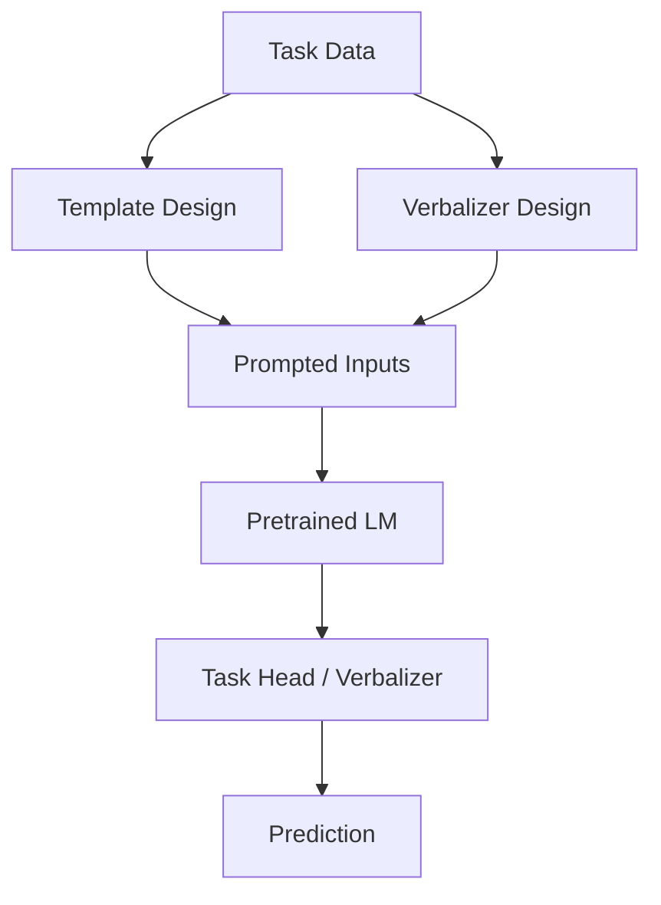
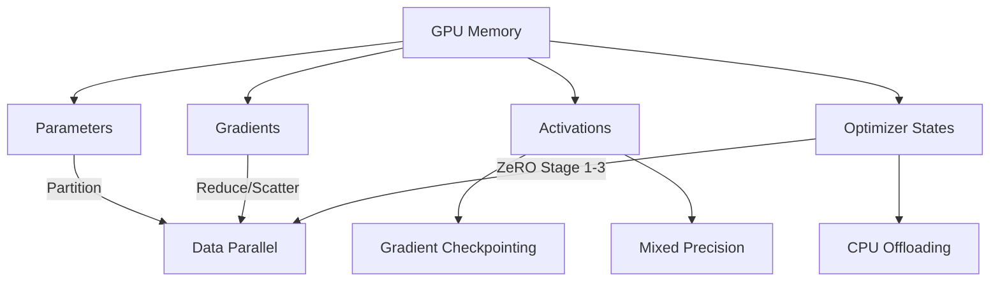
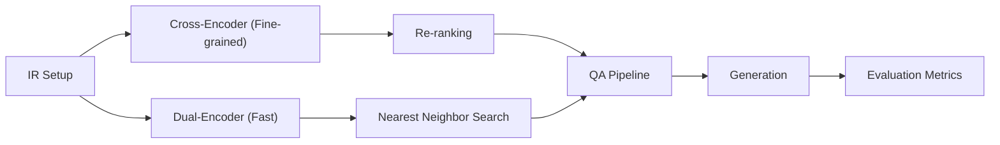
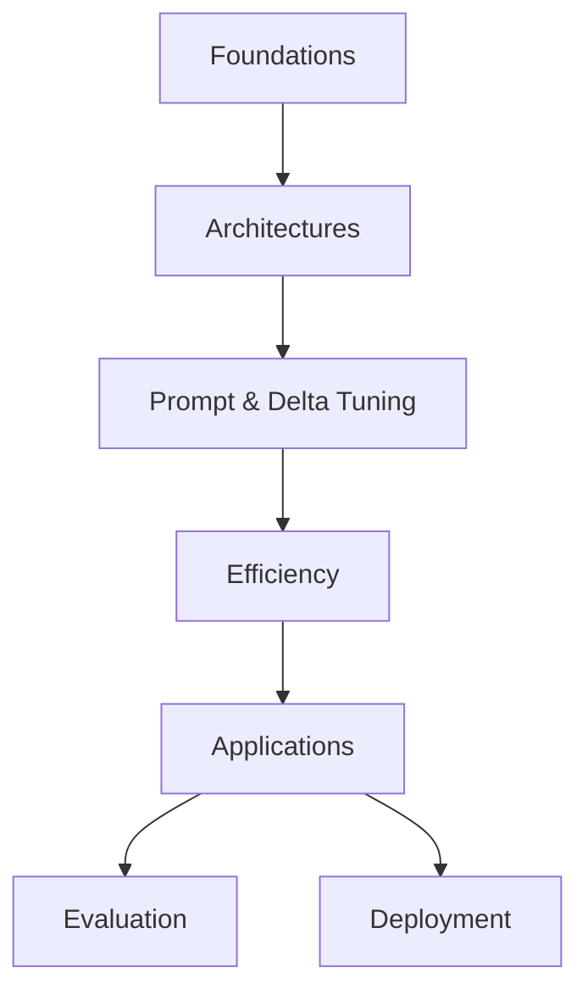

# Educational Resources and Courses

<cite>
**Referenced Files in This Document**
- [README.md](file://README.md)
- [98.相关课程/清华大模型公开课/2.神经网络基础/2.神经网络基础.md](file://98.相关课程/清华大模型公开课/2.神经网络基础/2.神经网络基础.md)
- [98.相关课程/清华大模型公开课/3.Transformer基础/3.Transformer基础.md](file://98.相关课程/清华大模型公开课/3.Transformer基础/3.Transformer基础.md)
- [98.相关课程/清华大模型公开课/4.Prompt Tuning & Delta Tuning/4.Prompt Tuning & Delta Tuning.md](file://98.相关课程/清华大模型公开课/4.Prompt Tuning & Delta Tuning/4.Prompt Tuning & Delta Tuning.md)
- [98.相关课程/清华大模型公开课/5.高效训练&模型压缩/5.高效训练&模型压缩.md](file://98.相关课程/清华大模型公开课/5.高效训练&模型压缩/5.高效训练&模型压缩.md)
- [98.相关课程/清华大模型公开课/6.文本理解和生成大模型/6.文本理解和生成大模型.md](file://98.相关课程/清华大模型公开课/6.文本理解和生成大模型/6.文本理解和生成大模型.md)
- [01.大语言模型基础/README.md](file://01.大语言模型基础/README.md)
- [02.大语言模型架构/README.md](file://02.大语言模型架构/README.md)
- [04.分布式训练/README.md](file://04.分布式训练/README.md)
- [05.有监督微调/README.md](file://05.有监督微调/README.md)
- [06.推理/README.md](file://06.推理/README.md)
- [07.强化学习/README.md](file://07.强化学习/README.md)
- [08.检索增强rag/README.md](file://08.检索增强rag/README.md)
- [09.大语言模型评估/README.md](file://09.大语言模型评估/README.md)
</cite>

## Table of Contents
1. [Introduction](#introduction)
2. [Project Structure](#project-structure)
3. [Core Components](#core-components)
4. [Architecture Overview](#architecture-overview)
5. [Detailed Component Analysis](#detailed-component-analysis)
6. [Dependency Analysis](#dependency-analysis)
7. [Performance Considerations](#performance-considerations)
8. [Troubleshooting Guide](#troubleshooting-guide)
9. [Conclusion](#conclusion)
10. [Appendices](#appendices)

## Introduction
This document curates university-level educational resources and supplementary materials centered on Tsinghua University’s open course on large language models (LLMs). It synthesizes foundational topics (neural networks, transformers, prompt tuning, efficient training) with practical guidance for self-paced learning, prerequisites, learning paths, and integration with professional development. The materials herein are derived from structured course notes and module-specific documentation present in the repository.

## Project Structure
The repository organizes knowledge into thematic modules aligned with a typical university-level curriculum:
- Foundational concepts (neural networks, word representations)
- Transformer architecture and attention mechanisms
- Prompt tuning and delta tuning paradigms
- Efficient training and model compression
- Text understanding and generation
- Distributed training and inference
- Reinforcement learning and evaluation
- Retrieval-Augmented Generation (RAG) and agent technologies

**Section sources**
- [README.md: 37–169:37-169](file://README.md#L37-L169)
- [01.大语言模型基础/README.md: 1–36:1-36](file://01.大语言模型基础/README.md#L1-L36)
- [02.大语言模型架构/README.md: 1–52:1-52](file://02.大语言模型架构/README.md#L1-L52)
- [04.分布式训练/README.md: 1–45:1-45](file://04.分布式训练/README.md#L1-L45)
- [05.有监督微调/README.md: 1–30:1-30](file://05.有监督微调/README.md#L1-L30)
- [06.推理/README.md: 1–28:1-28](file://06.推理/README.md#L1-L28)
- [07.强化学习/README.md: 1–22:1-22](file://07.强化学习/README.md#L1-L22)
- [08.检索增强rag/README.md: 1–14:1-14](file://08.检索增强rag/README.md#L1-L14)
- [09.大语言模型评估/README.md: 1–12:1-12](file://09.大语言模型评估/README.md#L1-L12)

## Core Components
- Neural Network Fundamentals: neuron computation, activation functions, multi-layer perceptrons, training objectives (MSE, cross-entropy), stochastic gradient descent, and backpropagation via computational graphs.
- Transformer Basics: attention mechanisms, scaled dot-product attention, multi-head attention, encoder-decoder blocks, positional encoding, and pre-trained language models (PLMs).
- Prompt Tuning and Delta Tuning: template and verbalizer design, continuous prompting, and parameter-efficient fine-tuning (e.g., adapters, prefix-tuning, LoRA).
- Efficient Training and Compression: data/model/pipeline parallelism, ZeRO stages, mixed precision, offloading, overlapping communication/computation, checkpointing, pruning, distillation, quantization.
- Text Understanding and Generation: IR tasks, dual- and cross-encoder architectures, open-domain QA, decoding strategies, controllable generation, and evaluation metrics.
- Distributed Training and Inference: multi-GPU memory composition, communication primitives, and acceleration techniques.
- Reinforcement Learning and Evaluation: RLHF, policy gradient, proximal policy optimization (PPO), and hallucination assessment.
- RAG and Agents: retrieval-augmented generation, agent architectures, and practical applications.

**Section sources**
- [98.相关课程/清华大模型公开课/2.神经网络基础/2.神经网络基础.md: 1–534:1-534](file://98.相关课程/清华大模型公开课/2.神经网络基础/2.神经网络基础.md#L1-L534)
- [98.相关课程/清华大模型公开课/3.Transformer基础/3.Transformer基础.md: 1–394:1-394](file://98.相关课程/清华大模型公开课/3.Transformer基础/3.Transformer基础.md#L1-L394)
- [98.相关课程/清华大模型公开课/4.Prompt Tuning & Delta Tuning/4.Prompt Tuning & Delta Tuning.md: 1–800:1-800](file://98.相关课程/清华大模型公开课/4.Prompt Tuning & Delta Tuning/4.Prompt Tuning & Delta Tuning.md#L1-L800)
- [98.相关课程/清华大模型公开课/5.高效训练&模型压缩/5.高效训练&模型压缩.md: 1–564:1-564](file://98.相关课程/清华大模型公开课/5.高效训练&模型压缩/5.高效训练&模型压缩.md#L1-L564)
- [98.相关课程/清华大模型公开课/6.文本理解和生成大模型/6.文本理解和生成大模型.md: 1–595:1-595](file://98.相关课程/清华大模型公开课/6.文本理解和生成大模型/6.文本理解和生成大模型.md#L1-L595)

## Architecture Overview
The course content aligns with a canonical progression:
- Foundations: neural networks and word embeddings
- Architectures: attention and transformers
- Adaptation: prompting and parameter-efficient tuning
- Efficiency: distributed training and compression
- Applications: text understanding/generation, retrieval, agents
- Evaluation: benchmarks and hallucination mitigation

[No sources needed since this diagram shows conceptual workflow, not actual code structure]

## Detailed Component Analysis

### Neural Network Fundamentals
- Neurons, single/multi-layer networks, activation functions (sigmoid, tanh, ReLU), and output layers.
- Training objectives: mean squared error and cross-entropy.
- Optimization: SGD update rule, Jacobian matrices, chain rule for gradients.
- Backpropagation: computational graphs, upstream/downstream gradients, and node-wise local gradients.

**Section sources**
- [98.相关课程/清华大模型公开课/2.神经网络基础/2.神经网络基础.md: 1–534:1-534](file://98.相关课程/清华大模型公开课/2.神经网络基础/2.神经网络基础.md#L1-L534)

### Transformer Architecture Basics
- Attention mechanisms: additive, dot-product, multiplicative variants; softmax-normalized distributions; query-key-value computations.
- Transformer block: masked self-attention for decoder, cross-attention for decoder-to-encoder, residual connections, layer normalization, and positional encoding.
- Pre-trained language models: GPT-style left-to-right LM, BERT-style masked LM, and T5’s text-to-text formulation.

**Section sources**
- [98.相关课程/清华大模型公开课/3.Transformer基础/3.Transformer基础.md: 1–394:1-394](file://98.相关课程/清华大模型公开课/3.Transformer基础/3.Transformer基础.md#L1-L394)

### Prompt Tuning and Delta Tuning
- Prompt learning: templates and verbalizers to bridge pre-training and fine-tuning gaps; apply to classification, extraction, and generation tasks.
- Delta tuning: parameter-efficient adaptation via adapters, prefix-tuning, bias-only tuning (BitFit), and low-rank adaptations (LoRA).
- Unified framework: addition/specification/reparameterization perspectives unify diverse delta methods.

**Section sources**
- [98.相关课程/清华大模型公开课/4.Prompt Tuning & Delta Tuning/4.Prompt Tuning & Delta Tuning.md: 1–800:1-800](file://98.相关课程/清华大模型公开课/4.Prompt Tuning & Delta Tuning/4.Prompt Tuning & Delta Tuning.md#L1-L800)

### Efficient Training and Model Compression
- GPU memory composition: parameters, gradients, intermediate activations, optimizer states.
- Parallelism: data, tensor, pipeline, sequence, and hybrid parallel strategies; communication primitives (broadcast, reduce, all-reduce, reduce-scatter, all-gather).
- ZeRO stages: partition gradients, optimizer states, and parameters across devices.
- Optimization techniques: mixed precision, offloading, overlapping communication/computation, gradient checkpointing.
- Compression: knowledge distillation, pruning (structured/unstructured), quantization, weight sharing, low-rank approximation, architecture search.

**Section sources**
- [98.相关课程/清华大模型公开课/5.高效训练&模型压缩/5.高效训练&模型压缩.md: 1–564:1-564](file://98.相关课程/清华大模型公开课/5.高效训练&模型压缩/5.高效训练&模型压缩.md#L1-L564)

### Text Understanding and Generation
- Information retrieval: BM25, neural IR with dual- and cross-encoders, dense retrieval, negative-enhanced fine-tuning, IR-oriented pretraining.
- Open-domain QA: extractive, generative, and retrieval-combined approaches; REALM and WebGPT.
- Generation: autoregressive vs. non-autoregressive, decoding strategies (greedy, beam search, top-k/p sampling, temperature), controllable generation.
- Evaluation: BLEU, perplexity, ROUGE, NDCG, MRR, MAP.

**Section sources**
- [98.相关课程/清华大模型公开课/6.文本理解和生成大模型/6.文本理解和生成大模型.md: 1–595:1-595](file://98.相关课程/清华大模型公开课/6.文本理解和生成大模型/6.文本理解和生成大模型.md#L1-L595)

### Distributed Training and Inference
- Multi-GPU collaboration: CPU/GPU cooperation, memory transfer, and synchronization.
- Communication primitives and their roles in data/model/pipeline parallelism.
- Practical acceleration: ZeRO, mixed precision, offloading, overlapping, checkpointing.

**Section sources**
- [98.相关课程/清华大模型公开课/5.高效训练&模型压缩/5.高效训练&模型压缩.md: 1–564:1-564](file://98.相关课程/清华大模型公开课/5.高效训练&模型压缩/5.高效训练&模型压缩.md#L1-L564)
- [04.分布式训练/README.md: 1–45:1-45](file://04.分布式训练/README.md#L1-L45)

### Reinforcement Learning and Evaluation
- RLHF: policy gradient and proximal policy optimization for aligning LLMs with human preferences.
- Hallucination detection and mitigation strategies.

**Section sources**
- [07.强化学习/README.md: 1–22:1-22](file://07.强化学习/README.md#L1-L22)
- [09.大语言模型评估/README.md: 1–12:1-12](file://09.大语言模型评估/README.md#L1-L12)

### Retrieval-Augmented Generation (RAG) and Agents
- RAG: retrieval and generation pipelines, multi-modal extensions, and agent capabilities.

**Section sources**
- [08.检索增强rag/README.md: 1–14:1-14](file://08.检索增强rag/README.md#L1-L14)

## Dependency Analysis
The modules form a logical dependency chain:
- Foundations underpin Architectures
- Architectures enable Prompt Tuning and Delta Tuning
- Efficiency techniques support Applications
- Applications inform Evaluation and Deployment

[No sources needed since this diagram shows conceptual workflow, not actual code structure]

## Performance Considerations
- Choose appropriate parallelism based on model and data sizes; leverage ZeRO stages to reduce memory footprint.
- Apply mixed precision and gradient checkpointing to balance speed and memory.
- Use parameter-efficient fine-tuning (e.g., adapters, LoRA) to reduce compute and storage costs.
- Quantization and pruning can shrink model size with minimal accuracy drop when carefully designed.

[No sources needed since this section provides general guidance]

## Troubleshooting Guide
- Symptom: Out-of-memory during training
  - Action: Enable ZeRO stages, offload optimizer states to CPU, reduce batch size, or apply gradient checkpointing.
- Symptom: Slow convergence or poor accuracy
  - Action: Switch to mixed precision, adjust learning rate schedules, and consider prompt engineering or adapter tuning.
- Symptom: Long inference latencies
  - Action: Use optimized inference frameworks, quantization-aware deployment, and decoding strategy tuning (beam search, top-k/p sampling).

**Section sources**
- [98.相关课程/清华大模型公开课/5.高效训练&模型压缩/5.高效训练&模型压缩.md: 1–564:1-564](file://98.相关课程/清华大模型公开课/5.高效训练&模型压缩/5.高效训练&模型压缩.md#L1-L564)

## Conclusion
This curated collection integrates Tsinghua’s LLM open course materials with hands-on modules spanning fundamentals, architectures, adaptation, efficiency, and applications. By following the suggested learning path and leveraging the referenced resources, learners can build both academic rigor and industry-relevant skills for working with modern LLM systems.

[No sources needed since this section summarizes without analyzing specific files]

## Appendices

### Recommended Learning Path
- Prerequisites: Linear algebra, calculus, probability, programming (Python), basic machine learning.
- Path:
  1) Foundations: Neural networks, activation functions, backpropagation, word embeddings
  2) Transformers: Attention, positional encoding, pre-trained models
  3) Prompting & Tuning: Templates, verbalizers, adapters, LoRA
  4) Efficiency: Parallelism, ZeRO, mixed precision, compression
  5) Applications: IR, QA, generation, RAG, agents
  6) Evaluation: Metrics, hallucination, robustness
  7) Professional Integration: choose domain-aligned projects (search, dialogue, summarization, RAG agents)

**Section sources**
- [98.相关课程/清华大模型公开课/2.神经网络基础/2.神经网络基础.md: 1–534:1-534](file://98.相关课程/清华大模型公开课/2.神经网络基础/2.神经网络基础.md#L1-L534)
- [98.相关课程/清华大模型公开课/3.Transformer基础/3.Transformer基础.md: 1–394:1-394](file://98.相关课程/清华大模型公开课/3.Transformer基础/3.Transformer基础.md#L1-L394)
- [98.相关课程/清华大模型公开课/4.Prompt Tuning & Delta Tuning/4.Prompt Tuning & Delta Tuning.md: 1–800:1-800](file://98.相关课程/清华大模型公开课/4.Prompt Tuning & Delta Tuning/4.Prompt Tuning & Delta Tuning.md#L1-L800)
- [98.相关课程/清华大模型公开课/5.高效训练&模型压缩/5.高效训练&模型压缩.md: 1–564:1-564](file://98.相关课程/清华大模型公开课/5.高效训练&模型压缩/5.高效训练&模型压缩.md#L1-L564)
- [98.相关课程/清华大模型公开课/6.文本理解和生成大模型/6.文本理解和生成大模型.md: 1–595:1-595](file://98.相关课程/清华大模型公开课/6.文本理解和生成大模型/6.文本理解和生成大模型.md#L1-L595)

### Additional Learning Resources
- Online courses and tutorials: Transformers API tutorials, introductory NLP courses, and specialized workshops on LLMs.
- Research papers: Attention is All You Need, BERT, GPT series, T5, Switch Transformers, LoRA, BitFit, and recent works on retrieval and controllable generation.
- Community resources: GitHub repositories, forums, and open-source toolkits for prompt tuning and efficient fine-tuning.

[No sources needed since this section provides general guidance]