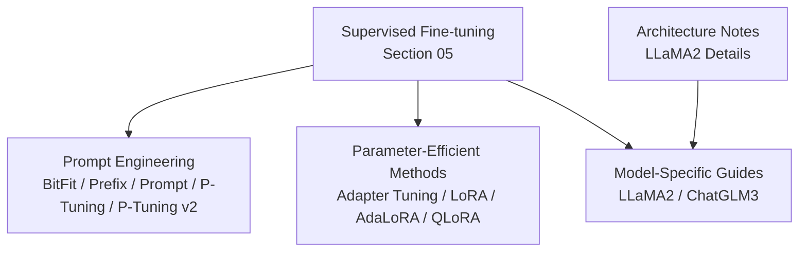
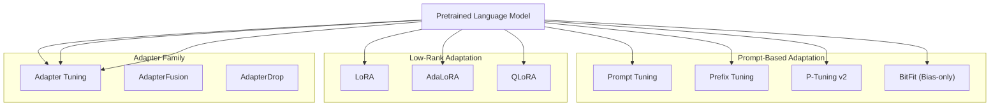
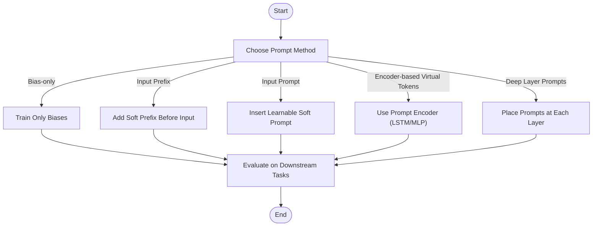
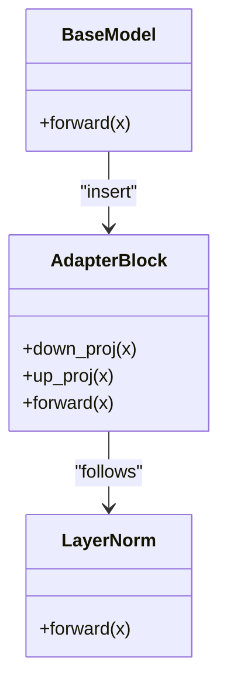
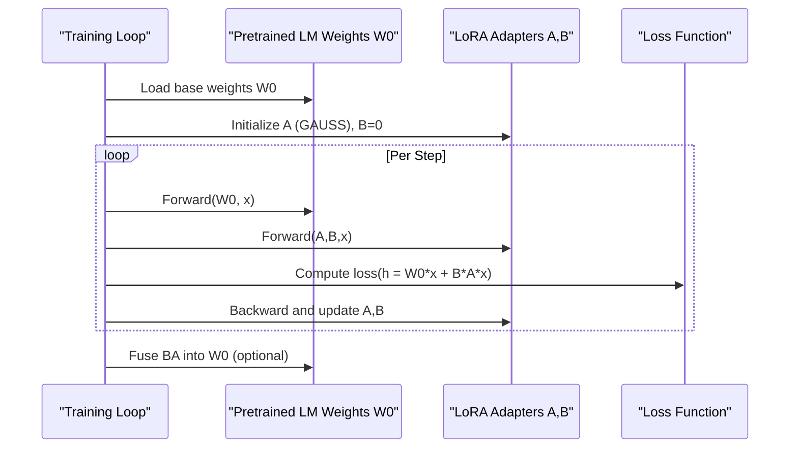
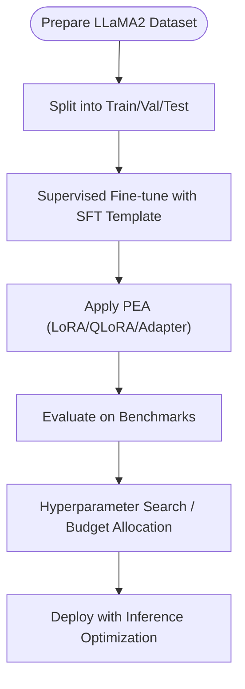
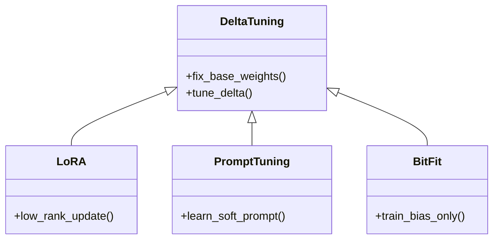
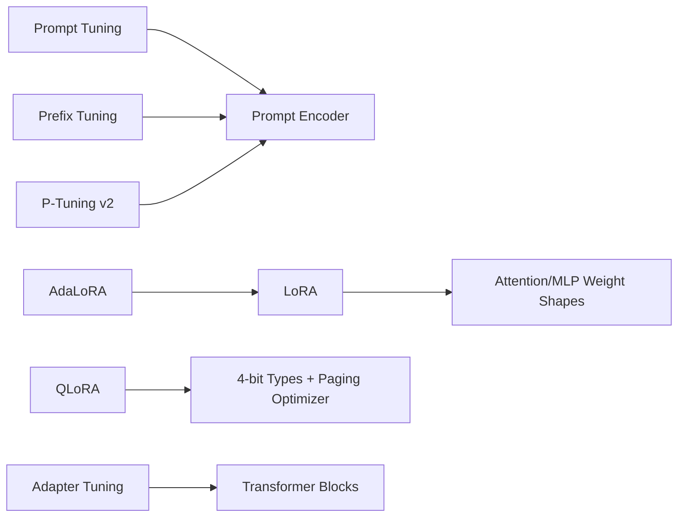

# Fine-tuning Strategies

<cite>
**Referenced Files in This Document**
- [README.md](file://05.有监督微调/README.md)
- [2.prompting.md](file://05.有监督微调/2.prompting/2.prompting.md)
- [4.lora.md](file://05.有监督微调/4.lora/4.lora.md)
- [5.总结.md](file://05.有监督微调/5.总结/5.总结.md)
- [llama2微调.md](file://05.有监督微调/llama2微调/llama2微调.md)
- [ChatGLM3微调.md](file://05.有监督微调/ChatGLM3微调/ChatGLM3微调.md)
- [llama系列模型.md](file://02.大语言模型架构/llama系列模型/llama系列模型.md)
- [4.Prompt Tuning & Delta Tuning.md](file://98.相关课程/清华大模型公开课/4.Prompt Tuning & Delta Tuning/4.Prompt Tuning & Delta Tuning.md)
</cite>

## Table of Contents
1. [Introduction](#introduction)
2. [Project Structure](#project-structure)
3. [Core Components](#core-components)
4. [Architecture Overview](#architecture-overview)
5. [Detailed Component Analysis](#detailed-component-analysis)
6. [Dependency Analysis](#dependency-analysis)
7. [Performance Considerations](#performance-considerations)
8. [Troubleshooting Guide](#troubleshooting-guide)
9. [Conclusion](#conclusion)
10. [Appendices](#appendices)

## Introduction
This document consolidates supervised fine-tuning (SFT) and parameter-efficient adaptation (PEA) strategies from the repository. It explains fundamental concepts, prompt engineering techniques, adapter tuning, and LoRA (including AdaLoRA and QLoRA). It also documents model-specific strategies for LLaMA2 and ChatGLM3, best practices, evaluation and monitoring approaches, practical implementation pointers, common pitfalls and solutions, performance optimization techniques, and guidance for method selection under computational constraints.

## Project Structure
The repository organizes fine-tuning content under a dedicated section with focused topics:
- Supervised fine-tuning theory and practice
- Prompt engineering techniques (BitFit, Prefix Tuning, Prompt Tuning, P-Tuning, P-Tuning v2)
- Parameter-efficient methods (Adapter Tuning, LoRA, AdaLoRA, QLoRA)
- Model-specific micro-guides for LLaMA2 and ChatGLM3
- Comparative summaries and best practices

**Section sources**
- [README.md:1-30](file://05.有监督微调/README.md#L1-L30)

## Core Components
- Supervised fine-tuning fundamentals and prompting paradigms
- Adapter tuning and fusion/drop variants
- LoRA, AdaLoRA, and QLoRA mechanisms
- Model-specific guidance for LLaMA2 and ChatGLM3
- Comparative characteristics and best practices

**Section sources**
- [2.prompting.md:1-173](file://05.有监督微调/2.prompting/2.prompting.md#L1-L173)
- [4.lora.md:1-114](file://05.有监督微调/4.lora/4.lora.md#L1-L114)
- [5.总结.md:1-135](file://05.有监督微调/5.总结/5.总结.md#L1-L135)

## Architecture Overview
The repository’s fine-tuning architecture centers on two families:
- Prompt-based adaptation: freezing base weights and training soft prompts or virtual prefixes.
- Low-rank adaptation: injecting trainable low-rank updates alongside base weights, optionally quantized for memory efficiency.

[No sources needed since this diagram shows conceptual workflow, not actual code structure]

## Detailed Component Analysis

### Supervised Fine-tuning Basics and Prompt Engineering
- BitFit: trains only bias parameters (attention/query/key/value merge, MLP bias, LayerNorm bias) to achieve near-adapter performance with minimal parameters.
- Prefix Tuning: injects continuous, task-specific prefixes before inputs; often uses an MLP to stabilize training; impacts sequence length and adds compute overhead.
- Prompt Tuning: simpler variant of prefix tuning, inserting learnable soft prompts at input; scales toward full fine-tuning with larger models.
- P-Tuning: embeds learnable virtual tokens with an encoder (e.g., LSTM+MLP) to model inter-token dependencies; improves convergence and robustness.
- P-Tuning v2: extends P-Tuning by placing prompts at every layer, enabling deeper influence, multi-task pretraining, flexible prompt lengths, and compatibility with sequence labeling tasks.

**Section sources**
- [2.prompting.md:1-173](file://05.有监督微调/2.prompting/2.prompting.md#L1-L173)

### Adapter Tuning Implementation
- Injects adapter modules inside Transformer blocks; during training, only adapters and LayerNorm parameters are updated while base weights remain frozen.
- Pros: strong performance; Cons: introduces extra inference latency due to adapter modules.

**Section sources**
- [5.总结.md:52-71](file://05.有监督微fun/5.总结/5.总结.md#L52-L71)

### LoRA (Low-Rank Adaptation), AdaLoRA, and QLoRA
- LoRA: decomposes weight updates ΔW into low-rank factors BA (r << d), initialized so BA≈0 at start; can be fused into base weights post-training for zero-inference-cost adaptation.
- AdaLoRA: adaptively allocates budget across matrices by importance scores; employs truncated SVD-like updates with regularization to stabilize training.
- QLoRA: enables 4-bit efficient fine-tuning by combining 4-bit normal float quantization and double quantization with a 16-bit compute dtype; uses a paging optimizer to mitigate memory peaks.

**Section sources**
- [4.lora.md:1-114](file://05.有监督微调/4.lora/4.lora.md#L1-L114)

### Model-Specific Strategies

#### LLaMA2
- LLaMA2 introduces Grouped Query Attention (GQA) and enhanced FFN scaling compared to original LLaMA, along with increased context window and more training data.
- Practical implication: when adapting LLaMA2, consider GQA-friendly attention heads and FFN dimensionality; leverage LoRA/QLoRA for parameter efficiency and memory footprint reduction.

**Section sources**
- [llama系列模型.md:212-246](file://02.大语言模型架构/llama系列模型/llama系列模型.md#L212-L246)

#### ChatGLM3
- The repository links to official tutorials and community guides for deployment and fine-tuning ChatGLM3, including function call, code interpreter, and agent capabilities.
- Practical guidance: follow official tutorials for environment setup, dataset preparation, and adapter/LoRA configurations tailored to ChatGLM3’s architecture.

**Section sources**
- [ChatGLM3微调.md:1-12](file://05.有监督微调/ChatGLM3微调/ChatGLM3微调.md#L1-L12)

### Unified Perspective on Delta Tuning
- The repository’s course material unifies various delta-tuning methods (low-rank, virtual prompts, partial-parameter updates) under a single framework, emphasizing that they all fix base weights and tune small delta components.

**Section sources**
- [4.Prompt Tuning & Delta Tuning.md:464-526](file://98.相关课程/清华大模型公开课/4.Prompt Tuning & Delta Tuning/4.Prompt Tuning & Delta Tuning.md#L464-L526)

## Dependency Analysis
- Prompt-based methods depend on embedding/tokenization and optional encoders (e.g., LSTM+MLP for P-Tuning).
- LoRA/AdaLoRA/QLoRA depend on base model weight shapes and attention/MLP matrices; QLoRA additionally depends on quantization data types and optimizer paging.
- Adapter family depends on Transformer block structure and LayerNorm placement.

[No sources needed since this diagram shows conceptual relationships, not specific code structure]

## Performance Considerations
- Parameter efficiency: LoRA/QLoRA/AdaLoRA reduce trainable parameters; BitFit trains tiny bias subsets; Prompt-based methods vary in prompt token count and depth.
- Memory footprint: QLoRA significantly reduces GPU memory; Adapter increases inference latency; Prefix/Prompt methods consume sequence length and may slow training.
- Scalability: Larger models benefit more from prompt-based methods; LoRA remains effective across scales.
- Training stability: Using encoders (e.g., MLP/LSTM) in prompt methods improves convergence; AdaLoRA stabilizes via budget allocation and orthogonal regularization.

[No sources needed since this section provides general guidance]

## Troubleshooting Guide
- Poor convergence in prompt methods:
  - Add a small MLP or LSTM encoder before prompts (as in Prefix/P-Tuning).
  - Reduce prompt length for simple tasks; increase for complex ones.
- Excessive memory usage:
  - Prefer QLoRA for 4-bit fine-tuning with paging optimizer.
  - Use LoRA with smaller ranks; avoid full model fine-tuning.
- Adapter latency:
  - Consider AdapterDrop to remove adapters dynamically during inference.
- Mixed results across tasks:
  - Try P-Tuning v2 with multi-task pretraining and task-specific prompt lengths.
- Evaluation drift:
  - Monitor validation metrics and early-stopping; adjust learning rate and batch size accordingly.

**Section sources**
- [2.prompting.md:145-161](file://05.有监督微调/2.prompting/2.prompting.md#L145-L161)
- [4.lora.md:64-77](file://05.有监督微调/4.lora/4.lora.md#L64-L77)
- [5.总结.md:68-71](file://05.有监督微调/5.总结/5.总结.md#L68-L71)

## Conclusion
The repository presents a comprehensive set of supervised and parameter-efficient fine-tuning strategies. Prompt-based methods offer flexibility and reduced storage but may impact sequence length and training dynamics. LoRA-based methods (including AdaLoRA and QLoRA) provide strong performance with minimal trainable parameters and zero-inference-cost fusion or 4-bit memory efficiency. Adapter methods remain powerful but add runtime overhead. For LLaMA2 and ChatGLM3, align adapter/LoRA choices with model attention and FFN characteristics, and follow official tutorials for environment and configuration. Select methods based on computational constraints, task complexity, and deployment needs.

[No sources needed since this section summarizes without analyzing specific files]

## Appendices

### Best Practices Checklist
- Start with prompt-based methods for rapid iteration and small datasets.
- Switch to LoRA/QLoRA for larger models and constrained memory scenarios.
- Use Adapter family when full expressiveness is needed but accept inference cost.
- Employ multi-task pretraining and adaptive prompt lengths for robustness.
- Monitor validation metrics and tune learning rates and batch sizes.

[No sources needed since this section provides general guidance]

### Practical Implementation Pointers
- Use official tutorials for model-specific setups (e.g., ChatGLM3).
- Apply SFT templates aligned with instruction-following datasets.
- Configure LoRA ranks and QLoRA quantization types per hardware capacity.
- Evaluate on domain-relevant benchmarks; track hallucination and accuracy trade-offs.

**Section sources**
- [llama2微调.md:1-4](file://05.有监督微调/llama2微调/llama2微调.md#L1-L4)
- [ChatGLM3微调.md:1-12](file://05.有监督微调/ChatGLM3微调/ChatGLM3微调.md#L1-L12)