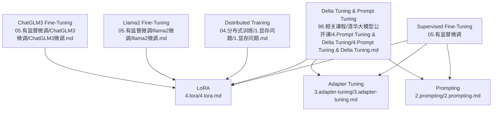
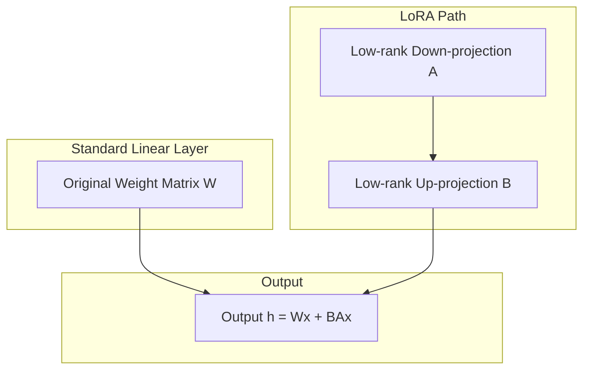
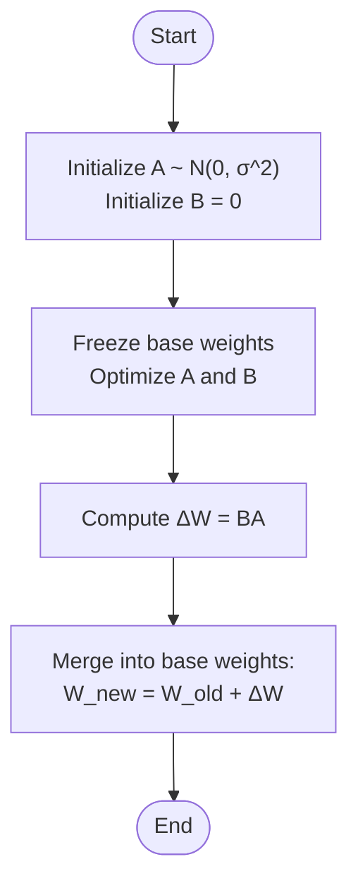
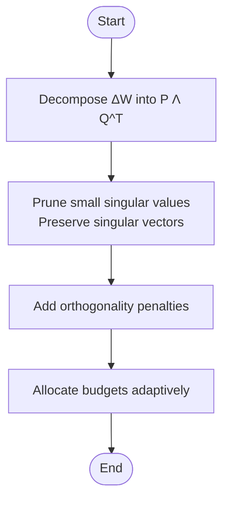
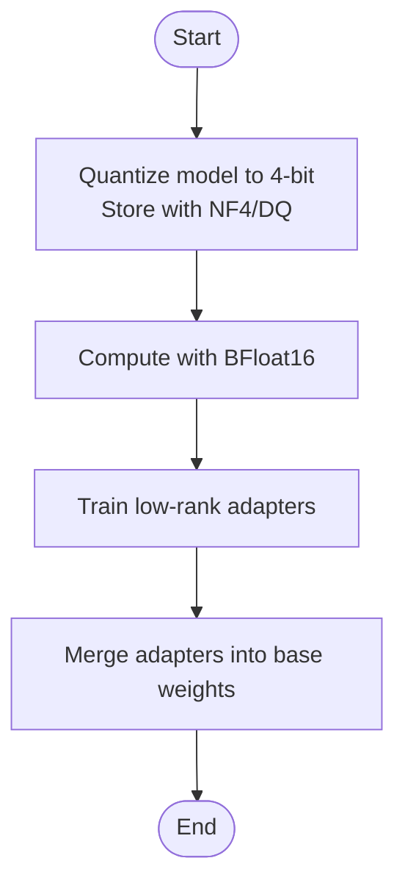
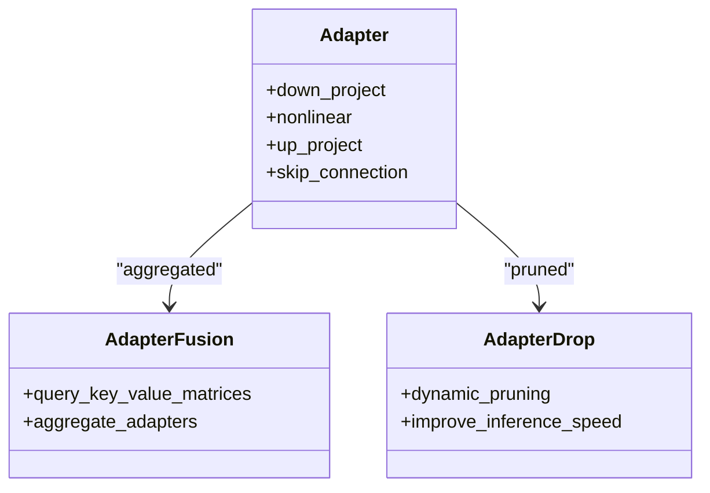
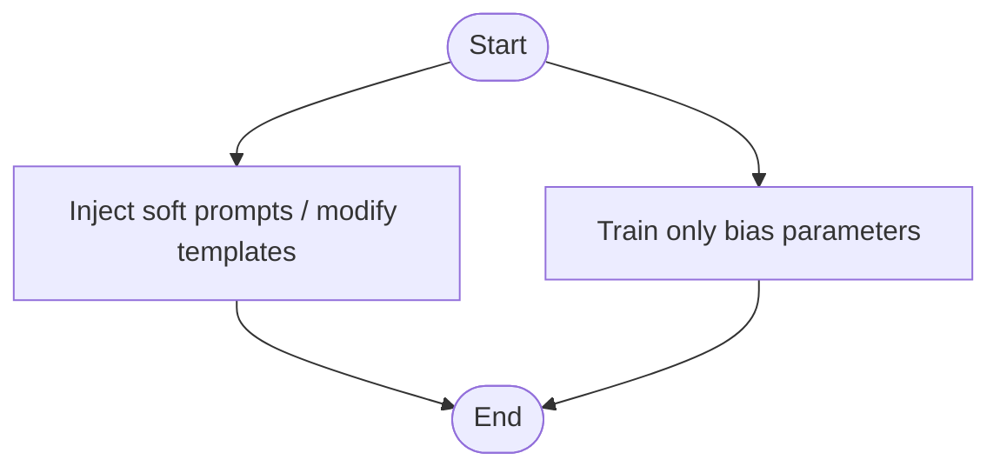
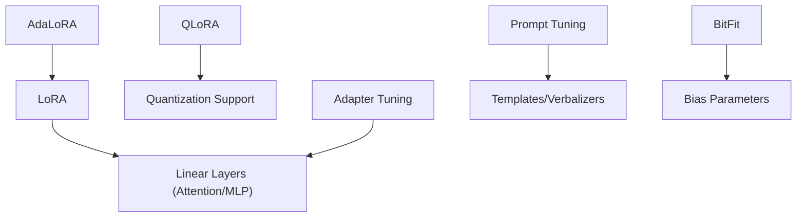
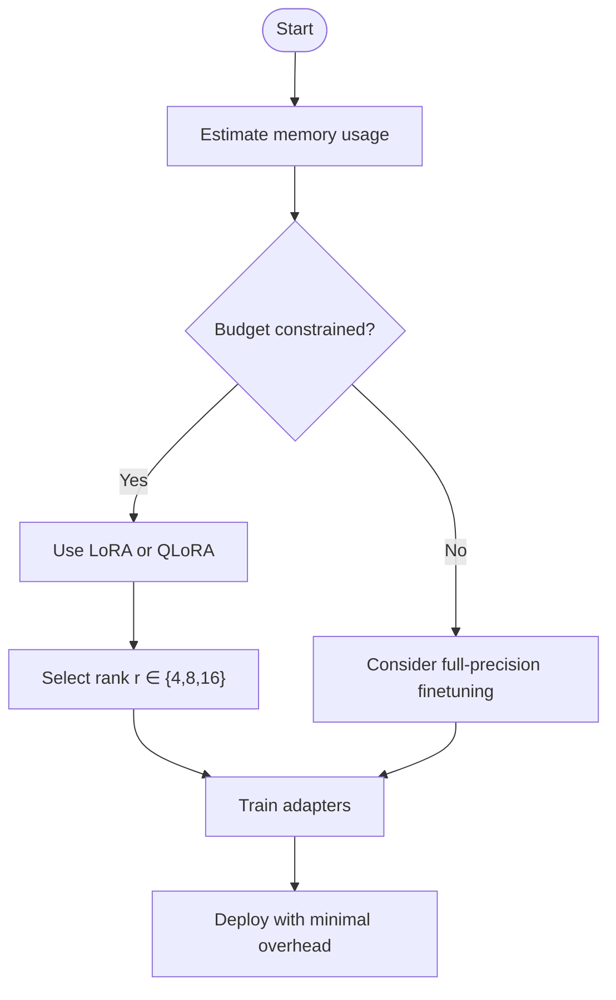

# Parameter-Efficient Tuning Techniques

<cite>
**Referenced Files in This Document**
- [4.lora.md](file://05.有监督微调/4.lora/4.lora.md)
- [README.md](file://05.有监督微调/README.md)
- [3.adapter-tuning.md](file://05.有监督微调/3.adapter-tuning/3.adapter-tuning.md)
- [2.prompting.md](file://05.有监督微调/2.prompting/2.prompting.md)
- [4.Prompt Tuning & Delta Tuning.md](file://98.相关课程/清华大模型公开课/4.Prompt Tuning & Delta Tuning/4.Prompt Tuning & Delta Tuning.md)
- [1.显存问题.md](file://04.分布式训练/1.显存问题/1.显存问题.md)
- [llama2微调.md](file://05.有监督微调/llama2微调/llama2微调.md)
- [ChatGLM3微调.md](file://05.有监督微调/ChatGLM3微调/ChatGLM3微调.md)
</cite>

## Table of Contents
1. [Introduction](#introduction)
2. [Project Structure](#project-structure)
3. [Core Components](#core-components)
4. [Architecture Overview](#architecture-overview)
5. [Detailed Component Analysis](#detailed-component-analysis)
6. [Dependency Analysis](#dependency-analysis)
7. [Performance Considerations](#performance-considerations)
8. [Troubleshooting Guide](#troubleshooting-guide)
9. [Conclusion](#conclusion)
10. [Appendices](#appendices)

## Introduction
This document explains parameter-efficient tuning techniques with a focus on Low-Rank Adaptation (LoRA). It covers the mathematical foundations of low-rank decomposition, practical rank selection strategies, and memory efficiency benefits. It documents LoRA implementation details including matrix factorization, trainable parameter initialization, and scaling factors. Step-by-step implementation guidance is provided with configuration parameters and integration patterns. Comparative analysis with other parameter-efficient methods (Adapter Tuning, Prompt Tuning, BitFit, AdaLoRA, QLoRA) is included, along with optimal use cases and performance considerations. A troubleshooting guide addresses common issues such as rank selection, convergence problems, and compatibility considerations.

## Project Structure
The repository organizes materials around supervised fine-tuning and parameter-efficient methods. The LoRA-focused content resides under the supervised fine-tuning section, complemented by related delta-tuning and prompt-learning materials.

**Diagram sources**
- [4.lora.md:1-114](file://05.有监督微调/4.lora/4.lora.md#L1-L114)
- [3.adapter-tuning.md:1-165](file://05.有监督微调/3.adapter-tuning/3.adapter-tuning.md#L1-L165)
- [2.prompting.md:1-40](file://05.有监督微调/2.prompting/2.prompting.md#L1-L40)
- [4.Prompt Tuning & Delta Tuning.md:407-508](file://98.相关课程/清华大模型公开课/4.Prompt Tuning & Delta Tuning/4.Prompt Tuning & Delta Tuning.md#L407-L508)
- [1.显存问题.md:1-23](file://04.分布式训练/1.显存问题/1.显存问题.md#L1-L23)
- [llama2微调.md:1-4](file://05.有监督微调/llama2微调/llama2微调.md#L1-L4)
- [ChatGLM3微调.md:1-12](file://05.有监督微调/ChatGLM3微调/ChatGLM3微调.md#L1-L12)

**Section sources**
- [README.md:1-30](file://05.有监督微调/README.md#L1-L30)

## Core Components
- LoRA: Low-rank adaptation via matrix factorization to simulate incremental weight updates with minimal trainable parameters.
- Adapter Tuning: Inserts small adapter modules into Transformer layers to enable task-specific adaptation while freezing base weights.
- Prompt Tuning: Injects soft prompts or modifies templates to steer model behavior without updating backbone weights.
- BitFit: Trains only bias parameters for efficient fine-tuning on simple tasks.
- AdaLoRA: Dynamically allocates parameter budget across matrices based on importance scores.
- QLoRA: Efficient finetuning of quantized models using low-bit storage and higher-precision computation.

**Section sources**
- [4.lora.md:1-114](file://05.有监督微调/4.lora/4.lora.md#L1-L114)
- [3.adapter-tuning.md:1-165](file://05.有监督微调/3.adapter-tuning/3.adapter-tuning.md#L1-L165)
- [2.prompting.md:1-40](file://05.有监督微调/2.prompting/2.prompting.md#L1-L40)
- [4.Prompt Tuning & Delta Tuning.md:407-508](file://98.相关课程/清华大模型公开课/4.Prompt Tuning & Delta Tuning/4.Prompt Tuning & Delta Tuning.md#L407-L508)

## Architecture Overview
The LoRA architecture augments standard linear layers with two low-rank matrices A and B. During training, only A and B are optimized while base weights remain frozen. At inference, the learned BA update is added to the original weights, yielding a new effective weight without extra compute.

**Diagram sources**
- [4.lora.md:9-27](file://05.有监督微调/4.lora/4.lora.md#L9-L27)

## Detailed Component Analysis

### LoRA: Mathematical Foundations and Implementation
- Mathematical foundation: LoRA assumes incremental weight updates ΔW can be approximated by a low-rank matrix BA, i.e., ΔW ≈ BA, where rank(BA) = r << d. This reduces parameter count from d×d to d×r + r×d.
- Initialization: A is initialized via Gaussian distribution; B is initialized to zero to ensure no initial perturbation.
- Application scope: Primarily targets attention-weight matrices (Wq, Wk, Wv, Wo) and often focuses on Wq and Wv for best results.
- Rank selection: Typical ranks are 4, 8, or 16; increasing rank does not necessarily improve performance if the budget is fixed.
- Memory efficiency: Training cost scales with r²d rather than d², enabling training on limited hardware.

**Diagram sources**
- [4.lora.md:21-27](file://05.有监督微调/4.lora/4.lora.md#L21-L27)

**Section sources**
- [4.lora.md:5-41](file://05.有监督微调/4.lora/4.lora.md#L5-L41)

### AdaLoRA: Adaptive Budget Allocation
- Motivation: LoRA fixes rank r globally; AdaLoRA dynamically allocates budgets across matrices based on importance to capture finer task-specific signals and prevent overfitting.
- Approach: Parameterize ΔW via singular-value decomposition (SVD) and prune less important singular values while preserving singular vectors. Add orthogonality penalties to stabilize training and reduce SVD overhead.
- Benefits: Improved performance across budgets and datasets compared to baseline methods.

**Diagram sources**
- [4.lora.md:64-77](file://05.有监督微调/4.lora/4.lora.md#L64-L77)

**Section sources**
- [4.lora.md:43-79](file://05.有监督微调/4.lora/4.lora.md#L43-L79)

### QLoRA: Efficient Finetuning of Quantized LLMs
- Motivation: Full-precision finetuning of large models is memory-intensive; QLoRA enables finetuning of 4-bit quantized models with near-full-precision performance.
- Method: Uses 4-bit NormalFloat (NF4) and double quantization to reduce storage; employs a low-precision storage dtype with higher-precision computation (e.g., BFloat16); introduces a paged optimizer to handle memory spikes during gradient checkpointing.
- Results: Achieves performance comparable to full-precision finetuning with significant memory savings.

**Diagram sources**
- [4.lora.md:81-114](file://05.有监督微调/4.lora/4.lora.md#L81-L114)

**Section sources**
- [4.lora.md:81-114](file://05.有监督微调/4.lora/4.lora.md#L81-L114)

### Adapter Tuning: Incremental Modules
- Insertion: Two feed-forward sublayers (down-project and up-project) inserted after attention and FFN blocks; skip connections ensure identity-like behavior initially.
- Effectiveness: Achieves near-full-precision performance with 0.5%–8% additional parameters.
- Variants: AdapterFusion aggregates multiple adapters; AdapterDrop prunes adapters to improve inference speed; MAM Adapter unifies approaches; UniPELT gates multiple methods.

**Diagram sources**
- [3.adapter-tuning.md:13-95](file://05.有监督微调/3.adapter-tuning/3.adapter-tuning.md#L13-L95)

**Section sources**
- [3.adapter-tuning.md:1-165](file://05.有监督微调/3.adapter-tuning/3.adapter-tuning.md#L1-L165)

### Prompt Tuning and BitFit: Specification-Based Methods
- Prompt Tuning: Injects soft prompts or modifies templates to steer model behavior; can be combined with pretraining to improve generalization.
- BitFit: Trains only bias parameters; effective for simple tasks and achieves near-full-precision performance with minimal parameters.

**Diagram sources**
- [2.prompting.md:1-40](file://05.有监督微调/2.prompting/2.prompting.md#L1-L40)
- [4.Prompt Tuning & Delta Tuning.md:362-404](file://98.相关课程/清华大模型公开课/4.Prompt Tuning & Delta Tuning/4.Prompt Tuning & Delta Tuning.md#L362-L404)

**Section sources**
- [2.prompting.md:1-40](file://05.有监督微调/2.prompting/2.prompting.md#L1-L40)
- [4.Prompt Tuning & Delta Tuning.md:407-508](file://98.相关课程/清华大模型公开课/4.Prompt Tuning & Delta Tuning/4.Prompt Tuning & Delta Tuning.md#L407-L508)

## Dependency Analysis
- LoRA depends on the underlying linear layer structure of Transformer blocks (attention and MLP).
- Adapter Tuning depends on module insertion points within Transformer layers.
- Prompt Tuning and BitFit depend on template design and bias parameter availability.
- QLoRA depends on quantization support and mixed-precision computation.

**Diagram sources**
- [4.lora.md:29-37](file://05.有监督微调/4.lora/4.lora.md#L29-L37)
- [3.adapter-tuning.md:13-31](file://05.有监督微调/3.adapter-tuning/3.adapter-tuning.md#L13-L31)
- [2.prompting.md:20-33](file://05.有监督微调/2.prompting/2.prompting.md#L20-L33)
- [4.Prompt Tuning & Delta Tuning.md:407-508](file://98.相关课程/清华大模型公开课/4.Prompt Tuning & Delta Tuning/4.Prompt Tuning & Delta Tuning.md#L407-L508)

**Section sources**
- [4.lora.md:29-37](file://05.有监督微调/4.lora/4.lora.md#L29-L37)
- [3.adapter-tuning.md:13-31](file://05.有监督微调/3.adapter-tuning/3.adapter-tuning.md#L13-L31)
- [2.prompting.md:20-33](file://05.有监督微调/2.prompting/2.prompting.md#L20-L33)
- [4.Prompt Tuning & Delta Tuning.md:407-508](file://98.相关课程/清华大模型公开课/4.Prompt Tuning & Delta Tuning/4.Prompt Tuning & Delta Tuning.md#L407-L508)

## Performance Considerations
- Memory footprint: LoRA reduces parameter count from d×d to d×r + r×d, significantly lowering memory usage during training and enabling finetuning on limited GPUs.
- Hardware constraints: For extremely large models (e.g., 65B parameters), full-precision finetuning requires substantial GPU memory; LoRA and QLoRA enable feasible training on consumer-grade GPUs.
- Practical guidance: Choose ranks 4, 8, or 16 depending on budget; increase rank cautiously as it may not improve performance if the budget is fixed.

**Diagram sources**
- [1.显存问题.md:7-11](file://04.分布式训练/1.显存问题/1.显存问题.md#L7-L11)
- [4.lora.md:37-41](file://05.有监督微调/4.lora/4.lora.md#L37-L41)

**Section sources**
- [1.显存问题.md:7-11](file://04.分布式训练/1.显存问题/1.显存问题.md#L7-L11)
- [4.lora.md:37-41](file://05.有监督微调/4.lora/4.lora.md#L37-L41)

## Troubleshooting Guide
- Rank selection: If performance plateaus or degrades, reduce rank to avoid overfitting; ensure sufficient capacity for the task.
- Convergence issues: Initialize A with Gaussian noise and B as zeros; monitor training loss and adjust learning rate or warmup schedule.
- Compatibility: Verify that target layers (e.g., attention weights) are supported; ensure quantization backend supports mixed-precision computation for QLoRA.
- Integration patterns: For Llama2 and ChatGLM3, integrate LoRA adapters alongside existing training pipelines; validate adapter merging and deployment steps.

**Section sources**
- [4.lora.md:21-27](file://05.有监督微调/4.lora/4.lora.md#L21-L27)
- [llama2微调.md:1-4](file://05.有监督微调/llama2微调/llama2微调.md#L1-L4)
- [ChatGLM3微调.md:1-12](file://05.有监督微调/ChatGLM3微调/ChatGLM3微调.md#L1-L12)

## Conclusion
LoRA provides a principled, memory-efficient approach to adapting large language models by modeling incremental updates as low-rank transformations. Combined with variants like AdaLoRA and QLoRA, practitioners can tailor parameter budgets and computational precision to meet diverse hardware and performance constraints. Prompt Tuning and BitFit offer complementary specification-based strategies for scenarios where incremental modules or bias-only updates are preferred. Integrating these methods into production pipelines requires careful rank selection, initialization, and compatibility checks.

## Appendices
- Implementation references:
  - LoRA training and inference mechanics: [4.lora.md:9-27](file://05.有监督微调/4.lora/4.lora.md#L9-L27)
  - Adapter Tuning module structure and variants: [3.adapter-tuning.md:13-95](file://05.有监督微调/3.adapter-tuning/3.adapter-tuning.md#L13-L95)
  - Prompt Tuning and BitFit fundamentals: [2.prompting.md:1-40](file://05.有监督微调/2.prompting/2.prompting.md#L1-L40), [4.Prompt Tuning & Delta Tuning.md:407-508](file://98.相关课程/清华大模型公开课/4.Prompt Tuning & Delta Tuning/4.Prompt Tuning & Delta Tuning.md#L407-L508)
  - QLoRA quantization and mixed-precision pipeline: [4.lora.md:81-114](file://05.有监督微调/4.lora/4.lora.md#L81-L114)
  - Hardware memory constraints and LoRA/QLoRA feasibility: [1.显存问题.md:7-11](file://04.分布式训练/1.显存问题/1.显存问题.md#L7-L11)
  - Practical integration pointers for Llama2 and ChatGLM3: [llama2微调.md:1-4](file://05.有监督微调/llama2微调/llama2微调.md#L1-L4), [ChatGLM3微调.md:1-12](file://05.有监督微调/ChatGLM3微调/ChatGLM3微调.md#L1-L12)