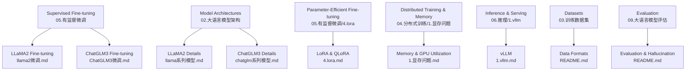
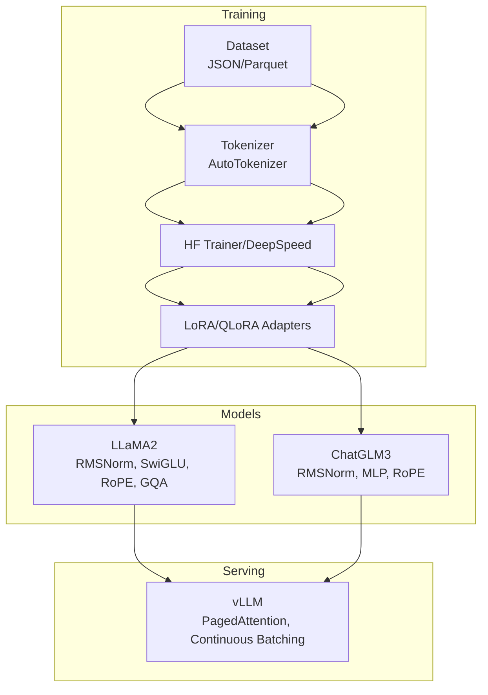
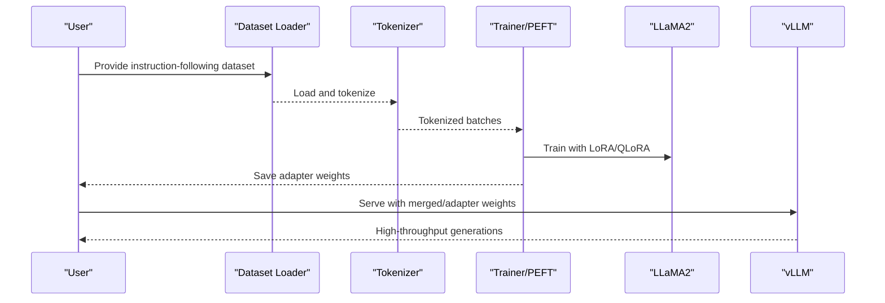
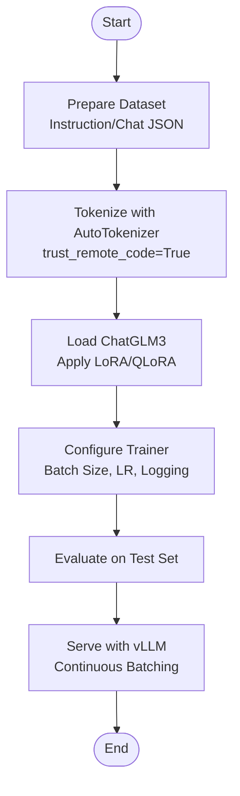
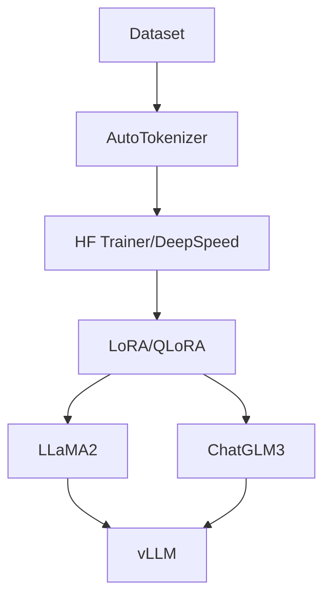

# Practical Fine-tuning Examples

<cite>
**Referenced Files in This Document**
- [README.md](file://05.有监督微调/README.md)
- [ChatGLM3微调.md](file://05.有监督微调/ChatGLM3微调/ChatGLM3微调.md)
- [llama2微调.md](file://05.有监督微调/llama2微调/llama2微调.md)
- [llama系列模型.md](file://02.大语言模型架构/llama系列模型/llama系列模型.md)
- [chatglm系列模型.md](file://02.大语言模型架构/chatglm系列模型/chatglm系列模型.md)
- [4.lora.md](file://05.有监督微调/4.lora/4.lora.md)
- [1.显存问题.md](file://04.分布式训练/1.显存问题/1.显存问题.md)
- [1.vllm.md](file://06.推理/1.vllm/1.vllm.md)
- [README.md](file://03.训练数据集/README.md)
- [README.md](file://09.大语言模型评估/README.md)
</cite>

## Table of Contents
1. [Introduction](#introduction)
2. [Project Structure](#project-structure)
3. [Core Components](#core-components)
4. [Architecture Overview](#architecture-overview)
5. [Detailed Component Analysis](#detailed-component-analysis)
6. [Dependency Analysis](#dependency-analysis)
7. [Performance Considerations](#performance-considerations)
8. [Troubleshooting Guide](#troubleshooting-guide)
9. [Conclusion](#conclusion)
10. [Appendices](#appendices)

## Introduction
This document provides practical, step-by-step fine-tuning workflows for LLaMA2 and ChatGLM3 with model-specific strategies. It covers dataset preparation, training pipeline configurations, tokenizer adaptations, hardware optimization, and inference acceleration. It also includes evaluation procedures, performance benchmarks, debugging strategies, and production deployment considerations. The goal is to enable practitioners to reproduce reliable fine-tuning outcomes and deploy efficient serving stacks.

## Project Structure
The repository organizes knowledge around supervised fine-tuning, model architectures, distributed training, and inference. The relevant sections for fine-tuning are:
- Supervised fine-tuning overview and links to model-specific guides
- Model architecture details for LLaMA2 and ChatGLM3
- Parameter-efficient fine-tuning (LoRA, QLoRA)
- Distributed training and memory optimization
- Inference frameworks (vLLM)
- Dataset formats and evaluation references

**Diagram sources**
- [README.md:1-30](file://05.有监督微调/README.md#L1-L30)
- [llama2微调.md:1-4](file://05.有监督微调/llama2微调/llama2微调.md#L1-L4)
- [ChatGLM3微调.md:1-12](file://05.有监督微调/ChatGLM3微调/ChatGLM3微调.md#L1-L12)
- [llama系列模型.md:1-292](file://02.大语言模型架构/llama系列模型/llama系列模型.md#L1-L292)
- [chatglm系列模型.md:1-214](file://02.大语言模型架构/chatglm系列模型/chatglm系列模型.md#L1-L214)
- [4.lora.md:1-114](file://05.有监督微调/4.lora/4.lora.md#L1-L114)
- [1.显存问题.md:1-70](file://04.分布式训练/1.显存问题/1.显存问题.md#L1-L70)
- [1.vllm.md:1-220](file://06.推理/1.vllm/1.vllm.md#L1-L220)
- [README.md:1-8](file://03.训练数据集/README.md#L1-L8)
- [README.md:1-12](file://09.大语言模型评估/README.md#L1-L12)

**Section sources**
- [README.md:1-30](file://05.有监督微调/README.md#L1-L30)
- [README.md:1-8](file://03.训练数据集/README.md#L1-L8)
- [README.md:1-12](file://09.大语言模型评估/README.md#L1-L12)

## Core Components
- Supervised fine-tuning overview and model-specific guides
- Model architecture specifics for LLaMA2 and ChatGLM3
- Parameter-efficient fine-tuning (LoRA, QLoRA)
- Distributed training and memory optimization
- Inference framework (vLLM)
- Dataset formats and evaluation references

**Section sources**
- [README.md:1-30](file://05.有监督微调/README.md#L1-L30)
- [llama系列模型.md:1-292](file://02.大语言模型架构/llama系列模型/llama系列模型.md#L1-L292)
- [chatglm系列模型.md:1-214](file://02.大语言模型架构/chatglm系列模型/chatglm系列模型.md#L1-L214)
- [4.lora.md:1-114](file://05.有监督微调/4.lora/4.lora.md#L1-L114)
- [1.显存问题.md:1-70](file://04.分布式训练/1.显存问题/1.显存问题.md#L1-L70)
- [1.vllm.md:1-220](file://06.推理/1.vllm/1.vllm.md#L1-L220)
- [README.md:1-8](file://03.训练数据集/README.md#L1-L8)
- [README.md:1-12](file://09.大语言模型评估/README.md#L1-L12)

## Architecture Overview
This section maps the end-to-end fine-tuning and serving stack for both LLaMA2 and ChatGLM3, highlighting tokenizer adaptations, PEFT strategies, and inference acceleration.

**Diagram sources**
- [llama系列模型.md:1-292](file://02.大语言模型架构/llama系列模型/llama系列模型.md#L1-L292)
- [chatglm系列模型.md:1-214](file://02.大语言模型架构/chatglm系列模型/chatglm系列模型.md#L1-L214)
- [4.lora.md:1-114](file://05.有监督微调/4.lora/4.lora.md#L1-L114)
- [1.vllm.md:1-220](file://06.推理/1.vllm/1.vllm.md#L1-L220)

## Detailed Component Analysis

### LLaMA2 Fine-tuning Workflow
- Step 1: Environment and dependencies
  - Install Python packages and frameworks (e.g., transformers, accelerate, deepspeed, bitsandbytes for QLoRA).
  - Prepare GPU environment and check memory capacity.
- Step 2: Dataset preparation
  - Use instruction-following datasets (e.g., Alpaca-style JSON with keys for instruction, input, output).
  - Split into train/validation sets; ensure balanced coverage of domains.
- Step 3: Tokenizer adaptation
  - Use AutoTokenizer with trust_remote_code enabled.
  - Align padding side and add special tokens if needed.
- Step 4: Model and PEFT setup
  - Load base LLaMA2 model with appropriate dtype and device placement.
  - Enable LoRA adapters on attention projections (Q, V) with low rank (e.g., 4–16).
  - For 4-bit training, configure QLoRA with NF4 and paged optimizer.
- Step 5: Training configuration
  - Configure batch sizes, gradient accumulation, learning rate schedules, and logging.
  - Use DeepSpeed or HF Accelerate for mixed precision and gradient checkpointing.
- Step 6: Evaluation
  - Evaluate on held-out test sets; measure metrics aligned with task (e.g., BLEU, perplexity, human eval).
- Step 7: Inference and serving
  - Merge adapters to base weights or serve with adapters loaded.
  - Use vLLM for continuous batching and PagedAttention to maximize throughput.

**Diagram sources**
- [llama2微调.md:1-4](file://05.有监督微调/llama2微调/llama2微调.md#L1-L4)
- [llama系列模型.md:1-292](file://02.大语言模型架构/llama系列模型/llama系列模型.md#L1-L292)
- [4.lora.md:1-114](file://05.有监督微调/4.lora/4.lora.md#L1-L114)
- [1.vllm.md:1-220](file://06.推理/1.vllm/1.vllm.md#L1-L220)

**Section sources**
- [llama2微调.md:1-4](file://05.有监督微调/llama2微调/llama2微调.md#L1-L4)
- [llama系列模型.md:212-247](file://02.大语言模型架构/llama系列模型/llama系列模型.md#L212-L247)
- [4.lora.md:81-114](file://05.有监督微调/4.lora/4.lora.md#L81-L114)
- [1.vllm.md:1-220](file://06.推理/1.vllm/1.vllm.md#L1-L220)

### ChatGLM3 Fine-tuning Workflow
- Step 1: Environment and dependencies
  - Install transformers and accelerate; prepare GPU memory for full or adapter-based fine-tuning.
- Step 2: Dataset preparation
  - Use instruction-following or chat-style datasets; ensure conversational turns are properly formatted.
- Step 3: Tokenizer adaptation
  - Use AutoTokenizer with trust_remote_code; align padding and special tokens per model’s vocabulary.
- Step 4: Model and PEFT setup
  - Load ChatGLM3; apply LoRA adapters to attention projections.
  - For memory-constrained scenarios, consider QLoRA with 4-bit quantization.
- Step 5: Training configuration
  - Adjust batch size, gradient accumulation, and learning rate; enable gradient checkpointing.
  - Monitor GPU utilization and memory footprint.
- Step 6: Evaluation
  - Evaluate on domain-specific benchmarks; measure coherence, relevance, and instruction adherence.
- Step 7: Inference and serving
  - Serve via vLLM for continuous batching and PagedAttention to improve throughput.

**Diagram sources**
- [ChatGLM3微调.md:1-12](file://05.有监督微调/ChatGLM3微调/ChatGLM3微调.md#L1-L12)
- [chatglm系列模型.md:1-214](file://02.大语言模型架构/chatglm系列模型/chatglm系列模型.md#L1-L214)
- [4.lora.md:1-114](file://05.有监督微调/4.lora/4.lora.md#L1-L114)
- [1.vllm.md:1-220](file://06.推理/1.vllm/1.vllm.md#L1-L220)

**Section sources**
- [ChatGLM3微调.md:1-12](file://05.有监督微调/ChatGLM3微调/ChatGLM3微调.md#L1-L12)
- [chatglm系列模型.md:97-106](file://02.大语言模型架构/chatglm系列模型/chatglm系列模型.md#L97-L106)
- [4.lora.md:1-114](file://05.有监督微调/4.lora/4.lora.md#L1-L114)
- [1.vllm.md:1-220](file://06.推理/1.vllm/1.vllm.md#L1-L220)

### Model-Specific Considerations
- LLaMA2
  - Architecture: RMSNorm, SwiGLU feed-forward, RoPE positional embeddings, Grouped Query Attention (GQA).
  - Implications: Prefer attention-based adapters; leverage GQA for faster inference post-training.
- ChatGLM3
  - Architecture: RMSNorm, MLP with Swish-like gating, RoPE; decoder-only structure.
  - Implications: Adapter targets on attention and MLP; careful vocabulary/tokenizer alignment.

**Section sources**
- [llama系列模型.md:11-101](file://02.大语言模型架构/llama系列模型/llama系列模型.md#L11-L101)
- [chatglm系列模型.md:97-106](file://02.大语言模型架构/chatglm系列模型/chatglm系列模型.md#L97-L106)

### Tokenizer Adaptations
- Use AutoTokenizer with trust_remote_code enabled for both models.
- Ensure pad_token and eos_token are set appropriately.
- Align max_length and padding behavior with training and inference needs.

**Section sources**
- [chatglm系列模型.md:109-118](file://02.大语言模型架构/chatglm系列模型/chatglm系列模型.md#L109-L118)

### Hardware Optimization Strategies
- Memory footprint estimation: roughly 2X GB per billion parameters at half precision; training requires ~3–4X for activation and optimizer states.
- Reduce memory pressure with gradient checkpointing, gradient accumulation, and mixed precision.
- Use QLoRA to enable 4-bit training with minimal accuracy loss.
- Monitor GPU utilization via flops profiling and throughput estimation.

**Section sources**
- [1.显存问题.md:5-18](file://04.分布式训练/1.显存问题/1.显存问题.md#L5-L18)
- [4.lora.md:81-114](file://05.有监督微调/4.lora/4.lora.md#L81-L114)

### Inference Acceleration Techniques
- vLLM: continuous batching and PagedAttention reduce KV-cache fragmentation and increase throughput.
- Serve with tensor parallelism and compatible OpenAI-compatible APIs.

**Section sources**
- [1.vllm.md:1-220](file://06.推理/1.vllm/1.vllm.md#L1-L220)

### Dataset Preparation and Curation
- Data formats: instruction-following JSON with instruction, input, output; ensure balanced domains.
- Quality assessment: manual sampling, toxicity checks, instruction coverage metrics.
- Iterative improvement: A/B testing of prompts, synthetic data augmentation, and human evaluations.

**Section sources**
- [README.md:1-8](file://03.训练数据集/README.md#L1-L8)
- [README.md:1-12](file://09.大语言模型评估/README.md#L1-L12)

## Dependency Analysis
Fine-tuning pipelines depend on tokenizer libraries, PEFT modules, training frameworks, and inference engines.

**Diagram sources**
- [4.lora.md:1-114](file://05.有监督微调/4.lora/4.lora.md#L1-L114)
- [llama系列模型.md:1-292](file://02.大语言模型架构/llama系列模型/llama系列模型.md#L1-L292)
- [chatglm系列模型.md:1-214](file://02.大语言模型架构/chatglm系列模型/chatglm系列模型.md#L1-L214)
- [1.vllm.md:1-220](file://06.推理/1.vllm/1.vllm.md#L1-L220)

**Section sources**
- [4.lora.md:1-114](file://05.有监督微调/4.lora/4.lora.md#L1-L114)
- [llama系列模型.md:1-292](file://02.大语言模型架构/llama系列模型/llama系列模型.md#L1-L292)
- [chatglm系列模型.md:1-214](file://02.大语言模型架构/chatglm系列模型/chatglm系列模型.md#L1-L214)
- [1.vllm.md:1-220](file://06.推理/1.vllm/1.vllm.md#L1-L220)

## Performance Considerations
- Throughput and GPU utilization: estimate using throughput and flops profiling; compare against published baselines.
- Memory optimization: gradient checkpointing, gradient accumulation, mixed precision, QLoRA.
- Serving: continuous batching and PagedAttention in vLLM to maximize KV-cache efficiency.

**Section sources**
- [1.显存问题.md:13-18](file://04.分布式训练/1.显存问题/1.显存问题.md#L13-L18)
- [1.vllm.md:55-151](file://06.推理/1.vllm/1.vllm.md#L55-L151)

## Troubleshooting Guide
- OOM during training: reduce batch size, enable gradient checkpointing, switch to QLoRA, and monitor optimizer states.
- Low GPU utilization: profile kernels and flops; adjust micro-batches and enable tensor cores.
- Tokenizer mismatches: ensure pad/eos tokens and vocab alignment; validate max_length and padding behavior.
- Serving bottlenecks: adopt continuous batching and PagedAttention; tune KV block sizes and worker topology.

**Section sources**
- [1.显存问题.md:13-70](file://04.分布式训练/1.显存问题/1.显存问题.md#L13-L70)
- [1.vllm.md:55-151](file://06.推理/1.vllm/1.vllm.md#L55-L151)

## Conclusion
By following the structured workflows outlined here—covering dataset preparation, model-specific tokenizer adaptations, PEFT strategies (LoRA/QLoRA), distributed training optimizations, and efficient inference with vLLM—you can reliably fine-tune LLaMA2 and ChatGLM3 for real-world applications. Adopt iterative evaluation and production-grade serving to achieve strong performance and scalability.

## Appendices
- References to model-specific guides and architecture details are provided throughout for quick navigation.