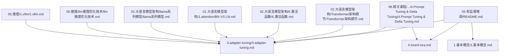
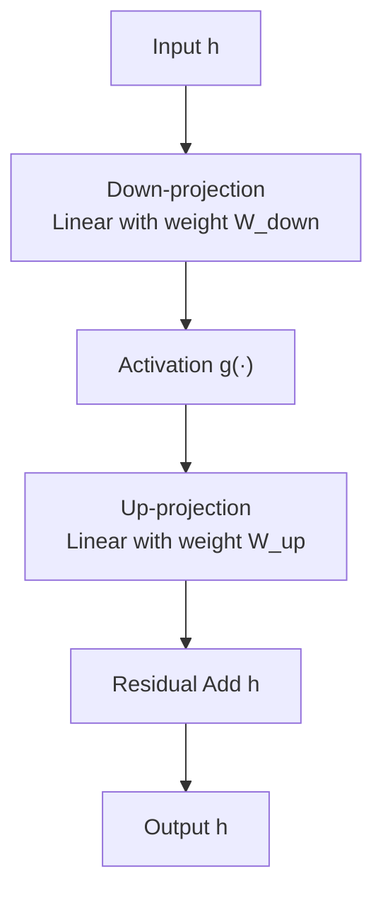
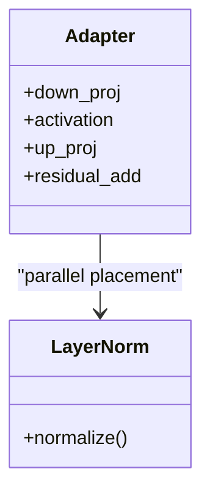
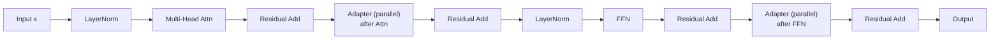
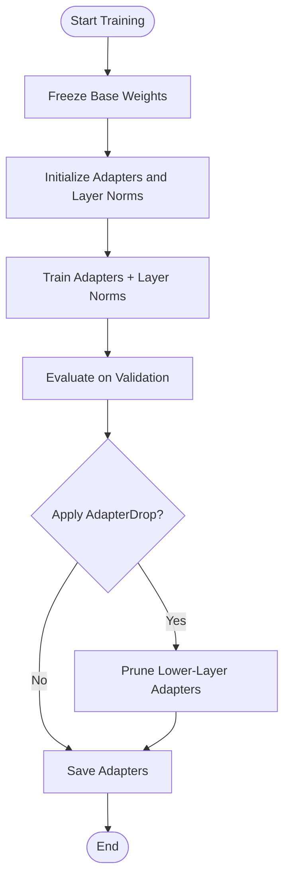
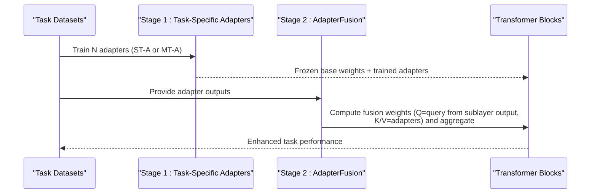
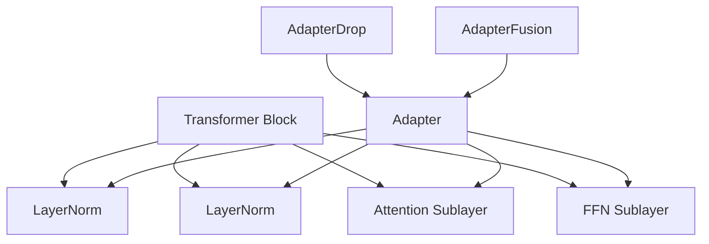

# Adapter Tuning

<cite>
**Referenced Files in This Document**
- [05.有监督微调/3.adapter-tuning/3.adapter-tuning.md](file://05.有监督微调/3.adapter-tuning/3.adapter-tuning.md)
- [98.相关课程/清华大模型公开课/4.Prompt Tuning & Delta Tuning/4.Prompt Tuning & Delta Tuning.md](file://98.相关课程/清华大模型公开课/4.Prompt Tuning & Delta Tuning/4.Prompt Tuning & Delta Tuning.md)
- [05.有监督微调/1.基本概念/1.基本概念.md](file://05.有监督微调/1.基本概念/1.基本概念.md)
- [05.有监督微调/4.lora/4.lora.md](file://05.有监督微调/4.lora/4.lora.md)
- [02.大语言模型架构/Transformer架构细节/Transformer架构细节.md](file://02.大语言模型架构/Transformer架构细节/Transformer架构细节.md)
- [02.大语言模型架构/6.激活函数/6.激活函数.md](file://02.大语言模型架构/6.激活函数/6.激活函数.md)
- [02.大语言模型架构/1.attention/BN VS LN.md](file://02.大语言模型架构/1.attention/BN VS LN.md)
- [02.大语言模型架构/llama系列模型/llama系列模型.md](file://02.大语言模型架构/llama系列模型/llama系列模型.md)
- [06.推理/llm推理优化技术/llm推理优化技术.md](file://06.推理/llm推理优化技术/llm推理优化技术.md)
- [06.推理/1.vllm/1.vllm.md](file://06.推理/1.vllm/1.vllm.md)
- [05.有监督微调/README.md](file://05.有监督微调/README.md)
</cite>

## Table of Contents
1. [Introduction](#introduction)
2. [Project Structure](#project-structure)
3. [Core Components](#core-components)
4. [Architecture Overview](#architecture-overview)
5. [Detailed Component Analysis](#detailed-component-analysis)
6. [Dependency Analysis](#dependency-analysis)
7. [Performance Considerations](#performance-considerations)
8. [Troubleshooting Guide](#troubleshooting-guide)
9. [Conclusion](#conclusion)
10. [Appendices](#appendices)

## Introduction
This document presents a comprehensive methodology for adapter tuning in transformer-based language models. It synthesizes theoretical foundations, adapter architecture design, implementation strategies, and performance optimization techniques. It also compares adapter tuning with other parameter-efficient fine-tuning (PEFT) methods, analyzes memory efficiency and deployment considerations, and covers advanced topics such as adapter compression, multi-task adapter learning, and adapter sharing for resource-constrained environments.

## Project Structure
The repository organizes adapter-related materials under supervised fine-tuning and related course notes. The primary sources for adapter tuning methodology are:
- Adapter Tuning fundamentals and variants (AdapterFusion, AdapterDrop, MAM Adapter, UniPELT)
- Delta Tuning taxonomy and representative methods (Adapter, Prefix Tuning, BitFit, LoRA)
- General PEFT concepts and best practices
- Transformer architecture and activation functions
- Related PEFT methods (LoRA, AdaLoRA, QLoRA) for comparative analysis

**Diagram sources**
- [05.有监督微调/README.md:1-30](file://05.有监督微调/README.md#L1-L30)
- [05.有监督微调/3.adapter-tuning/3.adapter-tuning.md:1-165](file://05.有监督微调/3.adapter-tuning/3.adapter-tuning.md#L1-L165)
- [98.相关课程/清华大模型公开课/4.Prompt Tuning & Delta Tuning/4.Prompt Tuning & Delta Tuning.md:430-462](file://98.相关课程/清华大模型公开课/4.Prompt Tuning & Delta Tuning/4.Prompt Tuning & Delta Tuning.md#L430-L462)
- [05.有监督微调/4.lora/4.lora.md:1-114](file://05.有监督微调/4.lora/4.lora.md#L1-L114)
- [05.有监督微调/1.基本概念/1.基本概念.md:1-85](file://05.有监督微调/1.基本概念/1.基本概念.md#L1-L85)
- [02.大语言模型架构/Transformer架构细节/Transformer架构细节.md:1-228](file://02.大语言模型架构/Transformer架构细节/Transformer架构细节.md#L1-L228)
- [02.大语言模型架构/6.激活函数/6.激活函数.md:1-29](file://02.大语言模型架构/6.激活函数/6.激活函数.md#L1-L29)
- [02.大语言模型架构/1.attention/BN VS LN.md:1-107](file://02.大语言模型架构/1.attention/BN VS LN.md#L1-L107)
- [02.大语言模型架构/llama系列模型/llama系列模型.md:27-62](file://02.大语言模型架构/llama系列模型/llama系列模型.md#L27-L62)
- [06.推理/llm推理优化技术/llm推理优化技术.md:132-271](file://06.推理/llm推理优化技术/llm推理优化技术.md#L132-L271)
- [06.推理/1.vllm/1.vllm.md:41-51](file://06.推理/1.vllm/1.vllm.md#L41-L51)

**Section sources**
- [05.有监督微调/README.md:1-30](file://05.有监督微调/README.md#L1-L30)

## Core Components
- Adapter architecture: Two-feedforward sub-layers with a bottleneck dimension m ≪ d, followed by an activation and up-projection, with residual connection to preserve identity mapping during initialization.
- Placement strategies: Inserted after multi-head attention projection and after the feed-forward network (FFN) sublayer; parallel placement generally outperforms sequential placement.
- Training procedure: Freeze base transformer weights; train only adapter parameters and layer norm parameters; optional fusion heads for multi-task composition.
- Regularization and efficiency: AdapterDrop prunes adapters from lower layers to accelerate inference; AdapterFusion aggregates multiple adapters via attention-like composition.

**Section sources**
- [05.有监督微调/3.adapter-tuning/3.adapter-tuning.md:13-31](file://05.有监督微调/3.adapter-tuning/3.adapter-tuning.md#L13-L31)
- [05.有监督微调/3.adapter-tuning/3.adapter-tuning.md:33-67](file://05.有监督微调/3.adapter-tuning/3.adapter-tuning.md#L33-L67)
- [05.有监督微调/3.adapter-tuning/3.adapter-tuning.md:69-95](file://05.有监督微调/3.adapter-tuning/3.adapter-tuning.md#L69-L95)
- [98.相关课程/清华大模型公开课/4.Prompt Tuning & Delta Tuning/4.Prompt Tuning & Delta Tuning.md:430-446](file://98.相关课程/清华大模型公开课/4.Prompt Tuning & Delta Tuning/4.Prompt Tuning & Delta Tuning.md#L430-L446)

## Architecture Overview
The adapter module is inserted in parallel to the transformer sublayers. It downsamples activations to a bottleneck dimension, applies a nonlinearity, upsamples back to the original dimension, and adds a residual connection to the input.

**Diagram sources**
- [05.有监督微调/3.adapter-tuning/3.adapter-tuning.md:21-29](file://05.有监督微调/3.adapter-tuning/3.adapter-tuning.md#L21-L29)
- [98.相关课程/清华大模型公开课/4.Prompt Tuning & Delta Tuning/4.Prompt Tuning & Delta Tuning.md:430-438](file://98.相关课程/清华大模型公开课/4.Prompt Tuning & Delta Tuning/4.Prompt Tuning & Delta Tuning.md#L430-L438)

## Detailed Component Analysis

### Adapter Module Design and Implementation
- Bottleneck dimension m: Controls adapter parameter count; typical m ≪ d.
- Activation function: Nonlinearities applied after down-projection; commonly ReLU or GELU; SwiGLU is used in modern transformer FFNs.
- Trainable parameters: Only adapter weights and layer norm parameters; base transformer frozen.
- Initialization: Zero-initialized up-projection and small-scale initialization for down-projection to maintain near-identity behavior initially.

**Diagram sources**
- [05.有监督微调/3.adapter-tuning/3.adapter-tuning.md:21-29](file://05.有监督微调/3.adapter-tuning/3.adapter-tuning.md#L21-L29)
- [02.大语言模型架构/6.激活函数/6.激活函数.md:5-21](file://02.大语言模型架构/6.激活函数/6.激活函数.md#L5-L21)
- [02.大语言模型架构/llama系列模型/llama系列模型.md:48-62](file://02.大语言模型架构/llama系列模型/llama系列模型.md#L48-L62)

**Section sources**
- [05.有监督微调/3.adapter-tuning/3.adapter-tuning.md:21-29](file://05.有监督微调/3.adapter-tuning/3.adapter-tuning.md#L21-L29)
- [02.大语言模型架构/6.激活函数/6.激活函数.md:5-21](file://02.大语言模型架构/6.激活函数/6.激活函数.md#L5-L21)
- [02.大语言模型架构/llama系列模型/llama系列模型.md:48-62](file://02.大语言模型架构/llama系列模型/llama系列模型.md#L48-L62)

### Adapter Placement Strategies
- Parallel vs sequential: Parallel placement (after attention and FFN) outperforms sequential placement; FFN-parallel placement typically superior to MHA-parallel.
- Soft prompts and adapters: Prefix Tuning introduces soft tokens; adapters modify hidden states via learned projections; both are addition-based delta tuning.

**Diagram sources**
- [98.相关课程/清华大模型公开课/4.Prompt Tuning & Delta Tuning/4.Prompt Tuning & Delta Tuning.md:441-446](file://98.相关课程/清华大模型公开课/4.Prompt Tuning & Delta Tuning/4.Prompt Tuning & Delta Tuning.md#L441-L446)
- [05.有监督微调/3.adapter-tuning/3.adapter-tuning.md:13-17](file://05.有监督微调/3.adapter-tuning/3.adapter-tuning.md#L13-L17)

**Section sources**
- [98.相关课程/清华大模型公开课/4.Prompt Tuning & Delta Tuning/4.Prompt Tuning & Delta Tuning.md:441-446](file://98.相关课程/清华大模型公开课/4.Prompt Tuning & Delta Tuning/4.Prompt Tuning & Delta Tuning.md#L441-L446)
- [05.有监督微调/3.adapter-tuning/3.adapter-tuning.md:13-17](file://05.有监督微调/3.adapter-tuning/3.adapter-tuning.md#L13-L17)

### Adapter Training Procedures, Initialization, and Regularization
- Training: Freeze base transformer; optimize adapters and layer norms; optionally tune bias terms (BitFit).
- Initialization: Down-projection initialized by small-scale distribution; up-projection initialized to near-zero to preserve identity mapping.
- Regularization: AdapterDrop prunes adapters from lower layers to reduce inference overhead while maintaining performance; can prune AdapterFusion adapters post-training.

**Diagram sources**
- [05.有监督微调/3.adapter-tuning/3.adapter-tuning.md:69-95](file://05.有监督微调/3.adapter-tuning/3.adapter-tuning.md#L69-L95)
- [98.相关课程/清华大模型公开课/4.Prompt Tuning & Delta Tuning/4.Prompt Tuning & Delta Tuning.md:448-452](file://98.相关课程/清华大模型公开课/4.Prompt Tuning & Delta Tuning/4.Prompt Tuning & Delta Tuning.md#L448-L452)

**Section sources**
- [05.有监督微调/3.adapter-tuning/3.adapter-tuning.md:69-95](file://05.有监督微调/3.adapter-tuning/3.adapter-tuning.md#L69-L95)
- [98.相关课程/清华大模型公开课/4.Prompt Tuning & Delta Tuning/4.Prompt Tuning & Delta Tuning.md:448-452](file://98.相关课程/清华大模型公开课/4.Prompt Tuning & Delta Tuning/4.Prompt Tuning & Delta Tuning.md#L448-L452)

### AdapterFusion: Multi-Task Knowledge Composition
- Stage 1: Train single-task adapters (ST-A) or multi-task adapters (MT-A).
- Stage 2: Introduce AdapterFusion to combine N adapters via attention-like composition using adapter outputs as keys/values and transformer sublayer outputs as queries.

**Diagram sources**
- [05.有监督微调/3.adapter-tuning/3.adapter-tuning.md:33-67](file://05.有监督微调/3.adapter-tuning/3.adapter-tuning.md#L33-L67)

**Section sources**
- [05.有监督微调/3.adapter-tuning/3.adapter-tuning.md:33-67](file://05.有监督微调/3.adapter-tuning/3.adapter-tuning.md#L33-L67)

### Practical Implementation Examples (Code Snippet Paths)
- Adapter module construction and residual connection: [05.有监督微调/3.adapter-tuning/3.adapter-tuning.md:21-29](file://05.有监督微调/3.adapter-tuning/3.adapter-tuning.md#L21-L29)
- Adapter placement after attention and FFN: [05.有监督微调/3.adapter-tuning/3.adapter-tuning.md:13-17](file://05.有监督微调/3.adapter-tuning/3.adapter-tuning.md#L13-L17)
- AdapterDrop pruning strategy: [05.有监督微调/3.adapter-tuning/3.adapter-tuning.md:69-95](file://05.有监督微调/3.adapter-tuning/3.adapter-tuning.md#L69-L95)
- AdapterFusion composition: [05.有监督微调/3.adapter-tuning/3.adapter-tuning.md:59-67](file://05.有监督微调/3.adapter-tuning/3.adapter-tuning.md#L59-L67)
- Delta Tuning taxonomy (Adapter, Prefix Tuning, BitFit): [98.相关课程/清华大模型公开课/4.Prompt Tuning & Delta Tuning/4.Prompt Tuning & Delta Tuning.md:430-452](file://98.相关课程/清华大模型公开课/4.Prompt Tuning & Delta Tuning/4.Prompt Tuning & Delta Tuning.md#L430-L452)
- LoRA low-rank adaptation (for comparative baseline): [05.有监督微调/4.lora/4.lora.md:1-42](file://05.有监督微调/4.lora/4.lora.md#L1-L42)

**Section sources**
- [05.有监督微调/3.adapter-tuning/3.adapter-tuning.md:13-67](file://05.有监督微调/3.adapter-tuning/3.adapter-tuning.md#L13-L67)
- [98.相关课程/清华大模型公开课/4.Prompt Tuning & Delta Tuning/4.Prompt Tuning & Delta Tuning.md:430-452](file://98.相关课程/清华大模型公开课/4.Prompt Tuning & Delta Tuning/4.Prompt Tuning & Delta Tuning.md#L430-L452)
- [05.有监督微调/4.lora/4.lora.md:1-42](file://05.有监督微调/4.lora/4.lora.md#L1-L42)

## Dependency Analysis
- Adapter tuning depends on transformer block internals (attention, FFN) and layer normalization.
- Activation choices influence adapter expressiveness; modern transformers employ SwiGLU in FFN.
- AdapterDrop relies on adapter placement order; pruning lower layers yields stronger inference speedups.
- AdapterFusion depends on adapter outputs and transformer sublayer outputs for attention-like composition.

**Diagram sources**
- [05.有监督微调/3.adapter-tuning/3.adapter-tuning.md:13-67](file://05.有监督微调/3.adapter-tuning/3.adapter-tuning.md#L13-L67)
- [02.大语言模型架构/Transformer架构细节/Transformer架构细节.md:7-22](file://02.大语言模型架构/Transformer架构 detalles/Transformer架构细节.md#L7-L22)
- [02.大语言模型架构/6.激活函数/6.激活函数.md:5-21](file://02.大语言模型架构/6.激活函数/6.激活函数.md#L5-L21)

**Section sources**
- [05.有监督微调/3.adapter-tuning/3.adapter-tuning.md:13-67](file://05.有监督微调/3.adapter-tuning/3.adapter-tuning.md#L13-L67)
- [02.大语言模型架构/Transformer架构细节/Transformer架构细节.md:7-22](file://02.大语言模型架构/Transformer架构细节/Transformer架构细节.md#L7-L22)
- [02.大语言模型架构/6.激活函数/6.激活函数.md:5-21](file://02.大语言模型架构/6.激活函数/6.激活函数.md#L5-L21)

## Performance Considerations
- Parameter efficiency: Adapter tuning achieves near-full-ft performance with ~0.5%–8% trainable parameters.
- Training vs inference: Adapter training is fast; inference may incur latency due to extra modules; AdapterDrop mitigates this by pruning lower-layer adapters.
- Memory footprint: Adapters increase total parameters; however, PEFT reduces storage and enables multi-task sharing.
- Comparative baselines: LoRA and BitFit offer complementary trade-offs; QLoRA extends PEFT to 4-bit training with quantization-aware updates.

**Section sources**
- [98.相关课程/清华大模型公开课/4.Prompt Tuning & Delta Tuning/4.Prompt Tuning & Delta Tuning.md:430-438](file://98.相关课程/清华大模型公开课/4.Prompt Tuning & Delta Tuning/4.Prompt Tuning & Delta Tuning.md#L430-L438)
- [05.有监督微调/3.adapter-tuning/3.adapter-tuning.md:69-95](file://05.有监督微调/3.adapter-tuning/3.adapter-tuning.md#L69-L95)
- [05.有监督微调/4.lora/4.lora.md:81-114](file://05.有监督微调/4.lora/4.lora.md#L81-L114)

## Troubleshooting Guide
- Convergence and stability: Use residual connections to maintain identity mapping; initialize up-projection near zero; consider layer norm training alongside adapters.
- Activation mismatch: Ensure activation choice aligns with transformer FFN (e.g., GELU, SwiGLU); mismatch can degrade performance.
- Placement sensitivity: Prefer FFN-parallel adapters; avoid sequential placement unless justified by task.
- Memory-bound inference: Use AdapterDrop to prune lower layers; evaluate trade-off between speedup and accuracy.
- Quantization-aware fine-tuning: For 4-bit training, adopt NF4 and double quantization; use paging optimizers to mitigate OOM.

**Section sources**
- [05.有监督微调/3.adapter-tuning/3.adapter-tuning.md:21-29](file://05.有监督微调/3.adapter-tuning/3.adapter-tuning.md#L21-L29)
- [02.大语言模型架构/6.激活函数/6.激活函数.md:5-21](file://02.大语言模型架构/6.激活函数/6.激活函数.md#L5-L21)
- [02.大语言模型架构/llama系列模型/llama系列模型.md:48-62](file://02.大语言模型架构/llama系列模型/llama系列模型.md#L48-L62)
- [05.有监督微调/3.adapter-tuning/3.adapter-tuning.md:69-95](file://05.有监督微调/3.adapter-tuning/3.adapter-tuning.md#L69-L95)
- [05.有监督微调/4.lora/4.lora.md:81-114](file://05.有监督微调/4.lora/4.lora.md#L81-L114)

## Conclusion
Adapter tuning offers a powerful, parameter-efficient pathway to adapt large language models to downstream tasks. By inserting compact, parallel adapters after attention and FFN, freezing base weights, and training only a small subset of parameters, adapters achieve competitive performance with significantly reduced storage and improved transferability. Advanced techniques—AdapterFusion for multi-task composition, AdapterDrop for inference acceleration, and QLoRA for memory-efficient 4-bit training—further enhance practical viability. Proper activation selection, initialization, and placement strategies are essential for robust convergence and strong performance.

## Appendices

### A. Adapter vs. Other PEFT Methods
- Adapter: Addition-based delta; two-layer bottleneck; parallel placement; residual connection.
- Prefix Tuning: Soft prompts injected before hidden states; continuous prompts; addition-based.
- BitFit: Specification-based; tune only bias terms; minimal parameter change.
- LoRA: Reparameterization-based; low-rank updates to attention and FFN; quantization-friendly (QLoRA).

**Section sources**
- [98.相关课程/清华大模型公开课/4.Prompt Tuning & Delta Tuning/4.Prompt Tuning & Delta Tuning.md:430-462](file://98.相关课程/清华大模型公开课/4.Prompt Tuning & Delta Tuning/4.Prompt Tuning & Delta Tuning.md#L430-L462)
- [05.有监督微调/4.lora/4.lora.md:1-42](file://05.有监督微调/4.lora/4.lora.md#L1-L42)

### B. Deployment and Inference Optimization
- Memory-bound decoders: KV-cache and batching dominate throughput; AdapterDrop reduces compute overhead.
- Attention variants: MQA/GQA reduce KV storage; helpful for memory-bound regimes.
- Continuous batching and quantization improve throughput and enable larger batches on limited hardware.

**Section sources**
- [06.推理/1.vllm/1.vllm.md:41-51](file://06.推理/1.vllm/1.vllm.md#L41-L51)
- [06.推理/llm推理优化技术/llm推理优化技术.md:132-148](file://06.推理/llm推理优化技术/llm推理优化技术.md#L132-L148)