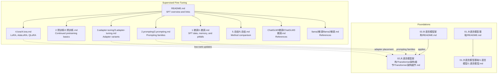
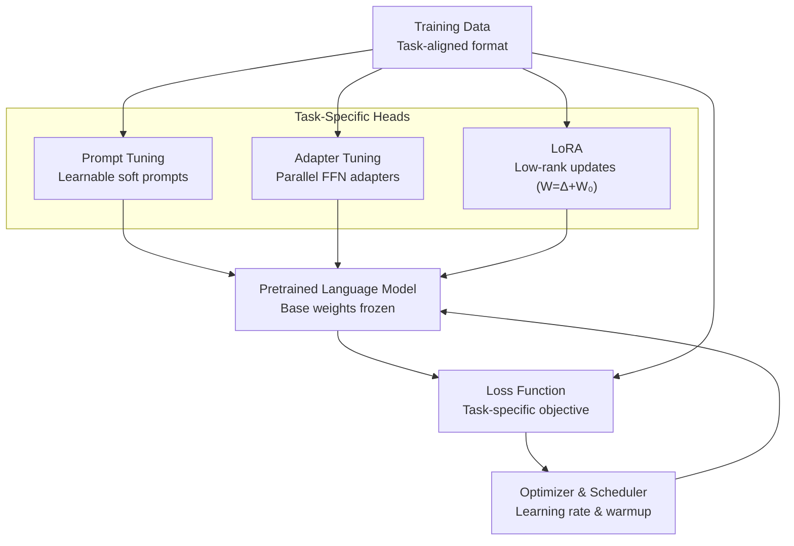
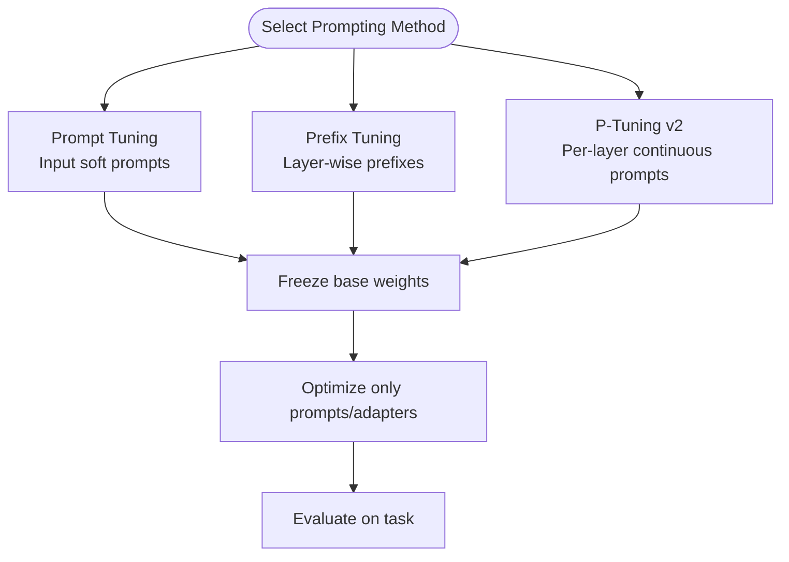
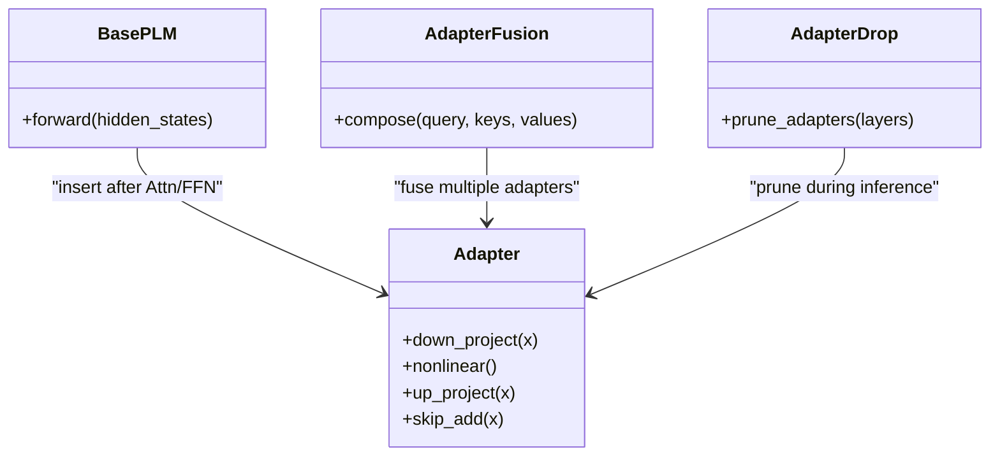
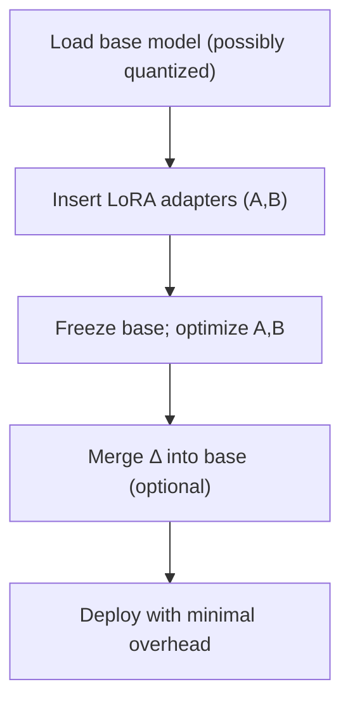
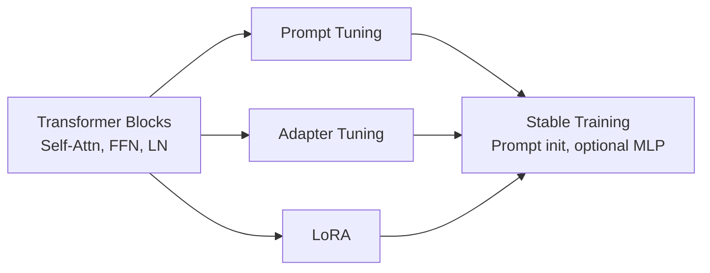
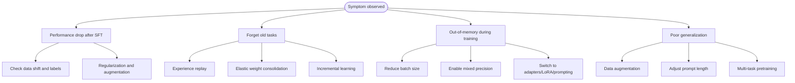

# Basic Fine-tuning Concepts

<cite>
**Referenced Files in This Document**
- [README.md](file://05.有监督微调/README.md)
- [1.微调.md](file://05.有监督微调/1.微调/1.微调.md)
- [2.预训练.md](file://05.有监督微调/2.预训练/2.预训练.md)
- [2.prompting.md](file://05.有监督微调/2.prompting/2.prompting.md)
- [3.adapter-tuning.md](file://05.有监督微调/3.adapter-tuning/3.adapter-tuning.md)
- [4.lora.md](file://05.有监督微调/4.lora/4.lora.md)
- [5.总结.md](file://05.有监督微调/5.总结/5.总结.md)
- [ChatGLM3微调.md](file://05.有监督微调/ChatGLM3微调/ChatGLM3微调.md)
- [llama2微调.md](file://05.有监督微调/llama2微调/llama2微调.md)
- [4.Prompt Tuning & Delta Tuning.md](file://98.相关课程/清华大模型公开课/4.Prompt Tuning & Delta Tuning/4.Prompt Tuning & Delta Tuning.md)
- [Transformer架构细节.md](file://02.大语言模型架构/Transformer架构细节/Transformer架构细节.md)
- [README.md](file://02.大语言模型架构/README.md)
- [README.md](file://01.大语言模型基础/README.md)
- [1.语言模型.md](file://01.大语言模型基础/1.语言模型/1.语言模型.md)
</cite>

## Table of Contents
1. [Introduction](#introduction)
2. [Project Structure](#project-structure)
3. [Core Components](#core-components)
4. [Architecture Overview](#architecture-overview)
5. [Detailed Component Analysis](#detailed-component-analysis)
6. [Dependency Analysis](#dependency-analysis)
7. [Performance Considerations](#performance-considerations)
8. [Troubleshooting Guide](#troubleshooting-guide)
9. [Conclusion](#conclusion)
10. [Appendices](#appendices)

## Introduction
This document explains the fundamentals of supervised fine-tuning (SFT) and transfer learning for large language models. It covers pre-trained model selection, task-specific heads, parameter initialization strategies, and the end-to-end fine-tuning pipeline from data preparation to evaluation. It also details loss functions, optimization strategies, convergence criteria, and practical implementation guidance. Finally, it addresses common pitfalls such as catastrophic forgetting, overfitting, and performance optimization techniques.

## Project Structure
The repository organizes materials around supervised fine-tuning and related efficient adaptation methods. The “05.有监督微调” (Supervised Fine-Tuning) section provides conceptual and practical guidance, while “02.大语言模型架构” and “01.大语言模型基础” offer foundational knowledge on model internals and language modeling.

**Diagram sources**
- [README.md:1-30](file://05.有监督微调/README.md#L1-L30)
- [1.微调.md:1-280](file://05.有监督微调/1.微调/1.微调.md#L1-L280)
- [2.预训练.md:1-37](file://05.有监督微调/2.预训练/2.预训练.md#L1-L37)
- [2.prompting.md:1-173](file://05.有监督微调/2.prompting/2.prompting.md#L1-L173)
- [3.adapter-tuning.md:1-165](file://05.有监督微调/3.adapter-tuning/3.adapter-tuning.md#L1-L165)
- [4.lora.md:1-114](file://05.有监督微调/4.lora/4.lora.md#L1-L114)
- [5.总结.md:1-135](file://05.有监督微调/5.总结/5.总结.md#L1-L135)
- [ChatGLM3微调.md:1-12](file://05.有监督微调/ChatGLM3微调/ChatGLM3微调.md#L1-L12)
- [llama2微调.md:1-4](file://05.有监督微调/llama2微调/llama2微调.md#L1-L4)
- [README.md:1-52](file://02.大语言模型架构/README.md#L1-L52)
- [Transformer架构细节.md:1-321](file://02.大语言模型架构/Transformer架构细节/Transformer架构细节.md#L1-L321)
- [README.md:1-36](file://01.大语言模型基础/README.md#L1-L36)
- [1.语言模型.md:1-215](file://01.大语言模型基础/1.语言模型/1.语言模型.md#L1-L215)

**Section sources**
- [README.md:1-30](file://05.有监督微调/README.md#L1-L30)
- [README.md:1-52](file://02.大语言模型架构/README.md#L1-L52)
- [README.md:1-36](file://01.大语言模型基础/README.md#L1-L36)

## Core Components
- Pre-trained model selection: Choose a base model aligned with task modality and scale. For generation tasks, autoregressive models are common; for understanding tasks, masked models or encoder-decoder frameworks are often used. Continued pretraining can inject domain knowledge.
- Task-specific heads: Add small, task-adapted components (e.g., classification heads, adapters, soft prompts) while freezing backbone weights for parameter efficiency.
- Initialization strategies: Freeze base weights and initialize new components (e.g., adapters, LoRA matrices) with small-scale or zero initialization to avoid disrupting pretraining dynamics.
- Data preparation: Split into train/validation/test; ensure representative coverage; align input formats with model expectations.
- Optimization and training: Select appropriate loss (e.g., cross-entropy for classification/regression, sequence losses for generation), schedule learning rates, and monitor metrics on validation.
- Evaluation: Use task-specific metrics; track overfitting and generalization.

**Section sources**
- [1.微调.md:35-46](file://05.有监督微调/1.微调/1.微调.md#L35-L46)
- [2.预训练.md:5-37](file://05.有监督微调/2.预训练/2.预训练.md#L5-L37)
- [2.prompting.md:3-35](file://05.有监督微调/2.prompting/2.prompting.md#L3-L35)
- [3.adapter-tuning.md:13-32](file://05.有监督微调/3.adapter-tuning/3.adapter-tuning.md#L13-L32)
- [4.lora.md:9-32](file://05.有监督微调/4.lora/4.lora.md#L9-L32)
- [5.总结.md:3-135](file://05.有监督微调/5.总结/5.总结.md#L3-L135)

## Architecture Overview
The fine-tuning stack integrates pre-trained language models with task-specific adaptations. Prompting families insert learnable soft prompts; adapters add lightweight MLP blocks inside Transformer layers; LoRA injects low-rank updates to attention and feed-forward weights. These methods share a common pattern: keep most base weights frozen and optimize a small subset.

**Diagram sources**
- [2.prompting.md:36-96](file://05.有监督微调/2.prompting/2.prompting.md#L36-L96)
- [3.adapter-tuning.md:13-32](file://05.有监督微调/3.adapter-tuning/3.adapter-tuning.md#L13-L32)
- [4.lora.md:9-32](file://05.有监督微调/4.lora/4.lora.md#L9-L32)
- [4.Prompt Tuning & Delta Tuning.md:407-498](file://98.相关课程/清华大模型公开课/4.Prompt Tuning & Delta Tuning/4.Prompt Tuning & Delta Tuning.md#L407-L498)

## Detailed Component Analysis

### Prompting Families (Prompt Tuning, Prefix Tuning, P-Tuning, P-Tuning v2)
- Prompt Tuning: Adds learnable soft prompts at input; trains only prompt embeddings while keeping base weights frozen. Often achieves near-full fine-tuning performance with minimal parameters.
- Prefix Tuning: Injects continuous prefixes before encoder/decoder hidden states; adds MLP regularization to stabilize training; can be extended per-layer (P-Tuning v2).
- P-Tuning/P-Tuning v2: Uses prompt encoders (e.g., LSTM+MLP) to generate continuous prompts; P-Tuning v2 extends to all layers and improves robustness across scales and tasks.

**Diagram sources**
- [2.prompting.md:75-173](file://05.有监督微调/2.prompting/2.prompting.md#L75-L173)
- [4.Prompt Tuning & Delta Tuning.md:281-392](file://98.相关课程/清华大模型公开课/4.Prompt Tuning & Delta Tuning/4.Prompt Tuning & Delta Tuning.md#L281-L392)

**Section sources**
- [2.prompting.md:3-173](file://05.有监督微调/2.prompting/2.prompting.md#L3-L173)
- [4.Prompt Tuning & Delta Tuning.md:281-392](file://98.相关课程/清华大模型公开课/4.Prompt Tuning & Delta Tuning/4.Prompt Tuning & Delta Tuning.md#L281-L392)

### Adapter Tuning and Variants (AdapterFusion, AdapterDrop)
- Adapter Tuning inserts lightweight MLP adapters after attention and FFN; keeps base weights frozen; achieves near-FT performance with tiny extra params.
- AdapterFusion aggregates multiple adapters via attention-like composition to fuse multi-task knowledge.
- AdapterDrop prunes adapters during inference to reduce latency while preserving performance.

**Diagram sources**
- [3.adapter-tuning.md:13-96](file://05.有监督微调/3.adapter-tuning/3.adapter-tuning.md#L13-L96)

**Section sources**
- [3.adapter-tuning.md:1-165](file://05.有监督微调/3.adapter-tuning/3.adapter-tuning.md#L1-L165)

### LoRA, AdaLoRA, and QLoRA
- LoRA injects low-rank updates Δ=W₁B + A(W₂) into attention and FFN weights; initializes new paths to zero to preserve base behavior at start.
- AdaLoRA dynamically allocates ranks across matrices based on importance to improve efficiency and reduce overfitting.
- QLoRA quantizes base weights to 4-bit and trains small adapter matrices; uses NF4 and dual-quantization to maintain fidelity.

**Diagram sources**
- [4.lora.md:9-42](file://05.有监督微调/4.lora/4.lora.md#L9-L42)
- [4.lora.md:64-80](file://05.有监督微调/4.lora/4.lora.md#L64-L80)
- [4.lora.md:81-114](file://05.有监督微调/4.lora/4.lora.md#L81-L114)

**Section sources**
- [4.lora.md:1-114](file://05.有监督微调/4.lora/4.lora.md#L1-L114)

### Practical Implementation Examples
- ChatGLM3 micro-instruction tuning: See curated references for deployment and instruction-tuned workflows.
- Llama2 SFT: See curated references for end-to-end SFT tutorials.

**Section sources**
- [ChatGLM3微调.md:1-12](file://05.有监督微调/ChatGLM3微调/ChatGLM3微调.md#L1-L12)
- [llama2微调.md:1-4](file://05.有监督微调/llama2微调/llama2微调.md#L1-L4)

## Dependency Analysis
- Prompting families depend on the underlying Transformer block structure (self-attention, FFN, normalization) and require careful initialization to avoid disrupting pretraining.
- Adapters rely on residual connections and layer normalization to remain stable during training.
- LoRA depends on matrix factorization assumptions and low-rank structure of weight updates.

**Diagram sources**
- [Transformer架构细节.md:1-321](file://02.大语言模型架构/Transformer架构细节/Transformer架构细节.md#L1-L321)
- [2.prompting.md:36-96](file://05.有监督微调/2.prompting/2.prompting.md#L36-L96)
- [3.adapter-tuning.md:13-32](file://05.有监督微调/3.adapter-tuning/3.adapter-tuning.md#L13-L32)
- [4.lora.md:9-32](file://05.有监督微调/4.lora/4.lora.md#L9-L32)

**Section sources**
- [Transformer架构细节.md:1-321](file://02.大语言模型架构/Transformer架构细节/Transformer架构细节.md#L1-L321)

## Performance Considerations
- Memory footprint: Full fine-tuning scales with model size × batch × sequence length. Use efficient methods (prompting, adapters, LoRA) to reduce trainable parameters.
- Mixed precision and gradient checkpointing can reduce memory usage during training.
- Batch size selection: Larger batches improve stability but increase memory; balance against available VRAM.
- Learning rate scheduling: Warmup followed by decay; task-dependent schedules may be needed for small-data regimes.
- Early stopping and validation monitoring prevent overfitting.

**Section sources**
- [1.微调.md:5-14](file://05.有监督微调/1.微调/1.微调.md#L5-L14)
- [1.微调.md:237-249](file://05.有监督微调/1.微调/1.微调.md#L237-L249)
- [1.微调.md:250-262](file://05.有监督微调/1.微调/1.微调.md#L250-L262)

## Troubleshooting Guide
- SFT degrades performance post-fine-tuning: check data shift, annotation quality, and overfitting; apply regularization and diversify data.
- Catastrophic forgetting: use replay buffers, elastic weight consolidation, incremental learning, or multi-task learning to retain prior knowledge.
- OOM errors: reduce batch size, enable mixed precision, gradient accumulation, or switch to parameter-efficient methods (LoRA, adapters, prompting).
- Poor generalization: augment data, tune prompt lengths, or adopt multi-task pretraining for robustness.

**Diagram sources**
- [1.微调.md:16-33](file://05.有监督微调/1.微调/1.微调.md#L16-L33)
- [1.微调.md:198-214](file://05.有监督微调/1.微调/1.微调.md#L198-L214)
- [1.微调.md:237-249](file://05.有监督微调/1.微调/1.微调.md#L237-L249)

**Section sources**
- [1.微调.md:16-33](file://05.有监督微调/1.微调/1.微调.md#L16-L33)
- [1.微调.md:198-214](file://05.有监督微调/1.微调/1.微调.md#L198-L214)
- [1.微调.md:237-249](file://05.有监督微调/1.微调/1.微调.md#L237-L249)

## Conclusion
Supervised fine-tuning builds upon strong pretraining to adapt models to downstream tasks. Parameter-efficient methods—prompting, adapters, and LoRA—enable effective adaptation with minimal compute and storage overhead. Proper data preparation, loss design, and optimization strategies are essential for stable convergence. Addressing catastrophic forgetting, overfitting, and memory constraints ensures robust, scalable fine-tuning pipelines.

## Appendices

### Step-by-Step SFT Pipeline
- Prepare data: collect, annotate, split, preprocess, and convert to model-friendly formats.
- Select base model: choose a model family aligned with the task (autoregressive, encoder-decoder, or masked).
- Choose method: pick a parameter-efficient approach (prompting, adapters, LoRA) or full fine-tuning.
- Initialize heads: add task-specific components with proper initialization.
- Optimize: select loss, optimizer, scheduler, and monitor validation metrics.
- Evaluate: measure task-specific metrics and compare to baselines.
- Iterate: adjust hyperparameters, data, or method until convergence.

**Section sources**
- [1.微调.md:35-46](file://05.有监督微调/1.微调/1.微调.md#L35-L46)
- [2.预训练.md:29-37](file://05.有监督微调/2.预训练/2.预训练.md#L29-L37)

### Loss Functions and Convergence Criteria
- Classification/regression: cross-entropy or MSE with label smoothing and early stopping on validation loss.
- Generation: cross-entropy over target tokens; monitor perplexity and BLEU/ROUGE for quality.
- Convergence: plateau detection on validation metric; cosine/scheduler decay; gradient norm clipping.

**Section sources**
- [1.微调.md:188-194](file://05.有监督微调/1.微调/1.微调.md#L188-L194)

### Hyperparameter Tuning Guidance
- Learning rate: grid/random search over orders of magnitude; warmup steps proportional to total steps.
- Batch size: start small, scale up to fit memory; consider gradient accumulation.
- Rank/ratio (LoRA): start with small ranks (e.g., 4–16) and increase if underfitting; prune with AdaLoRA.
- Prompt length: tune per task; shorter for simple tasks, longer for complex ones.
- Regularization: dropout, weight decay, label smoothing; data augmentation.

**Section sources**
- [4.lora.md:37-42](file://05.有监督微调/4.lora/4.lora.md#L37-L42)
- [4.lora.md:64-80](file://05.有监督微调/4.lora/4.lora.md#L64-L80)
- [2.prompting.md:165-170](file://05.有监督微调/2.prompting/2.prompting.md#L165-L170)

### Practical References
- ChatGLM3 micro-instruction tuning references
- Llama2 SFT tutorial references

**Section sources**
- [ChatGLM3微调.md:1-12](file://05.有监督微调/ChatGLM3微调/ChatGLM3微调.md#L1-L12)
- [llama2微调.md:1-4](file://05.有监督微调/llama2微调/llama2微调.md#L1-L4)