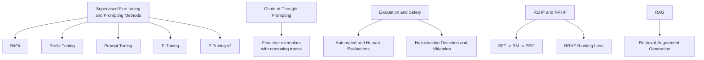
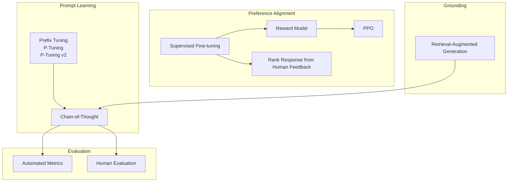
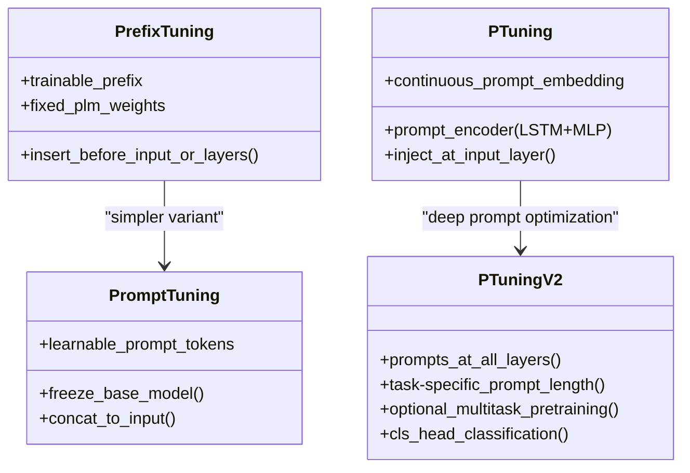
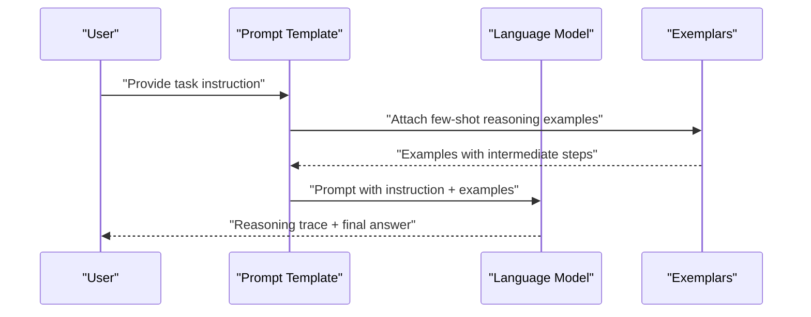
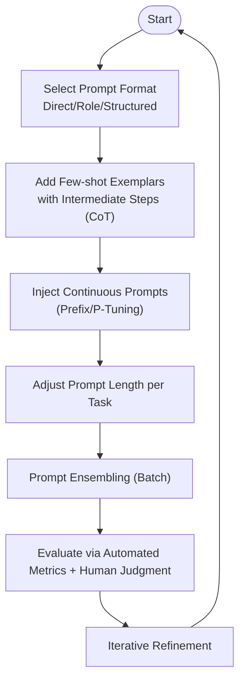
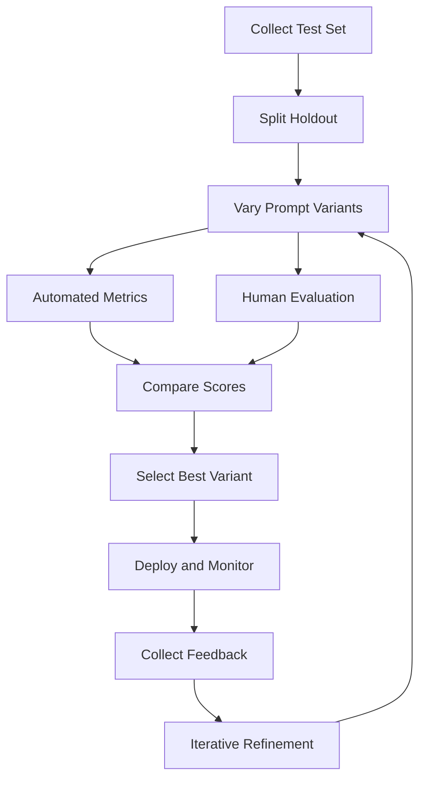
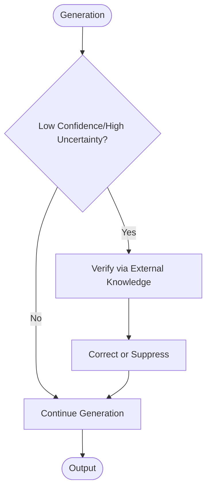
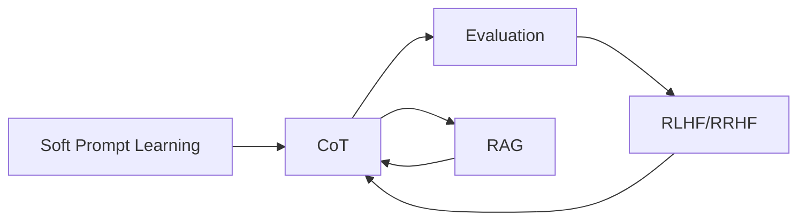

# Prompt Engineering

<cite>
**Referenced Files in This Document**
- [2.prompting.md](file://05.有监督微调/2.prompting/2.prompting.md)
- [1.思维链（cot）.md](file://10.大语言模型应用/1.思维链（cot）/1.思维链（cot）.md)
- [1.评测.md](file://09.大语言模型评估/1.评测/1.评测.md)
- [1.rlhf相关.md](file://07.强化学习\1.rlhf相关\1.rlhf相关.md)
- [rag（检索增强生成）技术.md](file://08.检索增强rag\rag（检索增强生成）技术\rag（检索增强生成）技术.md)
- [1.大模型幻觉.md](file://09.大语言模型评估\1.大模型幻觉\1.大模型幻觉.md)
- [README.md](file://05.有监督微调/README.md)
- [README.md](file://10.大语言模型应用/README.md)
</cite>

## Table of Contents
1. [Introduction](#introduction)
2. [Project Structure](#project-structure)
3. [Core Components](#core-components)
4. [Architecture Overview](#architecture-overview)
5. [Detailed Component Analysis](#detailed-component-analysis)
6. [Dependency Analysis](#dependency-analysis)
7. [Performance Considerations](#performance-considerations)
8. [Troubleshooting Guide](#troubleshooting-guide)
9. [Conclusion](#conclusion)
10. [Appendices](#appendices)

## Introduction
This document consolidates prompt engineering techniques and practices found in the repository, focusing on instruction-following, template construction, and optimization strategies grounded in the materials. It explains the theoretical basis of prompt engineering, including chain-of-thought prompting, few-shot learning, and zero-shot adaptation. It documents prompt formats such as direct instructions, role-playing prompts, and structured templates, and provides practical examples for classification, generation, and reasoning tasks. It also covers prompt evaluation metrics, A/B testing methodologies, iterative refinement, and best practices for safety, bias mitigation, and robustness testing. Advanced techniques like self-instruct and ultrafeedback are addressed conceptually, along with automatic prompt optimization strategies.

## Project Structure
The repository organizes prompt engineering knowledge across several thematic areas:
- Supervised fine-tuning and prompting methods (BitFit, Prefix Tuning, Prompt Tuning, P-Tuning, P-Tuning v2)
- Chain-of-thought prompting for reasoning
- Evaluation and safety (hallucination, honesty, harmlessness)
- Reinforcement learning from human feedback (RLHF) and ranking response from human feedback (RRHF)
- Retrieval-Augmented Generation (RAG) as a complementary technique to prompt engineering



**Section sources**
- [README.md:1-30](file://05.有监督微调/README.md#L1-L30)
- [README.md:1-10](file://10.大语言模型应用/README.md#L1-L10)

## Core Components
- Instruction-following via soft prompts and continuous prompt tokens (Prefix Tuning, P-Tuning, P-Tuning v2)
- Few-shot learning with exemplars and structured reasoning (Chain-of-Thought)
- Zero-shot adaptation through strong decoder-only architectures and natural language instructions
- Structured templates for classification, generation, and reasoning tasks
- Evaluation frameworks combining automated metrics and human judgments
- Safety and hallucination mitigation strategies
- RLHF and RRHF for aligning generations with human preferences
- RAG to ground generations in retrievable evidence

**Section sources**
- [2.prompting.md:1-173](file://05.有监督微调/2.prompting/2.prompting.md#L1-L173)
- [1.思维链（cot）.md:1-147](file://10.大语言模型应用/1.思维链（cot）/1.思维链（cot）.md#L1-L147)
- [1.评测.md:1-43](file://09.大语言模型评估/1.评测/1.评测.md#L1-L43)
- [1.rlhf相关.md:1-172](file://07.强化学习\1.rlhf相关\1.rlhf相关.md#L1-L172)
- [rag（检索增强生成）技术.md:1-73](file://08.检索增强rag\rag（检索增强生成）技术\rag（检索增强生成）技术.md#L1-L73)

## Architecture Overview
The repository’s prompt engineering ecosystem integrates:
- Soft prompt learning (continuous virtual tokens) to adapt pre-trained models without full fine-tuning
- Chain-of-thought prompting to elicit multi-step reasoning
- Evaluation pipelines combining automated metrics and human judgment
- Preference-based alignment via reward modeling and policy optimization (RLHF) or ranking (RRHF)
- Retrieval-augmented generation to reduce hallucination and improve factual grounding



**Diagram sources**
- [2.prompting.md:36-173](file://05.有监督微调/2.prompting/2.prompting.md#L36-L173)
- [1.思维链（cot）.md:1-147](file://10.大语言模型应用/1.思维链（cot）/1.思维链（cot）#.md#L1-L147)
- [1.评测.md:1-43](file://09.大语言模型评估/1.评测/1.评测.md#L1-L43)
- [1.rlhf相关.md:100-121](file://07.强化学习\1.rlhf相关\1.rlhf相关.md#L100-L121)
- [rag（检索增强生成）技术.md:1-73](file://08.检索增强rag\rag（检索增强生成）技术\rag（检索增强生成）技术.md#L1-L73)

## Detailed Component Analysis

### Instruction-Following via Soft Prompts
This component covers parameter-efficient adaptation of pre-trained models using continuous prompts:
- Prefix Tuning injects trainable virtual tokens before inputs or across encoder/decoder layers
- Prompt Tuning places learnable prompt tokens at input layer only
- P-Tuning extends to embedding-level continuous tokens with an encoder (LSTM+MLP)
- P-Tuning v2 adds prompts at every layer, improves generalization across scales and tasks



**Diagram sources**
- [2.prompting.md:36-173](file://05.有监督微调/2.prompting/2.prompting.md#L36-L173)

**Section sources**
- [2.prompting.md:36-173](file://05.有监督微调/2.prompting/2.prompting.md#L36-L173)

### Chain-of-Thought Prompting for Reasoning
CoT demonstrates that providing few-shot exemplars with explicit reasoning steps significantly improves complex reasoning tasks:
- Multi-step decomposition and demonstration of intermediate reasoning
- Improved accuracy on arithmetic, commonsense, and symbolic reasoning
- Benefits include interpretability, generalization across tasks, and reduced reliance on large-scale supervision



**Diagram sources**
- [1.思维链（cot）.md:6-54](file://10.大语言模型应用/1.思维链（cot）/1.思维链（cot）.md#L6-L54)

**Section sources**
- [1.思维链（cot）.md:6-54](file://10.大语言模型应用/1.思维链（cot）/1.思维链（cot）.md#L6-L54)

### Template Construction and Prompt Formats
Common prompt formats supported by the repository materials:
- Direct instructions: concise task statements with optional input-output examples
- Role-playing prompts: instructing the model to assume a persona or capability
- Structured templates: formalized JSON-like fields for controlled generation and extraction
- Few-shot exemplars: demonstrations of desired reasoning or output formats

These formats enable consistent instruction-following across classification, generation, and reasoning tasks.

**Section sources**
- [2.prompting.md:75-95](file://05.有监督微调/2.prompting/2.prompting.md#L75-L95)
- [1.思维链（cot）.md:6-54](file://10.大语言模型应用/1.思维链（cot）/1.思维链（cot）.md#L6-L54)

### Prompt Optimization Strategies
Repository-backed strategies include:
- Parameter-efficient prompt learning (Prefix Tuning, P-Tuning, P-Tuning v2) to avoid full fine-tuning
- Prompt ensembling within batches to approximate model averaging
- Task-specific prompt length selection and multi-task pretraining for robustness
- Structured templates and role-playing to guide outputs toward desired styles and formats



**Diagram sources**
- [2.prompting.md:89-95](file://05.有监督微调/2.prompting/2.prompting.md#L89-L95)
- [1.思维链（cot）.md:6-54](file://10.大语言模型应用/1.思维链（cot）/1.思维链（cot）.md#L6-L54)

**Section sources**
- [2.prompting.md:89-95](file://05.有监督微调/2.prompting/2.prompting.md#L89-L95)
- [1.思维链（cot）.md:6-54](file://10.大语言模型应用/1.思维链（cot）/1.思维链（cot）.md#L6-L54)

### Practical Examples by Task Type
- Classification: Use structured templates with explicit label words and role-playing to enforce consistent outputs
- Generation: Employ role-playing prompts to control tone, style, and creativity; combine with CoT for complex multi-step generation
- Reasoning: Provide few-shot exemplars with explicit intermediate reasoning steps; adjust prompt length for complexity

These examples are grounded in the repository’s materials on CoT and structured prompting.

**Section sources**
- [1.思维链（cot）.md:44-54](file://10.大语言模型应用/1.思维链（cot）/1.思维链（cot）.md#L44-L54)
- [2.prompting.md:75-95](file://05.有监督微调/2.prompting/2.prompting.md#L75-L95)

### Prompt Evaluation, A/B Testing, and Iterative Refinement
- Automated metrics: accuracy, F1, entailment/NLI-based measures, named entity matching, and model-based scorers
- Human evaluation: ChatbotArena-style pairwise comparisons, SuperCLUE, C-Eval, FlagEval
- A/B testing: compare prompt variants on held-out test sets; measure statistical significance
- Iterative refinement: adjust prompt length, add CoT exemplars, incorporate retrieval-augmented contexts, and apply preference-based alignment



**Diagram sources**
- [1.评测.md:31-43](file://09.大语言模型评估/1.评测/1.评测.md#L31-L43)

**Section sources**
- [1.评测.md:1-43](file://09.大语言模型评估/1.评测/1.评测.md#L1-L43)

### Safety, Bias Mitigation, and Robustness Testing
- Honesty principle: construct training samples that teach “don’t answer unknowns,” reducing hallucinations
- Hallucination detection and mitigation: external knowledge verification, logit-based uncertainty signals, fact-core sampling, and self-check consistency checks
- Robustness testing: evaluate under adversarial prompts, long-context scenarios, and conflicting prior knowledge vs. provided context



**Diagram sources**
- [1.大模型幻觉.md:63-78](file://09.大语言模型评估\1.大模型幻觉\1.大模型幻觉.md#L63-L78)

**Section sources**
- [1.评测.md:13-19](file://09.大语言模型评估/1.评测/1.评测.md#L13-L19)
- [1.大模型幻觉.md:1-109](file://09.大语言模型评估\1.大模型幻觉\1.大模型幻觉.md#L1-L109)

### Advanced Techniques: Self-Instruct and Ultrafeedback
- Self-instruct: automatically generate instruction-response pairs to bootstrap datasets for instruction tuning
- Ultrafeedback: collect human preference rankings over model generations; train reward models and align policies via preference-based losses
- RRHF: rank-responses-from-human-feedback as a simpler alternative to PPO, using a single model for generation and reward scoring

```mermaid
sequenceDiagram
participant U as "Users"
participant M as "Model"
participant RM as "Reward Model"
participant Opt as "Optimizer"
U->>M : "Generate candidate responses"
U-->>M : "Provide rankings/performance feedback"
M->>RM : "Score responses"
RM-->>Opt : "Rewards/scores"
Opt->>M : "Policy updates (PPO/RRHF)"
```

**Diagram sources**
- [1.rlhf相关.md:100-121](file://07.强化学习\1.rlhf相关\1.rlhf相关.md#L100-L121)
- [1.rlhf相关.md:89-99](file://07.强化学习\1.rlhf相关\1.rlhf相关.md#L89-L99)

**Section sources**
- [1.rlhf相关.md:65-76](file://07.强化学习\1.rlhf相关\1.rlhf相关.md#L65-L76)
- [1.rlhf相关.md:77-87](file://07.强化学习\1.rlhf相关\1.rlhf相关.md#L77-L87)
- [1.rlhf相关.md:89-99](file://07.强化学习\1.rlhf相关\1.rlhf相关.md#L89-L99)

### Automatic Prompt Optimization
- Continuous prompt learning (Prefix Tuning, P-Tuning, P-Tuning v2) enables gradient-based optimization of soft prompts
- Prompt ensembling and multi-task pretraining improve generalization and stability
- Retrieval-augmented generation reduces hallucinations and improves factual grounding

**Section sources**
- [2.prompting.md:36-173](file://05.有监督微调/2.prompting/2.prompting.md#L36-L173)
- [rag（检索增强生成）技术.md:1-73](file://08.检索增强rag\rag（检索增强生成）技术\rag（检索增强生成）技术.md#L1-L73)

## Dependency Analysis
The prompt engineering pipeline depends on:
- Prompt learning methods (soft prompts) to adapt pre-trained models efficiently
- CoT to improve reasoning performance
- Evaluation frameworks to assess quality and safety
- Preference-based alignment (RLHF/RRHF) to align outputs with human preferences
- RAG to ground generations in retrievable evidence



**Diagram sources**
- [2.prompting.md:36-173](file://05.有监督微调/2.prompting/2.prompting.md#L36-L173)
- [1.思维链（cot）.md:1-147](file://10.大语言模型应用/1.思维链（cot）/1.思维链（cot）.md#L1-L147)
- [1.评测.md:1-43](file://09.大语言模型评估/1.评测/1.评测.md#L1-L43)
- [1.rlhf相关.md:100-121](file://07.强化学习\1.rlhf相关\1.rlhf相关.md#L100-L121)
- [rag（检索增强生成）技术.md:1-73](file://08.检索增强rag\rag（检索增强生成）技术\rag（检索增强生成）技术.md#L1-L73)

**Section sources**
- [2.prompting.md:36-173](file://05.有监督微调/2.prompting/2.prompting.md#L36-L173)
- [1.思维链（cot）.md:1-147](file://10.大语言模型应用/1.思维链（cot）/1.思维链（cot）.md#L1-L147)
- [1.评测.md:1-43](file://09.大语言模型评估/1.评测/1.评测.md#L1-L43)
- [1.rlhf相关.md:100-121](file://07.强化学习\1.rlhf相关\1.rlhf相关.md#L100-L121)
- [rag（检索增强生成）技术.md:1-73](file://08.检索增强rag\rag（检索增强生成）技术\rag（检索增强生成）技术.md#L1-L73)

## Performance Considerations
- Parameter efficiency: soft prompt methods reduce memory and compute overhead compared to full fine-tuning
- Generalization: CoT and structured templates improve performance on reasoning and extraction tasks
- Scalability: continuous prompt learning and prompt ensembling support multi-task inference with a single base model
- Grounding: RAG reduces hallucinations and improves factual accuracy by constraining generations to retrieved evidence

[No sources needed since this section provides general guidance]

## Troubleshooting Guide
- Hallucinations: detect via uncertainty signals and external verification; mitigate with retrieval-augmented generation and consistency checks
- Safety: enforce honesty by training on “do not answer unknowns” examples; monitor harmful outputs
- Biases: audit outputs across demographic groups; adjust prompts and examples to minimize skewed distributions
- Robustness: test under long contexts, conflicting priors, and adversarial prompts; iterate based on evaluation feedback

**Section sources**
- [1.大模型幻觉.md:43-109](file://09.大语言模型评估\1.大模型幻觉\1.大模型幻觉.md#L43-L109)
- [1.评测.md:13-19](file://09.大语言模型评估/1.评测/1.评测.md#L13-L19)

## Conclusion
The repository materials provide a cohesive foundation for prompt engineering: efficient instruction-following via soft prompts, powerful reasoning with CoT, robust evaluation and safety practices, and alignment via RLHF/RRHF. Together with RAG, these techniques form a practical toolkit for building reliable, interpretable, and high-performing language model applications.

[No sources needed since this section summarizes without analyzing specific files]

## Appendices
- Prompt formats checklist:
  - Direct instruction with clear roles and constraints
  - Few-shot exemplars with reasoning traces (CoT)
  - Structured templates for extraction and controlled generation
  - Continuous prompts for parameter-efficient adaptation
- Evaluation checklist:
  - Automated metrics (accuracy, F1, entailment)
  - Human evaluation (pairwise ranking, holistic assessment)
  - Hallucination detection and mitigation
  - Safety audits and bias assessments

[No sources needed since this section provides general guidance]