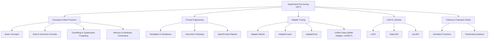
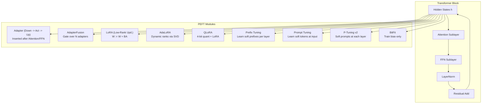
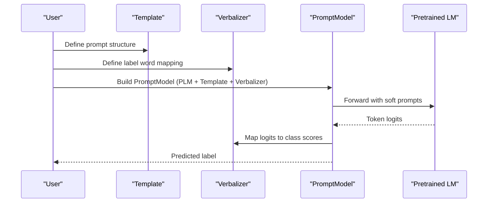
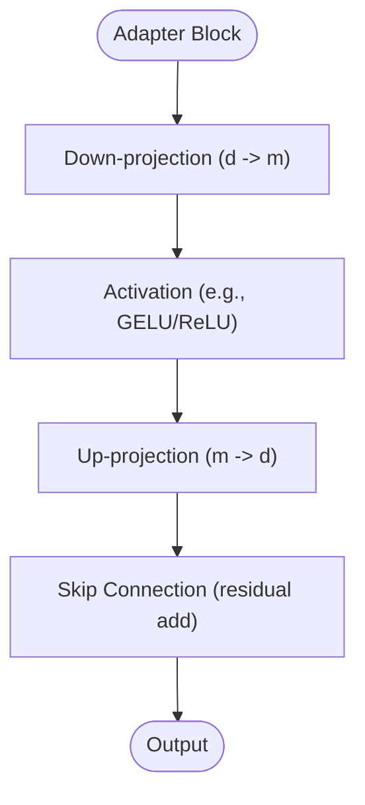
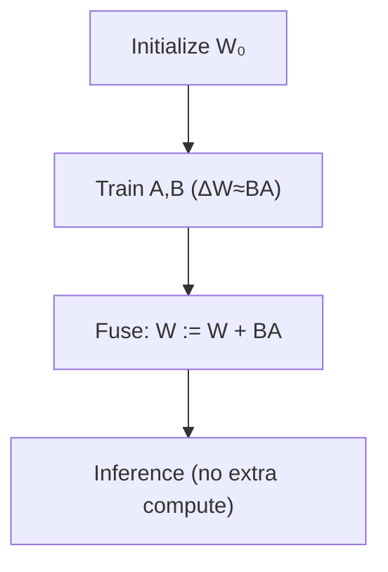
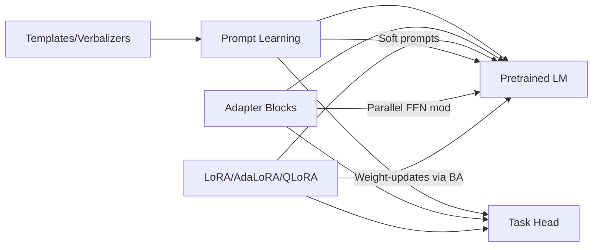

# Supervised Fine-tuning Methods

<cite>
**Referenced Files in This Document**
- [README.md](file://05.有监督微调/README.md)
- [1.基本概念.md](file://05.有监督微调/1.基本概念/1.基本概念.md)
- [1.微调.md](file://05.有监督微调/1.微调/1.微调.md)
- [2.预训练.md](file://05.有监督微调/2.预训练/2.预训练.md)
- [2.prompting/2.prompting.md](file://05.有监督微调/2.prompting/2.prompting.md)
- [3.adapter-tuning/3.adapter-tuning.md](file://05.有监督微调/3.adapter-tuning/3.adapter-tuning.md)
- [4.lora/4.lora.md](file://05.有监督微调/4.lora/4.lora.md)
- [5.总结/5.总结.md](file://05.有监督微调/5.总结/5.总结.md)
- [清华大模型公开课/4.Prompt Tuning & Delta Tuning/4.Prompt Tuning & Delta Tuning.md](file://98.相关课程/清华大模型公开课/4.Prompt Tuning & Delta Tuning/4.Prompt Tuning & Delta Tuning.md)
- [激活函数/6.激活函数.md](file://02.大语言模型架构/6.激活函数/6.激活函数.md)
</cite>

## Table of Contents
1. [Introduction](#introduction)
2. [Project Structure](#project-structure)
3. [Core Components](#core-components)
4. [Architecture Overview](#architecture-overview)
5. [Detailed Component Analysis](#detailed-component-analysis)
6. [Dependency Analysis](#dependency-analysis)
7. [Performance Considerations](#performance-considerations)
8. [Troubleshooting Guide](#troubleshooting-guide)
9. [Conclusion](#conclusion)
10. [Appendices](#appendices)

## Introduction
This document consolidates the repository’s materials on supervised fine-tuning (SFT) and parameter-efficient fine-tuning (PEFT) methods. It explains theoretical foundations (loss functions, optimization, convergence), practical prompt engineering (templates, verbalizers, instruction-following), and adapter tuning (bottleneck dimensions, activation functions, trainable parameter selection). It also provides configuration guidance, implementation pointers, and performance comparisons, along with strategies to address catastrophic forgetting, overfitting, and hyperparameter tuning.

## Project Structure
The supervised fine-tuning domain in this repository is organized around:
- Conceptual foundations and best practices
- Prompt engineering techniques (templates, verbalizers, instruction-following)
- Adapter tuning methodologies
- Low-rank adaptation (LoRA) and variants
- Practical micro-survey summaries and comparative analyses
- Supporting materials on activation functions and training considerations

**Section sources**
- [README.md:1-30](file://05.有监督微调/README.md#L1-L30)

## Core Components
- Supervised fine-tuning fundamentals: steps, heads, and evaluation
- PEFT taxonomy: addition-based, specification-based, reparameterization-based
- Prompt engineering: templates, verbalizers, continuous prompts
- Adapter tuning: insertion forms, activation, fusion, pruning
- LoRA family: LoRA, AdaLoRA, QLoRA
- Training notes: memory, overfitting, catastrophic forgetting, instruction formats

**Section sources**
- [1.基本概念.md:1-85](file://05.有监督微调/1.基本概念/1.基本概念.md#L1-L85)
- [1.微调.md:1-280](file://05.有监督微调/1.微调/1.微调.md#L1-L280)
- [2.预训练.md:1-37](file://05.有监督微调/2.预训练/2.预训练.md#L1-L37)
- [2.prompting/2.prompting.md:1-173](file://05.有监督微调/2.prompting/2.prompting.md#L1-L173)
- [3.adapter-tuning/3.adapter-tuning.md:1-165](file://05.有监督微调/3.adapter-tuning/3.adapter-tuning.md#L1-L165)
- [4.lora/4.lora.md:1-114](file://05.有监督微调/4.lora/4.lora.md#L1-L114)
- [5.总结/5.总结.md:1-135](file://05.有监督微调/5.总结/5.总结.md#L1-L135)
- [清华大模型公开课/4.Prompt Tuning & Delta Tuning/4.Prompt Tuning & Delta Tuning.md:1-800](file://98.相关课程/清华大模型公开课/4.Prompt Tuning & Delta Tuning/4.Prompt Tuning & Delta Tuning.md#L1-L800)
- [激活函数/6.激活函数.md:1-106](file://02.大语言模型架构/6.激活函数/6.激活函数.md#L1-L106)

## Architecture Overview
The repository presents a unified view of PEFT methods and SFT. The following diagram maps the conceptual architecture of PEFT families and their typical insertion points in transformer blocks.

**Diagram sources**
- [3.adapter-tuning/3.adapter-tuning.md:13-31](file://05.有监督微调/3.adapter-tuning/3.adapter-tuning.md#L13-L31)
- [4.lora/4.lora.md:9-31](file://05.有监督微调/4.lora/4.lora.md#L9-L31)
- [2.prompting/2.prompting.md:36-96](file://05.有监督微调/2.prompting/2.prompting.md#L36-L96)
- [清华大模型公开课/4.Prompt Tuning & Delta Tuning/4.Prompt Tuning & Delta Tuning.md:430-462](file://98.相关课程/清华大模型公开课/4.Prompt Tuning & Delta Tuning/4.Prompt Tuning & Delta Tuning.md#L430-L462)

## Detailed Component Analysis

### Theoretical Foundations of Supervised Fine-tuning
- Steps: select backbone, prepare task-specific head, initialize from pretrained weights, train with supervision, tune hyperparameters, evaluate.
- Loss functions: cross-entropy for classification; masked language modeling losses for generation; contrastive or ranking losses for retrieval/RLHF alignment.
- Optimization: gradient-based optimizers (Adam/AdamW), learning rate schedules, gradient accumulation, mixed precision, gradient checkpointing.
- Convergence: monitor validation loss, early stopping, plateau detection, and effective batch-size scaling.

**Section sources**
- [1.基本概念.md:5-20](file://05.有监督微调/1.基本概念/1.基本概念.md#L5-L20)
- [1.微调.md:16-33](file://05.有监督微调/1.微调/1.微调.md#L16-L33)
- [1.微调.md:216-235](file://05.有监督微调/1.微调/1.微调.md#L216-L235)

### Prompt Engineering: Templates, Verbalizers, and Instruction-Following
- Templates: structure prompts to align with pretraining objectives (e.g., fill-mask for MLM, sentence-completion for autoregressive).
- Verbalizers: map model outputs to class labels; manual or learned; can be single tokens or chunks/sentences.
- Instruction-following: explicit task instructions improve controllability and reduce undesired outputs.
- Continuous prompts: learn soft tokens (Prefix Tuning, Prompt Tuning, P-Tuning v2) to guide representations while keeping base weights frozen.
- OpenPrompt pipeline: define tasks, choose PLM, construct Template and Verbalizer, wrap examples, tokenize, build DataLoader, train with PromptForClassification.

**Diagram sources**
- [清华大模型公开课/4.Prompt Tuning & Delta Tuning/4.Prompt Tuning & Delta Tuning.md:509-800](file://98.相关课程/清华大模型公开课/4.Prompt Tuning & Delta Tuning/4.Prompt Tuning & Delta Tuning.md#L509-L800)

**Section sources**
- [2.prompting/2.prompting.md:75-173](file://05.有监督微调/2.prompting/2.prompting.md#L75-L173)
- [清华大模型公开课/4.Prompt Tuning & Delta Tuning/4.Prompt Tuning & Delta Tuning.md:201-392](file://98.相关课程/清华大模型公开课/4.Prompt Tuning & Delta Tuning/4.Prompt Tuning & Delta Tuning.md#L201-L392)

### Adapter Tuning Methodology
- Adapter block: two feed-forward layers with an activation, down-project then up-project; skip connection ensures identity-preserving initialization.
- Insertion points: commonly after attention and after FFN; parallel insertion often preferred.
- Activation functions: ReLU, GELU, Swish; gating mechanisms can be used in fusion variants.
- AdapterFusion: gate over multiple adapters to combine knowledge without destructive task interference.
- AdapterDrop: prune adapters from lower layers during inference to reduce latency while preserving performance.
- Unified views: MAM Adapter combines parallel adapters and soft prompts; UniPELT gates among LoRA, Prefix Tuning, and Adapter.

**Diagram sources**
- [3.adapter-tuning/3.adapter-tuning.md:21-31](file://05.有监督微调/3.adapter-tuning/3.adapter-tuning.md#L21-L31)
- [激活函数/6.激活函数.md:5-24](file://02.大语言模型架构/6.激活函数/6.激活函数.md#L5-L24)

**Section sources**
- [3.adapter-tuning/3.adapter-tuning.md:5-31](file://05.有监督微调/3.adapter-tuning/3.adapter-tuning.md#L5-L31)
- [3.adapter-tuning/3.adapter-tuning.md:33-67](file://05.有监督微调/3.adapter-tuning/3.adapter-tuning.md#L33-L67)
- [3.adapter-tuning/3.adapter-tuning.md:69-96](file://05.有监督微调/3.adapter-tuning/3.adapter-tuning.md#L69-L96)
- [3.adapter-tuning/3.adapter-tuning.md:97-137](file://05.有监督微调/3.adapter-tuning/3.adapter-tuning.md#L97-L137)
- [3.adapter-tuning/3.adapter-tuning.md:138-165](file://05.有监督微调/3.adapter-tuning/3.adapter-tuning.md#L138-L165)

### Low-Rank Adaptation (LoRA) and Variants
- LoRA: approximate weight updates ΔW ≈ BA using low-rank matrices A and B; train only A,B while freezing W; can be fused post-hoc.
- AdaLoRA: dynamic budget allocation across matrices via importance scoring; SVD-based parameterization with orthogonality penalties.
- QLoRA: 4-bit quantization with NF4/double quantization and paging optimizer; train small LoRA adapters on quantized base weights.

**Diagram sources**
- [4.lora/4.lora.md:23-28](file://05.有监督微调/4.lora/4.lora.md#L23-L28)
- [4.lora/4.lora.md:66-76](file://05.有监督微调/4.lora/4.lora.md#L66-L76)
- [4.lora/4.lora.md:91-114](file://05.有监督微调/4.lora/4.lora.md#L91-L114)

**Section sources**
- [4.lora/4.lora.md:3-42](file://05.有监督微调/4.lora/4.lora.md#L3-L42)
- [4.lora/4.lora.md:43-81](file://05.有监督微调/4.lora/4.lora.md#L43-L81)
- [4.lora/4.lora.md:82-114](file://05.有监督微调/4.lora/4.lora.md#L82-L114)

### Practical Implementation Examples and Configuration Pointers
- Data formats and instruction templates: define task, choose backbone, prepare labeled data, preprocess, split train/validation/test, and evaluate.
- Memory and hardware: batch size reduction, gradient accumulation, mixed precision, gradient checkpointing, distributed training.
- Overfitting prevention: regularization (weight decay, dropout), data augmentation, early stopping, validation monitoring.
- Hyperparameter tuning: learning rates, batch sizes, rank/r budget, prompt lengths, number of verbalizer words.

**Section sources**
- [1.微调.md:35-46](file://05.有监督微调/1.微调/1.微调.md#L35-L46)
- [1.微调.md:250-262](file://05.有监督微调/1.微调/1.微调.md#L250-L262)
- [1.微调.md:237-249](file://05.有监督微调/1.微调/1.微调.md#L237-L249)
- [2.预训练.md:9-19](file://05.有监督微调/2.预训练/2.预训练.md#L9-L19)

### Comparative Analysis and Best Practices
- PEFT taxonomy: addition-based (adapters, prefixes), specification-based (bias-only), reparameterization-based (LoRA, AdaLoRA, QLoRA).
- Efficiency trade-offs: parameter count, storage, compute during training/inference, memory footprint, and zero-shot capabilities.
- Recommendations: choose method by task scale and resources; use AdapterFusion/UniPELT for multi-task; apply AdapterDrop for deployment latency.

**Section sources**
- [5.总结/5.总结.md:3-135](file://05.有监督微调/5.总结/5.总结.md#L3-L135)
- [清华大模型公开课/4.Prompt Tuning & Delta Tuning/4.Prompt Tuning & Delta Tuning.md:407-504](file://98.相关课程/清华大模型公开课/4.Prompt Tuning & Delta Tuning/4.Prompt Tuning & Delta Tuning.md#L407-L504)

## Dependency Analysis
The repository organizes PEFT methods conceptually and operationally:
- Prompt engineering depends on template and verbalizer design, and integrates with PLM tokenization and classification heads.
- Adapter tuning depends on activation choices and insertion positions; fusion/pruning modules depend on adapter availability.
- LoRA-based methods depend on low-rank decomposition assumptions and quantization support.

**Diagram sources**
- [2.prompting/2.prompting.md:75-173](file://05.有监督微调/2.prompting/2.prompting.md#L75-L173)
- [3.adapter-tuning/3.adapter-tuning.md:13-31](file://05.有监督微调/3.adapter-tuning/3.adapter-tuning.md#L13-L31)
- [4.lora/4.lora.md:9-31](file://05.有监督微调/4.lora/4.lora.md#L9-L31)

**Section sources**
- [2.prompting/2.prompting.md:75-173](file://05.有监督微调/2.prompting/2.prompting.md#L75-L173)
- [3.adapter-tuning/3.adapter-tuning.md:13-31](file://05.有监督微调/3.adapter-tuning/3.adapter-tuning.md#L13-L31)
- [4.lora/4.lora.md:9-31](file://05.有监督微调/4.lora/4.lora.md#L9-L31)

## Performance Considerations
- Parameter efficiency: adapters (0.5–8%), LoRA (≈0.38% in baselines), QLoRA enables training with 4-bit backbones.
- Storage and compute: freezing base weights reduces checkpoint size; LoRA/QLoRA add negligible inference overhead; adapters increase latency.
- Scalability: larger models benefit more from prompt-based methods; small models require careful prompt design and verbalizer selection.
- Multi-task: AdapterFusion improves robustness; UniPELT adapts dynamically across methods.

**Section sources**
- [5.总结/5.总结.md:111-135](file://05.有监督微调/5.总结/5.总结.md#L111-L135)
- [4.lora/4.lora.md:82-114](file://05.有监督微调/4.lora/4.lora.md#L82-L114)
- [3.adapter-tuning/3.adapter-tuning.md:69-96](file://05.有监督微调/3.adapter-tuning/3.adapter-tuning.md#L69-L96)

## Troubleshooting Guide
- Overfitting and generalization:
  - Use regularization, dropout, and weight decay.
  - Increase data diversity and augment data carefully.
- Catastrophic forgetting:
  - Use PEFT to avoid full-weight updates.
  - Consider AdapterFusion or multi-task training to retain prior knowledge.
- Memory issues:
  - Reduce batch size, enable gradient accumulation.
  - Use mixed precision, gradient checkpointing, and distributed training.
  - For very large models, consider QLoRA or adapter-only training.
- Poor SFT performance:
  - Inspect data quality and label consistency.
  - Adjust prompt templates and verbalizers; ensure instruction clarity.

**Section sources**
- [1.微调.md:16-33](file://05.有监督微调/1.微调/1.微调.md#L16-L33)
- [1.微调.md:198-215](file://05.有监督微调/1.微调/1.微调.md#L198-L215)
- [1.微调.md:237-249](file://05.有监督微调/1.微调/1.微调.md#L237-L249)
- [2.预训练.md:9-19](file://05.有监督微调/2.预训练/2.预训练.md#L9-L19)

## Conclusion
This repository’s materials present a cohesive framework for supervised fine-tuning and PEFT. Prompt engineering and adapter/LoRA methods offer complementary strengths: templates and verbalizers align model outputs with tasks, while adapters and low-rank updates efficiently adapt large backbones with minimal compute and memory. Practical guidance covers data formats, training strategies, and mitigation of overfitting and forgetting, enabling practitioners to select and deploy efficient fine-tuning pipelines tailored to their tasks and resources.

## Appendices
- Activation functions in FFN: ReLU, GELU, Swish, GLU; crucial for adapter and FFN dynamics.
- Pretraining guidance: incremental pretraining, tokenizer extension, and checkpoint conversion.

**Section sources**
- [激活函数/6.激活函数.md:5-24](file://02.大语言模型架构/6.激活函数/6.激活函数.md#L5-L24)
- [2.预训练.md:29-37](file://05.有监督微调/2.预训练/2.预训练.md#L29-L37)