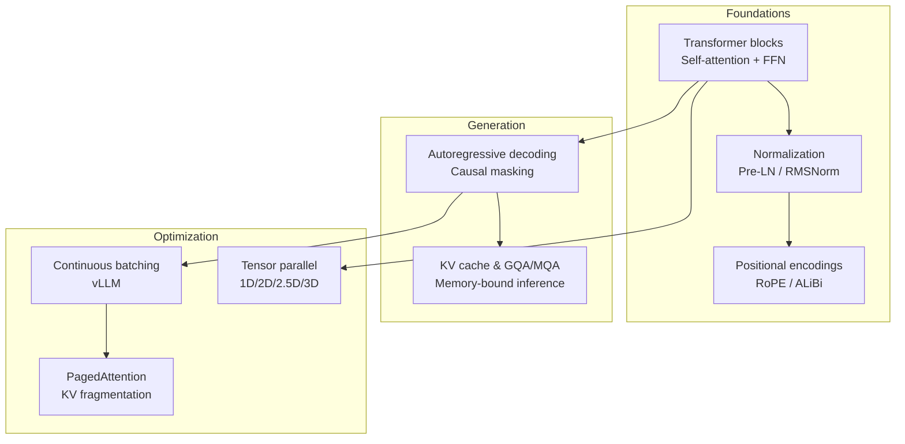
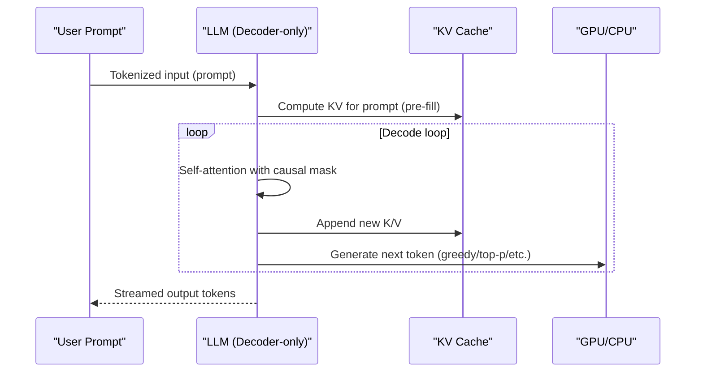
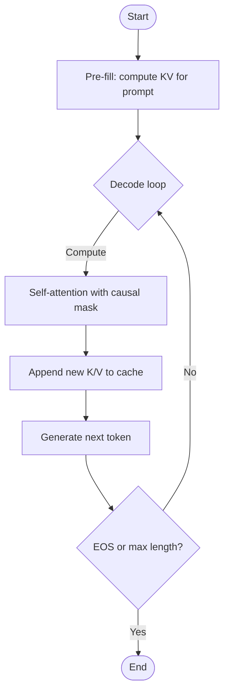
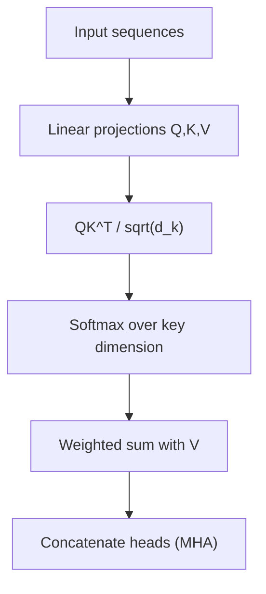
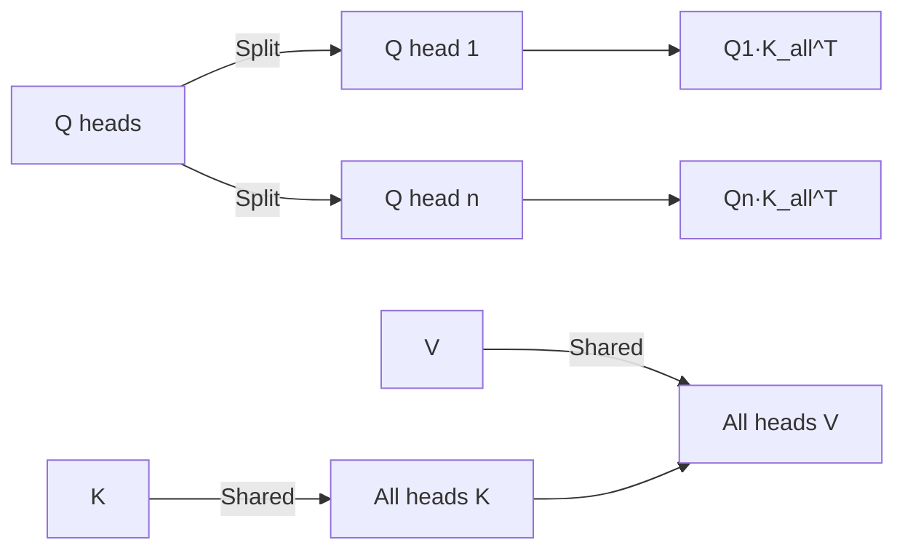
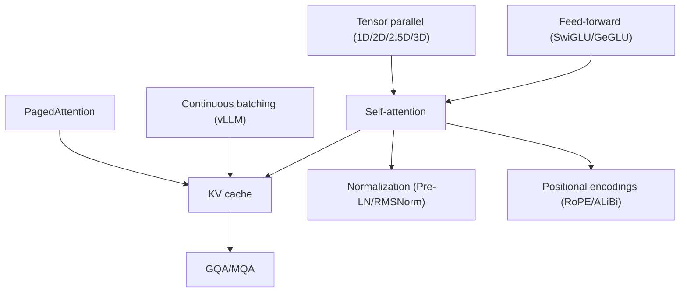

# Architectural Decisions and Design Principles

<cite>
**Referenced Files in This Document**
- [Transformer architecture details](file://02.大语言模型架构/Transformer架构细节/Transformer架构细节.md)
- [Positional encodings](file://02.大语言模型架构/3.位置编码/3.位置编码.md)
- [LLaMA series models](file://02.大语言模型架构/llama系列模型/llama系列模型.md)
- [Llama 2 code walkthrough](file://02.大语言模型架构/llama 2代码详解/llama 2代码详解.md)
- [MHA vs MQA vs GQA](file://02.大语言模型架构/MHA_MQA_GQA/MHA_MQA_GQA.md)
- [Layer normalization](file://02.大语言模型架构/2.layer_normalization/2.layer_normalization.md)
- [Activation functions](file://02.大语言模型架构/6.激活函数/6.激活函数.md)
- [BERT variants](file://02.大语言模型架构/bert变种/bert变种.md)
- [BERT details](file://02.大语言模型架构/bert细节/bert细节.md)
- [vLLM](file://06.推理/1.vllm/1.vllm.md)
- [LLM inference optimization techniques](file://06.推理/llm推理优化技术/llm推理优化技术.md)
- [Tensor parallel](file://04.分布式训练/4.张量并行/4.张量并行.md)
- [Mixed parallel dimensions](file://04.分布式训练/6.多维度混合并行/6.多维度混合并行.md)
</cite>

## Table of Contents
1. [Introduction](#introduction)
2. [Project Structure](#project-structure)
3. [Core Components](#core-components)
4. [Architecture Overview](#architecture-overview)
5. [Detailed Component Analysis](#detailed-component-analysis)
6. [Dependency Analysis](#dependency-analysis)
7. [Performance Considerations](#performance-considerations)
8. [Troubleshooting Guide](#troubleshooting-guide)
9. [Conclusion](#conclusion)
10. [Appendices](#appendices)

## Introduction
This document explains the architectural decisions and design principles behind modern large language models (LLMs), with a focus on why decoder-only architectures dominate, the technical advantages of autoregressive generation, self-attention, and transformer design principles. It also compares encoder-decoder versus decoder-only models, analyzes computational efficiency, memory footprint, and scaling properties, and provides practical guidance for training, inference optimization, and production deployment. Finally, it outlines current trends and future research directions.

## Project Structure
The repository organizes knowledge around:
- Transformer fundamentals and decoder-only design
- Positional encodings and normalization choices
- Attention variants (MHA, MQA, GQA) and KV caching
- Activation functions and feed-forward designs
- BERT vs GPT-style models and their trade-offs
- Inference optimization (vLLM, continuous batching, PagedAttention)
- Distributed training strategies (tensor, pipeline, data parallel, mixed parallel)

**Section sources**
- [Transformer architecture details:1-321](file://02.大语言模型架构/Transformer架构细节/Transformer架构细节.md#L1-L321)
- [Positional encodings:1-397](file://02.大语言模型架构/3.位置编码/3.位置编码.md#L1-L397)
- [Layer normalization:1-193](file://02.大语言模型架构/2.layer_normalization/2.layer_normalization.md#L1-L193)
- [MHA vs MQA vs GQA:1-225](file://02.大语言模型架构/MHA_MQA_GQA/MHA_MQA_GQA.md#L1-L225)
- [vLLM:1-220](file://06.推理/1.vllm/1.vllm.md#L1-L220)
- [LLM inference optimization techniques:1-271](file://06.推理/llm推理优化技术/llm推理优化技术.md#L1-L271)
- [Tensor parallel:1-441](file://04.分布式训练/4.张量并行/4.张量并行.md#L1-L441)

## Core Components
- Decoder-only transformers: Self-attention with causal masking enables efficient autoregressive generation without explicit encoder.
- Self-attention: Captures long-range dependencies, scales quadratically in sequence length, and supports parallel computation of attention weights.
- Normalization: Pre-layer normalization (Pre-LN) and RMSNorm improve training stability and convergence.
- Positional encodings: RoPE integrates relative positional information via rotation matrices; ALiBi injects learned biases into attention scores.
- Attention variants: MHA for full expressiveness; MQA/GQA reduce KV cache memory and bandwidth pressure during inference.
- Feed-forward networks: Typically two linear layers with nonlinear activation; SwiGLU and GeGLU improve representational power.
- Inference optimizations: Continuous batching, PagedAttention, and KV cache reuse maximize GPU utilization under memory constraints.

**Section sources**
- [Transformer architecture details:60-321](file://02.大语言模型架构/Transformer架构细节/Transformer架构细节.md#L60-L321)
- [Layer normalization:171-193](file://02.大语言模型架构/2.layer_normalization/2.layer_normalization.md#L171-L193)
- [Positional encodings:194-317](file://02.大语言模型架构/3.位置编码/3.位置编码.md#L194-L317)
- [MHA vs MQA vs GQA:1-15](file://02.大语言模型架构/MHA_MQA_GQA/MHA_MQA_GQA.md#L1-L15)
- [Activation functions:5-139](file://02.大语言模型架构/6.激活函数/6.激活函数.md#L5-L139)
- [vLLM:34-135](file://06.推理/1.vllm/1.vllm.md#L34-L135)
- [LLM inference optimization techniques:116-180](file://06.推理/llm推理优化技术/llm推理优化技术.md#L116-L180)

## Architecture Overview
The modern LLM stack centers on a decoder-only transformer with:
- Pre-LN and RMSNorm for numerical stability
- RoPE for relative positional awareness
- MHA with optional GQA/MQA for KV cache efficiency
- Autoregressive decoding with KV cache reuse
- Inference frameworks employing continuous batching and PagedAttention

**Diagram sources**
- [Llama 2 code walkthrough:112-158](file://02.大语言模型架构/llama 2代码详解/llama 2代码详解.md#L112-L158)
- [vLLM:34-51](file://06.推理/1.vllm/1.vllm.md#L34-L51)

**Section sources**
- [Llama 2 code walkthrough:160-527](file://02.大语言模型架构/llama 2代码详解/llama 2代码详解.md#L160-L527)
- [vLLM:89-151](file://06.推理/1.vllm/1.vllm.md#L89-L151)

## Detailed Component Analysis

### Why Decoder-Only Dominates
- Autoregressive generation aligns with natural language production and downstream tasks (completion, chat).
- Decoder-only avoids the encoder bottleneck and cross-modal attention overhead; it is simpler and more efficient for pure generation.
- Modern decoder-only models (e.g., LLaMA, GPT-2/3/3.5/4) demonstrate strong performance with fewer architectural constraints.

**Section sources**
- [Transformer architecture details:16-70](file://02.大语言模型架构/Transformer架构细节/Transformer架构_details.md#L16-L70)
- [BERT details:13-13](file://02.大语言模型架构/bert细节/bert细节.md#L13-L13)

### Autoregressive Generation and Causal Masking
- Causal masking ensures each token only attends to previous positions, enabling next-token prediction.
- During inference, KV cache stores past keys/values to avoid recomputation, enabling streaming generation.

**Diagram sources**
- [Llama 2 code walkthrough:133-155](file://02.大语言模型架构/llama 2代码详解/llama 2代码详解.md#L133-L155)

**Section sources**
- [Transformer architecture details:16-22](file://02.大语言模型架构/Transformer架构细节/Transformer架构细节.md#L16-L22)
- [Llama 2 code walkthrough:160-171](file://02.大语言模型架构/llama 2代码详解/llama 2代码详解.md#L160-L171)

### Self-Attention Mechanism
- Scaled dot-product attention computes pairwise similarities between queries and keys, then applies softmax to obtain attention weights.
- Benefits: Long-range dependency modeling, parallelizable computation of attention maps, and strong empirical performance.
- Challenges: Quadratic memory/time in sequence length; mitigated by attention variants and KV caching.

**Diagram sources**
- [Transformer architecture details:245-321](file://02.大语言模型架构/Transformer架构细节/Transformer架构细节.md#L245-L321)

**Section sources**
- [Transformer architecture details:84-126](file://02.大语言模型架构/Transformer架构细节/Transformer架构细节.md#L84-L126)

### Normalization Choices: Pre-LN vs Post-LN and RMSNorm
- Pre-LN improves training stability for deep transformers; Post-LN often yields slightly better final accuracy.
- RMSNorm reduces computation compared to LayerNorm while maintaining stability; commonly used in decoder-only models.

**Section sources**
- [Layer normalization:171-193](file://02.大语言模型架构/2.layer_normalization/2.layer_normalization.md#L171-L193)
- [Llama 2 code walkthrough:173-204](file://02.大语言模型架构/llama 2代码详解/llama 2代码详解.md#L173-L204)

### Positional Encodings: RoPE and ALiBi
- RoPE rotates query/key vectors by angle proportional to position, injecting relative positional information efficiently and enabling extrapolation.
- ALiBi injects learned additive biases into attention scores, enabling length extrapolation without explicit PE.

**Section sources**
- [Positional encodings:194-317](file://02.大语言模型架构/3.位置编码/3.位置编码.md#L194-L317)
- [Llama 2 code walkthrough:206-256](file://02.大语言模型架构/llama 2代码详解/llama 2代码详解.md#L206-L256)

### Attention Variants: MHA, MQA, GQA
- MHA: Full expressiveness with per-head K/V; highest memory and bandwidth.
- MQA: Shared K/V across all heads; reduces KV cache size and bandwidth pressure.
- GQA: Grouped-query attention balances quality and efficiency; widely adopted in production.

**Diagram sources**
- [MHA vs MQA vs GQA:158-225](file://02.大语言模型架构/MHA_MQA_GQA/MHA_MQA_GQA.md#L158-L225)

**Section sources**
- [MHA vs MQA vs GQA:1-15](file://02.大语言模型架构/MHA_MQA_GQA/MHA_MQA_GQA.md#L1-L15)
- [Llama 2 code walkthrough:395-481](file://02.大语言模型架构/llama 2代码详解/llama 2代码详解.md#L395-L481)

### Feed-Forward Networks and Activations
- FFN typically two linear layers with activation; SwiGLU and GeGLU improve representational capacity and training dynamics.
- Activation choice impacts nonlinearity and gradient behavior; modern decoders favor smooth, nonzero-gradient activations.

**Section sources**
- [Activation functions:5-139](file://02.大语言模型架构/6.激活函数/6.激活函数.md#L5-L139)
- [Llama 2 code walkthrough:483-514](file://02.大语言模型架构/llama 2代码详解/llama 2代码详解.md#L483-L514)

### Encoder-Decoder vs Decoder-Only Trade-offs
- Encoder-decoder (e.g., BERT) excels at understanding bidirectional context but is less suited for autoregressive generation.
- Decoder-only (e.g., GPT-style) simplifies architecture, reduces latency, and aligns with generation tasks; BERT-style NSP/segment embeddings are unnecessary for pure generation.

**Section sources**
- [BERT details:13-67](file://02.大语言模型架构/bert细节/bert细节.md#L13-L67)
- [BERT variants:1-21](file://02.大语言模型架构/bert变种/bert变种.md#L1-L21)

## Dependency Analysis
The following diagram maps key dependencies among components that influence training and inference efficiency.

**Diagram sources**
- [MHA vs MQA vs GQA:1-15](file://02.大语言模型架构/MHA_MQA_GQA/MHA_MQA_GQA.md#L1-L15)
- [Layer normalization:171-193](file://02.大语言模型架构/2.layer_normalization/2.layer_normalization.md#L171-L193)
- [Positional encodings:194-317](file://02.大语言模型架构/3.位置编码/3.位置编码.md#L194-L317)
- [vLLM:55-135](file://06.推理/1.vllm/1.vllm.md#L55-L135)
- [Tensor parallel:47-110](file://04.分布式训练/4.张量并行/4.张量并行.md#L47-L110)

**Section sources**
- [Mixed parallel dimensions:1-109](file://04.分布式训练/6.多维度混合并行/6.多维度混合并行.md#L1-L109)

## Performance Considerations
- Memory-bound inference: KV cache dominates GPU memory; GQA/MQA and PagedAttention mitigate memory footprint.
- Throughput: Continuous batching maximizes GPU utilization by interleaving requests; PagedAttention reduces fragmentation and waste.
- Scaling: Tensor parallel (1D/2D/2.5D/3D) partitions weights and activations to fit larger models; hybrid parallel (DP+PP+TP) scales to trillions of parameters.
- Quantization and sparsity: Reduce activation/weight precision and exploit structured sparsity to increase throughput and reduce memory.

[No sources needed since this section provides general guidance]

## Troubleshooting Guide
Common issues and remedies:
- Slow decoding due to KV cache inefficiency: adopt GQA/MQA and PagedAttention; ensure KV cache reuse across decode steps.
- Low GPU utilization: enable continuous batching; tune batch sizes and scheduling policies.
- Training instability: prefer Pre-LN with RMSNorm; adjust learning rate and initialization.
- Out-of-memory errors: reduce sequence length, enable tensor parallel, or use activation checkpointing.

**Section sources**
- [LLM inference optimization techniques:116-180](file://06.推理/llm推理优化技术/llm推理优化技术.md#L116-L180)
- [vLLM:55-135](file://06.推理/1.vllm/1.vllm.md#L55-L135)
- [Layer normalization:171-193](file://02.大语言模型架构/2.layer_normalization/2.layer_normalization.md#L171-L193)

## Conclusion
Decoder-only transformers with causal masking, pre-layer normalization, RoPE, and attention variants like GQA/MQA form the backbone of modern LLMs. These choices balance expressiveness, training stability, and inference efficiency. Production systems further optimize throughput and memory via continuous batching, PagedAttention, and tensor parallel strategies. Future directions include improved positional encodings, hybrid parallelism, and quantization/sparsity to sustain scaling and efficiency gains.

[No sources needed since this section summarizes without analyzing specific files]

## Appendices

### Appendix A: Decoder-Only vs Encoder-Decoder Decision Matrix
- Use decoder-only for:
  - Pure generation tasks (completion, chat)
  - Lower latency and simpler deployment
- Use encoder-decoder for:
  - Structured generation with cross-attention (e.g., summarization, translation)
  - Bidirectional understanding with explicit encoder

**Section sources**
- [BERT details:13-67](file://02.大语言模型架构/bert细节/bert细节.md#L13-L67)
- [BERT variants:1-21](file://02.大语言模型架构/bert变种/bert变种.md#L1-L21)

### Appendix B: Inference Optimization Checklist
- Enable GQA/MQA and KV cache reuse
- Use continuous batching and PagedAttention
- Tune sampling strategies (top-p, temperature)
- Consider tensor parallel and hybrid parallel for training

**Section sources**
- [vLLM:55-135](file://06.推理/1.vllm/1.vllm.md#L55-L135)
- [Tensor parallel:47-110](file://04.分布式训练/4.张量并行/4.张量并行.md#L47-L110)
- [Mixed parallel dimensions:1-109](file://04.分布式训练/6.多维度混合并行/6.多维度混合并行.md#L1-L109)