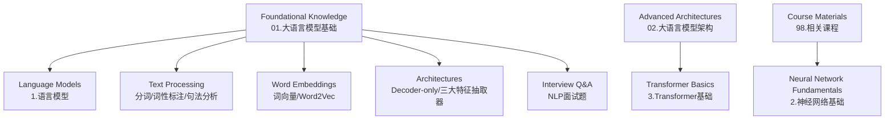
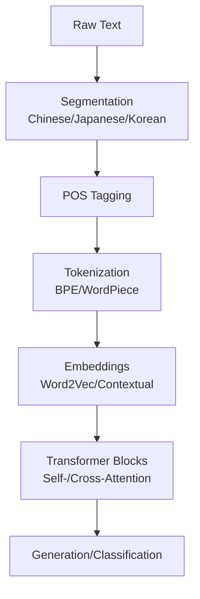
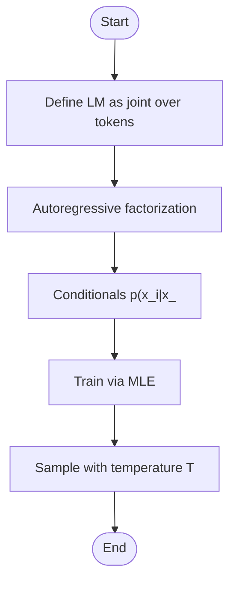
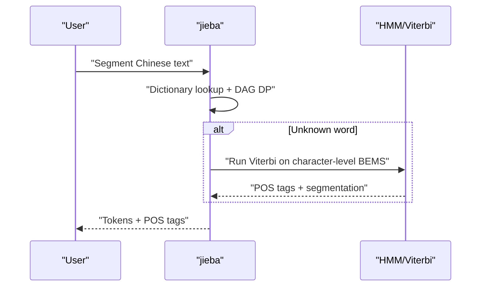
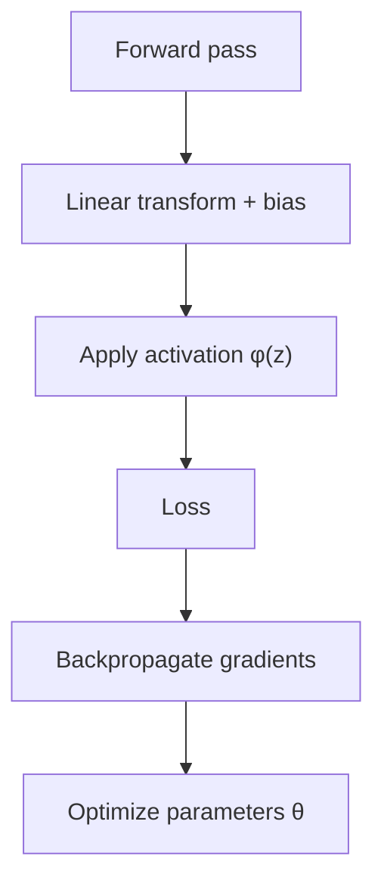
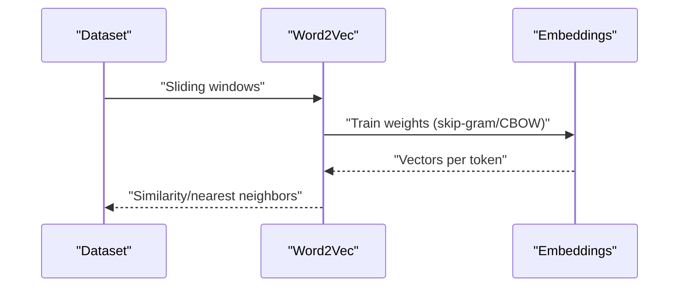
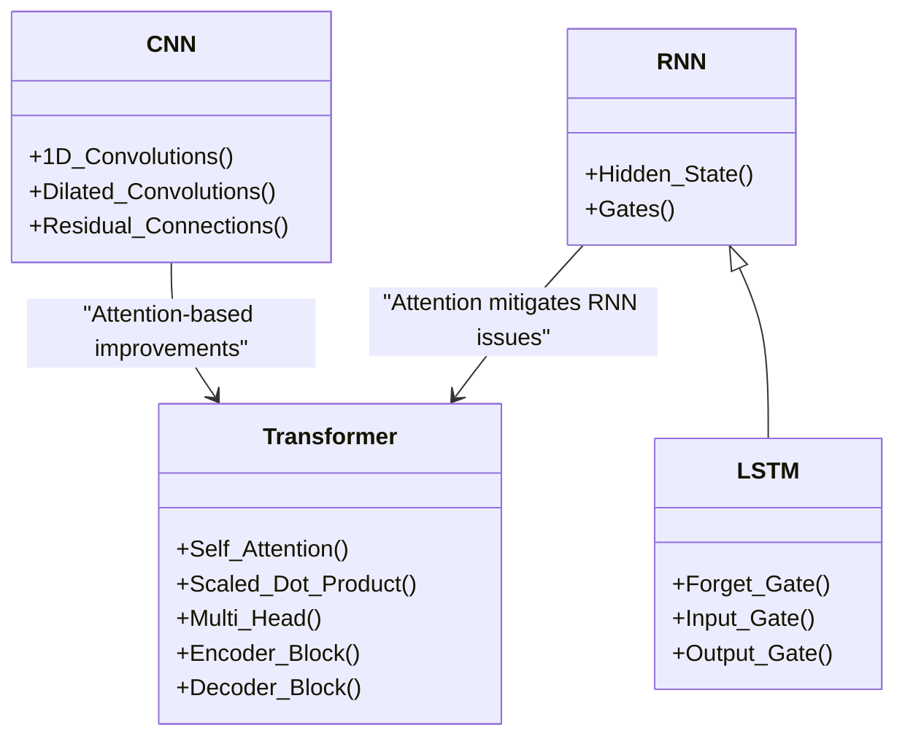
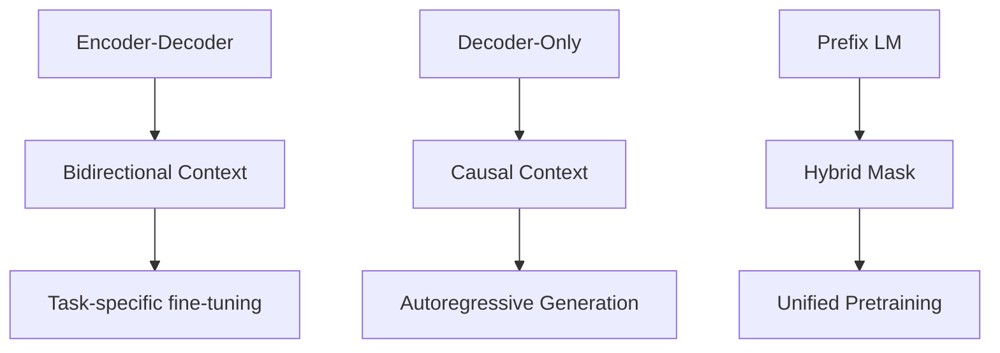
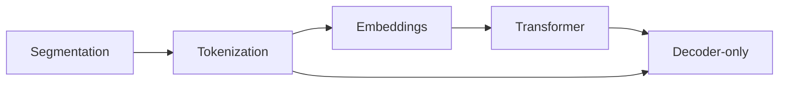

# Foundational Knowledge

<cite>
**Referenced Files in This Document**
- [01.大语言模型基础/1.语言模型/1.语言模型.md](file://01.大语言模型基础/1.语言模型/1.语言模型.md)
- [01.大语言模型基础/1.分词/1.分词.md](file://01.大语言模型基础/1.分词/1.分词.md)
- [01.大语言模型基础/2.jieba分词用法及原理/jieba.ipynb](file://01.大语言模型基础/2.jieba分词用法及原理/jieba.ipynb)
- [01.大语言模型基础/3.词性标注/3.词性标注.md](file://01.大语言模型基础/3.词性标注/3.词性标注.md)
- [01.大语言模型基础/4.句法分析/4.句法分析.md](file://01.大语言模型基础/4.句法分析/4.句法分析.md)
- [01.大语言模型基础/5.词向量/5.词向量.md](file://01.大语言模型基础/5.词向量/5.词向量.md)
- [01.大语言模型基础/Word2Vec/Word2Vec.md](file://01.大语言模型基础/Word2Vec/Word2Vec.md)
- [01.大语言模型基础/LLM为什么Decoder only架构/LLM为什么Decoder only架构.md](file://01.大语言模型基础/LLM为什么Decoder only架构/LLM为什么Decoder only架构.md)
- [01.大语言模型基础/NLP三大特征抽取器（CNN-RNN-TF）/NLP三大特征抽取器（CNN-RNN-TF）.md](file://01.大语言模型基础/NLP三大特征抽取器（CNN-RNN-TF）/NLP三大特征抽取器（CNN-RNN-TF）.md)
- [01.大语言模型基础/NLP面试题/NLP面试题.md](file://01.大语言模型基础/NLP面试题/NLP面试题.md)
- [01.大语言模型基础/1.激活函数/1.激活函数.md](file://01.大语言模型基础/1.激活函数/1.激活函数.md)
- [01.大语言模型基础/README.md](file://01.大语言模型基础/README.md)
- [02.大语言模型架构/README.md](file://02.大语言模型架构/README.md)
- [98.相关课程/清华大模型公开课/2.神经网络基础/2.神经网络基础.md](file://98.相关课程/清华大模型公开课/2.神经网络基础/2.神经网络基础.md)
- [98.相关课程/清华大模型公开课/3.Transformer基础/3.Transformer基础.md](file://98.相关课程/清华大模型公开课/3.Transformer基础/3.Transformer基础.md)
</cite>

## Table of Contents
1. [Introduction](#introduction)
2. [Project Structure](#project-structure)
3. [Core Components](#core-components)
4. [Architecture Overview](#architecture-overview)
5. [Detailed Component Analysis](#detailed-component-analysis)
6. [Dependency Analysis](#dependency-analysis)
7. [Performance Considerations](#performance-considerations)
8. [Troubleshooting Guide](#troubleshooting-guide)
9. [Conclusion](#conclusion)
10. [Appendices](#appendices)

## Introduction
This document presents the Foundational Knowledge section for Natural Language Processing and Large Language Models. It synthesizes core concepts from the repository’s materials, progressing from language model definitions and information theory to text processing (tokenization, segmentation, morphological analysis), neural network fundamentals (activation functions, backpropagation, gradient descent), word embeddings (Word2Vec), and NLP feature extraction (CNN, RNN, Transformer). It also covers architectural decisions behind decoder-only models, interview-relevant topics, and practical examples grounded in the repository’s notebooks and markdowns.

## Project Structure
The repository organizes foundational NLP and LLM knowledge across thematic directories. The primary “Foundational Knowledge” area (01.大语言模型基础) contains focused chapters on language models, tokenization, part-of-speech tagging, parsing, word vectors, Word2Vec, feature extractors, decoder-only architectures, and interview questions. Supplementary materials in “02.大语言模型架构” and “98.相关课程/清华大模型公开课” provide deeper coverage of neural networks, Transformer basics, and pretraining paradigms.

**Section sources**
- [01.大语言模型基础/README.md:1-36](file://01.大语言模型基础/README.md#L1-L36)
- [02.大语言模型架构/README.md:1-52](file://02.大语言模型架构/README.md#L1-L52)

## Core Components
- Language models and autoregressive generation, including temperature-controlled sampling and historical development from n-gram to neural and Transformer-based models.
- Text processing fundamentals: tokenization, segmentation, morphological analysis, and practical use of jieba for Chinese text.
- Neural network basics: activation functions, gradient computation via backpropagation, and gradient descent variants.
- Word embeddings: distributed representations, Word2Vec (CBOW/Skip-gram), hierarchical softmax, negative sampling.
- Feature extraction: CNN, RNN/LSTM/GRU, and Transformer attention mechanisms.
- Architectural choices: decoder-only rationale, zero-shot performance, and KV-cache reuse.
- Interview topics: BERT, GPT, ELMo comparisons, pretraining evolution, and training dynamics.

**Section sources**
- [01.大语言模型基础/1.语言模型/1.语言模型.md:1-215](file://01.大语言模型基础/1.语言模型/1.语言模型.md#L1-L215)
- [01.大语言模型基础/1.分词/1.分词.md:1-85](file://01.大语言模型基础/1.分词/1.分词.md#L1-L85)
- [01.大语言模型基础/2.jieba分词用法及原理/jieba.ipynb:1-170](file://01.大语言模型基础/2.jieba分词用法及原理/jieba.ipynb#L1-L170)
- [01.大语言模型基础/3.词性标注/3.词性标注.md:1-285](file://01.大语言模型基础/3.词性标注/3.词性标注.md#L1-L285)
- [01.大语言模型基础/4.句法分析/4.句法分析.md:1-52](file://01.大语言模型基础/4.句法分析/4.句法分析.md#L1-L52)
- [01.大语言模型基础/5.词向量/5.词向量.md:1-307](file://01.大语言模型基础/5.词向量/5.词向量.md#L1-L307)
- [01.大语言模型基础/Word2Vec/Word2Vec.md:1-106](file://01.大语言模型基础/Word2Vec/Word2Vec.md#L1-L106)
- [01.大语言模型基础/NLP三大特征抽取器（CNN-RNN-TF）/NLP三大特征抽取器（CNN-RNN-TF）.md:1-54](file://01.大语言模型基础/NLP三大特征抽取器（CNN-RNN-TF）/NLP三大特征抽取器（CNN-RNN-TF）.md#L1-L54)
- [01.大语言模型基础/LLM为什么Decoder only架构/LLM为什么Decoder only架构.md:1-33](file://01.大语言模型基础/LLM为什么Decoder only架构/LLM为什么Decoder only架构.md#L1-L33)
- [01.大语言模型基础/NLP面试题/NLP面试题.md:1-169](file://01.大语言模型基础/NLP面试题/NLP面试题.md#L1-L169)
- [01.大语言模型基础/1.激活函数/1.激活函数.md:1-292](file://01.大语言模型基础/1.激活函数/1.激活函数.md#L1-L292)
- [98.相关课程/清华大模型公开课/2.神经网络基础/2.神经网络基础.md:1-534](file://98.相关课程/清华大模型公开课/2.神经网络基础/2.神经网络基础.md#L1-L534)
- [98.相关课程/清华大模型公开课/3.Transformer基础/3.Transformer基础.md:1-394](file://98.相关课程/清华大模型公开课/3.Transformer基础/3.Transformer基础.md#L1-L394)

## Architecture Overview
The foundational pipeline connects raw text to model-ready sequences and embeddings, then to downstream tasks. At a high level:
- Text preprocessing: segmentation and POS tagging for Chinese text.
- Tokenization: BPE-style subword units and positional encodings.
- Representation learning: word embeddings (e.g., Word2Vec) and contextual embeddings (e.g., Transformer).
- Generation/understanding: decoder-only autoregressive generation or encoder-based understanding.

[No sources needed since this diagram shows conceptual workflow, not actual code structure]

## Detailed Component Analysis

### Language Models and Information Theory Foundations
- Definition: A language model assigns probabilities to token sequences and supports both evaluation and generation.
- Autoregressive formulation: chain rule factorization into conditionals; temperature controls randomness during sampling.
- Historical perspective: Shannon entropy and cross-entropy; n-gram models; neural language models; RNNs and Transformers.
- Practical implications: MLE training objective; zero-shot/few-shot generalization; pretraining objectives (MLM, Causal LM).

**Section sources**
- [01.大语言模型基础/1.语言模型/1.语言模型.md:37-96](file://01.大语言模型基础/1.语言模型/1.语言模型.md#L37-L96)
- [01.大语言模型基础/1.语言模型/1.语言模型.md:100-215](file://01.大语言模型基础/1.语言模型/1.语言模型.md#L100-L215)
- [98.相关课程/清华大模型公开课/2.神经网络基础/2.神经网络基础.md:69-115](file://98.相关课程/清华大模型公开课/2.神经网络基础/2.神经网络基础.md#L69-L115)

### Text Processing: Tokenization, Segmentation, and Morphological Analysis
- Tokenization: byte-pair encoding (BPE) and WordPiece reduce out-of-vocabulary issues and enable subword modeling.
- Chinese segmentation: challenges (ambiguous boundaries, unknown words); dictionary-based and statistical approaches; jieba usage and HMM-based handling of out-of-vocabulary words.
- POS tagging: combining dictionary lookup and HMM/Viterbi for unseen words; integrates with segmentation.
- Morphological analysis: dependency parsing and constituent parsing; tools and limitations.

**Section sources**
- [01.大语言模型基础/1.分词/1.分词.md:43-85](file://01.大语言模型基础/1.分词/1.分词.md#L43-L85)
- [01.大语言模型基础/2.jieba分词用法及原理/jieba.ipynb:19-69](file://01.大语言模型基础/2.jieba分词用法及原理/jieba.ipynb#L19-L69)
- [01.大语言模型基础/3.词性标注/3.词性标注.md:32-285](file://01.大语言模型基础/3.词性标注/3.词性标注.md#L32-L285)
- [01.大语言模型基础/4.句法分析/4.句法分析.md:1-52](file://01.大语言模型基础/4.句法分析/4.句法分析.md#L1-L52)
- [98.相关课程/清华大模型公开课/3.Transformer基础/3.Transformer基础.md:113-172](file://98.相关课程/清华大模型公开课/3.Transformer基础/3.Transformer基础.md#L113-L172)

### Neural Network Fundamentals: Activation Functions, Backpropagation, Gradient Descent
- Purpose of activation functions: introduce nonlinearity; address vanishing/exploding gradients.
- Common activations: sigmoid, tanh, ReLU, Leaky/Parametric/Random ReLU, ELU, GELU, Swish/GLU.
- Backpropagation: compute gradients via chain rule; residual connections and normalization mitigate vanishing gradients.
- Optimization: SGD, mini-batch SGD, momentum, Nesterov, AdaDelta, Adam.

**Section sources**
- [01.大语言模型基础/1.激活函数/1.激活函数.md:1-292](file://01.大语言模型基础/1.激活函数/1.激活函数.md#L1-L292)
- [98.相关课程/清华大模型公开课/2.神经网络基础/2.神经网络基础.md:122-208](file://98.相关课程/清华大模型公开课/2.神经网络基础/2.神经网络基础.md#L122-L208)
- [98.相关课程/清华大模型公开课/2.神经网络基础/2.神经网络基础.md:142-156](file://98.相关课程/清华大模型公开课/2.神经网络基础/2.神经网络基础.md#L142-L156)

### Word Embeddings and Word2Vec
- Motivation: dense, low-dimensional representations capture semantic relations; avoid one-hot sparsity.
- Word2Vec: CBOW predicts center word from context; Skip-gram predicts context from center word.
- Training efficiency: hierarchical softmax and negative sampling reduce computational cost.
- Practical usage: gensim Word2Vec API for training, incremental updates, similarity queries.

**Section sources**
- [01.大语言模型基础/5.词向量/5.词向量.md:70-307](file://01.大语言模型基础/5.词向量/5.词向量.md#L70-L307)
- [01.大语言模型基础/Word2Vec/Word2Vec.md:32-106](file://01.大语言模型基础/Word2Vec/Word2Vec.md#L32-L106)
- [98.相关课程/清华大模型公开课/2.神经网络基础/2.神经网络基础.md:209-327](file://98.相关课程/清华大模型公开课/2.神经网络基础/2.神经网络基础.md#L209-L327)

### NLP Feature Extraction: CNN, RNN, Transformer
- CNN: captures local n-gram fragments; 1D convolutions, dilated convolutions, residual connections.
- RNN/LSTM/GRU: sequential modeling with gates; long-range dependencies; attention mitigates vanishing gradients.
- Transformer: self-attention, scaled dot-product attention, multi-head attention; encoder/decoder blocks; positional encodings; parallelizable.

**Section sources**
- [01.大语言模型基础/NLP三大特征抽取器（CNN-RNN-TF）/NLP三大特征抽取器（CNN-RNN-TF）.md:1-54](file://01.大语言模型基础/NLP三大特征抽取器（CNN-RNN-TF）/NLP三大特征抽取器（CNN-RNN-TF）.md#L1-L54)
- [98.相关课程/清华大模型公开课/2.神经网络基础/2.神经网络基础.md:330-534](file://98.相关课程/清华大模型公开课/2.神经网络基础/2.神经网络基础.md#L330-L534)
- [98.相关课程/清华大模型公开课/3.Transformer基础/3.Transformer基础.md:174-271](file://98.相关课程/清华大模型公开课/3.Transformer基础/3.Transformer基础.md#L174-L271)

### Decoder-Only Architectures and Pretraining Objectives
- Decoder-only rationale: avoids encoder low-rank issues, better zero-shot generalization, efficient KV-cache reuse for multi-turn dialogue.
- Causal language modeling vs. prefix language modeling; encoder-only vs. encoder-decoder trade-offs.

**Section sources**
- [01.大语言模型基础/LLM为什么Decoder only架构/LLM为什么Decoder only架构.md:1-33](file://01.大语言模型基础/LLM为什么Decoder only架构/LLM为什么Decoder only架构.md#L1-L33)
- [01.大语言模型基础/1.llm概念/1.llm概念.md:17-49](file://01.大语言模型基础/1.llm概念/1.llm概念.md#L17-L49)

### Interview Questions and Practical Concepts
- BERT: masked language modeling, NSP, three embedding types (position/segment/wordpiece).
- GPT vs. BERT vs. ELMo: bidirectional encoder, unidirectional decoder, dual-LSTM.
- Word2Vec tricks: hierarchical softmax, negative sampling; speed and quality gains.
- Training dynamics: SGD, mini-batch, momentum, Adam; batch sizes and stability.

**Section sources**
- [01.大语言模型基础/NLP面试题/NLP面试题.md:3-169](file://01.大语言模型基础/NLP面试题/NLP面试题.md#L3-L169)
- [01.大语言模型基础/1.llm概念/1.llm概念.md:73-91](file://01.大语言模型基础/1.llm概念/1.llm概念.md#L73-L91)
- [01.大语言模型基础/5.词向量/5.词向量.md:70-72](file://01.大语言模型基础/5.词向量/5.词向量.md#L70-L72)

## Dependency Analysis
Foundational modules depend on each other in a pipeline:
- Segmentation and POS tagging depend on dictionary/HMM statistics.
- Tokenization depends on segmentation and vocabulary construction.
- Embeddings rely on tokenized corpora and training objectives.
- Transformers depend on tokenization and positional encodings.
- Decoder-only models depend on causal masking and KV caching.

[No sources needed since this diagram shows conceptual workflow, not actual code structure]

## Performance Considerations
- Computational efficiency: Transformer attention scales quadratically; use multi-head attention and proper masking; consider sparse attention for long sequences.
- Training stability: residual connections, layer normalization, gradient clipping; choose appropriate optimizers (Adam/AdaDelta).
- Data efficiency: negative sampling and hierarchical softmax in Word2Vec; curriculum learning and subsampling for robustness.
- Memory footprint: KV-cache reuse in decoder-only models; chunking for long-context inference.

[No sources needed since this section provides general guidance]

## Troubleshooting Guide
Common pitfalls and remedies:
- Gradient explosion/vanishing: use residual connections, layer normalization, gradient clipping; choose suitable activations (avoid sigmoid/tanh deep in networks).
- Poor segmentation accuracy: tune dictionary thresholds, handle unknown words with HMM/Viterbi; consider domain-specific dictionaries.
- Slow Word2Vec training: apply hierarchical softmax and negative sampling; adjust window size and sampling rates.
- Long-sequence handling: pad to fixed length or chunk; use attention with proper positional encodings; consider sparse attention.

**Section sources**
- [01.大语言模型基础/1.激活函数/1.激活函数.md:12-23](file://01.大语言模型基础/1.激活函数/1.激活函数.md#L12-L23)
- [01.大语言模型基础/1.分词/1.分词.md:25-42](file://01.大语言模型基础/1.分词/1.分词.md#L25-L42)
- [01.大语言模型基础/5.词向量/5.词向量.md:271-307](file://01.大语言模型基础/5.词向量/5.词向量.md#L271-L307)
- [98.相关课程/清华大模型公开课/3.Transformer基础/3.Transformer基础.md:258-271](file://98.相关课程/清华大模型公开课/3.Transformer基础/3.Transformer基础.md#L258-L271)

## Conclusion
This Foundational Knowledge section ties together language modeling, text processing, embeddings, and modern neural architectures. It emphasizes practical implementations (e.g., jieba, Word2Vec, Transformer basics) and architectural insights (decoder-only choice, attention mechanisms). The repository’s materials provide both conceptual depth and hands-on examples to support progression from basic concepts to advanced implementations.

[No sources needed since this section summarizes without analyzing specific files]

## Appendices
- Practical examples and code references:
  - jieba segmentation and POS tagging usage: [01.大语言模型基础/2.jieba分词用法及原理/jieba.ipynb:19-69](file://01.大语言模型基础/2.jieba分词用法及原理/jieba.ipynb#L19-L69)
  - Word2Vec training walkthrough: [01.大语言模型基础/5.词向量/5.词向量.md:74-307](file://01.大语言模型基础/5.词向量/5.词向量.md#L74-L307)
  - Transformer attention and BPE: [98.相关课程/清华大模型公开课/3.Transformer基础/3.Transformer基础.md:174-271](file://98.相关课程/清华大模型公开课/3.Transformer基础/3.Transformer基础.md#L174-L271)

[No sources needed since this section aggregates pointers without analyzing specific files]