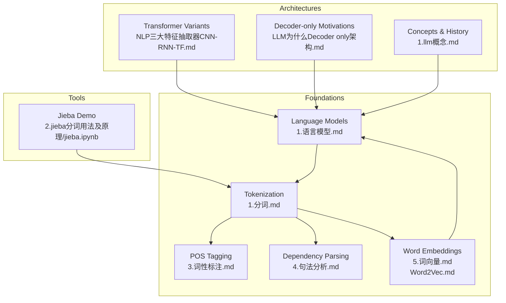
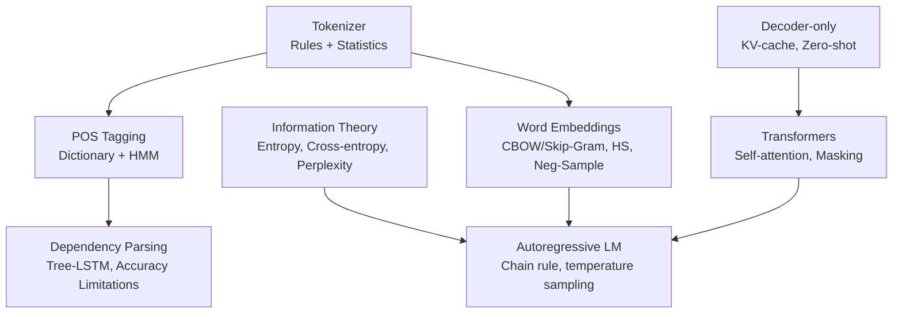
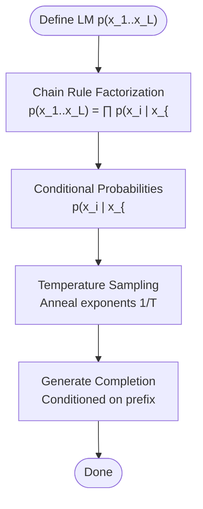
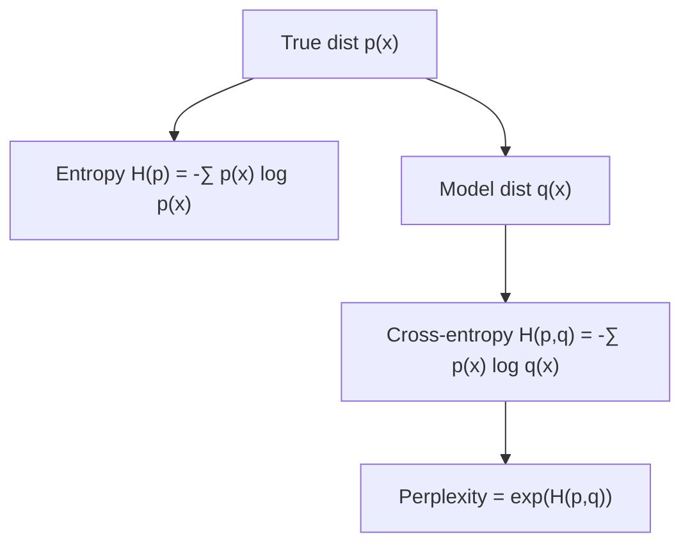
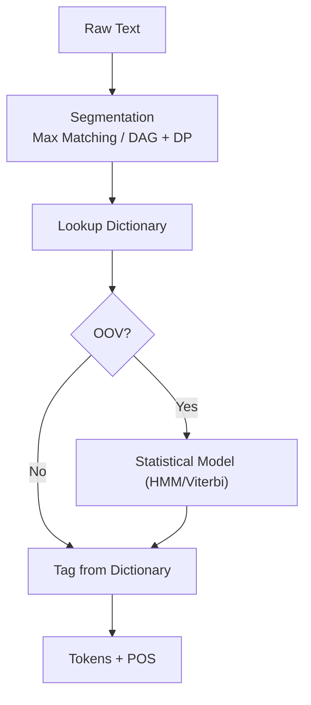
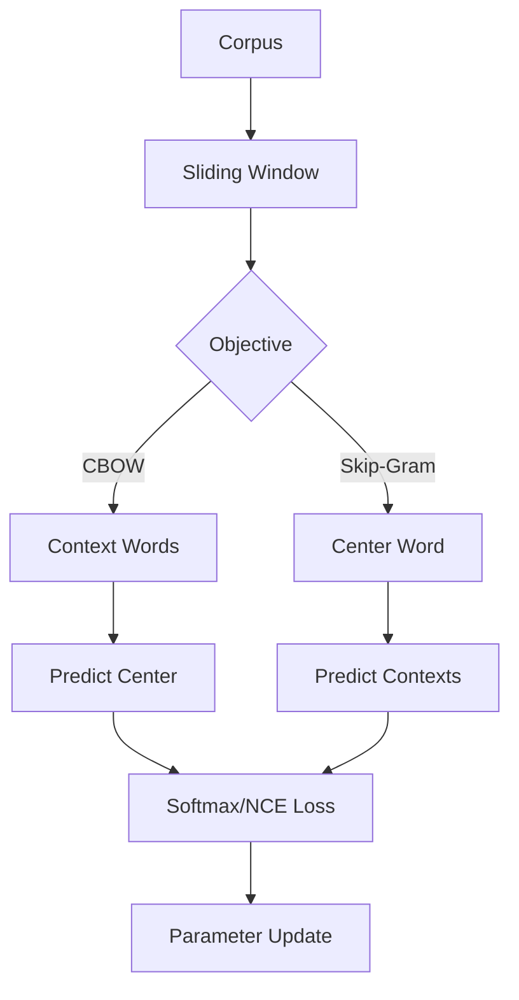
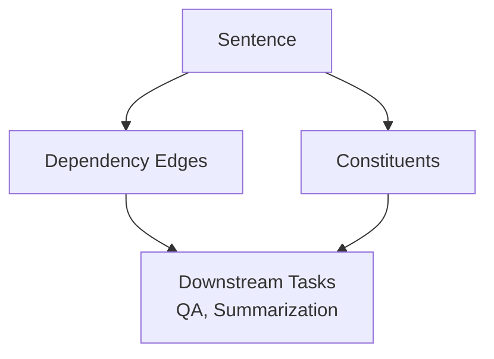
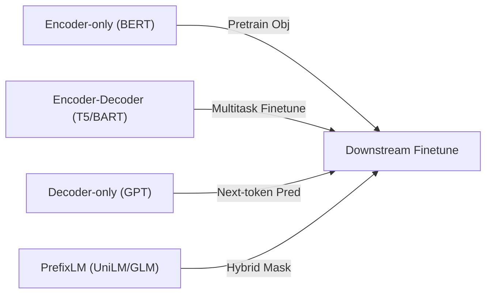
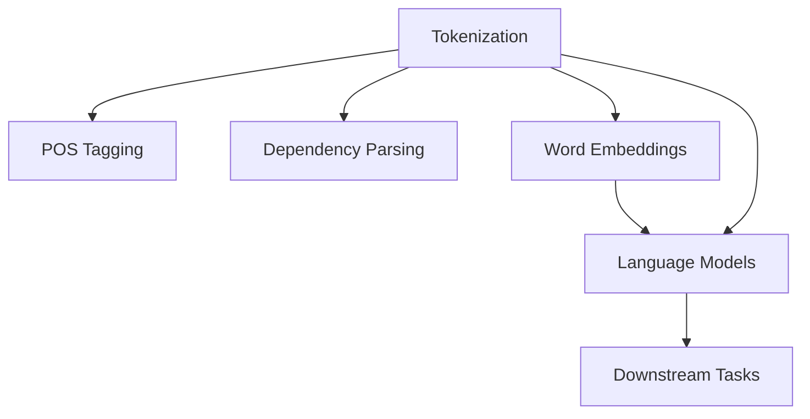

# Language Models and NLP Fundamentals

<cite>
**Referenced Files in This Document**
- [1.语言模型.md](file://01.大语言模型基础/1.语言模型/1.语言模型.md)
- [1.分词.md](file://01.大语言模型基础/1.分词/1.分词.md)
- [2.jieba分词用法及原理/jieba.ipynb](file://01.大语言模型基础/2.jieba分词用法及原理/jieba.ipynb)
- [3.词性标注.md](file://01.大语言模型基础/3.词性标注/3.词性标注.md)
- [4.句法分析.md](file://01.大语言模型基础/4.句法分析/4.句法分析.md)
- [5.词向量.md](file://01.大语言模型基础/5.词向量/5.词向量.md)
- [Word2Vec.md](file://01.大语言模型基础/Word2Vec/Word2Vec.md)
- [NLP三大特征抽取器（CNN-RNN-TF）.md](file://01.大语言模型基础/NLP三大特征抽取器（CNN-RNN-TF）/NLP三大特征抽取器（CNN-RNN-TF）.md)
- [1.llm概念.md](file://01.大语言模型基础/1.llm概念/1.llm概念.md)
- [LLM为什么Decoder only架构.md](file://01.大语言模型基础/LLM为什么Decoder only架构/LLM为什么Decoder only架构.md)
- [NLP面试题.md](file://01.大语言模型基础/NLP面试题/NLP面试题.md)
- [2.神经网络基础.md](file://98.相关课程/清华大模型公开课/2.神经网络基础/2.神经网络基础.md)
</cite>

## Table of Contents
1. [Introduction](#introduction)
2. [Project Structure](#project-structure)
3. [Core Components](#core-components)
4. [Architecture Overview](#architecture-overview)
5. [Detailed Component Analysis](#detailed-component-analysis)
6. [Dependency Analysis](#dependency-analysis)
7. [Performance Considerations](#performance-considerations)
8. [Troubleshooting Guide](#troubleshooting-guide)
9. [Conclusion](#conclusion)
10. [Appendices](#appendices)

## Introduction
This document synthesizes the repository’s materials into a coherent guide on Language Models and NLP Fundamentals. It covers:
- Language model definitions, autoregressive formulation, and temperature-controlled generation
- Historical progression from n-gram models to neural language models and Transformers
- Information theory foundations: entropy, cross-entropy, and perplexity
- Practical NLP building blocks: tokenization, normalization, POS tagging, dependency parsing, and word embeddings
- Interview-focused Q&A grounded in the repository’s notes
- Mathematical derivations and conceptual progressions from classical statistics to modern deep learning

## Project Structure
The repository organizes knowledge around three pillars:
- Foundational concepts (language models, tokenization, POS tagging, parsing, embeddings)
- Architectural insights (Transformer variants, decoder-only rationale)
- Practical tools and demos (Python notebooks for tokenization)

**Diagram sources**
- [1.语言模型.md:1-215](file://01.大语言模型基础/1.语言模型/1.语言模型.md#L1-L215)
- [1.分词.md:1-85](file://01.大语言模型基础/1.分词/1.分词.md#L1-L85)
- [3.词性标注.md:1-285](file://01.大语言模型基础/3.词性标注/3.词性标注.md#L1-L285)
- [4.句法分析.md:1-52](file://01.大语言模型基础/4.句法分析/4.句法分析.md#L1-L52)
- [5.词向量.md:1-307](file://01.大语言模型基础/5.词向量/5.词向量.md#L1-L307)
- [Word2Vec.md:1-106](file://01.大语言模型基础/Word2Vec/Word2Vec.md#L1-L106)
- [NLP三大特征抽取器（CNN-RNN-TF）.md:1-54](file://01.大语言模型基础/NLP三大特征抽取器（CNN-RNN-TF）/NLP三大特征抽取器（CNN-RNN-TF）.md#L1-L54)
- [LLM为什么Decoder only架构.md:1-33](file://01.大语言模型基础/LLM为什么Decoder only架构/LLM为什么Decoder only架构.md#L1-L33)
- [1.llm概念.md:1-164](file://01.大语言模型基础/1.llm概念/1.llm概念.md#L1-L164)
- [2.jieba分词用法及原理/jieba.ipynb:1-170](file://01.大语言模型基础/2.jieba分词用法及原理/jieba.ipynb#L1-L170)

**Section sources**
- [1.语言模型.md:1-215](file://01.大语言模型基础/1.语言模型/1.语言模型.md#L1-L215)
- [1.分词.md:1-85](file://01.大语言模型基础/1.分词/1.分词.md#L1-L85)
- [3.词性标注.md:1-285](file://01.大语言模型基础/3.词性标注/3.词性标注.md#L1-L285)
- [4.句法分析.md:1-52](file://01.大语言模型基础/4.句法分析/4.句法分析.md#L1-L52)
- [5.词向量.md:1-307](file://01.大语言模型基础/5.词向量/5.词向量.md#L1-L307)
- [Word2Vec.md:1-106](file://01.大语言模型基础/Word2Vec/Word2Vec.md#L1-L106)
- [NLP三大特征抽取器（CNN-RNN-TF）.md:1-54](file://01.大语言模型基础/NLP三大特征抽取器（CNN-RNN-TF）/NLP三大特征抽取器（CNN-RNN-TF）.md#L1-L54)
- [LLM为什么Decoder only架构.md:1-33](file://01.大语言模型基础/LLM为什么Decoder only架构/LLM为什么Decoder only架构.md#L1-L33)
- [1.llm概念.md:1-164](file://01.大语言模型基础/1.llm概念/1.llm概念.md#L1-L164)
- [2.jieba分词用法及原理/jieba.ipynb:1-170](file://01.大语言模型基础/2.jieba分词用法及原理/jieba.ipynb#L1-L170)

## Core Components
- Language model definition and autoregressive formulation
- Information theory: entropy, cross-entropy, and perplexity
- Historical evolution: n-grams → neural LMs → Transformers
- Tokenization, normalization, POS tagging, dependency parsing
- Word embeddings (CBOW/Skip-Gram, hierarchical softmax, negative sampling)
- Transformer architectures and decoder-only rationale

**Section sources**
- [1.语言模型.md:3-96](file://01.大语言模型基础/1.语言模型/1.语言模型.md#L3-L96)
- [1.语言模型.md:100-215](file://01.大语言模型基础/1.语言模型/1.语言模型.md#L100-L215)
- [1.分词.md:3-85](file://01.大语言模型基础/1.分词/1.分词.md#L3-L85)
- [3.词性标注.md:18-285](file://01.大语言模型基础/3.词性标注/3.词性标注.md#L18-L285)
- [4.句法分析.md:1-52](file://01.大语言模型基础/4.句法分析/4.句法分析.md#L1-L52)
- [5.词向量.md:70-307](file://01.大语言模型基础/5.词向量/5.词向量.md#L70-L307)
- [Word2Vec.md:32-106](file://01.大语言模型基础/Word2Vec/Word2Vec.md#L32-L106)
- [NLP三大特征抽取器（CNN-RNN-TF）.md:1-54](file://01.大语言模型基础/NLP三大特征抽取器（CNN-RNN-TF）/NLP三大特征抽取器（CNN-RNN-TF）.md#L1-L54)
- [LLM为什么Decoder only架构.md:18-33](file://01.大语言模型基础/LLM为什么Decoder only架构/LLM为什么Decoder only架构.md#L18-L33)

## Architecture Overview
The document connects foundational components to modern architectures and practical tools.

**Diagram sources**
- [1.语言模型.md:37-96](file://01.大语言模型基础/1.语言模型/1.语言模型.md#L37-L96)
- [1.语言模型.md:100-136](file://01.大语言模型基础/1.语言模型/1.语言模型.md#L100-L136)
- [1.分词.md:43-85](file://01.大语言模型基础/1.分词/1.分词.md#L43-L85)
- [3.词性标注.md:28-285](file://01.大语言模型基础/3.词性标注/3.词性标注.md#L28-L285)
- [4.句法分析.md:39-52](file://01.大语言模型基础/4.句法分析/4.句法分析.md#L39-L52)
- [5.词向量.md:70-307](file://01.大语言模型基础/5.词向量/5.词向量.md#L70-L307)
- [NLP三大特征抽取器（CNN-RNN-TF）.md:11-54](file://01.大语言模型基础/NLP三大特征抽取器（CNN-RNN-TF）/NLP三大特征抽取器（CNN-RNN-TF）.md#L11-L54)
- [LLM为什么Decoder only架构.md:18-33](file://01.大语言模型基础/LLM为什么Decoder only架构/LLM为什么Decoder only架构.md#L18-L33)

## Detailed Component Analysis

### Language Model Foundations
- Definition: a probability over token sequences
- Autoregressive factorization via chain rule
- Temperature-controlled sampling and annealed distributions
- Historical context: Shannon’s entropy and cross-entropy; n-gram models; neural LMs; Transformers

**Diagram sources**
- [1.语言模型.md:37-96](file://01.大语言模型基础/1.语言模型/1.语言模型.md#L37-L96)

**Section sources**
- [1.语言模型.md:3-96](file://01.大语言模型基础/1.语言模型/1.语言模型.md#L3-L96)
- [1.语言模型.md:100-136](file://01.大语言模型基础/1.语言模型/1.语言模型.md#L100-L136)

### Information Theory and Metrics
- Entropy measures expected code length under true distribution
- Cross-entropy measures expected code length under model q
- Perplexity as exponential of cross-entropy; lower is better
- Practical estimation via language models

**Diagram sources**
- [1.语言模型.md:100-136](file://01.大语言模型基础/1.语言模型/1.语言模型.md#L100-L136)

**Section sources**
- [1.语言模型.md:100-136](file://01.大语言模型基础/1.语言模型/1.语言模型.md#L100-L136)

### Tokenization and Normalization
- Challenges: ambiguity, out-of-vocabulary words
- Approaches: dictionary-based matching and statistical methods
- Practical demo with jieba (modes, keyword extraction)

**Diagram sources**
- [1.分词.md:43-85](file://01.大语言模型基础/1.分词/1.分词.md#L43-L85)
- [3.词性标注.md:18-285](file://01.大语言模型基础/3.词性标注/3.词性标注.md#L18-L285)

**Section sources**
- [1.分词.md:3-85](file://01.大语言模型基础/1.分词/1.分词.md#L3-L85)
- [3.词性标注.md:18-285](file://01.大语言模型基础/3.词性标注/3.词性标注.md#L18-L285)
- [2.jieba分词用法及原理/jieba.ipynb:1-170](file://01.大语言模型基础/2.jieba分词用法及原理/jieba.ipynb#L1-L170)

### Word Embeddings: CBOW, Skip-Gram, Hierarchical Softmax, Negative Sampling
- Predictive objectives: CBOW (context to center) vs Skip-Gram (center to contexts)
- Efficiency improvements: hierarchical softmax and negative sampling
- Training pipeline and TensorFlow demo outline

**Diagram sources**
- [5.词向量.md:70-307](file://01.大语言模型基础/5.词向量/5.词向量.md#L70-L307)
- [Word2Vec.md:32-106](file://01.大语言模型基础/Word2Vec/Word2Vec.md#L32-L106)

**Section sources**
- [5.词向量.md:70-307](file://01.大语言模型基础/5.词向量/5.词向量.md#L70-L307)
- [Word2Vec.md:32-106](file://01.大语言模型基础/Word2Vec/Word2Vec.md#L32-L106)

### Dependency Parsing and Syntactic Analysis
- Two views: constituent structure and dependency relations
- Tools and accuracy limitations; tree-LSTM vs bi-LSTM trade-offs

**Diagram sources**
- [4.句法分析.md:1-52](file://01.大语言模型基础/4.句法分析/4.句法分析.md#L1-L52)

**Section sources**
- [4.句法分析.md:1-52](file://01.大语言模型基础/4.句法分析/4.句法分析.md#L1-L52)

### Transformer Architectures and Decoder-only Rationale
- Evolution from encoder-only (BERT) to encoder-decoder (T5/BART) to decoder-only (GPT)
- Reasons: low-rank problem in bidirectional encoders, zero-shot performance, KV-cache reuse

**Diagram sources**
- [NLP三大特征抽取器（CNN-RNN-TF）.md:1-54](file://01.大语言模型基础/NLP三大特征抽取器（CNN-RNN-TF）/NLP三大特征抽取器（CNN-RNN-TF）.md#L1-L54)
- [LLM为什么Decoder only架构.md:18-33](file://01.大语言模型基础/LLM为什么Decoder only架构/LLM为什么Decoder only架构.md#L18-L33)
- [1.llm概念.md:17-49](file://01.大语言模型基础/1.llm概念/1.llm概念.md#L17-L49)

**Section sources**
- [NLP三大特征抽取器（CNN-RNN-TF）.md:1-54](file://01.大语言模型基础/NLP三大特征抽取器（CNN-RNN-TF）/NLP三大特征抽取器（CNN-RNN-TF）.md#L1-L54)
- [LLM为什么Decoder only架构.md:18-33](file://01.大语言模型基础/LLM为什么Decoder only架构/LLM为什么Decoder only架构.md#L18-L33)
- [1.llm概念.md:17-49](file://01.大语言模型基础/1.llm概念/1.llm概念.md#L17-L49)

### Neural Network Basics and Training (Supporting Context)
- Activation functions, forward/backprop, SGD, and cross-entropy loss
- Useful for understanding embedding and LM training objectives

**Section sources**
- [2.神经网络基础.md:33-115](file://98.相关课程/清华大模型公开课/2.神经网络基础/2.神经网络基础.md#L33-L115)
- [2.神经网络基础.md:69-87](file://98.相关课程/清华大模型公开课/2.神经网络基础/2.神经网络基础.md#L69-L87)

## Dependency Analysis
Conceptual dependencies among components:
- Tokenization feeds POS tagging and dependency parsing
- POS tagging and dependency parsing inform downstream tasks
- Word embeddings support token-level semantics
- Language models depend on tokenization and embeddings
- Transformers underpin modern LMs and decoding strategies

[No sources needed since this diagram shows conceptual workflow, not actual code structure]

## Performance Considerations
- Tokenization speed vs accuracy; choose modes per task
- POS tagging accuracy affected by ambiguity and OOV handling
- Dependency parsing accuracy still limited; consider bi-LSTM vs tree-LSTM trade-offs
- Word embedding efficiency via hierarchical softmax and negative sampling
- Decoder-only benefits: KV-cache reuse, zero-shot performance, fewer parameters for equivalent expressivity

**Section sources**
- [1.分词.md:72-85](file://01.大语言模型基础/1.分词/1.分词.md#L72-L85)
- [3.词性标注.md:282-285](file://01.大语言模型基础/3.词性标注/3.词性标注.md#L282-L285)
- [4.句法分析.md:39-52](file://01.大语言模型基础/4.句法分析/4.句法分析.md#L39-L52)
- [5.词向量.md:70-307](file://01.大语言模型基础/5.词向量/5.词向量.md#L70-L307)
- [LLM为什么Decoder only架构.md:18-33](file://01.大语言模型基础/LLM为什么Decoder only架构/LLM为什么Decoder only架构.md#L18-L33)

## Troubleshooting Guide
Common pitfalls and remedies:
- Tokenization
  - Ambiguity: prefer dictionary + statistical fallback (HMM/Viterbi)
  - OOV: expand lexicon or rely on subword/tokenization schemes
- POS tagging
  - Disambiguation: improve tag dictionaries and HMM emission/transition stats
- Dependency parsing
  - Low accuracy: accept limitations or reduce parse-tree noise
- Word embeddings
  - Slow softmax: switch to hierarchical softmax or negative sampling
- Language models
  - Temperature artifacts: tune T for diversity vs coherence
  - Long-context: chunking or hierarchical modeling

**Section sources**
- [1.分词.md:25-42](file://01.大语言模型基础/1.分词/1.分词.md#L25-L42)
- [3.词性标注.md:18-285](file://01.大语言模型基础/3.词性标注/3.词性标注.md#L18-L285)
- [4.句法分析.md:39-52](file://01.大语言模型基础/4.句法分析/4.句法分析.md#L39-L52)
- [5.词向量.md:70-307](file://01.大语言模型基础/5.词向量/5.词向量.md#L70-L307)
- [1.语言模型.md:60-96](file://01.大语言模型基础/1.语言模型/1.语言模型.md#L60-L96)

## Conclusion
This repository’s materials present a cohesive pathway from language model fundamentals and information theory to practical NLP components and modern Transformer architectures. By combining classical statistical ideas (n-grams, entropy, cross-entropy) with modern deep learning (word embeddings, autoregressive Transformers, decoder-only designs), practitioners can build robust systems spanning tokenization, POS tagging, dependency parsing, and large-scale language generation.

## Appendices

### Interview-Focused Q&A (Derived from Repository Notes)
- BERT vs GPT vs ELMo differences and training objectives
  - BERT: bidirectional encoder, masked language modeling, NSP; downstream finetune
  - GPT: unidirectional decoder, next-token prediction; strong zero-shot
  - ELMo: concatenated LSTMs; contextualized but not truly bidirectional LM
- Why decoder-only for LLMs
  - Low-rank problem in encoders; superior zero-shot; KV-cache reuse
- Word2Vec tricks and motivation
  - Hierarchical softmax and negative sampling for efficiency; improved training speed
- NLP feature extractors
  - Transformer > CNN > RNN in modern practice; parallelism and long-range capture strengths
- Pretraining history
  - From word embeddings to BERT/GPT/T5/XLNet, scaling laws and objectives evolve

**Section sources**
- [NLP面试题.md:51-83](file://01.大语言模型基础/NLP面试题/NLP面试题.md#L51-L83)
- [NLP面试题.md:84-169](file://01.大语言模型基础/NLP面试题/NLP面试题.md#L84-L169)
- [LLM为什么Decoder only架构.md:18-33](file://01.大语言模型基础/LLM为什么Decoder only架构/LLM为什么Decoder only架构.md#L18-L33)
- [NLP三大特征抽取器（CNN-RNN-TF）.md:1-54](file://01.大语言模型基础/NLP三大特征抽取器（CNN-RNN-TF）/NLP三大特征抽取器（CNN-RNN-TF）.md#L1-L54)
- [1.llm概念.md:17-49](file://01.大语言模型基础/1.llm概念/1.llm概念.md#L17-L49)