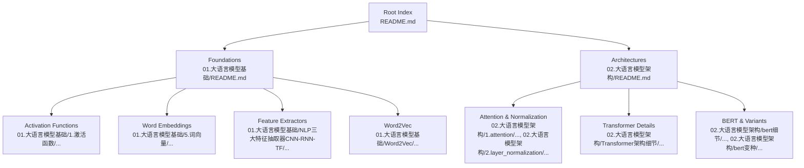
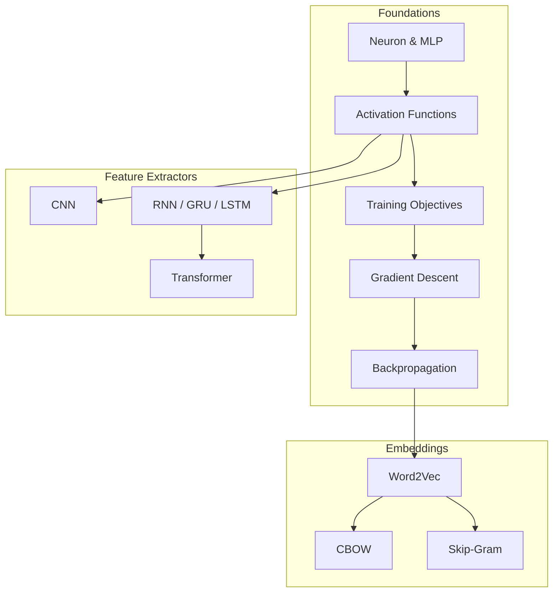
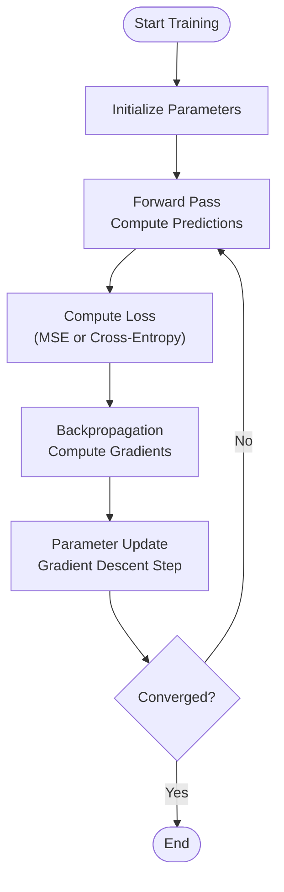
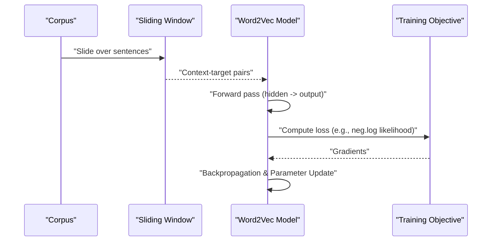
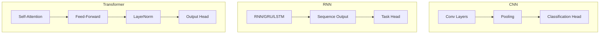
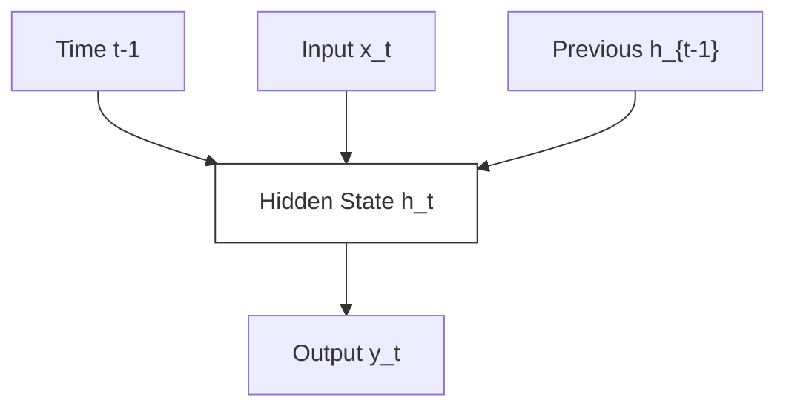
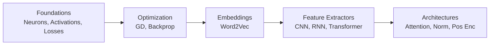

# Neural Network Foundations

<cite>
**Referenced Files in This Document**
- [2.神经网络基础.md](file://98.相关课程/清华大模型公开课/2.神经网络基础/2.神经网络基础.md)
- [README.md](file://01.大语言模型基础/README.md)
- [README.md](file://02.大语言模型架构/README.md)
</cite>

## Table of Contents
1. [Introduction](#introduction)
2. [Project Structure](#project-structure)
3. [Core Components](#core-components)
4. [Architecture Overview](#architecture-overview)
5. [Detailed Component Analysis](#detailed-component-analysis)
6. [Dependency Analysis](#dependency-analysis)
7. [Performance Considerations](#performance-considerations)
8. [Troubleshooting Guide](#troubleshooting-guide)
9. [Conclusion](#conclusion)
10. [Appendices](#appendices)

## Introduction
This document consolidates foundational knowledge on neural networks and their application to natural language processing (NLP). It covers:
- Activation functions (sigmoid, tanh, ReLU) and their mathematical properties and typical use cases
- Word embeddings and distributed representation learning, including Word2Vec (CBOW and skip-gram)
- NLP feature extraction paradigms: CNN, RNN, and Transformer architectures
- Mathematical foundations of backpropagation, gradient descent, and optimization
- Transition from traditional feature extraction to deep learning representations
- Practical examples, performance considerations, and best practices

The content is derived from course materials and curated notes within the repository, focusing on accessible explanations suitable for both beginners and practitioners.

## Project Structure
The repository organizes knowledge across thematic areas:
- Foundational neural networks and training fundamentals
- NLP-specific topics including word vectors and feature extractors
- Transformer architectures and advanced model designs
- Supplementary materials and cross-references

**Section sources**
- [README.md:1-36](file://01.大语言模型基础/README.md#L1-L36)
- [README.md:1-52](file://02.大语言模型架构/README.md#L1-L52)

## Core Components
This section distills the essential building blocks covered in the repository’s foundational materials:
- Neural network units and multi-layer perceptrons
- Activation functions (sigmoid, tanh, ReLU) and their roles in introducing non-linearity
- Training objectives (mean squared error, cross-entropy)
- Optimization via gradient descent and backpropagation
- Word embeddings and Word2Vec architectures (CBOW, skip-gram)
- NLP feature extraction with CNN, RNN, and Transformer
- Long short-term memory (LSTM) and gated recurrent units (GRU) for sequence modeling

**Section sources**
- [2.神经网络基础.md:1-534](file://98.相关课程/清华大模型公开课/2.神经网络基础/2.神经网络基础.md#L1-L534)
- [README.md:1-36](file://01.大语言模型基础/README.md#L1-L36)
- [README.md:1-52](file://02.大语言模型架构/README.md#L1-L52)

## Architecture Overview
The repository presents a layered progression from basic neural computation to modern NLP architectures:
- From single neurons and multi-layer perceptrons to activation-driven non-linear transformations
- From supervised training objectives to gradient-based optimization and backpropagation
- From static word representations to distributed embeddings (Word2Vec)
- From convolutional and recurrent networks to self-attention and transformers

**Diagram sources**
- [2.神经网络基础.md:1-534](file://98.相关课程/清华大模型公开课/2.神经网络基础/2.神经网络基础.md#L1-L534)

## Detailed Component Analysis

### Activation Functions: Sigmoid, Tanh, ReLU
- Purpose: Introduce non-linearity to enable multi-layer networks to learn complex mappings
- Properties and behavior:
  - Sigmoid: Smooth, bounded, commonly used in binary classification contexts; can suffer from vanishing gradients
  - Tanh: Zero-centered, often preferred over sigmoid in hidden layers; also susceptible to vanishing gradients
  - ReLU: Computationally efficient, helps mitigate vanishing gradients; may cause dead neurons if not carefully initialized
- Typical use cases:
  - Hidden layers: ReLU variants are widely used
  - Output layers: Sigmoid for binary classification, softmax for multi-class
  - Historical significance: Understanding these functions underpins modern activation choices

**Section sources**
- [2.神经网络基础.md:37-59](file://98.相关课程/清华大模型公开课/2.神经网络基础/2.神经网络基础.md#L37-L59)

### Training Objectives and Optimization
- Mean Squared Error (MSE): Used for regression tasks; minimizes average squared differences between predictions and targets
- Cross-Entropy: Used for classification tasks; measures the performance of a classification model whose output is a probability value
- Gradient Descent: Iterative optimization updating parameters in the direction of steepest descent of the loss function
- Backpropagation: Efficient computation of gradients via chain rule; decomposes complex derivatives into manageable local gradients

**Diagram sources**
- [2.神经网络基础.md:69-121](file://98.相关课程/清华大模型公开课/2.神经网络基础/2.神经网络基础.md#L69-L121)

**Section sources**
- [2.神经网络基础.md:69-121](file://98.相关课程/清华大模型公开课/2.神经网络基础/2.神经网络基础.md#L69-L121)

### Word Embeddings and Distributed Representation Learning
- Distributed representations: Words are mapped to dense vectors capturing semantic and syntactic regularities
- Advantages over one-hot encodings:
  - Compact, low-dimensional representations
  - Capture similarity and analogies (e.g., king – man + woman ≈ queen)
  - Enable transfer learning across tasks

**Section sources**
- [2.神经网络基础.md:209-227](file://98.相关课程/清华大模型公开课/2.神经网络基础/2.神经网络基础.md#L209-L227)

### Word2Vec: CBOW and Skip-Gram
- Continuous Bag-of-Words (CBOW):
  - Predicts the target word given surrounding context words
  - Assumes order-independence of context (bag-of-words assumption)
- Continuous Skip-Gram:
  - Predicts surrounding context words given a target word
  - Produces dense word vectors suitable for downstream tasks
- Practical considerations:
  - Large vocabulary challenges with softmax
  - Mitigation strategies: hierarchical softmax and negative sampling
  - Subsampling frequent words and soft sliding windows improve training dynamics

**Diagram sources**
- [2.神经网络基础.md:228-327](file://98.相关课程/清华大模型公开课/2.神经网络基础/2.神经网络基础.md#L228-L327)

**Section sources**
- [2.神经网络基础.md:228-327](file://98.相关课程/清华大模型公开课/2.神经网络基础/2.神经网络基础.md#L228-L327)

### NLP Feature Extraction: CNN, RNN, and Transformer
- Convolutional Neural Networks (CNN):
  - Effective for local pattern detection and fixed-length representations
  - Often combined with pooling to achieve translation equivariance
- Recurrent Neural Networks (RNN):
  - Designed for sequential data with memory over time steps
  - Challenges: vanishing/exploding gradients; addressed by GRU/LSTM variants
- Transformers:
  - Self-attention enables long-range dependencies without sequential scanning
  - Positional encodings restore order information
  - Dominant paradigm for modern NLP pretraining and fine-tuning

**Diagram sources**
- [2.神经网络基础.md:527-534](file://98.相关课程/清华大模型公开课/2.神经网络基础/2.神经网络基础.md#L527-L534)

**Section sources**
- [2.神经网络基础.md:330-534](file://98.相关课程/清华大模型公开课/2.神经网络基础/2.神经网络基础.md#L330-L534)

### Sequence Modeling: RNN, GRU, LSTM
- RNN unit computes hidden states as a function of current input and previous hidden state
- Vanishing gradient problem limits long-range dependency learning
- GRU introduces update and reset gates to balance information retention and new input
- LSTM augments RNN with cell state and three gates (forget, input, output) to better capture long-range dependencies

**Diagram sources**
- [2.神经网络基础.md:340-348](file://98.相关课程/清华大模型公开课/2.神经网络基础/2.神经网络基础.md#L340-L348)

**Section sources**
- [2.神经网络基础.md:330-514](file://98.相关课程/清华大模型公开课/2.神经网络基础/2.神经网络基础.md#L330-L514)

### Attention and Transformers
- Attention mechanism computes weighted sums over value vectors using learned queries and keys
- Layer normalization stabilizes training and accelerates convergence
- Transformer architecture relies on multi-head self-attention and feed-forward sublayers
- Positional encodings encode sequence order into the input representations

**Section sources**
- [README.md:1-52](file://02.大语言模型架构/README.md#L1-L52)
- [2.神经网络基础.md:1-534](file://98.相关课程/清华大模型公开课/2.神经网络基础/2.神经网络基础.md#L1-L534)

## Dependency Analysis
The repository materials form a coherent dependency chain:
- Foundational math and neural computation underpin training and optimization
- Embeddings build upon activation functions and training objectives
- Feature extractors evolve from CNN and RNN to Transformers
- Architectural details (attention, normalization, position encoding) support modern transformer-based models

**Diagram sources**
- [2.神经网络基础.md:1-534](file://98.相关课程/清华大模型公开课/2.神经网络基础/2.神经网络基础.md#L1-L534)
- [README.md:1-52](file://02.大语言模型架构/README.md#L1-L52)

**Section sources**
- [2.神经网络基础.md:1-534](file://98.相关课程/清华大模型公开课/2.神经网络基础/2.神经网络基础.md#L1-L534)
- [README.md:1-52](file://02.大语言模型架构/README.md#L1-L52)

## Performance Considerations
- Activation selection:
  - Prefer ReLU-like activations in hidden layers for faster training and reduced vanishing gradient risk
  - Use sigmoid/softmax at outputs appropriate to task type
- Training stability:
  - Apply gradient clipping and normalization techniques
  - Use residual connections and normalization layers to stabilize deep networks
- Embedding efficiency:
  - For large vocabularies, use hierarchical softmax or negative sampling to reduce computational cost
  - Adjust subsampling thresholds and window sizes to balance signal and noise
- Sequence modeling:
  - Use LSTM/GRU variants for long sequences to mitigate vanishing gradients
  - Consider transformer architectures for long-range dependencies and parallelism
- Feature extractors:
  - CNNs excel at local patterns; RNNs at sequential order; Transformers at global context and scalability

[No sources needed since this section provides general guidance]

## Troubleshooting Guide
Common pitfalls and remedies grounded in the repository’s training and optimization materials:
- Divergence or slow convergence:
  - Reduce learning rate or apply adaptive optimizers
  - Normalize inputs and initialize weights carefully
- Vanishing/exploding gradients:
  - Use gradient clipping, residual connections, and normalization
  - Switch to GRU/LSTM or transformer-based architectures for long sequences
- Poor embedding quality:
  - Increase corpus size and adjust subsampling and window parameters
  - Consider hierarchical softmax or negative sampling for large vocabularies
- Overfitting:
  - Add regularization (dropout, weight decay), early stopping, and data augmentation

**Section sources**
- [2.神经网络基础.md:372-384](file://98.相关课程/清华大模型公开课/2.神经网络基础/2.神经网络基础.md#L372-L384)
- [2.神经网络基础.md:271-327](file://98.相关课程/清华大模型公开课/2.神经网络基础/2.神经网络基础.md#L271-L327)

## Conclusion
This document synthesized the repository’s foundational materials on neural networks and NLP feature extraction. It outlined activation functions, training objectives, and backpropagation, then connected these to word embeddings (especially Word2Vec) and modern architectures (CNN, RNN, Transformer). The guidance emphasizes practical considerations for performance and troubleshooting, enabling practitioners to transition from traditional feature extraction to deep learning representations effectively.

[No sources needed since this section summarizes without analyzing specific files]

## Appendices
- Cross-references to related topics within the repository:
  - Activation functions and normalization
  - Attention mechanisms and positional encodings
  - BERT and transformer variants
  - Llama series architectures and decoding strategies

**Section sources**
- [README.md:1-52](file://02.大语言模型架构/README.md#L1-L52)
- [README.md:1-36](file://01.大语言模型基础/README.md#L1-L36)