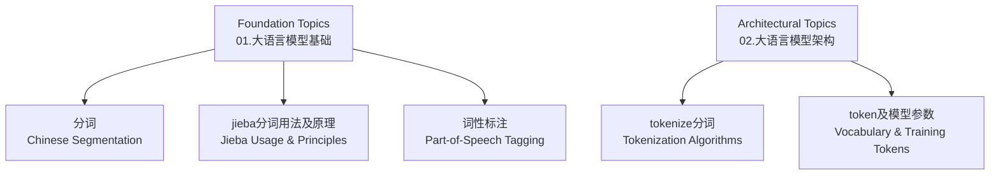
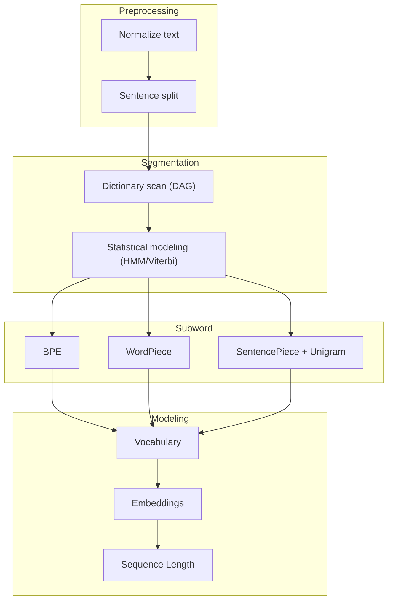
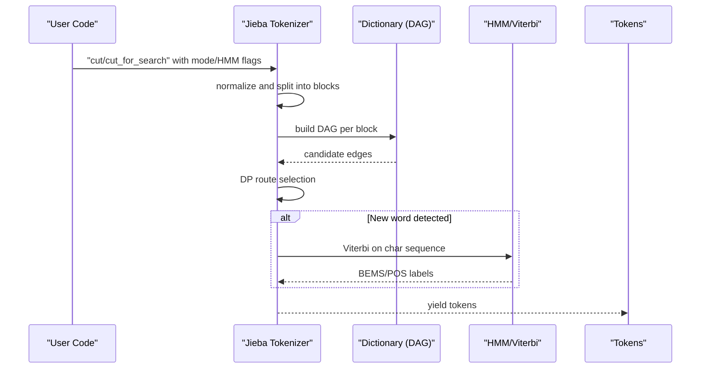
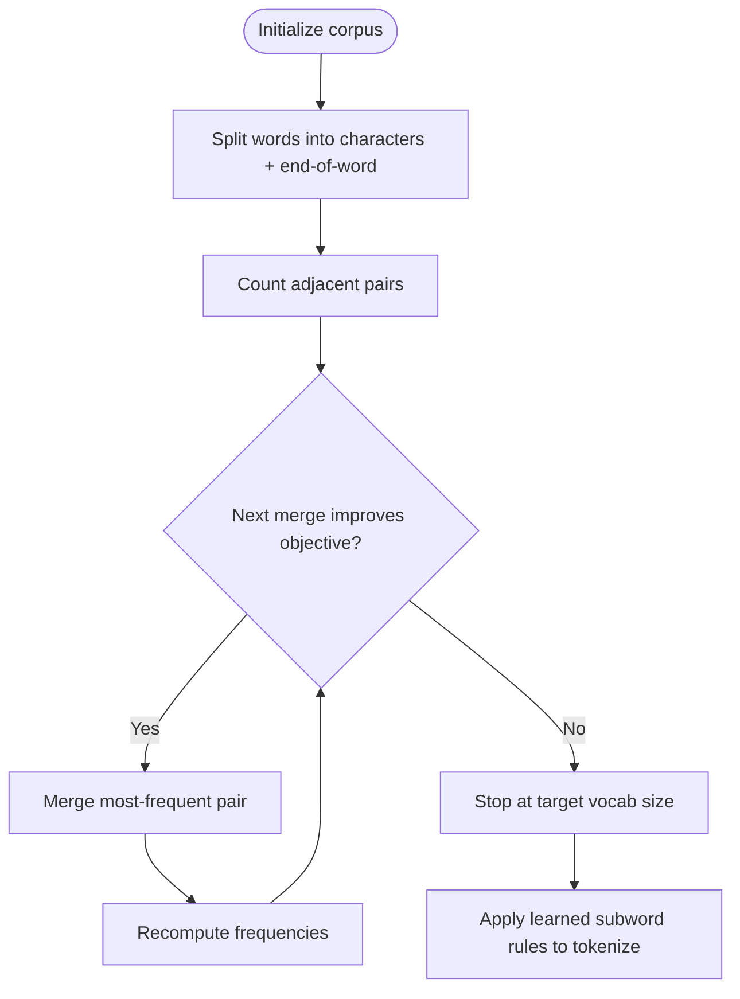
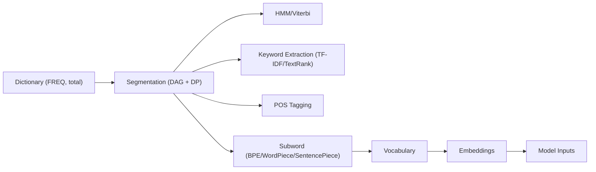

# Text Processing and Tokenization

<cite>
**Referenced Files in This Document**
- [01.大语言模型基础\1.分词\1.分词.md](file://01.大语言模型基础\1.分词\1.分词.md)
- [01.大语言模型基础\2.jieba分词用法及原理\2.jieba分词用法及原理.md](file://01.大语言模型基础\2.jieba分词用法及原理\2.jieba分词用法及原理.md)
- [01.大语言模型基础\2.jieba分词用法及原理\jieba.ipynb](file://01.大语言模型基础\2.jieba分词用法及原理\jieba.ipynb)
- [01.大语言模型基础\3.词性标注\3.词性标注.md](file://01.大语言模型基础\3.词性标注\3.词性标注.md)
- [02.大语言模型架构\4.tokenize分词\4.tokenize分词.md](file://02.大语言模型架构\4.tokenize分词\4.tokenize分词.md)
- [02.大语言模型架构\5.token及模型参数\5.token及模型参数.md](file://02.大语言模型架构\5.token及模型参数\5.token及模型参数.md)
- [01.大语言模型基础\README.md](file://01.大语言模型基础\README.md)
- [02.大语言模型架构\README.md](file://02.大语言模型架构\README.md)
</cite>

## Table of Contents
1. [Introduction](#introduction)
2. [Project Structure](#project-structure)
3. [Core Components](#core-components)
4. [Architecture Overview](#architecture-overview)
5. [Detailed Component Analysis](#detailed-component-analysis)
6. [Dependency Analysis](#dependency-analysis)
7. [Performance Considerations](#performance-considerations)
8. [Troubleshooting Guide](#troubleshooting-guide)
9. [Conclusion](#conclusion)
10. [Appendices](#appendices)

## Introduction
This document provides a comprehensive guide to text processing and tokenization, focusing on preprocessing techniques and tokenization methods used in modern natural language processing and large language models. It covers:
- Subword tokenization, Byte Pair Encoding (BPE), WordPiece, and SentencePiece
- Practical jieba Chinese tokenizer usage and implementation details
- Word segmentation techniques across languages and scripts
- Morphological analysis, stemming, and lemmatization
- Multilingual tokenization strategies
- Implementation details, performance considerations, and best practices
- Hands-on examples via Jupyter notebooks

## Project Structure
The repository organizes relevant materials under two major topical areas:
- Foundation topics (tokenization basics, Chinese segmentation, POS tagging)
- Architectural topics (tokenization algorithms, vocabulary sizing, training token considerations)

**Section sources**
- [01.大语言模型基础\README.md:1-36](file://01.大语言模型基础\README.md#L1-L36)
- [02.大语言模型架构\README.md:1-52](file://02.大语言模型架构\README.md#L1-L52)

## Core Components
- Chinese segmentation fundamentals and challenges (歧义、未登录词、词典与统计方法)
- Jieba tokenizer modes, HMM-based new word handling, keyword extraction, POS tagging, and parallelization
- Subword tokenization algorithms (BPE, WordPiece, SentencePiece) and vocabulary strategies
- Token-level modeling considerations and training token repetition effects

**Section sources**
- [01.大语言模型基础\1.分词\1.分词.md:1-85](file://01.大语言模型基础\1.分词\1.分词.md#L1-L85)
- [01.大语言模型基础\2.jieba分词用法及原理\2.jieba分词用法及原理.md:1-860](file://01.大语言模型基础\2.jieba分词用法及原理\2.jieba分词用法及原理.md#L1-L860)
- [01.大语言模型基础\3.词性标注\3.词性标注.md:1-285](file://01.大语言模型基础\3.词性标注\3.词性标注.md#L1-L285)
- [02.大语言模型架构\4.tokenize分词\4.tokenize分词.md:1-228](file://02.大语言模型架构\4.tokenize分词\4.tokenize分词.md#L1-L228)
- [02.大语言模型架构\5.token及模型参数\5.token及模型参数.md:1-144](file://02.大语言模型架构\5.token及模型参数\5.token及模型参数.md#L1-L144)

## Architecture Overview
The tokenization pipeline integrates preprocessing, segmentation, and vocabulary construction. At a high level:
- Preprocessing normalizes text and splits into sentences/phrases
- Segmentation applies either dictionary-based scanning (DAG) or statistical models (HMM/Viterbi)
- Subword algorithms (BPE/WordPiece/SentencePiece) build compact vocabularies
- Tokenization aligns tokens to embeddings and model inputs

[No sources needed since this diagram shows conceptual workflow, not actual code structure]

## Detailed Component Analysis

### Jieba Chinese Tokenization and Morphological Support
Jieba combines dictionary scanning and statistical modeling:
- Dictionary-driven segmentation via DAG and dynamic programming
- HMM/Viterbi for new words and POS tagging
- Keyword extraction via TF-IDF and TextRank
- POS tagging aligned with ICTCLAS
- Parallel processing support for throughput

**Diagram sources**
- [01.大语言模型基础\2.jieba分词用法及原理\2.jieba分词用法及原理.md:565-666](file://01.大语言模型基础\2.jieba分词用法及原理\2.jieba分词用法及原理.md#L565-L666)
- [01.大语言模型基础\2.jieba分词用法及原理\2.jieba分词用法及原理.md:699-718](file://01.大语言模型基础\2.jieba分词用法及原理\2.jieba分词用法及原理.md#L699-L718)
- [01.大语言模型基础\2.jieba分词用法及原理\2.jieba分词用法及原理.md:784-800](file://01.大语言模型基础\2.jieba分词用法及原理\2.jieba分词用法及原理.md#L784-L800)

Key capabilities and examples:
- Modes: precise, full, search engine, paddle (optional)
- Dynamic dictionary adjustments: add/delete words, frequency tuning
- Keyword extraction: TF-IDF and TextRank
- POS tagging: compatible with ICTCLAS tags
- Parallel segmentation for throughput
- Token position tracking

Hands-on notebook highlights:
- Basic segmentation modes and outputs
- Dictionary manipulation and frequency tuning
- TF-IDF and TextRank keyword extraction
- POS tagging and tag mapping

**Section sources**
- [01.大语言模型基础\2.jieba分词用法及原理\2.jieba分词用法及原理.md:32-300](file://01.大语言模型基础\2.jieba分词用法及原理\2.jieba分词用法及原理.md#L32-L300)
- [01.大语言模型基础\2.jieba分词用法及原理\2.jieba分词用法及原理.md:157-240](file://01.大语言模型基础\2.jieba分词用法及原理\2.jieba分词用法及原理.md#L157-L240)
- [01.大语言模型基础\2.jieba分词用法及原理\2.jieba分词用法及原理.md:242-280](file://01.大语言模型基础\2.jieba分词用法及原理\2.jieba分词用法及原理.md#L242-L280)
- [01.大语言模型基础\2.jieba分词用法及原理\2.jieba分词用法及原理.md:281-303](file://01.大语言模型基础\2.jieba分词用法及原理\2.jieba分词用法及原理.md#L281-L303)
- [01.大语言模型基础\2.jieba分词用法及原理\2.jieba分词用法及原理.md:304-400](file://01.大语言模型基础\2.jieba分词用法及原理\2.jieba分词用法及原理.md#L304-L400)
- [01.大语言模型基础\2.jieba分词用法及原理\jieba.ipynb:1-170](file://01.大语言模型基础\2.jieba分词用法及原理\jieba.ipynb#L1-L170)

### Subword Tokenization: BPE, WordPiece, SentencePiece
- BPE merges frequent character pairs iteratively until target vocabulary size is reached; supports unknown word handling
- WordPiece selects merges that maximize likelihood under a language model; variant of BPE emphasizing probability gains
- SentencePiece treats whole sentences, optionally replacing spaces with a sentinel, then applies BPE or Unigram
- Unigram trims a large initial vocabulary by removing tokens that minimally increase loss

**Diagram sources**
- [02.大语言模型架构\4.tokenize分词\4.tokenize分词.md:26-172](file://02.大语言模型架构\4.tokenize分词\4.tokenize分词.md#L26-L172)

Practical guidance:
- Choose subword granularity based on dataset size and downstream tasks
- SentencePiece + Unigram often yields robust multilingual coverage
- WordPiece tends to preserve frequent words intact, aiding lexical stability

**Section sources**
- [02.大语言模型架构\4.tokenize分词\4.tokenize分词.md:22-228](file://02.大语言模型架构\4.tokenize分词\4.tokenize分词.md#L22-L228)

### Multilingual Tokenization Strategies
- Character-level: simple but high-dimensional embedding needs
- Word-level: intuitive but suffers from out-of-vocabulary and long tail
- Subword-level: balance between lexical fidelity and compression
- SentencePiece supports multilingual by treating space as a special symbol and combining with BPE/Unigram

**Section sources**
- [02.大语言模型架构\4.tokenize分词\4.tokenize分词.md:12-22](file://02.大语言模型架构\4.tokenize分词\4.tokenize分词.md#L12-L22)

### Morphological Analysis, Stemming, and Lemmatization
- Chinese lacks inflectional morphology; morphological analysis is less applicable compared to agglutinative or fusional languages
- Jieba’s POS tagging leverages dictionary lookup and HMM/Viterbi for unseen words
- For morphologically rich languages, consider dedicated stemmers/lemmatizers (e.g., NLTK Snowball, spaCy) as part of preprocessing before tokenization

**Section sources**
- [01.大语言模型基础\3.词性标注\3.词性标注.md:1-285](file://01.大语言模型基础\3.词性标注\3.词性标注.md#L1-L285)

### Token-Level Modeling and Training Tokens
- Vocabulary size and token counts scale with model capacity and compute budgets
- Repeated epochs on the same tokens degrade performance; larger datasets mitigate overfitting
- Dropout and gradual warm-up of regularization can reduce negative impacts of multi-epoch training

**Section sources**
- [02.大语言模型架构\5.token及模型参数\5.token及模型参数.md:1-144](file://02.大语言模型架构\5.token及模型参数\5.token及模型参数.md#L1-L144)

## Dependency Analysis
High-level dependencies among components:
- Segmentation depends on dictionary initialization and optional HMM parameters
- Subword algorithms depend on corpus statistics and merging heuristics
- POS tagging depends on segmentation quality and tag dictionaries
- Model performance depends on vocabulary design and token distribution

[No sources needed since this diagram shows conceptual relationships, not specific code files]

## Performance Considerations
- Prefer subword tokenization to balance vocabulary size and semantic coverage
- Use parallel segmentation for large-scale corpora
- Tune vocabulary size and merging criteria to match downstream task complexity
- Monitor token repetition and epoch effects during pretraining; adjust regularization accordingly

[No sources needed since this section provides general guidance]

## Troubleshooting Guide
Common issues and remedies:
- Unknown words: rely on HMM-based segmentation and POS tagging; adjust frequencies or add custom entries
- Ambiguity resolution: prefer search engine mode for retrieval tasks; use domain-specific dictionaries
- POS accuracy: dictionary-based lookup may fail for ambiguous cases; leverage HMM/Viterbi for unseen words
- Throughput: enable parallel segmentation for multi-core environments

**Section sources**
- [01.大语言模型基础\2.jieba分词用法及原理\2.jieba分词用法及原理.md:126-156](file://01.大语言模型基础\2.jieba分词用法及原理\2.jieba分词用法及原理.md#L126-L156)
- [01.大语言模型基础\3.词性标注\3.词性标注.md:18-31](file://01.大语言模型基础\3.词性标注\3.词性标注.md#L18-L31)

## Conclusion
Effective text processing and tokenization hinge on understanding language-specific characteristics and selecting appropriate segmentation and subword strategies. Jieba offers a robust, fast baseline for Chinese segmentation and POS tagging, while BPE, WordPiece, and SentencePiece provide scalable subword solutions for multilingual and large-scale models. Proper vocabulary design, token distribution awareness, and training practices are essential for strong downstream performance.

[No sources needed since this section summarizes without analyzing specific files]

## Appendices

### Practical Examples Index
- Jieba segmentation modes and outputs: [01.大语言模型基础\2.jieba分词用法及原理\jieba.ipynb:19-33](file://01.大语言模型基础\2.jieba分词用法及原理\jieba.ipynb#L19-L33)
- Dictionary manipulation and frequency tuning: [01.大语言模型基础\2.jieba分词用法及原理\2.jieba分词用法及原理.md:126-156](file://01.大语言模型基础\2.jieba分词用法及原理\2.jieba分词用法及原理.md#L126-L156)
- TF-IDF and TextRank keyword extraction: [01.大语言模型基础\2.jieba分词用法及原理\2.jieba分词用法及原理.md:157-240](file://01.大语言模型基础\2.jieba分词用法及原理\2.jieba分词用法及原理.md#L157-L240)
- POS tagging and tag mapping: [01.大语言模型基础\2.jieba分词用法及原理\2.jieba分词用法及原理.md:242-280](file://01.大语言模型基础\2.jieba分词用法及原理\2.jieba分词用法及原理.md#L242-L280)
- Parallel segmentation and throughput: [01.大语言模型基础\2.jieba分词用法及原理\2.jieba分词用法及原理.md:281-303](file://01.大语言模型基础\2.jieba分词用法及原理\2.jieba分词用法及原理.md#L281-L303)
- Subword tokenization walkthrough (BPE): [02.大语言模型架构\4.tokenize分词\4.tokenize分词.md:26-172](file://02.大语言模型架构\4.tokenize分词\4.tokenize分词.md#L26-L172)