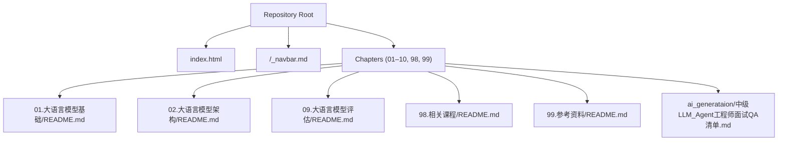
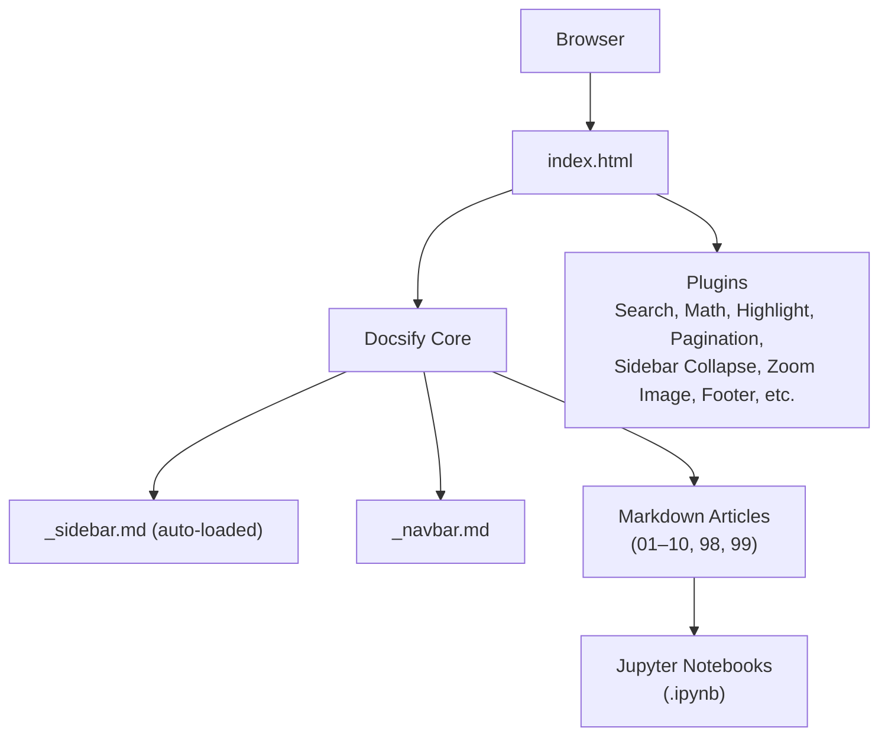
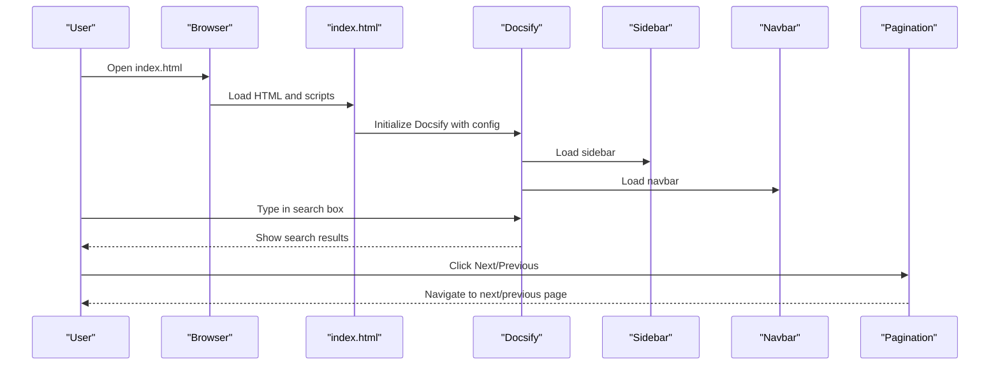
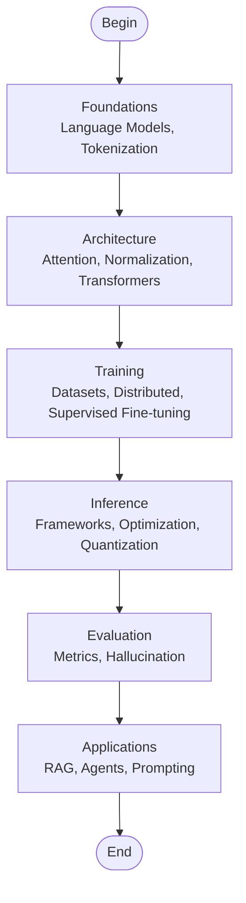
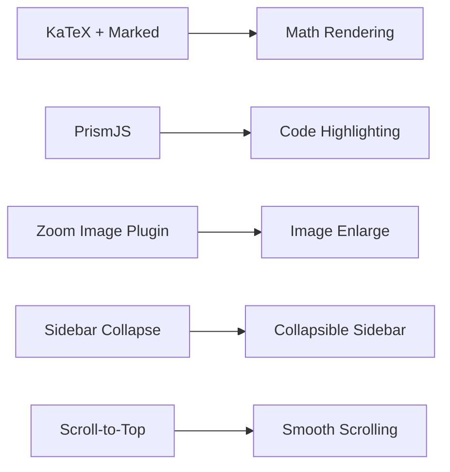
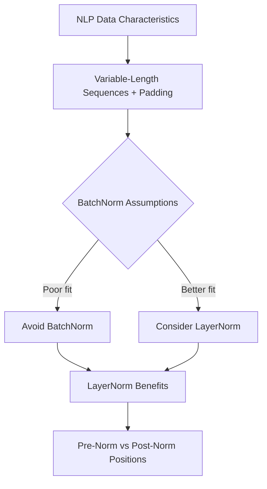
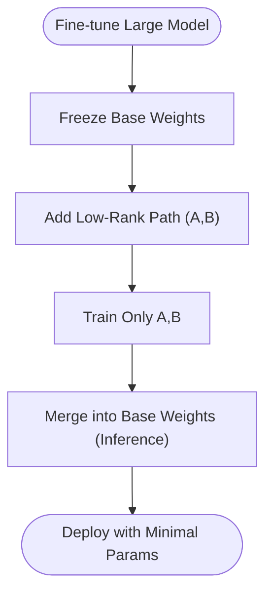
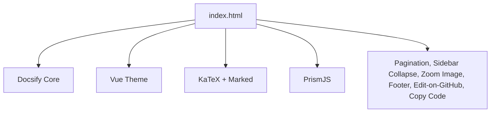

# Getting Started

<cite>
**Referenced Files in This Document**
- [README.md](file://README.md)
- [index.html](file://index.html)
- [_navbar.md](file://_navbar.md)
- [01.大语言模型基础/README.md](file://01.大语言模型基础/README.md)
- [02.大语言模型架构/README.md](file://02.大语言模型架构/README.md)
- [01.大语言模型基础/1.语言模型/1.语言模型.md](file://01.大语言模型基础/1.语言模型/1.语言模型.md)
- [02.大语言模型架构/1.attention/BN VS LN.md](file://02.大语言模型架构/1.attention/BN VS LN.md)
- [05.有监督微调/4.lora/4.lora.md](file://05.有监督微调/4.lora/4.lora.md)
- [01.大语言模型基础/2.jieba分词用法及原理/jieba.ipynb](file://01.大语言模型基础/2.jieba分词用法及原理/jieba.ipynb)
- [09.大语言模型评估/README.md](file://09.大语言模型评估/README.md)
- [98.相关课程/README.md](file://98.相关课程/README.md)
- [99.参考资料/README.md](file://99.参考资料/README.md)
- [ai_generataion/中级LLM_Agent工程师面试QA清单.md](file://ai_generataion/中级LLM_Agent工程师面试QA清单.md)
</cite>

## Table of Contents
1. [Introduction](#introduction)
2. [Project Structure](#project-structure)
3. [Core Components](#core-components)
4. [Architecture Overview](#architecture-overview)
5. [Detailed Component Analysis](#detailed-component-analysis)
6. [Dependency Analysis](#dependency-analysis)
7. [Performance Considerations](#performance-considerations)
8. [Troubleshooting Guide](#troubleshooting-guide)
9. [Conclusion](#conclusion)
10. [Appendices](#appendices)

## Introduction
This guide helps you quickly get started with the LLM Interview Preparation Project. It covers how to access the online documentation, recommended browsers and viewing experiences, repository structure and navigation patterns, prerequisites, navigating the hierarchical content, using search and pagination, progressing through difficulty levels, interactive features, mathematical notation rendering, and code examples. It also provides learning path recommendations tailored to different user profiles: beginners, interview candidates, and practitioners.

## Project Structure
The repository organizes content by topic into folders, each containing Markdown articles and sometimes Jupyter notebooks. The site is built with Docsify and enhanced with plugins for search, math rendering, code highlighting, pagination, and more. Navigation is driven by the main index page and the sidebar configuration.

**Diagram sources**
- [index.html:14-66](file://index.html#L14-L66)
- [01.大语言模型基础/README.md:1-36](file://01.大语言模型基础/README.md#L1-L36)
- [02.大语言模型架构/README.md:1-52](file://02.大语言模型架构/README.md#L1-L52)
- [09.大语言模型评估/README.md:1-12](file://09.大语言模型评估/README.md#L1-L12)
- [98.相关课程/README.md:1-4](file://98.相关课程/README.md#L1-L4)
- [99.参考资料/README.md:1-10](file://99.参考资料/README.md#L1-L10)
- [ai_generataion/中级LLM_Agent工程师面试QA清单.md:1-200](file://ai_generataion/中级LLM_Agent工程师面试QA清单.md#L1-L200)

**Section sources**
- [README.md:23-26](file://README.md#L23-L26)
- [index.html:14-66](file://index.html#L14-L66)
- [01.大语言模型基础/README.md:1-36](file://01.大语言模型基础/README.md#L1-L36)
- [02.大语言模型架构/README.md:1-52](file://02.大语言模型架构/README.md#L1-L52)

## Core Components
- Online documentation platform powered by Docsify with plugins for search, math rendering, code highlighting, pagination, and more.
- Hierarchical chapter-based structure with topic-specific READMEs guiding navigation.
- Interactive features include:
  - Full-text search
  - Mathematical notation rendering via KaTeX and Marked
  - Code block highlighting for multiple languages
  - Pagination across chapters
  - Sidebar collapse and zoom-image plugin for images
  - Edit-on-github links and external script support
- Local access: clone the repository and open index.html in a modern browser.

**Section sources**
- [index.html:14-120](file://index.html#L14-L120)
- [README.md:23-26](file://README.md#L23-L26)

## Architecture Overview
The documentation site is a static SPA generated by Docsify. The index page initializes Docsify and loads plugins. The sidebar and navbar are configured via index.html and _navbar.md. Content is organized under chapter folders with Markdown files and optional notebooks.

**Diagram sources**
- [index.html:14-120](file://index.html#L14-L120)
- [_navbar.md:1-5](file://_navbar.md#L1-L5)

## Detailed Component Analysis

### Installation and Access
- Online access: Visit the published URL to read the documentation in a browser.
- Local access: Clone the repository and open index.html in a modern browser. The site is static and does not require a server to serve content.

Recommended browsers:
- Chrome, Firefox, Edge, Safari (latest versions) are supported. The site relies on modern JavaScript and CSS features.

Viewing experience:
- Enable JavaScript and ensure images and KaTeX render correctly. Use Docsify’s built-in zoom-image plugin to enlarge figures.

**Section sources**
- [README.md:23-26](file://README.md#L23-L26)
- [index.html:6-11](file://index.html#L6-L11)

### Navigation Patterns
- Use the left sidebar to browse chapters and topics. The sidebar is loaded automatically and supports collapsing.
- Use the top navbar for quick links and repository navigation.
- Pagination controls at the bottom allow moving across chapters and pages.
- The search bar enables full-text search across content.

**Diagram sources**
- [index.html:14-66](file://index.html#L14-L66)

**Section sources**
- [index.html:18-33](file://index.html#L18-L33)
- [index.html:25-33](file://index.html#L25-L33)
- [index.html:34-39](file://index.html#L34-L39)
- [_navbar.md:1-5](file://_navbar.md#L1-L5)

### Hierarchical Content and Difficulty Progression
- Chapters are grouped by topic (e.g., foundational concepts, architecture, training, inference, evaluation, applications).
- Each chapter folder contains a README that lists subtopics and links to Markdown articles.
- Progression path:
  - Foundational concepts: language models, tokenization, embeddings
  - Architecture: attention mechanisms, normalization, transformer variants
  - Training: datasets, distributed training, supervised fine-tuning
  - Inference: frameworks, optimization, quantization
  - Evaluation: metrics, hallucination
  - Applications: RAG, agent systems, chain-of-thought prompting
- Difficulty builds from basic concepts to advanced topics. Start with earlier chapters and move forward.

**Section sources**
- [01.大语言模型基础/README.md:1-36](file://01.大语言模型基础/README.md#L1-L36)
- [02.大语言模型架构/README.md:1-52](file://02.大语言模型架构/README.md#L1-L52)
- [09.大语言模型评估/README.md:1-12](file://09.大语言模型评估/README.md#L1-L12)

### Using Search and Pagination
- Search: Enter keywords in the search box. Results appear instantly across all content.
- Pagination: Use “Previous” and “Next” buttons to move across chapters and pages. Cross-chapter navigation is enabled.

**Section sources**
- [index.html:34-39](file://index.html#L34-L39)
- [index.html:28-33](file://index.html#L28-L33)

### Interactive Features
- Mathematical notation: LaTeX-style formulas are rendered via KaTeX and Marked.
- Code blocks: PrismJS highlights multiple languages (Python, Bash, Java, JavaScript, SQL, YAML, JSON, etc.).
- Images: Zoom on click via the zoom-image plugin.
- Sidebar: Collapsible sections improve readability.
- Footer and scroll-to-top: Enhance usability.

**Diagram sources**
- [index.html:73-96](file://index.html#L73-L96)
- [index.html:105-110](file://index.html#L105-L110)
- [index.html:50-57](file://index.html#L50-L57)

**Section sources**
- [index.html:73-96](file://index.html#L73-L96)
- [index.html:105-110](file://index.html#L105-L110)
- [index.html:50-57](file://index.html#L50-L57)

### Prerequisites
- Basic understanding of machine learning concepts and neural networks.
- Programming fundamentals (e.g., Python) to follow along with code examples and notebooks.
- Familiarity with text preprocessing and tokenization concepts is helpful.

**Section sources**
- [01.大语言模型基础/1.语言模型/1.语言模型.md:1-50](file://01.大语言模型基础/1.语言模型/1.语言模型.md#L1-L50)
- [02.大语言模型架构/1.attention/BN VS LN.md:1-35](file://02.大语言模型架构/1.attention/BN VS LN.md#L1-L35)

### Learning Paths by Profile
- Beginners:
  - Start with foundational chapters: language models, tokenization, embeddings.
  - Review course materials and references for supplementary learning.
- Interview candidates:
  - Focus on architecture, fine-tuning, inference, evaluation, and applications.
  - Use the QA checklist for targeted practice.
- Practitioners:
  - Dive into advanced topics: distributed training, inference frameworks, RAG, agents, and practical code examples.

**Section sources**
- [98.相关课程/README.md:1-4](file://98.相关课程/README.md#L1-L4)
- [99.参考资料/README.md:1-10](file://99.参考资料/README.md#L1-L10)
- [ai_generataion/中级LLM_Agent工程师面试QA清单.md:1-200](file://ai_generataion/中级LLM_Agent工程师面试QA清单.md#L1-L200)

### Working with Code Examples and Notebooks
- Some topics include Jupyter notebooks demonstrating practical usage (e.g., Chinese word segmentation).
- Open the notebook locally in a compatible environment to run and experiment with the code.

**Section sources**
- [01.大语言模型基础/2.jieba分词用法及原理/jieba.ipynb:1-170](file://01.大语言模型基础/2.jieba分词用法及原理/jieba.ipynb#L1-L170)

### Practical Example: Attention vs LayerNorm
This article explains why transformers use LayerNorm over BatchNorm, with diagrams and positions of normalization in pre-norm vs post-norm architectures.

**Diagram sources**
- [02.大语言模型架构/1.attention/BN VS LN.md:8-78](file://02.大语言模型架构/1.attention/BN VS LN.md#L8-L78)

**Section sources**
- [02.大语言模型架构/1.attention/BN VS LN.md:1-107](file://02.大语言模型架构/1.attention/BN VS LN.md#L1-L107)

### Practical Example: LoRA Fine-tuning
This article explains low-rank adaptation (LoRA), its motivation, technical principle, and advantages over full-parameter fine-tuning.

**Diagram sources**
- [05.有监督微调/4.lora/4.lora.md:9-32](file://05.有监督微调/4.lora/4.lora.md#L9-L32)

**Section sources**
- [05.有监督微调/4.lora/4.lora.md:1-114](file://05.有监督微调/4.lora/4.lora.md#L1-L114)

## Dependency Analysis
The documentation site depends on Docsify and a set of plugins. The index page loads:
- Core Docsify runtime
- Theme and KaTeX for math rendering
- PrismJS for code highlighting
- Pagination, sidebar collapse, zoom-image, footer, edit-on-github, and other plugins

**Diagram sources**
- [index.html:71-120](file://index.html#L71-L120)

**Section sources**
- [index.html:71-120](file://index.html#L71-L120)

## Performance Considerations
- Static site: No server-side rendering; fast loading in modern browsers.
- Images: Use zoom-image plugin judiciously; large images may slow down initial load.
- Math rendering: KaTeX is efficient; keep formula sizes reasonable for readability.
- Code highlighting: PrismJS adds client-side processing; ensure only necessary languages are loaded.

[No sources needed since this section provides general guidance]

## Troubleshooting Guide
- Page not loading:
  - Ensure JavaScript is enabled.
  - Try a different modern browser.
- Search not working:
  - Verify search plugin is loaded and not blocked by ad blockers.
- Math not rendering:
  - Confirm KaTeX and Marked are included and network allows CDN access.
- Code blocks not highlighted:
  - Ensure PrismJS plugins for the relevant languages are loaded.
- Sidebar not appearing:
  - Check that loadSidebar is enabled and _sidebar.md exists or is aliased correctly.
- Pagination issues:
  - Ensure pagination plugin is loaded and subMaxLevel is configured appropriately.

**Section sources**
- [index.html:18-33](file://index.html#L18-L33)
- [index.html:34-39](file://index.html#L34-L39)
- [index.html:73-96](file://index.html#L73-L96)
- [index.html:105-110](file://index.html#L105-L110)

## Conclusion
You can access the LLM Interview Preparation Project online or locally, navigate through structured chapters, search content, and leverage interactive features like math rendering and code highlighting. Use the suggested learning paths to tailor your study to your profile and goals.

[No sources needed since this section summarizes without analyzing specific files]

## Appendices

### Appendix A: Quick Links
- Online documentation: [LLMs Interview Note](http://wdndev.github.io/llm_interview_note)
- Repository: [GitHub](https://github.com/wdndev/llm_interview_note)

**Section sources**
- [README.md:23-26](file://README.md#L23-L26)

### Appendix B: Additional Resources
- Related courses and references are linked from the course and references sections.

**Section sources**
- [98.相关课程/README.md:1-4](file://98.相关课程/README.md#L1-L4)
- [99.参考资料/README.md:1-10](file://99.参考资料/README.md#L1-L10)