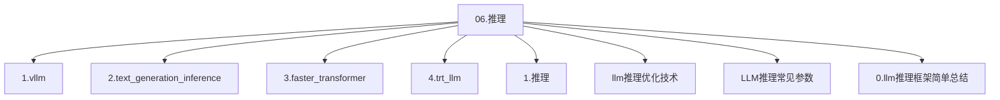
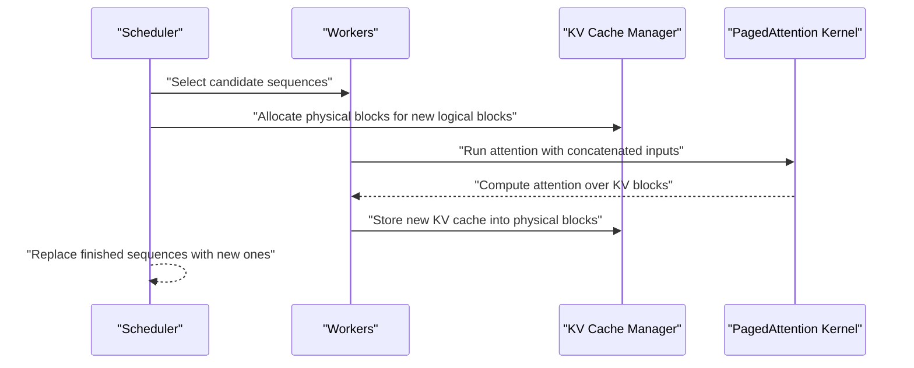
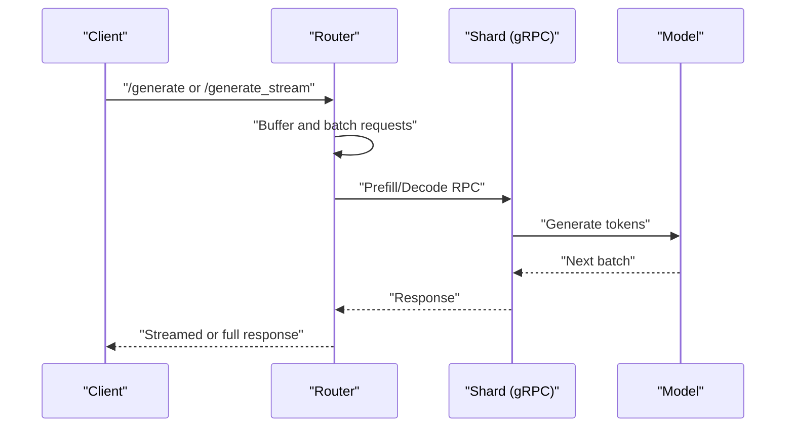
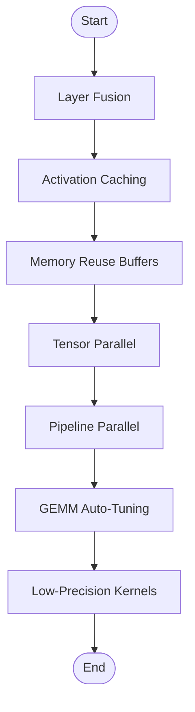
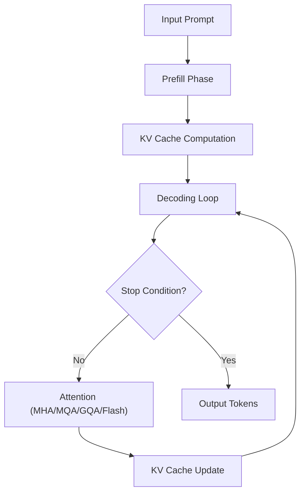
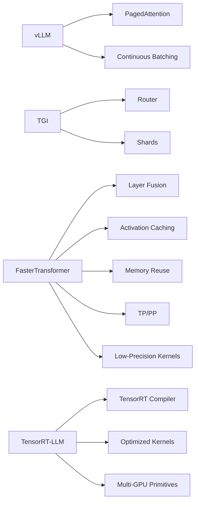

# Inference Frameworks

<cite>
**Referenced Files in This Document**
- [1.vllm.md](file://06.推理/1.vllm/1.vllm.md)
- [2.text_generation_inference.md](file://06.推理/2.text_generation_inference/2.text_generation_inference.md)
- [3.faster_transformer.md](file://06.推理/3.faster_transformer/3.faster_transformer.md)
- [4.trt_llm.md](file://06.推理/4.trt_llm/4.trt_llm.md)
- [1.推理.md](file://06.推理/1.推理/1.推理.md)
- [llm推理优化技术.md](file://06.推理/llm推理优化技术/llm推理优化技术.md)
- [LLM推理常见参数.md](file://06.推理/LLM推理常见参数/LLM推理常见参数.md)
- [0.llm推理框架简单总结.md](file://06.推理/0.llm推理框架简单总结/0.llm推理框架简单总结.md)
</cite>

## Table of Contents
1. [Introduction](#introduction)
2. [Project Structure](#project-structure)
3. [Core Components](#core-components)
4. [Architecture Overview](#architecture-overview)
5. [Detailed Component Analysis](#detailed-component-analysis)
6. [Dependency Analysis](#dependency-analysis)
7. [Performance Considerations](#performance-considerations)
8. [Troubleshooting Guide](#troubleshooting-guide)
9. [Conclusion](#conclusion)
10. [Appendices](#appendices)

## Introduction
This document provides a comprehensive comparison of inference frameworks for large language models (LLMs): vLLM, Text Generation Inference (TGI), FasterTransformer, and TensorRT-LLM. It explains the technical foundations, design principles, and comparative advantages of each framework, and documents implementation details, configuration options, performance characteristics, and use-case scenarios. Practical examples demonstrate framework selection criteria, deployment strategies, and integration patterns. Guidance is included for choosing the right framework based on application requirements, hardware constraints, and performance targets.

## Project Structure
The repository organizes inference-related materials under the “06.推理” (LLM Inference) directory. The relevant files for this document include:
- vLLM overview and PagedAttention architecture
- TGI service architecture and routing
- FasterTransformer optimization techniques and deprecation note toward TensorRT-LLM
- TensorRT-LLM documentation pointers
- General inference fundamentals, optimization techniques, and sampling parameters
- Comparative summary of multiple serving frameworks

**Section sources**
- [1.vllm.md:1-220](file://06.推理/1.vllm/1.vllm.md#L1-L220)
- [2.text_generation_inference.md:1-140](file://06.推理/2.text_generation_inference/2.text_generation_inference.md#L1-L140)
- [3.faster_transformer.md:1-73](file://06.推理/3.faster_transformer/3.faster_transformer.md#L1-L73)
- [4.trt_llm.md:1-8](file://06.推理/4.trt_llm/4.trt_llm.md#L1-L8)
- [1.推理.md:1-94](file://06.推理/1.推理/1.推理.md#L1-L94)
- [llm推理优化技术.md:1-271](file://06.推理/llm推理优化技术/llm推理优化技术.md#L1-L271)
- [LLM推理常见参数.md:1-183](file://06.推理/LLM推理常见参数/LLM推理常见参数.md#L1-L183)
- [0.llm推理框架简单总结.md:1-455](file://06.推理/0.llm推理框架简单总结/0.llm推理框架简单总结.md#L1-L455)

## Core Components
- vLLM: Continuous batching and PagedAttention for high-throughput serving and efficient KV cache management.
- Text Generation Inference (TGI): Rust/Python/gRPC stack with router and shard architecture, supporting continuous batching and flash/PagedAttention where applicable.
- FasterTransformer: Distributed Transformer inference engine with layer fusion, activation caching, memory reuse, tensor and pipeline parallelism, and low-precision kernels; development transitioned to TensorRT-LLM.
- TensorRT-LLM: NVIDIA’s high-performance inference library integrating TensorRT compiler, optimized kernels, pre/post-processing, and multi-GPU/multi-node primitives.

**Section sources**
- [1.vllm.md:5-14](file://06.推理/1.vllm/1.vllm.md#L5-L14)
- [2.text_generation_inference.md:3-17](file://06.推理/2.text_generation_inference/2.text_generation_inference.md#L3-L17)
- [3.faster_transformer.md:5-23](file://06.推理/3.faster_transformer/3.faster_transformer.md#L5-L23)
- [4.trt_llm.md:1-8](file://06.推理/4.trt_llm/4.trt_llm.md#L1-L8)

## Architecture Overview
The following diagram maps the high-level architecture of each framework and their key optimization components.

```mermaid
graph TB
subgraph "vLLM"
V1["Scheduler"]
V2["Workers"]
V3["KV Cache Manager<br/>PagedAttention"]
V1 --> V2
V2 --> V3
end
subgraph "TGI"
T1["Launcher"]
T2["Router"]
T3["Shards (gRPC)"]
T1 --> T2 --> T3
end
subgraph "FasterTransformer"
F1["Layer Fusion"]
F2["Activation Caching"]
F3["Memory Reuse Buffers"]
F4["Tensor Parallel / Pipeline Parallel"]
F5["Low-Precision Kernels"]
F1 --> F2 --> F3 --> F4 --> F5
end
subgraph "TensorRT-LLM"
TR1["TensorRT Compiler"]
TR2["Optimized Kernels"]
TR3["Pre/Post Processing"]
TR4["Multi-GPU/Multi-Node Primitives"]
TR1 --> TR2 --> TR3 --> TR4
end
```

**Diagram sources**
- [1.vllm.md:89-93](file://06.推理/1.vllm/1.vllm.md#L89-L93)
- [2.text_generation_inference.md:40-51](file://06.推理/2.text_generation_inference/2.text_generation_inference.md#L40-L51)
- [3.faster_transformer.md:24-64](file://06.推理/3.faster_transformer/3.faster_transformer.md#L24-L64)
- [4.trt_llm.md:1-8](file://06.推理/4.trt_llm/4.trt_llm.md#L1-L8)

## Detailed Component Analysis

### vLLM
- Continuous batching: Iteration-level scheduling allows replacing finished sequences with new ones, improving GPU utilization compared to static batching.
- PagedAttention: Divides KV cache into fixed-size blocks stored non-contiguously, reducing fragmentation and enabling near-optimal memory usage while sharing memory across parallel samples.
- Performance: Claims highest serving throughput among tested frameworks; integrates with OpenAI-compatible APIs; supports tensor parallelism and various decoding algorithms.

**Diagram sources**
- [1.vllm.md:136-151](file://06.推理/1.vllm/1.vllm.md#L136-L151)

**Section sources**
- [1.vllm.md:55-59](file://06.推理/1.vllm/1.vllm.md#L55-L59)
- [1.vllm.md:61-135](file://06.推理/1.vllm/1.vllm.md#L61-L135)
- [1.vllm.md:158-212](file://06.推理/1.vllm/1.vllm.md#L158-L212)

### Text Generation Inference (TGI)
- Architecture: Launcher starts Router and Shards; Router batches requests and forwards to Shards via gRPC; Shards expose Info, Health, ServiceDiscovery, ClearCache, FilterBatch, Prefill, and Decode.
- Optimizations: Supports continuous batching and flash/PagedAttention where applicable; built-in metrics and OpenTelemetry/Prometheus support; easy model hosting via HuggingFace Hub.

**Diagram sources**
- [2.text_generation_inference.md:68-134](file://06.推理/2.text_generation_inference/2.text_generation_inference.md#L68-L134)

**Section sources**
- [2.text_generation_inference.md:38-134](file://06.推理/2.text_generation_inference/2.text_generation_inference.md#L38-L134)

### FasterTransformer
- Design: Distributed inference engine written in C++/CUDA leveraging cuBLAS/cuBLASLt/cuSPARSELt; supports tensor and pipeline parallelism; integrates with TensorFlow, PyTorch, and Triton backends.
- Optimizations: Layer fusion, activation caching, memory reuse buffers, GEMM auto-tuning, low-precision kernels (fp16/int8), and fast C++ beam search; all-reduce optimizations for tensor parallelism modes.
- Status: Development transitioned to TensorRT-LLM; FasterTransformer repository remains but will not receive further development.

**Diagram sources**
- [3.faster_transformer.md:24-64](file://06.推理/3.faster_transformer/3.faster_transformer.md#L24-L64)

**Section sources**
- [3.faster_transformer.md:1-73](file://06.推理/3.faster_transformer/3.faster_transformer.md#L1-L73)

### TensorRT-LLM
- Focus: High-performance inference using TensorRT compiler, optimized kernels, pre/post-processing, and multi-GPU/multi-node communication primitives.
- Reference: Official documentation and blog posts provide integration guidance and performance insights.

**Section sources**
- [4.trt_llm.md:1-8](file://06.推理/4.trt_llm/4.trt_llm.md#L1-L8)

### Conceptual Overview
- Memory-bound nature of LLM decoding: Throughput constrained by memory bandwidth and KV cache management; batching and KV cache reuse are central to performance.
- Attention optimizations: MQA/GQA reduce KV cache footprint; FlashAttention improves I/O efficiency; PagedAttention enables flexible, non-contiguous storage of KV blocks.

**Diagram sources**
- [llm推理优化技术.md:17-271](file://06.推理/llm推理优化技术/llm推理优化技术.md#L17-L271)

**Section sources**
- [llm推理优化技术.md:11-271](file://06.推理/llm推理优化技术/llm推理优化技术.md#L11-L271)

## Dependency Analysis
- vLLM depends on efficient KV cache management and continuous batching to maximize GPU utilization.
- TGI relies on a router-to-shard architecture with gRPC for scalable serving and continuous batching.
- FasterTransformer emphasizes distributed parallelism and kernel-level optimizations; now superseded by TensorRT-LLM.
- TensorRT-LLM builds on TensorRT compiler and NVIDIA’s optimized runtime for production-grade performance.

**Diagram sources**
- [1.vllm.md:89-135](file://06.推理/1.vllm/1.vllm.md#L89-L135)
- [2.text_generation_inference.md:40-134](file://06.推理/2.text_generation_inference/2.text_generation_inference.md#L40-L134)
- [3.faster_transformer.md:24-64](file://06.推理/3.faster_transformer/3.faster_transformer.md#L24-L64)
- [4.trt_llm.md:1-8](file://06.推理/4.trt_llm/4.trt_llm.md#L1-L8)

**Section sources**
- [1.vllm.md:89-135](file://06.推理/1.vllm/1.vllm.md#L89-L135)
- [2.text_generation_inference.md:40-134](file://06.推理/2.text_generation_inference/2.text_generation_inference.md#L40-L134)
- [3.faster_transformer.md:24-64](file://06.推理/3.faster_transformer/3.faster_transformer.md#L24-L64)
- [4.trt_llm.md:1-8](file://06.推理/4.trt_llm/4.trt_llm.md#L1-L8)

## Performance Considerations
- GPU vs CPU: GPUs offer significantly higher throughput for matrix-heavy LLM computations; CPU inference is slower for large models.
- Quantization: INT8 and FP16 reduce memory bandwidth and improve throughput; hardware support varies by device.
- Memory management: KV cache dominates GPU memory; PagedAttention minimizes fragmentation; MQA/GQA reduce KV footprint; activation caching avoids recomputation.
- Throughput: Continuous batching and dynamic scheduling increase GPU utilization; static batching underutilizes GPUs due to varying sequence lengths.

**Section sources**
- [1.推理.md:16-39](file://06.推理/1.推理/1.推理.md#L16-L39)
- [llm推理优化技术.md:168-179](file://06.推理/llm推理优化技术/llm推理优化技术.md#L168-L179)
- [1.vllm.md:55-59](file://06.推理/1.vllm/1.vllm.md#L55-L59)

## Troubleshooting Guide
- High memory usage during inference: Expected due to model weights and KV cache; consider quantization, KV cache reuse, and PagedAttention to reduce occupancy.
- Latency spikes: Investigate KV cache fragmentation and inefficient batching; adopt continuous batching and attention optimizations.
- Adapter/model support gaps: Some frameworks lack adapter support (e.g., LoRA/QLoRA); verify compatibility before deployment.

**Section sources**
- [1.推理.md:5-15](file://06.推理/1.推理/1.推理.md#L5-L15)
- [0.llm推理框架简单总结.md:75-81](file://06.推理/0.llm推理框架简单总结/0.llm推理框架简单总结.md#L75-L81)
- [2.text_generation_inference.md:125-131](file://06.推理/2.text_generation_inference/2.text_generation_inference.md#L125-L131)

## Conclusion
- vLLM excels in high-throughput serving with continuous batching and PagedAttention, suitable for large-scale batched inference and OpenAI-compatible APIs.
- TGI offers a robust, containerized serving stack with continuous batching and built-in observability; ideal for HuggingFace-centric deployments.
- FasterTransformer delivers deep kernel-level optimizations and distributed parallelism; development has transitioned to TensorRT-LLM.
- TensorRT-LLM provides production-grade performance with TensorRT compiler and optimized runtime for multi-GPU environments.

Choose frameworks based on:
- Hardware: Multi-GPU clusters favor TensorRT-LLM and FasterTransformer; single/multi-GPU with continuous batching favor vLLM/TGI.
- Workload: Batch-heavy workloads benefit from vLLM; streaming/observability favors TGI; distributed inference favors FasterTransformer/TensorRT-LLM.
- Compliance/adapter needs: Verify adapter support and quantization options before selecting a framework.

[No sources needed since this section summarizes without analyzing specific files]

## Appendices

### Framework Selection Criteria
- Throughput and latency targets
- Hardware constraints (single GPU vs multi-node)
- Adapter/quantization requirements
- Observability and monitoring needs
- OpenAI API compatibility

**Section sources**
- [0.llm推理框架简单总结.md:17-84](file://06.推理/0.llm推理框架简单总结/0.llm推理框架简单总结.md#L17-L84)
- [2.text_generation_inference.md:34-37](file://06.推理/2.text_generation_inference/2.text_generation_inference.md#L34-L37)
- [3.faster_transformer.md:3-4](file://06.推理/3.faster_transformer/3.faster_transformer.md#L3-L4)

### Sampling Parameters and Strategies
- Greedy search, beam search, top-k, top-p, temperature, repetition penalty
- Impact on diversity, stability, and quality

**Section sources**
- [LLM推理常见参数.md:32-183](file://06.推理/LLM推理常见参数/LLM推理常见参数.md#L32-L183)