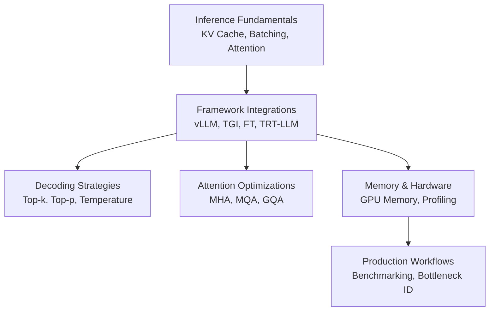
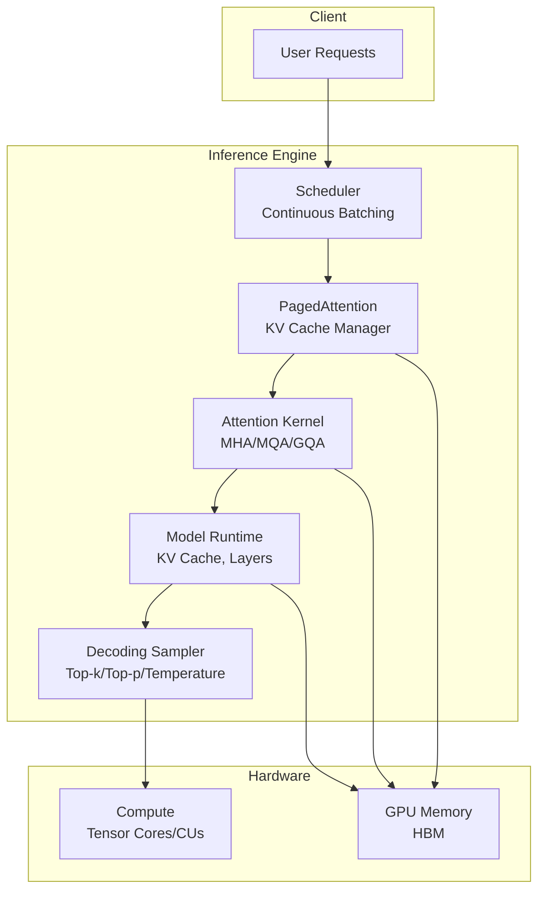
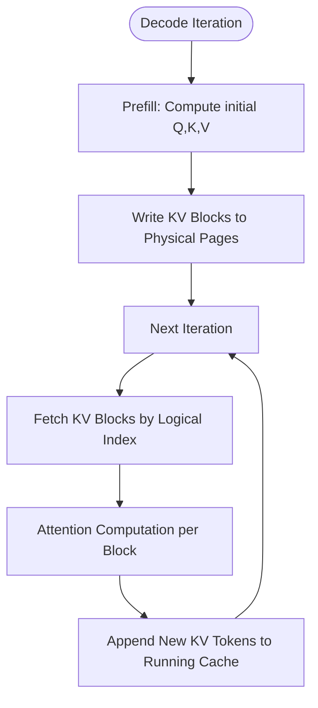
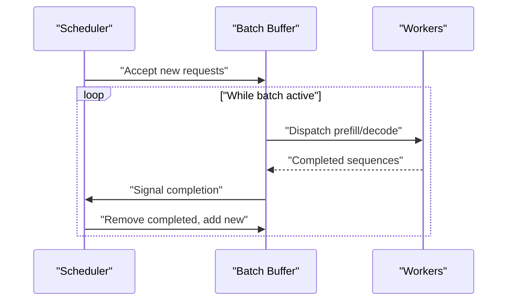
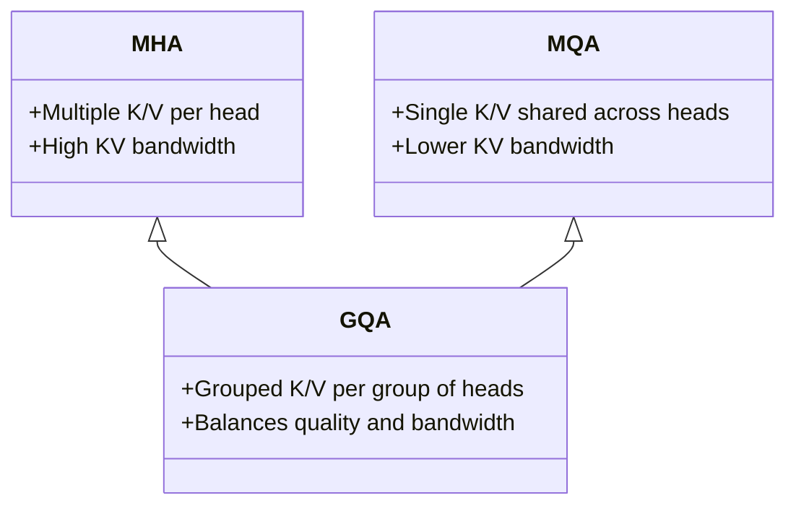
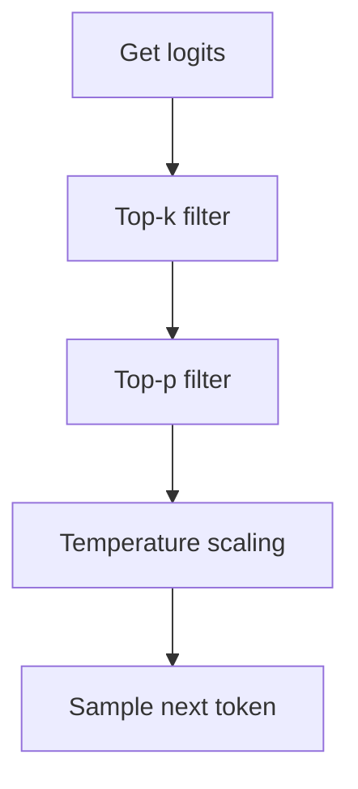
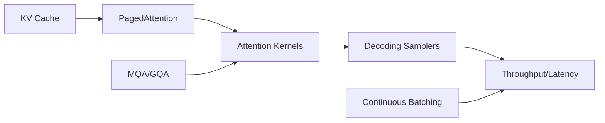

# Inference Optimization Techniques

<cite>
**Referenced Files in This Document**
- [llm推理优化技术.md](file://06.推理/llm推理优化技术/llm推理优化技术.md)
- [1.vllm.md](file://06.推理/1.vllm/1.vllm.md)
- [2.text_generation_inference.md](file://06.推理/2.text_generation_inference/2.text_generation_inference.md)
- [3.faster_transformer.md](file://06.推理/3.faster_transformer/3.faster_transformer.md)
- [4.trt_llm.md](file://06.推理/4.trt_llm/4.trt_llm.md)
- [1.推理.md](file://06.推理/1.推理/1.推理.md)
- [LLM推理常见参数.md](file://06.推理/LLM推理常见参数/LLM推理常见参数.md)
- [解码策略（Top-k & Top-p & Temperature）.md](file://02.大语言模型架构/解码策略（Top-k & Top-p & Temperatu/解码策略（Top-k & Top-p & Temperature）.md)
- [MHA_MQA_GQA.md](file://02.大语言模型架构/MHA_MQA_GQA/MHA_MQA_GQA.md)
- [Transformer架构细节.md](file://02.大语言模型架构/Transformer架构细节/Transformer架构细节.md)
- [1.显存问题.md](file://04.分布式训练/1.显存问题/1.显存问题.md)
- [6.多维度混合并行.md](file://04.分布式训练/6.多维度混合并行/6.多维度混合并行.md)
</cite>

## Table of Contents
1. [Introduction](#introduction)
2. [Project Structure](#project-structure)
3. [Core Components](#core-components)
4. [Architecture Overview](#architecture-overview)
5. [Detailed Component Analysis](#detailed-component-analysis)
6. [Dependency Analysis](#dependency-analysis)
7. [Performance Considerations](#performance-considerations)
8. [Troubleshooting Guide](#troubleshooting-guide)
9. [Conclusion](#conclusion)
10. [Appendices](#appendices)

## Introduction
This document synthesizes inference optimization techniques for large language models (LLMs) with a focus on KV cache management, batch processing optimization, memory optimization strategies, and performance benchmarking. It also covers decoding strategies (Top-k, Top-p, Temperature sampling), attention optimization, and parallel processing techniques. Practical guidance is provided for parameter tuning, latency reduction, throughput maximization, hardware-specific optimizations, GPU memory management, CPU optimization strategies, performance measurement methodologies, bottleneck identification, and optimization workflows suitable for production environments.

## Project Structure
The repository organizes knowledge around:
- Inference fundamentals and optimization techniques
- Production-grade inference frameworks (vLLM, TGI, FasterTransformer, TensorRT-LLM)
- Attention variants (MHA, MQA, GQA) and decoding strategies
- Distributed training and memory profiling for production insights

[No sources needed since this diagram shows conceptual workflow, not actual code structure]

## Core Components
- KV cache management and PagedAttention for memory efficiency
- Continuous batching to improve GPU utilization
- Attention optimizations (MQA, GQA) to reduce KV bandwidth pressure
- Quantization, sparsity, and distillation for memory footprint reduction
- Parallel processing via tensor, pipeline, and sequence parallelism
- Decoding parameterization (top-k, top-p, temperature) for quality/latency trade-offs

**Section sources**
- [llm推理优化技术.md:17-72](file://06.推理/llm推理优化技术/llm推理优化技术.md#L17-L72)
- [1.vllm.md:55-132](file://06.推理/1.vllm/1.vllm.md#L55-L132)
- [2.text_generation_inference.md:38-134](file://06.推理/2.text_generation_inference/2.text_generation_inference.md#L38-L134)
- [MHA_MQA_GQA.md:1-15](file://02.大语言模型架构/MHA_MQA_GQA/MHA_MQA_GQA.md#L1-L15)
- [1.推理.md:5-14](file://06.推理/1.推理/1.推理.md#L5-L14)

## Architecture Overview
The inference stack integrates framework-level optimizations with attention and decoding controls, while leveraging hardware characteristics for throughput and latency targets.

**Diagram sources**
- [1.vllm.md:89-132](file://06.推理/1.vllm/1.vllm.md#L89-L132)
- [llm推理优化技术.md:168-180](file://06.推理/llm推理优化技术/llm推理优化技术.md#L168-L180)
- [MHA_MQA_GQA.md:1-15](file://02.大语言模型架构/MHA_MQA_GQA/MHA_MQA_GQA.md#L1-L15)
- [LLM推理常见参数.md:99-144](file://06.推理/LLM推理常见参数/LLM推理常见参数.md#L99-L144)

**Section sources**
- [1.vllm.md:89-132](file://06.推理/1.vllm/1.vllm.md#L89-L132)
- [llm推理优化技术.md:168-180](file://06.推理/llm推理优化技术/llm推理优化技术.md#L168-L180)
- [MHA_MQA_GQA.md:1-15](file://02.大语言模型架构/MHA_MQA_GQA/MHA_MQA_GQA.md#L1-L15)
- [LLM推理常见参数.md:99-144](file://06.推理/LLM推理常见参数/LLM推理常见参数.md#L99-L144)

## Detailed Component Analysis

### KV Cache Management and PagedAttention
- Problem: KV cache dominates GPU memory and grows with sequence length; static allocation wastes memory and causes fragmentation.
- Solution: PagedAttention partitions KV cache into fixed-size blocks stored non-contiguously; blocks are mapped via block tables and allocated on demand.
- Benefits: Near-optimal memory usage, efficient sharing across parallel samples, improved throughput and reduced latency.

**Diagram sources**
- [1.vllm.md:106-132](file://06.推理/1.vllm/1.vllm.md#L106-L132)
- [llm推理优化技术.md:168-180](file://06.推理/llm推理优化技术/llm推理优化技术.md#L168-L180)

**Section sources**
- [1.vllm.md:106-132](file://06.推理/1.vllm/1.vllm.md#L106-L132)
- [llm推理优化技术.md:168-180](file://06.推理/llm推理优化技术/llm推理优化技术.md#L168-L180)

### Batch Processing Optimization: Continuous Batching vs Static Batching
- Static batching waits for the longest sequence in the batch, under-utilizing GPU during early completions.
- Continuous batching removes finished sequences and injects new ones, improving GPU utilization and throughput.

**Diagram sources**
- [1.vllm.md:55-58](file://06.推理/1.vllm/1.vllm.md#L55-L58)
- [llm推理优化技术.md:29-36](file://06.推理/llm推理优化技术/llm推理优化技术.md#L29-L36)

**Section sources**
- [1.vllm.md:55-58](file://06.推理/1.vllm/1.vllm.md#L55-L58)
- [llm推理优化技术.md:29-36](file://06.推理/llm推理优化技术/llm推理优化技术.md#L29-L36)

### Attention Optimization: MQA and GQA
- MQA reduces KV bandwidth by sharing K/V across attention heads; may slightly impact accuracy.
- GQA balances MHA and MQA by grouping query heads to share K/V, maintaining near-MHA quality with MQA-level KV bandwidth savings.

**Diagram sources**
- [MHA_MQA_GQA.md:1-15](file://02.大语言模型架构/MHA_MQA_GQA/MHA_MQA_GQA.md#L1-L15)

**Section sources**
- [MHA_MQA_GQA.md:1-15](file://02.大语言模型架构/MHA_MQA_GQA/MHA_MQA_GQA.md#L1-L15)
- [llm推理优化技术.md:132-151](file://06.推理/llm推理优化技术/llm推理优化技术.md#L132-L151)

### Decoding Strategies: Top-k, Top-p, Temperature
- Top-k: restricts sampling to the k highest-probability tokens.
- Top-p (nucleus): dynamically selects tokens until cumulative probability reaches p.
- Temperature: scales logits before softmax to increase or decrease randomness.
- Combined usage: top-k → top-p → temperature for controlled diversity and stability.

**Diagram sources**
- [LLM推理常见参数.md:99-144](file://06.推理/LLM推理常见参数/LLM推理常见参数.md#L99-L144)
- [解码策略（Top-k & Top-p & Temperature）.md:38-96](file://02.大语言模型架构/解码策略（Top-k & Top-p & Temperatu/解码策略（Top-k & Top-p & Temperature）.md#L38-L96)

**Section sources**
- [LLM推理常见参数.md:99-144](file://06.推理/LLM推理常见参数/LLM推理常见参数.md#L99-L144)
- [解码策略（Top-k & Top-p & Temperature）.md:38-96](file://02.大语言模型架构/解码策略（Top-k & Top-p & Temperatu/解码策略（Top-k & Top-p & Temperature）.md#L38-L96)

### Quantization Techniques
- Quantization reduces memory and bandwidth by lowering precision of weights/activations.
- Practical guidance:
  - Prefer activation-friendly quantization ranges or representative datasets to mitigate dynamic range issues.
  - Mixed precision: quantize weights where feasible; keep activations at higher precision for stability.
  - Evaluate accuracy/latency trade-offs on target workload.

**Section sources**
- [llm推理优化技术.md:184-201](file://06.推理/llm推理优化技术/llm推理优化技术.md#L184-L201)
- [1.推理.md:28-38](file://06.推理/1.推理/1.推理.md#L28-L38)

### Sparsity and Distillation
- Sparsity compresses weight matrices; structured sparsity can be accelerated on modern hardware.
- Knowledge distillation trains smaller student models to mimic teacher behavior, reducing model size and inference cost.

**Section sources**
- [llm推理优化技术.md:202-232](file://06.推理/llm推理优化技术/llm推理优化技术.md#L202-L232)

### Parallel Processing Techniques
- Tensor parallel: shard layers across devices; attention heads often split independently.
- Pipeline parallel: partition model vertically; micro-batching mitigates pipeline bubbles.
- Sequence parallel: partition along sequence dimension to reduce activation memory overhead.
- Hybrid strategies combine DP/TP/PP/ZerO/FSDP for large-scale training and inference.

**Section sources**
- [llm推理优化技术.md:74-114](file://06.推理/llm推理优化技术/llm推理优化技术.md#L74-L114)
- [6.多维度混合并行.md:1-109](file://04.分布式训练/6.多维度混合并行/6.多维度混合并行.md#L1-L109)

### Framework-Level Optimizations
- vLLM: continuous batching, PagedAttention, CUDA kernels, HF model compatibility, parallel sampling.
- TGI: tensor parallel, continuous batching, FlashAttention/PagedAttention, quantization (LLM.int8, GPT-Q), observability.
- FasterTransformer: layer fusion, activation caching, memory reuse buffers, multi-GPU/NCCL, low-precision kernels.
- TensorRT-LLM: optimized kernels and runtime for production-grade performance.

**Section sources**
- [1.vllm.md:1-15](file://06.推理/1.vllm/1.vllm.md#L1-L15)
- [2.text_generation_inference.md:7-17](file://06.推理/2.text_generation_inference/2.text_generation_inference.md#L7-L17)
- [3.faster_transformer.md:24-65](file://06.推理/3.faster_transformer/3.faster_transformer.md#L24-L65)
- [4.trt_llm.md:1-8](file://06.推理/4.trt_llm/4.trt_llm.md#L1-L8)

## Dependency Analysis
- Attention optimization depends on KV cache management; PagedAttention enables MQA/GQA to be effective.
- Decoding parameters influence token generation rate and memory pressure; top-k/top-p reduce long tails and stabilize KV growth.
- Frameworks integrate these components: scheduling, KV paging, attention kernels, and decoders.

**Diagram sources**
- [1.vllm.md:106-132](file://06.推理/1.vllm/1.vllm.md#L106-L132)
- [MHA_MQA_GQA.md:1-15](file://02.大语言模型架构/MHA_MQA_GQA/MHA_MQA_GQA.md#L1-L15)
- [LLM推理常见参数.md:99-144](file://06.推理/LLM推理常见参数/LLM推理常见参数.md#L99-L144)

**Section sources**
- [1.vllm.md:106-132](file://06.推理/1.vllm/1.vllm.md#L106-L132)
- [MHA_MQA_GQA.md:1-15](file://02.大语言模型架构/MHA_MQA_GQA/MHA_MQA_GQA.md#L1-L15)
- [LLM推理常见参数.md:99-144](file://06.推理/LLM推理常见参数/LLM推理常见参数.md#L99-L144)

## Performance Considerations
- Latency reduction:
  - Reduce KV bandwidth via MQA/GQA and PagedAttention.
  - Increase concurrency with continuous batching.
  - Tune decoding parameters (top-k, top-p, temperature) to balance quality and speed.
- Throughput maximization:
  - Use continuous batching and PagedAttention to sustain larger batches.
  - Apply tensor and pipeline parallelism where applicable.
  - Quantization and mixed precision reduce memory bandwidth pressure.
- Memory optimization:
  - Favor PagedAttention to minimize fragmentation and enable larger batch sizes.
  - Use MQA/GQA to lower KV memory footprint.
  - Reuse buffers and layer fusion to reduce activation memory.
- Hardware-specific:
  - Leverage Tensor Cores and FP16/INT8 support where available.
  - Monitor GPU utilization via flops ratio, throughput estimation, and profiler traces.

**Section sources**
- [1.vllm.md:55-132](file://06.推理/1.vllm/1.vllm.md#L55-L132)
- [llm推理优化技术.md:132-180](file://06.推理/llm推理优化技术/llm推理优化技术.md#L132-L180)
- [1.推理.md:16-38](file://06.推理/1.推理/1.推理.md#L16-L38)
- [1.显存问题.md:13-17](file://04.分布式训练/1.显存问题/1.显存问题.md#L13-L17)

## Troubleshooting Guide
- High GPU memory usage:
  - Verify KV cache sizing and enable PagedAttention to reduce fragmentation.
  - Adjust batch size and sequence length to fit device memory.
- Low GPU utilization:
  - Switch from static to continuous batching.
  - Inspect pipeline bubbles and consider micro-batching.
- Slow decoding:
  - Reduce KV bandwidth with MQA/GQA.
  - Tune decoding parameters to avoid excessive candidate sets.
- Profiling and bottleneck identification:
  - Use flops ratio and throughput estimation to gauge utilization.
  - Employ profiler traces to inspect kernel-level bottlenecks and Tensor Core utilization.

**Section sources**
- [1.vllm.md:55-132](file://06.推理/1.vllm/1.vllm.md#L55-L132)
- [1.显存问题.md:13-17](file://04.分布式训练/1.显存问题/1.显存问题.md#L13-L17)

## Conclusion
Effective LLM inference requires a holistic approach: efficient KV cache management (PagedAttention), continuous batching, attention optimizations (MQA/GQA), decoding parameter tuning, and parallel processing. Frameworks like vLLM, TGI, FasterTransformer, and TensorRT-LLM integrate these techniques to maximize throughput and minimize latency. Production deployments benefit from targeted profiling, memory-aware scheduling, and hardware-specific optimizations.

## Appendices

### Practical Parameter Tuning Guide
- Temperature: adjust randomness; lower values increase determinism, higher values increase diversity.
- Top-k: limit candidates; small k increases quality, large k increases diversity.
- Top-p: dynamic tail truncation; tune to balance coherence and creativity.
- Repetition penalty: reduce repetitive outputs by penalizing seen tokens.

**Section sources**
- [LLM推理常见参数.md:128-175](file://06.推理/LLM推理常见参数/LLM推理常见参数.md#L128-L175)
- [解码策略（Top-k & Top-p & Temperature）.md:166-227](file://02.大语言模型架构/解码策略（Top-k & Top-p & Temperatu/解码策略（Top-k & Top-p & Temperature）.md#L166-L227)

### Performance Measurement Methodologies
- GPU utilization metrics:
  - Flops ratio: measured flops divided by peak theoretical flops.
  - Throughput estimation: tokens processed per second per GPU.
  - Profiler traces: inspect kernel durations and Tensor Core utilization.
- Networking and topology checks for distributed setups:
  - Monitor interconnect bandwidth and NVLink topology.

**Section sources**
- [1.显存问题.md:13-17](file://04.分布式训练/1.显存问题/1.显存问题.md#L13-L17)