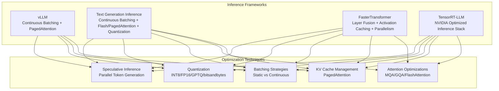
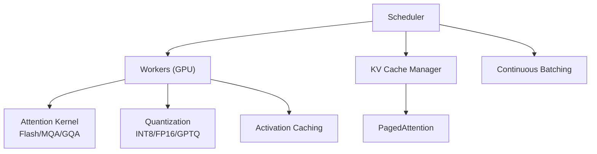
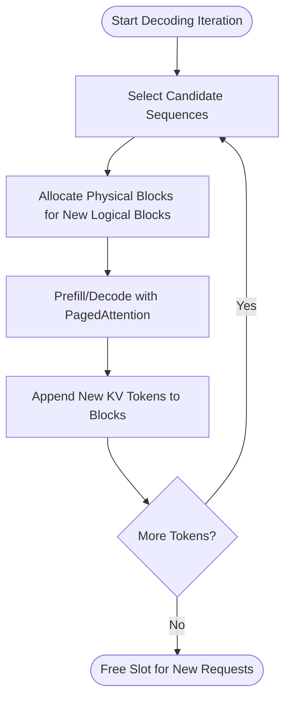
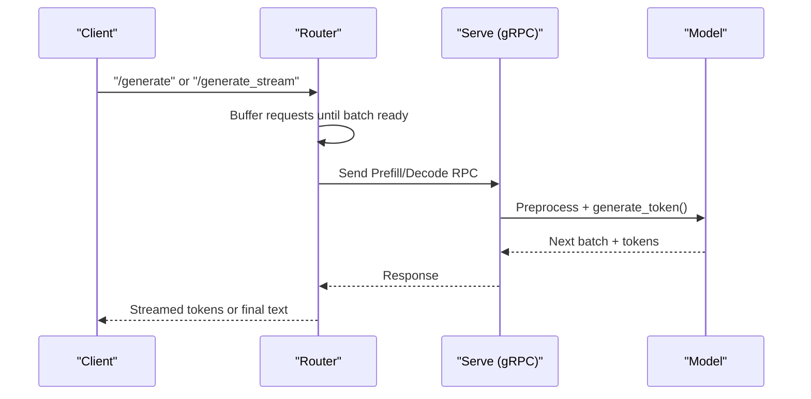
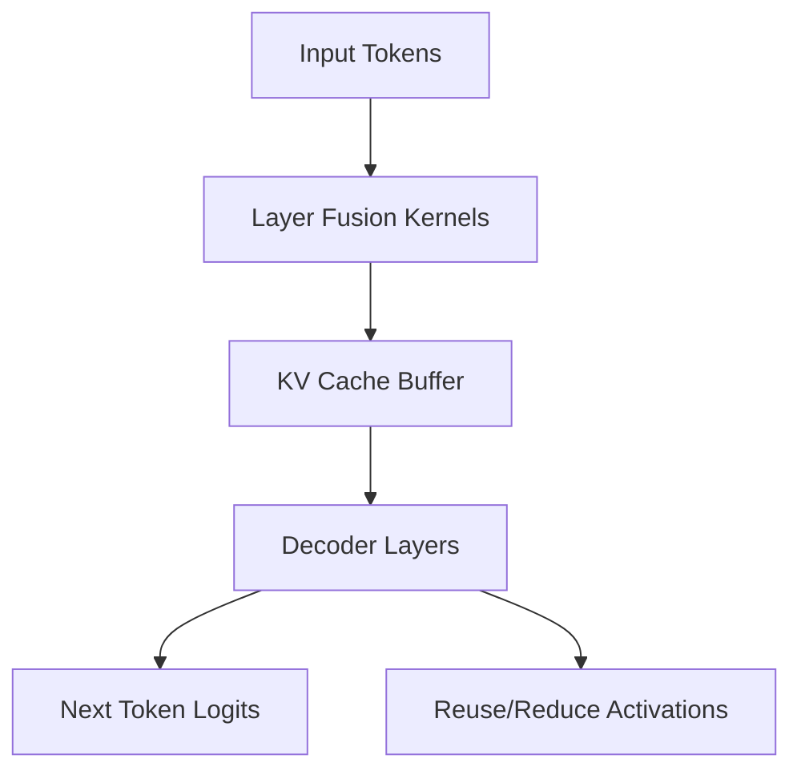
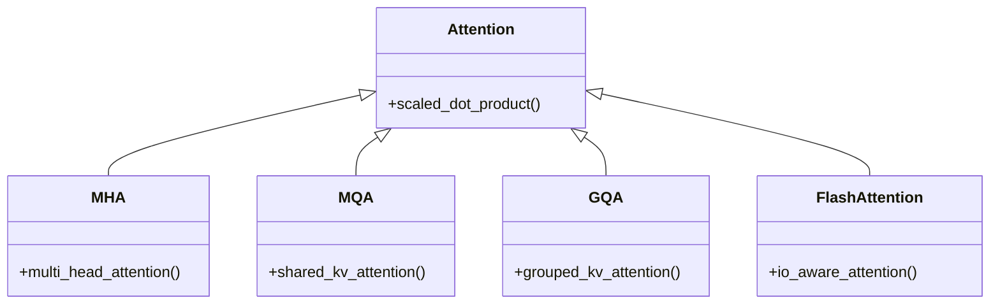
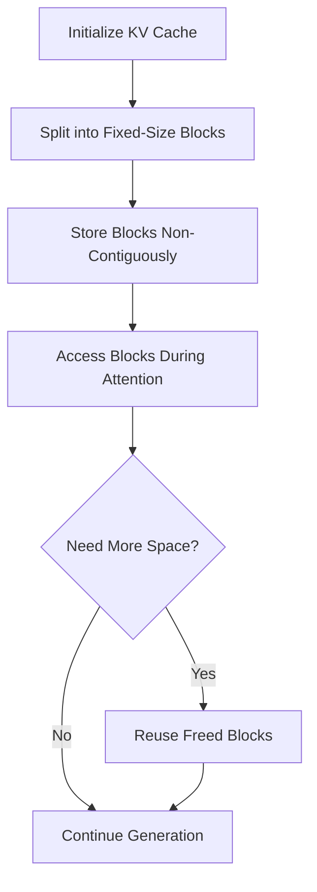
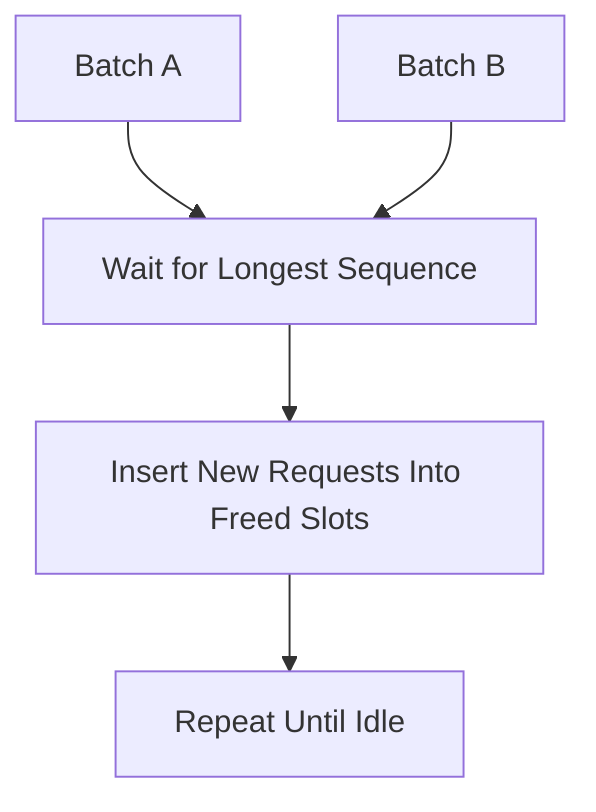
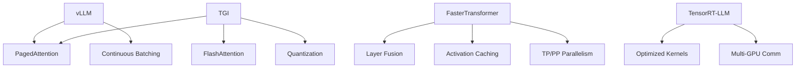

# Inference and Optimization

<cite>
**Referenced Files in This Document**
- [1.vllm.md](file://06.推理/1.vllm/1.vllm.md)
- [2.text_generation_inference.md](file://06.推理/2.text_generation_inference/2.text_generation_inference.md)
- [3.faster_transformer.md](file://06.推理/3.faster_transformer/3.faster_transformer.md)
- [4.trt_llm.md](file://06.推理/4.trt_llm/4.trt_llm.md)
- [llm推理优化技术.md](file://06.推理/llm推理优化技术/llm推理优化技术.md)
- [LLM推理常见参数.md](file://06.推理/LLM推理常见参数/LLM推理常见参数.md)
- [0.llm推理框架简单总结.md](file://06.推理/0.llm推理框架简单总结/0.llm推理框架简单总结.md)
- [1.推理.md](file://06.推理/1.推理/1.推理.md)
- [1.显存问题.md](file://04.分布式训练/1.显存问题/1.显存问题.md)
- [中级LLM_Agent工程师面试QA清单.md](file://ai_generataion/中级LLM_Agent工程师面试QA清单.md)
- [README.md](file://README.md)
</cite>

## Table of Contents
1. [Introduction](#introduction)
2. [Project Structure](#project-structure)
3. [Core Components](#core-components)
4. [Architecture Overview](#architecture-overview)
5. [Detailed Component Analysis](#detailed-component-analysis)
6. [Dependency Analysis](#dependency-analysis)
7. [Performance Considerations](#performance-considerations)
8. [Troubleshooting Guide](#troubleshooting-guide)
9. [Conclusion](#conclusion)
10. [Appendices](#appendices)

## Introduction
This document provides a comprehensive guide to inference and optimization for large language models (LLMs). It covers inference frameworks, performance optimization techniques, and production deployment strategies. It explains vLLM architecture and implementation, Text Generation Inference (TGI), FasterTransformer optimization, and TensorRT-LLM integration. It documents KV cache management, batch processing optimization, memory optimization strategies, and performance benchmarking methodologies. It also compares inference frameworks, quantization techniques, latency optimization, throughput maximization, and cost-effective deployment considerations, and offers practical guidance for production environments, monitoring strategies, and troubleshooting common performance issues.

## Project Structure
The repository organizes knowledge around LLM fundamentals, training, and inference. The inference section focuses on:
- vLLM: continuous batching and PagedAttention
- TGI: continuous batching, FlashAttention, PagedAttention, and quantization
- FasterTransformer: layer fusion, activation caching, memory reuse, and parallelism
- TensorRT-LLM: NVIDIA’s high-performance inference stack
- General optimization techniques: KV cache management, batching, attention variants, quantization, speculative inference, and dynamic batching

**Diagram sources**
- [1.vllm.md:55-151](file://06.推理/1.vllm/1.vllm.md#L55-L151)
- [2.text_generation_inference.md:38-134](file://06.推理/2.text_generation_inference/2.text_generation_inference.md#L38-L134)
- [3.faster_transformer.md:24-64](file://06.推理/3.faster_transformer/3.faster_transformer.md#L24-L64)
- [4.trt_llm.md:1-8](file://06.推理/4.trt_llm/4.trt_llm.md#L1-L8)
- [llm推理优化技术.md:168-271](file://06.推理/llm推理优化技术/llm推理优化技术.md#L168-L271)

**Section sources**
- [README.md:120-132](file://README.md#L120-L132)

## Core Components
- vLLM: continuous batching and PagedAttention enable high throughput and efficient KV cache utilization.
- TGI: continuous batching, FlashAttention/PagedAttention, quantization support, and built-in observability.
- FasterTransformer: layer fusion, activation caching, memory reuse, and distributed parallelism (TP/PP).
- TensorRT-LLM: NVIDIA’s optimized inference pipeline integrating pre/post-processing, kernels, and multi-GPU communication.
- General optimization: KV cache management, batching strategies, attention variants (MQA/GQA/FlashAttention), quantization, and speculative inference.

**Section sources**
- [1.vllm.md:55-151](file://06.推理/1.vllm/1.vllm.md#L55-L151)
- [2.text_generation_inference.md:38-134](file://06.推理/2.text_generation_inference/2.text_generation_inference.md#L38-L134)
- [3.faster_transformer.md:24-64](file://06.推理/3.faster_transformer/3.faster_transformer.md#L24-L64)
- [4.trt_llm.md:1-8](file://06.推理/4.trt_llm/4.trt_llm.md#L1-L8)
- [llm推理优化技术.md:168-271](file://06.推理/llm推理优化技术/llm推理优化技术.md#L168-L271)

## Architecture Overview
The inference stack typically comprises:
- A scheduler orchestrating workers
- KV cache manager driven by PagedAttention
- Attention kernels optimized via FlashAttention or MQA/GQA
- Quantization and activation caching to reduce memory bandwidth pressure
- Continuous batching to improve GPU utilization

**Diagram sources**
- [1.vllm.md:89-151](file://06.推理/1.vllm/1.vllm.md#L89-L151)
- [llm推理优化技术.md:116-167](file://06.推理/llm推理优化技术/llm推理优化技术.md#L116-L167)

## Detailed Component Analysis

### vLLM: Continuous Batching and PagedAttention
- Continuous batching replaces static batching to improve GPU utilization by inserting new sequences into slots freed by finished sequences.
- PagedAttention manages KV cache by splitting it into fixed-size blocks, enabling non-contiguous storage and efficient memory sharing across parallel samples.

**Diagram sources**
- [1.vllm.md:136-151](file://06.推理/1.vllm/1.vllm.md#L136-L151)

**Section sources**
- [1.vllm.md:55-151](file://06.推理/1.vllm/1.vllm.md#L55-L151)

### Text Generation Inference (TGI): Continuous Batching and Quantization
- TGI supports continuous batching, FlashAttention/PagedAttention, and quantization (bitsandbytes, GPT-Q).
- It exposes a lightweight Python gRPC server with endpoints for generation, streaming, metrics, and info.

**Diagram sources**
- [2.text_generation_inference.md:64-134](file://06.推理/2.text_generation_inference/2.text_generation_inference.md#L64-L134)

**Section sources**
- [2.text_generation_inference.md:38-134](file://06.推理/2.text_generation_inference/2.text_generation_inference.md#L38-L134)

### FasterTransformer: Layer Fusion, Activation Caching, and Parallelism
- Layer fusion reduces kernel launches and increases math density.
- Activation caching avoids recomputing previous keys/values during autoregressive decoding.
- Memory reuse across decoder layers minimizes activation footprint.
- Distributed parallelism via TP and PP with NCCL/MPI.

**Diagram sources**
- [3.faster_transformer.md:24-64](file://06.推理/3.faster_transformer/3.faster_transformer.md#L24-L64)

**Section sources**
- [3.faster_transformer.md:24-64](file://06.推理/3.faster_transformer/3.faster_transformer.md#L24-L64)

### TensorRT-LLM: NVIDIA Optimized Inference
- Integrates optimized kernels, pre/post-processing, and multi-GPU communication primitives.
- Supports high-throughput, low-latency serving on NVIDIA GPUs.

**Section sources**
- [4.trt_llm.md:1-8](file://06.推理/4.trt_llm/4.trt_llm.md#L1-L8)

### Attention Optimizations: MQA, GQA, FlashAttention
- MQA reduces KV cache reads by sharing keys/values across heads.
- GQA balances quality and efficiency by grouping heads.
- FlashAttention reorders computation to exploit memory hierarchy and reduce I/O.

**Diagram sources**
- [llm推理优化技术.md:116-167](file://06.推理/llm推理优化技术/llm推理优化技术.md#L116-L167)

**Section sources**
- [llm推理优化技术.md:116-167](file://06.推理/llm推理优化技术/llm推理优化技术.md#L116-L167)

### KV Cache Management and PagedAttention
- Efficient KV cache management prevents over-provisioning and fragmentation.
- PagedAttention enables non-contiguous storage of KV blocks, improving memory efficiency and throughput.

**Diagram sources**
- [llm推理优化技术.md:168-179](file://06.推理/llm推理优化技术/llm推理优化技术.md#L168-L179)
- [1.vllm.md:124-133](file://06.推理/1.vllm/1.vllm.md#L124-L133)

**Section sources**
- [llm推理优化技术.md:168-179](file://06.推理/llm推理优化技术/llm推理优化技术.md#L168-L179)
- [1.vllm.md:124-133](file://06.推理/1.vllm/1.vllm.md#L124-L133)

### Batch Processing Optimization
- Static batching underutilizes GPUs due to varying completion times.
- Continuous batching improves GPU utilization by dynamically inserting new sequences into freed slots.

**Diagram sources**
- [1.vllm.md:47-59](file://06.推理/1.vllm/1.vllm.md#L47-L59)
- [llm推理优化技术.md:29-36](file://06.推理/llm推理优化技术/llm推理优化技术.md#L29-L36)

**Section sources**
- [1.vllm.md:47-59](file://06.推理/1.vllm/1.vllm.md#L47-L59)
- [llm推理优化技术.md:29-36](file://06.推理/llm推理优化技术/llm推理优化技术.md#L29-L36)

### Quantization Techniques
- Quantization reduces memory footprint and bandwidth; supports INT8/FP16 and quantization-aware methods (e.g., GPT-Q, bitsandbytes).
- TGI and FasterTransformer provide quantization support.

**Section sources**
- [2.text_generation_inference.md:12](file://06.推理/2.text_generation_inference/2.text_generation_inference.md#L12)
- [3.faster_transformer.md:60-64](file://06.推理/3.faster_transformer/3.faster_transformer.md#L60-L64)

### Speculative Inference and Dynamic Batching
- Speculative inference generates multiple tokens in parallel to save time; validation discards mismatches.
- Dynamic batching continuously schedules requests to maximize GPU utilization.

**Section sources**
- [llm推理优化技术.md:240-267](file://06.推理/llm推理优化技术/llm推理优化技术.md#L240-L267)

## Dependency Analysis
- vLLM depends on PagedAttention for KV cache management and continuous batching for throughput.
- TGI integrates FlashAttention/PagedAttention and quantization for performance and memory efficiency.
- FasterTransformer relies on layer fusion, activation caching, and distributed parallelism.
- TensorRT-LLM builds on NVIDIA’s optimized kernels and communication primitives.

**Diagram sources**
- [1.vllm.md:89-151](file://06.推理/1.vllm/1.vllm.md#L89-L151)
- [2.text_generation_inference.md:11-16](file://06.推理/2.text_generation_inference/2.text_generation_inference.md#L11-L16)
- [3.faster_transformer.md:24-64](file://06.推理/3.faster_transformer/3.faster_transformer.md#L24-L64)
- [4.trt_llm.md:1-8](file://06.推理/4.trt_llm/4.trt_llm.md#L1-L8)

**Section sources**
- [0.llm推理框架简单总结.md:9-16](file://06.推理/0.llm推理框架简单总结/0.llm推理框架简单总结.md#L9-L16)

## Performance Considerations
- Latency optimization:
  - Reduce KV cache reads via MQA/GQA.
  - Use FlashAttention to minimize I/O.
  - Apply PagedAttention to lower memory overhead.
- Throughput maximization:
  - Prefer continuous batching over static batching.
  - Use speculative inference to parallelize token generation.
  - Enable quantization to increase batch sizes and reduce bandwidth.
- Memory optimization:
  - Reuse activation buffers across layers.
  - Manage KV cache with fixed-size blocks.
  - Use quantization to reduce memory footprint.
- Cost-effective deployment:
  - Choose frameworks aligned with workload (high throughput vs. ease of deployment).
  - Monitor GPU utilization and adjust batch sizes accordingly.

[No sources needed since this section provides general guidance]

## Troubleshooting Guide
Common issues and remedies:
- High memory usage and slow GPU utilization:
  - Use continuous batching and PagedAttention to improve memory efficiency.
  - Enable activation caching and memory reuse.
- Excessive latency:
  - Switch to MQA/GQA and FlashAttention.
  - Quantize model to reduce bandwidth pressure.
- Poor throughput:
  - Replace static batching with continuous batching.
  - Consider speculative inference to overlap token generation.
- Monitoring and diagnostics:
  - Track latency, throughput, and error rates.
  - Use profiling tools to assess kernel utilization and bottlenecks.

**Section sources**
- [1.推理.md:5-27](file://06.推理/1.推理/1.推理.md#L5-L27)
- [1.显存问题.md:13-23](file://04.分布式训练/1.显存问题/1.显存问题.md#L13-L23)
- [llm推理优化技术.md:240-267](file://06.推理/llm推理优化技术/llm推理优化技术.md#L240-L267)

## Conclusion
High-performance LLM inference requires a combination of efficient KV cache management, continuous batching, attention optimizations, and quantization. vLLM excels in throughput via continuous batching and PagedAttention; TGI offers a robust, quantized, and observable serving stack; FasterTransformer delivers strong performance through layer fusion and distributed parallelism; TensorRT-LLM provides NVIDIA’s optimized inference pipeline. Production deployments should monitor latency and throughput, tune batch sizes, and adopt speculative inference and quantization to balance cost and performance.

[No sources needed since this section summarizes without analyzing specific files]

## Appendices

### Inference Parameter Guide
- Greedy search: deterministic, highest probability token selection.
- Beam search: maintains multiple hypotheses; higher quality but increased compute and memory.
- Top-k and top-p: introduce randomness; top-p adapts dynamic candidate set.
- Temperature: controls randomness; higher values increase diversity.
- Repetition penalty: discourages repetitive outputs.

**Section sources**
- [LLM推理常见参数.md:32-183](file://06.推理/LLM推理常见参数/LLM推理常见参数.md#L32-L183)

### Benchmarking Methodologies
- Automated metrics: accuracy, ROUGE/BLEU/METEOR for generation; latency, throughput, error rate for system performance.
- Human evaluation: relevance, fluency, helpfulness; A/B testing and user surveys.
- Business metrics: retention, task completion, support ticket reduction, conversion lift.

**Section sources**
- [中级LLM_Agent工程师面试QA清单.md:248-291](file://ai_generataion/中级LLM_Agent工程师面试QA清单.md#L248-L291)