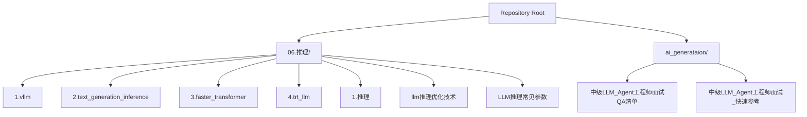
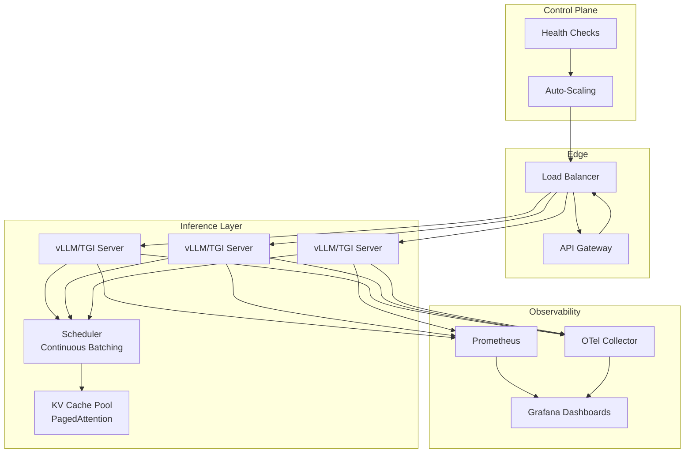
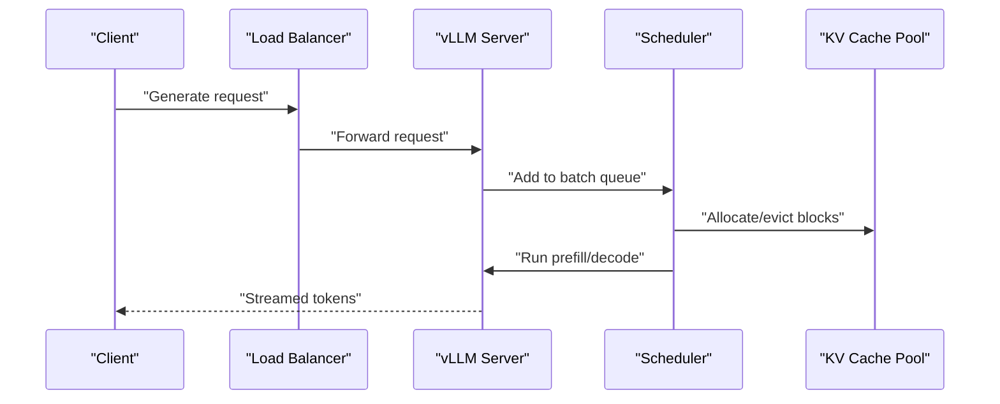
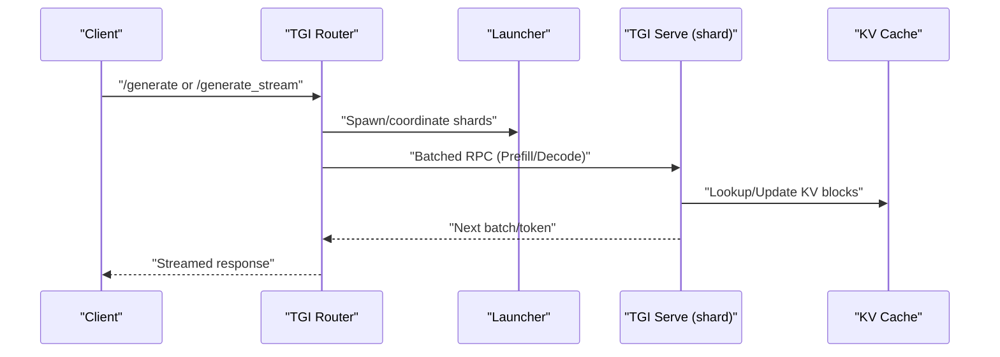
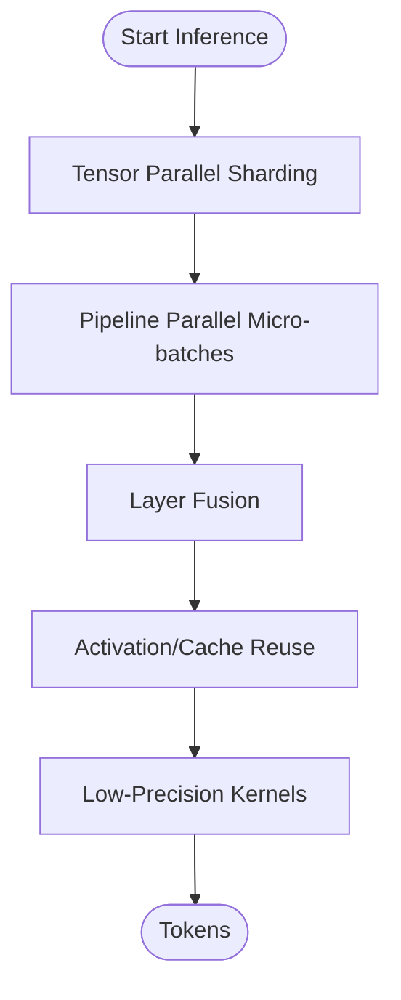
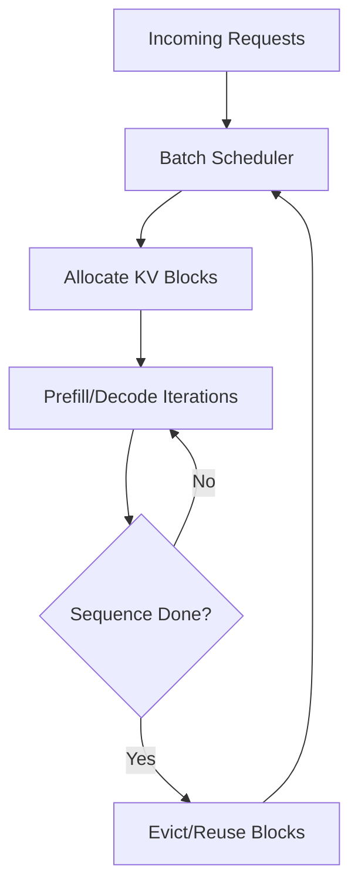
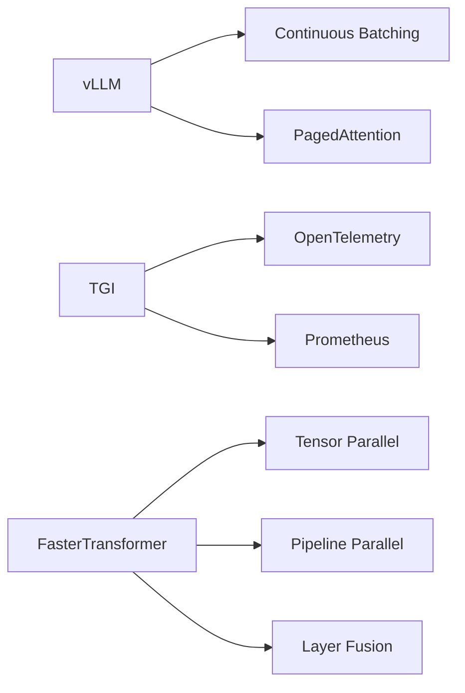

# Production Deployment and Monitoring

<cite>
**Referenced Files in This Document**
- [1.vllm.md](file://06.推理/1.vllm/1.vllm.md)
- [2.text_generation_inference.md](file://06.推理/2.text_generation_inference/2.text_generation_inference.md)
- [3.faster_transformer.md](file://06.推理/3.faster_transformer/3.faster_transformer.md)
- [4.trt_llm.md](file://06.推理/4.trt_llm/4.trt_llm.md)
- [1.推理.md](file://06.推理/1.推理/1.推理.md)
- [llm推理优化技术.md](file://06.推理/llm推理优化技术/llm推理优化技术.md)
- [LLM推理常见参数.md](file://06.推理/LLM推理常见参数/LLM推理常见参数.md)
- [README.md](file://README.md)
- [中级LLM_Agent工程师面试QA清单.md](file://ai_generataion/中级LLM_Agent工程师面试QA清单.md)
- [中级LLM_Agent工程师面试_快速参考.md](file://ai_generataion/中级LLM_Agent工程师面试_快速参考.md)
</cite>

## Table of Contents
1. [Introduction](#introduction)
2. [Project Structure](#project-structure)
3. [Core Components](#core-components)
4. [Architecture Overview](#architecture-overview)
5. [Detailed Component Analysis](#detailed-component-analysis)
6. [Dependency Analysis](#dependency-analysis)
7. [Performance Considerations](#performance-considerations)
8. [Troubleshooting Guide](#troubleshooting-guide)
9. [Security and Compliance](#security-and-compliance)
10. [Operational Runbooks and Maintenance](#operational-runbooks-and-maintenance)
11. [Conclusion](#conclusion)

## Introduction
This document consolidates production-grade deployment and monitoring strategies for large language model (LLM) inference services. It synthesizes practical guidance from the repository’s materials on inference frameworks, batching strategies, KV cache management, quantization, and service design patterns. It focuses on:
- Inference framework deployment and containerization
- Load balancing and scaling
- Observability and capacity planning
- Troubleshooting and incident response
- Security and compliance considerations
- Operational runbooks and maintenance best practices

## Project Structure
The repository organizes knowledge around:
- Inference frameworks (vLLM, TGI, FasterTransformer, TensorRT-LLM)
- Optimization techniques (batching, KV cache, attention variants, quantization)
- Parameter tuning for generation quality and diversity
- System design patterns for high-concurrency inference

**Diagram sources**
- [README.md:120-169](file://README.md#L120-L169)

**Section sources**
- [README.md:120-169](file://README.md#L120-L169)

## Core Components
- Inference frameworks and capabilities:
  - vLLM: continuous batching, PagedAttention, tensor parallel, OpenAI-compatible API
  - TGI: continuous batching, flash attention, PagedAttention, built-in metrics, OpenTelemetry/Prometheus
  - FasterTransformer: distributed inference, layer fusion, activation caching, memory reuse, TP/PP, low-precision kernels
  - TensorRT-LLM: public documentation and performance-oriented compilation
- Optimization techniques:
  - Continuous batching vs static batching
  - KV cache management and PagedAttention
  - Attention variants (MHA, MQA, GQA), FlashAttention
  - Quantization, sparsity, distillation
- Parameter tuning for generation:
  - Greedy, beam search, top-k, top-p, temperature, repetition penalty

**Section sources**
- [1.vllm.md:1-220](file://06.推理/1.vllm/1.vllm.md#L1-L220)
- [2.text_generation_inference.md:1-140](file://06.推理/2.text_generation_inference/2.text_generation_inference.md#L1-L140)
- [3.faster_transformer.md:1-73](file://06.推理/3.faster_transformer/3.faster_transformer.md#L1-L73)
- [4.trt_llm.md:1-8](file://06.推理/4.trt_llm/4.trt_llm.md#L1-L8)
- [llm推理优化技术.md:1-271](file://06.推理/llm推理优化技术/llm推理优化技术.md#L1-L271)
- [LLM推理常见参数.md:1-183](file://06.推理/LLM推理常见参数/LLM推理常见参数.md#L1-L183)

## Architecture Overview
A production inference stack typically comprises:
- API gateway and load balancer
- Inference servers (framework-specific)
- KV cache manager and scheduler
- Metrics and tracing collectors
- Auto-scaling and health management

**Diagram sources**
- [1.vllm.md:89-156](file://06.推理/1.vllm/1.vllm.md#L89-L156)
- [2.text_generation_inference.md:38-134](file://06.推理/2.text_generation_inference/2.text_generation_inference.md#L38-L134)
- [llm推理优化技术.md:233-248](file://06.推理/llm推理优化技术/llm推理优化技术.md#L233-L248)

## Detailed Component Analysis

### vLLM: Continuous Batching and PagedAttention
- Continuous batching removes completed sequences early and injects new ones, improving GPU utilization.
- PagedAttention enables non-contiguous storage of KV blocks, reducing fragmentation and memory waste.
- Supports tensor parallel and OpenAI-compatible API.

**Diagram sources**
- [1.vllm.md:55-156](file://06.推理/1.vllm/1.vllm.md#L55-L156)

**Section sources**
- [1.vllm.md:55-156](file://06.推理/1.vllm/1.vllm.md#L55-L156)

### TGI: Launcher, Router, and Server
- Launcher downloads and starts Serve shards and the Web server.
- Router batches requests and streams responses.
- Serve exposes gRPC methods for health, info, cache management, and decode/prefill.

**Diagram sources**
- [2.text_generation_inference.md:52-134](file://06.推理/2.text_generation_inference/2.text_generation_inference.md#L52-L134)

**Section sources**
- [2.text_generation_inference.md:52-134](file://06.推理/2.text_generation_inference/2.text_generation_inference.md#L52-L134)

### FasterTransformer: Distributed Inference and Optimizations
- Supports tensor parallel and pipeline parallel across nodes.
- Uses layer fusion, activation caching, memory reuse, and low-precision kernels.
- Integrations with PyTorch/Triton backends.

**Diagram sources**
- [3.faster_transformer.md:13-64](file://06.推理/3.faster_transformer/3.faster_transformer.md#L13-L64)

**Section sources**
- [3.faster_transformer.md:13-64](file://06.推理/3.faster_transformer/3.faster_transformer.md#L13-L64)

### TensorRT-LLM: Performance-Oriented Compilation
- Publicly documented for optimizing LLM inference performance.
- Integrates with TensorRT compiler and optimized kernels.

**Section sources**
- [4.trt_llm.md:1-8](file://06.推理/4.trt_llm/4.trt_llm.md#L1-L8)

### KV Cache Management and PagedAttention
- KV cache dominates GPU memory; efficient management is critical.
- PagedAttention reduces fragmentation and improves memory efficiency.

**Diagram sources**
- [llm推理优化技术.md:168-180](file://06.推理/llm推理优化技术/llm推理优化技术.md#L168-L180)

**Section sources**
- [llm推理优化技术.md:168-180](file://06.推理/llm推理优化技术/llm推理优化技术.md#L168-L180)

### Generation Parameters and Sampling
- Greedy, beam search, top-k, top-p, temperature, repetition penalty.
- Impact on quality, diversity, and stability.

**Section sources**
- [LLM推理常见参数.md:32-183](file://06.推理/LLM推理常见参数/LLM推理常见参数.md#L32-L183)

## Dependency Analysis
- Framework selection influences batching strategy, memory footprint, and throughput.
- TGI integrates OpenTelemetry and Prometheus for observability.
- vLLM emphasizes continuous batching and PagedAttention for memory efficiency.
- FasterTransformer targets distributed inference with layer fusion and memory reuse.

**Diagram sources**
- [1.vllm.md:89-156](file://06.推理/1.vllm/1.vllm.md#L89-L156)
- [2.text_generation_inference.md:16-16](file://06.推理/2.text_generation_inference/2.text_generation_inference.md#L16-L16)
- [3.faster_transformer.md:13-64](file://06.推理/3.faster_transformer/3.faster_transformer.md#L13-L64)

**Section sources**
- [1.vllm.md:89-156](file://06.推理/1.vllm/1.vllm.md#L89-L156)
- [2.text_generation_inference.md:16-16](file://06.推理/2.text_generation_inference/2.text_generation_inference.md#L16-L16)
- [3.faster_transformer.md:13-64](file://06.推理/3.faster_transformer/3.faster_transformer.md#L13-L64)

## Performance Considerations
- Continuous batching improves GPU utilization by removing completed sequences and injecting new ones.
- PagedAttention reduces memory fragmentation and increases effective batch sizes.
- Attention variants (MQA/GQA) reduce KV cache memory while maintaining quality.
- Quantization and sparsity lower memory bandwidth pressure.
- Low-precision kernels accelerate inference on supported hardware.
- Dynamic batching and speculative decoding can further improve throughput.

**Section sources**
- [llm推理优化技术.md:233-267](file://06.推理/llm推理优化技术/llm推理优化技术.md#L233-L267)
- [1.vllm.md:55-156](file://06.推理/1.vllm/1.vllm.md#L55-L156)
- [3.faster_transformer.md:24-64](file://06.推理/3.faster_transformer/3.faster_transformer.md#L24-L64)

## Troubleshooting Guide
Common issues and detection strategies:
- Out-of-memory errors during generation:
  - Symptoms: CUDA out of memory, KV cache exhaustion.
  - Actions: Reduce batch size, enable PagedAttention, apply quantization, monitor KV cache pool.
- Latency spikes:
  - Symptoms: Increased p95/p99 latency, dropped tokens.
  - Actions: Inspect continuous batching throughput, verify scheduler queue depth, review KV cache allocation patterns.
- Throughput saturation:
  - Symptoms: Backlog in request queues, increased queue wait times.
  - Actions: Scale out inference pods, adjust autoscaling thresholds, review model parallelism.
- Stability and reproducibility:
  - Symptoms: Non-deterministic outputs under greedy search.
  - Actions: Confirm deterministic sampling settings; validate temperature/top-k/top-p configurations.

Monitoring and alerting recommendations:
- Metrics: requests per second, latency (p50/p95/p99), queue length, KV cache utilization, GPU memory usage, OOM events.
- Tracing: spans for prefill/decode, KV cache allocation, scheduling latency.
- Capacity planning: track headroom for long-context sequences and peak concurrency.

**Section sources**
- [1.推理.md:5-14](file://06.推理/1.推理/1.推理.md#L5-L14)
- [llm推理优化技术.md:168-180](file://06.推理/llm推理优化技术/llm推理优化技术.md#L168-L180)
- [LLM推理常见参数.md:128-183](file://06.推理/LLM推理常见参数/LLM推理常见参数.md#L128-L183)

## Security and Compliance
- Access control:
  - Enforce authentication and authorization at the API gateway and load balancer.
  - Restrict model access to authorized roles and implement rate limiting.
- Data governance:
  - Sanitize inputs and outputs; apply redaction policies for sensitive content.
  - Audit logs for model access and generation requests.
- Compliance:
  - Align with legal and ethical guidelines; perform periodic model reviews.
  - Monitor outputs for policy violations and implement corrective actions.
- Operational hygiene:
  - Regular vulnerability scans and secure container baselines.
  - Principle of least privilege for service accounts and secrets management.

[No sources needed since this section provides general guidance]

## Operational Runbooks and Maintenance
- Deployment automation:
  - Use infrastructure-as-code (IaC) to provision clusters and services.
  - Containerize inference servers with minimal base images and runtime dependencies.
  - Integrate CI/CD pipelines for automated testing and deployment.
- Rollback strategies:
  - Canary releases with progressive traffic shifting.
  - Automated rollback on failure thresholds (latency, error rate, OOM).
- Maintenance best practices:
  - Schedule periodic model updates and revalidation.
  - Rotate secrets and refresh certificates.
  - Perform capacity stress tests and update scaling policies accordingly.

[No sources needed since this section provides general guidance]

## Conclusion
Production-grade LLM inference requires careful alignment of framework capabilities, batching strategies, memory management, and observability. vLLM’s continuous batching and PagedAttention, TGI’s integrated metrics and routing, and FasterTransformer’s distributed optimizations collectively support scalable, high-throughput deployments. Robust monitoring, strict access controls, and disciplined CI/CD practices ensure reliability, performance, and compliance in production environments.