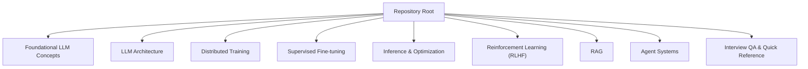
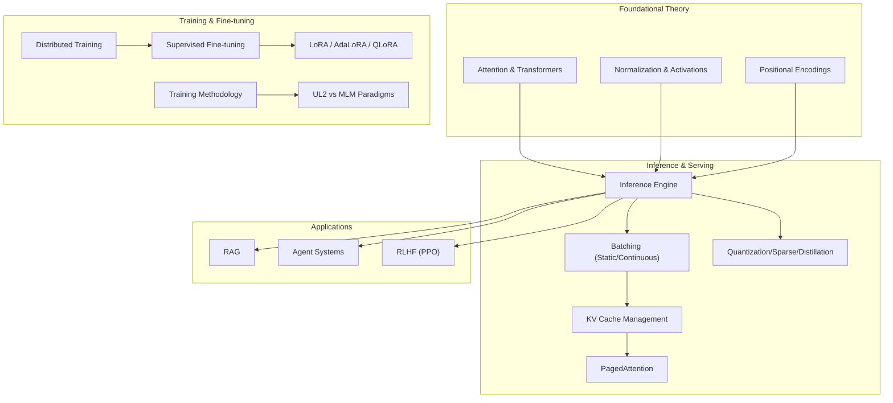
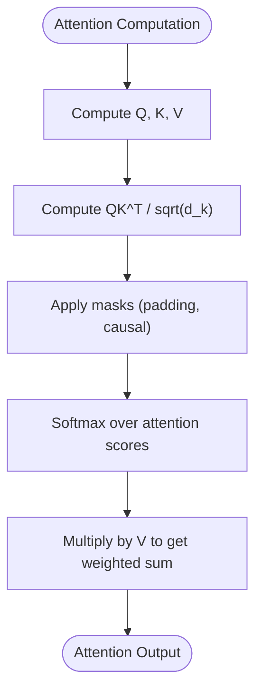
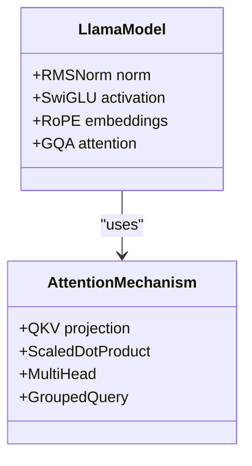
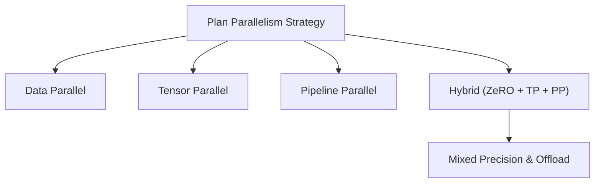
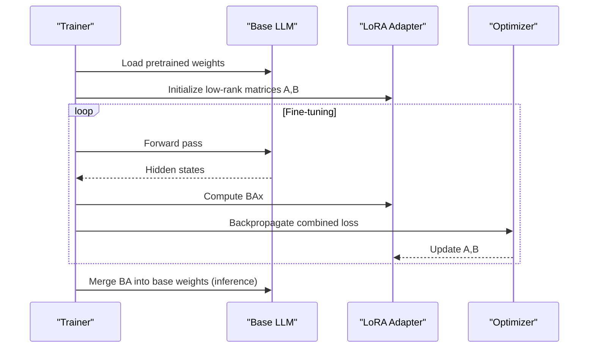
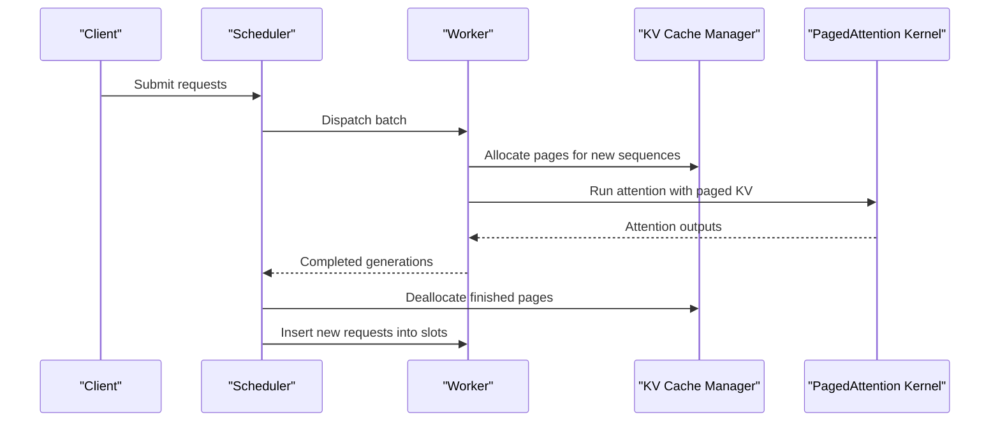
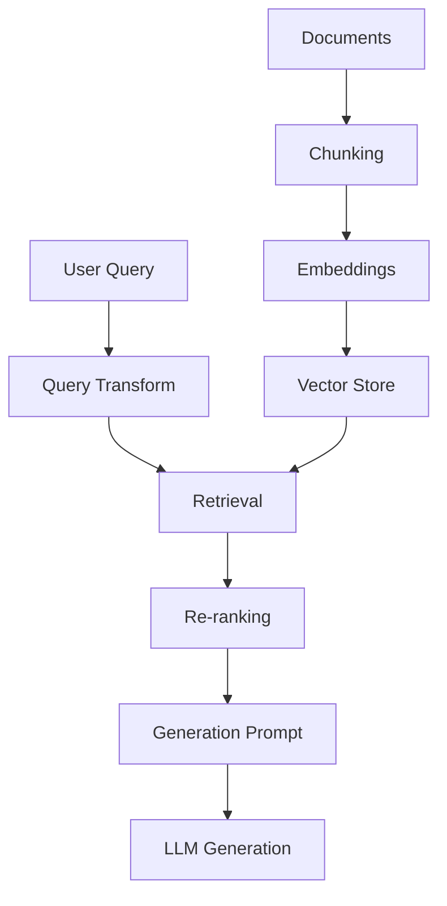
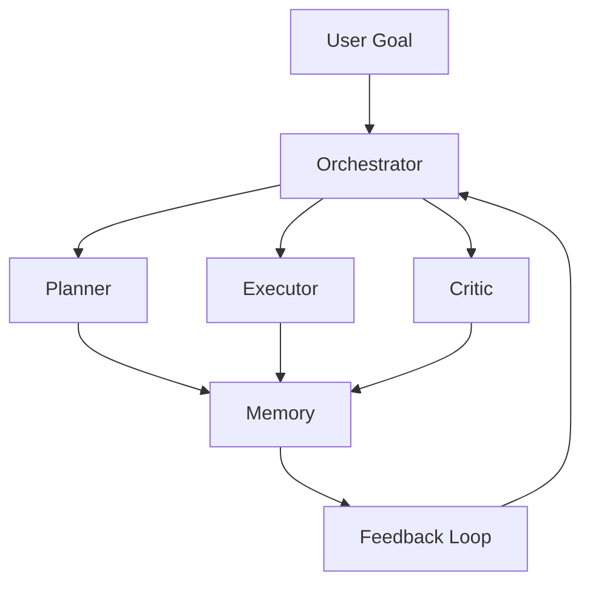
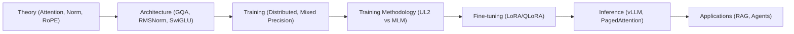

# Interview Preparation

<cite>
**Referenced Files in This Document**
- [README.md](file://README.md)
- [01.大语言模型基础/README.md](file://01.大语言模型基础/README.md)
- [02.大语言模型架构/README.md](file://02.大语言模型架构/README.md)
- [02.大语言模型架构/1.attention/1.attention.md](file://02.大语言模型架构/1.attention/1.attention.md)
- [02.大语言模型架构/llama系列模型/llama系列模型.md](file://02.大语言模型架构/llama系列模型/llama系列模型.md)
- [02.大语言模型架构/5.token及模型参数/5.token及模型参数.md](file://02.大语言模型架构/5.token及模型参数/5.token及模型参数.md)
- [04.分布式训练/9.总结/9.总结.md](file://04.分布式训练/9.总结/9.总结.md)
- [05.有监督微调/4.lora/4.lora.md](file://05.有监督微调/4.lora/4.lora.md)
- [06.推理/1.vllm/1.vllm.md](file://06.推理/1.vllm/1.vllm.md)
- [06.推理/llm推理优化技术/llm推理优化技术.md](file://06.推理/llm推理优化技术/llm推理优化技术.md)
- [07.强化学习/大模型RLHF：PPO原理与源码解读/大模型RLHF：PPO原理与源码解读.md](file://07.强化学习/大模型RLHF：PPO原理与源码解读/大模型RLHF：PPO原理与源码解读.md)
- [08.检索增强rag/README.md](file://08.检索增强rag/README.md)
- [08.检索增强rag/检索增强llm/检索增强llm.md](file://08.检索增强rag/检索增强llm/检索增强llm.md)
- [08.检索增强rag/大模型agent技术/大模型agent技术.md](file://08.检索增强rag/大模型agent技术/大模型agent技术.md)
- [ai_generataion/中级LLM_Agent工程师面试QA清单.md](file://ai_generataion/中级LLM_Agent工程师面试QA清单.md)
- [ai_generataion/中级LLM_Agent工程师面试_快速参考.md](file://ai_generataion/中级LLM_Agent工程师面试_快速参考.md)
</cite>

## Update Summary
**Changes Made**
- Added comprehensive UL2 vs MLM training objectives comparison section
- Expanded training paradigm differences coverage
- Added detailed overfitting risk analysis for different training approaches
- Integrated practical interview questions about unified language learning paradigms
- Enhanced training methodology section with recent research findings

## Table of Contents
1. [Introduction](#introduction)
2. [Project Structure](#project-structure)
3. [Core Components](#core-components)
4. [Architecture Overview](#architecture-overview)
5. [Detailed Component Analysis](#detailed-component-analysis)
6. [Dependency Analysis](#dependency-analysis)
7. [Performance Considerations](#performance-considerations)
8. [Troubleshooting Guide](#troubleshooting-guide)
9. [Conclusion](#conclusion)
10. [Appendices](#appendices)

## Introduction
This document synthesizes a comprehensive interview preparation guide tailored for LLM and Agent engineering roles. It consolidates technical knowledge, system design patterns, coding implementation guidance, and behavioral readiness grounded in the repository's materials. The content is organized around:
- Core LLM concepts and architectures
- Advanced topics: agent design, RAG systems, performance optimization, and production deployment
- Interview categories: fundamentals, system design, coding practice, project experience, and behavior
- Evaluation criteria, preparation strategies, demonstration techniques, and negotiation approaches

**Updated** Added comprehensive coverage of unified language learning paradigms and training methodology comparisons

## Project Structure
The repository is organized by topic domains (foundational LLM theory, architecture, training, inference, RLHF, RAG, agents, and distributed training). A dedicated "ai_generataion" folder provides curated interview QA and quick-reference materials for mid-level candidates.



**Section sources**
- [README.md: 1-169:1-169](file://README.md#L1-L169)

## Core Components
This section distills the essential knowledge areas frequently covered in interviews for LLM and Agent engineering roles.

- Transformer fundamentals and attention mechanisms
  - Self-attention, multi-head attention, positional encodings, scaling, masking, residual connections, normalization variants
  - Complexity analysis and trade-offs
- LLM architectures and design choices
  - RMSNorm, SwiGLU activation, rotary embeddings (RoPE), GQA/MQA/MHA
- Distributed training strategies
  - Data, tensor, pipeline, sequence, and hybrid parallelism; ZeRO; mixed precision
- Supervised fine-tuning and parameter-efficient methods
  - LoRA, AdaLoRA, QLoRA
- Inference optimization and serving
  - Static vs continuous batching, KV cache management, PagedAttention, quantization, sparse/dense kernels
- RLHF and policy optimization
  - Actor/Critic/Reward/Reference models, KL regularization, GAE-based advantages, PPO clipping
- Retrieval-Augmented Generation (RAG)
  - Chunking strategies, embeddings, vector databases, re-ranking, query rewriting, HyDE
- Agent systems
  - Planning, reasoning, memory, tool use, multi-agent coordination, reflection
- **Training Methodology and Paradigms**
  - **Unified Language Learning (UL2) vs Masked Language Modeling (MLM)**
  - **Multi-task training objectives and overfitting risks**
  - **Epoch repetition effects and regularization strategies**

**Updated** Enhanced with comprehensive training methodology coverage including UL2 vs MLM paradigm comparison

**Section sources**
- [02.大语言模型架构/1.attention/1.attention.md: 1-544:1-544](file://02.大语言模型架构/1.attention/1.attention.md#L1-L544)
- [02.大语言模型架构/llama系列模型/llama系列模型.md: 1-292:1-292](file://02.大语言模型架构/llama系列模型/llama系列模型.md#L1-L292)
- [02.大语言模型架构/5.token及模型参数/5.token及模型参数.md: 119-166:119-166](file://02.大语言模型架构/5.token及模型参数/5.token及模型参数.md#L119-L166)
- [04.分布式训练/9.总结/9.summary.md: 1-125:1-125](file://04.分布式训练/9.总结/9.总结.md#L1-L125)
- [05.有监督微调/4.lora/4.lora.md: 1-114:1-114](file://05.有监督微调/4.lora/4.lora.md#L1-L114)
- [06.推理/1.vllm/1.vllm.md: 1-220:1-220](file://06.推理/1.vllm/1.vllm.md#L1-L220)
- [06.推理/llm推理优化技术/llm推理优化技术.md: 1-271:1-271](file://06.推理/llm推理优化技术/llm推理优化技术.md#L1-L271)
- [07.强化学习/大模型RLHF：PPO原理与源码解读/大模型RLHF：PPO原理与源码解读.md: 1-568:1-568](file://07.强化学习/大模型RLHF：PPO原理与源码解读/大模型RLHF：PPO原理与源码解读.md#L1-L568)
- [08.检索增强rag/检索增强llm/检索增强llm.md: 1-526:1-526](file://08.检索增强rag/检索增强llm/检索增强llm.md#L1-L526)
- [08.检索增强rag/大模型agent技术/大模型agent技术.md: 1-483:1-483](file://08.检索增强rag/大模型agent技术/大模型agent技术.md#L1-L483)

## Architecture Overview
The repository's materials collectively describe end-to-end systems for LLM development and deployment. The following diagram maps major components and their interactions across foundational theory, training, fine-tuning, inference, and application domains.



**Updated** Added training methodology and UL2 vs MLM paradigm components to the architecture overview

**Diagram sources**
- [02.大语言模型架构/1.attention/1.attention.md: 1-544:1-544](file://02.大语言模型架构/1.attention/1.attention.md#L1-L544)
- [02.大语言模型架构/5.token及模型参数/5.token及模型参数.md: 119-166:119-166](file://02.大语言模型架构/5.token及模型参数/5.token及模型参数.md#L119-L166)
- [04.分布式训练/9.总结/9.总结.md: 1-125:1-125](file://04.分布式训练/9.总结/9.总结.md#L1-L125)
- [05.有监督微调/4.lora/4.lora.md: 1-114:1-114](file://05.有监督微调/4.lora/4.lora.md#L1-L114)
- [06.推理/1.vllm/1.vllm.md: 1-220:1-220](file://06.推理/1.vllm/1.vllm.md#L1-L220)
- [06.推理/llm推理优化技术/llm推理优化技术.md: 1-271:1-271](file://06.推理/llm推理优化技术/llm推理优化技术.md#L1-L271)
- [07.强化学习/大模型RLHF：PPO原理与源码解读/大模型RLHF：PPO原理与源码解读.md: 1-568:1-568](file://07.强化学习/大模型RLHF：PPO原理与源码解读/大模型RLHF：PPO原理与源码解读.md#L1-L568)
- [08.检索增强rag/检索增强llm/检索增强llm.md: 1-526:1-526](file://08.检索增强rag/检索增强llm/检索增强llm.md#L1-L526)
- [08.检索增强rag/大模型agent技术/大模型agent技术.md: 1-483:1-483](file://08.检索增强rag/大模型agent技术/大模型agent技术.md#L1-L483)

## Detailed Component Analysis

### Transformer Fundamentals and Attention
- Core concepts: query/key/value computation, scaled dot-product attention, multi-head attention, masking, positional encodings
- Complexity: attention O(n²·d), feed-forward O(n·d²); trade-offs between sequence length and hidden dimension
- Variants: GQA/MQA/MHA, RMSNorm vs LayerNorm, RoPE vs absolute positional encodings
- Practical implications: memory-bound decoding, need for KV cache reuse and efficient attention kernels



**Diagram sources**
- [02.大语言模型架构/1.attention/1.attention.md: 31-33:31-33](file://02.大语言模型架构/1.attention/1.attention.md#L31-L33)

**Section sources**
- [02.大语言模型架构/1.attention/1.attention.md: 15-88:15-88](file://02.大语言模型架构/1.attention/1.attention.md#L15-L88)
- [02.大语言模型架构/1.attention/1.attention.md: 374-406:374-406](file://02.大语言模型架构/1.attention/1.attention.md#L374-L406)

### LLM Architectures and Design Choices
- RMSNorm and SwiGLU improve training stability and representational power
- RoPE enables relative positional modeling without absolute positional embeddings
- GQA reduces KV cache footprint while maintaining performance close to MHA



**Diagram sources**
- [02.大语言模型架构/llama系列模型/llama系列模型.md: 15-100:15-100](file://02.大语言模型架构/llama系列模型/llama系列模型.md#L15-L100)
- [02.大语言模型架构/llama系列模型/llama系列模型.md: 230-243:230-243](file://02.大语言模型架构/llama系列模型/llama系列模型.md#L230-L243)

**Section sources**
- [02.大语言模型架构/llama系列模型/llama系列模型.md: 15-100:15-100](file://02.大语言模型架构/llama系列模型/llama系列模型.md#L15-L100)
- [02.大语言模型架构/llama系列模型/llama系列模型.md: 230-243:230-243](file://02.大语言模型架构/llama系列模型/llama系列模型.md#L230-L243)

### Unified Language Learning (UL2) vs Masked Language Modeling (MLM)

**Updated** Added comprehensive coverage of unified language learning paradigms and training methodology comparisons

#### UL2 (Unified Language Learning Paradigm)
UL2 represents Google's innovative approach to unified pre-training, combining multiple denoising objectives in a single framework:

- **Core Philosophy**: Mix multiple pre-training objectives to create a unified language learning paradigm
- **Key Components**:
  - **S-Denoising (Short-range)**: Short span corruption, similar to T5's span corruption
  - **R-Denoising (Regular)**: Medium-length span corruption  
  - **X-Denoising (eXtreme)**: Long span corruption, approaching autoregressive generation
- **MoD (Mixture of Denoisers)**: Random selection of different denoising strategies during training
- **Mode Switching**: Prompt-based switching between generation modes (autoregressive vs non-autoregressive)

#### MLM (Masked Language Modeling)
Traditional masked language modeling approach:

- **Representative Models**: BERT, RoBERTa, DeBERTa
- **Training Method**: Randomly mask tokens in input sequences, then predict masked tokens
- **Characteristics**:
  - Bidirectional attention (can see context)
  - Suitable for understanding tasks (classification, NER, reading comprehension)
  - Not suitable for generation tasks

#### Training Paradigm Differences
| Aspect | UL2 | MLM |
|--------|-----|-----|
| **Training Objectives** | Multiple denoising targets (S/R/X-Denoising) | Single mask prediction target |
| **Model Complexity** | Higher - learns multiple denoising patterns | Lower - focuses on single task |
| **Data Efficiency** | May require more diverse data | More data-efficient for single task |
| **Overfitting Risk** | Higher with multiple epochs | Lower with multiple epochs |
| **Task Flexibility** | Universal - handles multiple tasks | Specialized - understanding tasks |

#### Overfitting Risks and Mitigation
**Why UL2 is more prone to overfitting:**
1. **Target Diversity Effect**: Learning multiple denoising patterns increases memorization tendency
2. **Span Prediction Complexity**: Predicting multiple continuous spans creates stronger biases
3. **Mode Confusion**: Different denoising modes can interfere with each other

**Why MLM is more stable:**
1. **Single Task Focus**: Simplified objective reduces overfitting risk
2. **Token-Level Simplicity**: Predicting single tokens is less complex than span prediction
3. **Established Patterns**: Well-understood training dynamics

#### Practical Interview Questions
**Q: What are the key differences between UL2 and traditional MLM approaches?**
**A**: UL2 combines multiple denoising objectives (short, regular, extreme spans) with mode switching capabilities, while MLM uses a single mask prediction task. UL2 offers greater flexibility but higher overfitting risk.

**Q: Why is UL2 not suitable for multiple epochs of training?**
**A**: The diverse training objectives cause stronger memorization effects, and repeated exposure to the same patterns leads to overfitting. MLM's simpler single-task nature makes it more robust to epoch repetition.

**Q: How do the training objectives affect downstream task performance?**
**A**: UL2's unified approach can potentially improve performance across diverse tasks, but requires careful training strategies. MLM excels in understanding tasks but lacks generation capabilities.

**Section sources**
- [02.大语言模型架构/5.token及模型参数/5.token及模型参数.md: 119-166:119-166](file://02.大语言模型架构/5.token及模型参数/5.token及模型参数.md#L119-L166)

### Distributed Training Strategies
- Data, tensor, pipeline, sequence, and hybrid parallelism
- ZeRO stages and offloading strategies
- Mixed precision (FP16 vs BF16) and stability considerations



**Diagram sources**
- [04.分布式训练/9.总结/9.总结.md: 52-101:52-101](file://04.分布式训练/9.总结/9.总结.md#L52-L101)

**Section sources**
- [04.分布式训练/9.总结/9.总结.md: 1-125:1-125](file://04.分布式训练/9.总结/9.总结.md#L1-L125)

### Parameter-Efficient Fine-tuning (LoRA/AdaLoRA/QLoRA)
- Low-rank adaptation to reduce trainable parameters while preserving performance
- Adaptive budget allocation and 4-bit quantization for memory-constrained fine-tuning



**Diagram sources**
- [05.有监督微调/4.lora/4.lora.md: 9-31:9-31](file://05.有监督微调/4.lora/4.lora.md#L9-L31)

**Section sources**
- [05.有监督微调/4.lora/4.lora.md: 1-114:1-114](file://05.有监督微调/4.lora/4.lora.md#L1-L114)

### Inference Optimization and Serving (vLLM, PagedAttention)
- Continuous batching improves GPU utilization by replacing finished sequences with new ones
- PagedAttention manages KV cache in non-contiguous pages, reducing fragmentation and memory waste
- Quantization and sparse/dense kernels further optimize throughput and latency



**Diagram sources**
- [06.推理/1.vllm/1.vllm.md: 55-150:55-150](file://06.推理/1.vllm/1.vllm.md#L55-L150)
- [06.推理/llm推理优化技术/llm推理优化技术.md: 168-180:168-180](file://06.推理/llm推理优化技术/llm推理优化技术.md#L168-L180)

**Section sources**
- [06.推理/1.vllm/1.vllm.md: 1-220:1-220](file://06.推理/1.vllm/1.vllm.md#L1-L220)
- [06.推理/llm推理优化技术/llm推理优化技术.md: 1-271:1-271](file://06.推理/llm推理优化技术/llm推理优化技术.md#L1-L271)

### RLHF and Policy Optimization (PPO)
- Actor/Critic/Reward/Reference models collaborate to align generations with human preferences
- KL regularization and PPO clipping stabilize training and prevent drift
- GAE-based advantages balance bias/variance trade-offs

```mermaid
sequenceDiagram
participant Prompt as "Prompts"
participant Actor as "Actor (Policy)"
participant Critic as "Critic (Value)"
participant RM as "Reward Model"
participant Ref as "Reference Model"
Prompt->>Actor : Generate responses
Actor-->>Critic : Hidden states/values
Prompt->>RM : Score completions
RM-->>Critic : Rewards
Ref-->>Actor : KL penalty
Critic-->>Actor : Advantages (GAE)
Actor->>Actor : PPO clipped objective
Critic->>Critic : Clipped value loss
```

**Diagram sources**
- [07.强化学习/大模型RLHF：PPO原理与源码解读/大模型RLHF：PPO原理与源码解读.md: 81-170:81-170](file://07.强化学习/大模型RLHF：PPO原理与源码解读/大模型RLHF：PPO原理与源码解读.md#L81-L170)
- [07.强化学习/大模型RLHF：PPO原理与源码解读/大模型RLHF：PPO原理与源码解读.md: 391-430:391-430](file://07.强化学习/大模型RLHF：PPO原理与源码解读/大模型RLHF：PPO原理与源码解读.md#L391-L430)

**Section sources**
- [07.强化学习/大模型RLHF：PPO原理与源码解读/大模型RLHF：PPO原理与源码解读.md: 1-568:1-568](file://07.强化学习/大模型RLHF：PPO原理与源码解读/大模型RLHF：PPO原理与源码解读.md#L1-L568)

### Retrieval-Augmented Generation (RAG)
- Modular components: chunking, embeddings, vector storage/retrieval, re-ranking, generation prompts
- Strategies: HyDE, multi-hop retrieval, query rewriting, metadata-aware filtering



**Diagram sources**
- [08.检索增强rag/检索增强llm/检索增强llm.md: 81-180:81-180](file://08.检索增强rag/检索增强llm/检索增强llm.md#L81-L180)
- [08.检索增强rag/检索增强llm/检索增强llm.md: 213-330:213-330](file://08.检索增强rag/检索增强llm/检索增强llm.md#L213-L330)

**Section sources**
- [08.检索增强rag/检索增强llm/检索增强llm.md: 1-526:1-526](file://08.检索增强rag/检索增强llm/检索增强llm.md#L1-L526)

### Agent Systems
- Evolution from prompting to ReAct, Reflection, and structured planning
- Multi-agent coordination, memory, tool use, and world models
- Double-loop orchestration and hierarchical task decomposition



**Diagram sources**
- [08.检索增强rag/大模型agent技术/大模型agent技术.md: 122-176:122-176](file://08.检索增强rag/大模型agent技术/大模型agent技术.md#L122-L176)

**Section sources**
- [08.检索增强rag/大模型agent技术/大模型agent技术.md: 1-483:1-483](file://08.检索增强rag/大模型agent技术/大模型agent技术.md#L1-L483)

## Dependency Analysis
The repository's materials form a coherent dependency chain from theory to production:
- Foundational theory underpins architecture choices
- Architecture choices drive training and inference decisions
- Training/fine-tuning choices influence serving and application designs
- Application domains (RAG, agents) depend on robust inference and optimization

**Updated** Enhanced dependency chain to include training methodology as a critical dependency



**Diagram sources**
- [02.大语言模型架构/1.attention/1.attention.md: 1-544:1-544](file://02.大语言模型架构/1.attention/1.attention.md#L1-L544)
- [02.大语言模型架构/5.token及模型参数/5.token及模型参数.md: 119-166:119-166](file://02.大语言模型架构/5.token及模型参数/5.token及模型参数.md#L119-L166)
- [04.分布式训练/9.总结/9.总结.md: 1-125:1-125](file://04.分布式训练/9.总结/9.总结.md#L1-L125)
- [05.有监督微调/4.lora/4.lora.md: 1-114:1-114](file://05.有监督微调/4.lora/4.lora.md#L1-L114)
- [06.推理/1.vllm/1.vllm.md: 1-220:1-220](file://06.推理/1.vllm/1.vllm.md#L1-L220)
- [08.检索增强rag/检索增强llm/检索增强llm.md: 1-526:1-526](file://08.检索增强rag/检索增强llm/检索增强llm.md#L1-L526)
- [08.检索增强rag/大模型agent技术/大模型agent技术.md: 1-483:1-483](file://08.检索增强rag/大模型agent技术/大模型agent技术.md#L1-L483)

## Performance Considerations
- Attention complexity O(n²·d) dominates memory-bound decoding; mitigate via:
  - GQA/MQA to reduce KV cache reads
  - PagedAttention to minimize fragmentation and memory overhead
  - Continuous batching to improve GPU utilization
  - Quantization and sparse kernels to reduce bandwidth pressure
- Throughput vs latency trade-offs:
  - Larger batches increase throughput but may increase tail latency
  - KV cache sizing and pre-allocation impact cold-start and memory footprint
- Stability and convergence:
  - Mixed precision (prefer BF16 for large models)
  - KL regularization and PPO clipping to prevent policy drift
- **Training Methodology Considerations**:
  - **UL2 vs MLM**: Choose training paradigm based on task requirements and data availability
  - **Epoch Management**: UL2 requires careful epoch control to prevent overfitting
  - **Regularization**: Dropout and other techniques help mitigate training repetition effects

**Updated** Added training methodology considerations for performance optimization

[No sources needed since this section provides general guidance]

## Troubleshooting Guide
Common issues and remedies:
- Out-of-memory during inference:
  - Reduce batch size or enable PagedAttention
  - Apply KV cache pooling and page-based allocation
- Poor retrieval quality in RAG:
  - Improve chunking strategy and overlap
  - Add re-ranking and query expansion
- Training instability:
  - Switch to BF16 mixed precision
  - Use ZeRO offloading and gradient accumulation
- Agent coordination deadlocks:
  - Introduce timeouts and explicit handoff protocols
  - Use hierarchical decomposition and shared memory abstractions
- **Training Repetition Issues**:
  - **UL2 Overfitting**: Limit epochs or increase regularization
  - **MLM Stability**: Can handle more epochs but monitor for degradation
  - **Data Quality**: Ensure diverse datasets for UL2, focused datasets for MLM

**Updated** Added troubleshooting guidance for training methodology issues

**Section sources**
- [06.推理/1.vllm/1.vllm.md: 61-150:61-150](file://06.推理/1.vllm/1.vllm.md#L61-L150)
- [08.检索增强rag/检索增强llm/检索增强llm.md: 122-180:122-180](file://08.检索增强rag/检索增强llm/检索增强llm.md#L122-L180)
- [04.分布式训练/9.总结/9.总结.md: 110-125:110-125](file://04.分布式训练/9.总结/9.总结.md#L110-L125)
- [08.检索增强rag/大模型agent技术/大模型agent技术.md: 177-213:177-213](file://08.检索增强rag/大模型agent技术/大模型agent技术.md#L177-L213)
- [02.大语言模型架构/5.token及模型参数/5.token及模型参数.md: 119-166:119-166](file://02.大语言模型架构/5.token及模型参数/5.token及模型参数.md#L119-L166)

## Conclusion
This repository provides a comprehensive foundation for LLM and Agent engineering interviews. By mastering transformer theory, architecture choices, distributed training, efficient fine-tuning, inference optimization, RLHF, RAG, and agent design, candidates can demonstrate both technical depth and practical system design skills. 

**Updated** Enhanced with comprehensive training methodology knowledge including UL2 vs MLM paradigms, which are increasingly important for modern LLM development and interview success.

Pair this knowledge with strong project storytelling, evaluation-driven metrics, and clear communication of trade-offs to excel in technical and behavioral rounds.

[No sources needed since this section summarizes without analyzing specific files]

## Appendices

### Interview Categories and Expected Answers
- Fundamentals
  - Expect concise explanations of attention mechanics, normalization, and positional encodings; complexity trade-offs; and GQA/MQA/MHA differences
  - **Training Methodology**: Explain UL2 vs MLM paradigms, overfitting risks, and epoch management strategies
- System Design
  - Design high-throughput, low-latency inference services with continuous batching, KV cache management, and PagedAttention
  - Describe multi-agent orchestration with planning, execution, and feedback loops
  - **Training Infrastructure**: Design scalable training systems supporting multiple paradigms and regularization strategies
- Coding Practice
  - Implement top-k sampling, KV cache pooling, and dynamic batching primitives
  - **Training Utilities**: Implement epoch management, regularization application, and training objective switching
- Project Experience
  - Present measurable outcomes, technical trade-offs, and lessons learned
  - **Training Experiments**: Demonstrate comparative studies between UL2 and MLM approaches
- Behavioral
  - Demonstrate learning agility, collaboration, and ownership

**Updated** Added training methodology and infrastructure design to interview categories

**Section sources**
- [ai_generataion/中级LLM_Agent工程师面试QA清单.md: 12-131:12-131](file://ai_generataion/中级LLM_Agent工程师面试QA清单.md#L12-L131)
- [ai_generataion/中级LLM_Agent工程师面试QA清单.md: 134-226:134-226](file://ai_generataion/中级LLM_Agent工程师面试QA清单.md#L134-L226)
- [ai_generataion/中级LLM_Agent工程师面试QA清单.md: 229-291:229-291](file://ai_generataion/中级LLM_Agent工程师面试QA清单.md#L229-L291)
- [ai_generataion/中级LLM_Agent工程师面试QA清单.md: 294-343:294-343](file://ai_generataion/中级LLM_Agent工程师面试QA清单.md#L294-L343)

### Evaluation Criteria Used by Hiring Committees
- Technical depth: correctness, complexity awareness, and practical applicability
- System design: scalability, reliability, observability, and cost-efficiency
- Coding ability: clarity, performance, and maintainability
- Project impact: metrics, trade-offs, and learnings
- **Training expertise**: Understanding of modern training paradigms, overfitting prevention, and methodology selection
- Cultural fit: collaboration, ownership, and growth mindset

**Updated** Added training expertise as a key evaluation criterion

**Section sources**
- [ai_generataion/中级LLM_Agent工程师面试QA清单.md: 321-343:321-343](file://ai_generataion/中级LLM_Agent工程师面试QA清单.md#L321-L343)

### Preparation Strategies and Pitfalls
- Preparation
  - Focus on 2–3 core domains (attention, inference, RAG, agents) with 2–3 deep projects
  - Practice whiteboard coding and system design with clear complexity trade-offs
  - **Study modern training methodologies**: Understand UL2 vs MLM paradigms and their practical applications
- Common pitfalls
  - Over-engineering simple problems
  - Ignoring production constraints (latency, memory, cost)
  - Failing to quantify impact and trade-offs in projects
  - **Misunderstanding training paradigms**: Confusing UL2 and MLM approaches and their respective strengths

**Updated** Added training methodology preparation guidance

**Section sources**
- [ai_generataion/中级LLM_Agent工程师面试QA清单.md: 321-343:321-343](file://ai_generataion/中级LLM_Agent工程师面试QA清单.md#L321-L343)
- [ai_generataion/中级LLM_Agent工程师面试_快速参考.md: 38-66:38-66](file://ai_generataion/中级LLM_Agent工程师面试_快速参考.md#L38-L66)

### Demonstration Techniques and Negotiation Approaches
- Demonstrate mastery by connecting theory to production: explain why a design choice improves throughput or reduces latency
- **Training demonstration**: Show understanding of when to use UL2 vs MLM paradigms based on task requirements and data characteristics
- Negotiate by aligning expectations with data: present benchmarks, A/B results, and risk mitigation plans

**Updated** Added training methodology demonstration techniques

**Section sources**
- [ai_generataion/中级LLM_Agent工程师面试QA清单.md: 248-291:248-291](file://ai_generataion/中级LLM_Agent工程师面试QA清单.md#L248-L291)
- [ai_generataion/中级LLM_Agent工程师面试_快速参考.md: 52-66:52-66](file://ai_generataion/中级LLM_Agent工程师面试_快速参考.md#L52-L66)