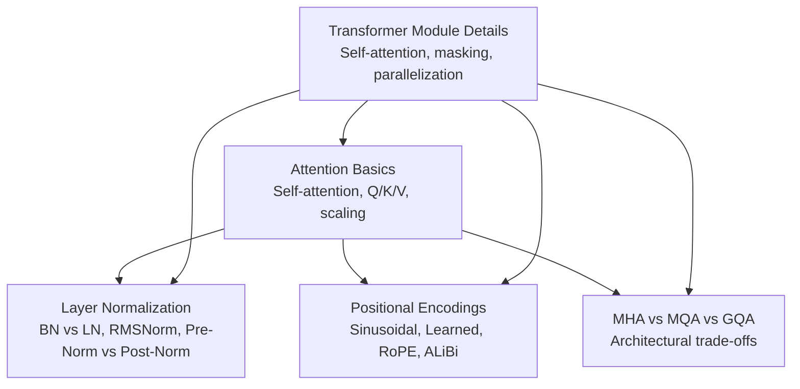
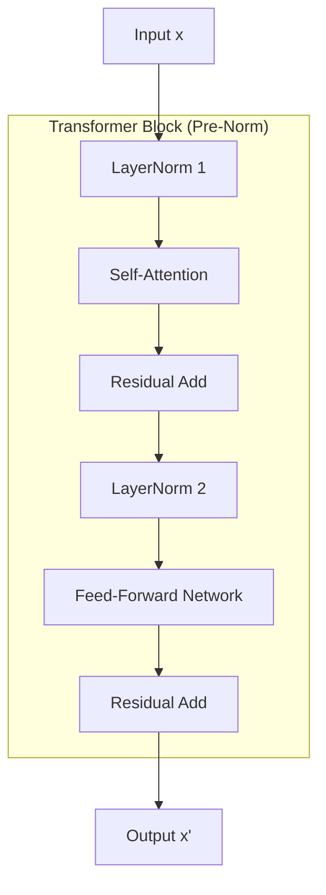
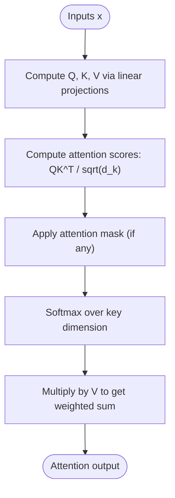
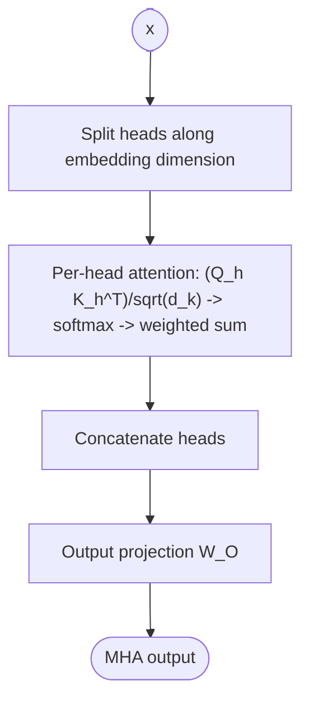
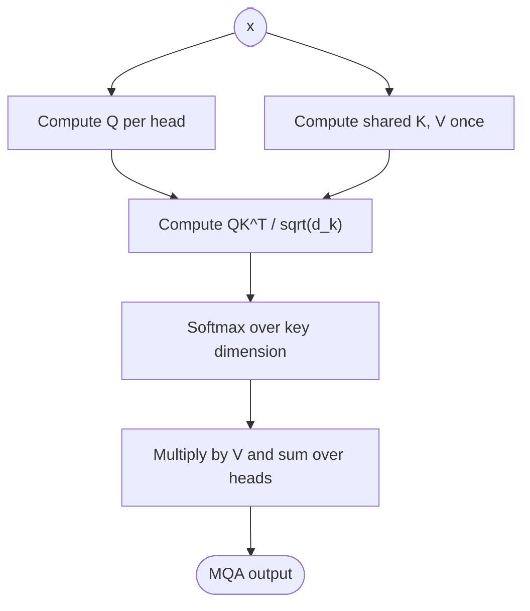
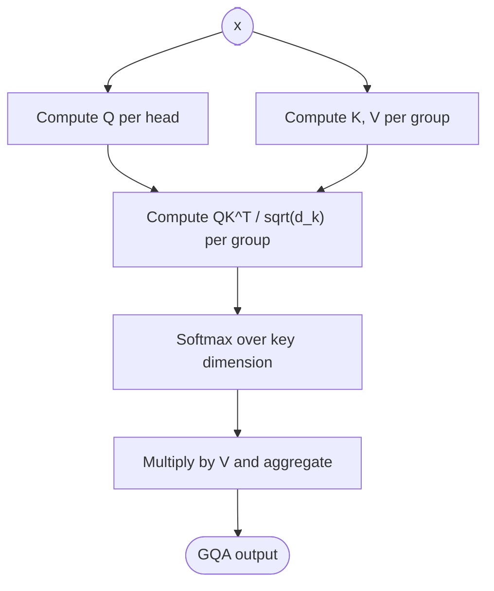
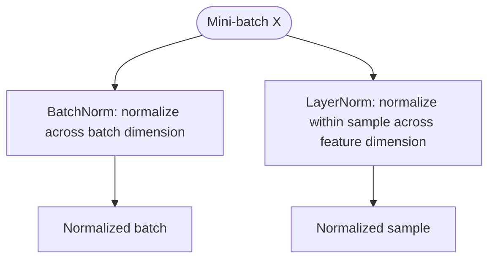
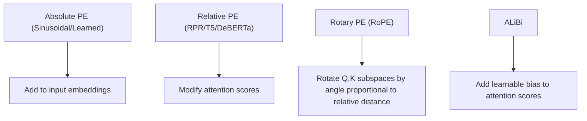
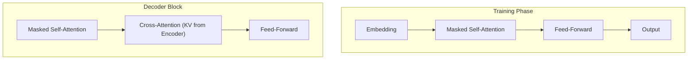
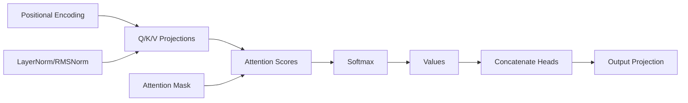

# Attention Mechanisms and Transformer Basics

<cite>
**Referenced Files in This Document**
- [BN VS LN.md](file://02.大语言模型架构/1.attention/BN VS LN.md)
- [2.layer_normalization.md](file://02.大语言模型架构/2.layer_normalization/2.layer_normalization.md)
- [3.位置编码.md](file://02.大语言模型架构/3.位置编码/3.位置编码.md)
- [MHA_MQA_GQA.md](file://02.大语言模型架构/MHA_MQA_GQA/MHA_MQA_GQA.md)
- [Transformer架构细节.md](file://02.大语言模型架构/Transformer架构细节/Transformer架构细节.md)
</cite>

## Table of Contents
1. [Introduction](#introduction)
2. [Project Structure](#project-structure)
3. [Core Components](#core-components)
4. [Architecture Overview](#architecture-overview)
5. [Detailed Component Analysis](#detailed-component-analysis)
6. [Dependency Analysis](#dependency-analysis)
7. [Performance Considerations](#performance-considerations)
8. [Troubleshooting Guide](#troubleshooting-guide)
9. [Conclusion](#conclusion)
10. [Appendices](#appendices)

## Introduction
This document synthesizes the repository’s materials on attention mechanisms and transformer fundamentals. It explains self-attention computation, query-key-value projections, and attention score calculation; documents multi-head attention (MHA), multi-query attention (MQA), and grouped-query attention (GQA); covers layer normalization (BatchNorm vs LayerNorm) and their training stability implications; details positional encodings including sinusoidal, learned, and rotary variants; and compares MHA, MQA, and GQA with performance trade-offs. It also provides practical guidance for selecting attention mechanisms and optimizing memory usage.

## Project Structure
The relevant materials are organized by topic under the “大语言模型架构” (Large Language Model Architecture) section:
- Attention basics and normalization
- Layer normalization techniques
- Positional encodings (absolute, relative, RoPE, ALiBi)
- MHA vs MQA vs GQA
- Transformer module details (self-attention, multi-head, masking, and parallelization)

[No sources needed since this diagram shows conceptual workflow, not actual code structure]

## Core Components
- Self-attention and scaled dot-product attention
- Multi-head attention (MHA) with head splitting, concatenation, and output projection
- Multi-query attention (MQA) and grouped-query attention (GQA) variants
- Layer normalization (LN) and its advantages over batch normalization (BN) in NLP
- Positional encodings: sinusoidal, learned, rotary (RoPE), ALiBi, and length extrapolation strategies

**Section sources**
- [Transformer架构细节.md: 60–83:60-83](file://02.大语言模型架构/Transformer架构细节/Transformer架构细节.md#L60-L83)
- [Transformer架构细节.md: 84–244:84-244](file://02.大语言模型架构/Transformer架构细节/Transformer架构细节.md#L84-L244)
- [MHA_MQA_GQA.md: 17–30:17-30](file://02.大语言模型架构/MHA_MQA_GQA/MHA_MQA_GQA.md#L17-L30)
- [MHA_MQA_GQA.md: 89–156:89-156](file://02.大语言模型架构/MHA_MQA_GQA/MHA_MQA_GQA.md#L89-L156)
- [MHA_MQA_GQA.md: 158–225:158-225](file://02.大语言模型架构/MHA_MQA_GQA/MHA_MQA_GQA.md#L158-L225)
- [BN VS LN.md: 8–34:8-34](file://02.大语言模型架构/1.attention/BN VS LN.md#L8-L34)
- [2.layer_normalization.md: 37–72:37-72](file://02.大语言模型架构/2.layer_normalization/2.layer_normalization.md#L37-L72)
- [3.位置编码.md: 10–43:10-43](file://02.大语言模型架构/3.位置编码/3.位置编码.md#L10-L43)
- [3.位置编码.md: 194–317:194-317](file://02.大语言模型架构/3.位置编码/3.位置编码.md#L194-L317)

## Architecture Overview
The transformer module integrates self-attention, feed-forward networks, residual connections, and normalization. Modern large language models commonly use pre-normalization (Pre-Norm) with RMSNorm or LayerNorm, and often employ RoPE or ALiBi for positional information.

**Diagram sources**
- [BN VS LN.md: 82–93:82-93](file://02.大语言模型架构/1.attention/BN VS LN.md#L82-L93)
- [BN VS LN.md: 95–107:95-107](file://02.大语言模型架构/1.attention/BN VS LN.md#L95-L107)

**Section sources**
- [BN VS LN.md: 37–67:37-67](file://02.大语言模型架构/1.attention/BN VS LN.md#L37-L67)
- [2.layer_normalization.md: 171–182:171-182](file://02.大语言模型架构/2.layer_normalization/2.layer_normalization.md#L171-L182)

## Detailed Component Analysis

### Self-Attention Computation
Self-attention computes attention scores from query (Q), key (K), and value (V) matrices derived by linear projections of the input sequence. Scores are scaled by the inverse square root of the key dimension to stabilize gradients and softmax distributions. Softmax produces attention weights, which are applied to values to produce the output.

**Diagram sources**
- [Transformer架构细节.md: 60–83:60-83](file://02.大语言模型架构/Transformer架构细节/Transformer架构细节.md#L60-L83)
- [Transformer架构细节.md: 84–244:84-244](file://02.大语言模型架构/Transformer架构细节/Transformer架构细节.md#L84-L244)

**Section sources**
- [Transformer架构细节.md: 60–83:60-83](file://02.大语言模型架构/Transformer架构细节/Transformer架构细节.md#L60-L83)
- [Transformer架构细节.md: 84–244:84-244](file://02.大语言模型架构/Transformer架构细节/Transformer架构细节.md#L84-L244)

### Multi-Head Attention (MHA)
MHA splits the projected Q, K, V along the head dimension, applies attention independently per head, concatenates outputs, and projects to the model dimension. This enables capturing diverse sub-spaces and richer feature combinations.

**Diagram sources**
- [MHA_MQA_GQA.md: 17–30:17-30](file://02.大语言模型架构/MHA_MQA_GQA/MHA_MQA_GQA.md#L17-L30)

**Section sources**
- [MHA_MQA_GQA.md: 17–30:17-30](file://02.大语言模型架构/MHA_MQA_GQA/MHA_MQA_GQA.md#L17-L30)

### Multi-Query Attention (MQA)
MQA shares a single set of key/value projections across all heads while keeping separate query projections. This reduces KV parameter footprint and can accelerate decoding in autoregressive settings.

**Diagram sources**
- [MHA_MQA_GQA.md: 89–156:89-156](file://02.大语言模型架构/MHA_MQA_GQA/MHA_MQA_GQA.md#L89-L156)

**Section sources**
- [MHA_MQA_GQA.md: 89–156:89-156](file://02.大语言模型架构/MHA_MQA_GQA/MHA_MQA_GQA.md#L89-L156)

### Grouped-Query Attention (GQA)
GQA partitions heads into groups, with each group sharing a single K/V projection. This interpolates between MHA (no grouping) and MQA (single group), trading off performance and compute/parameter savings.

**Diagram sources**
- [MHA_MQA_GQA.md: 158–225:158-225](file://02.大语言模型架构/MHA_MQA_GQA/MHA_MQA_GQA.md#L158-L225)

**Section sources**
- [MHA_MQA_GQA.md: 158–225:158-225](file://02.大语言模型架构/MHA_MQA_GQA/MHA_MQA_GQA.md#L158-L225)

### Layer Normalization (LN) vs Batch Normalization (BN)
- LN normalizes within a sample across feature dimensions, making it robust to varying sequence lengths and batch sizes, and consistent between training and inference.
- BN normalizes across samples, which is problematic for NLP due to variable-length sequences and padding, and requires maintaining running statistics.

**Diagram sources**
- [BN VS LN.md: 12–34:12-34](file://02.大语言模型架构/1.attention/BN VS LN.md#L12-L34)
- [2.layer_normalization.md: 37–72:37-72](file://02.大语言模型架构/2.layer_normalization/2.layer_normalization.md#L37-L72)

**Section sources**
- [BN VS LN.md: 8–34:8-34](file://02.大语言模型架构/1.attention/BN VS LN.md#L8-L34)
- [2.layer_normalization.md: 37–72:37-72](file://02.大语言模型架构/2.layer_normalization/2.layer_normalization.md#L37-L72)

### Positional Encodings
- Sinusoidal (absolute): explicit periodic encodings enabling extrapolation-like behavior.
- Learned embeddings: trainable positional vectors; often lack extrapolation.
- Rotary Position Embeddings (RoPE): injects relative position information by rotating Q/K pairs in 2D subspaces.
- ALiBi: adds learnable biases to attention scores to encode relative distances.

**Diagram sources**
- [3.位置编码.md: 10–43:10-43](file://02.大语言模型架构/3.位置编码/3.位置编码.md#L10-L43)
- [3.位置编码.md: 194–317:194-317](file://02.大语言模型架构/3.位置编码/3.位置编码.md#L194-L317)

**Section sources**
- [3.位置编码.md: 10–43:10-43](file://02.大语言模型架构/3.位置编码/3.位置编码.md#L10-L43)
- [3.位置编码.md: 194–317:194-317](file://02.大语言模型架构/3.位置编码/3.位置编码.md#L194-L317)

### Transformer Blocks and Parallelization
- Self-attention and feed-forward layers are computed in parallel across tokens via matrix operations.
- Decoder blocks add masked self-attention and cross-attention with encoder outputs.

**Diagram sources**
- [Transformer架构细节.md: 16–23:16-23](file://02.大语言模型架构/Transformer架构细节/Transformer架构细节.md#L16-L23)
- [Transformer架构细节.md: 288–321:288-321](file://02.大语言模型架构/Transformer架构细节/Transformer架构细节.md#L288-L321)

**Section sources**
- [Transformer架构细节.md: 16–23:16-23](file://02.大语言模型架构/Transformer架构细节/Transformer架构细节.md#L16-L23)
- [Transformer架构细节.md: 288–321:288-321](file://02.大语言模型架构/Transformer架构细节/Transformer架构细节.md#L288-L321)

## Dependency Analysis
Attention mechanisms depend on:
- Linear projections (Q, K, V) and output projection (W_O)
- Normalization (LN/RMSNorm) and residual connections
- Positional encodings (absolute or relative)
- Masking for causal decoding

**Diagram sources**
- [MHA_MQA_GQA.md: 17–30:17-30](file://02.大语言模型架构/MHA_MQA_GQA/MHA_MQA_GQA.md#L17-L30)
- [Transformer架构细节.md: 84–244:84-244](file://02.大语言模型架构/Transformer架构细节/Transformer架构_details.md#L84-L244)
- [3.位置编码.md: 194–317:194-317](file://02.大语言模型架构/3.位置编码/3.位置编码.md#L194-L317)

**Section sources**
- [MHA_MQA_GQA.md: 17–30:17-30](file://02.大语言模型架构/MHA_MQA_GQA/MHA_MQA_GQA.md#L17-L30)
- [Transformer架构细节.md: 84–244:84-244](file://02.大语言模型架构/Transformer架构细节/Transformer架构细节.md#L84-L244)
- [3.位置编码.md: 194–317:194-317](file://02.大语言模型架构/3.位置编码/3.位置编码.md#L194-L317)

## Performance Considerations
- Memory optimization
  - MQA reduces KV parameter count by sharing K/V across heads.
  - GQA balances performance and memory by grouping heads and sharing K/V per group.
  - RoPE avoids storing positional embeddings and can improve extrapolation.
- Numerical stability
  - Scaling by 1/sqrt(d_k) stabilizes softmax gradients.
  - LN improves training stability compared to BN in NLP.
- Practical guidance
  - Prefer Pre-Norm with LN/RMSNorm for deep transformers.
  - Use RoPE for long-context tasks; consider ALiBi for extrapolation.
  - Choose attention variant based on compute budget: MHA for quality, MQA/GQA for speed/memory.

[No sources needed since this section provides general guidance]

## Troubleshooting Guide
- Gradient vanishing/explosion
  - Ensure scaling by 1/sqrt(d_k) and LN to stabilize softmax and gradients.
- Poor extrapolation
  - Use RoPE or ALiBi; consider length-extrapolation techniques (e.g., NTK-aware RoPE).
- Training instability
  - Prefer Pre-Norm over Post-Norm; use LN/RMSNorm consistently across training and inference.

**Section sources**
- [Transformer架构细节.md: 84–244:84-244](file://02.大语言模型架构/Transformer架构细节/Transformer架构细节.md#L84-L244)
- [BN VS LN.md: 8–34:8-34](file://02.大语言模型架构/1.attention/BN VS LN.md#L8-L34)
- [3.位置编码.md: 194–317:194-317](file://02.大语言模型架构/3.位置编码/3.位置编码.md#L194-L317)

## Conclusion
Attention mechanisms form the backbone of modern transformers. Self-attention with Q/K/V projections, scaled softmax, and residual connections enable powerful sequence modeling. MHA captures diverse sub-spaces, while MQA and GQA reduce KV parameters and accelerate decoding. LN (especially Pre-Norm) stabilizes training, and positional encodings (RoPE, ALiBi) encode relative positions effectively. Select attention variants and normalization strategies based on task, memory, and performance constraints.

[No sources needed since this section summarizes without analyzing specific files]

## Appendices
- Mathematical formulations
  - Attention scores: QK^T / sqrt(d_k)
  - Softmax normalization over key dimension
  - Output projection: concatenate head outputs and multiply by W_O
- Implementation pointers
  - MHA: split heads, compute per-head attention, concatenate, project
  - MQA: share K/V across heads; broadcast for attention
  - GQA: group heads and share K/V per group; expand to match head layout
  - LN: normalize within-sample feature dimensions; consistent across training/inference

[No sources needed since this section provides general guidance]