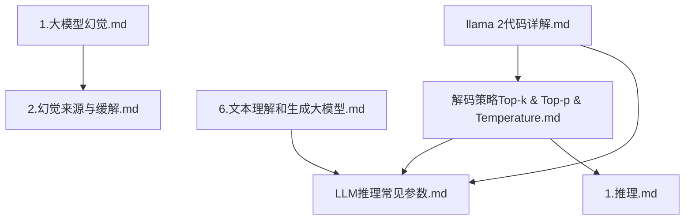
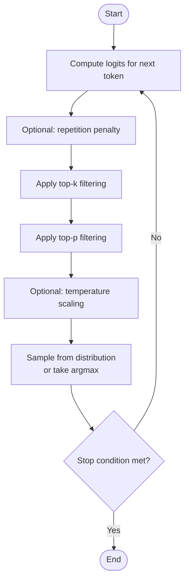
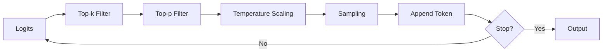

# Decoding Strategies and Generation Techniques

<cite>
**Referenced Files in This Document**
- [解码策略（Top-k & Top-p & Temperature）.md](file://02.大语言模型架构/解码策略（Top-k & Top-p & Temperatu/解码策略（Top-k & Top-p & Temperature）.md)
- [LLM推理常见参数.md](file://06.推理/LLM推理常见参数/LLM推理常见参数.md)
- [1.推理.md](file://06.推理/1.推理/1.推理.md)
- [6.文本理解和生成大模型.md](file://98.相关课程/清华大模型公开课/6.文本理解和生成大模型/6.文本理解和生成大模型.md)
- [1.大模型幻觉.md](file://09.大语言模型评估/1.大模型幻觉/1.大模型幻觉.md)
- [2.幻觉来源与缓解.md](file://09.大语言模型评估/2.幻觉来源与缓解/2.幻觉来源与缓解.md)
- [llama 2代码详解.md](file://02.大语言模型架构/llama 2代码详解/llama 2代码详解.md)
</cite>

## Table of Contents
1. [Introduction](#introduction)
2. [Project Structure](#project-structure)
3. [Core Components](#core-components)
4. [Architecture Overview](#architecture-overview)
5. [Detailed Component Analysis](#detailed-component-analysis)
6. [Dependency Analysis](#dependency-analysis)
7. [Performance Considerations](#performance-considerations)
8. [Troubleshooting Guide](#troubleshooting-guide)
9. [Conclusion](#conclusion)
10. [Appendices](#appendices)

## Introduction
This document explains decoding strategies and text generation techniques commonly used in large language models. It covers greedy decoding, beam search, top-k sampling, nucleus (top-p) sampling, and temperature scaling. It also discusses diversity–coverage trade-offs, quality–diversity balance, safety considerations, hallucination mitigation, and practical guidance for selecting decoding strategies based on application requirements.

## Project Structure
The repository organizes materials around LLM fundamentals, architecture, inference, evaluation, and hallucination. Relevant content for decoding strategies is primarily located under:
- 02.大语言模型架构/解码策略（Top-k & Top-p & Temperature）: Implementation examples and conceptual explanations
- 06.推理/LLM推理常见参数: Practical parameters and their effects
- 06.推理/1.推理: Parameter descriptions and usage notes
- 98.相关课程/清华大模型公开课/6.文本理解和生成大模型: Additional decoding and generation insights
- 09.大语言模型评估/1.大模型幻觉 and 2.幻觉来源与缓解: Safety and hallucination mitigation
- 02.大语言模型架构/llama 2代码详解: Concrete inference-time generation flow

**Diagram sources**
- [解码策略（Top-k & Top-p & Temperature）.md](file://02.大语言模型架构/解码策略（Top-k & Top-p & Temperatu/解码策略（Top-k & Top-p & Temperature）.md)
- [LLM推理常见参数.md](file://06.推理/LLM推理常见参数/LLM推理常见参数.md)
- [1.推理.md](file://06.推理/1.推理/1.推理.md)
- [6.文本理解和生成大模型.md](file://98.相关课程/清华大模型公开课/6.文本理解和生成大模型/6.文本理解和生成大模型.md)
- [1.大模型幻觉.md](file://09.大语言模型评估/1.大模型幻觉/1.大模型幻觉.md)
- [2.幻觉来源与缓解.md](file://09.大语言模型评估/2.幻觉来源与缓解/2.幻觉来源与缓解.md)
- [llama 2代码详解.md](file://02.大语言模型架构/llama 2代码详解/llama 2代码详解.md)

**Section sources**
- [解码策略（Top-k & Top-p & Temperature）.md](file://02.大语言模型架构/解码策略（Top-k & Top-p & Temperatu/解码策略（Top-k & Top-p & Temperature）.md)
- [LLM推理常见参数.md](file://06.推理/LLM推理常见参数/LLM推理常见参数.md)
- [1.推理.md](file://06.推理/1.推理/1.推理.md)
- [6.文本理解和生成大模型.md](file://98.相关课程/清华大模型公开课/6.文本理解和生成大模型/6.文本理解和生成大模型.md)
- [1.大模型幻觉.md](file://09.大语言模型评估/1.大模型幻觉/1.大模型幻觉.md)
- [2.幻觉来源与缓解.md](file://09.大语言模型评估/2.幻觉来源与缓解/2.幻觉来源与缓解.md)
- [llama 2代码详解.md](file://02.大语言模型架构/llama 2代码详解/llama 2代码详解.md)

## Core Components
- Greedy Decoding: Selects the token with the highest probability at each step. Pros: deterministic, efficient. Cons: prone to repetition and reduced diversity.
- Beam Search: Maintains a fixed number of candidate sequences and expands the most promising ones. Pros: often improves quality. Cons: higher computational cost and memory usage; still deterministic for a given input.
- Top-k Sampling: Restricts sampling to the k highest probability tokens. Pros: introduces randomness while limiting tail risk. Cons: may miss low-probability but meaningful tokens.
- Nucleus (Top-p) Sampling: Selects tokens whose cumulative probability reaches threshold p. Pros: adapts dynamically to distribution sharpness; reduces long tail noise. Cons: requires sorting probabilities; sensitivity to p.
- Temperature Scaling: Adjusts the softmax temperature to control entropy and randomness. Pros: smooth control over diversity vs. determinism. Cons: requires calibration; extreme values can degrade coherence.

**Section sources**
- [解码策略（Top-k & Top-p & Temperature）.md](file://02.大语言模型架构/解码策略（Top-k & Top-p & Temperatu/解码策略（Top-k & Top-p & Temperature）.md)
- [LLM推理常见参数.md](file://06.推理/LLM推理常见参数/LLM推理常见参数.md)
- [1.推理.md](file://06.推理/1.推理/1.推理.md)
- [6.文本理解和生成大模型.md](file://98.相关课程/清华大模型公开课/6.文本理解和生成大模型/6.文本理解和生成大模型.md)

## Architecture Overview
The decoding pipeline typically proceeds as follows:
- Compute logits for the next token.
- Optionally apply repetition penalty to reduce repeated tokens.
- Apply top-k filtering to restrict candidates.
- Apply top-p filtering to further constrain the candidate set.
- Optionally scale logits by temperature.
- Sample from the resulting distribution (or greedily select the argmax).
- Append the selected token and continue until stopping criteria are met.

**Diagram sources**
- [解码策略（Top-k & Top-p & Temperature）.md](file://02.大语言模型架构/解码策略（Top-k & Top-p & Temperatu/解码策略（Top-k & Top-p & Temperature）.md)
- [LLM推理常见参数.md](file://06.推理/LLM推理常见参数/LLM推理常见参数.md)
- [1.推理.md](file://06.推理/1.推理/1.推理.md)

## Detailed Component Analysis

### Greedy Decoding
- Mechanism: Always selects the token with the highest probability.
- Pros: Deterministic, fast, minimal memory overhead.
- Cons: Prone to repetitive outputs and lacks diversity.
- Typical use: Fast baseline, constrained environments where repeatability is desired.

**Section sources**
- [6.文本理解和生成大模型.md](file://98.相关课程/清华大模型公开课/6.文本理解和生成大模型/6.文本理解和生成大模型.md)
- [LLM推理常见参数.md](file://06.推理/LLM推理常见参数/LLM推理常见参数.md)

### Beam Search
- Mechanism: Keeps k best partial sequences and expands them at each step.
- Pros: Often yields higher-quality outputs than greedy decoding.
- Cons: Computation and memory increase with beam size; still deterministic for a given input.
- Typical use: Quality-sensitive tasks where acceptable latency allows beam search.

**Section sources**
- [LLM推理常见参数.md](file://06.推理/LLM推理常见参数/LLM推理常见参数.md)
- [6.文本理解和生成大模型.md](file://98.相关课程/清华大模型公开课/6.文本理解和生成大模型/6.文本理解和生成大模型.md)

### Top-k Sampling
- Mechanism: After obtaining probabilities, select among the top-k tokens by probability.
- Pros: Introduces controlled randomness; avoids low-probability outliers.
- Cons: May miss rare but useful tokens; diversity–quality trade-off depends on k.
- Typical use: Creative writing, dialogue systems, where some randomness is beneficial.

Implementation highlights:
- Construct a masked distribution over logits by keeping only top-k scores and setting others to negative infinity.
- Sample from the resulting distribution (often combined with temperature scaling).

**Section sources**
- [解码策略（Top-k & Top-p & Temperature）.md](file://02.大语言模型架构/解码策略（Top-k & Top-p & Temperatu/解码策略（Top-k & Top-p & Temperature）.md)

### Nucleus (Top-p) Sampling
- Mechanism: Select tokens whose cumulative probability reaches threshold p, starting from the highest.
- Pros: Adapts to distribution sharpness; reduces long-tail noise.
- Cons: Requires sorting probabilities; sensitive to p; can be computationally heavier than top-k alone.
- Typical use: General-purpose generation where adaptivity is desired.

Implementation highlights:
- Sort probabilities, compute cumulative sums, mask tokens below the threshold, then sample from the filtered distribution.

**Section sources**
- [解码策略（Top-k & Top-p & Temperature）.md](file://02.大语言模型架构/解码策略（Top-k & Top-p & Temperatu/解码策略（Top-k & Top-p & Temperature）.md)

### Temperature Scaling
- Mechanism: Divide logits by temperature before softmax; lower temperatures sharpen the distribution; higher temperatures flatten it.
- Effects: Lower temperature increases confidence and determinism; higher temperature increases randomness and entropy.
- Typical use: Fine-tuning creativity and coherence; often combined with top-k/top-p.

**Section sources**
- [解码策略（Top-k & Top-p & Temperature）.md](file://02.大语言模型架构/解码策略（Top-k & Top-p & Temperatu/解码策略（Top-k & Top-p & Temperature）.md)
- [1.推理.md](file://06.推理/1.推理/1.推理.md)

### Joint Sampling Pipeline
Common order: top-k → top-p → temperature. This ensures:
- top-k limits the candidate set,
- top-p further constrains by cumulative probability,
- temperature adjusts entropy for diversity.

**Section sources**
- [解码策略（Top-k & Top-p & Temperature）.md](file://02.大语言模型架构/解码策略（Top-k & Top-p & Temperatu/解码策略（Top-k & Top-p & Temperature）.md)
- [LLM推理常见参数.md](file://06.推理/LLM推理常见参数/LLM推理常见参数.md)

### Repetition Penalty
- Mechanism: Penalize previously generated tokens to reduce repetition.
- Effects: Higher penalty reduces repetition; lower penalty may encourage reuse.
- Typical use: Dialogue, summarization, instruction-following where repetition harms readability.

**Section sources**
- [LLM推理常见参数.md](file://06.推理/LLM推理常见参数/LLM推理常见参数.md)

### Stopping Criteria and Early Termination
- Common criteria: End-of-sequence token, maximum length, or custom prompts.
- Implementation note: Inference loops iterate until stopping conditions are met.

**Section sources**
- [llama 2代码详解.md](file://02.大语言模型架构/llama 2代码详解/llama 2代码详解.md)
- [LLM推理常见参数.md](file://06.推理/LLM推理常见参数/LLM推理常见参数.md)

### Safety and Hallucination Mitigation
- Random decoding increases uncertainty and can raise hallucination risk.
- Mitigation strategies include:
  - External verification (search, QA, NLI).
  - Self-checking multiple generations and measuring consistency.
  - Factuality-enhanced decoding (e.g., decaying top-p).
  - Contrastive decoding and context-aware decoding.
  - Post-hoc verification and reflection.

**Section sources**
- [1.大模型幻觉.md](file://09.大语言模型评估/1.大模型幻觉/1.大模型幻觉.md)
- [2.幻觉来源与缓解.md](file://09.大语言模型评估/2.幻觉来源与缓解/2.幻觉来源与缓解.md)

## Dependency Analysis
The decoding pipeline integrates multiple components with clear data dependencies:
- Logits feed into filters (top-k, top-p), then temperature scaling, and finally sampling.
- Repetition penalty modifies logits prior to sampling.
- Stopping criteria terminate the loop.

**Diagram sources**
- [解码策略（Top-k & Top-p & Temperature）.md](file://02.大语言模型架构/解码策略（Top-k & Top-p & Temperatu/解码策略（Top-k & Top-p & Temperature）.md)
- [LLM推理常见参数.md](file://06.推理/LLM推理常见参数/LLM推理常见参数.md)

**Section sources**
- [解码策略（Top-k & Top-p & Temperature）.md](file://02.大语言模型架构/解码策略（Top-k & Top-p & Temperatu/解码策略（Top-k & Top-p & Temperature）.md)
- [LLM推理常见参数.md](file://06.推理/LLM推理常见参数/LLM推理常见参数.md)

## Performance Considerations
- Greedy decoding is fastest and most memory-efficient.
- Beam search scales poorly with beam size; consider alternatives for latency-critical scenarios.
- top-k and top-p reduce computation by limiting candidate sets; choose k and p to balance quality and speed.
- Temperature scaling is cheap but affects downstream sampling costs.
- Repetition penalty adds minimal overhead but improves coherence.

[No sources needed since this section provides general guidance]

## Troubleshooting Guide
- Excessive repetition:
  - Increase repetition penalty; consider contrastive decoding or context-aware decoding.
- Low coherence or incoherent outputs:
  - Reduce temperature; tighten top-p; consider greedy decoding for stability.
- Unstable outputs across runs:
  - Disable randomness (temperature=0) or fix seeds; otherwise expect stochastic outputs.
- Long tails and noisy tokens:
  - Increase top-k or decrease top-p to focus on high-probability tokens.
- Hallucinations:
  - Use external verification, self-checking, factuality-enhanced decoding, or post-hoc verification.

**Section sources**
- [1.大模型幻觉.md](file://09.大语言模型评估/1.大模型幻觉/1.大模型幻觉.md)
- [2.幻觉来源与缓解.md](file://09.大语言模型评估/2.幻觉来源与缓解/2.幻觉来源与缓解.md)
- [LLM推理常见参数.md](file://06.推理/LLM推理常见参数/LLM推理常见参数.md)

## Conclusion
Choosing a decoding strategy depends on application goals:
- For deterministic, fast outputs: Greedy decoding.
- For high-quality, coherent outputs: Beam search or joint top-k/top-p with temperature.
- For creative, diverse outputs: Lower temperature with top-k/top-p; moderate penalties.
- For safety and reliability: Combine external verification, self-checking, and context-aware decoding; tune top-p and repetition penalty carefully.

[No sources needed since this section summarizes without analyzing specific files]

## Appendices

### Practical Parameter Tuning Guidelines
- Greedy decoding:
  - Use temperature near 0; keep top-k and top-p defaults.
- Beam search:
  - Start with small beam sizes; evaluate quality–latency trade-offs.
- Top-k:
  - Start around 3–10; larger k increases diversity but may reduce quality.
- Top-p:
  - Start around 0.7–0.9; lower p reduces long tail noise.
- Temperature:
  - Start around 0.7–1.0; lower for more deterministic outputs, higher for more creative outputs.
- Repetition penalty:
  - Start around 1.05–1.5; increase to reduce repetition.

**Section sources**
- [解码策略（Top-k & Top-p & Temperature）.md](file://02.大语言模型架构/解码策略（Top-k & Top-p & Temperatu/解码策略（Top-k & Top-p & Temperature）.md)
- [LLM推理常见参数.md](file://06.推理/LLM推理常见参数/LLM推理常见参数.md)
- [1.推理.md](file://06.推理/1.推理/1.推理.md)

### Qualitative Differences Between Strategies
- Greedy: Highest probability token; deterministic and fast.
- Beam search: Multiple hypotheses; improved quality at higher cost.
- Top-k: Controlled randomness; balances diversity and coherence.
- Top-p: Adaptive cutoff; robust against flat distributions.
- Temperature: Smoothly modulates entropy; affects creativity and coherence.

**Section sources**
- [解码策略（Top-k & Top-p & Temperature）.md](file://02.大语言模型架构/解码策略（Top-k & Top-p & Temperatu/解码策略（Top-k & Top-p & Temperature）.md)
- [6.文本理解和生成大模型.md](file://98.相关课程/清华大模型公开课/6.文本理解和生成大模型/6.文本理解和生成大模型.md)