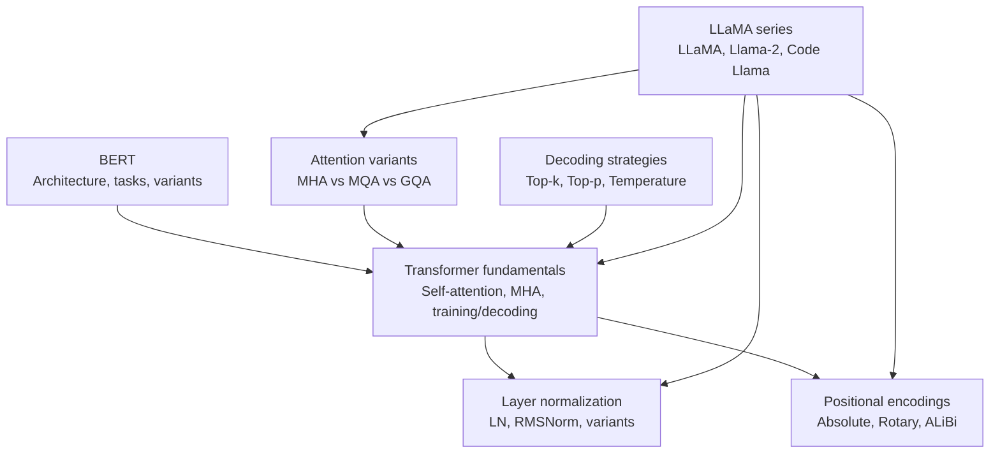
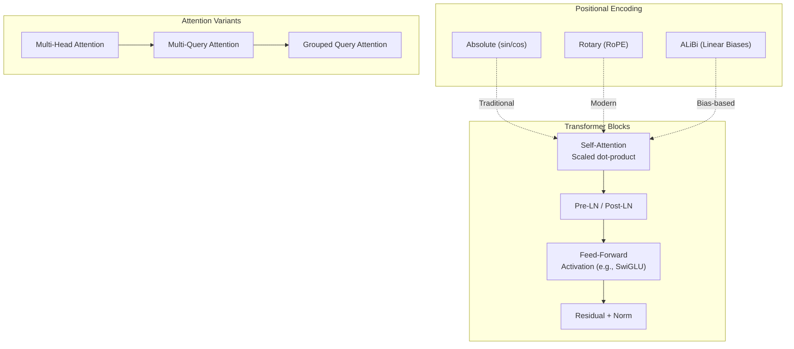
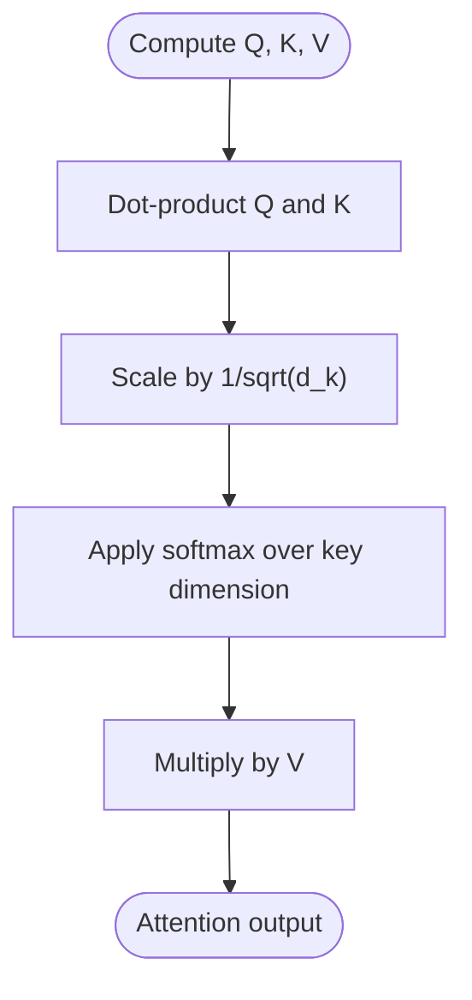
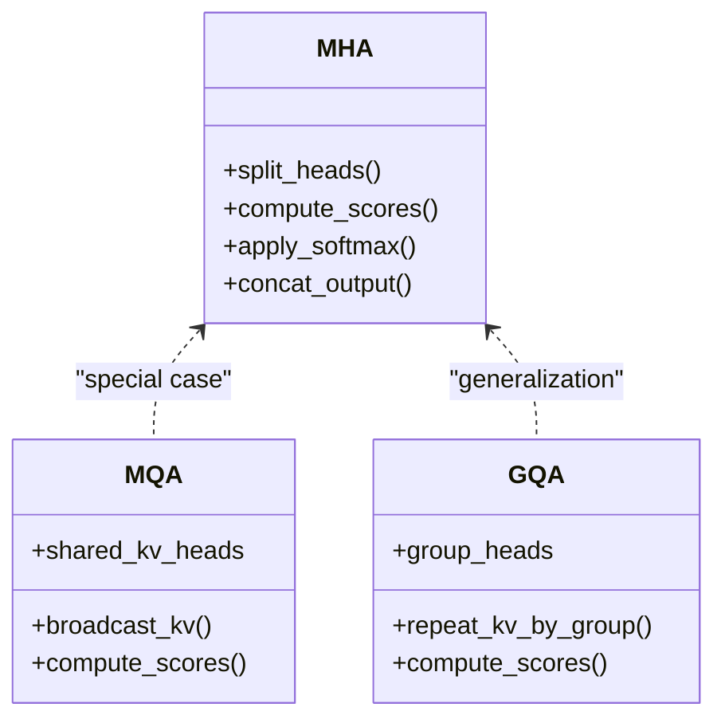
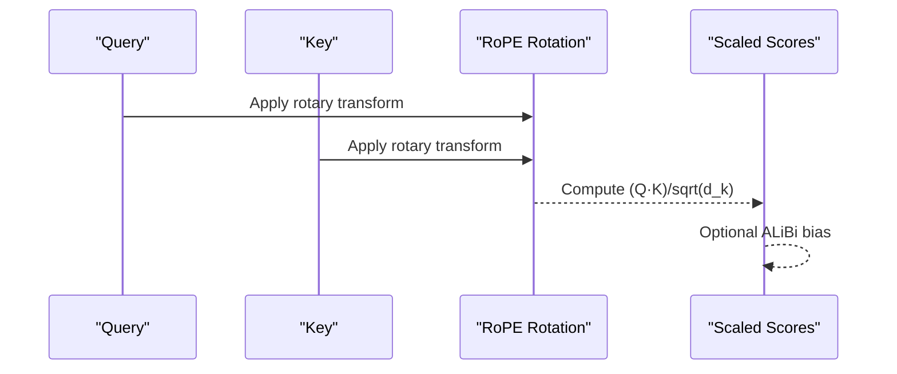
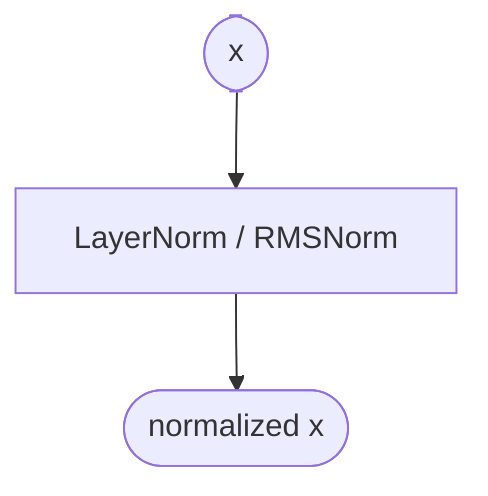
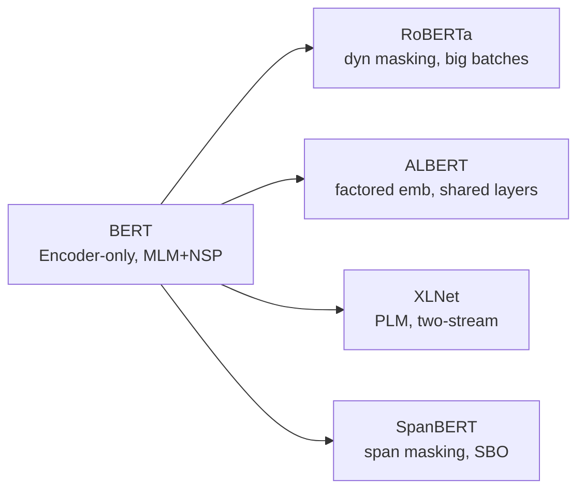
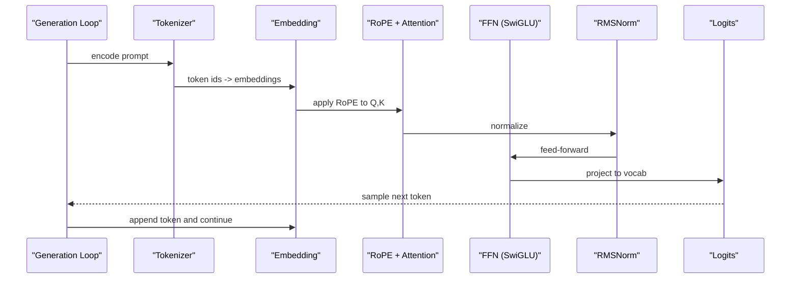
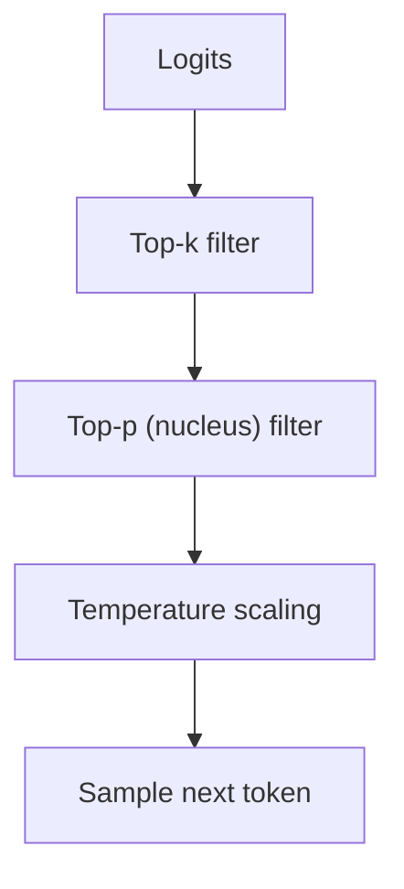
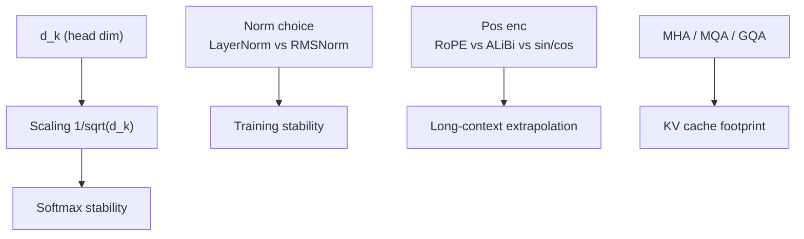

# Model Architectures

<cite>
**Referenced Files in This Document**
- [Transformer architecture details](file://02.大语言模型架构/Transformer架构细节/Transformer架构细节.md)
- [Layer normalization](file://02.大语言模型架构/2.layer_normalization/2.layer_normalization.md)
- [Positional encodings](file://02.大语言模型架构/3.位置编码/3.位置编码.md)
- [BERT details](file://02.大语言模型架构/bert细节/bert细节.md)
- [BERT variants](file://02.大语言模型架构/bert变种/bert变种.md)
- [MHA vs MQA vs GQA](file://02.大语言模型架构/MHA_MQA_GQA/MHA_MQA_GQA.md)
- [Decoding strategies (Top-k, Top-p, Temperature)](file://02.大语言模型架构/解码策略（Top-k & Top-p & Temperatu/解码策略（Top-k & Top-p & Temperature）.md)
- [Llama series](file://02.大语言模型架构/llama系列模型/llama系列模型.md)
- [Llama 2 code walkthrough](file://02.大语言模型架构/llama 2代码详解/llama 2代码详解.md)
</cite>

## Table of Contents
1. [Introduction](#introduction)
2. [Project Structure](#project-structure)
3. [Core Components](#core-components)
4. [Architecture Overview](#architecture-overview)
5. [Detailed Component Analysis](#detailed-component-analysis)
6. [Dependency Analysis](#dependency-analysis)
7. [Performance Considerations](#performance-considerations)
8. [Troubleshooting Guide](#troubleshooting-guide)
9. [Conclusion](#conclusion)
10. [Appendices](#appendices)

## Introduction
This document synthesizes the repository’s materials on advanced transformer-based language models and attention mechanisms. It explains self-attention and multi-head attention, positional encodings, layer normalization, attention scaling, and decoding strategies (Top-k, Top-p, Temperature). It also compares transformer variants, covers BERT and its variants, decoder-only architectures, and details LLaMA series implementations and optimizations. Practical guidance for model selection and optimization is included.

## Project Structure
The relevant materials are organized by topic within the “02.大语言模型架构” directory:
- Transformer fundamentals, self-attention, multi-head attention, and training/decoding specifics
- Layer normalization and normalization variants
- Positional encodings (absolute, relative, rotary, ALiBi)
- BERT architecture, tasks, and variants
- Attention variants (MHA, MQA, GQA)
- Decoding strategies (Top-k, Top-p, Temperature)
- LLaMA series (LLaMA, Llama-2, Code Llama), including code-level insights
- Additional related topics (MoE, chatglm series, llama 3)

**Section sources**
- [Transformer architecture details:1-321](file://02.大语言模型架构/Transformer架构细节/Transformer架构 detalles.md#L1-L321)
- [Layer normalization:1-193](file://02.大语言模型架构/2.layer_normalization/2.layer_normalization.md#L1-L193)
- [Positional encodings:1-397](file://02.大语言模型架构/3.位置编码/3.位置编码.md#L1-L397)
- [BERT details:1-272](file://02.大语言模型架构/bert细节/bert细节.md#L1-L272)
- [BERT variants:1-171](file://02.大语言模型架构/bert变种/bert变种.md#L1-L171)
- [MHA vs MQA vs GQA:1-225](file://02.大语言模型架构/MHA_MQA_GQA/MHA_MQA_GQA.md#L1-L225)
- [Decoding strategies (Top-k, Top-p, Temperature):1-244](file://02.大语言模型架构/解码策略（Top-k & Top-p & Temperatu/解码策略（Top-k & Top-p & Temperature）.md#L1-L244)
- [Llama series:1-292](file://02.大语言模型架构/llama系列模型/llama系列模型.md#L1-L292)
- [Llama 2 code walkthrough:1-527](file://02.大语言模型架构/llama 2代码详解/llama 2代码详解.md#L1-L527)

## Core Components
- Self-attention and scaled dot-product attention
- Multi-head attention (MHA) and variants (MQA, GQA)
- Positional encodings (absolute, sinusoidal, rotary, ALiBi)
- Layer normalization (LayerNorm, RMSNorm, pre-/post-normalization)
- Feed-forward networks and activation choices (e.g., SwiGLU)
- Decoding strategies (greedy, top-k, top-p, temperature)

**Section sources**
- [Transformer architecture details:60-321](file://02.大语言模型架构/Transformer架构细节/Transformer架构细节.md#L60-L321)
- [MHA vs MQA vs GQA:1-225](file://02.大语言模型架构/MHA_MQA_GQA/MHA_MQA_GQA.md#L1-L225)
- [Positional encodings:1-397](file://02.大语言模型架构/3.位置编码/3.位置编码.md#L1-L397)
- [Layer normalization:1-193](file://02.大语言模型架构/2.layer_normalization/2.layer_normalization.md#L1-L193)
- [Llama series:1-292](file://02.大语言模型架构/llama系列模型/llama系列模型.md#L1-L292)
- [Decoding strategies (Top-k, Top-p, Temperature):1-244](file://02.大语言模型架构/解码策略（Top-k & Top-p & Temperatu/解码策略（Top-k & Top-p & Temperature）.md#L1-L244)

## Architecture Overview
This section maps the high-level transformer building blocks and how they interlock across encoder-only, decoder-only, and hybrid designs, with emphasis on modern optimizations.

**Diagram sources**
- [Transformer architecture details:60-321](file://02.大语言模型架构/Transformer架构细节/Transformer架构细节.md#L60-L321)
- [Positional encodings:194-317](file://02.大语言模型架构/3.位置编码/3.位置编码.md#L194-L317)
- [MHA vs MQA vs GQA:1-15](file://02.大语言模型架构/MHA_MQA_GQA/MHA_MQA_GQA.md#L1-L15)
- [Layer normalization:171-193](file://02.大语言模型架构/2.layer_normalization/2.layer_normalization.md#L171-L193)

**Section sources**
- [Transformer architecture details:1-321](file://02.大语言模型架构/Transformer架构细节/Transformer架构细节.md#L1-L321)
- [Positional encodings:1-397](file://02.大语言模型架构/3.位置编码/3.位置编码.md#L1-L397)
- [MHA vs MQA vs GQA:1-225](file://02.大语言模型架构/MHA_MQA_GQA/MHA_MQA_GQA.md#L1-L225)
- [Layer normalization:1-193](file://02.大语言模型架构/2.layer_normalization/2.layer_normalization.md#L1-L193)

## Detailed Component Analysis

### Self-Attention and Scaled Dot-Product
- Self-attention computes per-token relations via query-key similarities, enabling long-range dependencies.
- Scaling by inverse square root of dimension stabilizes softmax and gradients.
- Training-time softmax gradient saturation is mitigated by scaling to maintain stable activations.

**Diagram sources**
- [Transformer architecture details:84-244](file://02.大语言模型架构/Transformer架构细节/Transformer架构细节.md#L84-L244)

**Section sources**
- [Transformer architecture details:60-244](file://02.大语言模型架构/Transformer架构细节/Transformer架构细节.md#L60-L244)

### Multi-Head Attention (MHA), Multi-Query Attention (MQA), Grouped Query Attention (GQA)
- MHA splits embedding into multiple heads, computes separate attention heads, concatenates, and projects.
- MQA shares a single KV pair across all heads, reducing KV cache footprint.
- GQA groups query heads and assigns shared KV per group, trading off accuracy for efficiency.

**Diagram sources**
- [MHA vs MQA vs GQA:15-225](file://02.大语言模型架构/MHA_MQA_GQA/MHA_MQA_GQA.md#L15-L225)

**Section sources**
- [MHA vs MQA vs GQA:1-225](file://02.大语言模型架构/MHA_MQA_GQA/MHA_MQA_GQA.md#L1-L225)

### Positional Encodings
- Absolute encodings (sinusoidal) inject explicit absolute positions; RoPE injects absolute positions into Q/K via rotation; ALiBi injects learned biases into attention scores.
- RoPE enables extrapolation-like behavior and efficient rotary transforms; ALiBi improves long-context generalization without extra PE parameters.

**Diagram sources**
- [Positional encodings:194-317](file://02.大语言模型架构/3.位置编码/3.位置编码.md#L194-L317)
- [Llama 2 code walkthrough:206-331](file://02.大语言模型架构/llama 2代码详解/llama 2代码详解.md#L206-L331)

**Section sources**
- [Positional encodings:1-397](file://02.大语言模型架构/3.位置编码/3.位置编码.md#L1-L397)
- [Llama 2 code walkthrough:206-331](file://02.大语言模型架构/llama 2代码详解/llama 2代码详解.md#L206-L331)

### Layer Normalization and Stability
- LayerNorm normalizes across feature dimensions; RMSNorm omits mean centering and adds a scale parameter.
- Pre-normalization (before sublayers) improves training stability in deep transformers.
- DeepNorm adjusts residual scales to bound gradient growth.

**Diagram sources**
- [Layer normalization:171-193](file://02.大语言模型架构/2.layer_normalization/2.layer_normalization.md#L171-L193)

**Section sources**
- [Layer normalization:1-193](file://02.大语言模型架构/2.layer_normalization/2.layer_normalization.md#L1-L193)
- [Llama series:15-71](file://02.大语言模型架构/llama系列模型/llama系列模型.md#L15-L71)

### Feed-Forward Networks and Activations
- FFNs commonly use gated, non-linear activations (e.g., SwiGLU) to improve representational power.
- Hidden width often scaled to multiples of a group size for hardware efficiency.

**Section sources**
- [Llama series:48-71](file://02.大语言模型架构/llama系列模型/llama系列模型.md#L48-L71)
- [Llama 2 code walkthrough:483-514](file://02.大语言模型架构/llama 2代码详解/llama 2代码详解.md#L483-L514)

### BERT and Variants
- BERT uses a bidirectional encoder-only Transformer with masked language modeling and next-sentence prediction.
- Variants include RoBERTa (larger batches, dynamic masking, removed NSP), ALBERT (embedding factorization, cross-layer parameter sharing), XLNet (permutation language modeling, two-stream attention), SpanBERT (span-level masking, SBO loss).

**Diagram sources**
- [BERT details:1-272](file://02.大语言模型架构/bert细节/bert细节.md#L1-L272)
- [BERT variants:1-171](file://02.大语言模型架构/bert变种/bert变种.md#L1-L171)

**Section sources**
- [BERT details:1-272](file://02.大语言模型架构/bert细节/bert细节.md#L1-L272)
- [BERT variants:1-171](file://02.大语言模型架构/bert变种/bert变种.md#L1-L171)

### Decoder-Only Architectures and LLaMA Series
- Decoder-only models (e.g., GPT, LLaMA) rely on causal masking during self-attention.
- LLaMA introduces pre-normalization, RMSNorm, SwiGLU, and RoPE.
- Llama-2 adds GQA for KV cache reduction, larger context windows, and expanded FFN widths.

**Diagram sources**
- [Llama 2 code walkthrough:108-158](file://02.大语言模型架构/llama 2代码详解/llama 2代码详解.md#L108-L158)
- [Llama series:1-292](file://02.大语言模型架构/llama系列模型/llama系列模型.md#L1-L292)

**Section sources**
- [Llama series:1-292](file://02.大语言模型架构/llama系列模型/llama系列模型.md#L1-L292)
- [Llama 2 code walkthrough:108-158](file://02.大语言模型架构/llama 2代码详解/llama 2代码详解.md#L108-L158)

### Decoding Strategies: Top-k, Top-p, Temperature
- Greedy decoding selects the highest-probability token; random sampling draws from the full distribution.
- Top-k truncates to the k highest logits; Top-p (nucleus) selects the minimal set whose cumulative probability exceeds p.
- Temperature rescales logits before softmax to increase or decrease randomness.
- Combined strategies: top-k → top-p → temperature.

**Diagram sources**
- [Decoding strategies (Top-k, Top-p, Temperature):38-244](file://02.大语言模型架构/解码策略（Top-k & Top-p & Temperatu/解码策略（Top-k & Top-p & Temperature）.md#L38-L244)

**Section sources**
- [Decoding strategies (Top-k, Top-p, Temperature):1-244](file://02.大语言模型架构/解码策略（Top-k & Top-p & Temperatu/解码策略（Top-k & Top-p & Temperature）.md#L1-L244)

## Dependency Analysis
- Attention scaling depends on head dimension; softmax stability requires scaling by 1/sqrt(d_k).
- Normalization choice affects training dynamics; RMSNorm is used in LLaMA-style decoders.
- Positional encoding choice impacts extrapolation and long-context generalization.
- Attention variants trade off KV cache size and accuracy; GQA balances MHA and MQA.

**Diagram sources**
- [Transformer architecture details:84-244](file://02.大语言模型架构/Transformer架构细节/Transformer架构细节.md#L84-L244)
- [Layer normalization:171-193](file://02.大语言模型架构/2.layer_normalization/2.layer_normalization.md#L171-L193)
- [Positional encodings:194-317](file://02.大语言模型架构/3.位置编码/3.位置编码.md#L194-L317)
- [MHA vs MQA vs GQA:1-15](file://02.大语言模型架构/MHA_MQA_GQA/MHA_MQA_GQA.md#L1-L15)

**Section sources**
- [Transformer architecture details:84-244](file://02.大语言模型架构/Transformer架构细节/Transformer架构细节.md#L84-L244)
- [Layer normalization:171-193](file://02.大语言模型架构/2.layer_normalization/2.layer_normalization.md#L171-L193)
- [Positional encodings:194-317](file://02.大语言模型架构/3.位置编码/3.位置编码.md#L194-L317)
- [MHA vs MQA vs GQA:1-15](file://02.大语言模型架构/MHA_MQA_GQA/MHA_MQA_GQA.md#L1-L15)

## Performance Considerations
- Attention scaling prevents softmax saturation and accelerates convergence.
- RMSNorm reduces computational overhead compared to LayerNorm while maintaining stability.
- RoPE avoids explicit PE tables and supports extrapolation-like behavior.
- GQA reduces KV cache memory and improves throughput with minimal accuracy drop.
- Decoding hyperparameters (top-k, top-p, temperature) trade off coherence and diversity.

[No sources needed since this section provides general guidance]

## Troubleshooting Guide
- If softmax collapses or gradients vanish, verify attention scaling by 1/sqrt(d_k).
- If training becomes unstable, consider pre-normalization and RMSNorm.
- If long-context performance degrades, evaluate RoPE vs ALiBi and consider GQA for KV cache constraints.
- If decoding is repetitive or dull, adjust top-k, top-p, and temperature to balance diversity and coherence.

**Section sources**
- [Transformer architecture details:84-244](file://02.大语言模型架构/Transformer架构细节/Transformer架构细节.md#L84-L244)
- [Layer normalization:171-193](file://02.大语言模型架构/2.layer_normalization/2.layer_normalization.md#L171-L193)
- [Positional encodings:194-317](file://02.大语言模型架构/3.位置编码/3.位置编码.md#L194-L317)
- [Decoding strategies (Top-k, Top-p, Temperature):38-244](file://02.大语言模型架构/解码策略（Top-k & Top-p & Temperatu/解码策略（Top-k & Top-p & Temperature）.md#L38-L244)

## Conclusion
This document consolidated the repository’s materials on transformer architectures, attention mechanisms, positional encodings, normalization, and decoding strategies. It highlighted modern optimizations such as RoPE, RMSNorm, GQA, and SwiGLU, and provided practical guidance for selecting and tuning models across encoder-only (BERT), decoder-only (GPT/LLaMA), and hybrid designs.

[No sources needed since this section summarizes without analyzing specific files]

## Appendices

### A. Architectural Comparisons
- BERT: encoder-only, masked modeling, bidirectional context
- GPT-style: decoder-only, autoregressive, causal masking
- LLaMA: decoder-only with pre-LN, RMSNorm, SwiGLU, RoPE
- XLNet: permutation language modeling, two-stream attention
- ALBERT: factorized embeddings, cross-layer sharing

**Section sources**
- [BERT details:1-272](file://02.大语言模型架构/bert细节/bert细节.md#L1-L272)
- [BERT variants:1-171](file://02.大语言模型架构/bert变种/bert变种.md#L1-L171)
- [Llama series:1-292](file://02.大语言模型架构/llama系列模型/llama系列模型.md#L1-L292)

### B. Implementation Notes
- Use RoPE for rotary positional encodings in decoder-only models.
- Prefer GQA for KV cache efficiency in long-context generation.
- Tune decoding parameters (top-k, top-p, temperature) per task requirements.

**Section sources**
- [Positional encodings:194-317](file://02.大语言模型架构/3.位置编码/3.位置编码.md#L194-L317)
- [MHA vs MQA vs GQA:1-15](file://02.大语言模型架构/MHA_MQA_GQA/MHA_MQA_GQA.md#L1-L15)
- [Decoding strategies (Top-k, Top-p, Temperature):38-244](file://02.大语言模型架构/解码策略（Top-k & Top-p & Temperatu/解码策略（Top-k & Top-p & Temperature）.md#L38-L244)