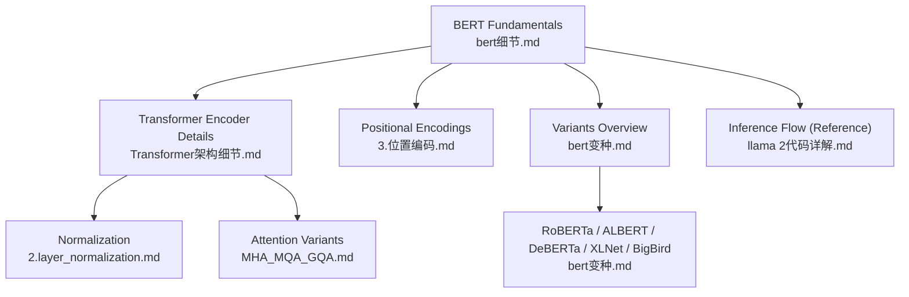
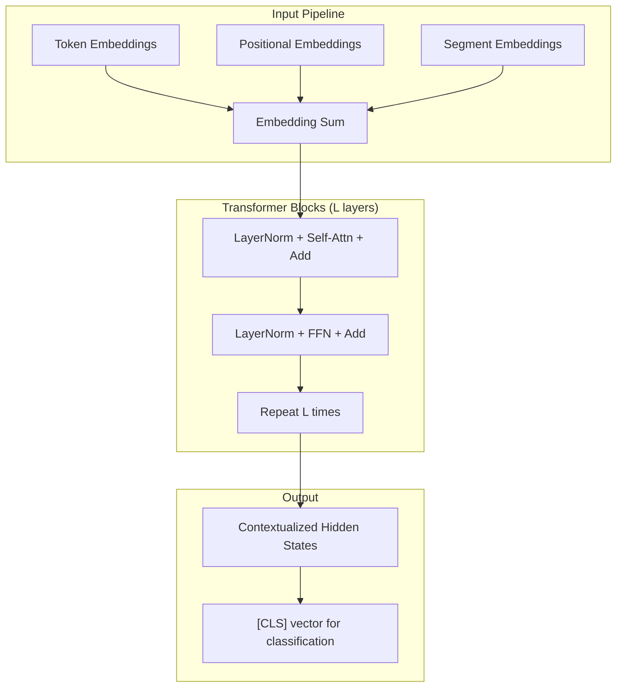
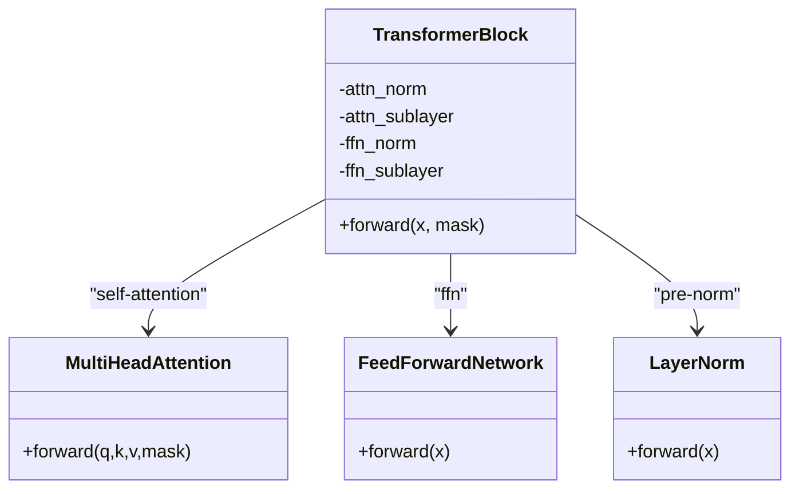
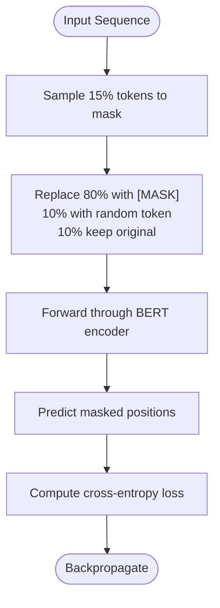
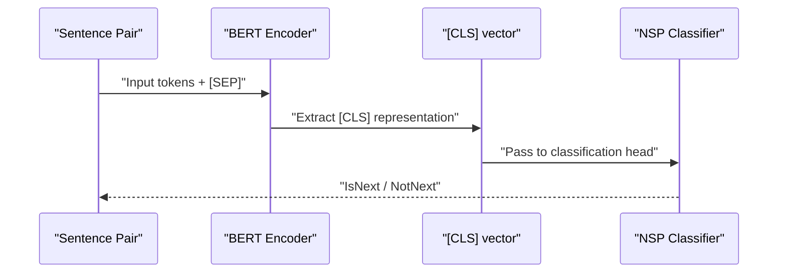
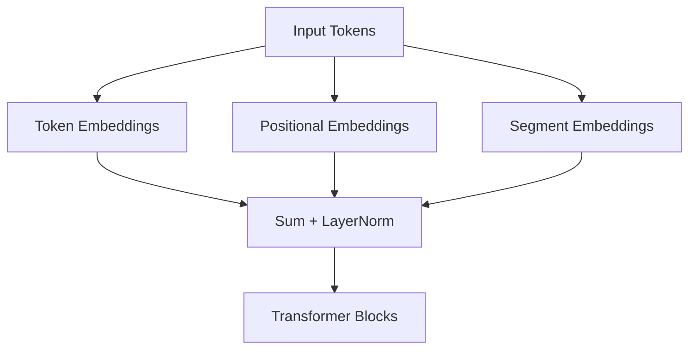
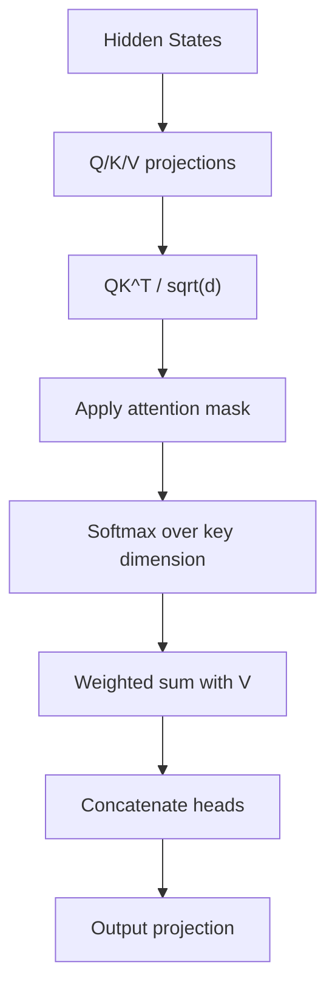
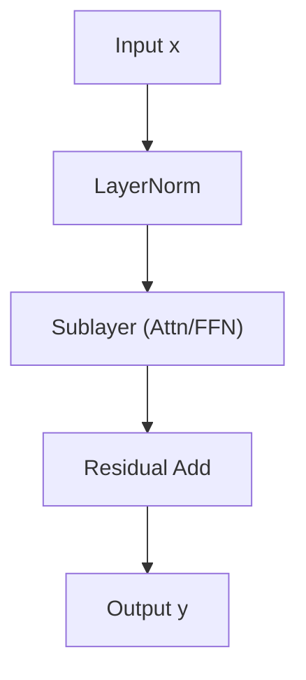
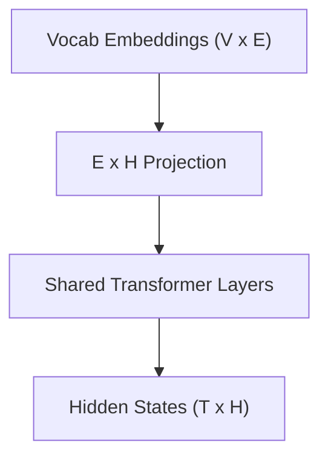

# BERT Architecture and Variants

<cite>
**Referenced Files in This Document**
- [bert细节.md](file://02.大语言模型架构/bert细节/bert细节.md)
- [bert变种.md](file://02.大语言模型架构/bert变种/bert变种.md)
- [Transformer架构细节.md](file://02.大语言模型架构/Transformer架构细节/Transformer架构细节.md)
- [3.位置编码.md](file://02.大语言模型架构/3.位置编码/3.位置编码.md)
- [2.layer_normalization.md](file://02.大语言模型架构/2.layer_normalization/2.layer_normalization.md)
- [BN VS LN.md](file://02.大语言模型架构/1.attention/BN VS LN.md)
- [MHA_MQA_GQA.md](file://02.大语言模型架构/MHA_MQA_GQA/MHA_MQA_GQA.md)
- [llama 2代码详解.md](file://02.大语言模型架构/llama 2代码详解/llama 2代码详解.md)
</cite>

## Table of Contents
1. [Introduction](#introduction)
2. [Project Structure](#project-structure)
3. [Core Components](#core-components)
4. [Architecture Overview](#architecture-overview)
5. [Detailed Component Analysis](#detailed-component-analysis)
6. [Dependency Analysis](#dependency-analysis)
7. [Performance Considerations](#performance-considerations)
8. [Troubleshooting Guide](#troubleshooting-guide)
9. [Conclusion](#conclusion)
10. [Appendices](#appendices)

## Introduction
This document explains the BERT architecture and its major variants, focusing on the bidirectional encoder design, pre-training objectives (masked language modeling and next sentence prediction), positional embeddings, and core transformer building blocks. It also covers variant improvements such as ALBERT (factorized embedding parameterization), RoBERTa (optimized training), DeBERTa (disentangled attention), ELECTRA (replacement token detection), and BigBird (sparse attention). We analyze computational efficiency, trade-offs, and practical guidance for selecting variants by downstream task and deployment scenario.

## Project Structure
The repository organizes relevant materials under a dedicated “Large Language Model Architecture” section, including:
- BERT fundamentals and training objectives
- Transformer encoder details and normalization
- Positional encoding strategies
- Variant analyses (RoBERTa, ALBERT, DeBERTa, XLNet, BigBird)
- Related attention variants (MHA/MQA/GQA)
- Practical inference code references

**Diagram sources**
- [bert细节.md:1-272](file://02.大语言模型架构/bert细节/bert细节.md#L1-L272)
- [Transformer架构细节.md:1-321](file://02.大语言模型架构/Transformer架构细节/Transformer架构细节.md#L1-L321)
- [3.位置编码.md:1-397](file://02.大语言模型架构/3.位置编码/3.位置编码.md#L1-L397)
- [bert变种.md:1-171](file://02.大语言模型架构/bert变种/bert变种.md#L1-L171)
- [2.layer_normalization.md:1-193](file://02.大语言模型架构/2.layer_normalization/2.layer_normalization.md#L1-L193)
- [MHA_MQA_GQA.md:31-225](file://02.大语言模型架构/MHA_MQA_GQA/MHA_MQA_GQA.md#L31-L225)
- [llama 2代码详解.md:108-158](file://02.大语言模型架构/llama 2代码详解/llama 2代码详解.md#L108-L158)

**Section sources**
- [bert细节.md:1-272](file://02.大语言模型架构/bert细节/bert细节.md#L1-L272)
- [bert变种.md:1-171](file://02.大语言模型架构/bert变种/bert变种.md#L1-L171)
- [Transformer架构细节.md:1-321](file://02.大语言模型架构/Transformer架构细节/Transformer架构_details.md#L1-L321)
- [3.位置编码.md:1-397](file://02.大语言模型架构/3.位置编码/3.位置编码.md#L1-L397)
- [2.layer_normalization.md:1-193](file://02.大语言模型架构/2.layer_normalization/2.layer_normalization.md#L1-L193)
- [MHA_MQA_GQA.md:31-225](file://02.大语言模型架构/MHA_MQA_GQA/MHA_MQA_GQA.md#L31-L225)
- [llama 2代码详解.md:108-158](file://02.大语言模型架构/llama 2代码详解/llama 2代码详解.md#L108-L158)

## Core Components
- Bidirectional encoder-only Transformer backbone
- Pre-training objectives: masked language modeling (MLM) and next sentence prediction (NSP)
- Input embeddings: token, positional, and segment embeddings
- Transformer sublayers: multi-head self-attention, feed-forward network, residual connections, and layer normalization
- Attention scaling and softmax stability
- Feed-forward nonlinearity and residual pathways

**Section sources**
- [bert细节.md:73-104](file://02.大语言模型架构/bert细节/bert细节.md#L73-L104)
- [bert细节.md:220-244](file://02.大语言模型架构/bert细节/bert细节.md#L220-L244)
- [Transformer架构细节.md:6-31](file://02.大语言模型架构/Transformer架构细节/Transformer架构细节.md#L6-L31)
- [2.layer_normalization.md:37-72](file://02.大语言模型架构/2.layer_normalization/2.layer_normalization.md#L37-L72)
- [3.位置编码.md:10-42](file://02.大语言模型架构/3.位置编码/3.位置编码.md#L10-L42)

## Architecture Overview
BERT’s encoder-only architecture integrates token, positional, and segment embeddings, feeds them through stacked transformer blocks, and produces contextualized token representations. The model is trained jointly on masked language modeling and next sentence prediction.

**Diagram sources**
- [bert细节.md:92-104](file://02.大语言模型架构/bert细节/bert细节.md#L92-L104)
- [Transformer架构细节.md:24-31](file://02.大语言模型架构/Transformer架构细节/Transformer架构细节.md#L24-L31)
- [2.layer_normalization.md:37-72](file://02.大语言模型架构/2.layer_normalization/2.layer_normalization.md#L37-L72)

**Section sources**
- [bert细节.md:92-104](file://02.大语言模型架构/bert细节/bert细节.md#L92-L104)
- [Transformer架构细节.md:24-31](file://02.大语言模型架构/Transformer架构细节/Transformer架构细节.md#L24-L31)
- [2.layer_normalization.md:37-72](file://02.大语言模型架构/2.layer_normalization/2.layer_normalization.md#L37-L72)

## Detailed Component Analysis

### Bidirectional Transformer Encoder
- BERT uses only the encoder stack of the Transformer, enabling true bidirectionality by attending to the entire sequence in parallel.
- Encoder blocks consist of multi-head self-attention and feed-forward sublayers with residual connections and pre-layer normalization.

**Diagram sources**
- [Transformer架构细节.md:6-31](file://02.大语言模型架构/Transformer架构细节/Transformer架构细节.md#L6-L31)
- [2.layer_normalization.md:37-72](file://02.大语言模型架构/2.layer_normalization/2.layer_normalization.md#L37-L72)

**Section sources**
- [Transformer架构细节.md:6-31](file://02.大语言模型架构/Transformer架构细节/Transformer架构细节.md#L6-L31)
- [2.layer_normalization.md:37-72](file://02.大语言模型架构/2.layer_normalization/2.layer_normalization.md#L37-L72)

### Masked Language Modeling (MLM)
- 15% of tokens are randomly masked per sequence; 80% replaced with [MASK], 10% replaced with random token, 10% kept unchanged.
- Predictions are made only on masked positions; loss is cross-entropy over vocabulary.

**Diagram sources**
- [bert细节.md:75-91](file://02.大语言模型架构/bert细节/bert细节.md#L75-L91)
- [bert细节.md:220-244](file://02.大语言模型架构/bert细节/bert细节.md#L220-L244)

**Section sources**
- [bert细节.md:75-91](file://02.大语言模型架构/bert细节/bert细节.md#L75-L91)
- [bert细节.md:220-244](file://02.大语言模型架构/bert细节/bert细节.md#L220-L244)

### Next Sentence Prediction (NSP)
- Pairs of sentences are fed; model predicts whether the second follows the first.
- BERT uses [CLS] token to represent sentence pair for classification.

**Diagram sources**
- [bert细节.md:85-91](file://02.大语言模型架构/bert细节/bert细节.md#L85-L91)
- [bert细节.md:102-104](file://02.大语言模型架构/bert细节/bert细节.md#L102-L104)

**Section sources**
- [bert细节.md:85-91](file://02.大语言模型架构/bert细节/bert细节.md#L85-L91)
- [bert细节.md:102-104](file://02.大语言模型架构/bert细节/bert细节.md#L102-L104)

### Positional Embeddings
- BERT trains positional embeddings; alternatives include sinusoidal encodings and relative encodings.
- DeBERTa explores disentangled attention by separating absolute and relative positional influences.

**Diagram sources**
- [bert细节.md:92-98](file://02.大语言模型架构/bert细节/bert细节.md#L92-L98)
- [3.位置编码.md:10-42](file://02.大语言模型架构/3.位置编码/3.位置编码.md#L10-L42)
- [3.位置编码.md:128-141](file://02.大语言模型架构/3.位置编码/3.位置编码.md#L128-L141)

**Section sources**
- [bert细节.md:92-98](file://02.大语言模型架构/bert细节/bert细节.md#L92-L98)
- [3.位置编码.md:10-42](file://02.大语言模型架构/3.位置编码/3.位置编码.md#L10-L42)
- [3.位置编码.md:128-141](file://02.大语言模型架构/3.位置编码/3.位置编码.md#L128-L141)

### Self-Attention Mechanism
- Scaled dot-product attention with query-key-value decomposition; softmax normalization ensures stable gradients.
- Multi-head attention splits embedding dimension across heads; outputs concatenated and projected.

**Diagram sources**
- [Transformer架构细节.md:60-120](file://02.大语言模型架构/Transformer架构细节/Transformer架构细节.md#L60-L120)
- [MHA_MQA_GQA.md:31-87](file://02.大语言模型架构/MHA_MQA_GQA/MHA_MQA_GQA.md#L31-L87)

**Section sources**
- [Transformer架构细节.md:60-120](file://02.大语言模型架构/Transformer架构细节/Transformer架构细节.md#L60-L120)
- [MHA_MQA_GQA.md:31-87](file://02.大语言模型架构/MHA_MQA_GQA/MHA_MQA_GQA.md#L31-L87)

### Layer Normalization and Residual Connections
- Pre-normalization (LN before sublayer) improves training stability for deep transformers.
- LN avoids dependence on batch statistics, suited for variable-length sequences.

**Diagram sources**
- [2.layer_normalization.md:37-72](file://02.大语言模型架构/2.layer_normalization/2.layer_normalization.md#L37-L72)
- [BN VS LN.md:81-107](file://02.大语言模型架构/1.attention/BN VS LN.md#L81-L107)

**Section sources**
- [2.layer_normalization.md:37-72](file://02.大语言模型架构/2.layer_normalization/2.layer_normalization.md#L37-L72)
- [BN VS LN.md:81-107](file://02.大语言模型架构/1.attention/BN VS LN.md#L81-L107)

### Feed-Forward Networks
- Typically two linear layers with activation; increases representational capacity per token.

**Section sources**
- [Transformer架构细节.md:12-14](file://02.大语言模型架构/Transformer架构细节/Transformer架构细节.md#L12-L14)

### BERT Variants

#### RoBERTa
- Larger batch sizes, longer sequences, dynamic masking, and removal of NSP improve performance.
- Uses GPT-2-style BPE tokenization.

**Section sources**
- [bert变种.md:3-20](file://02.大语言模型架构/bert变种/bert变种.md#L3-L20)

#### ALBERT
- Factorized embedding parameterization: separate E << H with an intermediate E×H projection.
- Cross-layer parameter sharing: reuse a single transformer layer across depths.
- Sentence order prediction (SOP) replaces NSP.

**Diagram sources**
- [bert变种.md:22-55](file://02.大语言模型架构/bert变种/bert变种.md#L22-L55)

**Section sources**
- [bert变种.md:22-55](file://02.大语言模型架构/bert变种/bert变种.md#L22-L55)

#### DeBERTa
- Disentangled attention: separate absolute and relative positional influences.
- Relaxes the need for explicit absolute position encodings in earlier layers.

**Section sources**
- [bert变种.md:128-141](file://02.大语言模型架构/bert变种/bert变种.md#L128-L141)
- [3.位置编码.md:128-141](file://02.大语言模型架构/3.位置编码/3.位置编码.md#L128-L141)

#### ELECTRA
- Pretraining via replacement token detection: generator produces replacements, discriminator learns to detect them.
- Reduces compute compared to whole-word masking while maintaining quality.

**Section sources**
- [bert变种.md:1-171](file://02.大语言模型架构/bert变种/bert变种.md#L1-L171)

#### BigBird
- Sparse attention designed for long sequences; reduces quadratic complexity.
- Enables efficient modeling of documents with thousands of tokens.

**Section sources**
- [bert变种.md:1-171](file://02.大语言模型架构/bert变种/bert变种.md#L1-L171)

### Architectural Improvements and Trade-offs
- Parameter efficiency: ALBERT factorized embeddings and cross-layer sharing reduce memory footprint.
- Training efficiency: RoBERTa dynamic masking and larger batches improve data utilization.
- Long-context: BigBird sparse attention scales beyond fixed-length contexts.
- Positional modeling: DeBERTa disentangles absolute and relative positions for stronger generalization.

**Section sources**
- [bert变种.md:22-55](file://02.大语言模型架构/bert变种/bert变种.md#L22-L55)
- [bert变种.md:3-20](file://02.大语言模型架构/bert变种/bert变种.md#L3-L20)
- [3.位置编码.md:128-141](file://02.大语言模型架构/3.位置编码/3.位置编码.md#L128-L141)

### Code-Level Guidance
- Transformer block implementation: multi-head attention with residual and normalization.
- Attention computation: Q/K/V projections, scaled scores, softmax, weighted sum, concatenation.
- Model initialization: embedding tables, positional embeddings, and shared transformer layers.

References to code-like patterns:
- Multi-head attention implementation outline: [MHA_MQA_GQA.md:31-87](file://02.大语言模型架构/MHA_MQA_GQA/MHA_MQA_GQA.md#L31-L87)
- Attention variants (MHA/MQA/GQA): [MHA_MQA_GQA.md:89-225](file://02.大语言模型架构/MHA_MQA_GQA/MHA_MQA_GQA.md#L89-L225)
- Inference loop structure (for context on tokenization and generation): [llama 2代码详解.md:108-158](file://02.大语言模型架构/llama 2代码详解/llama 2代码详解.md#L108-L158)

**Section sources**
- [MHA_MQA_GQA.md:31-87](file://02.大语言模型架构/MHA_MQA_GQA/MHA_MQA_GQA.md#L31-L87)
- [MHA_MQA_GQA.md:89-225](file://02.大语言模型架构/MHA_MQA_GQA/MHA_MQA_GQA.md#L89-L225)
- [llama 2代码详解.md:108-158](file://02.大语言模型架构/llama 2代码详解/llama 2代码详解.md#L108-L158)

## Dependency Analysis
BERT’s training pipeline depends on:
- Tokenization and masking strategy (MLM)
- Next sentence labeling (NSP)
- Positional encoding scheme
- Transformer sublayer composition (attention, FFN, normalization)
- Downstream task heads (classification, span labeling, etc.)

**Diagram sources**
- [bert细节.md:75-91](file://02.大语言模型架构/bert detalles/bert_detalle.md#L75-L91)
- [bert变种.md:3-20](file://02.大语言模型架构/bert变种/bert变种.md#L3-L20)

**Section sources**
- [bert_detalle.md:75-91](file://02.大语言模型架构/bert detalles/bert_detalle.md#L75-L91)
- [bert变种.md:3-20](file://02.大语言模型架构/bert变种/bert变种.md#L3-L20)

## Performance Considerations
- Computational complexity: standard attention is O(T^2·H); variants like BigBird reduce to O(T·H·log T) or O(T·H·sqrt(T)).
- Memory footprint: ALBERT reduces embedding and cross-layer parameters.
- Training throughput: RoBERTa’s larger batches and dynamic masking increase data efficiency.
- Long-context: BigBird enables scalable modeling of long documents.

[No sources needed since this section provides general guidance]

## Troubleshooting Guide
Common issues and mitigations:
- Masking imbalance: ensure balanced 80/10/10 split for robust context learning.
- NSP vs SOP: remove NSP for improved performance; use SOP when sentence order matters.
- Positional encoding choice: trainable positional embeddings for BERT; consider relative encodings for long-range tasks.
- Normalization: prefer pre-LN for deep training stability; monitor gradient flow.

**Section sources**
- [bert_detalle.md:75-91](file://02.大语言模型架构/bert detalles/bert_detalle.md#L75-L91)
- [bert变种.md:3-20](file://02.大语言模型架构/bert变种/bert变种.md#L3-L20)
- [3.位置编码.md:10-42](file://02.大语言模型架构/3.位置编码/3.位置编码.md#L10-L42)
- [2.layer_normalization.md:37-72](file://02.大语言模型架构/2.layer_normalization/2.layer_normalization.md#L37-L72)

## Conclusion
BERT’s bidirectional encoder with joint pre-training objectives established strong baselines for NLP. Variants refine efficiency and effectiveness: RoBERTa optimizes training, ALBERT reduces parameters, DeBERTa improves positional modeling, ELECTRA accelerates pretraining, and BigBird scales attention to long sequences. Choose variants based on task requirements, compute budgets, and sequence lengths.

[No sources needed since this section summarizes without analyzing specific files]

## Appendices

### Choosing a Variant
- High-resource, general-purpose: RoBERTa or DeBERTa
- Parameter-constrained deployments: ALBERT
- Long documents: BigBird
- Replacement detection tasks: ELECTRA
- Sentence-order-sensitive tasks: SOP-based models

[No sources needed since this section provides general guidance]