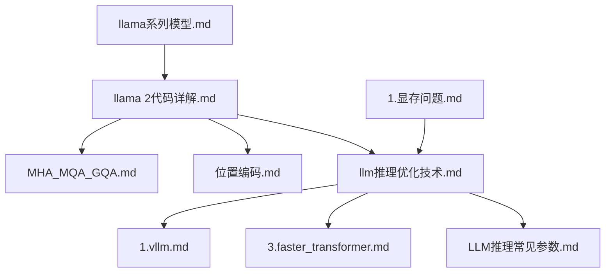
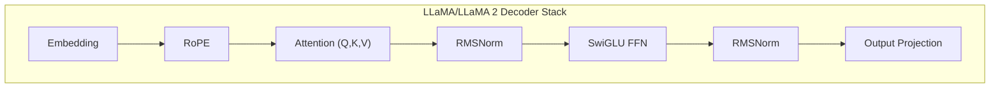
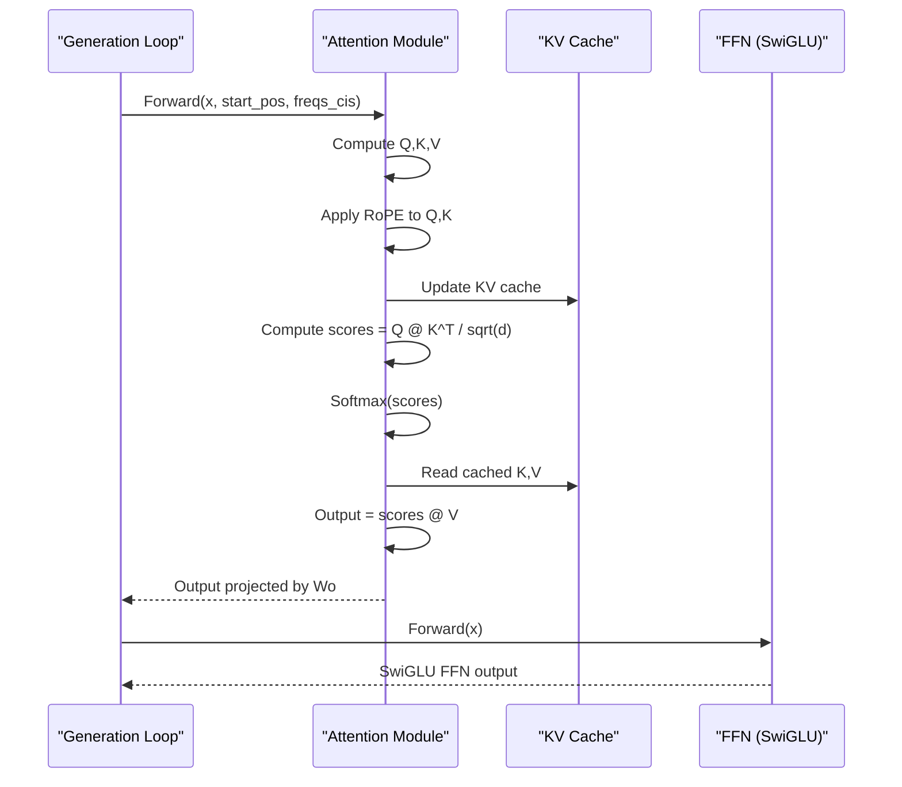
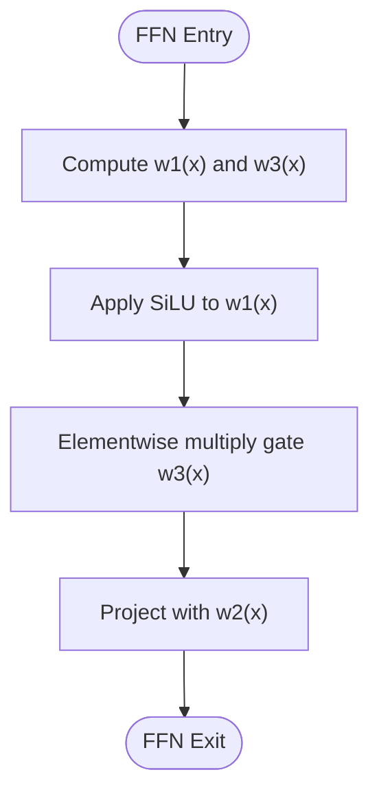
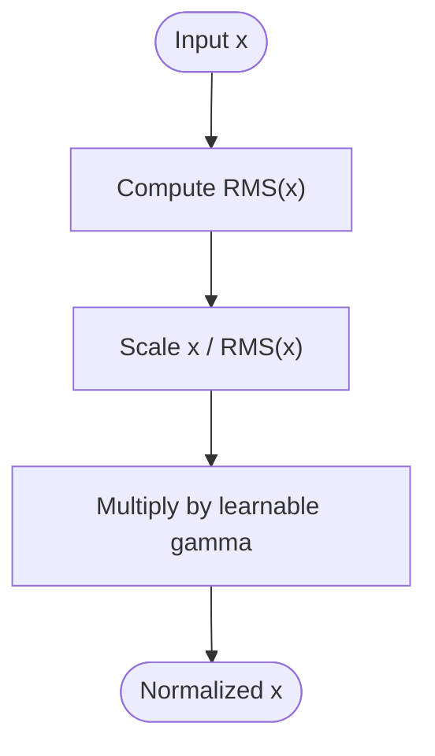
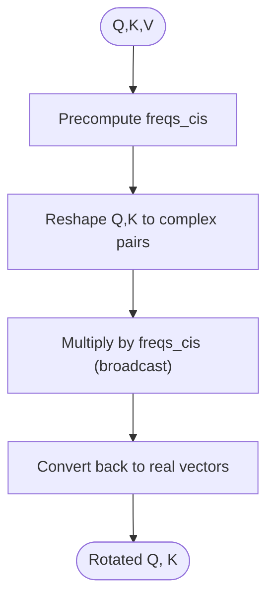
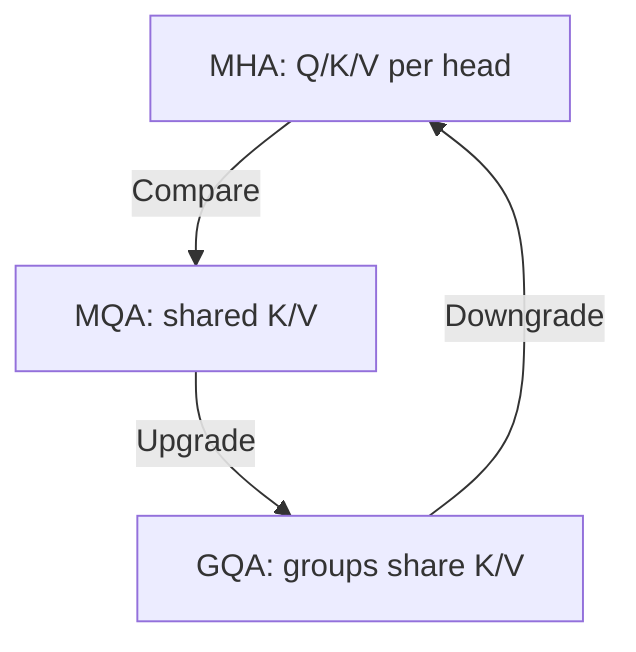
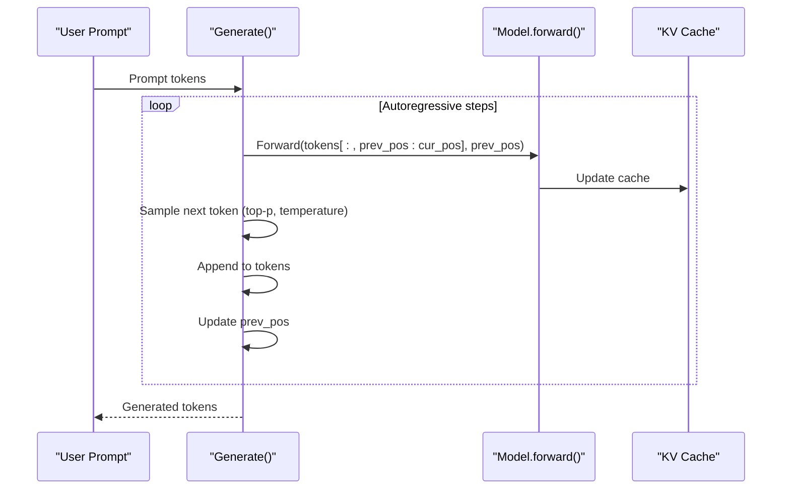
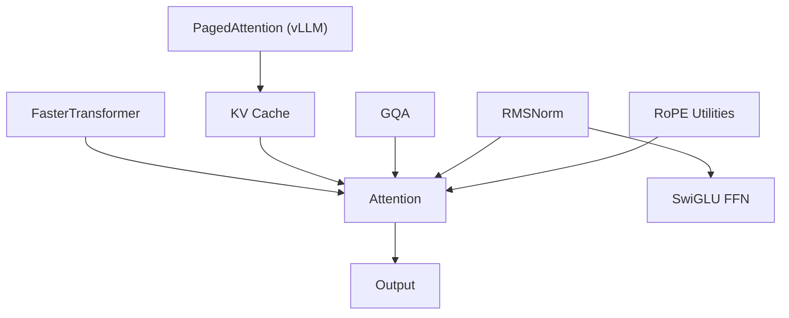

# LLaMA Series Implementations

<cite>
**Referenced Files in This Document**
- [llama系列模型.md](file://02.大语言模型架构/llama系列模型/llama系列模型.md)
- [llama 2代码详解.md](file://02.大语言模型架构/llama 2代码详解/llama 2代码详解.md)
- [MHA_MQA_GQA.md](file://02.大语言模型架构/MHA_MQA_GQA/MHA_MQA_GQA.md)
- [位置编码.md](file://02.大语言模型架构/1.attention/位置编码.md)
- [llm推理优化技术.md](file://06.推理/llm推理优化技术/llm推理优化技术.md)
- [1.vllm.md](file://06.推理/1.vllm/1.vllm.md)
- [3.faster_transformer.md](file://06.推理/3.faster_transformer/3.faster_transformer.md)
- [LLM推理常见参数.md](file://06.推理/LLM推理常见参数/LLM推理常见参数.md)
- [1.显存问题.md](file://04.分布式训练/1.显存问题/1.显存问题.md)
- [llm推理优化技术.md](file://06.推理/llm推理优化技术/llm推理优化技术.md)
- [llama2微调.md](file://05.有监督微调/llama2微调/llama2微调.md)
</cite>

## Table of Contents
1. [Introduction](#introduction)
2. [Project Structure](#project-structure)
3. [Core Components](#core-components)
4. [Architecture Overview](#architecture-overview)
5. [Detailed Component Analysis](#detailed-component-analysis)
6. [Dependency Analysis](#dependency-analysis)
7. [Performance Considerations](#performance-considerations)
8. [Troubleshooting Guide](#troubleshooting-guide)
9. [Conclusion](#conclusion)
10. [Appendices](#appendices)

## Introduction
This document provides a comprehensive, code-backed guide to LLaMA series model implementations, focusing on the original LLaMA architecture and its improvements in LLaMA 2. It explains core innovations such as rotary positional embeddings (RoPE), SwiGLU activation, RMSNorm normalization, attention scaling, and the attention mechanism variants (MHA, MQA, GQA). It also covers architectural enhancements in LLaMA 2, including expanded vocabulary, extended context length, and optimized attention mechanisms. The document includes detailed analysis of transformer blocks, attention computation, feed-forward layers, normalization techniques, and practical guidance on memory optimization, quantization strategies, and inference acceleration methods for production deployments.

## Project Structure
The repository organizes relevant materials under topic-specific directories. For LLaMA implementations, the most relevant files include:
- Architectural foundations and code-level explanations for LLaMA and LLaMA 2
- Attention variants (MHA, MQA, GQA)
- Positional encoding fundamentals (RoPE)
- Inference optimization techniques and frameworks (vLLM, FasterTransformer)
- Practical deployment and performance considerations

**Diagram sources**
- [llama系列模型.md:1-292](file://02.大语言模型架构/llama系列模型/llama系列模型.md#L1-L292)
- [llama 2代码详解.md:1-527](file://02.大语言模型架构/llama 2代码详解/llama 2代码详解.md#L1-L527)
- [MHA_MQA_GQA.md:1-225](file://02.大语言模型架构/MHA_MQA_GQA/MHA_MQA_GQA.md#L1-L225)
- [位置编码.md:1-120](file://02.大语言模型架构/1.attention/位置编码.md#L1-L120)
- [llm推理优化技术.md:1-271](file://06.推理/llm推理优化技术/llm推理优化技术.md#L1-L271)
- [1.vllm.md:1-220](file://06.推理/1.vllm/1.vllm.md#L1-L220)
- [3.faster_transformer.md:1-73](file://06.推理/3.faster_transformer/3.faster_transformer.md#L1-L73)
- [LLM推理常见参数.md:1-183](file://06.推理/LLM推理常见参数/LLM推理常见参数.md#L1-L183)
- [1.显存问题.md:1-70](file://04.分布式训练/1.显存问题/1.显存问题.md#L1-L70)

**Section sources**
- [llama系列模型.md:1-292](file://02.大语言模型架构/llama系列模型/llama系列模型.md#L1-L292)
- [llama 2代码详解.md:1-527](file://02.大语言模型架构/llama 2代码详解/llama 2代码详解.md#L1-L527)

## Core Components
This section outlines the core building blocks of LLaMA and LLaMA 2 as implemented in the repository materials.

- RMSNorm normalization
  - LLaMA employs RMSNorm for pre-normalization within the Transformer stack, replacing standard LayerNorm. It computes the root mean square of activations and applies a learned scale parameter.
  - Implementation reference: [RMSNorm class:31-46](file://02.大语言模型架构/llama系列模型/llama系列模型.md#L31-L46) and [RMSNorm forward:191-204](file://02.大语言模型架构/llama 2代码详解/llama 2代码详解.md#L191-L204).

- SwiGLU activation
  - LLaMA replaces ReLU with SwiGLU in the feed-forward network (FFN). The FFN computes a gating pathway using SiLU and elementwise multiplication with another projection, then projects to output dimension.
  - Implementation reference: [SwiGLU FFN:492-514](file://02.大语言模型架构/llama 2代码详解/llama 2代码详解.md#L492-L514).

- Rotary Positional Embeddings (RoPE)
  - RoPE injects relative positional information by rotating query and key vectors in complex domains. The implementation precomputes frequency tensors and applies rotation during attention.
  - Implementation reference: [precompute_freqs_cis:261-274](file://02.大语言模型架构/llama 2代码详解/llama 2代码详解.md#L261-L274), [apply_rotary_emb:285-306](file://02.大语言模型架构/llama 2代码详解/llama 2代码详解.md#L285-L306), [RoPE in LLaMA series:104-170](file://02.大语言模型架构/llama系列模型/llama系列模型.md#L104-L170).

- Attention scaling
  - Attention scores are scaled by the inverse square root of the head dimension to stabilize gradients and softmax behavior.
  - Reference: [Attention scaling](file://02.大语言模型架构/llama 2代码详解/llama 2代码详解.md#L327).

- Grouped-Query Attention (GQA)
  - LLaMA 2 adopts GQA to reduce KV cache size while maintaining performance. Queries are grouped and share KV heads, trading off memory for throughput.
  - Reference: [GQA concept and code:413-481](file://02.大语言模型架构/llama 2代码详解/llama 2代码详解.md#L413-L481), [GQA vs MQA vs MHA:1-225](file://02.大语言模型架构/MHA_MQA_GQA/MHA_MQA_GQA.md#L1-L225).

- KV Cache and decoding pipeline
  - KV cache stores past keys and values to accelerate autoregressive generation. The generation loop advances positions incrementally and updates caches.
  - Reference: [Generation loop:112-158](file://02.大语言模型架构/llama 2代码详解/llama 2代码详解.md#L112-L158).

**Section sources**
- [llama系列模型.md:15-170](file://02.大语言模型架构/llama系列模型/llama系列模型.md#L15-L170)
- [llama 2代码详解.md:160-527](file://02.大语言模型架构/llama 2代码详解/llama 2代码详解.md#L160-L527)
- [MHA_MQA_GQA.md:1-225](file://02.大语言模型架构/MHA_MQA_GQA/MHA_MQA_GQA.md#L1-L225)

## Architecture Overview
The LLaMA architecture follows a decoder-only Transformer with pre-norm RMSNorm, RoPE, and SwiGLU-based FFN. LLaMA 2 introduces GQA and extended context windows, along with refined FFN scaling.

**Diagram sources**
- [llama系列模型.md:11-170](file://02.大语言模型架构/llama系列模型/llama系列模型.md#L11-L170)
- [llama 2代码详解.md:160-527](file://02.大语言模型架构/llama 2代码详解/llama 2代码详解.md#L160-L527)

## Detailed Component Analysis

### Transformer Block and Attention Computation
- Attention computation integrates RoPE on Q and K, applies scaled dot-product attention, and projects outputs.
- KV cache is maintained and reused for efficient autoregressive decoding.

**Diagram sources**
- [llama 2代码详解.md:413-481](file://02.大语言模型架构/llama 2代码详解/llama 2代码详解.md#L413-L481)
- [llama 2代码详解.md:308-331](file://02.大语言模型架构/llama 2代码详解/llama 2代码详解.md#L308-L331)

**Section sources**
- [llama 2代码详解.md:308-481](file://02.大语言模型架构/llama 2代码详解/llama 2代码详解.md#L308-L481)

### Feed-Forward Network (SwiGLU)
- The FFN uses two gate projections (w1, w3) and a linear output projection (w2), with SiLU activation and elementwise gating.
- Hidden dimension scaling and rounding ensure compatibility with mixed-precision and parallel layers.

**Diagram sources**
- [llama 2代码详解.md:492-514](file://02.大语言模型架构/llama 2代码详解/llama 2代码详解.md#L492-L514)

**Section sources**
- [llama 2代码详解.md:483-514](file://02.大语言模型架构/llama 2代码详解/llama 2代码详解.md#L483-L514)

### Normalization Techniques (RMSNorm)
- RMSNorm normalizes by root mean square and applies a learned scale. It is used before attention and FFN in LLaMA/LLaMA 2.

**Diagram sources**
- [llama系列模型.md:31-46](file://02.大语言模型架构/llama系列模型/llama系列模型.md#L31-L46)
- [llama 2代码详解.md:191-204](file://02.大语言模型架构/llama 2代码详解/llama 2代码详解.md#L191-L204)

**Section sources**
- [llama系列模型.md:15-46](file://02.大语言模型架构/llama系列模型/llama系列模型.md#L15-L46)
- [llama 2代码详解.md:173-204](file://02.大语言模型架构/llama 2代码详解/llama 2代码详解.md#L173-L204)

### Positional Encoding (RoPE)
- RoPE rotates Q and K vectors in complex planes based on precomputed frequencies, enabling relative positional awareness and long-context extrapolation.

**Diagram sources**
- [llama 2代码详解.md:261-306](file://02.大语言模型架构/llama 2代码详解/llama 2代码详解.md#L261-L306)
- [位置编码.md:34-95](file://02.大语言模型架构/1.attention/位置编码.md#L34-L95)

**Section sources**
- [llama 2代码详解.md:206-306](file://02.大语言模型架构/llama 2代码详解/llama 2代码详解.md#L206-L306)
- [位置编码.md:34-95](file://02.大语言模型架构/1.attention/位置编码.md#L34-L95)

### Attention Variants: MHA, MQA, GQA
- MHA: Each head maintains separate K/V.
- MQA: All heads share a single K/V head; reduces KV storage but may degrade quality.
- GQA: Groups of heads share K/V heads; balances memory and quality.

**Diagram sources**
- [MHA_MQA_GQA.md:1-225](file://02.大语言模型架构/MHA_MQA_GQA/MHA_MQA_GQA.md#L1-L225)
- [llama 2代码详解.md:395-481](file://02.大语言模型架构/llama 2代码详解/llama 2代码详解.md#L395-L481)

**Section sources**
- [MHA_MQA_GQA.md:1-225](file://02.大语言模型架构/MHA_MQA_GQA/MHA_MQA_GQA.md#L1-L225)
- [llama 2代码详解.md:395-481](file://02.大语言模型架构/llama 2代码详解/llama 2代码详解.md#L395-L481)

### Generation Pipeline and KV Cache Management
- The generation loop initializes tokens, iteratively predicts next tokens, updates KV cache, and applies sampling strategies.

**Diagram sources**
- [llama 2代码详解.md:112-158](file://02.大语言模型架构/llama 2代码详解/llama 2代码详解.md#L112-L158)

**Section sources**
- [llama 2代码详解.md:112-158](file://02.大语言模型架构/llama 2代码详解/llama 2代码详解.md#L112-L158)

## Dependency Analysis
- LLaMA/LLaMA 2 depends on:
  - RoPE utilities for positional encoding
  - RMSNorm for pre-normalization
  - SwiGLU FFN for non-linear gating
  - GQA for reduced KV cache footprint
  - KV cache for decoding efficiency
- Inference frameworks (vLLM, FasterTransformer) depend on:
  - PagedAttention for memory-efficient KV caching
  - Layer fusion and low-precision kernels for throughput

**Diagram sources**
- [llama 2代码详解.md:160-527](file://02.大语言模型架构/llama 2代码详解/llama 2代码详解.md#L160-L527)
- [1.vllm.md:61-135](file://06.推理/1.vllm/1.vllm.md#L61-L135)
- [3.faster_transformer.md:24-64](file://06.推理/3.faster_transformer/3.faster_transformer.md#L24-L64)

**Section sources**
- [llama 2代码详解.md:160-527](file://02.大语言模型架构/llama 2代码详解/llama 2代码详解.md#L160-L527)
- [1.vllm.md:61-135](file://06.推理/1.vllm/1.vllm.md#L61-L135)
- [3.faster_transformer.md:24-64](file://06.推理/3.faster_transformer/3.faster_transformer.md#L24-L64)

## Performance Considerations
- Memory-bound nature of LLM decoding
  - KV cache dominates memory usage; its footprint grows linearly with layers, heads, and sequence length.
  - Reference: [KV cache sizing formula:56-72](file://06.推理/llm推理优化技术/llm推理优化技术.md#L56-L72).

- KV cache management
  - PagedAttention enables non-contiguous storage of KV blocks, reducing fragmentation and improving utilization.
  - Reference: [PagedAttention:61-135](file://06.推理/1.vllm/1.vllm.md#L61-L135).

- Throughput optimization
  - Continuous batching increases GPU utilization by filling gaps left by finished sequences.
  - Reference: [Continuous batching:55-60](file://06.推理/1.vllm/1.vllm.md#L55-L60).

- Quantization and kernels
  - Low-precision inference (FP16, INT8) and fused kernels improve latency and throughput.
  - Reference: [Quantization and kernels:60-64](file://06.推理/3.faster_transformer/3.faster_transformer.md#L60-L64).

- Hardware sizing
  - Model file size ≈ 2 × (billions of parameters) GB (FP16); inference memory ≈ model file size; training ≈ 3–4× inference memory.
  - Reference: [Hardware sizing:5-11](file://04.分布式训练/1.显存问题/1.显存问题.md#L5-L11).

**Section sources**
- [llm推理优化技术.md:56-72](file://06.推理/llm推理优化技术/llm推理优化技术.md#L56-L72)
- [1.vllm.md:61-135](file://06.推理/1.vllm/1.vllm.md#L61-L135)
- [3.faster_transformer.md:60-64](file://06.推理/3.faster_transformer/3.faster_transformer.md#L60-L64)
- [1.显存问题.md:5-11](file://04.分布式训练/1.显存问题/1.显存问题.md#L5-L11)

## Troubleshooting Guide
- KV cache fragmentation and utilization
  - Use PagedAttention to minimize fragmentation and maximize memory efficiency.
  - Reference: [PagedAttention benefits:95-135](file://06.推理/1.vllm/1.vllm.md#L95-L135).

- Batch scheduling inefficiencies
  - Replace static batching with continuous batching to reduce idle GPU time.
  - Reference: [Continuous batching:55-60](file://06.推理/1.vllm/1.vllm.md#L55-L60).

- Sampling and repetition control
  - Adjust top-p, top-k, temperature, and repetition penalty to balance diversity and coherence.
  - Reference: [Sampling parameters:99-183](file://06.推理/LLM推理常见参数/LLM推理常见参数.md#L99-L183).

- Quantization pitfalls
  - Ensure compatible kernels and verify numerical stability; mixed-precision requires careful scaling and gradient clipping.
  - Reference: [Quantization and kernels:60-64](file://06.推理/3.faster_transformer/3.faster_transformer.md#L60-L64).

**Section sources**
- [1.vllm.md:95-135](file://06.推理/1.vllm/1.vllm.md#L95-L135)
- [LLM推理常见参数.md:99-183](file://06.推理/LLM推理常见参数/LLM推理常见参数.md#L99-L183)
- [3.faster_transformer.md:60-64](file://06.推理/3.faster_transformer/3.faster_transformer.md#L60-L64)

## Conclusion
The LLaMA series introduces key innovations that improve training stability, long-context modeling, and inference efficiency. RoPE, RMSNorm, and SwiGLU form the backbone of modern decoder-only architectures, while GQA and PagedAttention address memory bottlenecks in production. Together with quantization and advanced scheduling, these techniques enable scalable deployment of large language models across diverse hardware configurations.

## Appendices

### Model Size Comparisons and Scaling
- LLaMA family sizes include 7B, 13B, 33B, and 65B parameter variants.
- LLaMA 2 expands vocabulary and context length, with GQA adopted in larger variants (e.g., 34B/70B) to optimize KV cache usage.
- Reference: [Model sizes and LLaMA 2 improvements:279-292](file://02.大语言模型架构/llama系列模型/llama系列模型.md#L279-L292).

**Section sources**
- [llama系列模型.md:279-292](file://02.大语言模型架构/llama系列模型/llama系列模型.md#L279-L292)

### Deployment Considerations and Production Benchmarks
- Use frameworks like vLLM and FasterTransformer to achieve high throughput and efficient memory usage.
- Monitor GPU utilization and throughput; align hardware selection with model size and sequence length.
- Reference: [Framework support and throughput:16-32](file://06.推理/1.vllm/1.vllm.md#L16-L32), [Hardware sizing:5-11](file://04.分布式训练/1.显存问题/1.显存问题.md#L5-L11).

**Section sources**
- [1.vllm.md:16-32](file://06.推理/1.vllm/1.vllm.md#L16-L32)
- [1.显存问题.md:5-11](file://04.分布式训练/1.显存问题/1.显存问题.md#L5-L11)

### Fine-tuning Notes (LLaMA 2)
- Supervised fine-tuning and instruction tuning workflows are documented for adapting LLaMA 2 to downstream tasks.
- Reference: [LLaMA 2 fine-tuning:1-200](file://05.有监督微调/llama2微调/llama2微调.md#L1-L200).

**Section sources**
- [llama2微调.md:1-200](file://05.有监督微调/llama2微调/llama2微调.md#L1-L200)