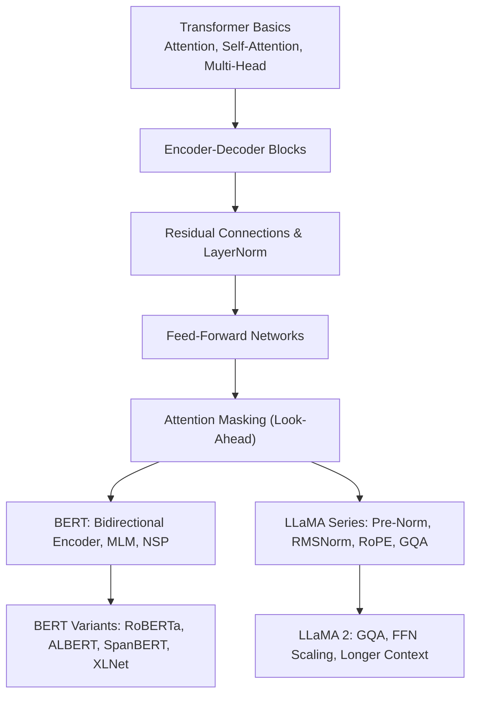
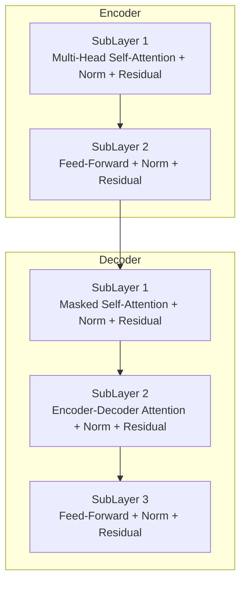
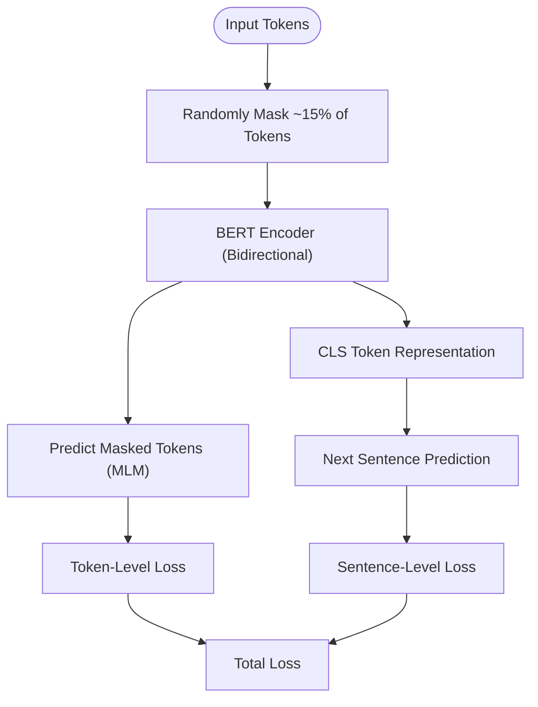
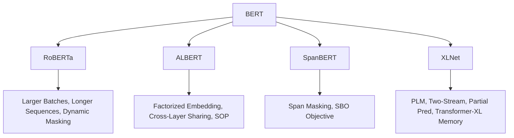
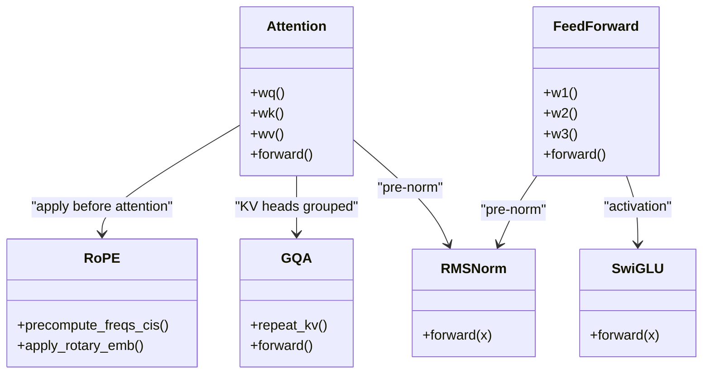
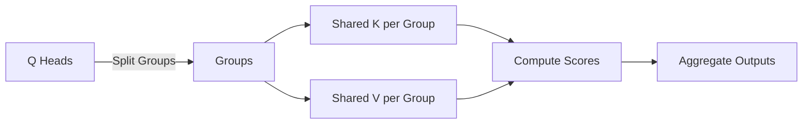
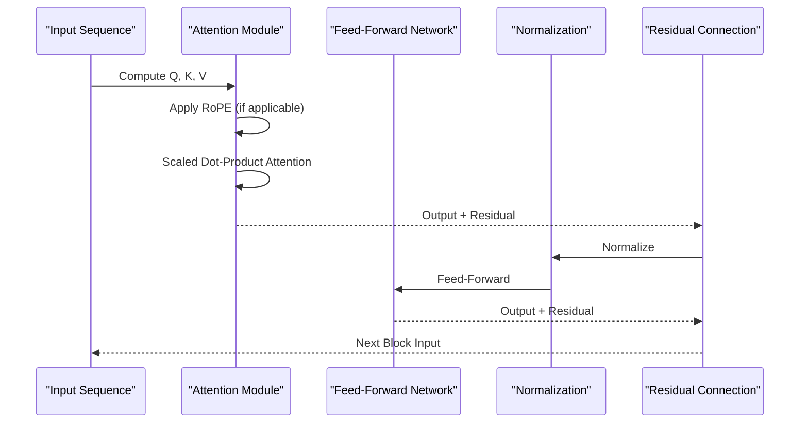
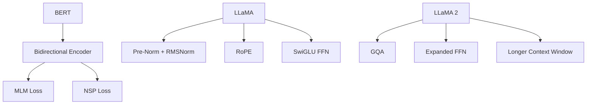

# Transformer Variants and Model Implementations

<cite>
**Referenced Files in This Document**
- [Transformer架构细节.md](file://02.大语言模型架构/Transformer架构细节/Transformer架构细节.md)
- [bert细节.md](file://02.大语言模型架构/bert细节/bert细节.md)
- [bert变种.md](file://02.大语言模型架构/bert变种/bert变种.md)
- [llama系列模型.md](file://02.大语言模型架构/llama系列模型/llama系列模型.md)
- [llama 2代码详解.md](file://02.大语言模型架构/llama 2代码详解/llama 2代码详解.md)
- [MHA_MQA_GQA.md](file://02.大语言模型架构/MHA_MQA_GQA/MHA_MQA_GQA.md)
- [3.Transformer基础.md](file://98.相关课程/清华大模型公开课/3.Transformer基础/3.Transformer基础.md)
</cite>

## Table of Contents
1. [Introduction](#introduction)
2. [Project Structure](#project-structure)
3. [Core Components](#core-components)
4. [Architecture Overview](#architecture-overview)
5. [Detailed Component Analysis](#detailed-component-analysis)
6. [Dependency Analysis](#dependency-analysis)
7. [Performance Considerations](#performance-considerations)
8. [Troubleshooting Guide](#troubleshooting-guide)
9. [Conclusion](#conclusion)
10. [Appendices](#appendices)

## Introduction
This document provides a comprehensive guide to transformer architecture variants and model implementations. It explains the standard encoder-decoder architecture, residual connections, feed-forward networks, and attention masking. It then covers BERT specifics including bidirectional attention, pre-training tasks (MLM, NSP), and downstream adaptation. It documents BERT variants and improvements (RoBERTa, ALBERT, SpanBERT, XLNet), and details the LLaMA series (original LLaMA, LLaMA 2) and architectural innovations. Finally, it includes code-level analysis of transformer blocks, attention mechanisms, and feed-forward layers, along with model size comparisons, computational efficiency, memory requirements, and performance benchmarks across variants.

## Project Structure
The repository organizes content around transformer fundamentals, BERT variants, and LLaMA series models. Key topics include:
- Transformer basics and attention mechanisms
- BERT pre-training and downstream adaptation
- BERT variants and improvements
- LLaMA architecture and optimizations
- Attention variants (MHA, MQA, GQA)

**Section sources**
- [Transformer架构细节.md:1-321](file://02.大语言模型架构/Transformer架构细节/Transformer架构细节.md#L1-L321)
- [3.Transformer基础.md:1-247](file://98.相关课程/清华大模型公开课/3.Transformer基础/3.Transformer基础.md#L1-L247)

## Core Components
- Standard Transformer Encoder-Decoder:
  - Encoder: stacked blocks with multi-head self-attention and feed-forward layers.
  - Decoder: stacked blocks with masked self-attention, encoder-decoder attention, and feed-forward layers.
  - Residual connections and normalization (LayerNorm) after each sub-layer.
- Attention Mechanisms:
  - Scaled dot-product attention with scaling by 1/sqrt(d_k).
  - Multi-head attention with concatenation of head outputs.
- Feed-Forward Networks:
  - Position-wise FFNs with activation and dimension scaling.
- Attention Masking:
  - Look-ahead mask in decoder self-attention to prevent attending to future positions.

**Section sources**
- [Transformer架构细节.md:7-321](file://02.大语言模型架构/Transformer架构细节/Transformer架构细节.md#L7-L321)
- [3.Transformer基础.md:198-247](file://98.相关课程/清华大模型公开课/3.Transformer基础/3.Transformer基础.md#L198-L247)

## Architecture Overview
The standard transformer architecture composes multiple encoder and decoder blocks. Each block applies residual connections and normalization, followed by attention and feed-forward layers. Decoder blocks additionally incorporate cross-attention with the encoder output and masking to enforce autoregressive decoding.

**Diagram sources**
- [Transformer架构细节.md:9-22](file://02.大语言模型架构/Transformer架构细节/Transformer架构细节.md#L9-L22)

**Section sources**
- [Transformer架构细节.md:9-22](file://02.大语言模型架构/Transformer架构细节/Transformer架构细节.md#L9-L22)

## Detailed Component Analysis

### BERT: Bidirectional Encoder, Pre-Training, and Downstream Adaptation
- Bidirectional attention via masked language modeling (MLM) and next sentence prediction (NSP).
- Pre-training tasks:
  - MLM: randomly mask ~15% of tokens; 80% replaced with [MASK], 10% replaced with random token, 10% kept.
  - NSP: predict whether two sentences are consecutive.
- Downstream adaptation:
  - Add classification head(s) on top of BERT’s final hidden states.
  - Fine-tune on downstream tasks (classification, QA, NER).
- Input embeddings:
  - Token, segment, and positional embeddings; CLS token for sentence-level representation.
- Loss:
  - Combined token-level MLM loss and sentence-level NSP loss.

**Diagram sources**
- [bert细节.md:77-91](file://02.大语言模型架构/bert细节/bert细节.md#L77-L91)
- [bert细节.md:220-244](file://02.大语言模型架构/bert细节/bert细节.md#L220-L244)

**Section sources**
- [bert细节.md:7-13](file://02.大语言模型架构/bert细节/bert细节.md#L7-L13)
- [bert细节.md:77-91](file://02.大语言模型架构/bert细节/bert细节.md#L77-L91)
- [bert细节.md:220-244](file://02.大语言模型架构/bert细节/bert细节.md#L220-L244)

### BERT Variants and Improvements
- RoBERTa:
  - Larger batches, longer sequences, dynamic masking, removal of NSP.
- ALBERT:
  - Factorized embedding parameterization and cross-layer parameter sharing.
  - Sentence order prediction (SOP) instead of NSP.
- SpanBERT:
  - Span-level masking and boundary prediction objective (SBO).
- XLNet:
  - Permutation language modeling (PLM) with two-stream attention to separate content and query streams.
  - Partial prediction and Transformer-XL memory for long-range dependencies.

**Diagram sources**
- [bert变种.md:3-171](file://02.大语言模型架构/bert变种/bert变种.md#L3-L171)

**Section sources**
- [bert变种.md:3-171](file://02.大语言模型架构/bert变种/bert变种.md#L3-L171)

### LLaMA Series: Original LLaMA and LLaMA 2
- Original LLaMA:
  - Pre-normalization with RMSNorm, SwiGLU activation, rotary positional embeddings (RoPE).
- LLaMA 2:
  - Grouped Query Attention (GQA) to reduce KV cache size and improve throughput.
  - Expanded FFN dimensions and increased context window (up to 4096).
  - Improved training data and longer context windows compared to LLaMA.

**Diagram sources**
- [llama系列模型.md:15-100](file://02.大语言模型架构/llama系列模型/llama系列模型.md#L15-L100)
- [llama 2代码详解.md:308-331](file://02.大语言模型架构/llama 2代码详解/llama 2代码详解.md#L308-L331)
- [llama 2代码详解.md:413-481](file://02.大语言模型架构/llama 2代码详解/llama 2代码详解.md#L413-L481)
- [llama 2代码详解.md:492-514](file://02.大语言模型架构/llama 2代码详解/llama 2代码详解.md#L492-L514)

**Section sources**
- [llama系列模型.md:1-292](file://02.大语言模型架构/llama系列模型/llama系列模型.md#L1-L292)
- [llama 2代码详解.md:160-527](file://02.大语言模型架构/llama 2代码详解/llama 2代码详解.md#L160-L527)

### Attention Variants: MHA, MQA, GQA
- Multi-Head Attention (MHA): Each head maintains separate K/V matrices.
- Multi-Query Attention (MQA): All heads share a single K/V matrix.
- Grouped Query Attention (GQA): Queries are divided into groups; each group shares a K/V matrix. GQA balances performance and efficiency.

**Diagram sources**
- [MHA_MQA_GQA.md:1-225](file://02.大语言模型架构/MHA_MQA_GQA/MHA_MQA_GQA.md#L1-L225)

**Section sources**
- [MHA_MQA_GQA.md:1-225](file://02.大语言模型架构/MHA_MQA_GQA/MHA_MQA_GQA.md#L1-L225)

### Code-Level Analysis: Transformer Blocks, Attention, and FFN
- Transformer blocks:
  - Sub-layers: multi-head self-attention, encoder-decoder attention (decoder), feed-forward network.
  - Residual connections and normalization after each sub-layer.
- Attention mechanisms:
  - Scaled dot-product attention with masking for decoder self-attention.
  - RoPE applied to Q/K before attention computation in LLaMA-style models.
- Feed-forward networks:
  - Position-wise FFNs with activation; in LLaMA variants, SwiGLU replaces ReLU.

**Diagram sources**
- [llama 2代码详解.md:308-331](file://02.大语言模型架构/llama 2代码详解/llama 2代码详解.md#L308-L331)
- [llama 2代码详解.md:492-514](file://02.大语言模型架构/llama 2代码详解/llama 2代码详解.md#L492-L514)

**Section sources**
- [Transformer架构细节.md:60-120](file://02.大语言模型架构/Transformer架构细节/Transformer架构细节.md#L60-L120)
- [llama 2代码详解.md:308-331](file://02.大语言模型架构/llama 2代码详解/llama 2代码详解.md#L308-L331)
- [llama 2代码详解.md:492-514](file://02.大语言模型架构/llama 2代码详解/llama 2代码详解.md#L492-L514)

## Dependency Analysis
- BERT depends on:
  - Bidirectional encoder blocks with masked attention.
  - Pre-training objectives (MLM, NSP).
- LLaMA variants depend on:
  - Pre-normalization with RMSNorm.
  - RoPE for positional encodings.
  - GQA to reduce KV cache and accelerate inference.
- Attention variants:
  - GQA reduces KV cache footprint while maintaining performance close to MHA.

**Diagram sources**
- [bert细节.md:7-13](file://02.大语言模型架构/bert细节/bert细节.md#L7-L13)
- [llama系列模型.md:11-12](file://02.大语言模型架构/llama系列模型/llama系列模型.md#L11-L12)
- [llama 2代码详解.md:164-171](file://02.大语言模型架构/llama 2代码详解/llama 2代码详解.md#L164-L171)

**Section sources**
- [bert细节.md:7-13](file://02.大语言模型架构/bert细节/bert细节.md#L7-L13)
- [llama系列模型.md:11-12](file://02.大语言模型架构/llama系列模型/llama系列模型.md#L11-L12)
- [llama 2代码详解.md:164-171](file://02.大语言模型架构/llama 2代码详解/llama 2代码详解.md#L164-L171)

## Performance Considerations
- Computational efficiency:
  - Multi-head attention scales quadratically with sequence length; RoPE avoids explicit positional encodings and improves efficiency.
  - GQA reduces KV cache size and speeds up inference by sharing K/V across query groups.
- Memory requirements:
  - KV cache grows with sequence length; GQA mitigates this by grouping heads.
  - RoPE avoids storing absolute positional embeddings, reducing memory overhead.
- Model sizes and context windows:
  - BERT base/large configurations differ in depth, width, and attention heads.
  - LLaMA 2 increases context window and FFN scaling while adopting GQA for throughput.

[No sources needed since this section provides general guidance]

## Troubleshooting Guide
- Training instability:
  - Use RMSNorm or LayerNorm consistently; ensure pre-normalization placement in decoder-only models.
- Attention masking issues:
  - Verify look-ahead masks in decoder self-attention to prevent leakage of future tokens.
- Mask token mismatch between pre-training and fine-tuning:
  - BERT’s [MASK] token does not appear during fine-tuning; consider dynamic masking strategies in later variants (e.g., RoBERTa).
- KV cache limitations:
  - Use GQA to reduce KV cache footprint; ensure correct broadcasting and repeat operations for grouped heads.

**Section sources**
- [llama 2代码详解.md:333-481](file://02.大语言模型架构/llama 2代码详解/llama 2代码详解.md#L333-L481)
- [bert变种.md:11-20](file://02.大语言模型架构/bert变种/bert变种.md#L11-L20)

## Conclusion
This document outlined the standard transformer architecture and its variants, focusing on BERT’s bidirectional encoder, pre-training objectives, and downstream adaptation, as well as BERT variants that refine pre-training and parameterization. It detailed the LLaMA series, highlighting pre-normalization, RMSNorm, RoPE, and GQA. The code-level analysis mapped transformer blocks, attention mechanisms, and feed-forward layers, and discussed performance trade-offs across variants.

[No sources needed since this section summarizes without analyzing specific files]

## Appendices
- Model size and configuration highlights:
  - BERT base: L=12, H=768, A=12; large: L=24, H=1024, A=16.
  - LLaMA 2: increased context window and FFN scaling; GQA adopted for throughput.
- Benchmarks and comparisons:
  - LLaMA 2 achieves competitive performance with reduced memory and improved throughput via GQA and RoPE.
  - RoBERTa improves over BERT with larger batches, longer sequences, and dynamic masking.

[No sources needed since this section provides general guidance]