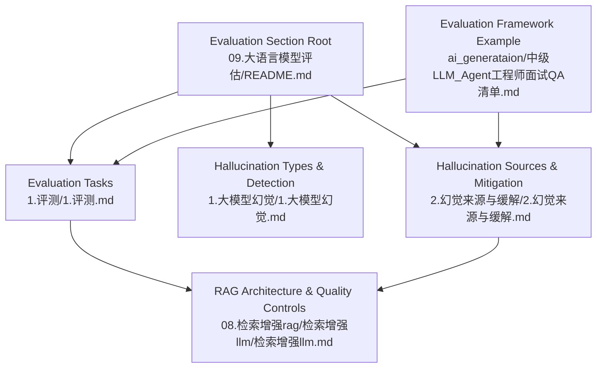
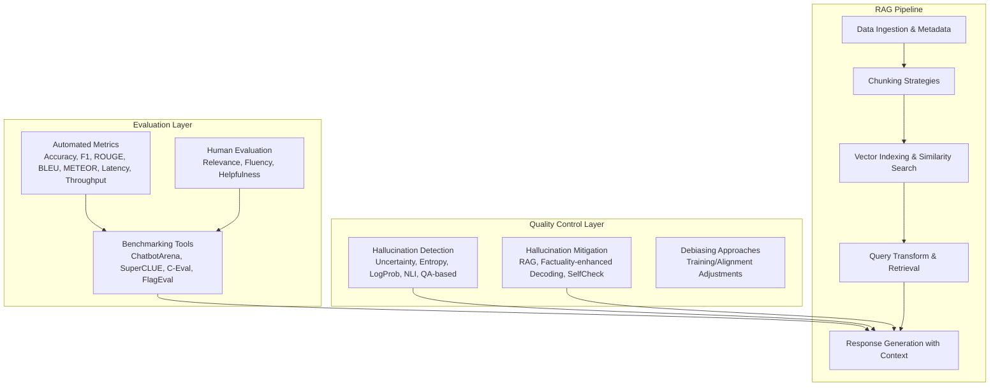
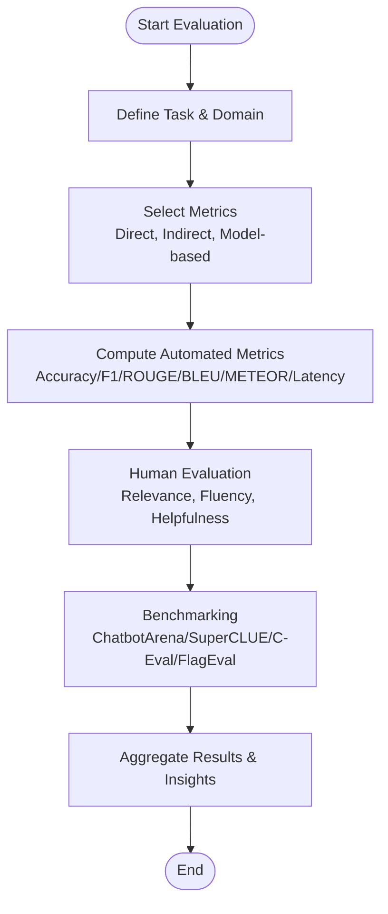
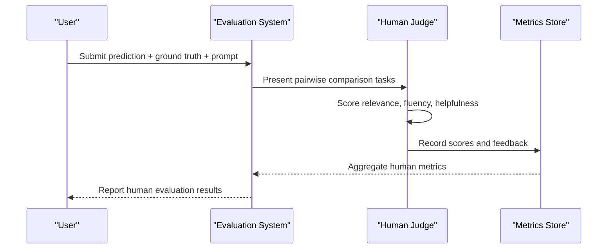
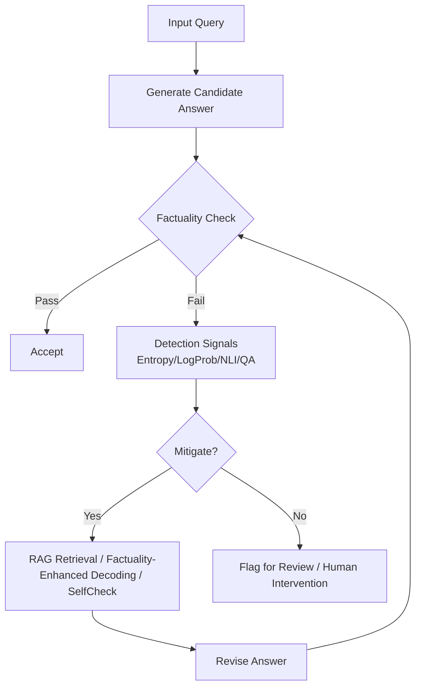
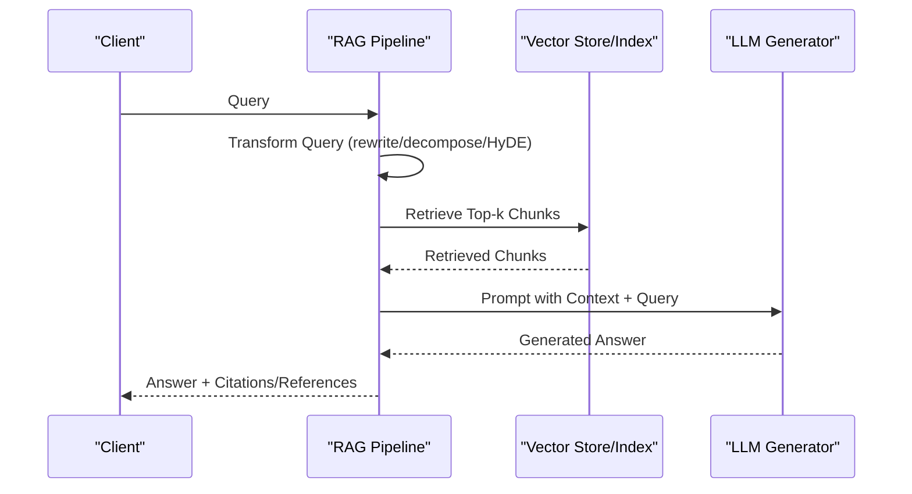
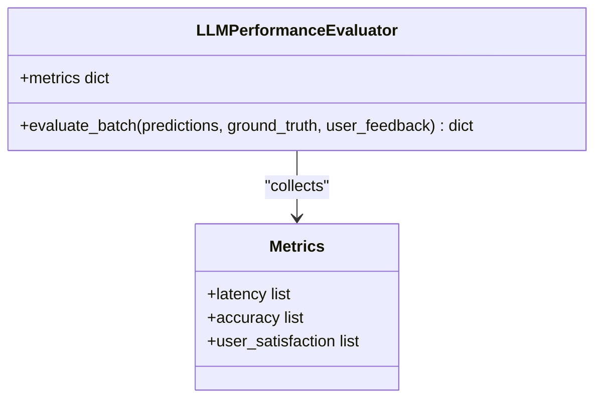
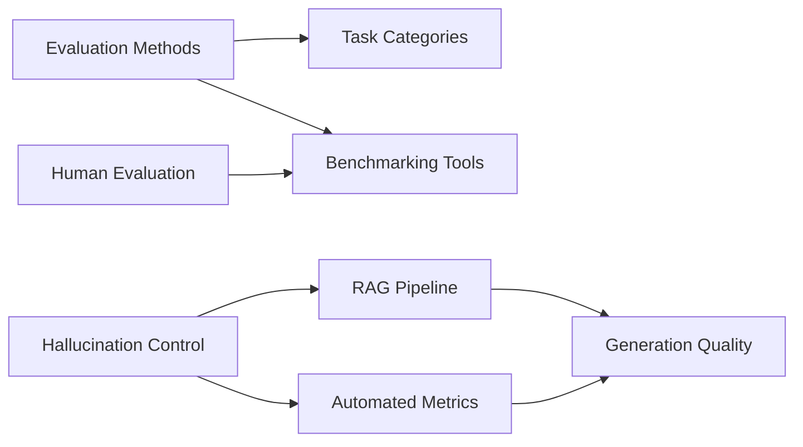

# Model Evaluation and Quality Assurance

<cite>
**Referenced Files in This Document**
- [09.大语言模型评估/README.md](file://09.大语言模型评估/README.md)
- [09.大语言模型评估/1.评测/1.评测.md](file://09.大语言模型评估/1.评测/1.评测.md)
- [09.大语言模型评估/1.大模型幻觉/1.大模型幻觉.md](file://09.大语言模型评估/1.大模型幻觉/1.大模型幻觉.md)
- [09.大语言模型评估/2.幻觉来源与缓解/2.幻觉来源与缓解.md](file://09.大语言模型评估/2.幻觉来源与缓解/2.幻觉来源与缓解.md)
- [08.检索增强rag/检索增强llm/检索增强llm.md](file://08.检索增强rag/检索增强llm/检索增强llm.md)
- [ai_generataion/中级LLM_Agent工程师面试QA清单.md](file://ai_generataion/中级LLM_Agent工程师面试QA清单.md)
</cite>

## Table of Contents
1. [Introduction](#introduction)
2. [Project Structure](#project-structure)
3. [Core Components](#core-components)
4. [Architecture Overview](#architecture-overview)
5. [Detailed Component Analysis](#detailed-component-analysis)
6. [Dependency Analysis](#dependency-analysis)
7. [Performance Considerations](#performance-considerations)
8. [Troubleshooting Guide](#troubleshooting-guide)
9. [Conclusion](#conclusion)
10. [Appendices](#appendices)

## Introduction
This document presents a comprehensive guide to Model Evaluation and Quality Assurance for large language models (LLMs). It synthesizes repository materials on evaluation methodologies, hallucination detection and mitigation, retrieval-augmented generation (RAG), and practical frameworks for building robust evaluation systems. The content balances technical depth with accessibility, offering structured guidance for designing evaluation frameworks, implementing quality assurance pipelines, and continuously improving model performance.

## Project Structure
The repository organizes evaluation-related knowledge under a dedicated evaluation section and integrates RAG concepts that are central to quality assurance. The evaluation section links to:
- Automated and human evaluation methodologies
- Hallucination taxonomy, detection, and mitigation
- Benchmarking and evaluation toolsets
- RAG architecture and quality controls

**Diagram sources**
- [09.大语言模型评估/README.md:1-12](file://09.大语言模型评估/README.md#L1-L12)
- [09.大语言模型评估/1.评测/1.评测.md:1-43](file://09.大语言模型评估/1.评测/1.评测.md#L1-L43)
- [09.大语言模型评估/1.大模型幻觉/1.大模型幻觉.md:1-109](file://09.大语言模型评估/1.大模型幻觉/1.大模型幻觉.md#L1-L109)
- [09.大语言模型评估/2.幻觉来源与缓解/2.幻觉来源与缓解.md:1-193](file://09.大语言模型评估/2.幻觉来源与缓解/2.幻觉来源与缓解.md#L1-L193)
- [08.检索增强rag/检索增强llm/检索增强llm.md:1-526](file://08.检索增强rag/检索增强llm/检索增强llm.md#L1-L526)
- [ai_generataion/中级LLM_Agent工程师面试QA清单.md:241-320](file://ai_generataion/中级LLM_Agent工程师面试QA清单.md#L241-L320)

**Section sources**
- [09.大语言模型评估/README.md:1-12](file://09.大语言模型评估/README.md#L1-L12)

## Core Components
- Evaluation paradigms: automated metrics, indirect heuristics, and model-based scoring
- Human evaluation and benchmarking toolsets
- Hallucination classification, detection signals, and mitigation strategies
- RAG pipeline modules: data ingestion, chunking, indexing, retrieval, and response generation
- Practical evaluation framework design and continuous monitoring

**Section sources**
- [09.大语言模型评估/1.评测/1.评测.md:5-43](file://09.大语言模型评估/1.评测/1.评测.md#L5-L43)
- [09.大语言模型评估/1.大模型幻觉/1.大模型幻觉.md:3-109](file://09.大语言模型评估/1.大模型幻觉/1.大模型幻觉.md#L3-L109)
- [09.大语言模型评估/2.幻觉来源与缓解/2.幻觉来源与缓解.md:9-193](file://09.大语言模型评估/2.幻觉来源与缓解/2.幻觉来源与缓解.md#L9-L193)
- [08.检索增强rag/检索增强llm/检索增强llm.md:81-413](file://08.检索增强rag/检索增强llm/检索增强llm.md#L81-L413)
- [ai_generataion/中级LLM_Agent工程师面试QA清单.md:241-320](file://ai_generataion/中级LLM_Agent工程师面试QA清单.md#L241-L320)

## Architecture Overview
The evaluation and quality assurance architecture integrates automated metrics, human evaluation, hallucination controls, and RAG-driven quality gates. The RAG pipeline ensures factual grounding and reduces hallucinations by retrieving relevant context before generation.

**Diagram sources**
- [09.大语言模型评估/1.评测/1.评测.md:31-43](file://09.大语言模型评估/1.评测/1.评测.md#L31-L43)
- [09.大语言模型评估/1.大模型幻觉/1.大模型幻觉.md:43-109](file://09.大语言模型评估/1.大模型幻觉/1.大模型幻觉.md#L43-L109)
- [09.大语言模型评估/2.幻觉来源与缓解/2.幻觉来源与缓解.md:25-193](file://09.大语言模型评估/2.幻觉来源与缓解/2.幻觉来源与缓解.md#L25-L193)
- [08.检索增强rag/检索增强llm/检索增强llm.md:81-413](file://08.检索增强rag/检索增强llm/检索增强llm.md#L81-L413)

## Detailed Component Analysis

### Automated Evaluation Metrics
- Direct evaluation metrics: accuracy, F1-score, and single-output comparisons against references
- Indirect heuristics: smaller models evaluating main model outputs
- Model-based evaluation: the model itself provides scores, introducing variability
- Text generation quality: ROUGE, BLEU, METEOR
- System performance: latency, throughput, error rate

**Diagram sources**
- [09.大语言模型评估/1.评测/1.评测.md:31-43](file://09.大语言模型评估/1.评测/1.评测.md#L31-L43)

**Section sources**
- [09.大语言模型评估/1.评测/1.评测.md:5-43](file://09.大语言模型评估/1.评测/1.评测.md#L5-L43)

### Human Evaluation Protocols
- Scoring dimensions: relevance, fluency, helpfulness
- Comparative ranking via human pairwise evaluations
- A/B testing and user satisfaction surveys
- Business KPIs: retention, completion rate, support ticket reduction, conversion lift

**Diagram sources**
- [09.大语言模型评估/1.评测/1.评测.md:7-11](file://09.大语言模型评估/1.评测/1.评测.md#L7-L11)
- [ai_generataion/中级LLM_Agent工程师面试QA清单.md:248-261](file://ai_generataion/中级LLM_Agent工程师面试QA清单.md#L248-L261)

**Section sources**
- [09.大语言模型评估/1.评测/1.评测.md:7-11](file://09.大语言模型评估/1.评测/1.评测.md#L7-L11)
- [ai_generataion/中级LLM_Agent工程师面试QA清单.md:248-261](file://ai_generataion/中级LLM_Agent工程师面试QA清单.md#L248-L261)

### Hallucination Detection and Mitigation
- Classification: factuality, faithfulness, self-contradiction
- Detection strategies:
  - External retrieval augmentation
  - Uncertainty measures (entropy, log probability)
  - Faithfulness overlap (n-gram, entity, relation, knowledge)
  - NLI-based entailment checks
  - QA-based fact verification
- Mitigation strategies:
  - Data-level: high-quality datasets, bias reduction, model editing, RAG
  - Training-level: improved architectures, alignment adjustments
  - Inference-level: factuality-enhanced decoding, self-reflection, contrastive decoding

**Diagram sources**
- [09.大语言模型评估/2.幻觉来源与缓解/2.幻觉来源与缓解.md:25-193](file://09.大语言模型评估/2.幻觉来源与缓解/2.幻觉来源与缓解.md#L25-L193)
- [09.大语言模型评估/1.大模型幻觉/1.大模型幻觉.md:43-109](file://09.大语言模型评估/1.大模型幻觉/1.大模型幻觉.md#L43-L109)

**Section sources**
- [09.大语言模型评估/2.幻觉来源与缓解/2.幻觉来源与缓解.md:9-193](file://09.大语言模型评估/2.幻觉来源与缓解/2.幻觉来源与缓解.md#L9-L193)
- [09.大语言模型评估/1.大模型幻觉/1.大模型幻觉.md:3-109](file://09.大语言模型评估/1.大模型幻觉/1.大模型幻觉.md#L3-L109)

### Retrieval-Augmented Generation (RAG) Quality Assurance
- Addresses long-tail knowledge, private data, data freshness, and explainability
- Key modules:
  - Data ingestion and metadata extraction
  - Chunking strategies (character/token-level, overlap, structure-aware)
  - Vector indexing and similarity search (embeddings, ANN, vector databases)
  - Query transformation (rewriting, decomposition, HyDE)
  - Response generation with context and iterative refinement prompts

**Diagram sources**
- [08.检索增强rag/检索增强llm/检索增强llm.md:81-413](file://08.检索增强rag/检索增强llm/检索增强llm.md#L81-L413)

**Section sources**
- [08.检索增强rag/检索增强llm/检索增强llm.md:13-80](file://08.检索增强rag/检索增强llm/检索增强llm.md#L13-L80)
- [08.检索增强rag/检索增强llm/检索增强llm.md:81-413](file://08.检索增强rag/检索增强llm/检索增强llm.md#L81-L413)

### Evaluation Framework Design and Continuous Improvement
- Framework example: batch evaluation collecting accuracy, latency, and user satisfaction
- Continuous monitoring: online vs offline evaluation, alerting, and feedback loops
- Bias handling: balanced sampling, debiasing during training/alignment, and fairness-aware metrics
- Iterative improvement: small-scale pilots, A/B tests, and gradual rollouts

**Diagram sources**
- [ai_generataion/中级LLM_Agent工程师面试QA清单.md:262-285](file://ai_generataion/中级LLM_Agent工程师面试QA清单.md#L262-L285)

**Section sources**
- [ai_generataion/中级LLM_Agent工程师面试QA清单.md:248-291](file://ai_generataion/中级LLM_Agent工程师面试QA清单.md#L248-L291)

## Dependency Analysis
- Evaluation methodologies depend on task categories and domains
- Hallucination mitigation relies on RAG quality and inference-time interventions
- Human evaluation complements automated metrics and benchmarks
- RAG depends on embedding quality, chunking strategy, and retrieval effectiveness

**Diagram sources**
- [09.大语言模型评估/1.评测/1.评测.md:19-43](file://09.大语言模型评估/1.评测/1.评测.md#L19-L43)
- [09.大语言模型评估/2.幻觉来源与缓解/2.幻觉来源与缓解.md:128-193](file://09.大语言模型评估/2.幻觉来源与缓解/2.幻觉来源与缓解.md#L128-L193)
- [08.检索增强rag/检索增强llm/检索增强llm.md:81-413](file://08.检索增强rag/检索增强llm/检索增强llm.md#L81-L413)

**Section sources**
- [09.大语言模型评估/1.评测/1.评测.md:19-43](file://09.大语言模型评估/1.评测/1.评测.md#L19-L43)
- [09.大语言模型评估/2.幻觉来源与缓解/2.幻觉来源与缓解.md:128-193](file://09.大语言模型评估/2.幻觉来源与缓解/2.幻觉来源与缓解.md#L128-L193)
- [08.检索增强rag/检索增强llm/检索增强llm.md:81-413](file://08.检索增强rag/检索增强llm/检索增强llm.md#L81-L413)

## Performance Considerations
- Automated metrics: choose task-appropriate measures (accuracy/F1 for classification, ROUGE/BLEU/METEOR for generation)
- Human evaluation: ensure inter-coder reliability and balanced scoring rubrics
- RAG performance: optimize chunk size, embedding model, and similarity search parameters
- Hallucination control: combine uncertainty detection with retrieval augmentation and iterative verification

[No sources needed since this section provides general guidance]

## Troubleshooting Guide
Common issues and remedies:
- Hallucination spikes: enable uncertainty-based gating, integrate RAG retrieval, apply self-check consistency checks
- Degraded generation quality: adjust decoding strategies (factuality-enhanced nucleus, contrastive decoding), refine prompts
- Offline vs online evaluation drift: align evaluation data distributions and monitor metrics drift with alerts
- Bias in evaluation: audit datasets and scoring rubrics; incorporate fairness-aware metrics and stratified evaluation

**Section sources**
- [09.大语言模型评估/2.幻觉来源与缓解/2.幻觉来源与缓解.md:128-193](file://09.大语言模型评估/2.幻觉来源与缓解/2.幻觉来源与缓解.md#L128-L193)
- [08.检索增强rag/检索增强llm/检索增强llm.md:332-413](file://08.检索增强rag/检索增强llm/检索增强llm.md#L332-L413)
- [ai_generataion/中级LLM_Agent工程师面试QA清单.md:287-291](file://ai_generataion/中级LLM_Agent工程师面试QA清单.md#L287-L291)

## Conclusion
Effective model evaluation and quality assurance require a hybrid approach combining automated metrics, human evaluation, and robust hallucination controls. Integrating RAG into the evaluation pipeline strengthens factual grounding and improves trustworthiness. Establishing continuous monitoring, iterative improvement cycles, and debiasing practices ensures sustained quality and reliability across real-world deployments.

[No sources needed since this section summarizes without analyzing specific files]

## Appendices
- Benchmarking tools: ChatbotArena, SuperCLUE, C-Eval, FlagEval
- Hallucination detection signals: entropy, log probability, NLI, QA-based verification
- RAG modules: ingestion, chunking, indexing, retrieval, generation

**Section sources**
- [09.大语言模型评估/1.评测/1.评测.md:37-43](file://09.大语言模型评估/1.评测/1.评测.md#L37-L43)
- [09.大语言模型评估/2.幻觉来源与缓解/2.幻觉来源与缓解.md:25-193](file://09.大语言模型评估/2.幻觉来源与缓解/2.幻觉来源与缓解.md#L25-L193)
- [08.检索增强rag/检索增强llm/检索增强llm.md:81-413](file://08.检索增强rag/检索增强llm/检索增强llm.md#L81-L413)