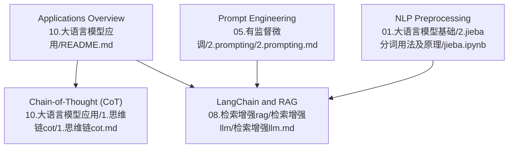
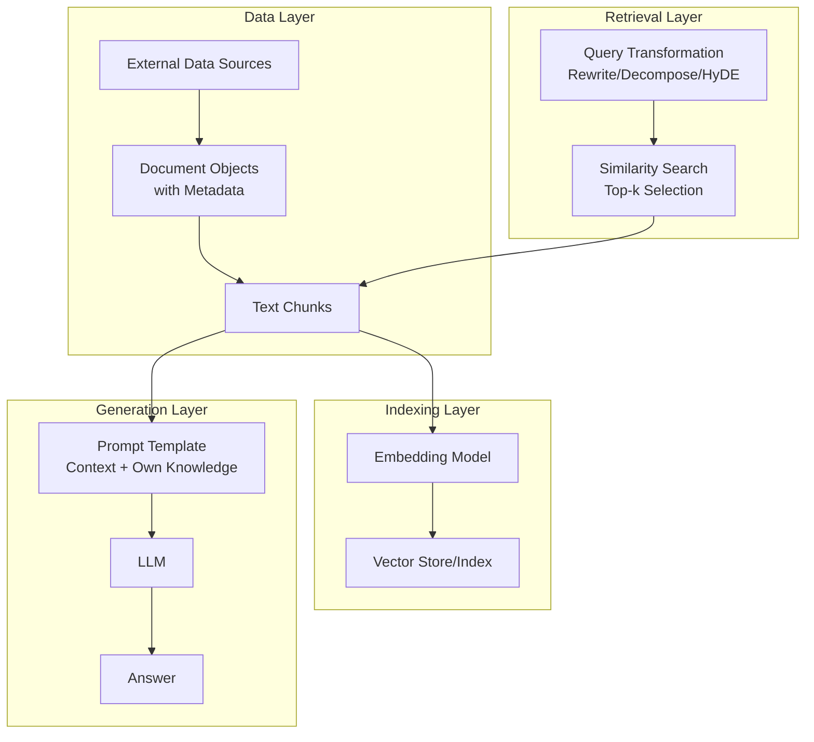
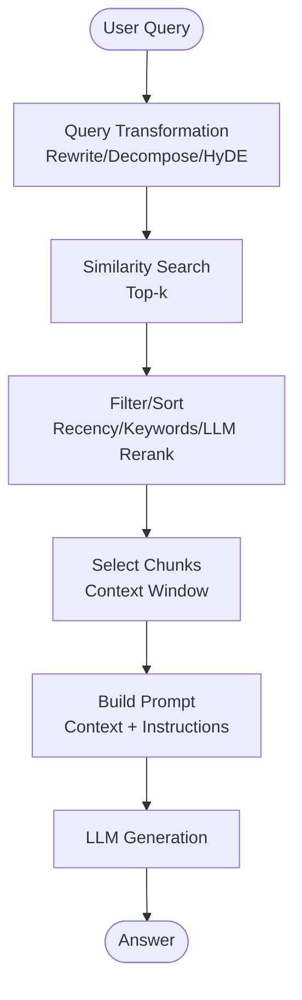
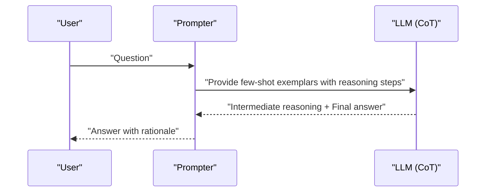
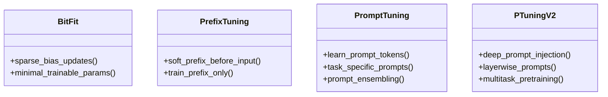
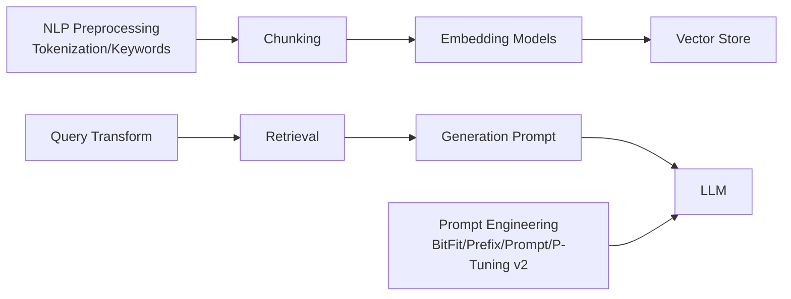

# Practical Applications

<cite>
**Referenced Files in This Document**
- [README.md](file://10.大语言模型应用/README.md)
- [1.思维链（cot）.md](file://10.大语言模型应用/1.思维链（cot）/1.思维链（cot）.md)
- [2.prompting.md](file://05.有监督微调/2.prompting/2.prompting.md)
- [检索增强llm.md](file://08.检索增强rag/检索增强llm/检索增强llm.md)
- [jieba.ipynb](file://01.大语言模型基础/2.jieba分词用法及原理/jieba.ipynb)
</cite>

## Table of Contents
1. [Introduction](#introduction)
2. [Project Structure](#project-structure)
3. [Core Components](#core-components)
4. [Architecture Overview](#architecture-overview)
5. [Detailed Component Analysis](#detailed-component-analysis)
6. [Dependency Analysis](#dependency-analysis)
7. [Performance Considerations](#performance-considerations)
8. [Troubleshooting Guide](#troubleshooting-guide)
9. [Conclusion](#conclusion)
10. [Appendices](#appendices)

## Introduction
This document presents practical applications of large language models (LLMs) grounded in the repository’s materials. It synthesizes real-world implementation patterns for retrieval-augmented generation (RAG), chain-of-thought (CoT) reasoning, prompt engineering, and production-oriented deployment considerations. It connects conceptual frameworks to concrete modules such as data ingestion and indexing, query transformation and retrieval, and response generation strategies. Guidance is provided for building production-ready LLM applications, integrating with existing systems, optimizing performance, and scaling effectively.

## Project Structure
The repository organizes practical LLM topics into thematic folders. For this document, the most relevant areas are:
- Application patterns and frameworks (RAG, CoT, LangChain)
- Prompt engineering techniques (prefix tuning, prompt tuning, P-tuning v2)
- Supporting NLP preprocessing (tokenization, keyword extraction)

**Diagram sources**
- [README.md:1-10](file://10.大语言模型应用/README.md#L1-L10)
- [1.思维链（cot）.md:1-147](file://10.大语言模型应用/1.思维链（cot）/1.思维链（cot）.md#L1-L147)
- [检索增强llm.md:1-526](file://08.检索增强rag/检索增强llm/检索增强llm.md#L1-L526)
- [2.prompting.md:1-173](file://05.有监督微调/2.prompting/2.prompting.md#L1-L173)
- [jieba.ipynb:1-170](file://01.大语言模型基础/2.jieba分词用法及原理/jieba.ipynb#L1-L170)

**Section sources**
- [README.md:1-10](file://10.大语言模型应用/README.md#L1-L10)

## Core Components
- Retrieval-Augmented Generation (RAG): A modular pipeline comprising data ingestion and indexing, query transformation and retrieval, and response generation. See [检索增强llm.md:81-87](file://08.检索增强rag/检索增强llm/检索增强llm.md#L81-L87).
- Chain-of-Thought (CoT) prompting: A structured prompting technique that elicits multi-step reasoning by showing exemplars with intermediate steps. See [1.思维链（cot）.md:6-54](file://10.大语言模型应用/1.思维链（cot）/1.思维链（cot）.md#L6-L54).
- Prompt engineering methods: Efficient fine-tuning paradigms including BitFit, Prefix Tuning, Prompt Tuning, and P-Tuning v2. See [2.prompting.md:3-173](file://05.有监督微调/2.prompting/2.prompting.md#L3-L173).
- NLP preprocessing: Tokenization and keyword extraction supporting downstream RAG and prompting workflows. See [jieba.ipynb:1-170](file://01.大语言模型基础/2.jieba分词用法及原理/jieba.ipynb#L1-L170).

**Section sources**
- [检索增强llm.md:81-87](file://08.检索增强rag/检索增强llm/检索增强llm.md#L81-L87)
- [1.思维链（cot）.md:6-54](file://10.大语言模型应用/1.思维链（cot）/1.思维链（cot）.md#L6-L54)
- [2.prompting.md:3-173](file://05.有监督微调/2.prompting/2.prompting.md#L3-L173)
- [jieba.ipynb:1-170](file://01.大语言模型基础/2.jieba分词用法及原理/jieba.ipynb#L1-L170)

## Architecture Overview
The practical RAG architecture integrates external knowledge bases with LLMs to improve accuracy, freshness, and explainability. The pipeline aligns with the repository’s documented modules and LangChain-style retrieval flows.

**Diagram sources**
- [检索增强llm.md:89-382](file://08.检索增强rag/检索增强llm/检索增强llm.md#L89-L382)

## Detailed Component Analysis

### Retrieval-Augmented Generation (RAG) Pipeline
- Data ingestion and indexing: Normalize diverse data formats into unified document objects with metadata; apply chunking strategies tailored to content type, embedding model, and downstream prompt size. See [检索增强llm.md:91-179](file://08.检索增强rag/检索增强llm/检索增强llm.md#L91-L179).
- Indexing strategies: Compare chain, tree, keyword table, and vector indices; select embedding models and similarity search algorithms per scale and latency targets; deploy vector databases for operational needs. See [检索增强llm.md:181-330](file://08.检索增强rag/检索增强llm/检索增强llm.md#L181-L330).
- Query transformation and retrieval: Explore rewriting, decomposition (single-step and multi-step), and hypothetical document embeddings (HyDE); rank and post-process results via similarity scores, keyword filters, recency weighting, and LLM reranking. See [检索增强llm.md:332-375](file://08.检索增强rag/检索增强llm/检索增强llm.md#L332-L375).
- Response generation: Combine retrieved chunks incrementally or in batches; use templates that instruct the LLM to leverage context and its own knowledge while handling unhelpful contexts. See [检索增强llm.md:376-412](file://08.检索增强rag/检索增强llm/检索增强llm.md#L376-L412).

**Diagram sources**
- [检索增强llm.md:332-412](file://08.检索增强rag/检索增强llm/检索增强llm.md#L332-L412)

**Section sources**
- [检索增强llm.md:89-382](file://08.检索增强rag/检索增强llm/检索增强llm.md#L89-L382)

### Chain-of-Thought (CoT) Reasoning
- Purpose: Encourage LLMs to verbalize intermediate reasoning steps, improving accuracy on complex arithmetic, commonsense, and symbolic reasoning tasks. See [1.思维链（cot）.md:6-54](file://10.大语言模型应用/1.思维链（cot）/1.思维链（cot）.md#L6-L54).
- Benefits: Problem decomposition, demonstration of step-by-step logic, improved explainability, and applicability across text-to-text tasks. See [1.思维链（cot）.md:30-42](file://10.大语言模型应用/1.思维链（cot）/1.思维链（cot）.md#L30-L42).
- Limitations and future directions: Factuality of generated chains, cost of large models, annotation effort, prompt sensitivity, and extension to smaller models. See [1.思维链（cot）.md:56-90](file://10.大语言模型应用/1.思维链（cot）/1.思维链（cot）.md#L56-L90).

**Diagram sources**
- [1.思维链（cot）.md:6-54](file://10.大语言模型应用/1.思维链（cot）/1.思维链（cot）.md#L6-L54)

**Section sources**
- [1.思维链（cot）.md:6-105](file://10.大语言模型应用/1.思维链（cot）/1.思维链（cot）.md#L6-L105)

### Prompt Engineering Methods
- BitFit: Sparse fine-tuning by updating only bias parameters (or selected biases) to achieve near-full-ft performance with minimal trainable parameters. See [2.prompting.md:3-35](file://05.有监督微调/2.prompting/2.prompting.md#L3-L35).
- Prefix Tuning: Inject continuous “soft prompts” before input (or encoder/decoder) tokens; train only prefix parameters while freezing base model weights. See [2.prompting.md:36-74](file://05.有监督微调/2.prompting/2.prompting.md#L36-L74).
- Prompt Tuning: Learn prompt tokens via backpropagation; freeze base weights and train prompts per task; supports prompt ensembling within a batch. See [2.prompting.md:75-96](file://05.有监督微调/2.prompting/2.prompting.md#L75-L96).
- P-Tuning v2: Deep prompt optimization by injecting continuous prompts at each layer; improves robustness across scales and tasks; optional multi-task pretraining and label-word verbalizer alternatives. See [2.prompting.md:127-173](file://05.有监督微调/2.prompting/2.prompting.md#L127-L173).

**Diagram sources**
- [2.prompting.md:3-173](file://05.有监督微调/2.prompting/2.prompting.md#L3-L173)

**Section sources**
- [2.prompting.md:3-173](file://05.有监督微调/2.prompting/2.prompting.md#L3-L173)

### NLP Preprocessing for RAG and Prompting
- Tokenization and keyword extraction support chunking strategies and metadata enrichment. Examples demonstrate segmentation modes, dictionary customization, and keyword extraction via TF-IDF and TextRank. See [jieba.ipynb:1-170](file://01.大语言模型基础/2.jieba分词用法及原理/jieba.ipynb#L1-L170).
- Practical implication: Choose chunk sizes aligned with token budgets and embedding models; preserve semantic units (sentences/headers) and overlap to maintain coherence. See [检索增强llm.md:122-179](file://08.检索增强rag/检索增强llm/检索增强llm.md#L122-L179).

**Section sources**
- [jieba.ipynb:1-170](file://01.大语言模型基础/2.jieba分词用法及原理/jieba.ipynb#L1-L170)
- [检索增强llm.md:122-179](file://08.检索增强rag/检索增强llm/检索增强llm.md#L122-L179)

## Dependency Analysis
- RAG depends on:
  - Data ingestion and chunking (NLP preprocessing)
  - Embedding models and vector databases
  - Retrieval ranking and reranking
  - Prompt templates and LLM generation
- CoT relies on:
  - Well-crafted exemplars and instruction templates
  - LLM capacity for multi-step reasoning
- Prompt engineering methods:
  - BitFit/P-Tuning v2 reduce training overhead and enable multitask inference
  - Prefix/Prompt Tuning adapt prompts continuously without full fine-tuning

**Diagram sources**
- [检索增强llm.md:89-382](file://08.检索增强rag/检索增强llm/检索增强llm.md#L89-L382)
- [2.prompting.md:3-173](file://05.有监督微调/2.prompting/2.prompting.md#L3-L173)
- [jieba.ipynb:1-170](file://01.大语言模型基础/2.jieba分词用法及原理/jieba.ipynb#L1-L170)

**Section sources**
- [检索增强llm.md:89-382](file://08.检索增强rag/检索增强llm/检索增强llm.md#L89-L382)
- [2.prompting.md:3-173](file://05.有监督微调/2.prompting/2.prompting.md#L3-L173)
- [jieba.ipynb:1-170](file://01.大语言模型基础/2.jieba分词用法及原理/jieba.ipynb#L1-L170)

## Performance Considerations
- Chunking and context window: Balance chunk size with token budgets; use token-level sizing and overlapping segments to preserve semantics. See [检索增强llm.md:122-179](file://08.检索增强rag/检索增强llm/检索增强llm.md#L122-L179).
- Embedding and similarity search: Select embedding models suited to content types; choose similarity metrics and indexes (e.g., cosine) and scale-appropriate ANN libraries. See [检索增强llm.md:213-282](file://08.检索增强rag/检索增强llm/检索增强llm.md#L213-L282).
- Vector databases: Use managed vector stores for upsert/query/delete operations and operational guarantees. See [检索增强llm.md:288-330](file://08.检索增强rag/检索增强llm/检索增强llm.md#L288-L330).
- Prompt engineering trade-offs: Prefer sparse methods (BitFit) or continuous prompts (Prefix/Prompt/P-Tuning v2) to reduce compute and storage costs while maintaining performance. See [2.prompting.md:3-173](file://05.有监督微调/2.prompting/2.prompting.md#L3-L173).
- Query transformation: Employ rewriting and decomposition to improve recall and reduce hallucinations; consider HyDE to align query intent with document embeddings. See [检索增强llm.md:332-375](file://08.检索增强rag/检索增强llm/检索增强llm.md#L332-L375).

[No sources needed since this section provides general guidance]

## Troubleshooting Guide
- Hallucinations and outdated knowledge: Mitigate by retrieving recent, verifiable context and constraining answers when context is unhelpful. See [检索增强llm.md:35-79](file://08.检索增强rag/检索增强llm/检索增强llm.md#L35-L79).
- Private data leakage risk: Avoid injecting private data into model weights; rely on retrieval from external sources. See [检索增强llm.md:51-58](file://08.检索增强rag/检索增强llm/检索增强llm.md#L51-L58).
- Prompt quality and stability: Use prompt ensembling and careful exemplar selection; consider P-Tuning v2 for robust, layerwise prompt injection. See [2.prompting.md:75-173](file://05.有监督微调/2.prompting/2.prompting.md#L75-L173).
- Retrieval effectiveness: Apply keyword filters, recency weighting, and LLM reranking; evaluate chunk sizes empirically. See [检索增强llm.md:366-375](file://08.检索增强rag/检索增强llm/检索增强llm.md#L366-L375).

**Section sources**
- [检索增强llm.md:35-79](file://08.检索增强rag/检索增强llm/检索增强llm.md#L35-L79)
- [检索增强llm.md:51-58](file://08.检索增强rag/检索增强llm/检索增强llm.md#L51-L58)
- [检索增强llm.md:366-375](file://08.检索增强rag/检索增强llm/检索增强llm.md#L366-L375)
- [2.prompting.md:75-173](file://05.有监督微调/2.prompting/2.prompting.md#L75-L173)

## Conclusion
Production-ready LLM applications benefit from a modular RAG pipeline, robust prompt engineering, and pragmatic retrieval strategies. CoT reasoning enhances reliability on complex tasks, while efficient prompting paradigms reduce cost and improve scalability. Integrating preprocessing, embedding, vector storage, and retrieval ranking yields systems that are accurate, explainable, and maintainable in real-world deployments.

[No sources needed since this section summarizes without analyzing specific files]

## Appendices
- Practical examples and architectures:
  - ChatGPT Retrieval Plugin API endpoints for upsert/query/delete illustrate end-to-end ingestion and retrieval. See [检索增强llm.md:416-428](file://08.检索增强rag/检索增强llm/检索增强llm.md#L416-L428).
  - LangChain Retrieval module flow mirrors RAG stages. See [检索增强llm.md:444-446](file://08.检索增强rag/检索增强llm/检索增强llm.md#L444-L446).

**Section sources**
- [检索增强llm.md:416-428](file://08.检索增强rag/检索增强llm/检索增强llm.md#L416-L428)
- [检索增强llm.md:444-446](file://08.检索增强rag/检索增强llm/检索增强llm.md#L444-L446)