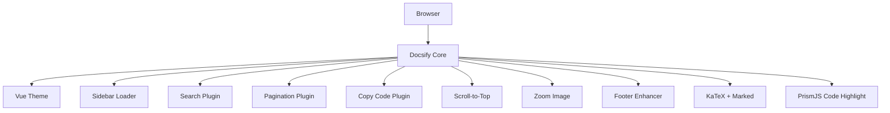
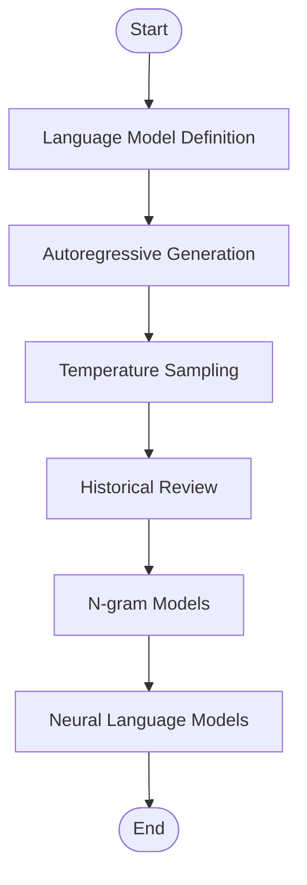
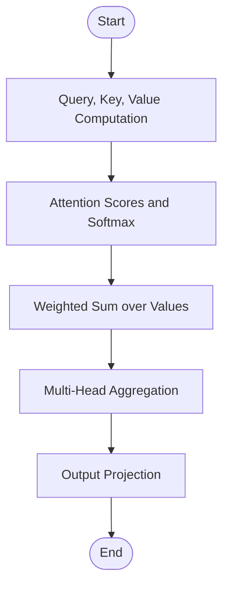
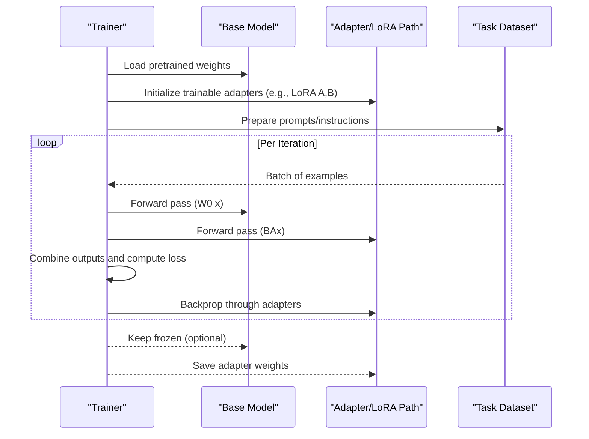
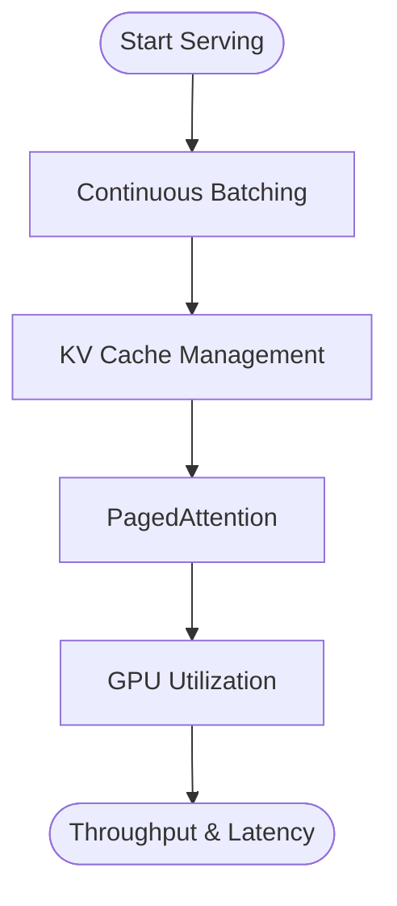
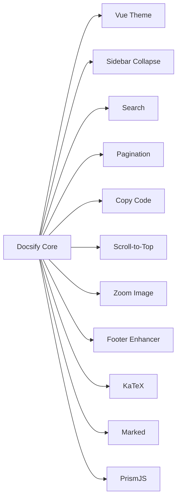

# Project Overview

<cite>
**Referenced Files in This Document**
- [README.md](file://README.md)
- [index.html](file://index.html)
- [_navbar.md](file://_navbar.md)
- [01.大语言模型基础/README.md](file://01.大语言模型基础/README.md)
- [02.大语言模型架构/README.md](file://02.大语言模型架构/README.md)
- [05.有监督微调/README.md](file://05.有监督微调/README.md)
- [06.推理/README.md](file://06.推理/README.md)
- [09.大语言模型评估/README.md](file://09.大语言模型评估/README.md)
- [10.大语言模型应用/README.md](file://10.大语言模型应用/README.md)
- [98.相关课程/README.md](file://98.相关课程/README.md)
- [99.参考资料/README.md](file://99.参考资料/README.md)
- [01.大语言模型基础/1.语言模型/1.语言模型.md](file://01.大语言模型基础/1.语言模型/1.语言模型.md)
- [02.大语言模型架构/1.attention/1.attention.md](file://02.大语言模型架构/1.attention/1.attention.md)
- [05.有监督微调/4.lora/4.lora.md](file://05.有监督微调/4.lora/4.lora.md)
- [06.推理/1.vllm/1.vllm.md](file://06.推理/1.vllm/1.vllm.md)
- [01.大语言模型基础/2.jieba分词用法及原理/jieba.ipynb](file://01.大语言模型基础/2.jieba分词用法及原理/jieba.ipynb)
</cite>

## Table of Contents
1. [Introduction](#introduction)
2. [Project Structure](#project-structure)
3. [Core Components](#core-components)
4. [Architecture Overview](#architecture-overview)
5. [Detailed Component Analysis](#detailed-component-analysis)
6. [Dependency Analysis](#dependency-analysis)
7. [Performance Considerations](#performance-considerations)
8. [Troubleshooting Guide](#troubleshooting-guide)
9. [Conclusion](#conclusion)
10. [Appendices](#appendices)

## Introduction
This repository is a comprehensive educational resource for Large Language Model (LLM) interview preparation. It consolidates theoretical foundations, practical implementations, and industry applications into a structured, documentation-driven platform. The content is organized as a learning pathway covering language modeling basics, Transformer architectures, training data and distributed training, supervised fine-tuning, inference frameworks and optimization, reinforcement learning for alignment, retrieval-augmented generation (RAG), evaluation and hallucination mitigation, and real-world application patterns such as Chain-of-Thought prompting and LangChain.

Target audience:
- ML engineers preparing for roles involving LLM systems
- Researchers focusing on LLM architectures, training, and deployment
- Students and candidates for technical interviews in AI, NLP, and generative AI roles

The platform emphasizes hands-on understanding with notebook-based examples and integrates mathematical notation rendering for precise technical explanations.

## Project Structure
The repository is organized by thematic chapters, each containing focused content and supporting materials. The documentation site is powered by Docsify with Vue.js theming and extended with plugins for math rendering, search, pagination, code highlighting, and interactive UI enhancements.

```mermaid
graph TB
Root["Repository Root"]
Index["index.html<br/>Docsify config and plugins"]
Navbar["_navbar.md<br/>Quick links"]
Readme["README.md<br/>Project overview and navigation"]
Part1["01.大语言模型基础<br/>Basics"]
Part2["02.大语言模型架构<br/>Architecture"]
Part3["03.训练数据集<br/>Training Data"]
Part4["04.分布式训练<br/>Distributed Training"]
Part5["05.有监督微调<br/>Supervised Fine-tuning"]
Part6["06.推理<br/>Inference"]
Part7["07.强化学习<br/>RLHF"]
Part8["08.检索增强rag<br/>RAG"]
Part9["09.大语言模型评估<br/>Evaluation"]
Part10["10.大语言模型应用<br/>Applications"]
Course["98.相关课程<br/>Related Courses"]
Refs["99.参考资料<br/>References"]
Root --> Index
Root --> Navbar
Root --> Readme
Root --> Part1
Root --> Part2
Root --> Part3
Root --> Part4
Root --> Part5
Root --> Part6
Root --> Part7
Root --> Part8
Root --> Part9
Root --> Part10
Root --> Course
Root --> Refs
```

**Diagram sources**
- [index.html:14-66](file://index.html#L14-L66)
- [README.md:37-161](file://README.md#L37-L161)

Key characteristics:
- Navigation-driven: Docsify sidebar and navbar enable chapter-based exploration.
- Math-enabled: KaTeX and Marked integrate LaTeX rendering for equations and formulas.
- Interactive: Plugins support search, pagination, copy code, scroll-to-top, zoom images, and footers.
- Practical examples: Jupyter notebooks demonstrate tokenization and keyword extraction.

**Section sources**
- [README.md:37-161](file://README.md#L37-L161)
- [index.html:14-66](file://index.html#L14-L66)
- [_navbar.md:1-5](file://_navbar.md#L1-L5)

## Core Components
- Documentation engine: Docsify with Vue theme and plugin ecosystem
- Content modules: Thematic chapters covering theory, practice, and applications
- Mathematical notation: KaTeX rendering for precise formula presentation
- Interactive UX: Search, pagination, copy code, scroll-to-top, zoom image, and collapsible sidebar
- Practical examples: Jupyter notebooks for hands-on exercises

Learning progression:
- Foundational concepts (language modeling, tokenization, embeddings)
- Architectural understanding (attention mechanisms, Transformer variants)
- Training and scaling (data, distributed strategies, efficient fine-tuning)
- Inference and optimization (frameworks, continuous batching, PagedAttention)
- Alignment and evaluation (RLHF, metrics, hallucination)
- Applications (RAG, CoT prompting, LangChain)

**Section sources**
- [README.md:4-31](file://README.md#L4-L31)
- [index.html:73-119](file://index.html#L73-L119)
- [01.大语言模型基础/README.md:1-36](file://01.大语言模型基础/README.md#L1-L36)
- [02.大语言模型架构/README.md:1-52](file://02.大语言模型架构/README.md#L1-L52)
- [05.有监督微调/README.md:1-30](file://05.有监督微调/README.md#L1-L30)
- [06.推理/README.md:1-28](file://06.推理/README.md#L1-L28)
- [09.大语言模型评估/README.md:1-12](file://09.大语言模型评估/README.md#L1-L12)
- [10.大语言模型应用/README.md:1-10](file://10.大语言模型应用/README.md#L1-L10)

## Architecture Overview
The platform is a static documentation site generated by Docsify. It loads Markdown content from chapter directories and renders it with a Vue.js theme. KaTeX enables mathematical notation rendering, while numerous plugins enhance usability and interactivity.

**Diagram sources**
- [index.html:14-66](file://index.html#L14-L66)
- [index.html:73-119](file://index.html#L73-L119)

## Detailed Component Analysis

### Chapter 1: Language Modeling Foundations
This module introduces core concepts of language modeling, autoregressive generation, temperature sampling, and historical context from information theory to neural models. It includes mathematical formulations and historical milestones.

**Diagram sources**
- [01.大语言模型基础/1.语言模型/1.语言模型.md:3-96](file://01.大语言模型基础/1.语言模型/1.语言模型.md#L3-L96)

Practical example:
- Notebook demonstrates tokenization and keyword extraction using jieba, complementing foundational concepts.

**Section sources**
- [01.大语言模型基础/1.语言模型/1.语言模型.md:1-215](file://01.大语言模型基础/1.语言模型/1.语言模型.md#L1-L215)
- [01.大语言模型基础/2.jieba分词用法及原理/jieba.ipynb:1-170](file://01.大语言模型基础/2.jieba分词用法及原理/jieba.ipynb#L1-L170)

### Chapter 2: Transformer and Attention Mechanisms
This module covers attention fundamentals, multi-head attention, grouped-query attention variants, positional encodings, and complexity analysis. It also includes advanced topics like FlashAttention and masked decoding.

**Diagram sources**
- [02.大语言模型架构/1.attention/1.attention.md:31-33](file://02.大语言模型架构/1.attention/1.attention.md#L31-L33)

Advanced techniques:
- FlashAttention reduces memory bandwidth pressure and improves throughput by computing softmax reductions in tiles and avoiding storing full attention matrices during backward pass.

**Section sources**
- [02.大语言模型架构/1.attention/1.attention.md:1-544](file://02.大语言模型架构/1.attention/1.attention.md#L1-L544)

### Chapter 5: Supervised Fine-tuning
This module explains fine-tuning paradigms, prompting strategies, adapter tuning, and low-rank adaptation (LoRA). It includes practical guidance and comparative analysis of parameter-efficient methods.

**Diagram sources**
- [05.有监督微调/4.lora/4.lora.md:23-27](file://05.有监督微调/4.lora/4.lora.md#L23-L27)

**Section sources**
- [05.有监督微调/README.md:1-30](file://05.有监督微调/README.md#L1-L30)
- [05.有监督微调/4.lora/4.lora.md:1-114](file://05.有监督微调/4.lora/4.lora.md#L1-L114)

### Chapter 6: Inference Frameworks and Optimization
This module focuses on serving frameworks and optimization techniques. It covers continuous batching, PagedAttention, and practical guidance for deploying LLMs at scale.

**Diagram sources**
- [06.推理/1.vllm/1.vllm.md:55-132](file://06.推理/1.vllm/1.vllm.md#L55-L132)

Operational highlights:
- Continuous batching increases GPU utilization by inserting new sequences into finished slots.
- PagedAttention reduces memory fragmentation and improves KV cache efficiency.

**Section sources**
- [06.推理/README.md:1-28](file://06.推理/README.md#L1-L28)
- [06.推理/1.vllm/1.vllm.md:1-220](file://06.推理/1.vllm/1.vllm.md#L1-L220)

### Chapter 9: Evaluation and Hallucination
This module addresses evaluation methodologies and strategies to mitigate hallucinations, aligning with interview expectations for robustness and reliability.

**Section sources**
- [09.大语言模型评估/README.md:1-12](file://09.大语言模型评估/README.md#L1-L12)

### Chapter 10: Applications (RAG, Chain-of-Thought, LangChain)
This module showcases practical application patterns, including retrieval-augmented generation, chain-of-thought prompting, and framework-based agent construction.

**Section sources**
- [10.大语言模型应用/README.md:1-10](file://10.大语言模型应用/README.md#L1-L10)

## Dependency Analysis
The documentation site depends on Docsify and a set of plugins for enhanced functionality. The content modules are independent Markdown pages organized by chapter, enabling modular learning and easy navigation.

**Diagram sources**
- [index.html:71-119](file://index.html#L71-L119)

**Section sources**
- [index.html:14-66](file://index.html#L14-L66)

## Performance Considerations
- Attention complexity: Self-attention scales quadratically with sequence length; multi-head attention maintains complexity per head but aggregates across heads.
- Memory-bound inference: KV cache dominates GPU memory; continuous batching and PagedAttention improve throughput and reduce fragmentation.
- Parameter-efficient fine-tuning: LoRA and AdaLoRA reduce trainable parameters while maintaining performance, crucial for multi-task deployment.
- Tokenization and preprocessing: Efficient tokenizers and keyword extraction (e.g., jieba) support downstream tasks and reduce latency.

[No sources needed since this section provides general guidance]

## Troubleshooting Guide
Common issues and resolutions:
- Math rendering: Ensure KaTeX and Marked are loaded; verify Markdown uses proper LaTeX delimiters.
- Search indexing: Confirm search plugin configuration and that pages are included in the sidebar.
- Pagination: Verify pagination plugin is enabled and configured for desired chapter transitions.
- Code blocks: Ensure PrismJS languages are loaded for the relevant syntaxes.
- Sidebar collapse: Confirm sidebar collapse plugin is initialized and sidebar files are present.
- External scripts: Use external script plugin for third-party integrations; verify URLs and CORS policies.

**Section sources**
- [index.html:34-119](file://index.html#L34-L119)

## Conclusion
This repository provides a structured, mathematically rigorous, and practically grounded foundation for LLM interview preparation. By combining theoretical insights, architectural understanding, hands-on examples, and modern deployment techniques, it supports learners at various stages—from foundational concepts to advanced optimization and production readiness.

[No sources needed since this section summarizes without analyzing specific files]

## Appendices

### Learning Progression Paths
- Foundation-first: Basics → Architecture → Data and Training → Fine-tuning → Inference → Evaluation → Applications
- Application-first: Applications → RAG/CoT → Inference → Fine-tuning → Architecture → Data and Training → Basics
- Specialization tracks: Distributed training, RLHF, or efficient fine-tuning

### Navigation and Usage Tips
- Use the sidebar to navigate chapters and subsections.
- Use the search bar to locate specific topics or equations.
- Enable pagination to move across chapters seamlessly.
- Copy code snippets via the copy button for quick experimentation.
- Zoom images for detailed diagrams and figures.
- Use continuous batching and PagedAttention references for production deployment guidance.

**Section sources**
- [README.md:23-31](file://README.md#L23-L31)
- [index.html:18-39](file://index.html#L18-L39)