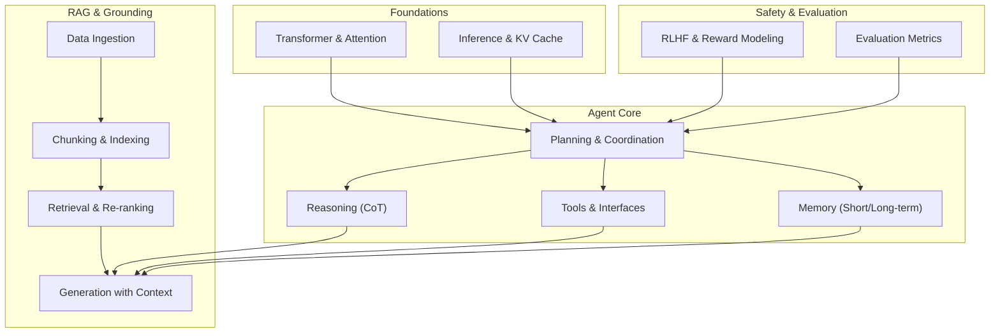
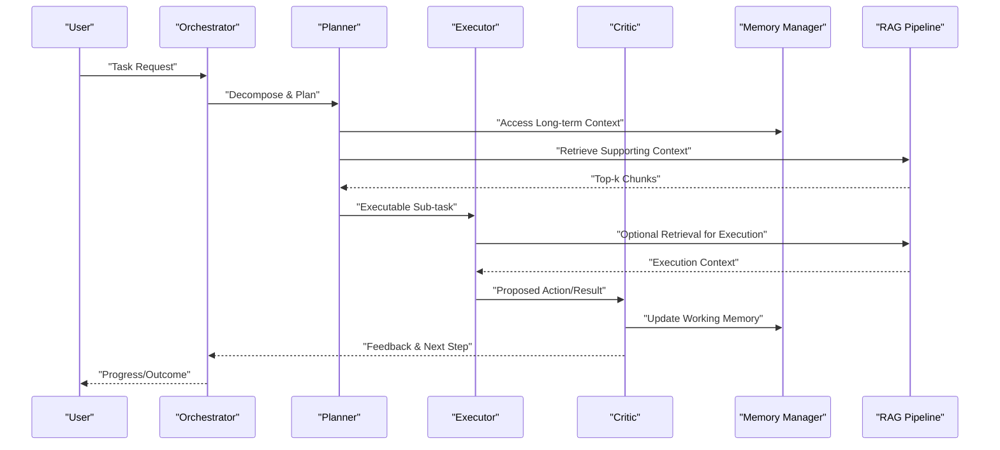
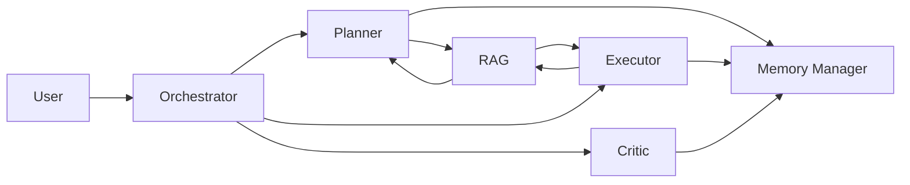
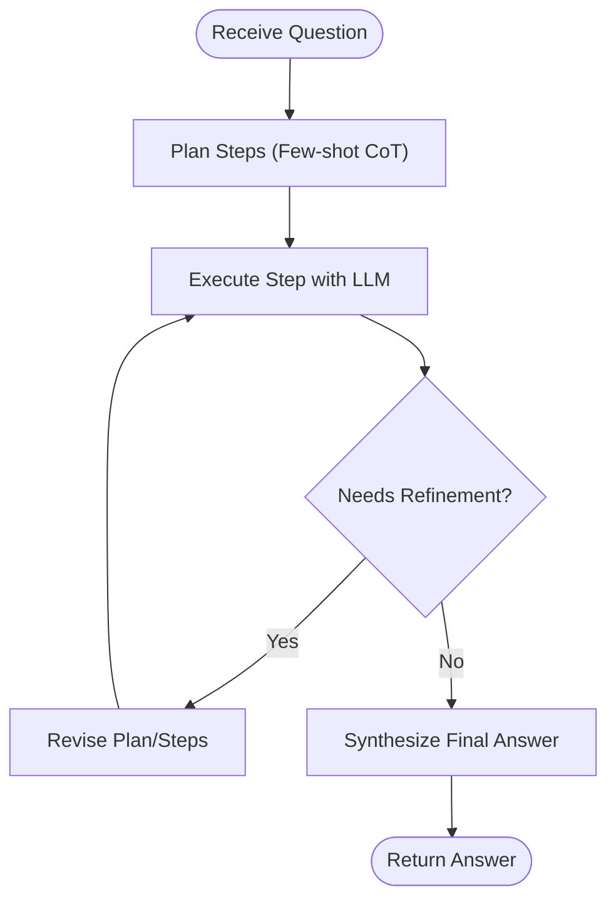
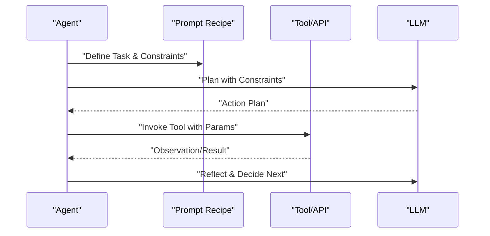
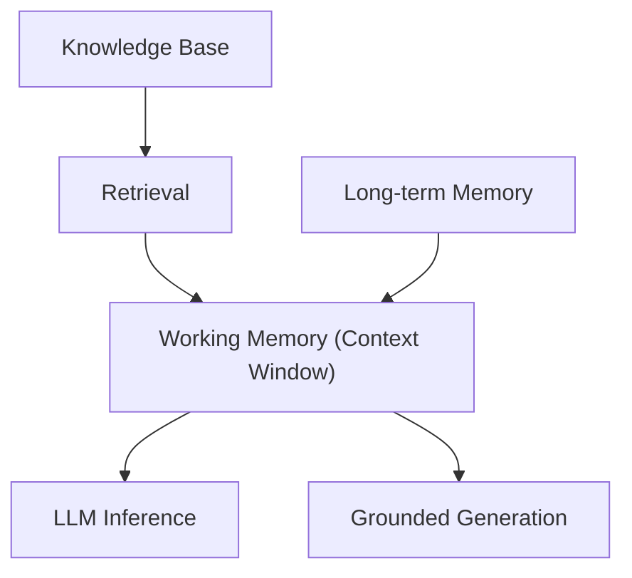
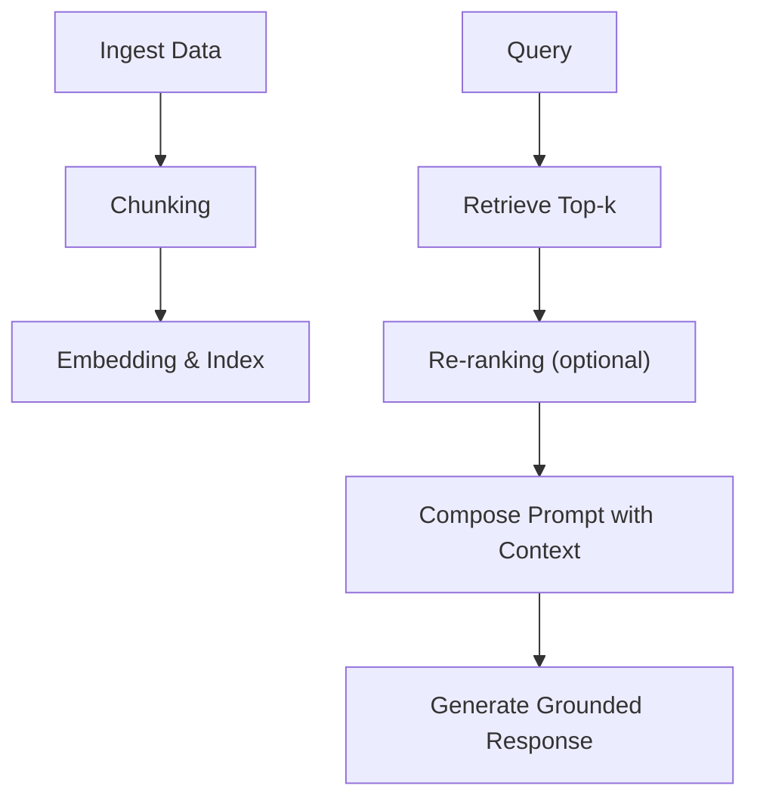
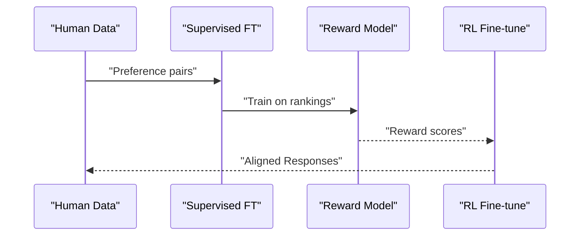
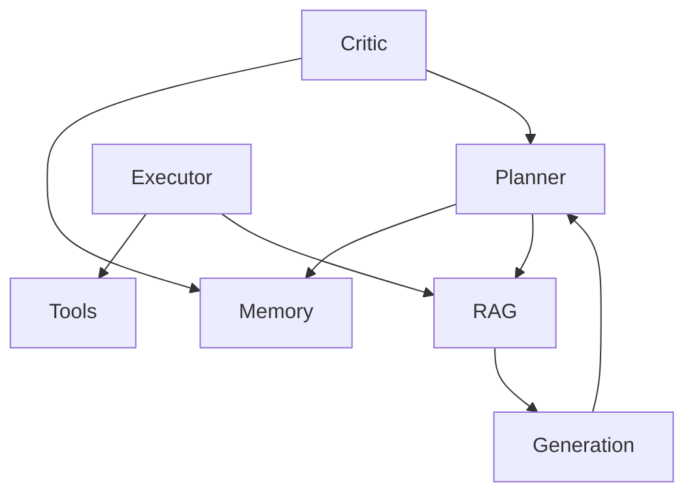

# Agent Architectures

<cite>
**Referenced Files in This Document**
- [Agent Interview Checklist](file://ai_generataion/Middle-Level LLM_Agent Engineer Interview QA Checklist.md)
- [Agent Interview Quick Reference](file://ai_generataion/Middle-Level LLM_Agent Engineer Interview Quick Reference.md)
- [RAG: Retrieval-Augmented LLM](file://08. Retrieval-Augmented Generation/RAG/Retrieval-Augmented LLM.md)
- [Chain-of-Thought Prompting](file://10. LLM Applications/1. Chain-of-Thought (CoT).md)
- [RLHF and LLM Agents](file://07. Reinforcement Learning/1. RLHF Related/1. RLHF Related.md)
- [LLM Inference Basics](file://06. Inference/1. Inference/1. Inference.md)
- [TGI Overview](file://06. Inference/2. Text Generation Inference/2. Text Generation Inference.md)
</cite>

## Table of Contents
1. [Introduction](#introduction)
2. [Project Structure](#project-structure)
3. [Core Components](#core-components)
4. [Architecture Overview](#architecture-overview)
5. [Detailed Component Analysis](#detailed-component-analysis)
6. [Dependency Analysis](#dependency-analysis)
7. [Performance Considerations](#performance-considerations)
8. [Troubleshooting Guide](#troubleshooting-guide)
9. [Conclusion](#conclusion)
10. [Appendices](#appendices)

## Introduction
This document synthesizes agent architectures and multi-agent systems grounded in the repository’s materials. It explains agent design patterns, core components (planning, reasoning, tool usage, memory), multi-agent collaboration strategies, and RAG-driven context grounding. It also covers evaluation, safety, and production deployment considerations, with references to concrete implementation patterns present in the repository.

## Project Structure
The repository organizes relevant materials across foundational topics:
- Agent design patterns and multi-agent collaboration
- Retrieval-Augmented Generation (RAG) for context grounding
- Chain-of-Thought prompting for structured reasoning
- Reinforcement learning from human feedback (RLHF) and agent alignment
- LLM inference fundamentals and TGI for production

**Section sources**
- [Agent Interview Checklist:55-133](file://ai_generataion/Middle-Level LLM_Agent Engineer Interview QA Checklist.md#L55-L133)
- [RAG: Retrieval-Augmented LLM:81-414](file://08. Retrieval-Augmented Generation/RAG/Retrieval-Augmented LLM.md#L81-L414)
- [Chain-of-Thought Prompting](file://10. LLM Applications/1. Chain-of-Thought (CoT).md#L1-L147)
- [RLHF and LLM Agents:1-172](file://07. Reinforcement Learning/1. RLHF Related/1. RLHF Related.md#L1-L172)
- [LLM Inference Basics:1-14](file://06. Inference/1. Inference/1. Inference.md#L1-L14)
- [TGI Overview:1-44](file://06. Inference/2. Text Generation Inference/2. Text Generation Inference.md#L1-L44)

## Core Components
- Planning and Coordination: Multi-agent orchestration with roles such as Planner, Executor, Critic, and Memory Manager; explicit task decomposition and communication protocols.
- Reasoning: Structured reasoning via prompts (e.g., CoT) to improve multi-step problem solving.
- Tool Usage: Integrating APIs and external services through tools to act on the world; prompt recipes define behavior and constraints.
- Memory: Short-term working memory for current task/session and long-term memory for persistent user/task context.
- RAG-based Grounding: Retrieval-augmented generation to ground answers in external knowledge, reducing hallucinations and improving freshness.

**Section sources**
- [Agent Interview Checklist:88-113](file://ai_generataion/Middle-Level LLM_Agent Engineer Interview QA Checklist.md#L88-L113)
- [RLHF and LLM Agents:137-145](file://07. Reinforcement Learning/1. RLHF Related/1. RLHF Related.md#L137-L145)
- [RAG: Retrieval-Augmented LLM:376-413](file://08. Retrieval-Augmented Generation/RAG/Retrieval-Augmented LLM.md#L376-L413)
- [Chain-of-Thought Prompting](file://10. LLM Applications/1. Chain-of-Thought (CoT).md#L6-L54)

## Architecture Overview
The agent architecture integrates planning, reasoning, tool use, and memory with retrieval-grounded generation. A multi-agent loop coordinates specialized roles while grounding decisions in retrieved context.

**Diagram sources**
- [Agent Interview Checklist:96-107](file://ai_generataion/Middle-Level LLM_Agent Engineer Interview QA Checklist.md#L96-L107)
- [RAG: Retrieval-Augmented LLM:332-413](file://08. Retrieval-Augmented Generation/RAG/Retrieval-Augmented LLM.md#L332-L413)
- [RLHF and LLM Agents:137-145](file://07. Reinforcement Learning/1. RLHF Related/1. RLHF Related.md#L137-L145)

## Detailed Component Analysis

### Multi-Agent Collaboration
- Roles and Responsibilities:
  - Planner: Breaks tasks into executable sub-steps and selects retrieval actions.
  - Executor: Carries out actions using tools and retrieves supporting context as needed.
  - Critic: Evaluates outcomes, flags issues, and suggests refinements.
  - Memory Manager: Maintains long-term and working memory for continuity.
- Communication Protocol: Explicit message formats and routing among agents; backpressure and retries to avoid deadlocks.
- Coordination Mechanisms: Centralized orchestrator for decomposition; decentralized execution with periodic synchronization.

**Diagram sources**
- [Agent Interview Checklist:88-113](file://ai_generataion/Middle-Level LLM_Agent Engineer Interview QA Checklist.md#L88-L113)

**Section sources**
- [Agent Interview Checklist:88-113](file://ai_generataion/Middle-Level LLM_Agent Engineer Interview QA Checklist.md#L88-L113)

### Reasoning Patterns (CoT)
- Chain-of-Thought prompting encourages step-by-step reasoning, improving accuracy on arithmetic, commonsense, and symbolic reasoning tasks.
- Benefits include decomposition, demonstration of intermediate steps, logical thinking reinforcement, and explainability.

**Diagram sources**
- [Chain-of-Thought Prompting](file://10. LLM Applications/1. Chain-of-Thought (CoT).md#L6-L54)

**Section sources**
- [Chain-of-Thought Prompting](file://10. LLM Applications/1. Chain-of-Thought (CoT).md#L6-L54)

### Tool Usage and Function Calling
- Tools enable agents to interact with external APIs and services; prompt recipes define behavior, tone, and constraints.
- Tool integration supports autonomous action-taking and iterative refinement.

**Diagram sources**
- [RLHF and LLM Agents:137-145](file://07. Reinforcement Learning/1. RLHF Related/1. RLHF Related.md#L137-L145)

**Section sources**
- [RLHF and LLM Agents:137-145](file://07. Reinforcement Learning/1. RLHF Related/1. RLHF Related.md#L137-L145)

### Memory Management
- Working Memory: Short-term context window for current task/session; optimized via KV cache reuse and efficient attention.
- Long-term Memory: Persistent user/task context enabling continuity across sessions and multi-step workflows.
- Grounding Techniques: Retrieve relevant chunks and inject into prompts to keep answers factual and up-to-date.

**Diagram sources**
- [RAG: Retrieval-Augmented LLM:376-413](file://08. Retrieval-Augmented Generation/RAG/Retrieval-Augmented LLM.md#L376-L413)
- [LLM Inference Basics:5-14](file://06. Inference/1. Inference/1. Inference.md#L5-L14)

**Section sources**
- [RAG: Retrieval-Augmented LLM:376-413](file://08. Retrieval-Augmented Generation/RAG/Retrieval-Augmented LLM.md#L376-L413)
- [LLM Inference Basics:5-14](file://06. Inference/1. Inference/1. Inference.md#L5-L14)

### RAG Workflow Orchestration
- Data ingestion from varied sources and formats.
- Chunking strategies (semantic boundaries, overlap) tailored to embedding models and downstream use.
- Indexing with vector databases; similarity search and re-ranking.
- Prompt templates combine retrieved context with model knowledge and explicit instructions.

**Diagram sources**
- [RAG: Retrieval-Augmented LLM:89-413](file://08. Retrieval-Augmented Generation/RAG/Retrieval-Augmented LLM.md#L89-L413)

**Section sources**
- [RAG: Retrieval-Augmented LLM:89-413](file://08. Retrieval-Augmented Generation/RAG/Retrieval-Augmented LLM.md#L89-L413)

### Safety and Alignment (RLHF)
- RLHF trains agents to align with human preferences: supervised fine-tuning → reward modeling → reinforcement learning.
- Alternative rank-response training reduces model count while preserving alignment quality.
- Compliance strategies include constraints during training, access control, and continuous monitoring.

**Diagram sources**
- [RLHF and LLM Agents:17-107](file://07. Reinforcement Learning/1. RLHF Related/1. RLHF Related.md#L17-L107)

**Section sources**
- [RLHF and LLM Agents:17-107](file://07. Reinforcement Learning/1. RLHF Related/1. RLHF Related.md#L17-L107)
- [RLHF and LLM Agents:65-98](file://07. Reinforcement Learning/1. RLHF Related/1. RLHF Related.md#L65-L98)

## Dependency Analysis
- Planning depends on memory and retrieval to inform sub-task selection.
- Execution relies on tools and may trigger retrieval for situational context.
- Critique integrates feedback loops into memory updates and orchestrator decisions.
- RAG underpins grounded generation, reducing hallucinations and improving freshness.
- Inference performance (KV cache, batching) affects throughput and latency in production.

**Diagram sources**
- [Agent Interview Checklist:88-113](file://ai_generataion/Middle-Level LLM_Agent Engineer Interview QA Checklist.md#L88-L113)
- [RAG: Retrieval-Augmented LLM:332-413](file://08. Retrieval-Augmented Generation/RAG/Retrieval-Augmented LLM.md#L332-L413)

**Section sources**
- [Agent Interview Checklist:88-113](file://ai_generataion/Middle-Level LLM_Agent Engineer Interview QA Checklist.md#L88-L113)
- [RAG: Retrieval-Augmented LLM:332-413](file://08. Retrieval-Augmented Generation/RAG/Retrieval-Augmented LLM.md#L332-L413)

## Performance Considerations
- Inference optimization: KV cache reuse, dynamic batching, and attention variants (e.g., Flash Attention, PagedAttention) reduce latency and improve throughput.
- Production runtime: TGI supports tensor-parallel inference, continuous batching, quantization, and observability.
- Memory management: Preallocated pools, circular buffers, and paged attention mitigate fragmentation and support variable-length sequences.

**Section sources**
- [LLM Inference Basics:5-14](file://06. Inference/1. Inference/1. Inference.md#L5-L14)
- [TGI Overview:1-44](file://06. Inference/2. Text Generation Inference/2. Text Generation Inference.md#L1-L44)
- [Agent Interview Checklist:57-87](file://ai_generataion/Middle-Level LLM_Agent Engineer Interview QA Checklist.md#L57-L87)

## Troubleshooting Guide
- Hallucination mitigation:
  - Use retrieval-grounded generation to anchor answers in external knowledge.
  - Employ CoT prompting to increase verifiability.
  - Apply re-ranking and temporal filtering to prioritize reliable sources.
- Context management:
  - Tune chunk sizes and overlaps to balance coverage and coherence.
  - Maintain working memory windows and long-term memory for continuity.
- Performance bottlenecks:
  - Monitor KV cache utilization and batch scheduling.
  - Adjust model serving parameters (batch size, quantization) and leverage TGI features.

**Section sources**
- [RAG: Retrieval-Augmented LLM:332-413](file://08. Retrieval-Augmented Generation/RAG/Retrieval-Augmented LLM.md#L332-L413)
- [Chain-of-Thought Prompting](file://10. LLM Applications/1. Chain-of-Thought (CoT).md#L6-L54)
- [LLM Inference Basics:5-14](file://06. Inference/1. Inference/1. Inference.md#L5-L14)
- [Agent Interview Checklist:57-87](file://ai_generataion/Middle-Level LLM_Agent Engineer Interview QA Checklist.md#L57-L87)

## Conclusion
Effective agent architectures integrate planning, reasoning, tool use, and memory with retrieval-grounded generation. Multi-agent collaboration benefits from explicit roles, communication protocols, and shared memory. Safety and alignment are strengthened through structured prompting and RLHF-style training. Production readiness requires careful inference optimization, robust evaluation, and continuous monitoring.

## Appendices
- Evaluation framework: Combine automated metrics (accuracy, latency, BLEU/ROUGE), human evaluations (relevance, fluency, helpfulness), and business KPIs (retention, completion rate).
- Deployment patterns: Use TGI for scalable serving, apply continuous batching and KV cache pooling, and instrument with telemetry for observability.

**Section sources**
- [Agent Interview Checklist:248-285](file://ai_generataion/Middle-Level LLM_Agent Engineer Interview QA Checklist.md#L248-L285)
- [TGI Overview:1-44](file://06. Inference/2. Text Generation Inference/2. Text Generation Inference.md#L1-L44)