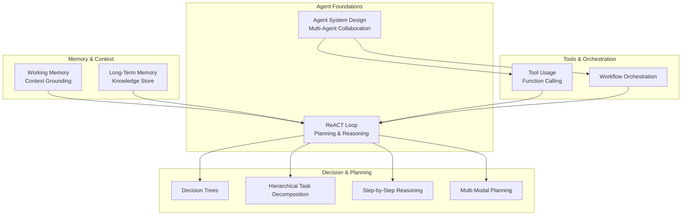
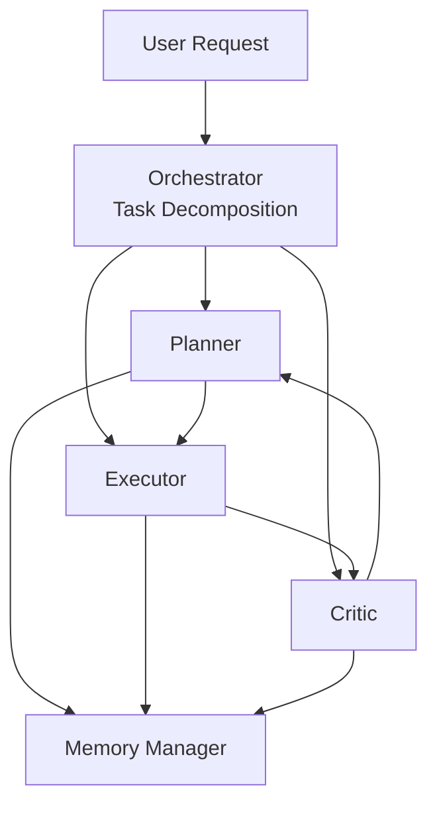
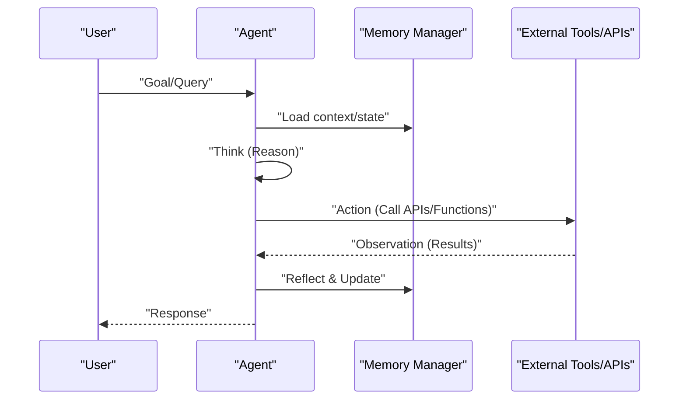
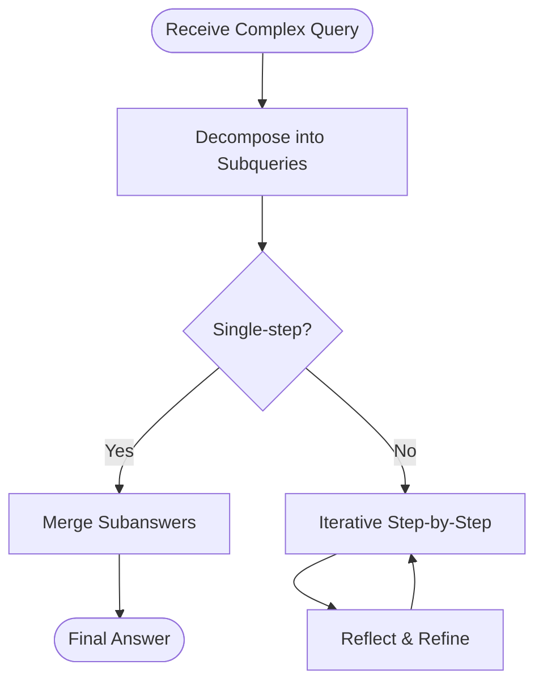
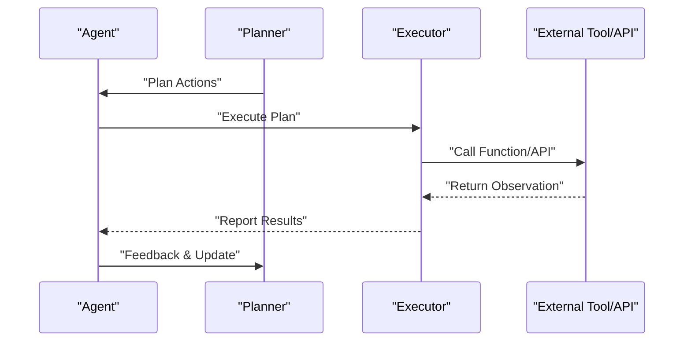
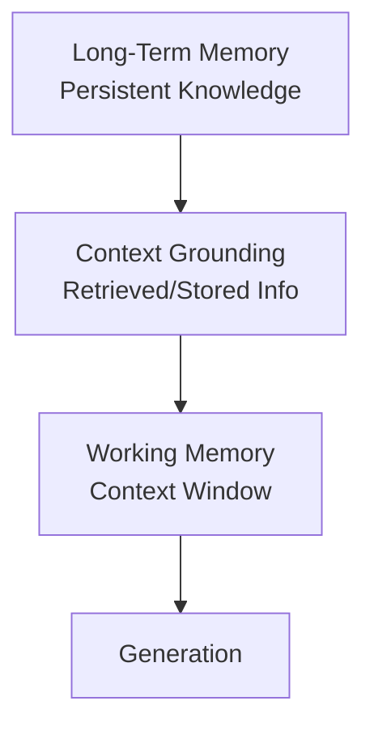
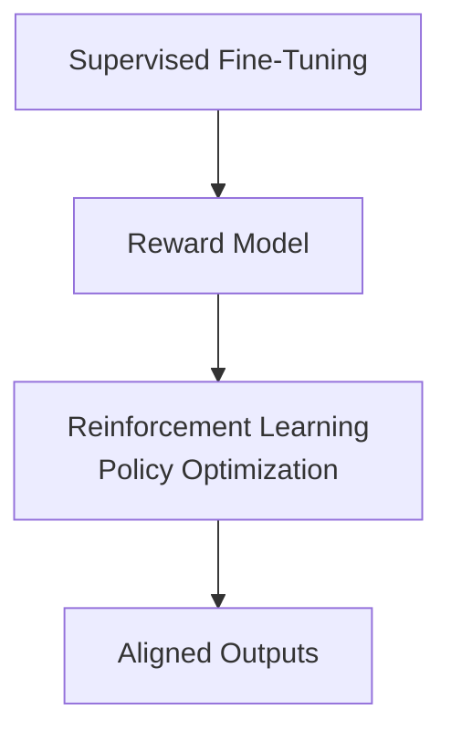
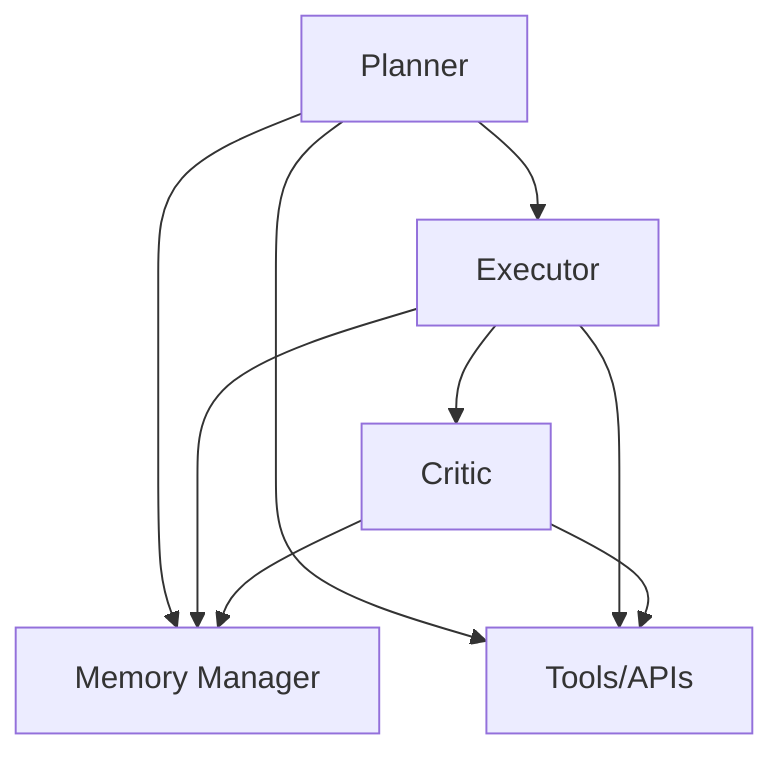

# Core Agent Components

<cite>
**Referenced Files in This Document**
- [中级LLM_Agent工程师面试QA清单.md](file://ai_generataion/中级LLM_Agent工程师面试QA清单.md)
- [中级LLM_Agent工程师面试_快速参考.md](file://ai_generataion/中级LLM_Agent工程师面试_快速参考.md)
- [1.rlhf相关.md](file://07.强化学习/1.rlhf相关/1.rlhf相关.md)
- [检索增强llm.md](file://08.检索增强rag/检索增强llm/检索增强llm.md)
- [1.思维链（cot）.md](file://10.大语言模型应用/1.思维链（cot）/1.思维链（cot）.md)
</cite>

## Table of Contents
1. [Introduction](#introduction)
2. [Project Structure](#project-structure)
3. [Core Components](#core-components)
4. [Architecture Overview](#architecture-overview)
5. [Detailed Component Analysis](#detailed-component-analysis)
6. [Dependency Analysis](#dependency-analysis)
7. [Performance Considerations](#performance-considerations)
8. [Troubleshooting Guide](#troubleshooting-guide)
9. [Conclusion](#conclusion)

## Introduction
This document synthesizes the core components of LLM agents as reflected in the repository materials. It focuses on the four pillars commonly associated with capable agents: planning and reasoning mechanisms, tool usage and function calling patterns, memory management systems (working memory, long-term memory, and context grounding), and decision-making frameworks. It also documents the ReACT pattern (Reasoning and Acting) as a foundational loop and covers planning strategies such as hierarchical task decomposition, step-by-step reasoning, and multi-modal planning approaches. Practical examples of agent decision trees, planning algorithms, and memory optimization techniques are included.

## Project Structure
The repository organizes materials around LLM fundamentals, architectures, training, inference, reinforcement learning, retrieval-augmented generation (RAG), evaluation, applications, and curated course notes. For agent-centric topics, the following files are central:
- Agent system design and multi-agent collaboration
- RAG pipeline and memory-grounded context management
- Chain-of-Thought prompting and reasoning strategies
- RLHF and decision-making frameworks

[No sources needed since this diagram shows conceptual structure, not direct code mapping]

## Core Components
This section distills the four pillars of LLM agents as described in the repository materials.

- Planning and reasoning mechanisms
  - Chain-of-Thought prompting encourages explicit intermediate reasoning steps to improve multi-step reasoning tasks.
  - Hierarchical task decomposition and step-by-step reasoning are highlighted as planning strategies.
  - Multi-modal planning approaches are implied by broader agent capabilities and multimodal integrations.

- Tool usage and function calling patterns
  - Agents integrate tools (APIs, external services) to collect information and act, enabling autonomous operation beyond pure language processing.
  - Workflow orchestration is essential for coordinating planning, execution, and feedback loops.

- Memory management systems
  - Working memory corresponds to the LLM’s context window during a single inference turn.
  - Long-term memory stores persistent knowledge and user/task-specific context for continuity across sessions and multi-step tasks.
  - Context grounding ensures that generated responses are anchored to relevant retrieved or stored information.

- Decision-making frameworks
  - Supervised fine-tuning and reward modeling align model outputs with human preferences.
  - Reinforcement learning from human feedback (RLHF) refines policies iteratively using reward signals.
  - Decision trees and iterative refinement cycles support reflective decision-making.

**Section sources**
- [1.rlhf相关.md: Agent definition, capabilities, and composition:122-156](file://07.强化学习/1.rlhf相关/1.rlhf相关.md#L122-L156)
- [1.rlhf相关.md: RLHF stages and multi-model training:100-121](file://07.强化学习/1.rlhf相关/1.rlhf相关.md#L100-L121)
- [检索增强llm.md: Working memory and context window:25-25](file://08.检索增强rag/检索增强llm/检索增强llm.md#L25-L25)
- [检索增强llm.md: Query decomposition and ReAct:348-358](file://08.检索增强rag/检索增强llm/检索增强llm.md#L348-L358)
- [1.思维链（cot）.md: CoT reasoning and multi-step tasks:1-53](file://10.大语言模型应用/1.思维链（cot）/1.思维链（cot）.md#L1-L53)

## Architecture Overview
The repository presents a multi-agent collaboration architecture and a ReACT-style loop. The multi-agent system includes roles such as Planner, Executor, Critic, and a Memory Manager, coordinated by an Orchestrator. The ReACT loop captures the iterative process of observation, thinking, acting, and reflection.

**Diagram sources**
- [中级LLM_Agent工程师面试QA清单.md: Multi-agent architecture:96-107](file://ai_generataion/中级LLM_Agent工程师面试QA清单.md#L96-L107)

**Diagram sources**
- [检索增强llm.md: ReAct-like decomposition and HyDE:348-364](file://08.检索增强rag/检索增强llm/检索增强llm.md#L348-L364)
- [1.rlhf相关.md: Agent capabilities and supervision:128-156](file://07.强化学习/1.rlhf相关/1.rlhf相关.md#L128-L156)

**Section sources**
- [中级LLM_Agent工程师面试QA清单.md: Multi-agent collaboration:88-113](file://ai_generataion/中级LLM_Agent工程师面试QA清单.md#L88-L113)
- [检索增强llm.md: ReAct and query decomposition:348-358](file://08.检索增强rag/检索增强llm/检索增强llm.md#L348-L358)

## Detailed Component Analysis

### Planning and Reasoning Mechanisms
- Chain-of-Thought (CoT) prompting
  - Encourages explicit intermediate reasoning steps to improve performance on multi-step tasks.
  - Demonstrates benefits such as decomposition, demonstration of steps, logical thinking reinforcement, and improved explainability.

- Hierarchical task decomposition and step-by-step reasoning
  - Single-step and multi-step decomposition strategies are presented, where complex queries are transformed into simpler subqueries iteratively.
  - Reflection and iterative improvement are part of the planning cycle.

- Multi-modal planning approaches
  - Agent capabilities include integrating with different AI systems (e.g., LLM plus image generators), indicating multi-modal planning potential.

**Diagram sources**
- [检索增强llm.md: Query decomposition (single-step and multi-step):348-358](file://08.检索增强rag/检索增强llm/检索增强llm.md#L348-L358)
- [1.思维链（cot）.md: CoT reasoning and multi-step tasks:1-53](file://10.大语言模型应用/1.思维链（cot）/1.思维链（cot）.md#L1-L53)

**Section sources**
- [1.思维链（cot）.md: CoT motivation and advantages:20-42](file://10.大语言模型应用/1.思维链（cot）/1.思维链（cot）.md#L20-L42)
- [检索增强llm.md: Query decomposition strategies:348-358](file://08.检索增强rag/检索增强llm/检索增强llm.md#L348-L358)

### Tool Usage and Function Calling Patterns
- Agent integrates tools (APIs, external services) to collect information and take actions.
- Tool usage enables autonomous operation beyond pure language processing.
- Workflow orchestration coordinates planning, execution, and feedback.

**Diagram sources**
- [1.rlhf相关.md: Agent tool integration and autonomous operation:128-135](file://07.强化学习/1.rlhf相关/1.rlhf相关.md#L128-L135)
- [中级LLM_Agent工程师面试QA清单.md: Multi-agent roles and coordination:90-95](file://ai_generataion/中级LLM_Agent工程师面试QA清单.md#L90-L95)

**Section sources**
- [1.rlhf相关.md: Agent capabilities and tool usage:128-135](file://07.强化学习/1.rlhf相关/1.rlhf相关.md#L128-L135)
- [中级LLM_Agent工程师面试QA清单.md: Agent roles and orchestration:88-113](file://ai_generataion/中级LLM_Agent工程师面试QA清单.md#L88-L113)

### Memory Management Systems
- Working memory
  - Corresponds to the LLM’s context window during a single inference turn.
  - Context window limits influence retrieval and generation quality.

- Long-term memory and context grounding
  - Knowledge and user/task-specific context are maintained for continuity across sessions and multi-step tasks.
  - Context grounding ties generations to relevant retrieved or stored information.

**Diagram sources**
- [检索增强llm.md: Working memory and context window:25-25](file://08.检索增强rag/检索增强llm/检索增强llm.md#L25-L25)
- [检索增强llm.md: Context grounding and accuracy trade-offs:73-79](file://08.检索增强rag/检索增强llm/检索增强llm.md#L73-L79)

**Section sources**
- [检索增强llm.md: Context window and grounding:25-25](file://08.检索增强rag/检索增强llm/检索增强llm.md#L25-L25)
- [检索增强llm.md: Context grounding and accuracy:73-79](file://08.检索增强rag/检索增强llm/检索增强llm.md#L73-L79)

### Decision-Making Frameworks
- Supervised fine-tuning (SFT) and reward modeling (RM)
  - SFT aligns model outputs with helpfulness and safety via human-labeled data.
  - RM learns human preference rankings to score model outputs.

- Reinforcement learning from human feedback (RLHF)
  - Iterative policy optimization using reward signals improves alignment with human preferences.
  - Multi-model training pipeline (policy, reward, critic, reference) supports stable updates.

**Diagram sources**
- [1.rlhf相关.md: RLHF stages and multi-model training:100-121](file://07.强化学习/1.rlhf相关/1.rlhf相关.md#L100-L121)

**Section sources**
- [1.rlhf相关.md: RLHF overview and stages:17-41](file://07.强化学习/1.rlhf相关/1.rlhf相关.md#L17-L41)
- [1.rlhf相关.md: RLHF multi-model training:109-121](file://07.强化学习/1.rlhf相关/1.rlhf相关.md#L109-L121)

## Dependency Analysis
The agent system exhibits strong coupling among planning, execution, memory, and decision-making components. The multi-agent architecture couples roles (Planner, Executor, Critic) with shared memory and tool orchestration. Decision-making relies on supervised and reinforcement learning pipelines.

**Diagram sources**
- [中级LLM_Agent工程师面试QA清单.md: Multi-agent roles and memory:90-107](file://ai_generataion/中级LLM_Agent工程师面试QA清单.md#L90-L107)

**Section sources**
- [中级LLM_Agent工程师面试QA清单.md: Multi-agent collaboration:88-113](file://ai_generataion/中级LLM_Agent工程师面试QA清单.md#L88-L113)

## Performance Considerations
- Context window limitations necessitate retrieval-based augmentation to maintain accuracy while controlling cost.
- Retrieval quality impacts generation accuracy; strategies include chunking, multi-vector retrieval, re-ranking, query expansion, and HyDE.
- Memory optimization involves managing working memory and long-term knowledge efficiently to reduce latency and improve throughput.

**Section sources**
- [检索增强llm.md: Context window and accuracy trade-offs:73-79](file://08.检索增强rag/检索增强llm/检索增强llm.md#L73-L79)
- [检索增强llm.md: Retrieval strategies:118-126](file://08.检索增强rag/检索增强llm/检索增强llm.md#L118-L126)

## Troubleshooting Guide
- Multi-agent deadlocks
  - Implement timeouts, bounded retries, and explicit handoff protocols between roles.
- Memory coherence
  - Use structured context keys and incremental updates to prevent stale or conflicting state.
- Tool reliability
  - Add circuit breakers, fallbacks, and retry policies for external API calls.
- Decision drift
  - Incorporate periodic review and correction via a dedicated supervisor role.

**Section sources**
- [中级LLM_Agent工程师面试QA清单.md: Deadlock avoidance and evaluation:109-112](file://ai_generataion/中级LLM_Agent工程师面试QA清单.md#L109-L112)

## Conclusion
The repository materials present a cohesive foundation for designing robust LLM agents. The ReACT loop, multi-agent collaboration, retrieval-augmented memory, and RLHF-driven decision-making form the backbone of capable agents. By combining explicit reasoning strategies, tool integration, grounded memory, and iterative decision frameworks, agents can achieve reliable, explainable, and autonomous behavior across complex tasks.