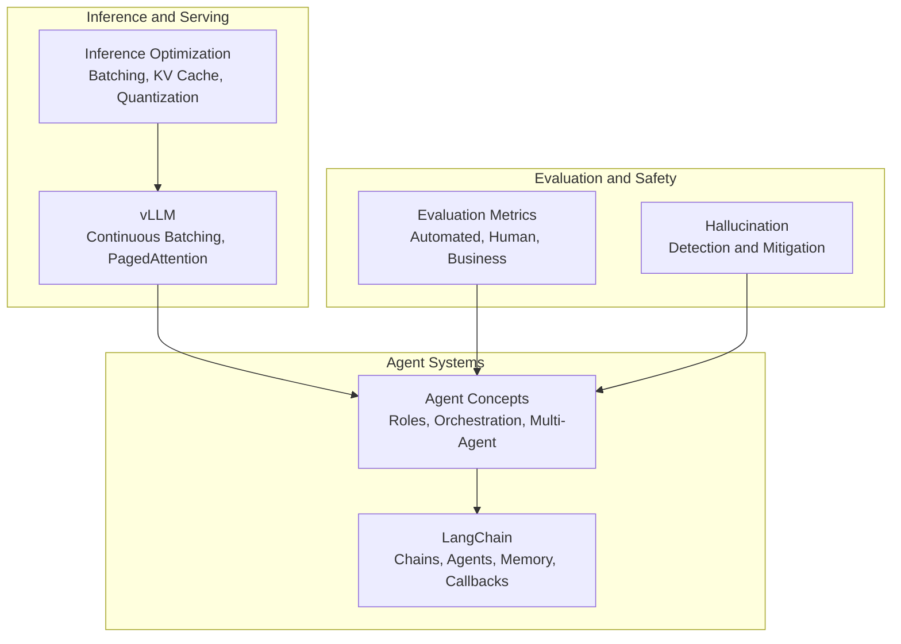
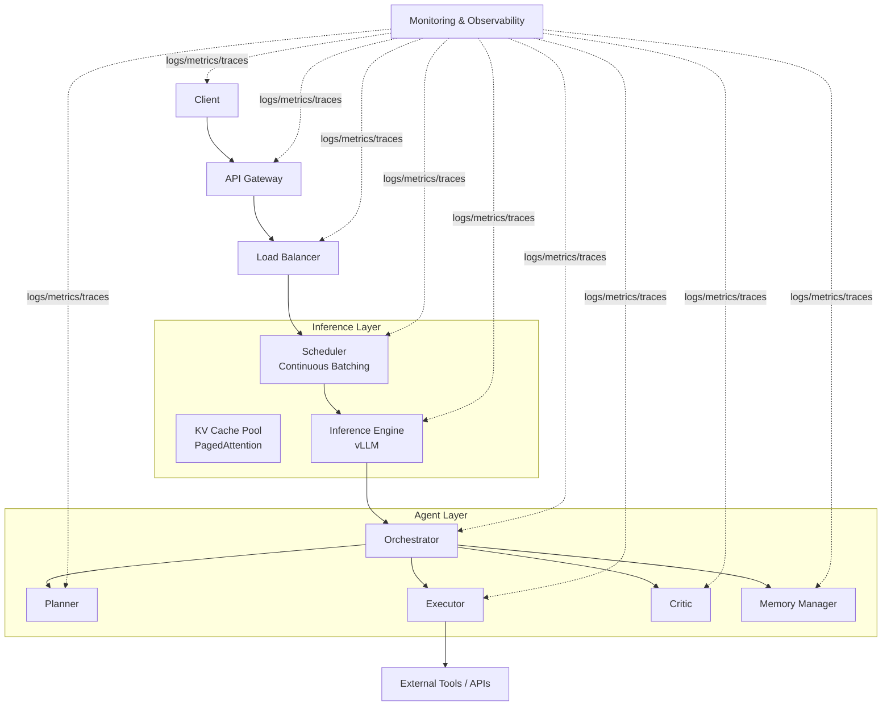
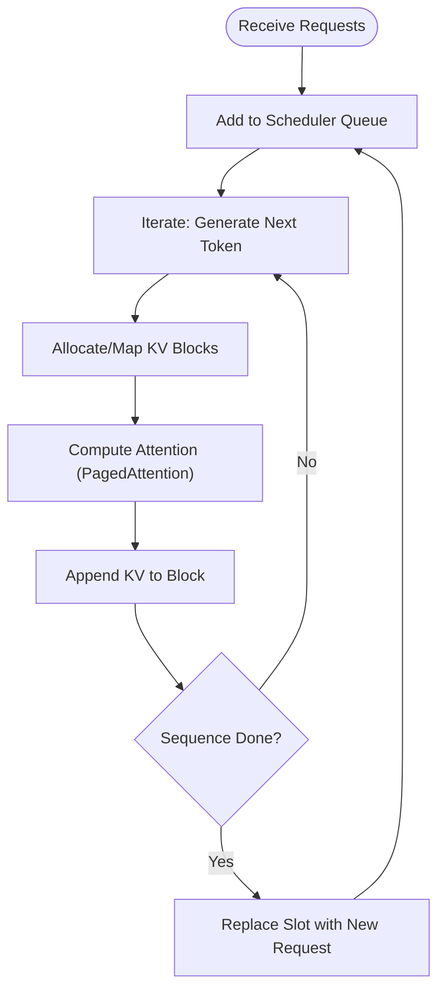
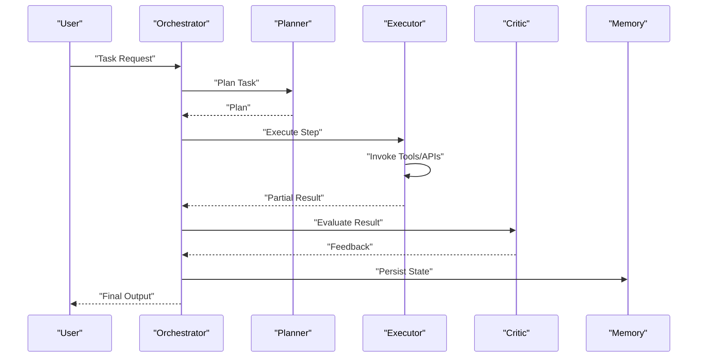
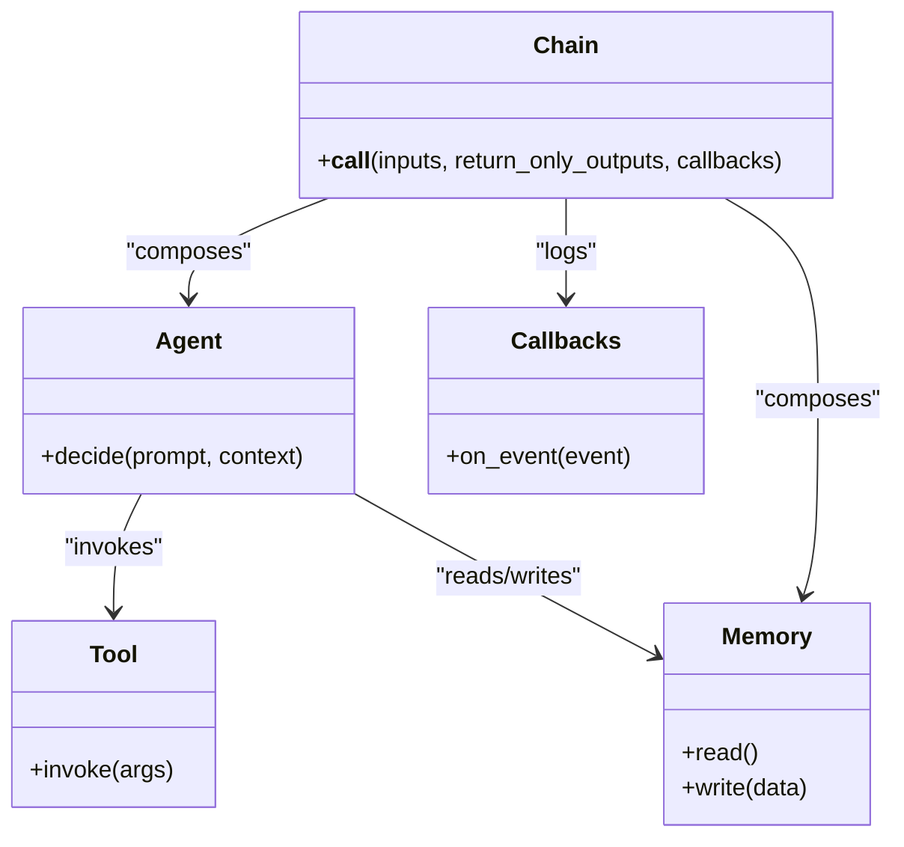
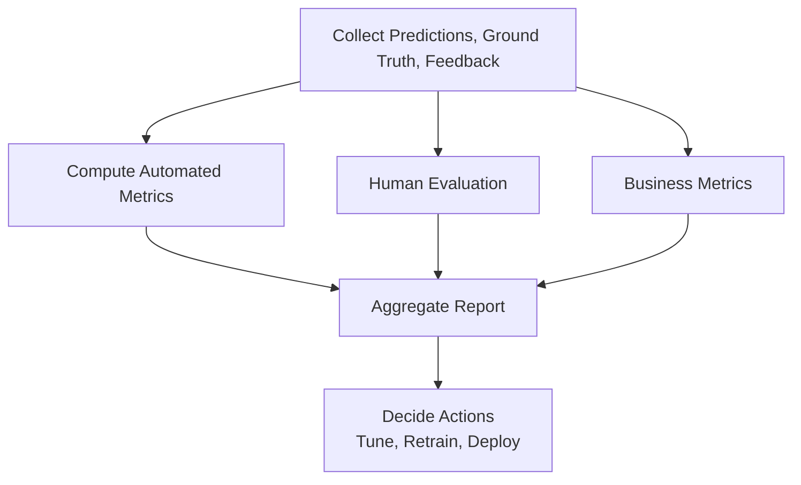
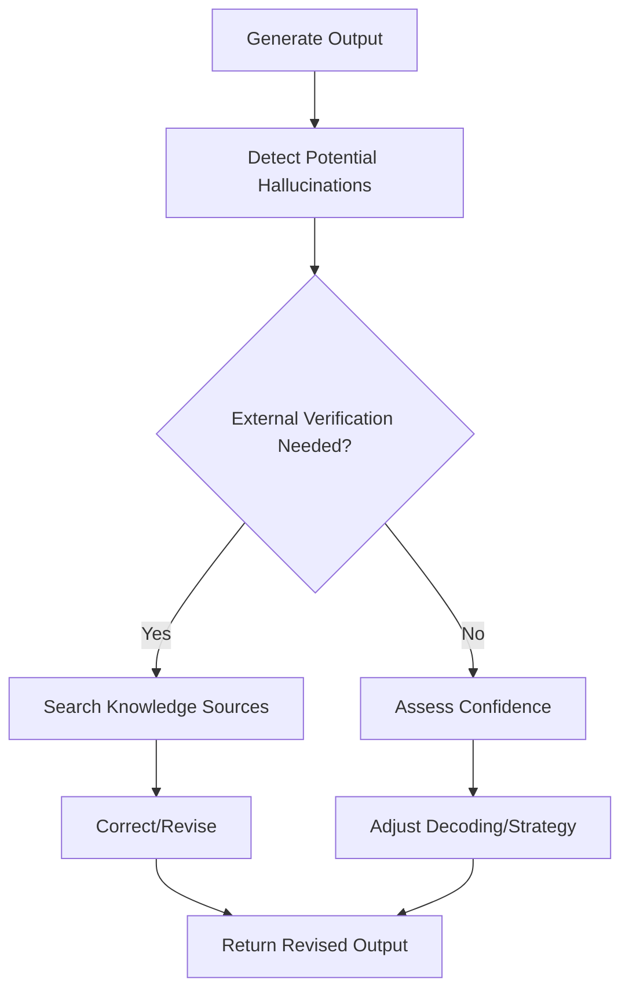
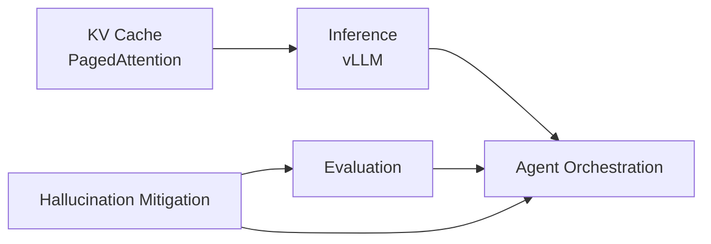

# Deployment and Evaluation

<cite>
**Referenced Files in This Document**
- [06.推理/1.vllm/1.vllm.md](file://06.推理/1.vllm/1.vllm.md)
- [06.推理/llm推理优化技术/llm推理优化技术.md](file://06.推理/llm推理优化技术/llm推理优化技术.md)
- [08.检索增强rag/大模型agent技术/大模型agent技术.md](file://08.检索增强rag/大模型agent技术/大模型agent技术.md)
- [09.大语言模型评估/1.评测/1.评测.md](file://09.大语言模型评估/1.评测/1.评测.md)
- [09.大语言模型评估/1.大模型幻觉/1.大模型幻觉.md](file://09.大语言模型评估/1.大模型幻觉/1.大模型幻觉.md)
- [09.大语言模型评估/2.幻觉来源与缓解/2.幻觉来源与缓解.md](file://09.大语言模型评估/2.幻觉来源与缓解/2.幻觉来源与缓解.md)
- [10.大语言模型应用/1.langchain/1.langchain.md](file://10.大语言模型应用/1.langchain/1.langchain.md)
- [ai_generataion/中级LLM_Agent工程师面试QA清单.md](file://ai_generataion/中级LLM_Agent工程师面试QA清单.md)
- [ai_generataion/中级LLM_Agent工程师面试_快速参考.md](file://ai_generataion/中级LLM_Agent工程师面试_快速参考.md)
</cite>

## Table of Contents
1. [Introduction](#introduction)
2. [Project Structure](#project-structure)
3. [Core Components](#core-components)
4. [Architecture Overview](#architecture-overview)
5. [Detailed Component Analysis](#detailed-component-analysis)
6. [Dependency Analysis](#dependency-analysis)
7. [Performance Considerations](#performance-considerations)
8. [Troubleshooting Guide](#troubleshooting-guide)
9. [Conclusion](#conclusion)
10. [Appendices](#appendices)

## Introduction
This document consolidates deployment and evaluation strategies for LLM agents and related systems, grounded in the repository’s materials. It covers:
- Agent deployment strategies and production considerations
- Evaluation frameworks for task completion, cost efficiency, and quality
- Safety, ethics, and risk mitigation
- Monitoring and observability patterns
- Single-agent and multi-agent deployment architectures, scalability, and infrastructure
- Reliability, fault tolerance, and recovery
- Benchmarks, testing strategies, and continuous improvement
- Governance, compliance, and regulatory considerations

## Project Structure
The repository organizes relevant knowledge across topics:
- Inference and serving (vLLM, batching, KV cache)
- Agent architectures and patterns (multi-agent, roles, orchestration)
- Evaluation and hallucination (metrics, detection, mitigation)
- LangChain components for building agents and chains
- Interview-focused summaries and design patterns

**Section sources**
- [06.推理/1.vllm/1.vllm.md:1-220](file://06.推理/1.vllm/1.vllm.md#L1-L220)
- [06.推理/llm推理优化技术/llm推理优化技术.md:1-271](file://06.推理/llm推理优化技术/llm推理优化技术.md#L1-L271)
- [08.检索增强rag/大模型agent技术/大模型agent技术.md:1-483](file://08.检索增强rag/大模型agent技术/大模型agent技术.md#L1-L483)
- [10.大语言模型应用/1.langchain/1.langchain.md:1-417](file://10.大语言模型应用/1.langchain/1.langchain.md#L1-L417)
- [09.大语言模型评估/1.评测/1.评测.md:1-43](file://09.大语言模型评估/1.评测/1.评测.md#L1-L43)
- [09.大语言模型评估/1.大模型幻觉/1.大模型幻觉.md:1-109](file://09.大语言模型评估/1.大模型幻觉/1.大模型幻觉.md#L1-L109)
- [09.大语言模型评估/2.幻觉来源与缓解/2.幻觉来源与缓解.md:1-193](file://09.大语言模型评估/2.幻觉来源与缓解/2.幻觉来源与缓解.md#L1-L193)

## Core Components
- Inference and Serving
  - Continuous batching and PagedAttention for throughput and memory efficiency
  - KV cache management and quantization
- Agent Architectures
  - Role-based orchestration (Planner, Executor, Critic, Memory)
  - Multi-agent collaboration and coordination
- Evaluation and Hallucination
  - Automated, human, and business metrics
  - Hallucination detection and mitigation strategies
- LangChain Integration
  - Chains, Agents, Memory, Callbacks for building and operating agents

**Section sources**
- [06.推理/1.vllm/1.vllm.md:55-151](file://06.推理/1.vllm/1.vllm.md#L55-L151)
- [06.推理/llm推理优化技术/llm推理优化技术.md:29-73](file://06.推理/llm推理优化技术/llm推理优化技术.md#L29-L73)
- [08.检索增强rag/大模型agent技术/大模型agent技术.md:88-113](file://08.检索增强rag/大模型agent技术/大模型agent技术.md#L88-L113)
- [09.大语言模型评估/1.评测/1.评测.md:31-43](file://09.大语言模型评估/1.评测/1.评测.md#L31-L43)
- [09.大语言模型评估/1.大模型幻觉/1.大模型幻觉.md:43-52](file://09.大语言模型评估/1.大模型幻觉/1.大模型幻觉.md#L43-L52)
- [10.大语言模型应用/1.langchain/1.langchain.md:17-27](file://10.大语言模型应用/1.langchain/1.langchain.md#L17-L27)

## Architecture Overview
High-level deployment architecture for single-agent and multi-agent systems:

**Diagram sources**
- [06.推理/1.vllm/1.vllm.md:55-151](file://06.推理/1.vllm/1.vllm.md#L55-L151)
- [08.检索增强rag/大模型agent技术/大模型agent技术.md:96-107](file://08.检索增强rag/大模型agent技术/大模型agent技术.md#L96-L107)

**Section sources**
- [06.推理/1.vllm/1.vllm.md:55-151](file://06.推理/1.vllm/1.vllm.md#L55-L151)
- [08.检索增强rag/大模型agent技术/大模型agent技术.md:96-107](file://08.检索增强rag/大模型agent技术/大模型agent技术.md#L96-L107)

## Detailed Component Analysis

### Inference and Serving: Continuous Batching and PagedAttention
- Continuous batching improves GPU utilization by immediately replacing finished sequences with new ones, reducing idle time.
- PagedAttention manages KV cache efficiently by storing logical blocks in non-contiguous physical memory, minimizing fragmentation and enabling larger batch sizes.

**Diagram sources**
- [06.推理/1.vllm/1.vllm.md:55-151](file://06.推理/1.vllm/1.vllm.md#L55-L151)

**Section sources**
- [06.推理/1.vllm/1.vllm.md:55-151](file://06.推理/1.vllm/1.vllm.md#L55-L151)
- [06.推理/llm推理优化技术/llm推理优化技术.md:168-180](file://06.推理/llm推理优化技术/llm推理优化技术.md#L168-L180)

### Agent Orchestration and Roles
- Orchestrator decomposes tasks and coordinates roles.
- Planner formulates plans; Executor executes actions; Critic evaluates outcomes; Memory persists state across steps.

**Diagram sources**
- [08.检索增强rag/大模型agent技术/大模型agent技术.md:96-107](file://08.检索增强rag/大模型agent技术/大模型agent技术.md#L96-L107)

**Section sources**
- [08.检索增强rag/大模型agent技术/大模型agent技术.md:88-113](file://08.检索增强rag/大模型agent技术/大模型agent技术.md#L88-L113)

### LangChain Integration for Agents
- Chains compose components; Agents select actions; Memory persists context; Callbacks enable logging and streaming.

**Diagram sources**
- [10.大语言模型应用/1.langchain/1.langchain.md:17-27](file://10.大语言模型应用/1.langchain/1.langchain.md#L17-L27)
- [10.大语言模型应用/1.langchain/1.langchain.md:144-152](file://10.大语言模型应用/1.langchain/1.langchain.md#L144-L152)

**Section sources**
- [10.大语言模型应用/1.langchain/1.langchain.md:17-27](file://10.大语言模型应用/1.langchain/1.langchain.md#L17-L27)
- [10.大语言模型应用/1.langchain/1.langchain.md:144-152](file://10.大语言模型应用/1.langchain/1.langchain.md#L144-L152)

### Evaluation Frameworks
- Automated metrics: task-specific accuracy/recall/F1; text generation ROUGE/BLEU/METEOR; system latency/throughput/error rate.
- Human evaluation: relevance, fluency, usefulness; A/B tests and satisfaction surveys.
- Business metrics: retention, task completion rate, operational impact (e.g., reduced tickets).

**Diagram sources**
- [09.大语言模型评估/1.评测/1.评测.md:250-261](file://09.大语言模型评估/1.评测/1.评测.md#L250-L261)

**Section sources**
- [09.大语言模型评估/1.评测/1.评测.md:248-291](file://09.大语言模型评估/1.评测/1.评测.md#L248-L291)

### Hallucination Detection and Mitigation
- Types: intrinsic (contradicts source), extrinsic (unsupported by source).
- Detection: named entity matching, textual entailment, model-based scorers, QA-based checks, information extraction.
- Mitigation: external verification, decoding adjustments (e.g., factual nucleus), self-checking via multiple samples, post-hoc verification.

**Diagram sources**
- [09.大语言模型评估/1.大模型幻觉/1.大模型幻觉.md:43-52](file://09.大语言模型评估/1.大模型幻觉/1.大模型幻觉.md#L43-L52)
- [09.大语言模型评估/2.幻觉来源与缓解/2.幻觉来源与缓解.md:128-193](file://09.大语言模型评估/2.幻觉来源与缓解/2.幻觉来源与缓解.md#L128-L193)

**Section sources**
- [09.大语言模型评估/1.大模型幻觉/1.大模型幻觉.md:21-52](file://09.大语言模型评估/1.大模型幻觉/1.大模型幻觉.md#L21-L52)
- [09.大语言模型评估/2.幻觉来源与缓解/2.幻觉来源与缓解.md:128-193](file://09.大语言模型评估/2.幻觉来源与缓解/2.幻觉来源与缓解.md#L128-L193)

## Dependency Analysis
- Inference depends on efficient scheduling and KV cache management to maximize GPU utilization.
- Agent orchestration depends on reliable tool invocation and memory persistence.
- Evaluation depends on automated metrics, human assessment, and business KPIs.
- Hallucination mitigation influences both evaluation and agent trustworthiness.

**Diagram sources**
- [06.推理/1.vllm/1.vllm.md:55-151](file://06.推理/1.vllm/1.vllm.md#L55-L151)
- [08.检索增强rag/大模型agent技术/大模型agent技术.md:96-107](file://08.检索增强rag/大模型agent技术/大模型agent技术.md#L96-L107)
- [09.大语言模型评估/1.评测/1.评测.md:248-291](file://09.大语言模型评估/1.评测/1.评测.md#L248-L291)
- [09.大语言模型评估/1.大模型幻觉/1.大模型幻觉.md:43-52](file://09.大语言模型评估/1.大模型幻觉/1.大模型幻觉.md#L43-L52)

**Section sources**
- [06.推理/1.vllm/1.vllm.md:55-151](file://06.推理/1.vllm/1.vllm.md#L55-L151)
- [08.检索增强rag/大模型agent技术/大模型agent技术.md:96-107](file://08.检索增强rag/大模型agent技术/大模型agent技术.md#L96-L107)
- [09.大语言模型评估/1.评测/1.评测.md:248-291](file://09.大语言模型评估/1.评测/1.评测.md#L248-L291)
- [09.大语言模型评估/1.大模型幻觉/1.大模型幻觉.md:43-52](file://09.大语言模型评估/1.大模型幻觉/1.大模型幻觉.md#L43-L52)

## Performance Considerations
- Throughput and latency are constrained by memory bandwidth during decoding; continuous batching and PagedAttention improve utilization.
- KV cache management and quantization reduce memory footprint and increase effective batch sizes.
- Dynamic batching and speculative inference further enhance throughput under variable workloads.

**Section sources**
- [06.推理/1.vllm/1.vllm.md:34-81](file://06.推理/1.vllm/1.vllm.md#L34-L81)
- [06.推理/llm推理优化技术/llm推理优化技术.md:233-268](file://06.推理/llm推理优化技术/llm推理优化技术.md#L233-L268)

## Troubleshooting Guide
- Monitor latency, throughput, and error rates; track KV cache allocation and fragmentation; observe agent role interactions and tool invocation outcomes.
- Use callbacks/logging to capture intermediate states; implement health checks and auto-scaling.
- For hallucinations, deploy verification loops and decoding adjustments; maintain feedback pipelines for continuous improvement.

**Section sources**
- [10.大语言模型应用/1.langchain/1.langchain.md:153-156](file://10.大语言模型应用/1.langchain/1.langchain.md#L153-L156)
- [09.大语言模型评估/2.幻觉来源与缓解/2.幻觉来源与缓解.md:128-193](file://09.大语言模型评估/2.幻觉来源与缓解/2.幻觉来源与缓解.md#L128-L193)

## Conclusion
Production-grade agent deployment requires robust inference optimization (continuous batching, PagedAttention, KV cache management), clear agent orchestration with explicit roles and memory, comprehensive evaluation across automated, human, and business metrics, and strong safety and hallucination controls. Monitoring and observability are essential for reliability, while governance and compliance should guide tool use and data handling.

## Appendices

### Deployment Checklist
- Inference
  - Enable continuous batching and PagedAttention
  - Configure KV cache pools and monitor fragmentation
  - Apply quantization where appropriate
- Agent
  - Define roles and communication protocols
  - Implement memory and error handling
  - Integrate external tools with retries and fallbacks
- Evaluation
  - Automate metrics collection
  - Conduct human evaluations and A/B tests
  - Track business KPIs
- Safety
  - Add verification and correction loops
  - Tune decoding strategies to reduce hallucinations
  - Establish governance and audit trails

**Section sources**
- [06.推理/1.vllm/1.vllm.md:55-151](file://06.推理/1.vllm/1.vllm.md#L55-L151)
- [08.检索增强rag/大模型agent技术/大模型agent技术.md:96-107](file://08.检索增强rag/大模型agent技术/大模型agent技术.md#L96-L107)
- [09.大语言模型评估/1.评测/1.评测.md:248-291](file://09.大语言模型评估/1.评测/1.评测.md#L248-L291)
- [09.大语言模型评估/2.幻觉来源与缓解/2.幻觉来源与缓解.md:128-193](file://09.大语言模型评估/2.幻觉来源与缓解/2.幻觉来源与缓解.md#L128-L193)