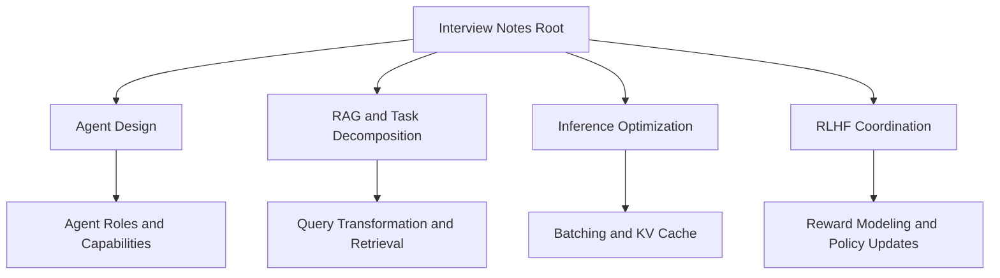
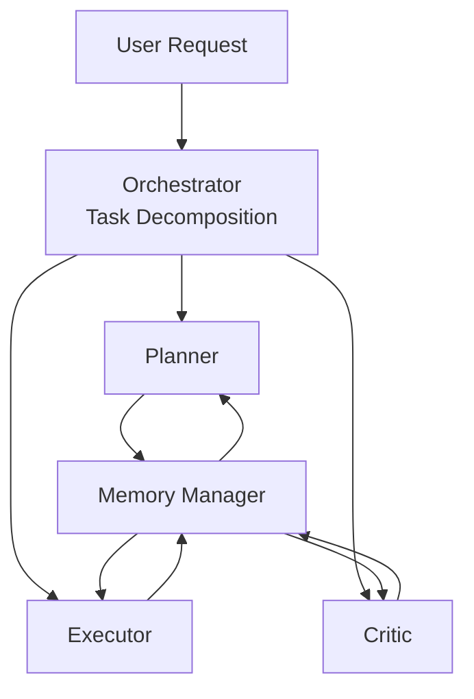
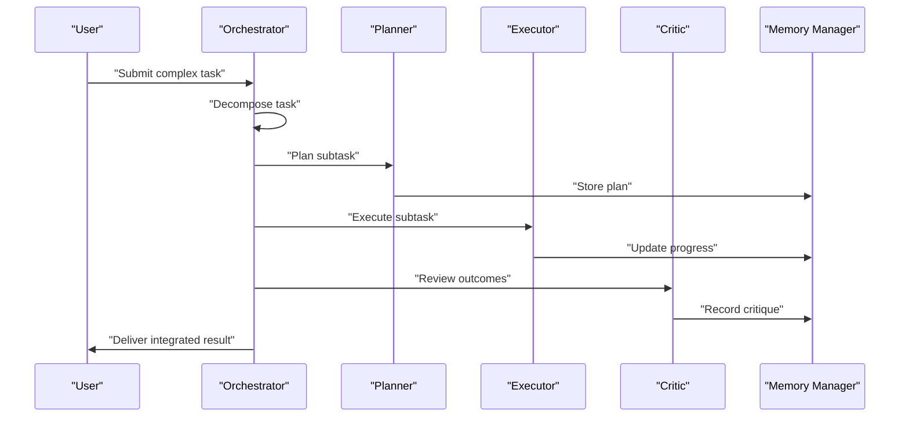
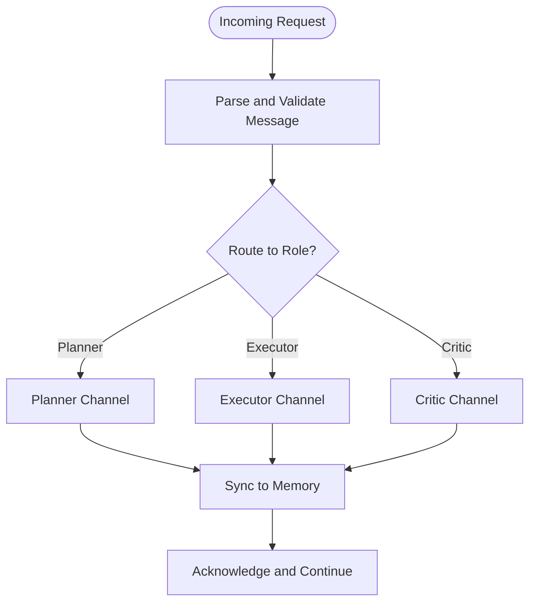
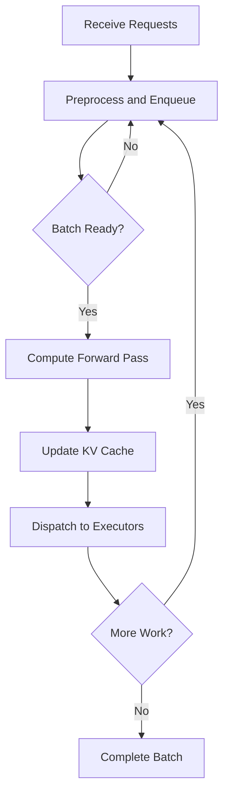
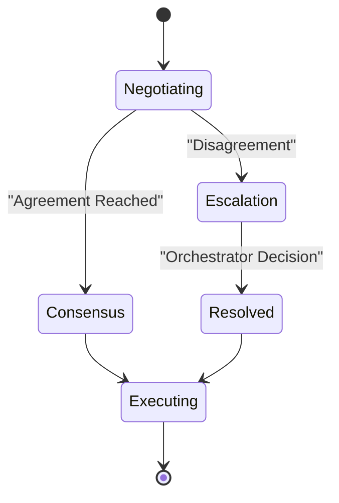
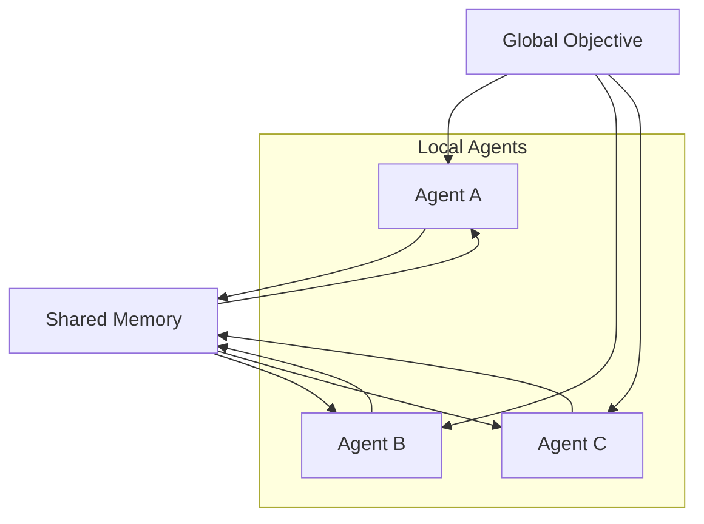
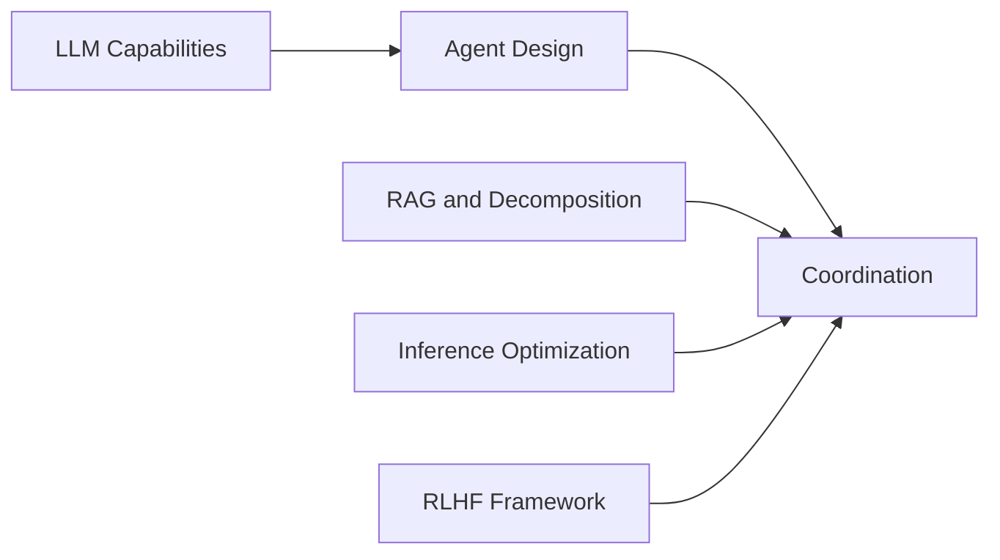

# Multi-Agent Systems

<cite>
**Referenced Files in This Document**
- [README.md](file://README.md)
- [中级LLM_Agent工程师面试QA清单.md](file://ai_generataion/中级LLM_Agent工程师面试QA清单.md)
- [中级LLM_Agent工程师面试_快速参考.md](file://ai_generataion/中级LLM_Agent工程师面试_快速参考.md)
- [1.rlhf相关.md](file://07.强化学习/1.rlhf相关/1.rlhf相关.md)
- [llm推理优化技术.md](file://06.推理/llm推理优化技术/llm推理优化技术.md)
- [检索增强llm.md](file://08.检索增强rag/检索增强llm/检索增强llm.md)
</cite>

## Table of Contents
1. [Introduction](#introduction)
2. [Project Structure](#project-structure)
3. [Core Components](#core-components)
4. [Architecture Overview](#architecture-overview)
5. [Detailed Component Analysis](#detailed-component-analysis)
6. [Dependency Analysis](#dependency-analysis)
7. [Performance Considerations](#performance-considerations)
8. [Troubleshooting Guide](#troubleshooting-guide)
9. [Conclusion](#conclusion)
10. [Appendices](#appendices)

## Introduction
This document synthesizes multi-agent architectures and collaborative systems grounded in the repository’s materials. It explains agent coordination mechanisms, communication protocols, and task distribution strategies, and documents collaboration patterns such as role assignment, task decomposition, and workflow orchestration. It also covers interaction models (negotiation, consensus building, conflict resolution), distributed problem-solving approaches, and emergent behavior patterns. Practical frameworks are provided for designing agent hierarchies, communication channels, and coordination mechanisms, with examples drawn from the repository’s materials and widely recognized multi-agent paradigms.

## Project Structure
The repository organizes knowledge around large language models (LLMs), reinforcement learning, retrieval-augmented generation (RAG), and practical interview preparation. For multi-agent systems, the most relevant materials include:
- Agent design fundamentals and roles
- RAG-based task decomposition and retrieval
- Inference optimization and batch scheduling
- Reinforcement learning from human feedback (RLHF) as a coordination paradigm

**Section sources**
- [README.md:1-169](file://README.md#L1-L169)

## Core Components
- Agent roles and capabilities: The repository defines agents as systems leveraging LLMs for reasoning, tool use, and autonomous behavior, with components including prompts, tools, interface, knowledge, and memory.
- Task-oriented vs conversational agents: Distinctions guide role assignment and workflow design.
- Orchestrator-driven collaboration: A central orchestrator decomposes tasks and coordinates specialized agents (planners, executors, critics) with shared memory.

These components form the foundation for designing multi-agent collaboration patterns.

**Section sources**
- [1.rlhf相关.md:122-156](file://07.强化学习/1.rlhf相关/1.rlhf相关.md#L122-L156)
- [中级LLM_Agent工程师面试QA清单.md:88-113](file://ai_generataion/中级LLM_Agent工程师面试QA清单.md#L88-L113)

## Architecture Overview
A typical multi-agent collaboration architecture centers on an orchestrator that performs task decomposition, followed by coordinated specialization among planner, executor, and critic agents, with a shared memory manager. Communication is message-based, with routing and protocol design ensuring reliable state synchronization and error handling.

**Diagram sources**
- [中级LLM_Agent工程师面试QA清单.md:96-107](file://ai_generataion/中级LLM_Agent工程师面试QA清单.md#L96-L107)

**Section sources**
- [中级LLM_Agent工程师面试QA清单.md:88-113](file://ai_generataion/中级LLM_Agent工程师面试QA清单.md#L88-L113)

## Detailed Component Analysis

### Agent Roles and Collaboration Patterns
- Role assignment: Assign specialized roles (planner, executor, critic) based on task characteristics and capability fit.
- Task decomposition: Break complex tasks into subtasks; leverage query transformation and multi-step decomposition to improve retrieval and generation quality.
- Workflow orchestration: Use an orchestrator to coordinate handoffs, manage dependencies, and maintain progress.

**Diagram sources**
- [中级LLM_Agent工程师面试QA清单.md:96-107](file://ai_generataion/中级LLM_Agent工程师面试QA清单.md#L96-L107)

**Section sources**
- [中级LLM_Agent工程师面试QA清单.md:88-113](file://ai_generataion/中级LLM_Agent工程师面试QA清单.md#L88-L113)
- [检索增强llm.md:332-354](file://08.检索增强rag/检索增强llm/检索增强llm.md#L332-L354)

### Communication Protocols and Message Routing
- Message format: Standardized payload including task context, subtask metadata, and status markers.
- Routing mechanism: Centralized routing via orchestrator; optional peer-to-peer channels for specialized agents when safe and bounded.
- Synchronization: Shared memory ensures consistent state across agents; versioning and timestamps prevent stale updates.

**Diagram sources**
- [中级LLM_Agent工程师面试QA清单.md:91-94](file://ai_generataion/中级LLM_Agent工程师面试QA清单.md#L91-L94)

**Section sources**
- [中级LLM_Agent工程师面试QA清单.md:91-94](file://ai_generataion/中级LLM_Agent工程师面试QA清单.md#L91-L94)

### Task Distribution Strategies
- Static vs dynamic distribution: Static distribution suits predictable workloads; dynamic distribution aligns with variable-length decoding and heterogeneous subtasks.
- Batch scheduling: Apply dynamic batching to improve throughput while avoiding head-of-line blocking.
- KV cache management: Efficiently manage KV caches per request to support long sequences and high concurrency.

**Diagram sources**
- [llm推理优化技术.md:29-86](file://06.推理/llm推理优化技术/llm推理优化技术.md#L29-L86)

**Section sources**
- [llm推理优化技术.md:29-86](file://06.推理/llm推理优化技术/llm推理优化技术.md#L29-L86)

### Interaction Models: Negotiation, Consensus, Conflict Resolution
- Negotiation: Iterative refinement through planner-critic loops; use query transformation to explore alternative interpretations and solutions.
- Consensus building: Shared memory stores evidence and rationales; agents vote or rank outcomes to converge on a solution.
- Conflict resolution: Hierarchical escalation to the orchestrator; fallback to predefined policies (e.g., majority vote, worst-case safety checks).

**Section sources**
- [检索增强llm.md:332-354](file://08.检索增强rag/检索增强llm/检索增强llm.md#L332-L354)
- [1.rlhf相关.md:100-121](file://07.强化学习/1.rlhf相关/1.rlhf相关.md#L100-L121)

### Distributed Problem-Solving and Emergent Behavior
- Emergent behavior emerges from local interactions governed by global objectives encoded in reward modeling and policy updates.
- Distributed problem-solving leverages modular agents with clear interfaces; shared memory enables emergent coordination without explicit global control.

**Section sources**
- [1.rlhf相关.md:100-121](file://07.强化学习/1.rlhf相关/1.rlhf相关.md#L100-L121)

### Examples and Implementations
- Conversational and task-oriented agents: Define roles and capabilities to suit domain needs.
- Orchestrator-based collaboration: Decompose tasks and coordinate specialized agents with shared memory.
- RAG-driven task decomposition: Use query transformation and multi-step decomposition to improve retrieval quality and downstream generation.

**Section sources**
- [1.rlhf相关.md:146-156](file://07.强化学习/1.rlhf相关/1.rlhf相关.md#L146-L156)
- [中级LLM_Agent工程师面试QA清单.md:88-113](file://ai_generataion/中级LLM_Agent工程师面试QA清单.md#L88-L113)
- [检索增强llm.md:332-354](file://08.检索增强rag/检索增强llm/检索增强llm.md#L332-L354)

## Dependency Analysis
- Agent design depends on LLM capabilities, prompt engineering, and tool integration.
- Task decomposition relies on retrieval quality and query transformation.
- Inference optimization underpins throughput and latency for multi-agent workflows.
- RLHF provides a framework for coordination via reward modeling and policy updates.

**Section sources**
- [中级LLM_Agent工程师面试QA清单.md:88-113](file://ai_generataion/中级LLM_Agent工程师面试QA清单.md#L88-L113)
- [llm推理优化技术.md:29-86](file://06.推理/llm推理优化技术/llm推理优化技术.md#L29-L86)
- [1.rlhf相关.md:100-121](file://07.强化学习/1.rlhf相关/1.rlhf相关.md#L100-L121)

## Performance Considerations
- Throughput and latency: Use dynamic batching and efficient KV cache management to sustain high concurrency.
- Memory footprint: Optimize KV cache allocation and paging to reduce fragmentation and waste.
- Scalability: Combine orchestration with modular agents to distribute workload and avoid bottlenecks.

Practical tips:
- Prefer dynamic batching over static batching for variable-length requests.
- Implement KV cache pooling and paged attention to manage long sequences efficiently.
- Monitor queue depths and completion latencies to detect backpressure.

**Section sources**
- [llm推理优化技术.md:29-86](file://06.推理/llm推理优化技术/llm推理优化技术.md#L29-L86)
- [llm推理优化技术.md:168-179](file://06.推理/llm推理优化技术/llm推理优化技术.md#L168-L179)

## Troubleshooting Guide
Common issues and remedies:
- Deadlocks: Use timeouts, non-blocking queues, and deterministic handoff protocols; avoid cycles in agent dependencies.
- Memory pressure: Tune KV cache sizes, enable paging, and monitor utilization; cap batch sizes to prevent out-of-memory conditions.
- Inconsistent state: Employ versioned memory entries and strict acknowledgment semantics; reconcile divergences via the orchestrator.
- Evaluation and monitoring: Track latency, throughput, error rates, and user satisfaction metrics; establish alerting thresholds.

**Section sources**
- [中级LLM_Agent工程师面试QA清单.md:83-87](file://ai_generataion/中级LLM_Agent工程师面试QA清单.md#L83-L87)
- [中级LLM_Agent工程师面试QA清单.md:287-291](file://ai_generataion/中级LLM_Agent工程师面试QA清单.md#L287-L291)

## Conclusion
This document outlined a practical blueprint for multi-agent systems grounded in the repository’s materials. By combining agent role design, orchestrator-driven task decomposition, robust communication protocols, and efficient inference optimization, teams can build scalable, resilient, and high-performing collaborative systems. RLHF offers a principled framework for coordination through reward modeling and policy updates, while RAG enhances retrieval quality to support complex, multi-step workflows.

## Appendices
- Agent design checklist:
  - Define roles and capabilities
  - Establish communication protocols and routing
  - Implement shared memory and synchronization
  - Plan error handling and retry strategies
- Performance tuning checklist:
  - Enable dynamic batching
  - Optimize KV cache management
  - Monitor and alert on key metrics
  - Scale horizontally with orchestration