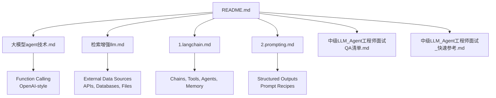
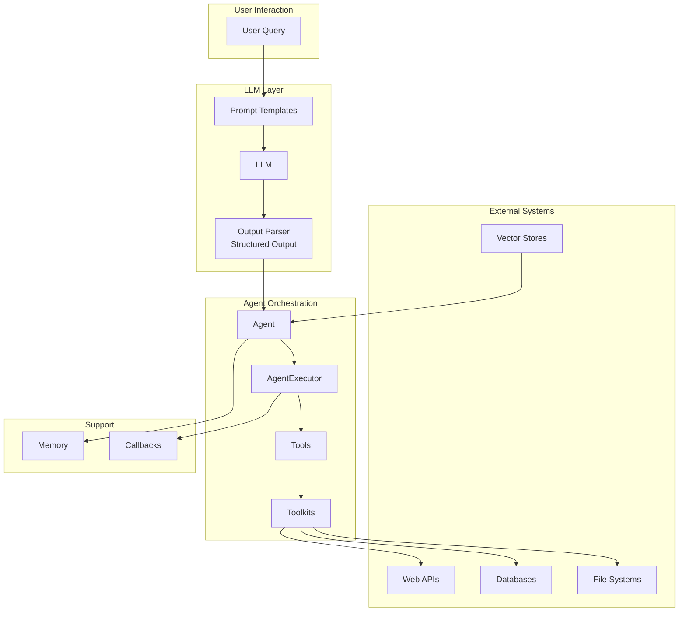
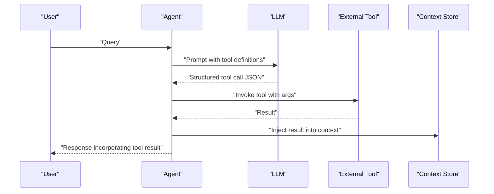
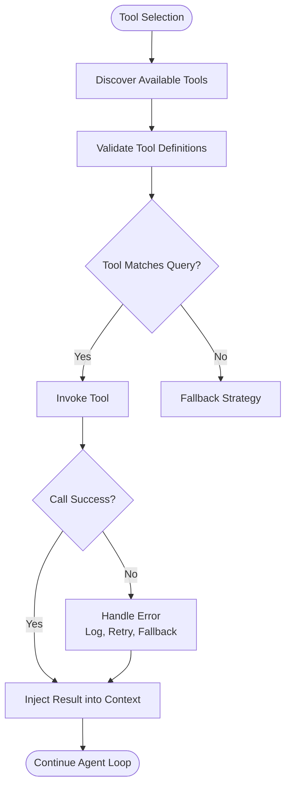
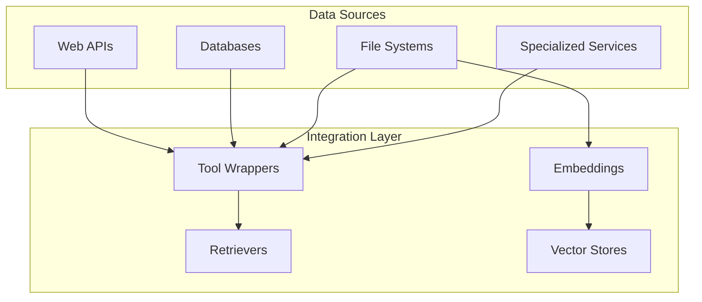
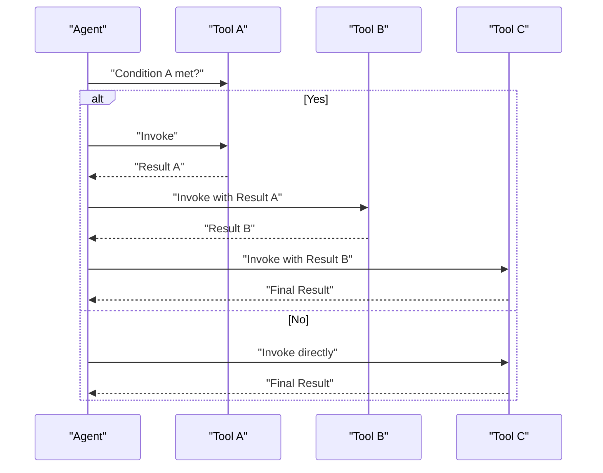
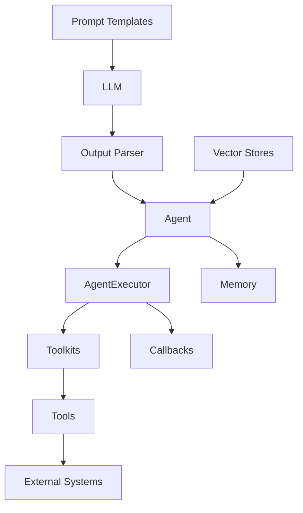

# Tool Integration and Function Calling

<cite>
**Referenced Files in This Document**
- [大模型agent技术.md](file://08.检索增强rag/大模型agent技术/大模型agent技术.md)
- [检索增强llm.md](file://08.检索增强rag/检索增强llm/检索增强llm.md)
- [1.langchain.md](file://10.大语言模型应用/1.langchain/1.langchain.md)
- [2.prompting.md](file://05.有监督微调/2.prompting/2.prompting.md)
- [README.md](file://README.md)
- [中级LLM_Agent工程师面试QA清单.md](file://ai_generataion/中级LLM_Agent工程师面试QA清单.md)
- [中级LLM_Agent工程师面试_快速参考.md](file://ai_generataion/中级LLM_Agent工程师面试_快速参考.md)
</cite>

## Table of Contents
1. [Introduction](#introduction)
2. [Project Structure](#project-structure)
3. [Core Components](#core-components)
4. [Architecture Overview](#architecture-overview)
5. [Detailed Component Analysis](#detailed-component-analysis)
6. [Dependency Analysis](#dependency-analysis)
7. [Performance Considerations](#performance-considerations)
8. [Troubleshooting Guide](#troubleshooting-guide)
9. [Conclusion](#conclusion)
10. [Appendices](#appendices)

## Introduction
This document explains tool integration and function calling mechanisms in LLM agents, focusing on external API integration patterns, function calling protocols, and tool selection strategies. It traces the evolution from basic prompt engineering to sophisticated tool usage, including OpenAI’s function calling, custom tool development, and API orchestration. It covers tool discovery, validation, and error handling; integration patterns for web APIs, databases, file systems, and specialized services; examples of tool composition, chaining operations, and conditional execution; and security, rate limiting, and reliability patterns. Implementation guides are provided for creating custom tools, handling asynchronous operations, and managing tool dependencies.

## Project Structure
The repository organizes materials around LLM fundamentals, architectures, prompting, retrieval-augmented generation (RAG), and agent technologies. Relevant topics for tool integration and function calling include:
- Agent technologies and function calling evolution
- Retrieval-augmented generation (RAG) and external data integration
- LangChain framework components for chains, agents, tools, and memory
- Prompting techniques that enable tool invocation and structured outputs
- Interview-focused materials covering system design and practical implementation

**Diagram sources**
- [README.md:1-169](file://README.md#L1-L169)
- [大模型agent技术.md:1-483](file://08.检索增强rag/大模型agent技术/大模型agent技术.md#L1-L483)
- [检索增强llm.md:1-526](file://08.检索增强rag/检索增强llm/检索增强llm.md#L1-L526)
- [1.langchain.md:1-417](file://10.大语言模型应用/1.langchain/1.langchain.md#L1-L417)
- [2.prompting.md:1-173](file://05.有监督微调/2.prompting/2.prompting.md#L1-L173)
- [中级LLM_Agent工程师面试QA清单.md:1-343](file://ai_generataion/中级LLM_Agent工程师面试QA清单.md#L1-L343)
- [中级LLM_Agent工程师面试_快速参考.md:1-66](file://ai_generataion/中级LLM_Agent工程师面试_快速参考.md#L1-L66)

**Section sources**
- [README.md:1-169](file://README.md#L1-L169)

## Core Components
- Agent and tooling: Agents decide actions and orchestrate tools; tools encapsulate external capabilities; toolkits group related tools; executors run agents and manage tool invocations.
- Retrieval-augmented generation (RAG): Integrates external knowledge sources (web APIs, databases, files) to enhance model outputs and reduce hallucinations.
- Prompt engineering: Structured prompts guide models to produce structured outputs suitable for tool invocation and validation.
- LangChain components: Provide standardized abstractions for chains, agents, tools, memory, and callbacks to build robust integrations.

**Section sources**
- [1.langchain.md:144-151](file://10.大语言模型应用/1.langchain/1.langchain.md#L144-L151)
- [检索增强llm.md:81-118](file://08.检索增强rag/检索增强llm/检索增强llm.md#L81-L118)
- [2.prompting.md:75-173](file://05.有监督微调/2.prompting/2.prompting.md#L75-L173)

## Architecture Overview
The architecture integrates LLMs with external systems through tools and retrievers. At a high level:
- Prompt templates and structured outputs guide the model to emit tool requests.
- Agents interpret model outputs, select tools, and orchestrate API calls.
- Retrievers and external data sources provide context to improve accuracy and freshness.
- Memory persists state across turns for continuity.
- Callbacks monitor and stream intermediate steps for observability.

**Diagram sources**
- [1.langchain.md:144-151](file://10.大语言模型应用/1.langchain/1.langchain.md#L144-L151)
- [检索增强llm.md:332-380](file://08.检索增强rag/检索增强llm/检索增强llm.md#L332-L380)
- [大模型agent技术.md:118-121](file://08.检索增强rag/大模型agent技术/大模型agent技术.md#L118-L121)

## Detailed Component Analysis

### Function Calling Protocols and OpenAI-Style Integration
- Function calling enables models to emit structured JSON describing tool invocations, including tool names and arguments.
- The protocol typically includes:
  - Tool definitions (names, descriptions, parameters)
  - Model-generated tool call payloads
  - Execution and result injection back into the model’s context
- This pattern improves reliability, reduces hallucinations, and standardizes tool orchestration.

**Diagram sources**
- [大模型agent技术.md:118-121](file://08.检索增强rag/大模型agent技术/大模型agent技术.md#L118-L121)

**Section sources**
- [大模型agent技术.md:118-121](file://08.检索增强rag/大模型agent技术/大模型agent技术.md#L118-L121)

### Tool Discovery, Validation, and Error Handling
- Discovery: Toolkits expose curated sets of tools; agents introspect available tools and select based on query semantics.
- Validation: Output parsers enforce structured formats; schema validation ensures tool arguments conform to definitions.
- Error handling: Failures are captured, logged, and surfaced to the model; retries and fallbacks can be implemented; observability via callbacks.

**Diagram sources**
- [1.langchain.md:144-151](file://10.大语言模型应用/1.langchain/1.langchain.md#L144-L151)

**Section sources**
- [1.langchain.md:144-151](file://10.大语言模型应用/1.langchain/1.langchain.md#L144-L151)

### Integration Patterns for Web APIs, Databases, File Systems, and Specialized Services
- Web APIs: Wrap endpoints as tools; validate inputs, handle rate limits, and transform responses into structured formats.
- Databases: Use retrievers and vector stores to index and retrieve relevant records; combine with SQL or ORM tools for precise queries.
- File Systems: Load documents, parse metadata, embed chunks, and integrate with retrieval chains for contextual answers.
- Specialized Services: Integrate calculators, translation engines, or planning systems as tools; compose multiple tools for complex workflows.

**Diagram sources**
- [检索增强llm.md:89-118](file://08.检索增强rag/检索增强llm/检索增强llm.md#L89-L118)
- [检索增强llm.md:181-220](file://08.检索增强rag/检索增强llm/检索增强llm.md#L181-L220)

**Section sources**
- [检索增强llm.md:89-118](file://08.检索增强rag/检索增强llm/检索增强llm.md#L89-L118)
- [检索增强llm.md:181-220](file://08.检索增强rag/检索增强llm/检索增强llm.md#L181-L220)

### Tool Composition, Chaining Operations, and Conditional Execution
- Composition: Combine multiple tools to achieve complex goals; orchestrate order and dependencies.
- Chaining: Use chains to connect prompts, LLMs, and tools; pass outputs as inputs to subsequent steps.
- Conditional execution: Evaluate tool availability and context before invoking; switch between tools based on conditions.

**Diagram sources**
- [1.langchain.md:106-125](file://10.大语言模型应用/1.langchain/1.langchain.md#L106-L125)

**Section sources**
- [1.langchain.md:106-125](file://10.大语言模型应用/1.langchain/1.langchain.md#L106-L125)

### Security Considerations, Rate Limiting, and Reliability Patterns
- Security: Validate inputs, sanitize tool arguments, restrict tool capabilities, and enforce least privilege; log sensitive data carefully.
- Rate limiting: Apply quotas, backoff strategies, and circuit breakers; cache results where safe.
- Reliability: Implement timeouts, retries, circuit breakers, and fallbacks; monitor failures and degrade gracefully.

**Section sources**
- [检索增强llm.md:332-380](file://08.检索增强rag/检索增强llm/检索增强llm.md#L332-L380)

### Implementation Guides
- Creating custom tools:
  - Define tool signatures and schemas; implement wrappers for external services; register tools in toolkits.
  - Use output parsers to enforce structured results; validate inputs rigorously.
- Asynchronous operations:
  - Use async clients for external APIs; queue and batch operations; handle concurrency safely.
- Managing tool dependencies:
  - Encapsulate dependencies behind interfaces; inject dependencies via constructors; support hot-swapping and testing.

**Section sources**
- [1.langchain.md:144-151](file://10.大语言模型应用/1.langchain/1.langchain.md#L144-L151)
- [检索增强llm.md:332-380](file://08.检索增强rag/检索增强llm/检索增强llm.md#L332-L380)

## Dependency Analysis
The agent ecosystem depends on:
- Prompt templates and structured outputs to drive tool invocation
- Toolkits and tool registries to discover and validate capabilities
- Retrievers and vector stores to enrich context from external sources
- Memory and callbacks to persist state and observe execution

**Diagram sources**
- [1.langchain.md:144-151](file://10.大语言模型应用/1.langchain/1.langchain.md#L144-L151)
- [检索增强llm.md:332-380](file://08.检索增强rag/检索增强llm/检索增强llm.md#L332-L380)

**Section sources**
- [1.langchain.md:144-151](file://10.大语言模型应用/1.langchain/1.langchain.md#L144-L151)
- [检索增强llm.md:332-380](file://08.检索增强rag/检索增强llm/检索增强llm.md#L332-L380)

## Performance Considerations
- Minimize unnecessary tool calls; cache results where safe.
- Batch retrievals and tool invocations; apply dynamic batching and backpressure.
- Monitor latency and throughput; tune embedding and retrieval parameters.
- Use streaming responses and incremental updates to improve perceived performance.

[No sources needed since this section provides general guidance]

## Troubleshooting Guide
- Tool invocation failures: Log errors, capture response payloads, and implement retry/backoff; surface actionable messages to the model.
- Hallucinations and incorrect tool usage: Improve prompt templates, add examples, and constrain outputs with schemas.
- Latency spikes: Profile retrievers and external APIs; optimize embeddings and vector indexing; apply caching and pre-warming.

**Section sources**
- [检索增强llm.md:332-380](file://08.检索增强rag/检索增强llm/检索增强llm.md#L332-L380)

## Conclusion
Effective tool integration and function calling in LLM agents hinges on structured prompts, validated tool schemas, robust orchestration, and resilient external integrations. By combining retrieval-augmented generation, agent-driven tool selection, and disciplined error handling, systems can reliably automate complex workflows while maintaining safety, performance, and reliability.

[No sources needed since this section summarizes without analyzing specific files]

## Appendices

### Appendix A: From Prompt Engineering to Tool Usage
- Evolution: Prompt engineering → Prompt chains/flows → Agents → Multi-agent systems.
- Function calling: Standardized JSON payloads emitted by models to invoke tools.
- Structured outputs: Prompts and parsers ensure consistent tool invocation formats.

**Section sources**
- [大模型agent技术.md:37-118](file://08.检索增强rag/大模型agent技术/大模型agent技术.md#L37-L118)
- [2.prompting.md:75-173](file://05.有监督微调/2.prompting/2.prompting.md#L75-L173)

### Appendix B: System Design References
- High-concurrency inference, dynamic batching, KV cache pooling, and monitoring patterns are covered in the interview materials.

**Section sources**
- [中级LLM_Agent工程师面试QA清单.md:55-131](file://ai_generataion/中级LLM_Agent工程师面试QA清单.md#L55-L131)
- [中级LLM_Agent工程师面试_快速参考.md:21-37](file://ai_generataion/中级LLM_Agent工程师面试_快速参考.md#L21-L37)