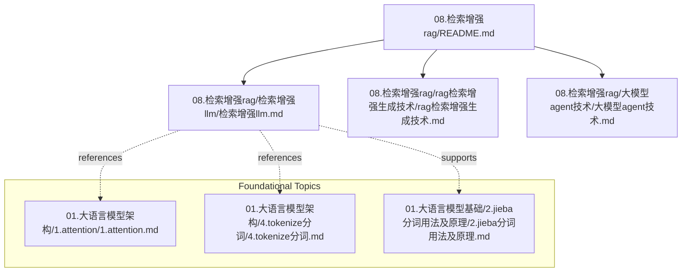
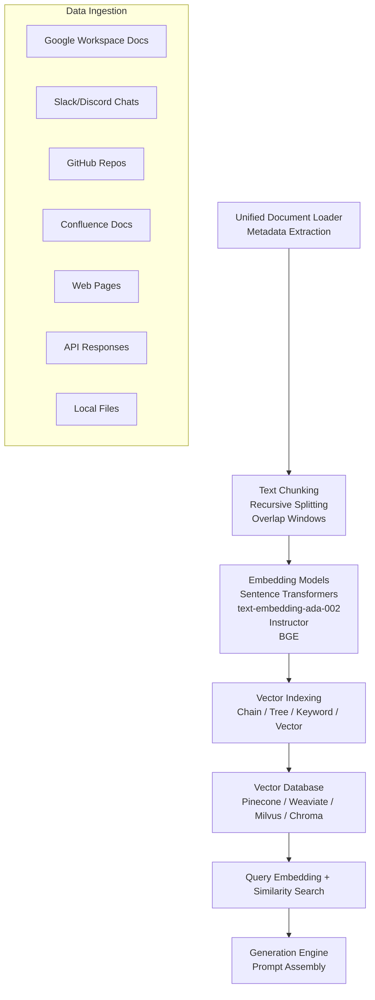
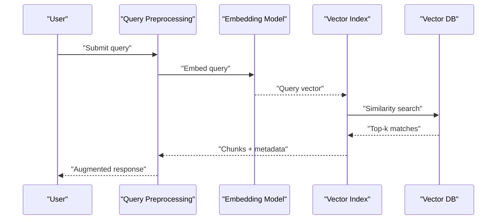
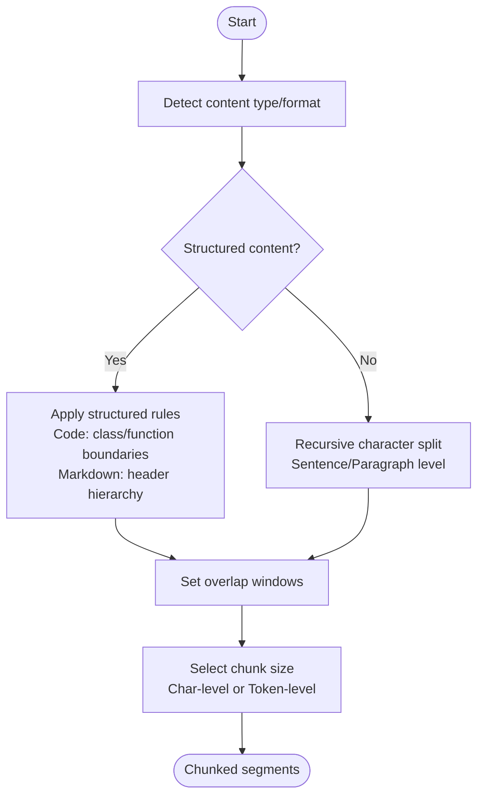

# Data Processing Pipeline

<cite>
**Referenced Files in This Document**
- [08.检索增强rag/README.md](file://08.检索增强rag/README.md)
- [08.检索增强rag/检索增强llm/检索增强llm.md](file://08.检索增强rag/检索增强llm/检索增强llm.md)
- [08.检索增强rag/rag（检索增强生成）技术/rag（检索增强生成）技术.md](file://08.检索增强rag/rag（检索增强生成）技术/rag（检索增强生成）技术.md)
- [08.检索增强rag/大模型agent技术/大模型agent技术.md](file://08.检索增强rag/大模型agent技术/大模型agent技术.md)
- [01.大语言模型基础/2.jieba分词用法及原理/2.jieba分词用法及原理.md](file://01.大语言模型基础/2.jieba分词用法及原理/2.jieba分词用法及原理.md)
- [01.大语言模型架构/1.attention/1.attention.md](file://01.大语言模型架构/1.attention/1.attention.md)
- [01.大语言模型架构/4.tokenize分词/4.tokenize分词.md](file://01.大语言模型架构/4.tokenize分词/4.tokenize分词.md)
</cite>

## Table of Contents
1. [Introduction](#introduction)
2. [Project Structure](#project-structure)
3. [Core Components](#core-components)
4. [Architecture Overview](#architecture-overview)
5. [Detailed Component Analysis](#detailed-component-analysis)
6. [Dependency Analysis](#dependency-analysis)
7. [Performance Considerations](#performance-considerations)
8. [Troubleshooting Guide](#troubleshooting-guide)
9. [Conclusion](#conclusion)
10. [Appendices](#appendices)

## Introduction
This document focuses on the data processing pipeline component of Retrieval-Augmented Generation (RAG) systems. It consolidates the repository’s coverage of RAG fundamentals, chunking strategies, metadata handling, embedding models, indexing methods, and vector database integration. It also provides practical implementation guidance using LangChain and LlamaIndex, along with optimization strategies for large-scale deployments.

## Project Structure
The RAG-related materials are organized under the “08.检索增强rag” directory, with supporting foundational knowledge in tokenization, attention, and keyword extraction scattered across the “大语言模型基础” and “大语言模型架构” directories. The following diagram maps the primary RAG content and related topics.

**Diagram sources**
- [08.检索增强rag/README.md:1-14](file://08.检索增强rag/README.md#L1-L14)
- [08.检索增强rag/检索增强llm/检索增强llm.md:1-526](file://08.检索增强rag/检索增强llm/检索增强llm.md#L1-L526)
- [08.检索增强rag/rag（检索增强生成）技术/rag（检索增强生成）技术.md:1-73](file://08.检索增强rag/rag（检索增强生成）技术/rag（检索增强生成）技术.md#L1-L73)
- [08.检索增强rag/大模型agent技术/大模型agent技术.md:1-483](file://08.检索增强rag/大模型agent技术/大模型agent技术.md#L1-L483)
- [01.大语言模型架构/1.attention/1.attention.md:159-484](file://01.大语言模型架构/1.attention/1.attention.md#L159-L484)
- [01.大语言模型架构/4.tokenize分词/4.tokenize分词.md:13-17](file://01.大语言模型架构/4.tokenize分词/4.tokenize分词.md#L13-L17)
- [01.大语言模型基础/2.jieba分词用法及原理/2.jieba分词用法及原理.md:188-236](file://01.大语言模型基础/2.jieba分词用法及原理/2.jieba分词用法及原理.md#L188-L236)

**Section sources**
- [08.检索增强rag/README.md:1-14](file://08.检索增强rag/README.md#L1-L14)

## Core Components
- Data ingestion from multiple sources: Google Workspace documents, Slack/Discord chats, GitHub repositories, Confluence docs, web pages, APIs, and local files.
- Text chunking strategies: sentence-level, paragraph-level, recursive character splitting with overlap, and specialized handling for structured content (code, Markdown).
- Metadata extraction: timestamps, keywords, entities, summaries, and classifications.
- Vector embedding models: Sentence Transformers, OpenAI text-embedding-ada-002, Instructor, BGE; selection criteria and trade-offs.
- Indexing methods: chain, tree, keyword table, and vector indices; use cases and performance characteristics.
- Practical frameworks: LangChain and LlamaIndex integration.
- Vector database integration: Pinecone, Weaviate, Milvus, Chroma.
- Optimization strategies for large-scale deployments.

**Section sources**
- [08.检索增强rag/检索增强llm/检索增强llm.md:91-120](file://08.检索增强rag/检索增强llm/检索增强llm.md#L91-L120)
- [08.检索增强rag/检索增强llm/检索增强llm.md:122-179](file://08.检索增强rag/检索增强llm/检索增强llm.md#L122-L179)
- [08.检索增强rag/检索增强llm/检索增强llm.md:181-330](file://08.检索增强rag/检索增强llm/检索增强llm.md#L181-L330)
- [08.检索增强rag/rag（检索增强生成）技术/rag（检索增强生成）技术.md:39-73](file://08.检索增强rag/rag（检索增强生成）技术/rag（检索增强生成）技术.md#L39-L73)

## Architecture Overview
The RAG data processing pipeline transforms heterogeneous external data into a unified document model, applies chunking and metadata extraction, generates dense vector embeddings, and stores them in a vector database. Queries are embedded similarly and matched against stored vectors to retrieve relevant chunks for generation.

**Diagram sources**
- [08.检索增强rag/检索增强llm/检索增强llm.md:91-120](file://08.检索增强rag/检索增强llm/检索增强llm.md#L91-L120)
- [08.检索增强rag/检索增强llm/检索增强llm.md:122-179](file://08.检索增强rag/检索增强llm/检索增强llm.md#L122-L179)
- [08.检索增强rag/检索增强llm/检索增强llm.md:181-330](file://08.检索增强rag/检索增强llm/检索增强llm.md#L181-L330)

## Detailed Component Analysis

### Data Ingestion from Multiple Sources
- Supported sources include Google Workspace (Docs, Sheets, Slides, Calendar, Drive), Slack/Discord chats, GitHub/GitLab repositories, Confluence docs, web pages, API responses, and local files.
- Formats span plain text, tables, presentations, code, and structured formats (txt, csv, pdf, markdown, json).
- Multilingual and multimodal support is acknowledged; current focus is on textual modalities.

Implementation pointers:
- Use framework connectors to normalize diverse sources into a unified document object with metadata.
- Apply source-specific parsers and normalization steps to unify content types.

**Section sources**
- [08.检索增强rag/检索增强llm/检索增强llm.md:103-120](file://08.检索增强rag/检索增强llm/检索增强llm.md#L103-L120)

### Text Chunking Strategies
- Purpose: fit within LLM context windows and reduce noise by isolating relevant segments.
- Strategies:
  - Sentence-level and paragraph-level splitting.
  - Recursive character splitting with overlap to preserve semantic continuity.
  - Structured content handling:
    - Code: maintain function/class boundaries.
    - Markdown: respect header hierarchy to retain structure.
- Chunk sizing:
  - Character-level or token-level sizing.
  - Selection depends on downstream embedding model preferences and query length.

Practical examples and guidance:
- LangChain’s recursive and language-aware splitters demonstrate chunking patterns.
- Overlap improves continuity; chunk size impacts recall vs. precision trade-offs.

**Section sources**
- [08.检索增强rag/检索增强llm/检索增强llm.md:122-179](file://08.检索增强rag/检索增强llm/检索增强llm.md#L122-L179)

### Metadata Extraction Techniques
- Extracted metadata includes timestamps, titles, keywords, named entities, categories, and summaries.
- Some metadata is directly available; others can be derived via NLP techniques or LLM-based extraction.
- Rich metadata enables filtering and post-retrieval ranking.

Supporting references:
- Tokenization foundations and attention mechanisms inform how tokens and sequences are represented, aiding downstream chunking and embedding decisions.

**Section sources**
- [08.检索增强rag/检索增强llm/检索增强llm.md:93-99](file://08.检索增强rag/检索增强llm/检索增强llm.md#L93-L99)
- [01.大语言模型架构/1.attention/1.attention.md:159-484](file://01.大语言模型架构/1.attention/1.attention.md#L159-L484)
- [01.大语言模型架构/4.tokenize分词/4.tokenize分词.md:13-17](file://01.大语言模型架构/4.tokenize分词/4.tokenize分词.md#L13-L17)

### Vector Embedding Models Comparison and Selection
- Models covered:
  - Early dense embeddings (e.g., Word2Vec, GloVe) are noted as historically used but rarely chosen today.
  - Sentence Transformers: strong sentence-level embeddings.
  - OpenAI text-embedding-ada-002: good performance and supports long contexts.
  - Instructor: instruction-tuned embeddings for retrieval, classification, clustering, and evaluation.
  - BGE: strong multilingual performance on benchmarks.
- Selection criteria:
  - Downstream task alignment (retrieval, classification, clustering).
  - Domain specificity (science, finance).
  - Benchmark performance and cost/performance trade-offs.
  - Context window and token budget constraints.

**Section sources**
- [08.检索增强rag/检索增强llm/检索增强llm.md:223-237](file://08.检索增强rag/检索增强llm/检索增强llm.md#L223-L237)

### Indexing Methods and Use Cases
- Chain index: sequential traversal; suitable for small datasets or keyword-filtered retrieval.
- Tree index: hierarchical aggregation enabling efficient navigation and multi-source extraction.
- Keyword table index: keyword-to-node mapping for fast keyword-based filtering.
- Vector index: most popular; leverages dense embeddings and similarity search for scalable retrieval.

Similarity search and vector databases:
- Similarity metrics: cosine similarity commonly used.
- Scalable retrieval: Numpy for small-scale; Faiss for large-scale with product quantization, LSH, HNSW.
- Vector databases: Pinecone, Weaviate, Milvus, Chroma, Vespa offer managed storage, indexing, and querying.

**Section sources**
- [08.检索增强rag/检索增强llm/检索增强llm.md:187-220](file://08.检索增强rag/检索增强llm/检索增强llm.md#L187-L220)
- [08.检索增强rag/检索增强llm/检索增强llm.md:241-287](file://08.检索增强rag/检索增强llm/检索增强llm.md#L241-L287)

### Practical Implementation Examples (LangChain and LlamaIndex)
- LangChain:
  - Document transformers and recursive chunking align with chunking strategies.
  - Example patterns demonstrate recursive splitting and language-aware chunking.
- LlamaIndex:
  - Dedicated index guide and framework overview illustrate index construction and retrieval.
  - Retrieval module integrates loading, transformation, embedding, vector storage, and retrieval.

Integration pointers:
- Use LangChain’s recursive splitters for robust chunking.
- Use LlamaIndex connectors and indices for structured pipelines and multi-modal retrieval.

**Section sources**
- [08.检索增强rag/检索增强llm/检索增强llm.md:150-179](file://08.检索增强rag/检索增强llm/检索增强llm.md#L150-L179)
- [08.检索增强rag/rag（检索增强生成）技术/rag（检索增强生成）技术.md:49-57](file://08.检索增强rag/rag（检索增强生成）技术/rag（检索增强生成）技术.md#L49-L57)
- [08.检索增强rag/检索增强llm/检索增强llm.md:429-446](file://08.检索增强rag/检索增强llm/检索增强llm.md#L429-L446)

### Vector Database Integration
- Pinecone: client initialization, index creation, upsert/query/delete operations.
- Weaviate, Milvus, Chroma: widely adopted open-source and managed solutions for vector storage and similarity search.
- Choose based on deployment model, scalability needs, and ecosystem fit.

**Section sources**
- [08.检索增强rag/检索增强llm/检索增强llm.md:289-330](file://08.检索增强rag/检索增强llm/检索增强llm.md#L289-L330)
- [08.检索增强rag/检索增强llm/检索增强llm.md:279-287](file://08.检索增强rag/检索增强llm/检索增强llm.md#L279-L287)

### Optimization Strategies for Large-Scale Deployments
- Chunking:
  - Balance chunk size with embedding model capabilities and query length.
  - Use overlap to preserve continuity; avoid overly small chunks that fragment semantics.
- Embedding selection:
  - Prefer models aligned with domain and task; benchmark cost/performance.
- Indexing:
  - Use vector indices for large corpora; combine keyword indices for filtering.
  - Tune similarity metrics and index types (HNSW, IVF, PQ) per workload.
- Vector databases:
  - Plan for vertical/horizontal scaling; manage metadata alongside vectors.
- Retrieval quality:
  - Employ query rewriting, HyDE, and multi-hop retrieval.
  - Post-retrieval reranking and temporal weighting improve accuracy.

**Section sources**
- [08.检索增强rag/检索增强llm/检索增强llm.md:126-148](file://08.检索增强rag/检索增强llm/检索增强llm.md#L126-L148)
- [08.检索增强rag/rag（检索增强生成）技术/rag（检索增强生成）技术.md:59-69](file://08.检索增强rag/rag（检索增强生成）技术/rag（检索增强生成）技术.md#L59-L69)
- [08.检索增强rag/大模型agent技术/大模型agent技术.md:102-131](file://08.检索增强rag/大模型agent技术/大模型agent技术.md#L102-L131)

## Dependency Analysis
The pipeline components depend on each other as follows:
- Ingestion produces documents with metadata.
- Chunking transforms documents into chunks.
- Embedding converts chunks into vectors.
- Indexing organizes vectors for fast retrieval.
- Vector databases persist vectors and metadata.
- Retrieval queries embed and search against the database.
- Generation consumes retrieved chunks and prompts.

**Diagram sources**
- [08.检索增强rag/检索增强llm/检索增强llm.md:91-120](file://08.检索增强rag/检索增强llm/检索增强llm.md#L91-L120)
- [08.检索增强rag/rag（检索增强生成）技术/rag（检索增强生成）技术.md:39-73](file://08.检索增强rag/rag（检索增强生成）技术/rag（检索增强生成）技术.md#L39-L73)

**Section sources**
- [08.检索增强rag/rag（检索增强生成）技术/rag（检索增强生成）技术.md:39-73](file://08.检索增强rag/rag（检索增强生成）技术/rag（检索增强生成）技术.md#L39-L73)

## Performance Considerations
- Chunk size tuning: minimize fragmentation while respecting context limits.
- Embedding model choice: match domain and task; consider latency and throughput.
- Index type selection: HNSW for balanced recall/latency; IVF/PQ for large-scale recall.
- Vector DB capacity planning: provision for insert/update/delete and query concurrency.
- Retrieval post-processing: reranking and temporal weighting improve relevance.

[No sources needed since this section provides general guidance]

## Troubleshooting Guide
Common issues and mitigations:
- Poor recall due to chunking:
  - Increase overlap or adjust chunk size; ensure structured content boundaries are respected.
- Hallucinations and outdated facts:
  - Use retrieval-augmented generation with provenance; filter by recency.
- Slow retrieval:
  - Switch to vector indices; tune index parameters; leverage keyword filters.
- Metadata drift:
  - Normalize metadata extraction; cache and refresh metadata periodically.

**Section sources**
- [08.检索增强rag/rag（检索增强生成）技术/rag（检索增强生成）技术.md:11-36](file://08.检索增强rag/rag（检索增强生成）技术/rag（检索增强生成）技术.md#L11-L36)
- [08.检索增强rag/rag（检索增强生成）技术/rag（检索增强生成）技术.md:59-69](file://08.检索增强rag/rag（检索增强生成）技术/rag（检索增强生成）技术.md#L59-L69)

## Conclusion
The repository’s materials provide a comprehensive foundation for building a production-grade RAG data processing pipeline. By combining robust ingestion, careful chunking, rich metadata extraction, thoughtful embedding selection, scalable indexing, and vector database integration, teams can achieve accurate, explainable, and performant retrieval-augmented systems.

[No sources needed since this section summarizes without analyzing specific files]

## Appendices

### Appendix A: Retrieval Flow (Sequence)

**Diagram sources**
- [08.检索增强rag/rag（检索增强生成）技术/rag（检索增强生成）技术.md:49-57](file://08.检索增强rag/rag（检索增强生成）技术/rag（检索增强生成）技术.md#L49-L57)
- [08.检索增强rag/检索增强llm/检索增强llm.md:241-287](file://08.检索增强rag/检索增强llm/检索增强llm.md#L241-L287)

### Appendix B: Chunking Decision Flow

**Diagram sources**
- [08.检索增强rag/检索增强llm/检索增强llm.md:122-179](file://08.检索增强rag/检索增强llm/检索增强llm.md#L122-L179)