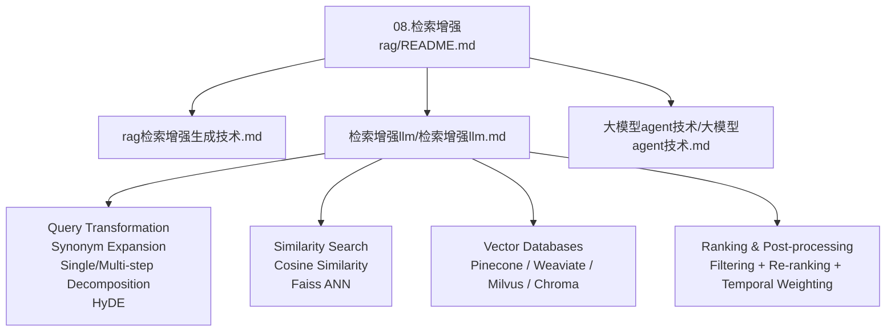
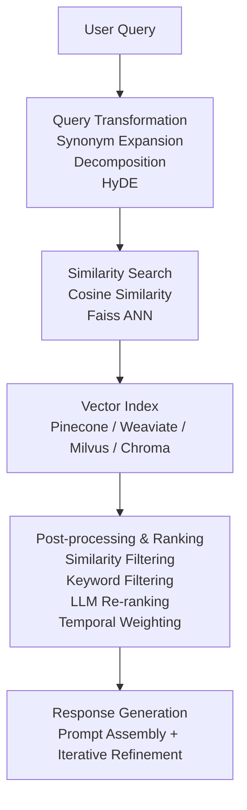
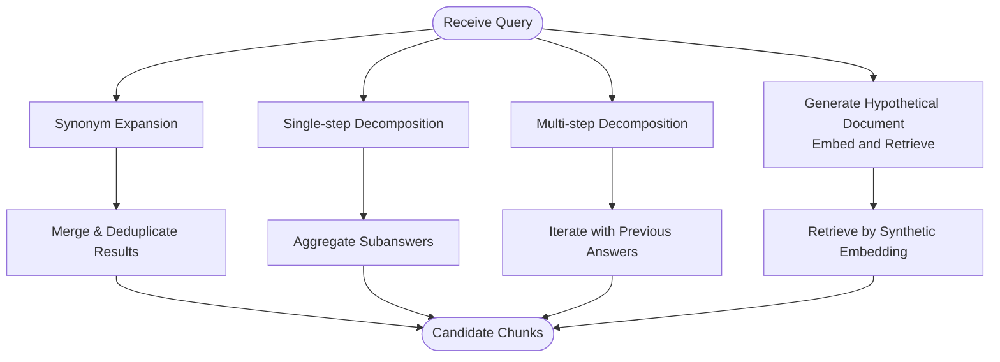
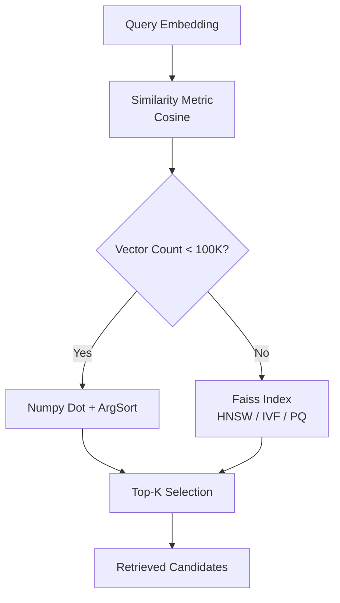
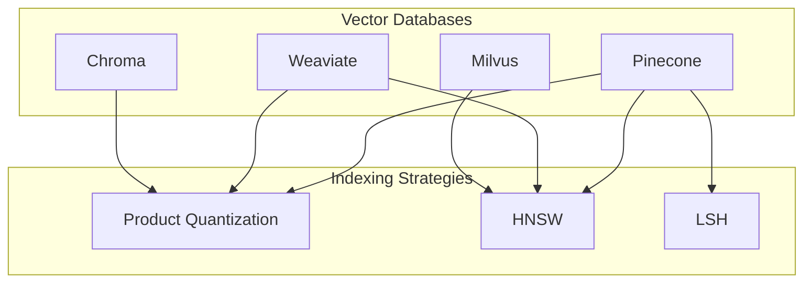
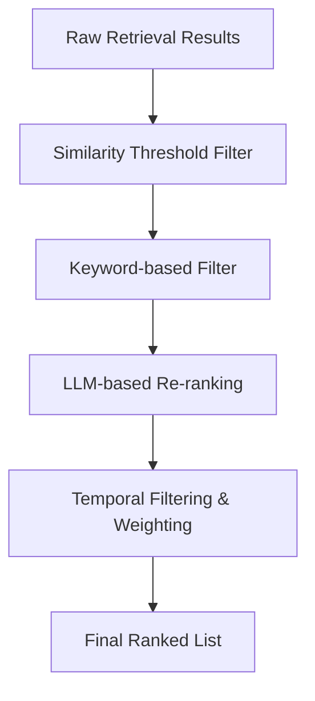
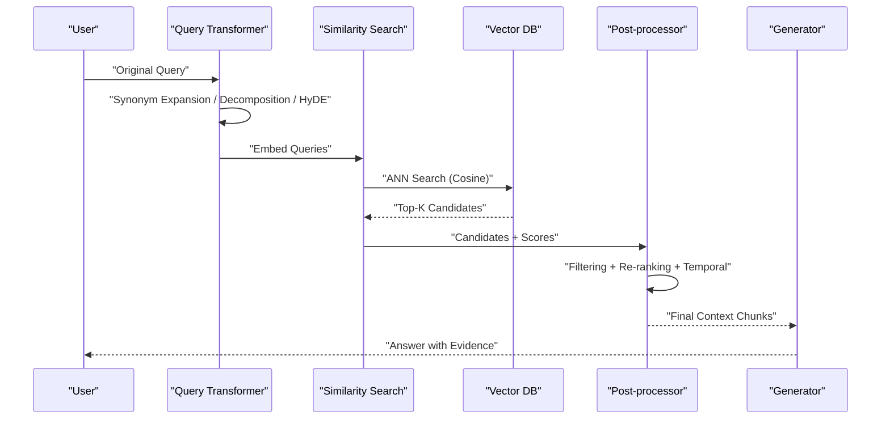
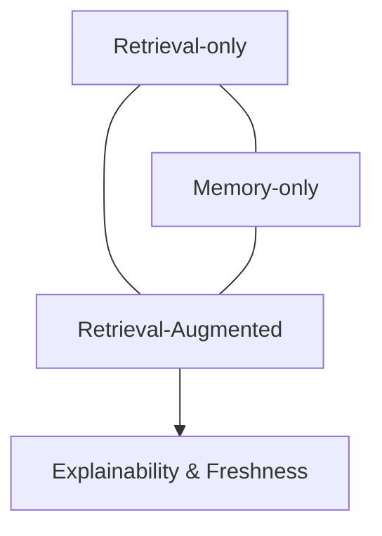

# Query and Retrieval Engine

<cite>
**Referenced Files in This Document**
- [08.检索增强rag/README.md](file://08.检索增强rag/README.md)
- [08.检索增强rag/rag（检索增强生成）技术/rag（检索增强生成）技术.md](file://08.检索增强rag/rag（检索增强生成）技术/rag（检索增强生成）技术.md)
- [08.检索增强rag/检索增强llm/检索增强llm.md](file://08.检索增强rag/检索增强llm/检索增强llm.md)
- [08.检索增强rag/大模型agent技术/大模型agent技术.md](file://08.检索增强rag/大模型agent技术/大模型agent技术.md)
- [ai_generataion/中级LLM_Agent工程师面试QA清单.md](file://ai_generataion/中级LLM_Agent工程师面试QA清单.md)
</cite>

## Table of Contents
1. [Introduction](#introduction)
2. [Project Structure](#project-structure)
3. [Core Components](#core-components)
4. [Architecture Overview](#architecture-overview)
5. [Detailed Component Analysis](#detailed-component-analysis)
6. [Dependency Analysis](#dependency-analysis)
7. [Performance Considerations](#performance-considerations)
8. [Troubleshooting Guide](#troubleshooting-guide)
9. [Conclusion](#conclusion)
10. [Appendices](#appendices)

## Introduction
This document focuses on the query and retrieval engine component of a Retrieval-Augmented Generation (RAG) system. It covers query transformation techniques (synonym expansion, single-step and multi-step query decomposition, and Hypothetical Document Embeddings), similarity search algorithms (from simple cosine similarity to advanced approximate nearest neighbor search via Faiss), vector database implementations (Pinecone, Weaviate, Milvus, Chroma) and indexing strategies (Product Quantization, HNSW, LSH), and ranking/post-processing techniques (similarity filtering, keyword filtering, LLM-based re-ranking, temporal filtering and weighting). It also provides practical examples, optimization strategies, and guidance for addressing common challenges such as query ambiguity and hallucination mitigation.

## Project Structure
The repository organizes RAG-related materials under a dedicated folder. The most relevant content for this document resides in:
- A high-level overview of RAG concepts and use cases
- A detailed guide to building a retrieval pipeline including chunking, embeddings, vector indexing, and query transformation
- Agent-oriented discussions that touch upon planning and reasoning, which inform retrieval strategies

**Diagram sources**
- [08.检索增强rag/README.md:1-14](file://08.检索增强rag/README.md#L1-L14)
- [08.检索增强rag/rag（检索增强生成）技术/rag（检索增强生成）技术.md:1-73](file://08.检索增强rag/rag（检索增强生成）技术/rag（检索增强生成）技术.md#L1-L73)
- [08.检索增强rag/检索增强llm/检索增强llm.md:1-526](file://08.检索增强rag/检索增强llm/检索增强llm.md#L1-L526)
- [08.检索增强rag/大模型agent技术/大模型agent技术.md:1-483](file://08.检索增强rag/大模型agent技术/大模型agent技术.md#L1-L483)

**Section sources**
- [08.检索增强rag/README.md:1-14](file://08.检索增强rag/README.md#L1-L14)

## Core Components
- Data and index module: chunking strategies, metadata handling, and index selection (chain, tree, keyword, vector).
- Query and retrieval module: query transformation (synonym expansion, decomposition, HyDE), similarity search (cosine similarity, Faiss), and vector database integration.
- Response generation module: combining retrieved chunks with prompts and iterative refinement strategies.

Key implementation anchors:
- Chunking strategies and transformer usage
- Vector indexing and embedding models
- Similarity search with cosine similarity and Faiss
- Vector database operations (Pinecone example)
- Query transformation techniques (synonym expansion, decomposition, HyDE)
- Ranking and post-processing (similarity filtering, keyword filtering, LLM-based re-ranking, temporal filtering)

**Section sources**
- [08.检索增强rag/rag（检索增强生成）技术/rag（检索增强生成）技术.md:39-73](file://08.检索增强rag/rag（检索增强生成）技术/rag（检索增强生成）技术.md#L39-L73)
- [08.检索增强rag/检索增强llm/检索增强llm.md:122-330](file://08.检索增强rag/检索增强llm/检索增强llm.md#L122-L330)

## Architecture Overview
The retrieval engine sits between the user query and the LLM, transforming queries, retrieving relevant chunks from a vector index, and preparing a context window for generation. The architecture supports hybrid strategies: keyword filters, similarity thresholds, LLM-based re-ranking, and temporal weighting.

**Diagram sources**
- [08.检索增强rag/rag（检索增强生成）技术/rag（检索增强生成）技术.md:39-73](file://08.检索增强rag/rag（检索增强生成）技术/rag（检索增强生成）技术.md#L39-L73)
- [08.检索增强rag/检索增强llm/检索增强llm.md:213-380](file://08.检索增强rag/检索增强llm/检索增强llm.md#L213-L380)

## Detailed Component Analysis

### Query Transformation Techniques
- Synonym expansion: rewrite the query into semantically equivalent forms and merge deduplicated results to broaden recall.
- Single-step decomposition: split a complex query into simpler subqueries; aggregate answers.
- Multi-step decomposition: iteratively refine subqueries using prior answers until no further improvement.
- Hypothetical Document Embeddings (HyDE): generate a plausible document from the query and embed that synthetic document as the query representation.

**Diagram sources**
- [08.检索增强rag/rag（检索增强生成）技术/rag（检索增强生成）技术.md:39-73](file://08.检索增强rag/rag（检索增强生成）技术/rag（检索增强生成）技术.md#L39-L73)
- [08.检索增强rag/检索增强llm/检索增强llm.md:334-365](file://08.检索增强rag/检索增强llm/检索增强llm.md#L334-L365)

**Section sources**
- [08.检索增强rag/rag（检索增强生成）技术/rag（检索增强生成）技术.md:39-73](file://08.检索增强rag/rag（检索增强生成）技术/rag（检索增强生成）技术.md#L39-L73)
- [08.检索增强rag/检索增强llm/检索增强llm.md:334-365](file://08.检索增强rag/检索增强llm/检索增强llm.md#L334-L365)

### Similarity Search Algorithms
- Cosine similarity: standard dot-product normalization for dense vectors.
- Small-scale (<~100K vectors): Numpy-based dot product and arg-sort for top-k.
- Large-scale: Faiss for efficient ANN search with configurable index types (e.g., HNSW, IVF, PQ).

**Diagram sources**
- [08.检索增强rag/rag（检索增强生成）技术/rag（检索增强生成）技术.md:241-267](file://08.检索增强rag/rag（检索增强生成）技术/rag（检索增强生成）技术.md#L241-L267)
- [08.检索增强rag/检索增强llm/检索增强llm.md:241-267](file://08.检索增强rag/检索增强llm/检索增强llm.md#L241-L267)

**Section sources**
- [08.检索增强rag/rag（检索增强生成）技术/rag（检索增强生成）技术.md:241-267](file://08.检索增强rag/rag（检索增强生成）技术/rag（检索增强生成）技术.md#L241-L267)
- [08.检索增强rag/检索增强llm/检索增强llm.md:241-267](file://08.检索增强rag/检索增强llm/检索增强llm.md#L241-L267)

### Vector Database Implementations and Indexing Strategies
- Vector databases: Pinecone, Weaviate, Milvus, Chroma.
- Indexing strategies:
  - Product Quantization (PQ): compress centroids for memory efficiency.
  - HNSW: hierarchical navigable small world for fast graph-based search.
  - LSH: locality-sensitive hashing for near-neighbor retrieval.

**Diagram sources**
- [08.检索增强rag/rag（检索增强生成）技术/rag（检索增强生成）技术.md:279-286](file://08.检索增强rag/rag（检索增强生成）技术/rag（检索增强生成）技术.md#L279-L286)
- [08.检索增强rag/检索增强llm/检索增强llm.md:279-286](file://08.检索增强rag/检索增强llm/检索增强llm.md#L279-L286)

**Section sources**
- [08.检索增强rag/rag（检索增强生成）技术/rag（检索增强生成）技术.md:279-286](file://08.检索增强rag/rag（检索增强生成）技术/rag（检索增强生成）技术.md#L279-L286)
- [08.检索增强rag/检索增强llm/检索增强llm.md:279-286](file://08.检索增强rag/检索增强llm/检索增强llm.md#L279-L286)

### Ranking and Post-processing Techniques
- Similarity score filtering: discard candidates below a threshold.
- Keyword-based filtering: include/exclude documents containing specific terms.
- LLM-based re-ranking: rerank candidates using a cross-encoder or LLM judge.
- Temporal filtering and weighting: prefer recent documents or apply time-based score adjustments.

**Diagram sources**
- [08.检索增强rag/rag（检索增强生成）技术/rag（检索增强生成）技术.md:366-375](file://08.检索增强rag/rag（检索增强生成）技术/rag（检索增强生成）技术.md#L366-L375)
- [08.检索增强rag/检索增强llm/检索增强llm.md:366-375](file://08.检索增强rag/检索增强llm/检索增强llm.md#L366-L375)

**Section sources**
- [08.检索增强rag/rag（检索增强生成）技术/rag（检索增强生成）技术.md:366-375](file://08.检索增强rag/rag（检索增强生成）技术/rag（检索增强生成）技术.md#L366-L375)
- [08.检索增强rag/检索增强llm/检索增强llm.md:366-375](file://08.检索增强rag/检索增强llm/检索增强llm.md#L366-L375)

### Practical Examples and Workflows
- Query transformation workflow:
  - Synonym expansion: generate multiple semantically equivalent queries and union results.
  - Decomposition: split complex questions into subquestions; optionally iterate with previous answers.
  - HyDE: produce a synthetic document and retrieve by its embedding.
- Similarity search optimization:
  - Use cosine similarity with Faiss for large-scale ANN search; tune index parameters (e.g., HNSW M/ef_construction, PQ centroids).
- Retrieval performance tuning:
  - Adjust chunk size and overlap; apply keyword filters; integrate LLM-based re-ranking; weight by recency.

**Diagram sources**
- [08.检索增强rag/rag（检索增强生成）技术/rag（检索增强生成）技术.md:332-380](file://08.检索增强rag/rag（检索增强生成）技术/rag（检索增强生成）技术.md#L332-L380)
- [08.检索增强rag/检索增强llm/检索增强llm.md:241-330](file://08.检索增强rag/检索增强llm/检索增强llm.md#L241-L330)

**Section sources**
- [08.检索增强rag/rag（检索增强生成）技术/rag（检索增强生成）技术.md:332-380](file://08.检索增强rag/rag（检索增强生成）技术/rag（检索增强生成）技术.md#L332-L380)
- [08.检索增强rag/检索增强llm/检索增强llm.md:241-330](file://08.检索增强rag/检索增强llm/检索增强llm.md#L241-L330)

### Conceptual Overview
- Retrieval vs. memory-only vs. retrieval-augmented paradigms.
- Motivations: long-tail knowledge, private data, data freshness, and explainability.
- RAG call patterns: embedding-driven retrieval, long-term memory, and caching.

**Diagram sources**
- [08.检索增强rag/rag（检索增强生成）技术/rag（检索增强生成）技术.md:5-36](file://08.检索增强rag/rag（检索增强生成）技术/rag（检索增强生成）技术.md#L5-L36)

**Section sources**
- [08.检索增强rag/rag（检索增强生成）技术/rag（检索增强生成）技术.md:5-36](file://08.检索增强rag/rag（检索增强生成）技术/rag（检索增强生成）技术.md#L5-L36)

## Dependency Analysis
- Retrieval depends on embedding quality and chunking strategy.
- Vector databases depend on indexing choices (PQ/HNSW/LSH) and query-time parameters.
- Post-processing depends on keyword lexicons, reranking models, and temporal signals.
- Agent-oriented planning and reasoning can influence query decomposition and iterative refinement.

**Diagram sources**
- [08.检索增强rag/rag（检索增强生成）技术/rag（检索增强生成）技术.md:39-73](file://08.检索增强rag/rag（检索增强生成）技术/rag（检索增强生成）技术.md#L39-L73)
- [08.检索增强rag/大模型agent技术/大模型agent技术.md:122-176](file://08.检索增强rag/大模型agent技术/大模型agent技术.md#L122-L176)

**Section sources**
- [08.检索增强rag/rag（检索增强生成）技术/rag（检索增强生成）技术.md:39-73](file://08.检索增强rag/rag（检索增强生成）技术/rag（检索增强生成）技术.md#L39-L73)
- [08.检索增强rag/大模型agent技术/大模型agent技术.md:122-176](file://08.检索增强rag/大模型agent技术/大模型agent技术.md#L122-L176)

## Performance Considerations
- Tune chunk size and overlap to balance semantic coherence and context length.
- Prefer PQ for memory footprint reduction; use HNSW for speed; LSH for approximate hash-based retrieval.
- Use Faiss with appropriate index parameters for large-scale ANN search.
- Apply early similarity filtering and keyword pruning to reduce downstream cost.
- Integrate lightweight LLM-based re-ranking judiciously to improve precision without heavy latency.

[No sources needed since this section provides general guidance]

## Troubleshooting Guide
Common issues and mitigations:
- Ambiguous queries: expand synonyms and apply decomposition; consider HyDE to anchor intent.
- Hallucinations: rely on retrieval-augmented generation with verifiable evidence; apply LLM-based re-ranking to filter implausible candidates.
- Slow retrieval: switch to Faiss with optimized indices; reduce dimensionality or enable PQ; cache frequent queries.
- Outdated facts: enforce temporal filtering and recency weighting; refresh embeddings periodically.

**Section sources**
- [08.检索增强rag/rag（检索增强生成）技术/rag（检索增强生成）技术.md:11-36](file://08.检索增强rag/rag（检索增强生成）技术/rag（检索增强生成）技术.md#L11-L36)
- [08.检索增强rag/rag（检索增强生成）技术/rag（检索增强生成）技术.md:366-375](file://08.检索增强rag/rag（检索增强生成）技术/rag（检索增强生成）技术.md#L366-L375)
- [08.检索增强rag/rag（检索增强生成）技术/rag（检索增强生成）技术.md:241-267](file://08.检索增强rag/rag（检索增强生成）技术/rag（检索增强生成）技术.md#L241-L267)

## Conclusion
A robust query and retrieval engine combines effective query transformation, scalable similarity search, and pragmatic post-processing. By leveraging synonym expansion, decomposition, and HyDE, paired with cosine similarity and Faiss-based ANN search, and integrating vector databases with PQ/HNSW/LSH strategies, systems can achieve strong recall and precision. Ranking and temporal weighting further improve relevance, while retrieval-augmented generation mitigates hallucinations by anchoring answers in verifiable evidence.

[No sources needed since this section summarizes without analyzing specific files]

## Appendices

### Appendix A: Example References
- Pinecone vector indexes and Faiss overview
- Vector database lifecycle and index strategies
- Retrieval call patterns and trade-offs

**Section sources**
- [08.检索增强rag/rag（检索增强生成）技术/rag（检索增强生成）技术.md:279-286](file://08.检索增强rag/rag（检索增强生成）技术/rag（检索增强生成）技术.md#L279-L286)
- [08.检索增强rag/rag（检索增强生成）技术/rag（检索增强生成）技术.md:241-267](file://08.检索增强rag/rag（检索增强生成）技术/rag（检索增强生成）技术.md#L241-L267)
- [08.检索增强rag/rag（检索增强生成）技术/rag（检索增强生成）技术.md:47-57](file://08.检索增强rag/rag（检索增强生成）技术/rag（检索增强生成）技术.md#L47-L57)