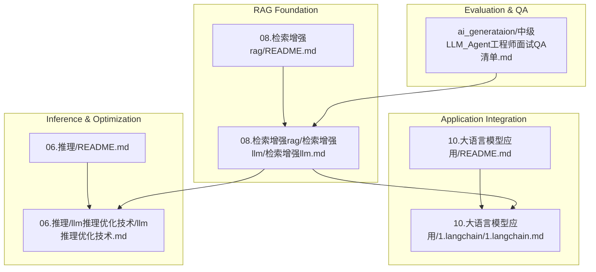
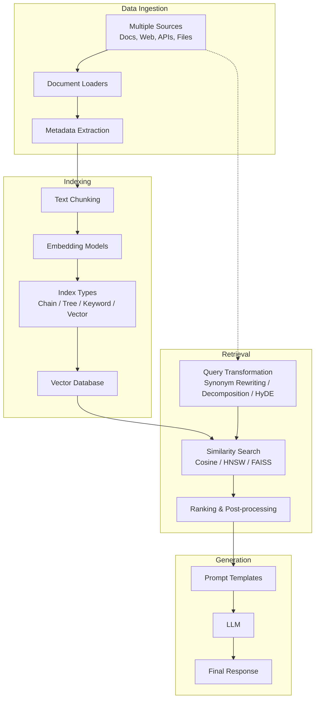
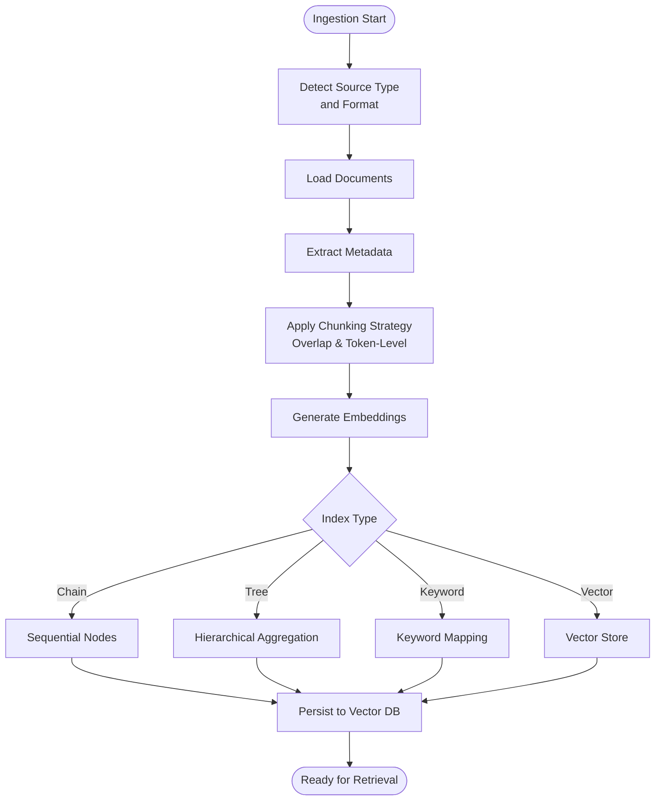
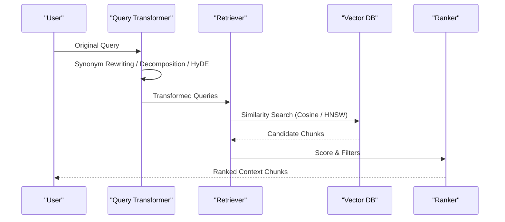
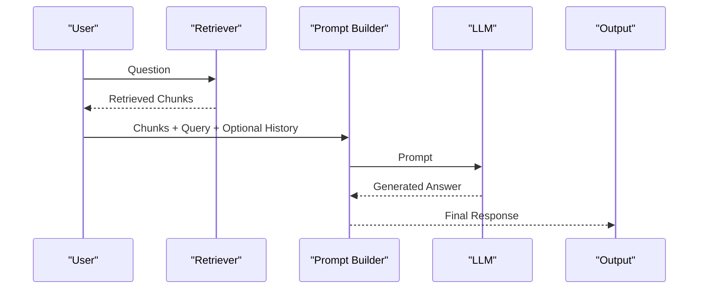
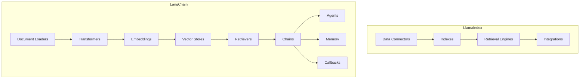
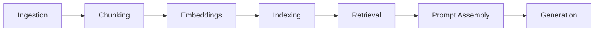

# RAG System Architecture

<cite>
**Referenced Files in This Document**
- [README.md](file://08.检索增强rag/README.md)
- [检索增强llm.md](file://08.检索增强rag/检索增强llm/检索增强llm.md)
- [README.md](file://10.大语言模型应用/README.md)
- [1.langchain.md](file://10.大语言模型应用/1.langchain/1.langchain.md)
- [README.md](file://06.推理/README.md)
- [llm推理优化技术.md](file://06.推理/llm推理优化技术/llm推理优化技术.md)
- [中级LLM_Agent工程师面试QA清单.md](file://ai_generataion/中级LLM_Agent工程师面试QA清单.md)
</cite>

## Table of Contents
1. [Introduction](#introduction)
2. [Project Structure](#project-structure)
3. [Core Components](#core-components)
4. [Architecture Overview](#architecture-overview)
5. [Detailed Component Analysis](#detailed-component-analysis)
6. [Dependency Analysis](#dependency-analysis)
7. [Performance Considerations](#performance-considerations)
8. [Troubleshooting Guide](#troubleshooting-guide)
9. [Conclusion](#conclusion)
10. [Appendices](#appendices)

## Introduction
This document presents a comprehensive guide to Retrieval-Augmented Generation (RAG) system architecture. It explains the three main modules: data and index processing, query and retrieval mechanisms, and response generation pipeline. It documents ingestion from multiple sources, text chunking strategies, indexing methods (chain, tree, keyword table, vector indices), vector embedding models, similarity search algorithms, and vector database implementations. It covers query transformation techniques (synonym rewriting, query decomposition, HyDE), ranking and post-processing strategies, prompt templates for response generation, and integration patterns with popular frameworks such as LlamaIndex and LangChain. Practical implementation examples, performance optimization techniques, and troubleshooting approaches for common RAG deployment challenges are included.

## Project Structure
The repository organizes RAG-related materials under a dedicated folder for Retrieval-Augmented Generation and complementary materials in application, inference, and evaluation domains. The RAG module provides foundational concepts and implementation guidance, while the application and inference sections offer framework-specific integration details and optimization techniques.

**Diagram sources**
- [README.md:1-14](file://08.检索增强rag/README.md#L1-L14)
- [检索增强llm.md:1-526](file://08.检索增强rag/检索增强llm/检索增强llm.md#L1-L526)
- [README.md:1-10](file://10.大语言模型应用/README.md#L1-L10)
- [1.langchain.md:1-417](file://10.大语言模型应用/1.langchain/1.langchain.md#L1-L417)
- [README.md:1-28](file://06.推理/README.md#L1-L28)
- [llm推理优化技术.md:268-271](file://06.推理/llm推理优化技术/llm推理优化技术.md#L268-L271)
- [中级LLM_Agent工程师面试QA清单.md:241-320](file://ai_generataion/中级LLM_Agent工程师面试QA清单.md#L241-L320)

**Section sources**
- [README.md:1-14](file://08.检索增强rag/README.md#L1-L14)
- [README.md:1-10](file://10.大语言模型应用/README.md#L1-L10)
- [README.md:1-28](file://06.推理/README.md#L1-L28)

## Core Components
The RAG system comprises three primary modules:

- Data and index processing: ingestion of heterogeneous data sources, metadata extraction, text chunking, and index construction.
- Query and retrieval: query transformation, similarity search, and ranking/post-processing.
- Response generation: prompt composition, iterative refinement, and LLM invocation.

These modules are implemented across the RAG fundamentals and framework-specific guides.

**Section sources**
- [检索增强llm.md:81-88](file://08.检索增强rag/检索增强llm/检索增强llm.md#L81-L88)
- [检索增强llm.md:89-183](file://08.检索增强rag/检索增强llm/检索增强llm.md#L89-L183)
- [检索增强llm.md:332-380](file://08.检索增强rag/检索增强llm/检索增强llm.md#L332-L380)
- [1.langchain.md:83-105](file://10.大语言模型应用/1.langchain/1.langchain.md#L83-L105)

## Architecture Overview
The end-to-end RAG architecture integrates data ingestion, indexing, retrieval, and generation. The following diagram maps the major components and their interactions.

**Diagram sources**
- [检索增强llm.md:91-183](file://08.检索增强rag/检索增强llm/检索增强llm.md#L91-L183)
- [检索增强llm.md:213-286](file://08.检索增强rag/检索增强llm/检索增强llm.md#L213-L286)
- [检索增强llm.md:334-375](file://08.检索增强rag/检索增强llm/检索增强llm.md#L334-L375)
- [1.langchain.md:83-105](file://10.大语言模型应用/1.langchain/1.langchain.md#L83-L105)

## Detailed Component Analysis

### Data and Index Processing
- Data ingestion supports diverse sources and formats, capturing metadata for filtering and relevance.
- Text chunking balances context window constraints and semantic coherence, with configurable overlap and tokenization strategies.
- Indexing methods include chain, tree, keyword table, and vector indices, each suited to different retrieval needs and scale characteristics.

**Diagram sources**
- [检索增强llm.md:91-183](file://08.检索增强rag/检索增强llm/检索增强llm.md#L91-L183)
- [检索增强llm.md:187-219](file://08.检索增强rag/检索增强llm/检索增强llm.md#L187-L219)

**Section sources**
- [检索增强llm.md:91-183](file://08.检索增强rag/检索增强llm/检索增强llm.md#L91-L183)
- [检索增强llm.md:187-219](file://08.检索增强rag/检索增强llm/检索增强llm.md#L187-L219)

### Query and Retrieval Mechanisms
- Query transformation improves recall and robustness via synonym rewriting, query decomposition (single-step and multi-step), and HyDE.
- Similarity search leverages cosine similarity and efficient ANN libraries (e.g., FAISS) with index types such as HNSW and PQ.
- Ranking and post-processing include score-based filtering, keyword filters, temporal weighting, and LLM-based reranking.

**Diagram sources**
- [检索增强llm.md:334-375](file://08.检索增强rag/检索增强llm/检索增强llm.md#L334-L375)
- [检索增强llm.md:241-267](file://08.检索增强rag/检索增强llm/检索增强llm.md#L241-L267)

**Section sources**
- [检索增强llm.md:334-375](file://08.检索增强rag/检索增强llm/检索增强llm.md#L334-L375)
- [检索增强llm.md:241-267](file://08.检索增强rag/检索增强llm/检索增强llm.md#L241-L267)

### Response Generation Pipeline
- Prompt templates combine retrieved chunks with user queries and optional prior answers for iterative refinement.
- Generation strategies balance per-chunk updates versus consolidated prompts, depending on context window and cost constraints.

**Diagram sources**
- [检索增强llm.md:376-412](file://08.检索增强rag/检索增强llm/检索增强llm.md#L376-L412)

**Section sources**
- [检索增强llm.md:376-412](file://08.检索增强rag/检索增强llm/检索增强llm.md#L376-L412)

### Integration Patterns with LlamaIndex and LangChain
- LlamaIndex emphasizes modular data connectors, indexing, retrieval engines, and integrations with popular applications.
- LangChain provides standardized interfaces for model I/O, data connection (loaders, transformers, embeddings, vector stores, retrievers), chains, agents, memory, and callbacks, enabling flexible assembly of RAG pipelines.

**Diagram sources**
- [检索增强llm.md:429-444](file://08.检索增强rag/检索增强llm/检索增强llm.md#L429-L444)
- [1.langchain.md:17-27](file://10.大语言模型应用/1.langchain/1.langchain.md#L17-L27)
- [1.langchain.md:83-105](file://10.大语言模型应用/1.langchain/1.langchain.md#L83-L105)

**Section sources**
- [检索增强llm.md:429-444](file://08.检索增强rag/检索增强llm/检索增强llm.md#L429-L444)
- [1.langchain.md:17-27](file://10.大语言模型应用/1.langchain/1.langchain.md#L17-L27)
- [1.langchain.md:83-105](file://10.大语言模型应用/1.langchain/1.langchain.md#L83-L105)

## Dependency Analysis
RAG systems depend on cohesive modules with clear boundaries:
- Data ingestion depends on document loaders and metadata extraction.
- Indexing depends on chunking and embedding quality.
- Retrieval depends on index type selection and similarity search efficiency.
- Generation depends on prompt design and LLM capabilities.

**Diagram sources**
- [检索增强llm.md:91-183](file://08.检索增强rag/检索增强llm/检索增强llm.md#L91-L183)
- [检索增强llm.md:213-286](file://08.检索增强rag/检索增强llm/检索增强llm.md#L213-L286)
- [1.langchain.md:83-105](file://10.大语言模型应用/1.langchain/1.langchain.md#L83-L105)

**Section sources**
- [检索增强llm.md:91-183](file://08.检索增强rag/检索增强llm/检索增强llm.md#L91-L183)
- [检索增强llm.md:213-286](file://08.检索增强rag/检索增强llm/检索增强llm.md#L213-L286)
- [1.langchain.md:83-105](file://10.大语言模型应用/1.langchain/1.langchain.md#L83-L105)

## Performance Considerations
- Vector search scaling: choose appropriate ANN indexes (e.g., HNSW) and metrics (cosine) for large-scale retrieval.
- Indexing trade-offs: smaller datasets may use dense vectors with simple dot products; larger datasets benefit from specialized libraries and hardware acceleration.
- Inference optimization: leverage optimized serving stacks and compilation tools for LLM inference throughput and latency.
- Chunking tuning: balance chunk size against token budget and semantic continuity to maximize retrieval precision and reduce noise.

[No sources needed since this section provides general guidance]

## Troubleshooting Guide
Common RAG deployment challenges and remedies:
- Document parsing issues (tables, formulas): integrate specialized parsers and apply post-processing rules to preserve structure and meaning.
- Accuracy improvements: iterate on chunking strategies, embedding models, and prompt templates; incorporate human feedback loops.
- Latency and throughput: optimize vector index configuration, enable caching, and use asynchronous retrieval where feasible.
- Monitoring and evaluation: define automated metrics (accuracy, latency, user satisfaction) and establish continuous monitoring and alerting.

**Section sources**
- [中级LLM_Agent工程师面试QA清单.md:241-320](file://ai_generataion/中级LLM_Agent工程师面试QA清单.md#L241-L320)

## Conclusion
A robust RAG system requires careful orchestration across ingestion, indexing, retrieval, and generation. By selecting appropriate chunking and embedding strategies, leveraging efficient similarity search and vector databases, applying query transformations, and designing effective prompts, teams can build scalable and accurate retrieval-augmented applications. Integrating established frameworks like LlamaIndex and LangChain accelerates development, while continuous performance tuning and rigorous evaluation ensure reliable production outcomes.

[No sources needed since this section summarizes without analyzing specific files]

## Appendices

### Practical Implementation Examples
- LangChain knowledge base QA pipeline demonstrates end-to-end ingestion, chunking, embedding, vector storage, retrieval, and conversational QA chaining.
- LlamaIndex and LangChain share similar retrieval workflows, enabling interchangeable components for experimentation and deployment.

**Section sources**
- [1.langchain.md:340-414](file://10.大语言模型应用/1.langchain/1.langchain.md#L340-L414)
- [检索增强llm.md:429-444](file://08.检索增强rag/检索增强llm/检索增强llm.md#L429-L444)

### Performance Optimization Techniques
- Use FAISS HNSW indexes for large-scale similarity search; tune chunk sizes and embedding dimensions to fit memory budgets.
- Apply inference optimization stacks and compilation tools to improve LLM serving performance.

**Section sources**
- [检索增强llm.md:241-267](file://08.检索增强rag/检索增强llm/检索增强llm.md#L241-L267)
- [llm推理优化技术.md:268-271](file://06.推理/llm推理优化技术/llm推理优化技术.md#L268-L271)