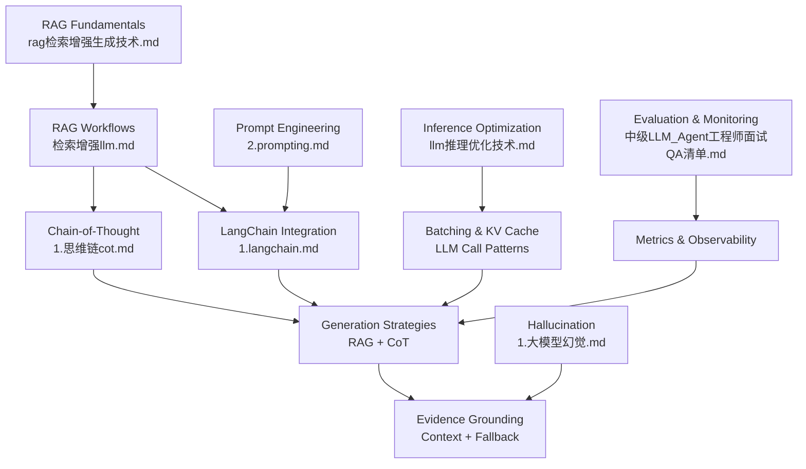
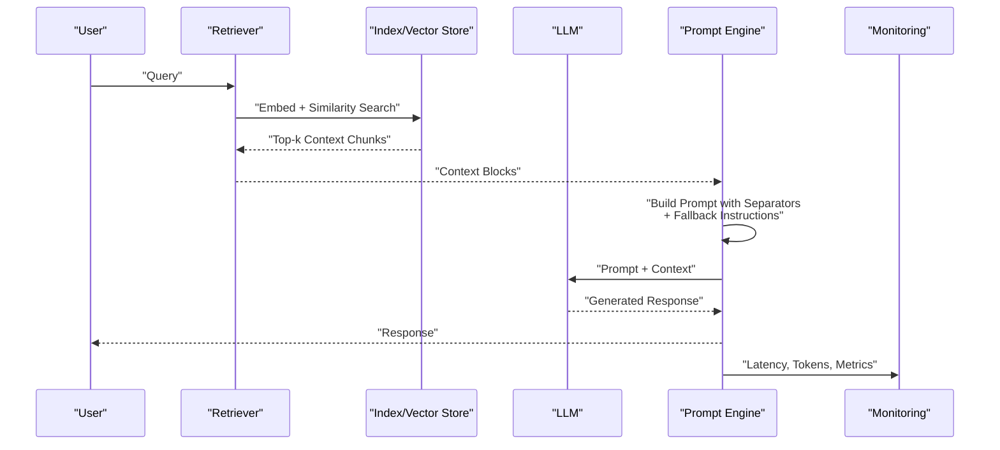
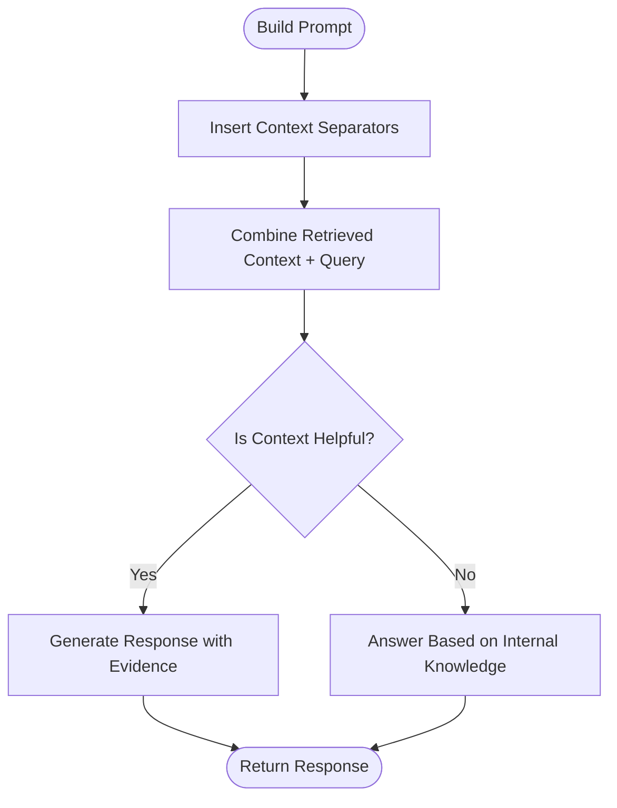
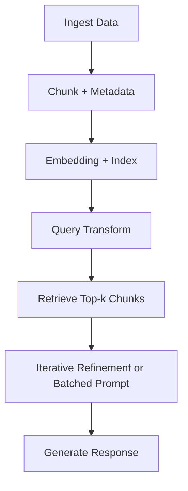
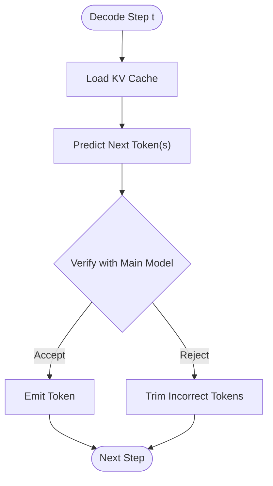
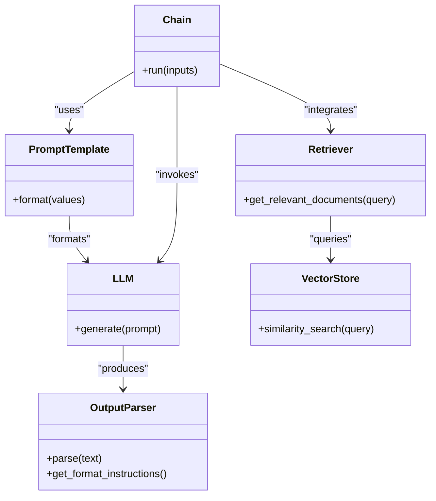
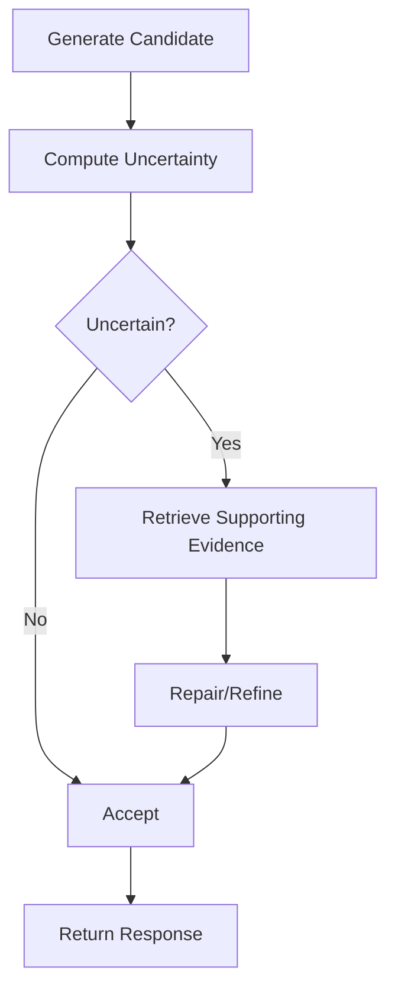
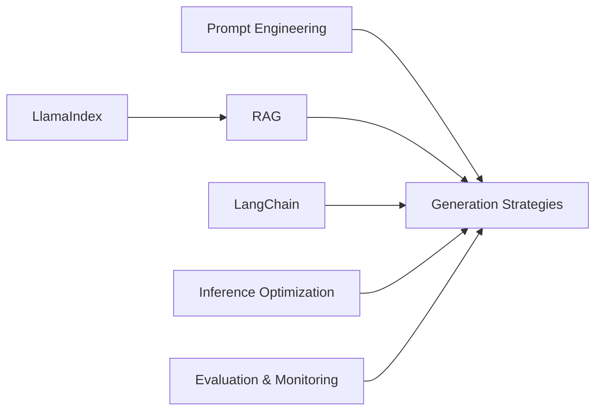

# Response Generation Pipeline

<cite>
**Referenced Files in This Document**
- [rag（检索增强生成）技术.md](file://08.检索增强rag/rag（检索增强生成）技术/rag（检索增强生成）技术.md)
- [检索增强llm.md](file://08.检索增强rag/检索增强llm/检索增强llm.md)
- [2.prompting.md](file://05.有监督微调/2.prompting/2.prompting.md)
- [1.langchain.md](file://10.大语言模型应用/1.langchain/1.langchain.md)
- [1.思维链（cot）.md](file://10.大语言模型应用/1.思维链（cot）/1.思维链（cot）.md)
- [1.大模型幻觉.md](file://09.大语言模型评估/1.大模型幻觉/1.大模型幻觉.md)
- [llm推理优化技术.md](file://06.推理/llm推理优化技术/llm推理优化技术.md)
- [README.md](file://README.md)
- [中级LLM_Agent工程师面试QA清单.md](file://ai_generataion/中级LLM_Agent工程师面试QA清单.md)
</cite>

## Table of Contents
1. [Introduction](#introduction)
2. [Project Structure](#project-structure)
3. [Core Components](#core-components)
4. [Architecture Overview](#architecture-overview)
5. [Detailed Component Analysis](#detailed-component-analysis)
6. [Dependency Analysis](#dependency-analysis)
7. [Performance Considerations](#performance-considerations)
8. [Troubleshooting Guide](#troubleshooting-guide)
9. [Conclusion](#conclusion)
10. [Appendices](#appendices)

## Introduction
This document describes a comprehensive response generation pipeline focused on prompt engineering strategies and generation optimization techniques. It covers iterative refinement with context incorporation, batch processing with multiple context blocks, and LLM call optimization patterns. It also documents prompt template design, including context separators, knowledge integration instructions, and fallback mechanisms when context is unhelpful. The guide explains generation strategies for different use cases (factual answering, reasoning tasks, and creative content generation), and details integration patterns with popular frameworks such as LlamaIndex and LangChain, including their built-in prompt templates and generation workflows. Practical examples of prompt engineering best practices, response quality optimization techniques, and performance monitoring approaches are included, alongside solutions to common challenges such as context window limitations, hallucination prevention through evidence grounding, and generation cost optimization through efficient prompt design.

## Project Structure
The repository organizes materials around LLM fundamentals, prompting and tuning, retrieval-augmented generation (RAG), evaluation, and application frameworks. The response generation pipeline draws from:
- RAG fundamentals and workflows
- Prompt engineering techniques (including continuous prompts and prefix tuning)
- LangChain components for prompts, chains, and retrieval
- Chain-of-Thought prompting for reasoning
- Hallucination detection and mitigation
- LLM inference optimization and batch scheduling
- Evaluation metrics and monitoring approaches

**Diagram sources**
- [rag（检索增强生成）技术.md](file://08.检索增强rag/rag（检索增强生成）技术/rag（检索增强生成）技术.md)
- [检索增强llm.md](file://08.检索增强rag/检索增强llm/检索增强llm.md)
- [2.prompting.md](file://05.有监督微调/2.prompting/2.prompting.md)
- [1.langchain.md](file://10.大语言模型应用/1.langchain/1.langchain.md)
- [1.思维链（cot）.md](file://10.大语言模型应用/1.思维链（cot）/1.思维链（cot）.md)
- [1.大模型幻觉.md](file://09.大语言模型评估/1.大模型幻觉/1.大模型幻觉.md)
- [llm推理优化技术.md](file://06.推理/llm推理优化技术/llm推理优化技术.md)
- [中级LLM_Agent工程师面试QA清单.md](file://ai_generataion/中级LLM_Agent工程师面试QA清单.md)

**Section sources**
- [README.md](file://README.md)

## Core Components
- Prompt Engineering and Templates
  - Continuous prompts and virtual tokens (prefix tuning, P-tuning, P-tuning v2)
  - Prompt ensembling and dynamic prompt selection
- Retrieval-Augmented Generation (RAG)
  - Data ingestion, chunking, indexing, and retrieval
  - Prompt construction with context separators and fallback instructions
- Generation Strategies
  - Iterative refinement with context incorporation
  - Batch processing with multiple context blocks
  - LLM call optimization patterns (KV cache, speculative inference, dynamic batching)
- Framework Integrations
  - LangChain: prompts, chains, retrievers, memory, callbacks
  - LlamaIndex: indices, retrieval chains, prompt templates
- Quality and Safety
  - Hallucination detection and mitigation
  - Evidence grounding and factuality checks
- Monitoring and Evaluation
  - Latency, throughput, accuracy, and user satisfaction metrics
  - Automated and manual evaluation pipelines

**Section sources**
- [2.prompting.md](file://05.有监督微调/2.prompting/2.prompting.md)
- [检索增强llm.md](file://08.检索增强rag/检索增强llm/检索增强llm.md)
- [1.langchain.md](file://10.大语言模型应用/1.langchain/1.langchain.md)
- [1.思维链（cot）.md](file://10.大语言模型应用/1.思维链（cot）/1.思维链（cot）.md)
- [1.大模型幻觉.md](file://09.大语言模型评估/1.大模型幻觉/1.大模型幻觉.md)
- [llm推理优化技术.md](file://06.推理/llm推理优化技术/llm推理优化技术.md)
- [中级LLM_Agent工程师面试QA清单.md](file://ai_generataion/中级LLM_Agent工程师面试QA清单.md)

## Architecture Overview
The response generation pipeline integrates retrieval and generation in a modular way, enabling robust, explainable, and cost-efficient answers.

**Diagram sources**
- [检索增强llm.md](file://08.检索增强rag/检索增强llm/检索增强llm.md)
- [1.langchain.md](file://10.大语言模型应用/1.langchain/1.langchain.md)

## Detailed Component Analysis

### Prompt Engineering and Template Design
- Continuous prompts and virtual tokens
  - Prefix tuning adds learnable prefixes before inputs to guide generation.
  - P-tuning and P-tuning v2 inject virtual tokens at input or multiple layers, enabling deep prompt optimization.
  - Prompt ensembling improves robustness by training multiple prompts per task.
- Prompt template design
  - Use explicit context separators to delineate context from query and prior answers.
  - Include explicit instructions for combining retrieved context with internal knowledge.
  - Add fallback mechanisms when context is unhelpful (e.g., “If the context isn’t helpful, answer on your own.”).
- Best practices
  - Keep templates task-specific and concise.
  - Use example selectors to dynamically include demonstrations aligned with the query.
  - Employ chain-of-thought prompts for reasoning-heavy tasks.

**Diagram sources**
- [检索增强llm.md](file://08.检索增强rag/检索增强llm/检索增强llm.md)
- [2.prompting.md](file://05.有监督微调/2.prompting/2.prompting.md)

**Section sources**
- [2.prompting.md](file://05.有监督微调/2.prompting/2.prompting.md)
- [检索增强llm.md](file://08.检索增强rag/检索增强llm/检索增强llm.md)

### Retrieval-Augmented Generation (RAG) Workflows
- Data and index module
  - Ingest diverse data sources and extract metadata.
  - Chunk long texts with overlap to preserve semantics; choose chunk sizes based on embedding model and downstream use.
  - Index chunks using vector databases or tree/keyword indices.
- Query and retrieval module
  - Transform queries via rewriting, decomposition, or hypothetical document embeddings (HyDE).
  - Rank and post-process results (time filters, LLM rerankers).
- Response generation module
  - Strategy 1: iterative refinement with multiple LLM calls, each incorporating new context.
  - Strategy 2: pack as many context blocks as possible into a single prompt; split prompts if needed.
  - Use explicit prompt templates with separators and fallback instructions.

**Diagram sources**
- [检索增强llm.md](file://08.检索增强rag/检索增强llm/检索增强llm.md)

**Section sources**
- [rag（检索增强生成）技术.md](file://08.检索增强rag/rag（检索增强生成）技术/rag（检索增强生成）技术.md)
- [检索增强llm.md](file://08.检索增强rag/检索增强llm/检索增强llm.md)

### Generation Strategies by Use Case
- Factual answering
  - Ground answers in retrieved context; avoid hallucinations by limiting claims to supported evidence.
  - Use fallback instructions when context is insufficient.
- Reasoning tasks
  - Apply chain-of-thought prompts to elicit step-by-step reasoning.
  - Use iterative refinement to incorporate additional context and correct intermediate steps.
- Creative content generation
  - Provide minimal grounding context to encourage creativity while retaining coherence.
  - Monitor fluency and coherence via automated metrics and human evaluation.

**Section sources**
- [1.思维链（cot）.md](file://10.大语言模型应用/1.思维链（cot）/1.思维链（cot）.md)
- [检索增强llm.md](file://08.检索增强rag/检索增强llm/检索增强llm.md)

### LLM Call Optimization Patterns
- KV caching
  - Cache keys/values across decoding steps to avoid recomputation and reduce latency.
- Dynamic batching (in-flight batching)
  - Serve multiple requests concurrently; remove completed sequences early to maximize GPU utilization.
- Speculative inference
  - Use a cheap auxiliary model to predict multiple future tokens; accept or reject in parallel to accelerate decoding.
- Context window management
  - Prefer fewer, highly relevant chunks over large volumes; accuracy often degrades with increasing context size.

**Diagram sources**
- [llm推理优化技术.md](file://06.推理/llm推理优化技术/llm推理优化技术.md)

**Section sources**
- [llm推理优化技术.md](file://06.推理/llm推理优化技术/llm推理优化技术.md)
- [检索增强llm.md](file://08.检索增强rag/检索增强llm/检索增强llm.md)

### Framework Integration: LangChain and LlamaIndex
- LangChain
  - Prompts, LLMs, and output parsers form the core I/O layer.
  - Chains orchestrate multi-step workflows; memory persists state across runs.
  - Retrievers integrate with vector stores; callbacks enable logging and streaming.
- LlamaIndex
  - Provides indices, retrieval chains, and prompt templates for RAG.
  - Supports both single-turn and conversational retrieval chains.

**Diagram sources**
- [1.langchain.md](file://10.大语言模型应用/1.langchain/1.langchain.md)
- [检索增强llm.md](file://08.检索增强rag/检索增强llm/检索增强llm.md)

**Section sources**
- [1.langchain.md](file://10.大语言模型应用/1.langchain/1.langchain.md)
- [检索增强llm.md](file://08.检索增强rag/检索增强llm/检索增强llm.md)

### Hallucination Prevention Through Evidence Grounding
- Detection
  - Use logit-based uncertainty signals to flag low-confidence generations.
  - Apply external verification against retrieved evidence.
- Mitigation
  - Factuality-enhanced sampling adjusts randomness to favor factual consistency.
  - SelfCheck-style ensembling compares multiple outputs for internal consistency.
- Grounding
  - Explicitly instruct the model to rely on provided context; include fallback instructions when context is unhelpful.

**Diagram sources**
- [1.大模型幻觉.md](file://09.大语言模型评估/1.大模型幻觉/1.大模型幻觉.md)
- [检索增强llm.md](file://08.检索增强rag/检索增强llm/检索增强llm.md)

**Section sources**
- [1.大模型幻觉.md](file://09.大语言模型评估/1.大模型幻觉/1.大模型幻觉.md)
- [检索增强llm.md](file://08.检索增强rag/检索增强llm/检索增强llm.md)

### Practical Examples and Best Practices
- Prompt engineering
  - Use clear context separators and fallback instructions.
  - Employ prompt ensembling to improve robustness.
- Response quality
  - Ground claims in retrieved context; avoid unsupported statements.
  - For reasoning, use chain-of-thought prompts and iterative refinement.
- Cost optimization
  - Reduce context size to relevant chunks; leverage KV caching and dynamic batching.
  - Use speculative inference to accelerate decoding when acceptable.

**Section sources**
- [检索增强llm.md](file://08.检索增强rag/检索增强llm/检索增强llm.md)
- [llm推理优化技术.md](file://06.推理/llm推理优化技术/llm推理优化技术.md)
- [中级LLM_Agent工程师面试QA清单.md](file://ai_generataion/中级LLM_Agent工程师面试QA清单.md)

## Dependency Analysis
The pipeline exhibits layered dependencies:
- Prompt engineering underpins all generation strategies.
- RAG depends on retrieval and indexing modules.
- LangChain and LlamaIndex provide reusable building blocks for prompts, chains, and retrieval.
- Inference optimization affects latency and throughput.
- Evaluation and monitoring inform quality improvements.

**Diagram sources**
- [2.prompting.md](file://05.有监督微调/2.prompting/2.prompting.md)
- [检索增强llm.md](file://08.检索增强rag/检索增强llm/检索增强llm.md)
- [1.langchain.md](file://10.大语言模型应用/1.langchain/1.langchain.md)
- [llm推理优化技术.md](file://06.推理/llm推理优化技术/llm推理优化技术.md)
- [中级LLM_Agent工程师面试QA清单.md](file://ai_generataion/中级LLM_Agent工程师面试QA清单.md)

**Section sources**
- [README.md](file://README.md)

## Performance Considerations
- Context window limitations
  - Accuracy often degrades with large context windows; prefer fewer, highly relevant chunks.
- Latency and throughput
  - Use KV caching, dynamic batching, and speculative inference to reduce latency and increase throughput.
- Cost optimization
  - Minimize tokens in prompts; reuse cached states; leverage efficient retrieval strategies.

[No sources needed since this section provides general guidance]

## Troubleshooting Guide
- Hallucinations
  - Detect via uncertainty scoring and external verification; mitigate with grounding and factuality-aware sampling.
- Poor retrieval quality
  - Improve query transformations (rewriting, decomposition, HyDE); adjust chunking strategy and index type.
- Inference bottlenecks
  - Tune batch sizes, enable KV caching, and consider speculative inference.
- Monitoring gaps
  - Track latency, token usage, accuracy, and user satisfaction; set alerts for regressions.

**Section sources**
- [1.大模型幻觉.md](file://09.大语言模型评估/1.大模型幻觉/1.大模型幻觉.md)
- [llm推理优化技术.md](file://06.推理/llm推理优化技术/llm推理优化技术.md)
- [中级LLM_Agent工程师面试QA清单.md](file://ai_generataion/中级LLM_Agent工程师面试QA清单.md)

## Conclusion
A robust response generation pipeline balances prompt engineering, retrieval quality, and inference efficiency. By integrating continuous prompts, iterative refinement, and evidence-grounded generation, teams can produce accurate, explainable, and cost-effective responses. Frameworks like LangChain and LlamaIndex streamline development, while monitoring and evaluation ensure continuous improvement.

[No sources needed since this section summarizes without analyzing specific files]

## Appendices
- Evaluation metrics and monitoring approaches are documented in the interview guide, including automated and manual assessment strategies.

**Section sources**
- [中级LLM_Agent工程师面试QA清单.md](file://ai_generataion/中级LLM_Agent工程师面试QA清单.md)