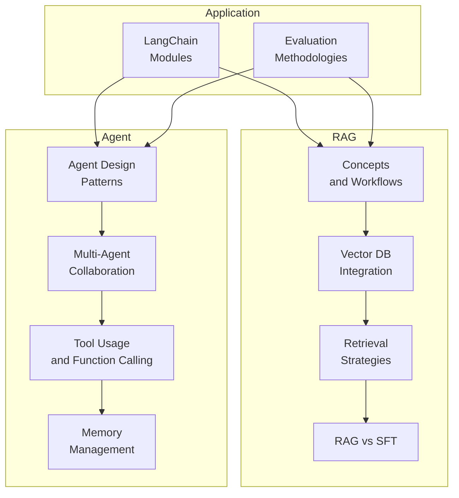
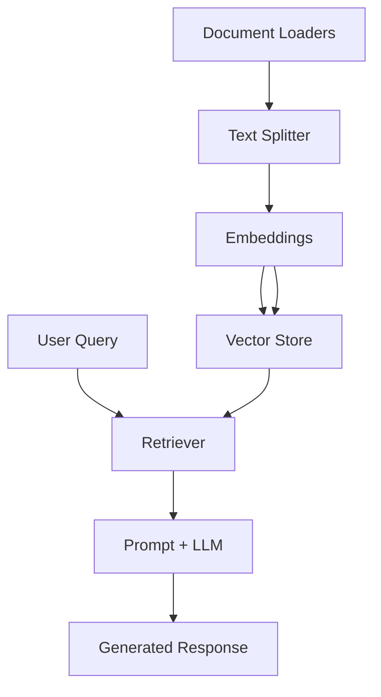
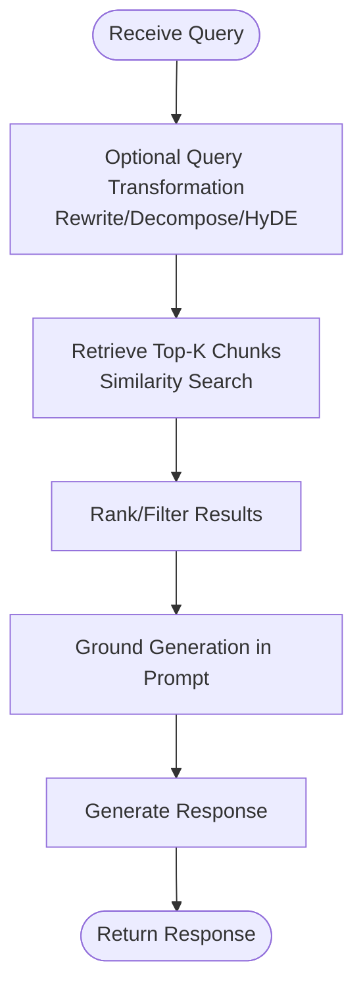
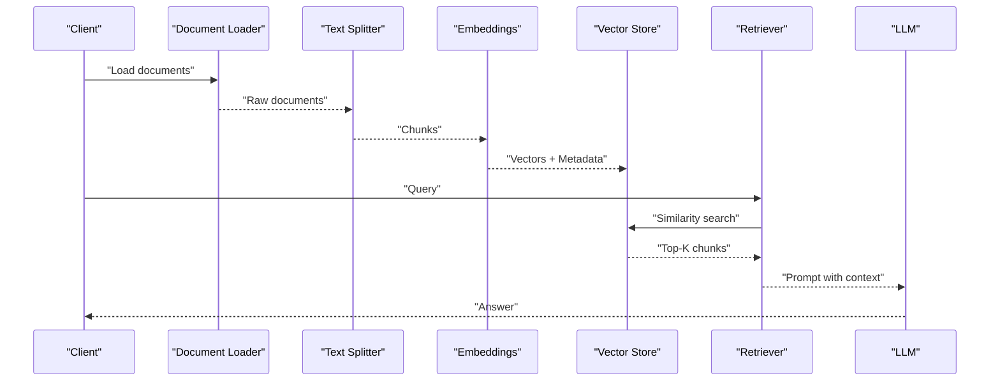
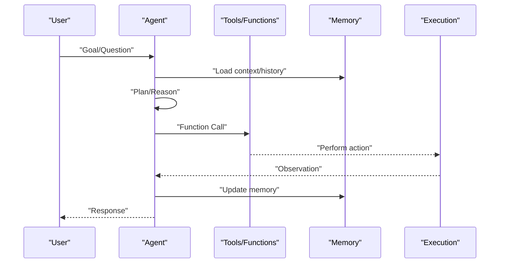
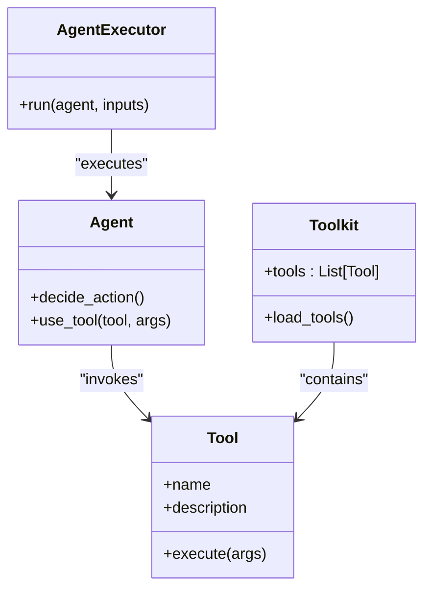
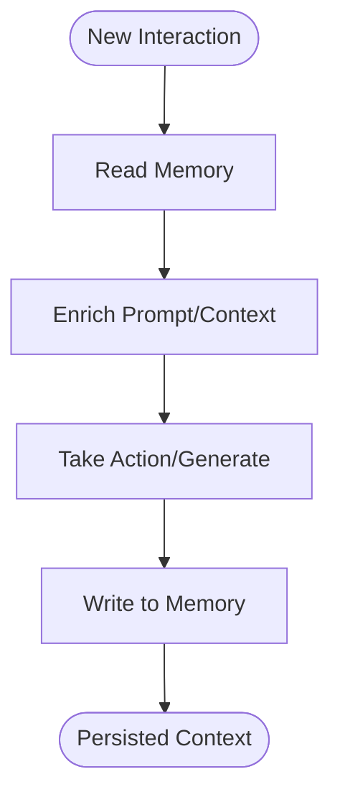
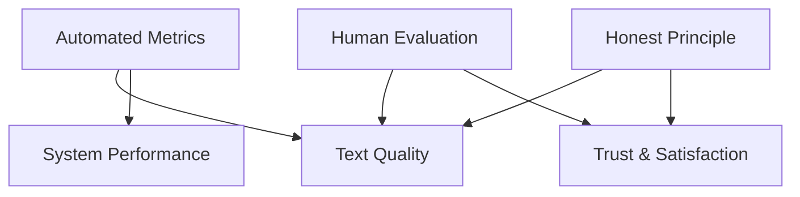
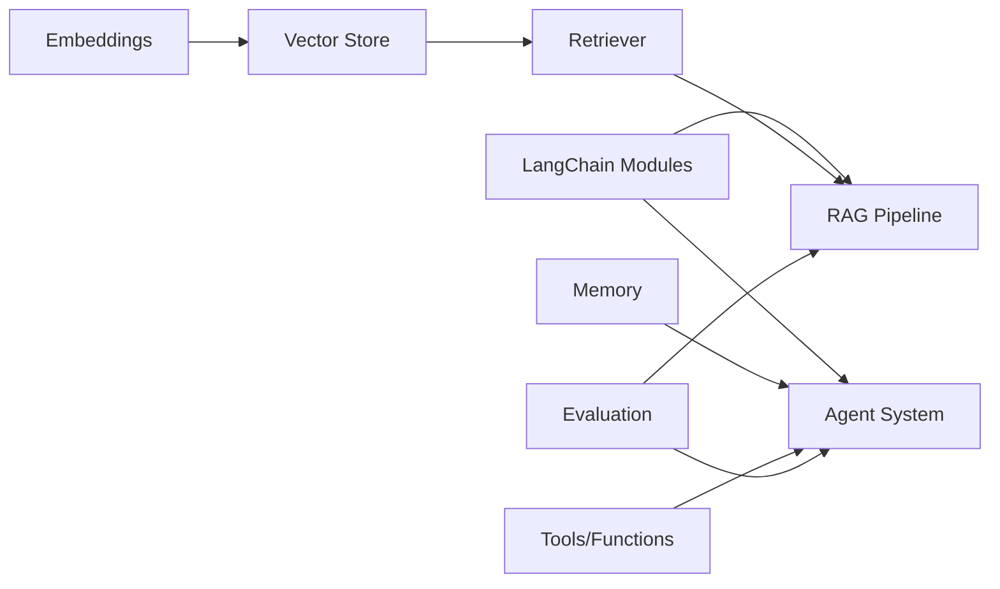

# Retrieval-Augmented Generation

<cite>
**Referenced Files in This Document**
- [08.检索增强rag/README.md](file://08.检索增强rag/README.md)
- [08.检索增强rag/检索增强llm/检索增强llm.md](file://08.检索增强rag/检索增强llm/检索增强llm.md)
- [08.检索增强rag/rag（检索增强生成）技术/rag（检索增强生成）技术.md](file://08.检索增强rag/rag（检索增强生成）技术/rag（检索增强生成）技术.md)
- [08.检索增强rag/大模型agent技术/大模型agent技术.md](file://08.检索增强rag/大模型agent技术/大模型agent技术.md)
- [10.大语言模型应用/1.langchain/1.langchain.md](file://10.大语言模型应用/1.langchain/1.langchain.md)
- [09.大语言模型评估/1.评测/1.评测.md](file://09.大语言模型评估/1.评测/1.评测.md)
- [ai_generataion/中级LLM_Agent工程师面试QA清单.md](file://ai_generataion/中级LLM_Agent工程师面试QA清单.md)
- [ai_generataion/中级LLM_Agent工程师面试_快速参考.md](file://ai_generataion/中级LLM_Agent工程师面试_快速参考.md)
</cite>

## Table of Contents
1. [Introduction](#introduction)
2. [Project Structure](#project-structure)
3. [Core Components](#core-components)
4. [Architecture Overview](#architecture-overview)
5. [Detailed Component Analysis](#detailed-component-analysis)
6. [Dependency Analysis](#dependency-analysis)
7. [Performance Considerations](#performance-considerations)
8. [Troubleshooting Guide](#troubleshooting-guide)
9. [Conclusion](#conclusion)
10. [Appendices](#appendices)

## Introduction
This document synthesizes the repository’s materials on Retrieval-Augmented Generation (RAG) and agent architectures into a practical, layered guide. It explains RAG fundamentals, retrieval-augmented generation workflows, vector database integration, and multi-modal retrieval strategies. It documents agent design patterns, multi-agent collaboration, tool usage and function calling, memory management, and long-term context handling. It further covers system architecture considerations, context management and grounding, performance optimization, and production deployment strategies. Finally, it provides practical implementation guidance, integration patterns with existing systems, evaluation methodologies, and troubleshooting approaches for common RAG and agent implementation challenges.

## Project Structure
The repository organizes RAG and agent topics under dedicated folders and supporting materials:
- Retrieval-Augmented Generation (RAG)
  - Conceptual overview and workflow
  - Vector database integration and retrieval strategies
  - Comparison with supervised fine-tuning (SFT)
- Agent Technologies
  - Evolution from prompting to agents and multi-agent systems
  - Planning, reasoning, and tool usage patterns
  - Memory and long-term context handling
- Application Frameworks
  - LangChain modules for retrieval, chains, agents, memory, and evaluation
- Evaluation
  - Automated and manual evaluation paradigms
  - Honest principle and benchmarking
- Interview Materials
  - System design and coding practice questions for RAG and agents

**Section sources**
- [08.检索增强rag/README.md:1-14](file://08.检索增强rag/README.md#L1-L14)
- [08.检索增强rag/检索增强llm/检索增强llm.md:13-80](file://08.检索增强rag/检索增强llm/检索增强llm.md#L13-L80)
- [08.检索增强rag/rag（检索增强生成）技术/rag（检索增强生成）技术.md:3-57](file://08.检索增强rag/rag（检索增强生成）技术/rag（检索增强生成）技术.md#L3-L57)
- [08.检索增强rag/大模型agent技术/大模型agent技术.md:15-120](file://08.检索增强rag/大模型agent技术/大模型agent技术.md#L15-L120)
- [10.大语言模型应用/1.langchain/1.langchain.md:17-27](file://10.大语言模型应用/1.langchain/1.langchain.md#L17-L27)
- [09.大语言模型评估/1.评测/1.评测.md:5-43](file://09.大语言模型评估/1.评测/1.评测.md#L5-L43)

## Core Components
- Data and Indexing Module
  - Data ingestion from diverse sources and formats
  - Text chunking strategies and metadata extraction
  - Index structures (linked, tree, keyword, vector)
- Retrieval Module
  - Query transformations (rewriting, decomposition, HyDE)
  - Ranking and post-processing filters
- Generation Module
  - Prompt templates and iterative refinement strategies
  - Context window constraints and grounding
- Agent Module
  - Planning, reasoning, and action selection
  - Tool usage and function calling
  - Memory and reflection mechanisms
- Evaluation
  - Automated metrics and human evaluation
  - Honest principle and bias-aware assessment

**Section sources**
- [08.检索增强rag/检索增强llm/检索增强llm.md:89-330](file://08.检索增强rag/检索增强llm/检索增强llm.md#L89-L330)
- [08.检索增强rag/rag（检索增强生成）技术/rag（检索增强生成）技术.md:39-73](file://08.检索增强rag/rag（检索增强生成）技术/rag（检索增强生成）技术.md#L39-L73)
- [08.检索增强rag/大模型agent技术/大模型agent技术.md:144-210](file://08.检索增强rag/大模型agent技术/大模型agent技术.md#L144-L210)
- [10.大语言模型应用/1.langchain/1.langchain.md:28-105](file://10.大语言模型应用/1.langchain/1.langchain.md#L28-L105)
- [09.大语言模型评估/1.评测/1.评测.md:13-43](file://09.大语言模型评估/1.评测/1.评测.md#L13-L43)

## Architecture Overview
The RAG pipeline integrates data ingestion, indexing, retrieval, and generation. Agents orchestrate tool usage and multi-step reasoning. LangChain provides modular building blocks for chains, retrievers, memory, and agents. Evaluation ensures quality and honesty.

**Diagram sources**
- [08.检索增强rag/检索增强llm/检索增强llm.md:340-410](file://08.检索增强rag/检索增强llm/检索增强llm.md#L340-L410)
- [10.大语言模型应用/1.langchain/1.langchain.md:83-105](file://10.大语言模型应用/1.langchain/1.langchain.md#L83-L105)

**Section sources**
- [08.检索增强rag/rag（检索增强生成）技术/rag（检索增强生成）技术.md:47-57](file://08.检索增强rag/rag（检索增强生成）技术/rag（检索增强生成）技术.md#L47-L57)
- [10.大语言模型应用/1.langchain/1.langchain.md:106-156](file://10.大语言模型应用/1.langchain/1.langchain.md#L106-L156)

## Detailed Component Analysis

### RAG Workflows and Retrieval Strategies
- Two-phase process: retrieval followed by generation
- Vector databases enable scalable similarity search
- Query transformations improve recall and relevance
- Ranking and filtering enhance precision
- Prompt templates ground generation in retrieved context

**Diagram sources**
- [08.检索增强rag/rag（检索增强生成）技术/rag（检索增强生成）技术.md:39-57](file://08.检索增强rag/rag（检索增强生成）技术/rag（检索增强生成）技术.md#L39-L57)
- [08.检索增强rag/检索增强llm/检索增强llm.md:332-410](file://08.检索增强rag/检索增强llm/检索增强llm.md#L332-L410)

**Section sources**
- [08.检索增强rag/rag（检索增强生成）技术/rag（检索增强生成）技术.md:11-36](file://08.检索增强rag/rag（检索增强生成）技术/rag（检索增强生成）技术.md#L11-L36)
- [08.检索增强rag/检索增强llm/检索增强llm.md:332-410](file://08.检索增强rag/检索增强llm/检索增强llm.md#L332-L410)

### Vector Database Integration
- Embedding models convert text to dense vectors
- Indexing strategies include product quantization, LSH, HNSW
- Vector stores support upsert, query, and deletion operations
- Integration with LangChain enables conversational retrieval chains

**Diagram sources**
- [08.检索增强rag/检索增强llm/检索增强llm.md:269-330](file://08.检索增强rag/检索增强llm/检索增强llm.md#L269-L330)
- [10.大语言模型应用/1.langchain/1.langchain.md:83-105](file://10.大语言模型应用/1.langchain/1.langchain.md#L83-L105)

**Section sources**
- [08.检索增强rag/检索增强llm/检索增强llm.md:213-330](file://08.检索增强rag/检索增强llm/检索增强llm.md#L213-L330)
- [10.大语言模型应用/1.langchain/1.langchain.md:83-105](file://10.大语言模型应用/1.langchain/1.langchain.md#L83-L105)

### Agent Design Patterns and Multi-Agent Collaboration
- Agents select actions via reasoning and tool use
- Planning and reflection cycles improve reliability
- Multi-agent systems coordinate roles and communication
- Memory supports long-term context and learning

**Diagram sources**
- [08.检索增强rag/大模型agent技术/大模型agent技术.md:102-120](file://08.检索增强rag/大模型agent技术/大模型agent技术.md#L102-L120)
- [08.检索增强rag/大模型agent技术/大模型agent技术.md:177-210](file://08.检索增强rag/大模型agent技术/大模型agent技术.md#L177-L210)

**Section sources**
- [08.检索增强rag/大模型agent技术/大模型agent技术.md:122-210](file://08.检索增强rag/大模型agent技术/大模型agent技术.md#L122-L210)
- [10.大语言模型应用/1.langchain/1.langchain.md:144-151](file://10.大语言模型应用/1.langchain/1.langchain.md#L144-L151)

### Tool Usage and Function Calling
- Agents invoke tools/functions to extend capabilities
- Function calling enables native API integration
- Toolkits group related tools for specific tasks

**Diagram sources**
- [08.检索增强rag/大模型agent技术/大模型agent技术.md:144-151](file://08.检索增强rag/大模型agent技术/大模型agent技术.md#L144-L151)
- [10.大语言模型应用/1.langchain/1.langchain.md:144-151](file://10.大语言模型应用/1.langchain/1.langchain.md#L144-L151)

**Section sources**
- [08.检索增强rag/大模型agent技术/大模型agent技术.md:118-121](file://08.检索增强rag/大模型agent技术/大模型agent技术.md#L118-L121)
- [10.大语言模型应用/1.langchain/1.langchain.md:144-151](file://10.大语言模型应用/1.langchain/1.langchain.md#L144-L151)

### Memory Management and Long-Term Context
- Conversation buffers and chat histories maintain context
- Memory systems support read/write across runs
- Reflection and feedback improve long-term learning

**Diagram sources**
- [08.检索增强rag/大模型agent技术/大模型agent技术.md:387-428](file://08.检索增强rag/大模型agent技术/大模型agent技术.md#L387-L428)
- [10.大语言模型应用/1.langchain/1.langchain.md:127-143](file://10.大语言模型应用/1.langchain/1.langchain.md#L127-L143)

**Section sources**
- [08.检索增强rag/大模型agent技术/大模型agent技术.md:387-428](file://08.检索增强rag/大模型agent技术/大模型agent技术.md#L387-L428)
- [10.大语言模型应用/1.langchain/1.langchain.md:127-143](file://10.大语言模型应用/1.langchain/1.langchain.md#L127-L143)

### Evaluation Methodologies
- Automated metrics (accuracy, F1, ROUGE, BLEU) and system metrics (latency, throughput)
- Human evaluation (relevance, fluency, helpfulness)
- Honest principle: refusal when uncertain, avoiding hallucinations

**Diagram sources**
- [09.大语言模型评估/1.评测/1.评测.md:31-43](file://09.大语言模型评估/1.评测/1.评测.md#L31-L43)

**Section sources**
- [09.大语言模型评估/1.评测/1.评测.md:5-43](file://09.大语言模型评估/1.评测/1.评测.md#L5-L43)

## Dependency Analysis
- LangChain connects prompts, models, retrievers, chains, agents, and memory
- RAG depends on embedding models and vector stores
- Agents depend on toolkits and memory for long-term context
- Evaluation depends on both automated and human assessments

**Diagram sources**
- [10.大语言模型应用/1.langchain/1.langchain.md:17-27](file://10.大语言模型应用/1.langchain/1.langchain.md#L17-L27)
- [08.检索增强rag/rag（检索增强生成）技术/rag（检索增强生成）技术.md:39-57](file://08.检索增强rag/rag（检索增强生成）技术/rag（检索增强生成）技术.md#L39-L57)

**Section sources**
- [10.大语言模型应用/1.langchain/1.langchain.md:17-27](file://10.大语言模型应用/1.langchain/1.langchain.md#L17-L27)
- [08.检索增强rag/rag（检索增强生成）技术/rag（检索增强生成）技术.md:39-57](file://08.检索增强rag/rag（检索增强生成）技术/rag（检索增强生成）技术.md#L39-L57)

## Performance Considerations
- Retrieval efficiency: chunk size tuning, overlap windows, multi-vector embeddings
- Indexing: HNSW, IVF, product quantization trade-offs
- Generation efficiency: dynamic batching, KV cache pooling, pre-allocation
- Latency optimization: caching, hybrid retrieval, re-ranking
- Scalability: horizontal sharding, async I/O, auto-scaling

[No sources needed since this section provides general guidance]

## Troubleshooting Guide
- Hallucination mitigation
  - Ground answers in retrieved context
  - Apply honest refusal when unknown
- Retrieval quality
  - Adjust chunking strategy and overlap
  - Use query rewriting and HyDE
  - Introduce re-ranking and temporal filters
- Agent reliability
  - Validate tool outputs and handle errors gracefully
  - Use reflection loops to improve decisions
- Memory consistency
  - Maintain separate short-term and long-term memory
  - Periodic consolidation and pruning

**Section sources**
- [08.检索增强rag/rag（检索增强生成）技术/rag（检索增强生成）技术.md:11-36](file://08.检索增强rag/rag（检索增强生成）技术/rag（检索增强生成）技术.md#L11-L36)
- [08.检索增强rag/大模型agent技术/大模型agent技术.md:114-121](file://08.检索增强rag/大模型agent技术/大模型agent技术.md#L114-L121)
- [09.大语言模型评估/1.评测/1.评测.md:13-18](file://09.大语言模型评估/1.评测/1.评测.md#L13-L18)

## Conclusion
RAG and agent architectures form a cohesive ecosystem for intelligent, grounded, and reliable systems. RAG improves accuracy and freshness by retrieving relevant context, while agents enable autonomous, tool-augmented problem solving with memory and reflection. LangChain offers modular primitives to assemble these systems efficiently. Robust evaluation and honest principles ensure trustworthiness. With careful design around retrieval quality, vector indexing, agent coordination, and memory management, teams can build production-grade solutions that balance performance, scalability, and interpretability.

[No sources needed since this section summarizes without analyzing specific files]

## Appendices

### Practical Implementation Guidance
- Data ingestion and chunking
  - Choose chunk sizes aligned with downstream embedding and context limits
  - Preserve semantic boundaries and apply overlap
- Vector database setup
  - Select index type based on dataset scale and latency targets
  - Maintain metadata for filtering and temporal ranking
- Retrieval-augmented generation
  - Use prompt templates that clearly separate context and instructions
  - Iterate with retrieval feedback and re-ranking
- Agent orchestration
  - Define clear roles and communication protocols
  - Implement retry, timeout, and fallback strategies
- Evaluation and monitoring
  - Track automated metrics and human evaluations
  - Monitor latency, hallucination rates, and user satisfaction

**Section sources**
- [08.检索增强rag/rag（检索增强生成）技术/rag（检索增强生成）技术.md:47-57](file://08.检索增强rag/rag（检索增强生成）技术/rag（检索增强生成）技术.md#L47-L57)
- [08.检索增强rag/大模型agent技术/大模型agent技术.md:177-210](file://08.检索增强rag/大模型agent技术/大模型agent技术.md#L177-L210)
- [09.大语言模型评估/1.评测/1.评测.md:31-43](file://09.大语言模型评估/1.评测/1.评测.md#L31-L43)

### System Architecture Considerations
- Modular composition using LangChain abstractions
- Separation of concerns: retrieval, generation, reasoning, memory
- Observability: logging, tracing, and alerting for latency and error rates
- Security: access control for private data and vector stores

**Section sources**
- [10.大语言模型应用/1.langchain/1.langchain.md:17-27](file://10.大语言模型应用/1.langchain/1.langchain.md#L17-L27)
- [08.检索增强rag/rag（检索增强生成）技术/rag（检索增强生成）技术.md:39-57](file://08.检索增强rag/rag（检索增强生成）技术/rag（检索增强生成）技术.md#L39-L57)

### Interview Preparation Notes
- Focus areas: Transformer basics, inference optimization, RAG systems, agent design patterns
- Practice whiteboard coding for sampling and KV cache management
- Prepare project examples demonstrating system design trade-offs and measurable outcomes

**Section sources**
- [ai_generataion/中级LLM_Agent工程师面试QA清单.md:12-52](file://ai_generataion/中级LLM_Agent工程师面试QA清单.md#L12-L52)
- [ai_generataion/中级LLM_Agent工程师面试_快速参考.md:38-66](file://ai_generataion/中级LLM_Agent工程师面试_快速参考.md#L38-L66)