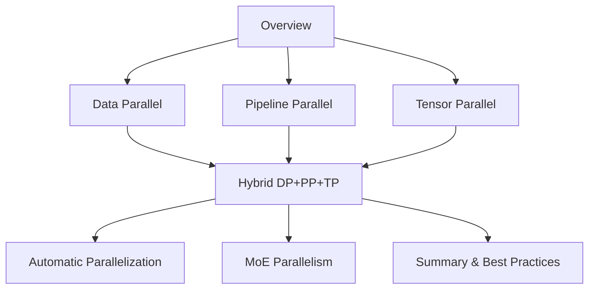
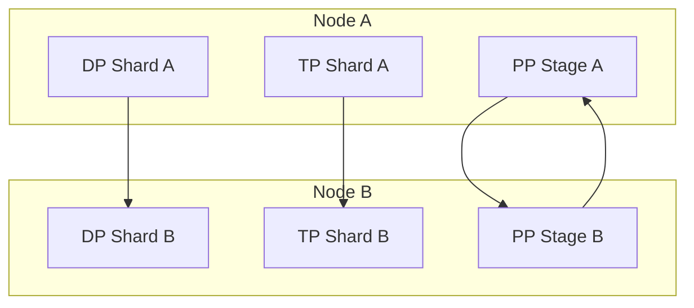
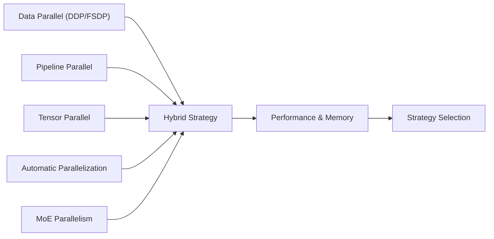
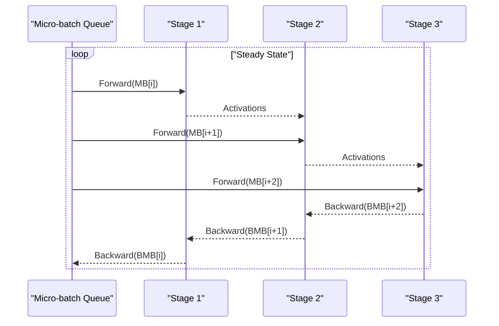
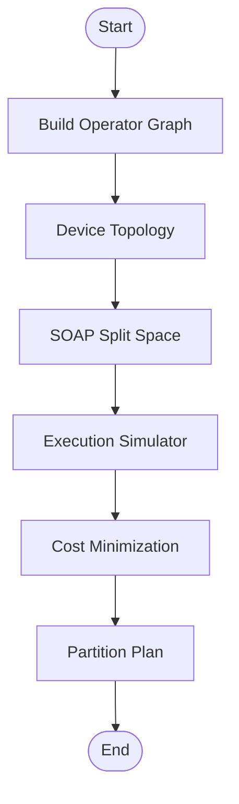

# Advanced Parallelization Techniques

<cite>
**Referenced Files in This Document**
- [04.分布式训练/1.概述/1.概述.md](file://04.分布式训练/1.概述/1.概述.md)
- [04.分布式训练/2.数据并行/2.数据并行.md](file://04.分布式训练/2.数据并行/2.数据并行.md)
- [04.分布式训练/3.流水线并行/3.流水线并行.md](file://04.分布式训练/3.流水线并行/3.流水线并行.md)
- [04.分布式训练/4.张量并行/4.张量并行.md](file://04.分布式训练/4.张量并行/4.张量并并行.md)
- [04.分布式训练/6.多维度混合并行/6.多维度混合并行.md](file://04.分布式训练/6.多维度混合并行/6.多维度混合并行.md)
- [04.分布式训练/7.自动并行/7.自动并行.md](file://04.分布式训练/7.自动并行/7.自动并行.md)
- [04.分布式训练/8.moe并行/8.moe并行.md](file://04.分布式训练/8.moe并行/8.moe并行.md)
- [04.分布式训练/9.总结/9.总结.md](file://04.分布式训练/9.总结/9.总结.md)
</cite>

## Table of Contents
1. [Introduction](#introduction)
2. [Project Structure](#project-structure)
3. [Core Components](#core-components)
4. [Architecture Overview](#architecture-overview)
5. [Detailed Component Analysis](#detailed-component-analysis)
6. [Dependency Analysis](#dependency-analysis)
7. [Performance Considerations](#performance-considerations)
8. [Troubleshooting Guide](#troubleshooting-guide)
9. [Conclusion](#conclusion)
10. [Appendices](#appendices)

## Introduction
This document synthesizes advanced parallelization techniques for large-scale model training, focusing on multi-dimensional hybrid parallelism, automatic parallelization, and Mixture of Experts (MoE) parallelization. It explains how to combine data parallelism, tensor parallelism, and pipeline parallelism for optimal performance, documents automatic parallelization approaches that reduce manual complexity, and covers MoE strategies for sparse expert activation and load balancing. Implementation guidelines, performance optimization strategies, and best practices are provided for different model sizes and hardware configurations, along with troubleshooting guidance and practical hybrid parallelism setups.

## Project Structure
The repository organizes distributed training knowledge into focused chapters:
- Overview: foundational concepts and taxonomy of parallelism
- Data Parallelism: DDP, FSDP, and ZeRO variants
- Pipeline Parallelism: micro-batching, 1F1B scheduling, and variants
- Tensor Parallelism: 1D, 2D, 2.5D, 3D, and PyTorch DTensor
- Hybrid Parallelism: combinations and real-world deployments
- Automatic Parallelization: semi- and fully automatic systems
- MoE Parallelism: routing, capacity balancing, and frameworks
- Summary: strategy selection and mixed precision

**Section sources**
- [04.分布式训练/1.概述/1.概述.md:1-102](file://04.分布式训练/1.概述/1.概述.md#L1-L102)
- [04.分布式训练/9.总结/9.总结.md:1-125](file://04.分布式训练/9.总结/9.总结.md#L1-L125)

## Core Components
- Data Parallelism (DDP, FSDP, ZeRO): scales compute across devices while replicating model copies locally; FSDP shards parameters/gradients/optimizer states to reduce memory footprint; ZeRO stages progressively shard optimizer states, gradients, and parameters.
- Pipeline Parallelism (GPipe, PipeDream, Flush, 2BW): partitions layers across devices; micro-batching mitigates bubbles; 1F1B reduces peak activation memory; interleaved scheduling increases throughput.
- Tensor Parallelism (1D, 2D, 2.5D, 3D, DTensor): splits tensors within operators; 2D/2.5D/3D reduces activation memory; PyTorch DTensor enables flexible sharding and composition with DDP/FSDP.
- Automatic Parallelization (Mesh-TensorFlow, GSPMD, FlexFlow, Alpa): semi- or fully automatic partitioning strategies to minimize manual effort.
- MoE Parallelism: sparse routing, expert capacity balancing, auxiliary losses, and framework integrations (PaddlePaddle, DeepSpeed).

**Section sources**
- [04.分布式训练/2.数据并行/2.数据并行.md:1-330](file://04.分布式训练/2.数据并行/2.数据并行.md#L1-L330)
- [04.分布式训练/3.流水线并行/3.流水线并行.md:1-264](file://04.分布式训练/3.流水线并行/3.流水线并行.md#L1-L264)
- [04.分布式训练/4.张量并行/4.张量并行.md:1-441](file://04.分布式训练/4.张量并行/4.张量并并行.md#L1-L441)
- [04.分布式训练/7.自动并行/7.自动并行.md:1-274](file://04.分布式训练/7.自动并行/7.自动并行.md#L1-L274)
- [04.分布式训练/8.moe并行/8.moe并行.md:1-317](file://04.分布式训练/8.moe并行/8.moe并行.md#L1-L317)

## Architecture Overview
The hybrid parallelism architecture integrates data, tensor, and pipeline parallelism to scale efficiently across nodes and chips. The guidance below reflects industry practice and repository insights.

Key principles:
- Within-node: prefer tensor parallelism for compute-bound ops and pipeline parallelism for layer-bound work.
- Across-node: use data parallelism to distribute replicas and reduce per-device memory.
- Combine DP + PP + TP for 3D parallelism; ZeRO-DP can complement DP to reduce optimizer memory.

**Diagram sources**
- [04.分布式训练/6.多维度混合并行/6.多维度混合并行.md:17-37](file://04.分布式训练/6.多维度混合并行/6.多维度混合并行.md#L17-L37)
- [04.分布式训练/9.总结/9.总结.md:86-101](file://04.分布式训练/9.总结/9.总结.md#L86-L101)

**Section sources**
- [04.分布式训练/6.多维度混合并行/6.多维度混合并行.md:17-37](file://04.分布式训练/6.多维度混合并行/6.多维度混合并行.md#L17-L37)
- [04.分布式训练/9.总结/9.总结.md:86-101](file://04.分布式训练/9.总结/9.总结.md#L86-L101)

## Detailed Component Analysis

### Data Parallelism (DDP, FSDP, ZeRO)
- DDP: multi-process training with gradient synchronization via all-reduce; efficient for moderate models.
- FSDP: shards parameters, gradients, and optimizer states across ranks; supports CPU offload for memory-constrained scenarios.
- ZeRO: progressive sharding of optimizer states, gradients, and parameters; ZeRO-1/2/3 trade off memory vs. communication overhead.

Implementation highlights:
- FSDP reduces peak memory by collecting full parameters only during local forward/backward and scattering gradients afterward.
- ZeRO-1/2/3 enable training larger models on limited GPU memory by distributing model states.

Best practices:
- Prefer FSDP for single-node memory pressure; use ZeRO-1/2/3 depending on convergence stability and communication budget.
- Combine ZeRO with pipeline parallelism cautiously; PP + ZeRO-2/3 may degrade performance; ZeRO-1 can be combined with PP.

**Section sources**
- [04.分布式训练/2.数据并行/2.数据并行.md:56-330](file://04.分布式训练/2.数据并行/2.数据并行.md#L56-L330)
- [04.分布式训练/9.总结/9.总结.md:86-101](file://04.分布式训练/9.总结/9.总结.md#L86-L101)

### Pipeline Parallelism (GPipe, PipeDream, Flush, 2BW)
- GPipe: micro-batching to overlap computation and communication; F-then-B scheduling; re-materialization to reduce activation memory.
- PipeDream/Flush: 1F1B scheduling to reduce peak activations; PipeDream-2BW maintains only two weight buffers to cut memory.
- Interleaved scheduling: virtual pipeline stages increase stage count and reduce bubbles at higher communication cost.

Scheduling modes:
- Non-interleaved 1F1B: steady-state alternation of F/B per micro-batch; reduces activation memory.
- Interleaved 1F1B: virtual stages improve bubble rate; requires micro-batch divisible by pipeline stages.

Framework support:
- PyTorch: GPipe-like sync pipeline.
- DeepSpeed: PipeDream-Flush non-interleaved 1F1B.
- Megatron-LM: improved interleaved 1F1B virtual pipeline.

**Section sources**
- [04.分布式训练/3.流水线并行/3.流水线并行.md:56-264](file://04.分布式训练/3.流水线并行/3.流水线并行.md#L56-L264)

### Tensor Parallelism (1D, 2D, 2.5D, 3D, DTensor)
- 1D (Megatron-LM): row/column splitting of linear layers; frequent all-reduce for gradients/activations.
- 2D (Colossal-AI): split inputs and weights across rows and columns; reduces activation memory.
- 2.5D/3D: leverage extra devices to reduce communication; fine-grained partitioning minimizes redundant broadcasts.

PyTorch DTensor:
- DeviceMesh and parallelize_module enable pairwise row/col sharding and composition with DDP/FSDP.

Guidelines:
- Choose dimensionality based on available devices and network bandwidth; 2D/2.5D/3D reduce activation memory but increase communication.
- Align head counts with device grid for attention heads to minimize fragmentation.

**Section sources**
- [04.分布式训练/4.张量并行/4.张量并行.md:47-441](file://04.分布式训练/4.张量并行/4.张量并行.md#L47-L441)

### Automatic Parallelization (Mesh-TensorFlow, GSPMD, FlexFlow, Alpa)
- Mesh-TensorFlow: SPMD-style layout annotations; supports reductions, Einstein summation, reshape; limited to language models.
- GSPMD: unified representation of tensor sharding; supports nested parallel modes; SPMD compilation for scalability.
- FlexFlow: SOAP search space over sample/attribute/parameter/operator dimensions; execution simulator predicts performance; runtime built on Legion.
- Alpa: automatic inter-op and intra-op parallelization; dynamic programming for stage clustering and ILP for operator partitioning; integrates with JAX/XLA.

Benefits:
- Reduce manual partitioning effort; explore layouts automatically; integrate with existing frameworks.

Trade-offs:
- Mesh-TensorFlow requires DSL rewriting; GSPMD relies on XLA; FlexFlow’s simulator assumes predictable task times; Alpa’s search space is complex.

**Section sources**
- [04.分布式训练/7.自动并行/7.自动并并行.md:16-274](file://04.分布式训练/7.自动并行/7.自动并行.md#L16-L274)

### MoE Parallelism (Routing, Capacity Balancing, Load Balancing)
- MoE replaces dense layers with experts; gating selects top-k experts per token; sparse activation reduces compute.
- Strategies:
  - MoE + Data Parallel: replicate gate and experts; simple but memory-limited by single device.
  - MoE + Expert Parallel: distribute experts across devices; requires extra communication.
  - Hybrid: MoE + DP + TP or ZeRO-enhanced DP.

Load balancing and capacity:
- Expert capacity balancing ensures per-expert token load stays within bounds.
- Local group dispatching improves parallelism.
- Auxiliary loss mitigates “winner-takes-all” routing imbalance.
- Random routing optimizes Top-2 gating.

Frameworks:
- PaddlePaddle: MoELayer API with distributed groups and gate configuration.
- DeepSpeed: MoE layers with ZeRO-Offload; parameter grouping for optimizer.

**Section sources**
- [04.分布式训练/8.moe并行/8.moe并行.md:25-317](file://04.分布式训练/8.moe并行/8.moe并行.md#L25-L317)

## Dependency Analysis
The following diagram maps dependencies among parallelism components and their interactions in hybrid training.

Observations:
- DP and TP are often colocated within nodes; PP spans nodes.
- Automatic parallelization can propose partitioning plans for DP/TP/PP/MoE.
- MoE adds routing and capacity constraints; requires careful balance with DP/TP/PP.

**Diagram sources**
- [04.分布式训练/6.多维度混合并行/6.多维度混合并行.md:17-37](file://04.分布式训练/6.多维度混合并行/6.多维度混合并行.md#L17-L37)
- [04.分布式训练/7.自动并行/7.自动并行.md:16-274](file://04.分布式训练/7.自动并行/7.自动并行.md#L16-L274)
- [04.分布式训练/8.moe并行/8.moe并行.md:25-317](file://04.分布式训练/8.moe并行/8.moe并行.md#L25-L317)

**Section sources**
- [04.分布式训练/6.多维度混合并行/6.多维度混合并行.md:17-37](file://04.分布式训练/6.多维度混合并行/6.多维度混合并行.md#L17-L37)
- [04.分布式训练/7.自动并行/7.自动并行.md:16-274](file://04.分布式训练/7.自动并行/7.自动并行.md#L16-L274)
- [04.分布式训练/8.moe并行/8.moe并行.md:25-317](file://04.分布式训练/8.moe并行/8.moe并行.md#L25-L317)

## Performance Considerations
- Communication vs. computation trade-offs:
  - TP increases intra-node communication; PP reduces per-device activation memory but introduces bubbles.
  - DP reduces parameter redundancy; ZeRO stages reduce optimizer memory at the cost of extra collectives.
- Mixed precision:
  - BF16 offers broader dynamic range than FP16; beneficial for very large models; FP16 remains common for smaller models.
- Scheduling and micro-batching:
  - 1F1B reduces peak activation memory; interleaved scheduling improves bubble rate at higher communication cost.
- Automatic parallelization:
  - Use simulators to predict performance; tune layout annotations to match hardware bandwidth and latency.

[No sources needed since this section provides general guidance]

## Troubleshooting Guide
Common issues and remedies:
- Excessive bubbles in pipeline parallelism:
  - Increase micro-batch count; adopt 1F1B scheduling; consider interleaved scheduling; ensure micro-batch divisible by pipeline stages.
- Gradient synchronization inefficiencies:
  - Use FSDP or ZeRO-1/2/3 to shard optimizer states/gradients; avoid PP + ZeRO-2/3 combinations that harm performance.
- Memory spikes in MoE:
  - Enable expert capacity balancing; use auxiliary loss; consider random routing; distribute experts across devices.
- Automatic parallelization pitfalls:
  - Mesh-TensorFlow requires DSL rewriting; GSPMD’s layout search may not fit all models; FlexFlow’s simulator assumes predictable task durations; Alpa’s search space is large and requires tuning.

**Section sources**
- [04.分布式训练/3.流水线并行/3.流水线并行.md:56-264](file://04.分布式训练/3.流水线并行/3.流水线并行.md#L56-L264)
- [04.分布式训练/2.数据并行/2.数据并行.md:143-330](file://04.分布式训练/2.数据并行/2.数据并行.md#L143-L330)
- [04.分布式训练/8.moe并行/8.moe并行.md:25-317](file://04.分布式训练/8.moe并行/8.moe并行.md#L25-L317)
- [04.分布式训练/7.自动并行/7.自动并行.md:16-274](file://04.分布式训练/7.自动并行/7.自动并行.md#L16-L274)

## Conclusion
Combining data, tensor, and pipeline parallelism yields scalable training for billion- to trillion-parameter models. Automatic parallelization reduces manual complexity, while MoE enables sparse computation scaling. Strategy selection depends on hardware characteristics, model size, and convergence stability. Practical hybrid setups should balance communication, memory, and compute, and leverage automatic tools to explore partitioning plans efficiently.

[No sources needed since this section summarizes without analyzing specific files]

## Appendices

### Practical Hybrid Parallelism Setup Guidelines
- Single-node multi-GPU:
  - Prefer DP + TP within node; use ZeRO-1/2/3 to reduce optimizer memory; keep TP within node limits.
- Multi-node:
  - Use DP across nodes; combine with PP + TP; ensure sufficient bandwidth for TP; consider ZeRO-1 with PP.
- MoE:
  - Use expert parallelism; balance tokens per expert; apply auxiliary loss; integrate with DP/TP/PP as needed.

**Section sources**
- [04.分布式训练/6.多维度混合并行/6.多维度混合并行.md:17-37](file://04.分布式训练/6.多维度混合并行/6.多维度混合并行.md#L17-L37)
- [04.分布式训练/9.总结/9.总结.md:86-101](file://04.分布式训练/9.总结/9.总结.md#L86-L101)

### Example Workflows

#### Pipeline Parallelism Workflow (1F1B)

**Diagram sources**
- [04.分布式训练/3.流水线并行/3.流水线并行.md:122-159](file://04.分布式训练/3.流水线并行/3.流水线并行.md#L122-L159)

#### Automatic Parallelization Search (FlexFlow)

**Diagram sources**
- [04.分布式训练/7.自动并行/7.自动并行.md:109-204](file://04.分布式训练/7.自动并行/7.自动并行.md#L109-L204)