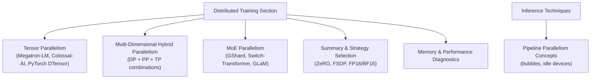
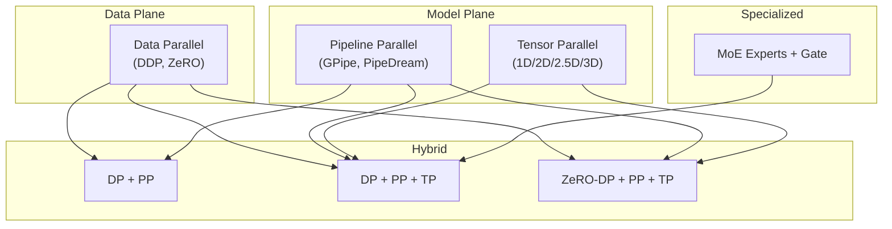
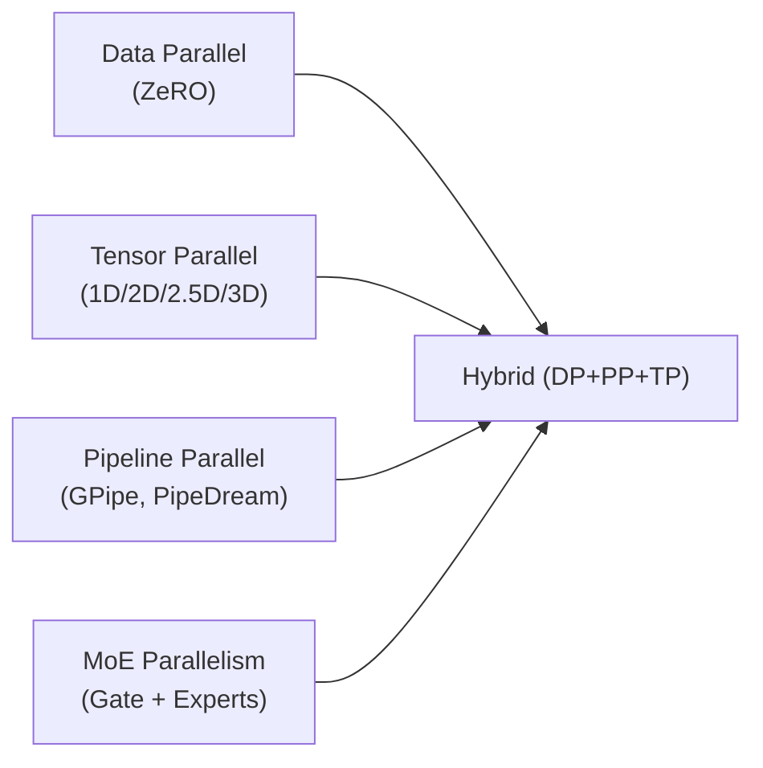

# Distributed Training Fundamentals

<cite>
**Referenced Files in This Document**
- [04.分布式训练/4.张量并行/4.张量并行.md](file://04.分布式训练/4.张量并行/4.张量并parallel.md)
- [04.分布式训练/6.多维度混合并行/6.多维度混合并行.md](file://04.分布式训练/6.多维度混合并行/6.多维度混合并行.md)
- [04.分布式训练/8.moe并行/8.moe并行.md](file://04.分布式训练/8.moe并行/8.moe并行.md)
- [04.分布式训练/9.总结/9.总结.md](file://04.分布式训练/9.总结/9.总结.md)
- [04.分布式训练/1.显存问题/1.显存问题.md](file://04.分布式训练/1.显存问题/1.显存问题.md)
- [06.推理/llm推理优化技术/llm推理优化技术.md](file://06.推理/llm推理优化技术/llm推理优化技术.md)
</cite>

## Table of Contents
1. [Introduction](#introduction)
2. [Project Structure](#project-structure)
3. [Core Components](#core-components)
4. [Architecture Overview](#architecture-overview)
5. [Detailed Component Analysis](#detailed-component-analysis)
6. [Dependency Analysis](#dependency-analysis)
7. [Performance Considerations](#performance-considerations)
8. [Troubleshooting Guide](#troubleshooting-guide)
9. [Conclusion](#conclusion)
10. [Appendices](#appendices)

## Introduction
This document consolidates the distributed training fundamentals from the repository, focusing on three core parallelization strategies: data parallelism, tensor parallelism, and pipeline parallelism. It explains how these strategies are implemented and combined, highlights trade-offs and communication overhead, and provides practical configuration insights grounded in the repository’s materials. It also covers hybrid strategies (data + pipeline + tensor), MoE parallelism, and performance considerations such as GPU utilization and memory footprint.

## Project Structure
The distributed training content is organized by topic within the “04.分布式训练” (Distributed Training) section. The most relevant files for this document are:
- Tensor parallelism fundamentals and Megatron-LM/Colossal-AI integration
- Multi-dimensional hybrid parallelism (data + pipeline + tensor)
- MoE parallelism and framework support
- General summaries and strategy selection guidance
- Practical notes on memory and performance diagnostics

**Section sources**
- [04.分布式训练/4.张量并行/4.张量并行.md:1-441](file://04.分布式训练/4.张量并行/4.张量并行.md#L1-L441)
- [04.分布式训练/6.多维度混合并行/6.多维度混合并行.md:1-109](file://04.分布式训练/6.多维度混合并行/6.多维度混合并行.md#L1-L109)
- [04.分布式训练/8.moe并行/8.moe并行.md:1-317](file://04.分布式训练/8.moe并行/8.moe并行.md#L1-L317)
- [04.分布式训练/9.总结/9.总结.md:1-125](file://04.分布式训练/9.总结/9.总结.md#L1-L125)
- [04.分布式训练/1.显存问题/1.显存问题.md:1-70](file://04.分布式训练/1.显存问题/1.显存问题.md#L1-L70)
- [06.推理/llm推理优化技术/llm推理优化技术.md:74-84](file://06.推理/llm推理优化技术/llm推理优化技术.md#L74-L84)

## Core Components
- Data parallelism: Distributes data across devices; the repository emphasizes its broad adoption and variants including ZeRO enhancements.
- Tensor parallelism: Splits tensors (weights/activations) across devices; covered via 1D (Megatron-LM), 2D/2.5D/3D (Colossal-AI), and PyTorch DTensor approaches.
- Pipeline parallelism: Partitions model layers across devices; the repository outlines naive pipeline, micro-batching (GPipe), and 1F1B variants (PipeDream/Flush), plus inference pipeline bubble concerns.

**Section sources**
- [04.分布式训练/9.总结/9.总结.md:3-15](file://04.分布式训练/9.总结/9.总结.md#L3-L15)
- [04.分布式训练/4.张量并行/4.张量并行.md:47-109](file://04.分布式训练/4.张量并行/4.张量并行.md#L47-L109)
- [06.推理/llm推理优化技术/llm推理优化技术.md:80-84](file://06.推理/llm推理优化技术/llm推理优化技术.md#L80-L84)

## Architecture Overview
The repository presents a layered understanding of distributed training:
- Data parallelism reduces memory per device by splitting batches and often gradients/optimizer states (ZeRO).
- Tensor parallelism splits weights/activations to fit larger models on limited GPU memory.
- Pipeline parallelism stages layers across devices to reduce per-device activation memory.
- Hybrid strategies combine DP, PP, and TP; ZeRO can complement DP/PP/TP depending on stage and topology.
- MoE introduces sparsity and expert distribution to scale model capacity.

**Diagram sources**
- [04.分布式训练/6.多维度混合并行/6.多维度混合并行.md:5-37](file://04.分布式训练/6.多维度混合并行/6.多维度混合并行.md#L5-L37)
- [04.分布式训练/4.张量并行/4.张量并行.md:47-109](file://04.分布式训练/4.张量并行/4.张tensor并行.md#L47-L109)
- [04.分布式训练/9.总结/9.总结.md:11-15](file://04.分布式训练/9.总结/9.总结.md#L11-L15)

## Detailed Component Analysis

### Data Parallelism
- Purpose: Reduce per-device memory footprint by splitting data and optionally gradients/optimizer states.
- Implementation highlights:
  - Historical progression: DataParallel → DistributedDataParallel → FullyShardedDataParallel.
  - Enhanced data parallelism via ZeRO (DeepSpeed), which shards optimizer states and gradients to scale beyond single-node memory limits.
- Trade-offs:
  - Simplicity and broad compatibility.
  - Communication overhead proportional to gradient/parameter sharding size; benefits depend on intra-node bandwidth and topology.

Practical configuration guidelines:
- Prefer ZeRO-1/2/3 depending on memory budget and convergence stability needs.
- Ensure balanced batch distribution and consider overlap of communication/computation where supported.

Performance characteristics:
- Strong scaling up to a point; bottlenecks often shift from compute to communication as shard sizes grow.

Common challenges:
- Gradient synchronization latency and imbalance across workers.
- Memory fragmentation and overhead of optimizer states.

**Section sources**
- [04.分布式训练/9.总结/9.总结.md:3-10](file://04.分布式训练/9.总结/9.总结.md#L3-L10)
- [04.分布式训练/9.总结/9.总结.md:95-99](file://04.分布式训练/9.总结/9.总结.md#L95-L99)

### Tensor Parallelism
- Purpose: Split tensors (weights/activations) across devices to fit large models and reduce activation memory.
- Approaches:
  - 1D (row/column) parallelism (Megatron-LM): splits weights along a single dimension; requires AllReduce for activations/gradients in certain layers.
  - Multi-dimensional (2D/2.5D/3D) parallelism (Colossal-AI): partitions inputs and weights across rows/columns/depth to reduce activation memory and communication volume.
  - PyTorch DTensor: SPMD-style abstraction enabling tensor parallel, DDP, and FSDP composition with flexible sharding and replication.
- Implementation examples:
  - Megatron-LM initialization of model-parallel groups.
  - Colossal-AI 2D/2.5D/3D configurations and input partitioning.
  - PyTorch DTensor DeviceMesh and PairwiseParallel usage.

Trade-offs and communication overhead:
- 1D tensor parallelism: high communication cost due to ring-based AllReduce across all ranks; activation memory remains full per device.
- 2D/2.5D/3D tensor parallelism: reduced activation memory and improved communication locality; still involves substantial inter-device communication.

Hardware utilization patterns:
- 2D/2.5D/3D can improve memory bandwidth utilization by reducing activation sizes and increasing arithmetic intensity relative to communication.
- Requires careful device mesh topology and alignment of tensor partitions with hardware topologies.

**Section sources**
- [04.分布式训练/4.张量并行/4.张量并行.md:47-109](file://04.分布式训练/4.张量并行/4.张量并行.md#L47-L109)
- [04.分布式训练/4.张量并行/4.张量并行.md:170-229](file://04.分布式训练/4.张量并行/4.张量并行.md#L170-L229)
- [04.分布式训练/4.张量并行/4.张量并行.md:281-308](file://04.分布式训练/4.张量并行/4.张量并行.md#L281-L308)
- [04.分布式训练/4.张量并行/4.张量并行.md:356-382](file://04.分布式训练/4.张量并行/4.张量并行.md#L356-L382)
- [04.分布式训练/4.张量并行/4.张量并行.md:398-434](file://04.分布式训练/4.张量并行/4.张量并行.md#L398-L434)

### Pipeline Parallelism
- Purpose: Partition model layers across devices to reduce per-device activation memory; also called layer-parallel.
- Approaches:
  - Naive pipeline: suffers from large bubbles (idle devices while waiting for upstream outputs).
  - GPipe (F-then-B): improves device utilization but retains multiple micro-batches’ activations/gradients, limiting memory efficiency.
  - PipeDream/1F1B variants: alternate forward/backward to free intermediate activations earlier, reducing memory footprint and enabling larger micro-batches.
- Inference perspective: pipeline bubbles cause idle time on devices awaiting upstream outputs.

Trade-offs and communication overhead:
- Bubble reduction via micro-batching and 1F1B scheduling improves GPU utilization.
- Inter-device communication increases with pipeline stage count; careful micro-batch sizing and scheduling mitigate overhead.

Hardware utilization patterns:
- Effective with high arithmetic intensity and sufficient pipeline stages; under-provisioned stages increase bubble time.

Common challenges:
- Device idle time due to bubbles.
- Careful scheduling and micro-batch coordination to avoid stalls.

**Section sources**
- [04.分布式训练/9.总结/9.总结.md:11-15](file://04.分布式训练/9.总结/9.总结.md#L11-L15)
- [06.推理/llm推理优化技术/llm推理优化技术.md:80-84](file://06.推理/llm推理优化技术/llm推理优化技术.md#L80-L84)

### Hybrid Strategies: DP + PP + TP
- Combinations:
  - DP + PP: splits data and layers; requires careful micro-batch scheduling.
  - 3D parallel (DP + PP + TP): integrates data, pipeline, and tensor parallelism; minimizes per-device memory and enables large models.
  - ZeRO-DP + PP + TP: leverages ZeRO stages to shard optimizer states/gradients while combining with PP and TP.
- Real-world examples:
  - GPT-NeoX: 2-way TP + 4-way PP chosen to localize heavy communication within nodes.
  - GLM-130B: 4-way TP + 8-way PP with PipeDream-Flush to reduce bubbles and enable large global batch.
  - OPT/Bloom/Megatron-Turing NLG: demonstrate 3D parallel scaling across hundreds of GPUs.

Configuration guidelines:
- Choose TP size within a node; align PP stages with inter-node communication boundaries.
- Use ZeRO-1 for hybrid setups to minimize extra communication overhead compared to ZeRO-2/3 with PP.

**Section sources**
- [04.分布式训练/6.多维度混合并行/6.多维度混合并行.md:5-37](file://04.分布式训练/6.多维度混合并行/6.多维度混合并行.md#L5-L37)
- [04.分布式训练/6.多维度混合并行/6.多维度混合并行.md:41-109](file://04.分布式训练/6.多维度混合并行/6.多维度混合并行.md#L41-L109)
- [04.分布式训练/9.总结/9.总结.md:95-99](file://04.分布式训练/9.总结/9.总结.md#L95-L99)

### MoE Parallelism
- Purpose: Scale model capacity with sparse computation by routing tokens to a subset of experts per layer.
- Strategies:
  - Data-parallel MoE: replicate gate/experts across devices; constrained by per-device memory.
  - Model-parallel MoE: distribute experts across devices; adds cross-device communication for routing/aggregation.
- Framework support:
  - PaddlePaddle MoELayer with expert groups and gating.
  - DeepSpeed MoE with multiple parallel forms and ZeRO offload combinations.

Trade-offs:
- Reduced compute per token due to sparsity; routing overhead and auxiliary losses balance capacity gains.

**Section sources**
- [04.分布式训练/8.moe并行/8.moe并行.md:25-49](file://04.分布式训练/8.moe并行/8.moe并行.md#L25-L49)
- [04.分布式训练/8.moe并行/8.moe并行.md:92-180](file://04.分布式训练/8.moe并行/8.moe并行.md#L92-L180)
- [04.分布式训练/8.moe并行/8.moe并行.md:182-312](file://04.分布式训练/8.moe并行/8.moe并行.md#L182-L312)

## Dependency Analysis
- Data parallelism depends on collective communications for gradient synchronization; ZeRO reduces synchronization cost by sharding.
- Tensor parallelism depends on device meshes and AllReduce/AllGather operations; multi-dimensional schemes reduce activation memory but may increase communication volume.
- Pipeline parallelism depends on micro-batch scheduling and 1F1B ordering to reduce bubbles; inter-stage communication scales with stage depth.
- Hybrid strategies couple DP/PP/TP with ZeRO; compatibility varies (e.g., ZeRO-2/3 with PP is discouraged in some frameworks).
- MoE parallelism couples gating with expert computation and aggregation across devices.

**Diagram sources**
- [04.分布式训练/6.多维度混合并行/6.多维度混合并行.md:5-37](file://04.分布式训练/6.多维度混合并行/6.多维度混合并行.md#L5-L37)
- [04.分布式训练/4.张量并行/4.张量并行.md:47-109](file://04.分布式训练/4.张量并行/4.张量并行.md#L47-L109)
- [04.分布式训练/9.总结/9.总结.md:11-15](file://04.分布式训练/9.总结/9.总结.md#L11-L15)

**Section sources**
- [04.分布式训练/6.多维度混合并行/6.多维度混合并行.md:25-37](file://04.分布式训练/6.多维度混合并行/6.多维度混合并行.md#L25-L37)
- [04.分布式训练/9.总结/9.总结.md:95-99](file://04.分布式训练/9.总结/9.总结.md#L95-L99)

## Performance Considerations
- Communication vs. computation balance:
  - TP 1D increases per-rank communication; 2D/2.5D/3D reduce activation memory and can improve arithmetic intensity.
  - PP reduces per-device activation memory but introduces inter-stage communication and bubbles; 1F1B variants help.
  - DP overhead scales with gradient/optimizer state sharding; ZeRO stages reduce memory but add communication.
- Hardware utilization:
  - Prefer intra-node communication for heavy TP/PP stages; place DP communication across nodes.
  - Use micro-batch scheduling and PipeDream-style flush to reduce bubbles and improve GPU utilization.
- Precision choices:
  - FP16 can be unstable for very large models; BF16 offers broader dynamic range and is preferred in recent large-scale training.

**Section sources**
- [04.分布式训练/9.总结/9.总结.md:110-125](file://04.分布式训练/9.总结/9.总结.md#L110-L125)
- [04.分布式训练/4.张量并行/4.张量并行.md:104-109](file://04.分布式训练/4.张量并行/4.张量并行.md#L104-L109)
- [04.分布式训练/4.张量并行/4.张量并行.md:162-167](file://04.分布式训练/4.张量并行/4.张量并并行.md#L162-L167)
- [04.分布式训练/4.张量并行/4.张量并行.md:275-279](file://04.分布式训练/4.张量并行/4.张量并行.md#L275-L279)
- [04.分布式训练/4.张量并行/4.张量并行.md:350-354](file://04.分布式训练/4.张量并行/4.张量并行.md#L350-L354)

## Troubleshooting Guide
- Measuring GPU utilization:
  - Flops ratio method: compare measured vs. theoretical peak.
  - Throughput estimation: estimate utilization from processed tokens per GPU per second.
  - Torch Profiler: inspect kernel-level utilization and bottlenecks.
- Monitoring network throughput and topology:
  - Use external tools to monitor NIC traffic and NVLink topology.
- Environment verification:
  - Use framework-specific reporting tools to validate configuration correctness.

**Section sources**
- [04.分布式训练/1.显存问题/1.显存问题.md:13-70](file://04.分布式训练/1.显存问题/1.显存问题.md#L13-L70)

## Conclusion
The repository’s distributed training materials present a comprehensive foundation for understanding and applying data, tensor, and pipeline parallelism. They emphasize practical trade-offs, communication overhead, and hybrid strategies that enable training of billion- to trillion-parameter models. By combining DP, PP, and TP thoughtfully, and leveraging ZeRO and MoE techniques, practitioners can achieve scalable and efficient training on modern multi-GPU systems.

## Appendices
- Strategy selection quick reference:
  - Single GPU: train normally; consider ZeRO with offload/memory-centric tiling when layers exceed memory.
  - Single node: choose DDP or ZeRO; if model exceeds memory, add PP/TP/ZerO.
  - Multi-node: prefer ZeRO or DP+PP+TP+ZeRO-1; avoid DP+PP+ZeRO-2/3 due to incompatibilities.

**Section sources**
- [04.分布式训练/9.总结/9.总结.md:52-101](file://04.分布式训练/9.总结/9.总结.md#L52-L101)