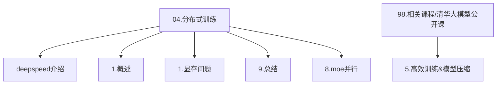
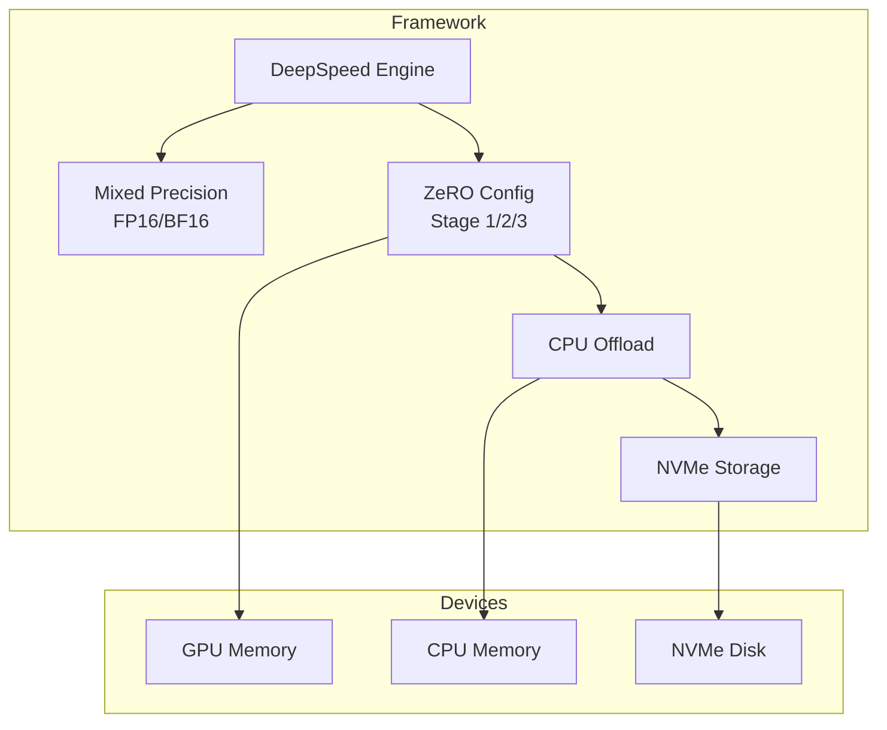
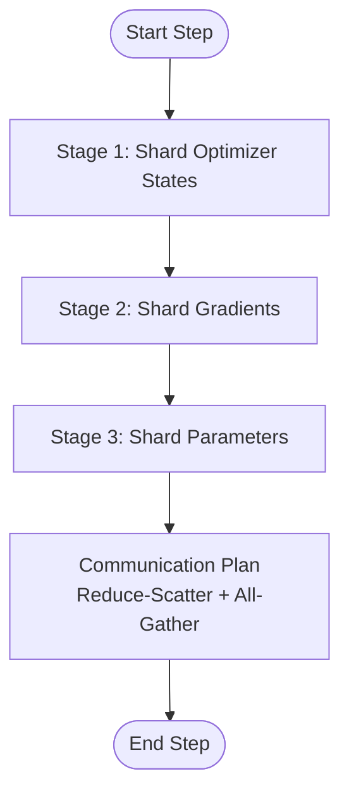
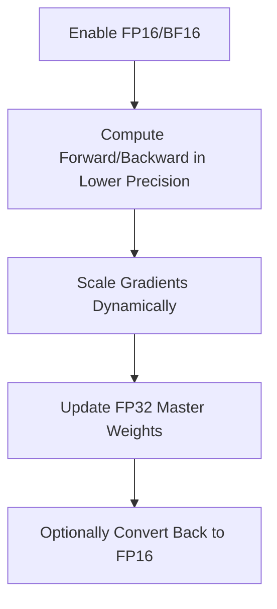
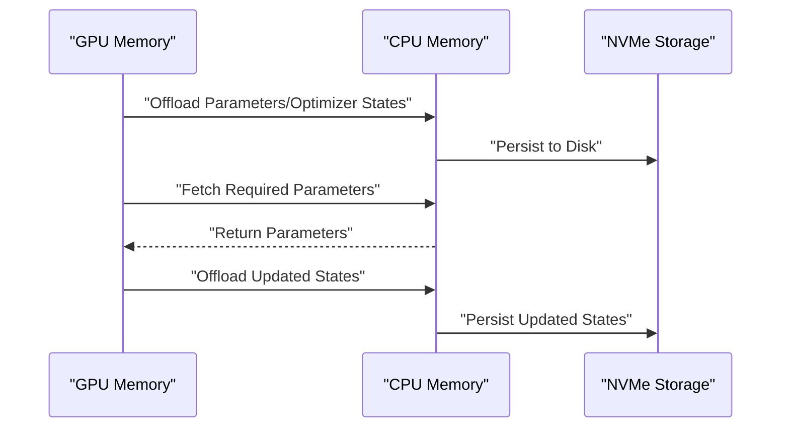
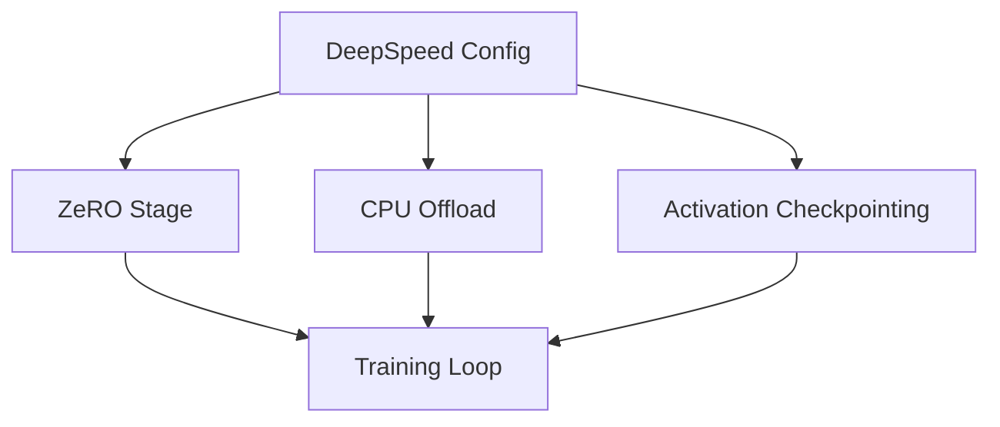
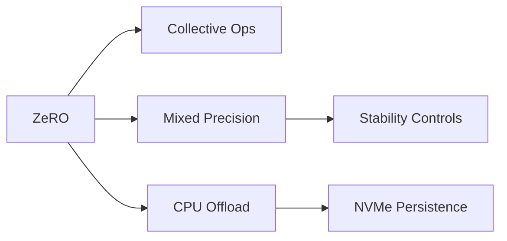

# Training Frameworks and Tools

<cite>
**Referenced Files in This Document**
- [deepspeed介绍.md](file://04.分布式训练/deepspeed介绍/deepspeed介绍.md)
- [1.概述.md](file://04.分布式训练/1.概述/1.概述.md)
- [1.显存问题.md](file://04.分布式训练/1.显存问题/1.显存问题.md)
- [9.总结.md](file://04.分布式训练/9.总结/9.总结.md)
- [8.moe并行.md](file://04.分布式训练/8.moe并行/8.moe并行.md)
- [5.高效训练&模型压缩.md](file://98.相关课程/清华大模型公开课/5.高效训练&模型压缩/5.高效训练&模型压缩.md)
</cite>

## Table of Contents
1. [Introduction](#introduction)
2. [Project Structure](#project-structure)
3. [Core Components](#core-components)
4. [Architecture Overview](#architecture-overview)
5. [Detailed Component Analysis](#detailed-component-analysis)
6. [Dependency Analysis](#dependency-analysis)
7. [Performance Considerations](#performance-considerations)
8. [Troubleshooting Guide](#troubleshooting-guide)
9. [Conclusion](#conclusion)
10. [Appendices](#appendices)

## Introduction
This document explains how modern training frameworks enable memory-efficient large-scale model training, with a focus on DeepSpeed’s ZeRO optimizer parallelization and heterogeneous memory strategies. It covers:
- Why ZeRO reduces memory redundancy across optimizer states, gradients, and parameters
- Practical configuration for ZeRO stages 1–3 and CPU offload
- Memory optimization techniques including activation checkpointing and buffer management
- Integration examples with popular training frameworks and guidance for heterogeneous systems (CPU and NVMe)
- Troubleshooting common memory issues and benchmarking guidelines

## Project Structure
The repository organizes distributed training topics around:
- DeepSpeed fundamentals and ZeRO stages
- Overview of parallelization strategies
- Memory profiling and environment diagnostics
- MOE parallelization and ZeRO-Offload combinations
- Course materials on efficient training and memory allocation

**Section sources**
- [deepspeed介绍.md:1-765](file://04.分布式训练/deepspeed介绍/deepspeed介绍.md#L1-L765)
- [1.概述.md:1-102](file://04.分布式训练/1.概述/1.概述.md#L1-L102)
- [1.显存问题.md:1-70](file://04.分布式训练/1.显存问题/1.显存问题.md#L1-L70)
- [9.总结.md:1-125](file://04.分布式训练/9.总结/9.总结.md#L1-L125)
- [8.moe并行.md:1-317](file://04.分布式训练/8.moe并行/8.moe并行.md#L1-L317)
- [5.高效训练&模型压缩.md:1-549](file://98.相关课程/清华大模型公开课/5.高效训练&模型压缩/5.高效训练&模型压缩.md#L1-L549)

## Core Components
- DeepSpeed ZeRO: A memory optimization technique that shards model states across devices to eliminate redundancy during data parallel training.
- ZeRO stages:
  - Stage 1: Shard optimizer states
  - Stage 2: Shard optimizer states and gradients
  - Stage 3: Shard optimizer states, gradients, and parameters
- Mixed precision training: FP16/BF16 to reduce memory footprint while maintaining stability via dynamic loss scaling and FP32 master weights.
- CPU offload and NVMe: Move optimizer states and parameters to CPU/NVMe to scale beyond GPU memory limits.
- Activation checkpointing and buffer management: Reduce activation memory and manage temporary buffers to fit larger models.

**Section sources**
- [deepspeed介绍.md:71-130](file://04.分布式训练/deepspeed介绍/deepspeed介绍.md#L71-L130)
- [1.概述.md:47-63](file://04.分布式训练/1.概述/1.概述.md#L47-L63)
- [9.总结.md:56-101](file://04.分布式训练/9.总结/9.总结.md#L56-L101)
- [8.moe并行.md:188-312](file://04.分布式训练/8.moe并行/8.moe并行.md#L188-L312)
- [5.高效训练&模型压缩.md:245-253](file://98.相关课程/清华大模型公开课/5.高效训练&模型压缩/5.高效训练&模型压缩.md#L245-L253)

## Architecture Overview
The training framework integrates ZeRO with mixed precision and heterogeneous memory to scale training across GPUs, CPUs, and NVMe devices.

**Diagram sources**
- [deepspeed介绍.md:296-344](file://04.分布式训练/deepspeed介绍/deepspeed介绍.md#L296-L344)
- [8.moe并行.md:296-306](file://04.分布式训练/8.moe并行/8.moe并行.md#L296-L306)
- [5.高效训练&模型压缩.md:245-253](file://98.相关课程/清华大模型公开课/5.高效训练&模型压缩/5.高效训练&模型压缩.md#L245-L253)

## Detailed Component Analysis

### ZeRO Stages and Communication Trade-offs
- Stage 1: Shards optimizer states to reduce per-device memory by a factor proportional to world size; communication remains comparable to standard data parallel.
- Stage 2: Adds gradient sharding; reduces memory further with minimal extra communication overhead.
- Stage 3: Adds parameter sharding; memory scales linearly with data parallel degree and complexity; enables ZeRO-Infinity with NVMe offload.

**Diagram sources**
- [deepspeed介绍.md:90-105](file://04.分布式训练/deepspeed介绍/deepspeed介绍.md#L90-L105)
- [1.概述.md:57-63](file://04.分布式训练/1.概述/1.概述.md#L57-L63)

**Section sources**
- [deepspeed介绍.md:90-105](file://04.分布式训练/deepspeed介绍/deepspeed介绍.md#L90-L105)
- [1.概述.md:57-63](file://04.分布式训练/1.概述/1.概述.md#L57-L63)

### Mixed Precision and Stability Controls
- Use FP16/BF16 to halve activation and parameter memory footprints.
- Maintain FP32 master weights for numerical stability during updates.
- Dynamic loss scaling and scheduler configurations help stabilize training.

**Diagram sources**
- [deepspeed介绍.md:106-127](file://04.分布式训练/deepspeed介绍/deepspeed介绍.md#L106-L127)
- [9.总结.md:110-125](file://04.分布式训练/9.总结/9.总结.md#L110-L125)

**Section sources**
- [deepspeed介绍.md:106-127](file://04.分布式训练/deepspeed介绍/deepspeed介绍.md#L106-L127)
- [9.总结.md:110-125](file://04.分布式训练/9.总结/9.总结.md#L110-L125)

### CPU Offload and NVMe Utilization
- Offload optimizer states and parameters to CPU to free GPU memory.
- For extremely large models, combine ZeRO-3 with NVMe offload to persist inactive parameters and optimizer states.
- Enable overlap of communication and computation to mitigate CPU offload latency.

**Diagram sources**
- [deepspeed介绍.md:325-344](file://04.分布式训练/deepspeed介绍/deepspeed介绍.md#L325-L344)
- [8.moe并行.md:296-306](file://04.分布式训练/8.moe并行/8.moe并行.md#L296-L306)
- [5.高效训练&模型压缩.md:245-253](file://98.相关课程/清华大模型公开课/5.高效训练&模型压缩/5.高效训练&模型压缩.md#L245-L253)

**Section sources**
- [deepspeed介绍.md:325-344](file://04.分布式训练/deepspeed介绍/deepspeed介绍.md#L325-L344)
- [8.moe并行.md:296-306](file://04.分布式训练/8.moe并行/8.moe并行.md#L296-L306)
- [5.高效训练&模型压缩.md:245-253](file://98.相关课程/清华大模型公开课/5.高效训练&模型压缩/5.高效训练&模型压缩.md#L245-L253)

### Practical Implementation Patterns
- Configure ZeRO stage and offload device in the DeepSpeed config.
- Use activation checkpointing to reduce activation memory.
- Combine ZeRO-Offload with MOE for sparse expert training scenarios.

**Diagram sources**
- [deepspeed介绍.md:295-410](file://04.分布式训练/deepspeed介绍/deepspeed介绍.md#L295-L410)
- [8.moe并行.md:241-312](file://04.分布式训练/8.moe并行/8.moe并行.md#L241-L312)

**Section sources**
- [deepspeed介绍.md:295-410](file://04.分布式训练/deepspeed介绍/deepspeed介绍.md#L295-L410)
- [8.moe并行.md:241-312](file://04.分布式训练/8.moe并行/8.moe并行.md#L241-L312)

## Dependency Analysis
- ZeRO depends on collective communication primitives (Reduce-Scatter, All-Gather) to shard and gather states efficiently.
- Mixed precision relies on FP16/BF16 kernels and FP32 master weights for stability.
- CPU offload introduces host-device transfers; overlap_comm and contiguous_gradients reduce overhead.
- NVMe offload requires careful prefetch and persistence thresholds to balance throughput and latency.

**Diagram sources**
- [deepspeed介绍.md:325-344](file://04.分布式训练/deepspeed介绍/deepspeed介绍.md#L325-L344)
- [deepspeed介绍.md:295-410](file://04.分布式训练/deepspeed介绍/deepspeed介绍.md#L295-L410)

**Section sources**
- [deepspeed介绍.md:325-344](file://04.分布式训练/deepspeed介绍/deepspeed介绍.md#L325-L344)
- [deepspeed介绍.md:295-410](file://04.分布式训练/deepspeed介绍/deepspeed介绍.md#L295-L410)

## Performance Considerations
- Choose ZeRO stage based on memory budget and communication bandwidth:
  - Stage 1 for optimizer state reduction
  - Stage 2 for additional gradient sharding
  - Stage 3 for parameter sharding and ZeRO-Infinity with NVMe
- Prefer BF16 on platforms that support it for improved stability compared to FP16.
- Use activation checkpointing to trade compute for memory savings.
- Tune overlap_comm, contiguous_gradients, and bucket sizes to minimize communication stalls.
- Monitor GPU utilization via flops profiling and throughput estimation.

**Section sources**
- [deepspeed介绍.md:90-105](file://04.分布式训练/deepspeed介绍/deepspeed介绍.md#L90-L105)
- [9.总结.md:110-125](file://04.分布式训练/9.总结/9.总结.md#L110-L125)
- [1.显存问题.md:13-57](file://04.分布式训练/1.显存问题/1.显存问题.md#L13-L57)

## Troubleshooting Guide
Common memory issues and remedies:
- Out-of-memory (OOM) on GPU:
  - Reduce batch size or enable activation checkpointing
  - Switch to ZeRO-2/3 and enable CPU offload
  - Use BF16 where supported to improve stability
- Excessive fragmentation:
  - Increase contiguous_gradients and tune bucket sizes
  - Avoid frequent parameter reshaping that fragments memory
- Slow convergence or instability:
  - Adjust dynamic loss scaling and gradient clipping
  - Verify mixed precision settings and FP32 master weights
- NVMe bottlenecks:
  - Increase prefetch and persistence thresholds
  - Ensure sufficient disk bandwidth and low latency

Diagnostic commands and tools:
- Use ds_report to validate DeepSpeed environment configuration
- Use flops profiler to estimate GPU utilization
- Monitor network bandwidth with external tools for multi-node training

**Section sources**
- [1.显存问题.md:13-63](file://04.分布式训练/1.显存问题/1.显存问题.md#L13-L63)
- [deepspeed介绍.md:45-63](file://04.分布式训练/deepspeed介绍/deepspeed介绍.md#L45-L63)

## Conclusion
DeepSpeed’s ZeRO optimizer parallelization, combined with mixed precision and heterogeneous memory strategies, enables scalable training of billion- and trillion-parameter models. By selecting appropriate ZeRO stages, enabling CPU offload and NVMe persistence, and applying activation checkpointing, practitioners can achieve significant memory reductions while maintaining performance. Proper configuration and monitoring are essential to avoid OOM, fragmentation, and convergence issues.

## Appendices

### Practical Configuration Options
- ZeRO stage selection and offload device
- Mixed precision toggles (FP16/BF16)
- Activation checkpointing settings
- Communication overlap and buffer sizing

**Section sources**
- [deepspeed介绍.md:295-410](file://04.分布式训练/deepspeed介绍/deepspeed介绍.md#L295-L410)
- [8.moe并行.md:241-312](file://04.分布式训练/8.moe并行/8.moe并行.md#L241-L312)