# Training Methodologies

<cite>
**Referenced Files in This Document**
- [4.张量并行.md](file://04.分布式训练/4.张顿并行/4.张量并行.md)
- [6.多维度混合并行.md](file://04.分布式训练/6.多维度混合并行/6.多维度混合并行.md)
- [8.moe并行.md](file://04.分布式训练/8.moe并行/8.moe并行.md)
- [9.总结.md](file://04.分布式训练/9.总结/9.总结.md)
- [1.概述.md](file://04.分布式训练/1.概述/1.概述.md)
- [2.数据并行.md](file://04.分布式训练/2.数据并行/2.数据并行.md)
- [3.流水线并行.md](file://04.分布式训练/3.流水线并行/3.流水线并行.md)
- [5.序列并行.md](file://04.分布式训练/5.序列并行/5.序列并行.md)
- [7.自动并行.md](file://04.分布式训练/7.自动并行/7.自动并全.md)
- [deepspeed介绍.md](file://04.分布式训练/deepspeed介绍/deepspeed介绍.md)
- [Megatron-LM架构.md](file://02.大语言模型架构/Megatron-LM架构.md)
- [Transformer架构细节.md](file://02.大语言模型架构/Transformer架构细节/Transformer架构细节.md)
- [MHA_MQA_GQA.md](file://02.大语言模型架构/MHA_MQA_GQA/MHA_MQA_GQA.md)
- [llama 2代码详解.md](file://02.大语言模型架构/llama 2代码详解/llama 2代码详解.md)
- [llama系列模型.md](file://02.大语言模型架构/llama系列模型/llama系列模型.md)
- [1.显存问题.md](file://04.分布式训练/1.显存问题/1.显存问题.md)
- [1.语言模型.md](file://01.大语言模型基础/1.语言模型/1.语言模型.md)
- [2.激活函数.md](file://01.大语言模型基础/1.激活函数/2.激活函数.md)
- [3.位置编码.md](file://02.大语言模型架构/3.位置编码/3.位置编码.md)
- [2.layer_normalization.md](file://02.大语言模型架构/2.layer_normalization/2.layer_normalization.md)
- [1.MoE论文.md](file://02.大语言模型架构/1.MoE论文/1.MoE论文.md)
- [2.MoE经典论文简牍.md](file://02.大语言模型架构/2.MoE经典论文简牍/2.MoE经典论文简牍.md)
- [3.位置编码.md](file://02.大语言模型架构/3.位置编码/3.位置编码.md)
</cite>

## Table of Contents
1. [Introduction](#introduction)
2. [Project Structure](#project-structure)
3. [Core Components](#core-components)
4. [Architecture Overview](#architecture-overview)
5. [Detailed Component Analysis](#detailed-component-analysis)
6. [Dependency Analysis](#dependency-analysis)
7. [Performance Considerations](#performance-considerations)
8. [Troubleshooting Guide](#troubleshooting-guide)
9. [Conclusion](#conclusion)
10. [Appendices](#appendices)

## Introduction
This document consolidates distributed training methodologies for large language models (LLMs), focusing on data parallelism, pipeline parallelism, tensor and sequence parallelism, and mixed precision training. It also covers multi-dimensional hybrid parallelism, automatic parallelization, and mixture-of-experts (MoE) parallelization. Practical guidance includes training frameworks such as DeepSpeed and Megatron-LM architecture, performance benchmarking considerations, troubleshooting, and best practices across diverse hardware configurations. The content synthesizes repository materials to present a structured, accessible guide for both technical and non-technical readers.

## Project Structure
The repository organizes distributed training topics under a dedicated section, complemented by foundational LLM concepts and architecture details. The distributed training section includes standalone Markdown files covering:
- Data parallelism
- Pipeline parallelism
- Tensor parallelism (including 1D, 2D, 2.5D, and 3D variants)
- Sequence parallelism
- Multi-dimensional hybrid parallelism (data, tensor, pipeline combinations)
- Automatic parallelization
- MoE parallelization
- DeepSpeed introduction
- Summary and comparative strategies
- Memory optimization notes

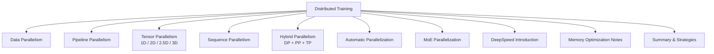

**Section sources**
- [1.概述.md](file://04.分布式训练/1.概述/1.概述.md)
- [2.数据并行.md](file://04.分布式训练/2.数据并行/2.数据并行.md)
- [3.流水线并行.md](file://04.分布式训练/3.流水线并行/3.流水线并行.md)
- [4.张量并行.md](file://04.分布式训练/4.张顿并行/4.张量并行.md)
- [5.序列并行.md](file://04.分布式训练/5.序列并行/5.序列并行.md)
- [6.多维度混合并行.md](file://04.分布式训练/6.多维度混合并行/6.多维度混合并行.md)
- [7.自动并行.md](file://04.分布式训练/7.自动并行/7.自动并行.md)
- [8.moe并行.md](file://04.分布式训练/8.moe并行/8.moe并行.md)
- [deepspeed介绍.md](file://04.分布式训练/deepspeed介绍/deepspeed介绍.md)
- [1.显存问题.md](file://04.分布式训练/1.显存问题/1.显存问题.md)
- [9.总结.md](file://04.分布式训练/9.总结/9.总结.md)

## Core Components
This section outlines the core distributed training components and their roles in enabling scalable LLM training.

- Data Parallelism (DP): Splits batches across devices to compute gradients independently; synchronizes via all-reduce or ZeRO stages.
- Pipeline Parallelism (PP): Partitions model layers across devices; micro-batches traverse stages to overlap computation and communication.
- Tensor Parallelism (TP): Shards tensors (weights/activations) across devices; supports 1D, 2D, 2.5D, and 3D layouts.
- Sequence Parallelism (SP): Partitions sequences along the sequence dimension to reduce activation memory.
- Hybrid Parallelism: Combinations such as DP + PP, DP + TP, PP + TP, and 3D (DP + PP + TP).
- Automatic Parallelization: Framework-level abstractions to compose DP, TP, and PP seamlessly.
- MoE Parallelization: Expert sharding and routing strategies for sparse expert computation.
- Mixed Precision Training: FP16/BF16 training with dynamic loss scaling to improve throughput and reduce memory.
- Training Frameworks: DeepSpeed and Megatron-LM architecture for large-scale training.

**Section sources**
- [2.数据并行.md](file://04.分布式训练/2.数据并行/2.数据并行.md)
- [3.流水线并行.md](file://04.分布式训练/3.流水线并行/3.流水线并行.md)
- [4.张量并行.md](file://04.分布式训练/4.张顿并行/4.张量并行.md)
- [5.序列并行.md](file://04.分布式训练/5.序列并行/5.序列并行.md)
- [6.多维度混合并行.md](file://04.分布式训练/6.多维度混合并行/6.多维度混合并行.md)
- [7.自动并行.md](file://04.分布式训练/7.自动并行/7.自动并行.md)
- [8.moe并行.md](file://04.分布式训练/8.moe并行/8.moe并行.md)
- [deepspeed介绍.md](file://04.分布式训练/deepspeed介绍/deepspeed介绍.md)
- [Megatron-LM架构.md](file://02.大语言模型架构/Megatron-LM架构.md)

## Architecture Overview
The distributed training architecture integrates multiple parallel strategies to scale LLM training across devices and nodes. The following diagram maps the major components and their interactions.

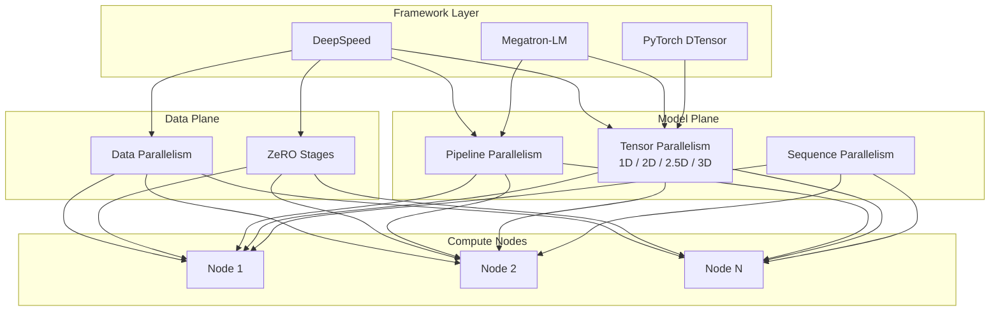

**Diagram sources**
- [6.多维度混合并行.md](file://04.分布式训练/6.多维度混合并行/6.多维度混合并行.md)
- [4.张量并行.md](file://04.分布式训练/4.张顿并行/4.张量并行.md)
- [deepspeed介绍.md](file://04.分布式训练/deepspeed介绍/deepspeed介绍.md)
- [Megatron-LM架构.md](file://02.大语言模型架构/Megatron-LM架构.md)

## Detailed Component Analysis

### Data Parallelism
Data parallelism partitions the training dataset across devices, with each device computing gradients on its shard and synchronizing via all-reduce or ZeRO stages. ZeRO reduces memory footprint by sharding optimizer states and gradients.

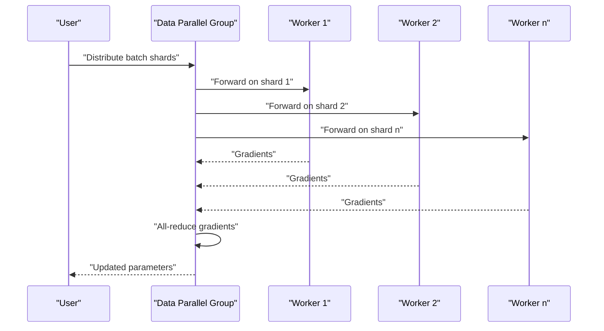

**Section sources**
- [2.数据并行.md](file://04.分布式训练/2.数据并行/2.数据并行.md)
- [6.多维度混合并行.md](file://04.分布式训练/6.多维度混合并行/6.多维度混合并行.md)

### Pipeline Parallelism
Pipeline parallelism partitions the model into stages across devices. Micro-batches advance through stages to minimize idle time. Backward pass traverses stages in reverse order.

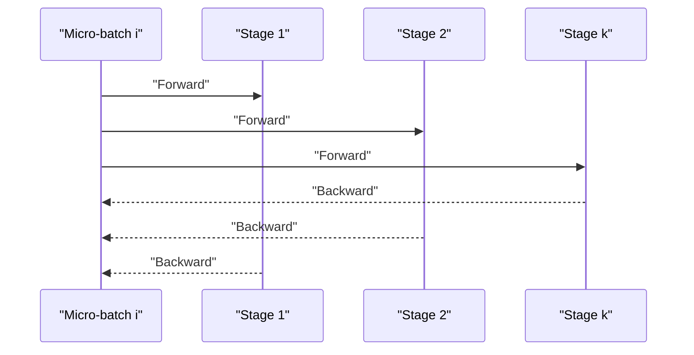

**Section sources**
- [3.流水线并行.md](file://04.分布式训练/3.流水线并行/3.流水线并行.md)
- [6.多维度混合并行.md](file://04.分布式训练/6.多维度混合并行/6.多维度混合并行.md)

### Tensor Parallelism (1D, 2D, 2.5D, 3D)
Tensor parallelism shards weights and activations to fit larger models on limited memory. 1D TP slices matrices along a single dimension; higher-dimensional variants further shard activations and reduce communication.

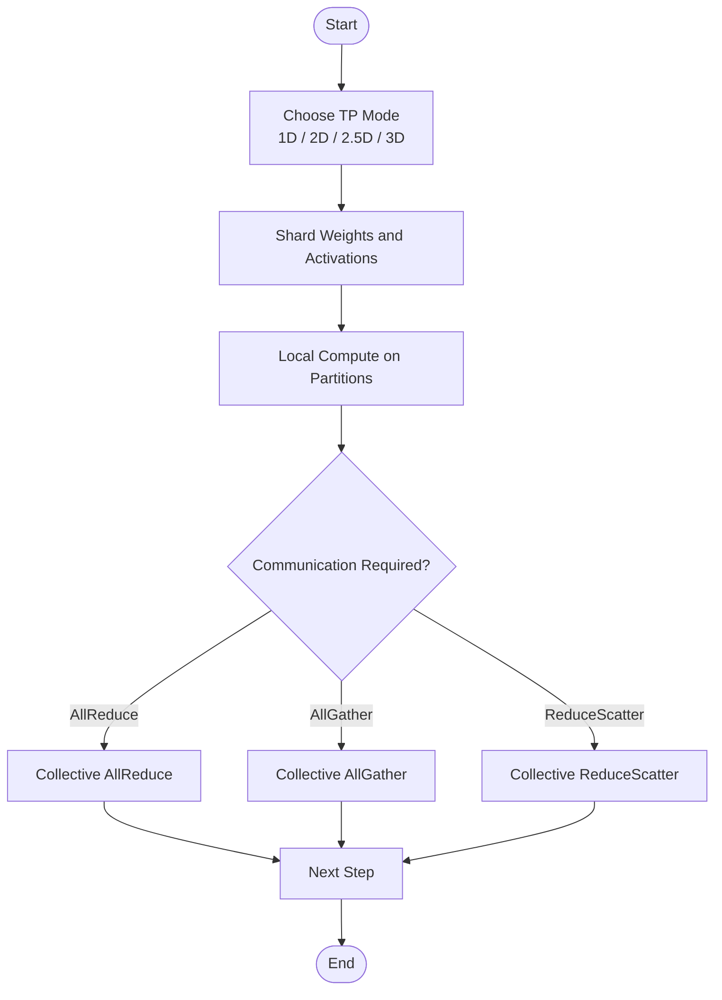

**Section sources**
- [4.张量并行.md](file://04.分布式训练/4.张顿并行/4.张量并行.md)

### Sequence Parallelism
Sequence parallelism splits the sequence dimension to reduce activation memory during attention and feed-forward layers. It requires careful handling of attention masks and positional encodings.

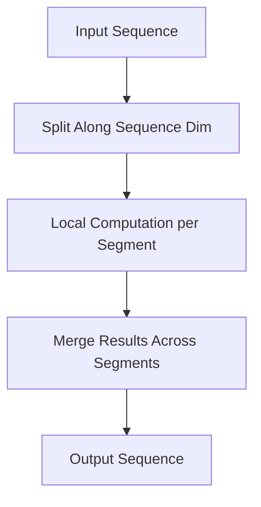

**Section sources**
- [5.序列并行.md](file://04.分布式训练/5.序列并行/5.序列并行.md)

### Multi-Dimensional Hybrid Parallelism
Hybrid strategies combine DP, PP, and TP to maximize throughput and memory efficiency. Examples include DP + PP, DP + TP, PP + TP, and 3D (DP + PP + TP). ZeRO stages can be integrated to reduce optimizer memory.

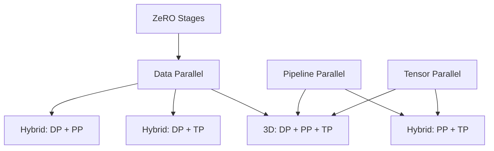

**Section sources**
- [6.多维度混合并行.md](file://04.分布式训练/6.多维度混合并行/6.多维度混合并行.md)

### Automatic Parallelization
Automatic parallelization frameworks enable seamless composition of DP, PP, and TP. PyTorch’s DTensor provides device mesh and parallel strategies for module sharding.

```mermaid
sequenceDiagram
participant User as "User Code"
participant Mesh as "DeviceMesh"
participant Par as "Parallel Strategy"
participant Mod as "Module"
User->>Mesh : "Create device mesh"
User->>Par : "Select parallel strategy"
Par->>Mod : "Apply sharding"
User->>Mod : "Run forward/backward"
Mod-->>User : "Results"
```

**Section sources**
- [7.自动并行.md](file://04.分布式训练/7.自动并行/7.自动并行.md)
- [4.张量并行.md](file://04.分布式训练/4.张顿并行/4.张量并行.md)

### MoE Parallelization
MoE parallelization focuses on expert sharding and routing. Experts are distributed across devices; routers select a subset of experts per token to compute sparse activations.

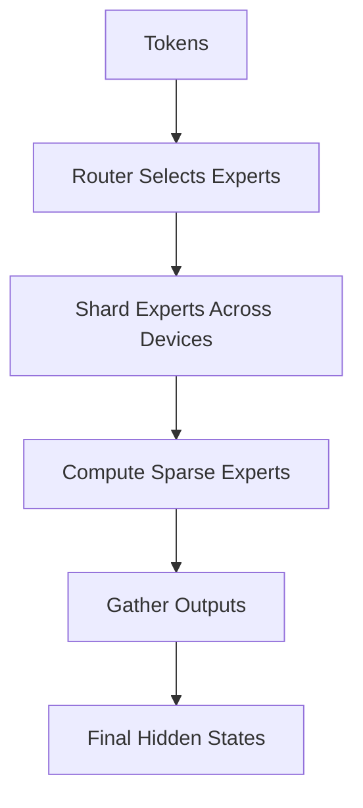

**Section sources**
- [8.moe并行.md](file://04.分布式训练/8.moe并行/8.moe并行.md)
- [1.MoE论文.md](file://02.大语言模型架构/1.MoE论文/1.MoE论文.md)
- [2.MoE经典论文简牍.md](file://02.大语言模型架构/2.MoE经典论文简牍/2.MoE经典论文简牍.md)

### Mixed Precision Training
Mixed precision training uses FP16 or BF16 to increase throughput and reduce memory. Dynamic loss scaling prevents gradient underflow.

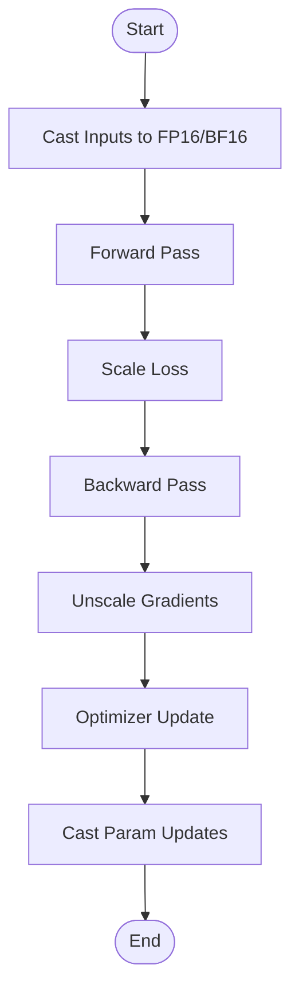

**Section sources**
- [deepspeed介绍.md](file://04.分布式训练/deepspeed介绍/deepspeed介绍.md)

### Training Frameworks: DeepSpeed and Megatron-LM
DeepSpeed provides ZeRO, pipeline flushing, and optimizer sharding. Megatron-LM offers 1D tensor parallelism and integrates with PP and DP.

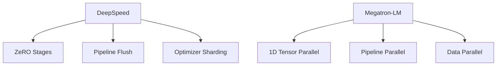

**Section sources**
- [deepspeed介绍.md](file://04.分布式训练/deepspeed介绍/deepspeed介绍.md)
- [Megatron-LM架构.md](file://02.大语言模型架构/Megatron-LM架构.md)

## Dependency Analysis
The following diagram illustrates dependencies among distributed training components and frameworks.

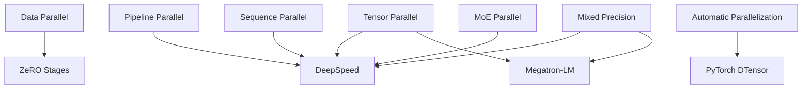

**Diagram sources**
- [6.多维度混合并行.md](file://04.分布式训练/6.多维度混合并行/6.多维度混合并行.md)
- [4.张量并行.md](file://04.分布式训练/4.张顿并行/4.张量并行.md)
- [deepspeed介绍.md](file://04.分布式训练/deepspeed介绍/deepspeed介绍.md)
- [Megatron-LM架构.md](file://02.大语言模型架构/Megatron-LM架构.md)

**Section sources**
- [6.多维度混合并行.md](file://04.分布式训练/6.多维度混合并行/6.多维度混合并行.md)
- [4.张量并行.md](file://04.分布式训练/4.张顿并行/4.张量并行.md)
- [deepspeed介绍.md](file://04.分布式训练/deepspeed介绍/deepspeed介绍.md)
- [Megatron-LM架构.md](file://02.大语言模型架构/Megatron-LM架构.md)

## Performance Considerations
- Communication vs. computation balance: Prefer intra-node communication for TP and PP to minimize cross-node latency.
- Micro-batch sizing: Optimize micro-batch count to reduce pipeline bubbles while maintaining arithmetic intensity.
- Memory layout: Use 2D/2.5D/3D tensor parallelism to shard activations and reduce peak memory.
- Mixed precision: Employ FP16/BF16 with dynamic loss scaling for throughput gains.
- Hardware-aware scheduling: Align parallel dimensions with interconnect topology (NVLink, InfiniBand).
- Gradient compression: Consider compression techniques to reduce bandwidth pressure in DP+PP scenarios.

[No sources needed since this section provides general guidance]

## Troubleshooting Guide
Common issues and remedies:
- Gradient overflow/underflow: Adjust loss scaling factors and dtype selection; validate activation magnitudes.
- Pipeline bubbles: Increase micro-batch count; tune pipeline flush strategies; ensure balanced stage workloads.
- Communication deadlocks: Verify collective synchronization points; confirm device mesh connectivity.
- Memory fragmentation: Reuse buffers; avoid excessive allocations; leverage framework memory pools.
- Expert imbalance in MoE: Adjust router top-k and capacity ratios; monitor expert utilization.

**Section sources**
- [1.显存问题.md](file://04.分布式训练/1.显存问题/1.显存问题.md)
- [deepspeed介绍.md](file://04.分布式训练/deepspeed介绍/deepspeed介绍.md)

## Conclusion
Effective LLM training requires a tailored combination of data, pipeline, tensor, and sequence parallelism, often integrated with automatic parallelization and mixed precision. Frameworks like DeepSpeed and Megatron-LM provide robust primitives to realize these strategies at scale. Hybrid parallelism (DP + PP + TP) remains the dominant approach for billion-parameter models, with ZeRO stages further reducing memory footprints. Performance depends on careful balancing of communication and computation, hardware-aware design, and rigorous benchmarking across configurations.

[No sources needed since this section summarizes without analyzing specific files]

## Appendices

### Practical Implementation Guidance
- Configure device meshes and parallel modes using framework APIs.
- Partition models explicitly for TP and SP; align partitions with attention heads and MLP dimensions.
- Use pipeline flushing and micro-batch scheduling to mitigate bubbles.
- Enable ZeRO stages for optimizer state sharding; choose appropriate stage based on memory constraints.
- Benchmark throughput and memory usage across hardware configurations; iterate on parallel dimensions.

**Section sources**
- [4.张量并行.md](file://04.分布式训练/4.张顿并行/4.张量并行.md)
- [6.多维度混合并行.md](file://04.分布式训练/6.多维度混合并行/6.多维度混合并行.md)
- [deepspeed介绍.md](file://04.分布式训练/deepspeed介绍/deepspeed介绍.md)

### Best Practices by Hardware Configuration
- NVLink-dense nodes: Favor 1D/2D TP with intra-node PP to maximize bandwidth utilization.
- Multi-rack setups: Use ZeRO-2/3 with PP to reduce optimizer memory; schedule DP across racks.
- Heterogeneous GPUs: Balance TP sizes to match compute capabilities; prefer BF16 for broader support.

**Section sources**
- [6.多维度混合并行.md](file://04.分布式训练/6.多维度混合并行/6.多维度混合并行.md)

### Comparative Hybrid Strategies
- Bloom-176B: DP × 8, TP × 4, PP × 12, ZeRO-1, BF16.
- GLM-130B: DP × 24, TP × 4, PP × 8, ZeRO-1, FP16.
- OPT-175B: DP × 124, TP × 8, ZeRO-3 (FSDP), FP16.
- Megatron-Turing NLG-530B: DP × 16, TP × 8, PP × 35, BF16.
- GPT-NeoX-20B: DP × 12, TP × 2, PP × 4, ZeRO-1, FP16.

**Section sources**
- [6.多维度混合并行.md](file://04.分布式训练/6.多维度混合并行/6.多维度混合并行.md)