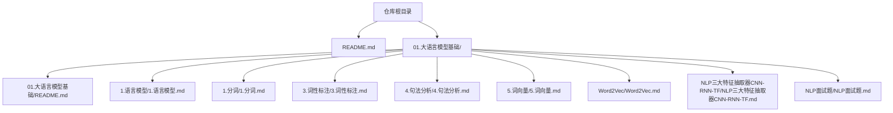
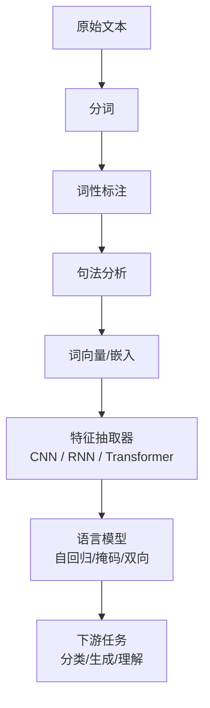
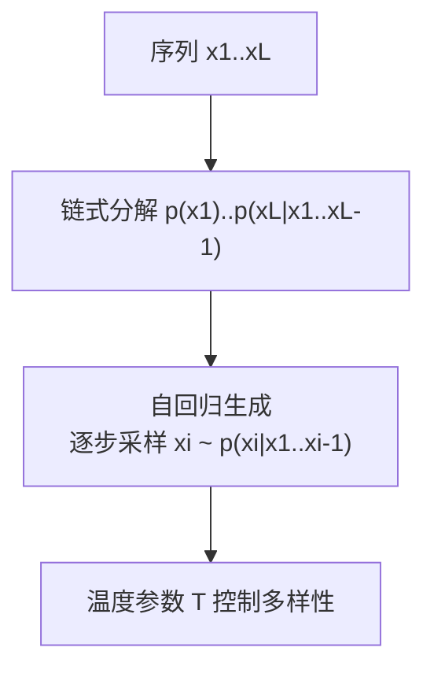
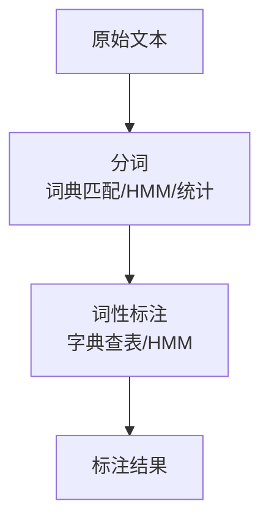
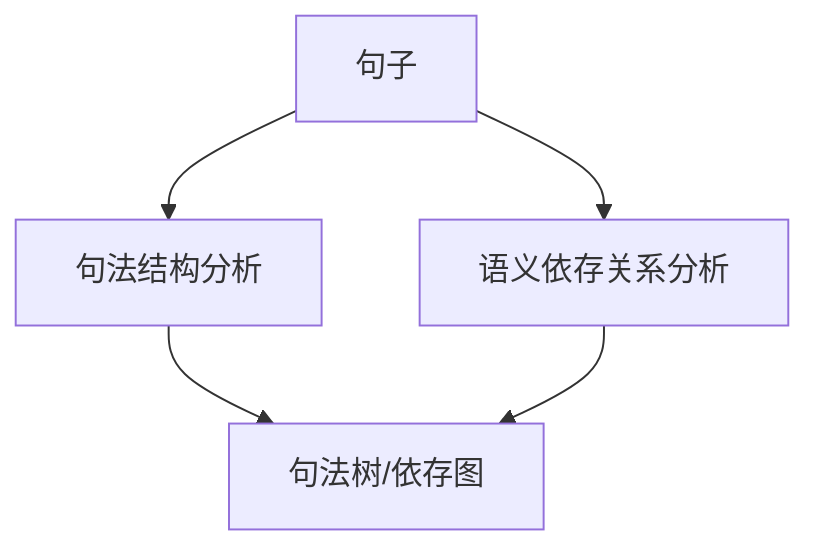
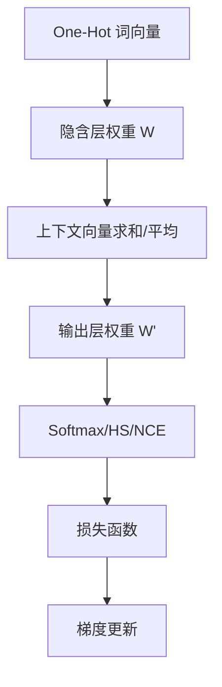
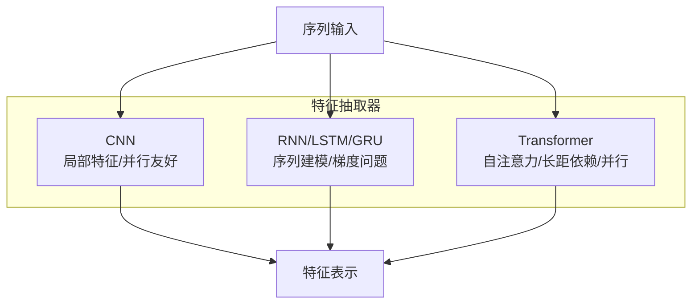

# NLP基础理论

<cite>
**本文引用的文件**
- [README.md](file://README.md)
- [01.大语言模型基础/README.md](file://01.大语言模型基础/README.md)
- [01.大语言模型基础/NLP面试题/NLP面试题.md](file://01.大语言模型基础/NLP面试题/NLP面试题.md)
- [01.大语言模型基础/1.语言模型/1.语言模型.md](file://01.大语言模型基础/1.语言模型/1.语言模型.md)
- [01.大语言模型基础/1.llm概念/1.llm概念.md](file://01.大语言模型基础/1.llm概念/1.llm概念.md)
- [01.大语言模型基础/1.分词/1.分词.md](file://01.大语言模型基础/1.分词/1.分词.md)
- [01.大语言模型基础/3.词性标注/3.词性标注.md](file://01.大语言模型基础/3.词性标注/3.词性标注.md)
- [01.大语言模型基础/4.句法分析/4.句法分析.md](file://01.大语言模型基础/4.句法分析/4.句法分析.md)
- [01.大语言模型基础/5.词向量/5.词向量.md](file://01.大语言模型基础/5.词向量/5.词向量.md)
- [01.大语言模型基础/Word2Vec/Word2Vec.md](file://01.大语言模型基础/Word2Vec/Word2Vec.md)
- [01.大语言模型基础/NLP三大特征抽取器（CNN-RNN-TF）/NLP三大特征抽取器（CNN-RNN-TF）.md](file://01.大语言模型基础/NLP三大特征抽取器（CNN-RNN-TF）/NLP三大特征抽取器（CNN-RNN-TF）.md)
</cite>

## 目录
1. [引言](#引言)
2. [项目结构](#项目结构)
3. [核心组件](#核心组件)
4. [架构概览](#架构概览)
5. [详细组件分析](#详细组件分析)
6. [依赖分析](#依赖分析)
7. [性能考量](#性能考量)
8. [故障排查指南](#故障排查指南)
9. [结论](#结论)
10. [附录](#附录)

## 引言
本文件面向NLP基础理论，系统梳理词嵌入（Word2Vec）、三大特征抽取器（CNN、RNN、Transformer）以及常见面试问题与要点，帮助读者建立扎实的理论基础与应试准备。内容依据仓库中“大语言模型基础”主题下的资料整合而成，涵盖语言模型、分词、词性标注、句法分析、词向量、Word2Vec、三大特征抽取器与面试题等模块。

## 项目结构
本仓库围绕“大语言模型基础”组织内容，包含语言模型、分词、词性标注、句法分析、词向量、Word2Vec、三大特征抽取器与面试题等主题。下图展示与本文件相关的顶层目录与文件关系。

**图表来源**
- [README.md:37-169](file://README.md#L37-L169)
- [01.大语言模型基础/README.md:1-36](file://01.大语言模型基础/README.md#L1-L36)

**章节来源**
- [README.md:37-169](file://README.md#L37-L169)
- [01.大语言模型基础/README.md:1-36](file://01.大语言模型基础/README.md#L1-L36)

## 核心组件
本节聚焦NLP基础理论中的关键主题与组件，包括：
- 语言模型与自回归建模
- 分词与词性标注
- 句法分析
- 词向量与Word2Vec（Skip-gram与CBOW）
- 三大特征抽取器（CNN、RNN、Transformer）

这些组件在NLP任务中层层递进：分词与标注为上游预处理，词向量提供稠密语义表示，特征抽取器承载语义与结构建模，语言模型贯穿生成与理解。

**章节来源**
- [01.大语言模型基础/1.语言模型/1.语言模型.md:1-215](file://01.大语言模型基础/1.语言模型/1.语言模型.md#L1-L215)
- [01.大语言模型基础/1.分词/1.分词.md:1-85](file://01.大语言模型基础/1.分词/1.分词.md#L1-L85)
- [01.大语言模型基础/3.词性标注/3.词性标注.md:1-285](file://01.大语言模型基础/3.词性标注/3.词性标注.md#L1-L285)
- [01.大语言模型基础/4.句法分析/4.句法分析.md:1-52](file://01.大语言模型基础/4.句法分析/4.句法分析.md#L1-L52)
- [01.大语言模型基础/5.词向量/5.词向量.md:1-307](file://01.大语言模型基础/5.词向量/5.词向量.md#L1-L307)
- [01.大语言模型基础/Word2Vec/Word2Vec.md:1-106](file://01.大语言模型基础/Word2Vec/Word2Vec.md#L1-L106)
- [01.大语言模型基础/NLP三大特征抽取器（CNN-RNN-TF）/NLP三大特征抽取器（CNN-RNN-TF）.md:1-54](file://01.大语言模型基础/NLP三大特征抽取器（CNN-RNN-TF）/NLP三大特征抽取器（CNN-RNN-TF）.md#L1-L54)

## 架构概览
下图从“数据预处理—语义表示—特征抽取—语言建模”的视角，展示NLP基础理论的端到端流程。

**图表来源**
- [01.大语言模型基础/1.分词/1.分词.md:1-85](file://01.大语言模型基础/1.分词/1.分词.md#L1-L85)
- [01.大语言模型基础/3.词性标注/3.词性标注.md:1-285](file://01.大语言模型基础/3.词性标注/3.词性标注.md#L1-L285)
- [01.大语言模型基础/4.句法分析/4.句法分析.md:1-52](file://01.大语言模型基础/4.句法分析/4.句法分析.md#L1-L52)
- [01.大语言模型基础/5.词向量/5.词向量.md:1-307](file://01.大语言模型基础/5.词向量/5.词向量.md#L1-L307)
- [01.大语言模型基础/1.语言模型/1.语言模型.md:1-215](file://01.大语言模型基础/1.语言模型/1.语言模型.md#L1-L215)
- [01.大语言模型基础/NLP三大特征抽取器（CNN-RNN-TF）/NLP三大特征抽取器（CNN-RNN-TF）.md:1-54](file://01.大语言模型基础/NLP三大特征抽取器（CNN-RNN-TF）/NLP三大特征抽取器（CNN-RNN-TF）.md#L1-L54)

## 详细组件分析

### 语言模型与自回归建模
- 定义与链式法则：语言模型为令牌序列的概率分布，可按链式法则分解为条件概率连乘。
- 自回归建模：通过前缀条件逐步生成下一个令牌，温度参数控制采样多样性。
- 历史演进：从n-gram到神经语言模型，再到RNN/LSTM与Transformer，训练目标逐步从统计估计转向自监督语言建模。

**图表来源**
- [01.大语言模型基础/1.语言模型/1.语言模型.md:37-96](file://01.大语言模型基础/1.语言模型/1.语言模型.md#L37-L96)

**章节来源**
- [01.大语言模型基础/1.语言模型/1.语言模型.md:1-215](file://01.大语言模型基础/1.语言模型/1.语言模型.md#L1-L215)

### 分词与词性标注
- 分词难点：中文天然缺分隔符，歧义切分与未登录词是主要挑战。
- 词性标注难点：一词多词性、标注标准不统一、未登录词处理。
- 算法路线：基于词典的字符串匹配与基于统计的HMM/CRF/深度学习相结合。

**图表来源**
- [01.大语言模型基础/1.分词/1.分词.md:43-85](file://01.大语言模型基础/1.分词/1.分词.md#L43-L85)
- [01.大语言模型基础/3.词性标注/3.词性标注.md:18-31](file://01.大语言模型基础/3.词性标注/3.词性标注.md#L18-L31)

**章节来源**
- [01.大语言模型基础/1.分词/1.分词.md:1-85](file://01.大语言模型基础/1.分词/1.分词.md#L1-L85)
- [01.大语言模型基础/3.词性标注/3.词性标注.md:1-285](file://01.大语言模型基础/3.词性标注/3.词性标注.md#L1-L285)

### 句法分析
- 两类分析：句法结构分析（主谓宾等）与语义依存关系分析（施受关系等）。
- 当前挑战：准确率受限，深度学习与句法树结合的收益受标注噪声影响。

**图表来源**
- [01.大语言模型基础/4.句法分析/4.句法分析.md:9-28](file://01.大语言模型基础/4.句法分析/4.句法分析.md#L9-L28)

**章节来源**
- [01.大语言模型基础/4.句法分析/4.句法分析.md:1-52](file://01.大语言模型基础/4.句法分析/4.句法分析.md#L1-L52)

### 词向量与Word2Vec
- 词向量的意义：将离散符号映射为稠密向量，体现语义相似性。
- Word2Vec两种架构：
  - CBOW：以上下文预测中心词，适合小语料平滑。
  - Skip-gram：以中心词预测上下文，适合大规模语料。
- 学习机制：神经网络单隐层结构，输入输出均为One-Hot；通过Hierarchical Softmax与负采样降低计算复杂度。
- 应用场景：文本分类、情感分析、检索增强等任务的预处理与特征表示。

**图表来源**
- [01.大语言模型基础/Word2Vec/Word2Vec.md:32-81](file://01.大语言模型基础/Word2Vec/Word2Vec.md#L32-L81)
- [01.大语言模型基础/5.词向量/5.词向量.md:70-307](file://01.大语言模型基础/5.词向量/5.词向量.md#L70-L307)

**章节来源**
- [01.大语言模型基础/5.词向量/5.词向量.md:1-307](file://01.大语言模型基础/5.词向量/5.词向量.md#L1-L307)
- [01.大语言模型基础/Word2Vec/Word2Vec.md:1-106](file://01.大语言模型基础/Word2Vec/Word2Vec.md#L1-L106)

### 三大特征抽取器（CNN、RNN、Transformer）
- CNN：捕获k-gram片段，适合局部特征与并行计算，常用于文本分类与序列建模。
- RNN：天然适配序列，LSTM/GRU缓解梯度问题；但序列依赖限制并行。
- Transformer：自注意力建模长距离依赖，易并行，成为主流特征抽取器。

**图表来源**
- [01.大语言模型基础/NLP三大特征抽取器（CNN-RNN-TF）/NLP三大特征抽取器（CNN-RNN-TF）.md:1-54](file://01.大语言模型基础/NLP三大特征抽取器（CNN-RNN-TF）/NLP三大特征抽取器（CNN-RNN-TF）.md#L1-L54)

**章节来源**
- [01.大语言模型基础/NLP三大特征抽取器（CNN-RNN-TF）/NLP三大特征抽取器（CNN-RNN-TF）.md:1-54](file://01.大语言模型基础/NLP三大特征抽取器（CNN-RNN-TF）/NLP三大特征抽取器（CNN-RNN-TF）.md#L1-L54)

### 常见面试问题与要点
- BERT基础与任务：双向编码器、MLM与NSP任务、三类嵌入（位置/词/段）。
- 文本嵌入与Word2Vec：从One-Hot到分布式表示，Skip-gram/CBOW的上下文建模差异。
- BERT/GPT/ELMo架构对比：双向 vs 单向 vs 双向LSTM级联。
- Word2Vec负采样动机：加速训练、缓解长尾分布带来的权重更新负担。
- Word2Vec优势：训练速度、可视化示例、工程tricks。
- 预训练发展史：从图像预训练到word embedding，再到BERT等。
- 三大抽取器比较：语义提取能力、长距离捕获、综合任务表现、并行效率。
- 参数更新方法：SGD、小批量、动量、Nesterov、AdaDelta、Adam、AdaGrad。

**章节来源**
- [01.大语言模型基础/NLP面试题/NLP面试题.md:1-169](file://01.大语言模型基础/NLP面试题/NLP面试题.md#L1-L169)

## 依赖分析
- 上游依赖：分词与词性标注质量直接影响词向量与句法分析的稳定性。
- 中游表示：词向量为下游任务提供稠密语义表示。
- 抽取器耦合：特征抽取器与语言模型共同决定序列理解与生成能力。
- 面试知识链：语言模型→词向量→特征抽取器→下游任务，形成完整知识闭环。

**图表来源**
- [01.大语言模型基础/1.分词/1.分词.md:1-85](file://01.大语言模型基础/1.分词/1.分词.md#L1-L85)
- [01.大语言模型基础/3.词性标注/3.词性标注.md:1-285](file://01.大语言模型基础/3.词性标注/3.词性标注.md#L1-L285)
- [01.大语言模型基础/5.词向量/5.词向量.md:1-307](file://01.大语言模型基础/5.词向量/5.词向量.md#L1-L307)
- [01.大语言模型基础/NLP三大特征抽取器（CNN-RNN-TF）/NLP三大特征抽取器（CNN-RNN-TF）.md:1-54](file://01.大语言模型基础/NLP三大特征抽取器（CNN-RNN-TF）/NLP三大特征抽取器（CNN-RNN-TF）.md#L1-L54)
- [01.大语言模型基础/1.语言模型/1.语言模型.md:1-215](file://01.大语言模型基础/1.语言模型/1.语言模型.md#L1-L215)

## 性能考量
- 训练效率：词向量训练采用Hierarchical Softmax与负采样降低复杂度；特征抽取器中Transformer并行友好，适合大规模数据。
- 语义质量：词向量需覆盖高频与低频词的共现统计；特征抽取器需兼顾局部与长距离依赖。
- 推理与部署：Transformer在KV-cache复用、多轮对话场景更具优势；RNN序列依赖限制并行，需谨慎评估。

## 故障排查指南
- 分词歧义与未登录词：优先使用大规模词典与统计模型（如HMM）处理未登录词，结合上下文消歧。
- 词向量质量：检查语料规模与清洗质量，关注高频词与低频词的平衡；负采样与Hierarchical Softmax对收敛速度影响显著。
- 特征抽取器选择：长依赖任务优先考虑Transformer；强调局部特征与并行的场景可考虑CNN；RNN需注意梯度问题与并行性限制。
- 语言模型温度参数：过高导致多样性过高、一致性下降；过低可能导致过拟合或退化。

**章节来源**
- [01.大语言模型基础/1.分词/1.分词.md:25-42](file://01.大语言模型基础/1.分词/1.分词.md#L25-L42)
- [01.大语言模型基础/5.词向量/5.词向量.md:70-307](file://01.大语言模型基础/5.词向量/5.词向量.md#L70-L307)
- [01.大语言模型基础/NLP三大特征抽取器（CNN-RNN-TF）/NLP三大特征抽取器（CNN-RNN-TF）.md:1-54](file://01.大语言模型基础/NLP三大特征抽取器（CNN-RNN-TF）/NLP三大特征抽取器（CNN-RNN-TF）.md#L1-L54)
- [01.大语言模型基础/1.语言模型/1.语言模型.md:60-82](file://01.大语言模型基础/1.语言模型/1.语言模型.md#L60-L82)

## 结论
本文件系统梳理了NLP基础理论的若干关键主题：语言模型、分词与标注、句法分析、词向量与Word2Vec、三大特征抽取器以及常见面试要点。建议在实践中以“高质量预处理—稠密语义表示—强健特征抽取—自监督语言建模”为主线，结合任务特性选择合适的模型与工程技巧，持续优化性能与可解释性。

## 附录
- 相关课程与参考资料：仓库中“98.相关课程”与“99.参考资料”目录可作为扩展阅读入口。
- 在线阅读与导航：仓库README提供在线阅读链接与目录索引，便于快速定位主题内容。

**章节来源**
- [README.md:17-36](file://README.md#L17-L36)