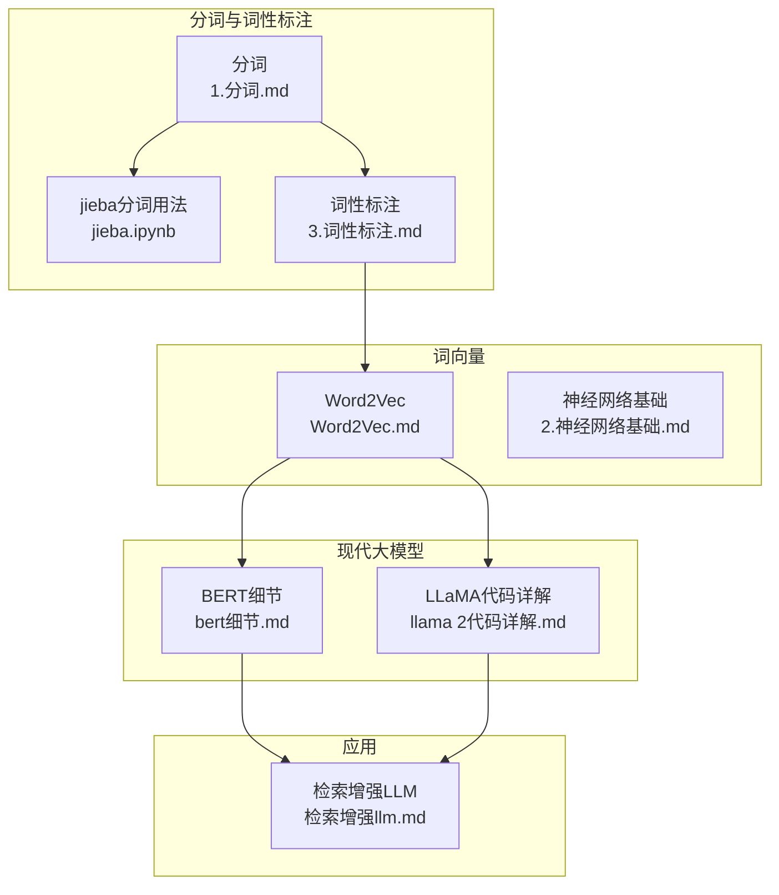
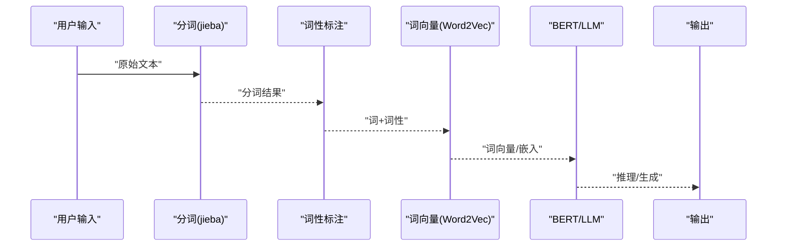
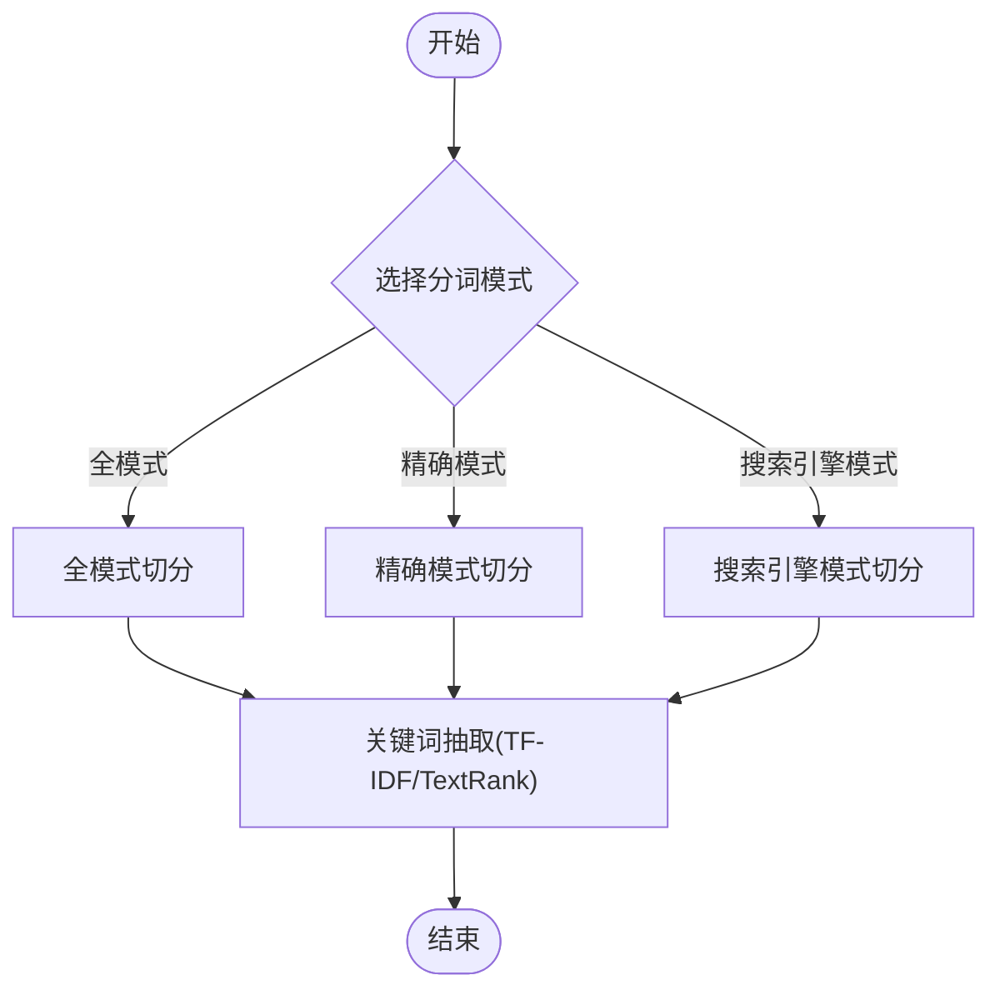
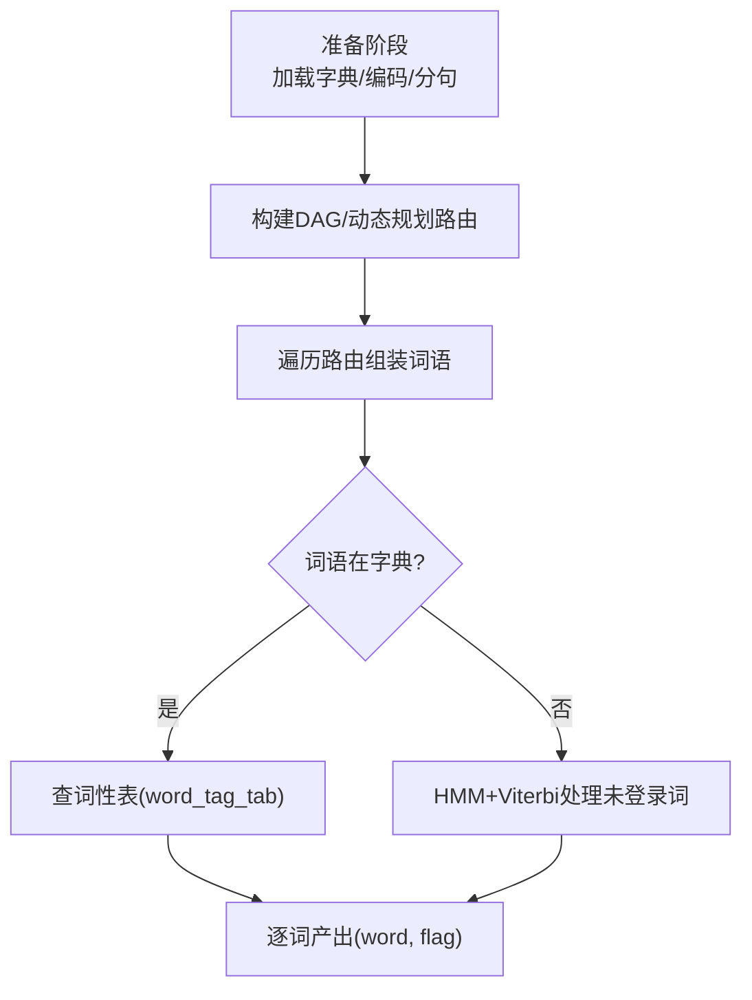
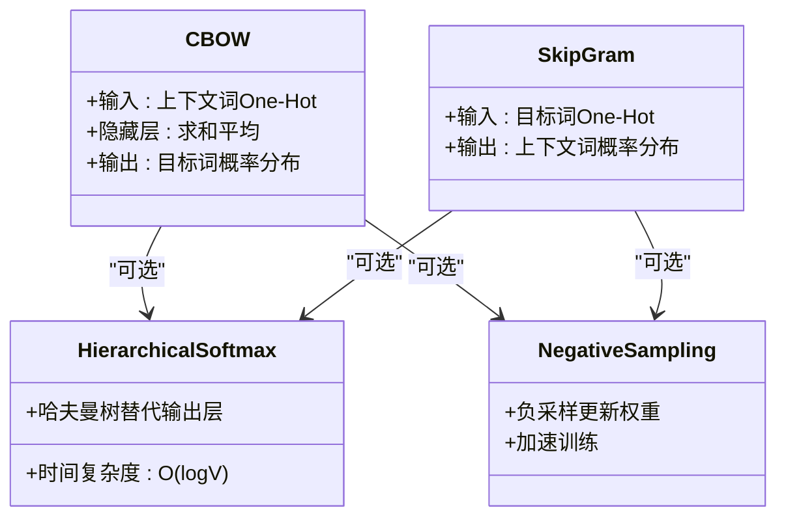
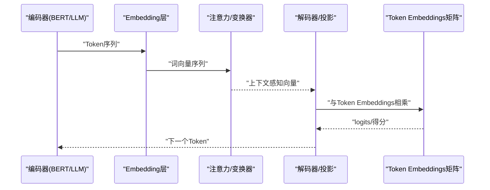
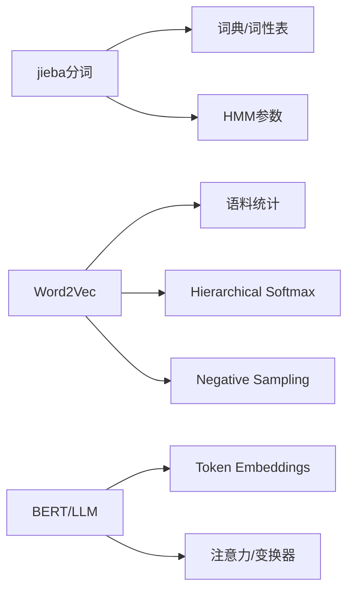

# 分词与词向量技术

<cite>
**本文档引用的文件**
- [jieba.ipynb](file://01.大语言模型基础/2.jieba分词用法及原理/jieba.ipynb)
- [3.词性标注.md](file://01.大语言模型基础/3.词性标注/3.词性标注.md)
- [1.分词.md](file://01.大语言模型基础/1.分词/1.分词.md)
- [Word2Vec.md](file://01.大语言模型基础/Word2Vec/Word2Vec.md)
- [2.神经网络基础.md](file://98.相关课程/清华大模型公开课/2.神经网络基础/2.神经网络基础.md)
- [bert细节.md](file://02.大语言模型架构/bert细节/bert细节.md)
- [llama 2代码详解.md](file://02.大语言模型架构/llama 2代码详解/llama 2代码详解.md)
- [1.语言模型.md](file://01.大语言模型基础/1.语言模型/1.语言模型.md)
- [检索增强llm.md](file://08.检索增强rag/检索增强llm/检索增强llm.md)
</cite>

## 目录
1. [简介](#简介)
2. [项目结构](#项目结构)
3. [核心组件](#核心组件)
4. [架构概览](#架构概览)
5. [详细组件分析](#详细组件分析)
6. [依赖分析](#依赖分析)
7. [性能考量](#性能考量)
8. [故障排查指南](#故障排查指南)
9. [结论](#结论)
10. [附录](#附录)

## 简介
本文件面向分词与词向量技术，系统梳理中文分词（jieba）、词性标注、以及词向量（Word2Vec）的原理与实践。内容覆盖：
- jieba分词的多种模式（精确模式、全模式、搜索引擎模式）与关键词抽取（TF-IDF、TextRank）
- 词性标注的概念、难点与jieba的字典+统计（HMM+Viterbi）混合策略
- 词向量的理论基础与主流方法（Word2Vec的CBOW/Skip-gram、Hierarchical Softmax、Negative Sampling）
- 词向量在现代大模型中的角色与应用（BERT、LLM推理）

## 项目结构
本仓库围绕“大语言模型基础”组织内容，分词与词向量相关内容主要分布在以下位置：
- 分词与词性标注：01.大语言模型基础/1.分词、2.jieba分词用法及原理、3.词性标注
- 词向量：01.大语言模型基础/Word2Vec
- 语言模型与词嵌入：01.大语言模型基础/1.语言模型、98.相关课程/清华大模型公开课/2.神经网络基础
- 现代大模型中的词嵌入：02.大语言模型架构/bert细节、02.大语言模型架构/llama 2代码详解
- 词向量应用：08.检索增强rag/检索增强llm

**图表来源**
- [1.分词.md:1-85](file://01.大语言模型基础/1.分词/1.分词.md#L1-L85)
- [jieba.ipynb:1-170](file://01.大语言模型基础/2.jieba分词用法及原理/jieba.ipynb#L1-L170)
- [3.词性标注.md:1-285](file://01.大语言模型基础/3.词性标注/3.词性标注.md#L1-L285)
- [Word2Vec.md:1-106](file://01.大语言模型基础/Word2Vec/Word2Vec.md#L1-L106)
- [2.神经网络基础.md:209-326](file://98.相关课程/清华大模型公开课/2.神经网络基础/2.神经网络基础.md#L209-L326)
- [bert细节.md:92-144](file://02.大语言模型架构/bert细节/bert细节.md#L92-L144)
- [llama 2代码详解.md:31-53](file://02.大语言模型架构/llama 2代码详解/llama 2代码详解.md#L31-L53)
- [检索增强llm.md:213-227](file://08.检索增强rag/检索增强llm/检索增强llm.md#L213-L227)

**章节来源**
- [1.分词.md:1-85](file://01.大语言模型基础/1.分词/1.分词.md#L1-L85)
- [jieba.ipynb:1-170](file://01.大语言模型基础/2.jieba分词用法及原理/jieba.ipynb#L1-L170)
- [3.词性标注.md:1-285](file://01.大语言模型基础/3.词性标注/3.词性标注.md#L1-L285)
- [Word2Vec.md:1-106](file://01.大语言模型基础/Word2Vec/Word2Vec.md#L1-L106)
- [2.神经网络基础.md:209-326](file://98.相关课程/清华大模型公开课/2.神经网络基础/2.神经网络基础.md#L209-L326)
- [bert细节.md:92-144](file://02.大语言模型架构/bert细节/bert细节.md#L92-L144)
- [llama 2代码详解.md:31-53](file://02.大语言模型架构/llama 2代码详解/llama 2代码详解.md#L31-L53)
- [检索增强llm.md:213-227](file://08.检索增强rag/检索增强llm/检索增强llm.md#L213-L227)

## 核心组件
- jieba分词：支持全模式、精确模式、搜索引擎模式；提供关键词抽取（TF-IDF、TextRank）
- 词性标注：字典匹配+HMM+Viterbi，兼容ICTCLAS词性标注集
- 词向量：Word2Vec（CBOW/Skip-gram）+ Hierarchical Softmax/Negative Sampling
- 现代大模型中的词嵌入：BERT的Token/Position/Segment Embedding融合；LLM推理中的Token Embedding矩阵相乘

**章节来源**
- [jieba.ipynb:19-33](file://01.大语言模型基础/2.jieba分词用法及原理/jieba.ipynb#L19-L33)
- [3.词性标注.md:32-47](file://01.大语言模型基础/3.词性标注/3.词性标注.md#L32-L47)
- [Word2Vec.md:32-81](file://01.大语言模型基础/Word2Vec/Word2Vec.md#L32-L81)
- [bert细节.md:92-133](file://02.大语言模型架构/bert细节/bert细节.md#L92-L133)
- [llama 2代码详解.md:31-53](file://02.大语言模型架构/llama 2代码详解/llama 2代码详解.md#L31-L53)

## 架构概览
下图展示从原始文本到词向量再到大模型推理的整体流程，突出分词、词性标注、词向量与现代模型的关系。

**图表来源**
- [1.分词.md:1-85](file://01.大语言模型基础/1.分词/1.分词.md#L1-L85)
- [3.词性标注.md:32-47](file://01.大语言模型基础/3.词性标注/3.词性标注.md#L32-L47)
- [Word2Vec.md:32-81](file://01.大语言模型基础/Word2Vec/Word2Vec.md#L32-L81)
- [bert细节.md:92-133](file://02.大语言模型架构/bert细节/bert细节.md#L92-L133)
- [llama 2代码详解.md:31-53](file://02.大语言模型架构/llama 2代码详解/llama 2代码详解.md#L31-L53)

## 详细组件分析

### jieba分词：模式与关键词抽取
- 模式说明
  - 全模式：输出尽可能多的词语切分，适合召回最大化
  - 精确模式：默认模式，追求准确率与召回的平衡
  - 搜索引擎模式：面向搜索的细粒度切分，提升召回
- 关键词抽取
  - TF-IDF：基于统计权重抽取关键词
  - TextRank：基于图排序的关键词抽取
- 实践要点
  - 通过del_word/add_word/suggest_freq动态调整词典与词频
  - HMM开关影响未登录词处理策略

**图表来源**
- [jieba.ipynb:19-33](file://01.大语言模型基础/2.jieba分词用法及原理/jieba.ipynb#L19-L33)
- [jieba.ipynb:86-103](file://01.大语言模型基础/2.jieba分词用法及原理/jieba.ipynb#L86-L103)
- [jieba.ipynb:121-138](file://01.大语言模型基础/2.jieba分词用法及原理/jieba.ipynb#L121-L138)

**章节来源**
- [jieba.ipynb:19-33](file://01.大语言模型基础/2.jieba分词用法及原理/jieba.ipynb#L19-L33)
- [jieba.ipynb:53-69](file://01.大语言模型基础/2.jieba分词用法及原理/jieba.ipynb#L53-L69)
- [jieba.ipynb:86-103](file://01.大语言模型基础/2.jieba分词用法及原理/jieba.ipynb#L86-L103)
- [jieba.ipynb:121-138](file://01.大语言模型基础/2.jieba分词用法及原理/jieba.ipynb#L121-L138)

### 词性标注：字典+统计混合策略
- 核心思想
  - 已知词：通过词典直接查词性
  - 未登录词：使用HMM+Viterbi标注BEMS状态，再映射到词性
- 流程要点
  - 初始化字典与词性表
  - DAG+DP构建路由，动态规划求最大路径
  - 未登录词走HMM路径，Viterbi解码得到最优词性序列
- 标注集兼容ICTCLAS，便于跨系统迁移

**图表来源**
- [3.词性标注.md:55-96](file://01.大语言模型基础/3.词性标注/3.词性标注.md#L55-L96)
- [3.词性标注.md:109-163](file://01.大语言模型基础/3.词性标注/3.词性标注.md#L109-L163)
- [3.词性标注.md:194-223](file://01.大语言模型基础/3.词性标注/3.词性标注.md#L194-L223)

**章节来源**
- [3.词性标注.md:32-47](file://01.大语言模型基础/3.词性标注/3.词性标注.md#L32-L47)
- [3.词性标注.md:167-188](file://01.大语言模型基础/3.词性标注/3.词性标注.md#L167-L188)
- [3.词性标注.md:194-223](file://01.大语言模型基础/3.词性标注/3.词性标注.md#L194-L223)

### 词向量：Word2Vec原理与实践
- 模型结构
  - CBOW：以上下文预测目标词，适合小数据集
  - Skip-gram：以目标词预测上下文，适合大数据集
- 训练细节
  - 输入层One-Hot，隐藏层N维向量，输出层Softmax
  - Hierarchical Softmax：将O(V)降为O(logV)
  - Negative Sampling：每次只更新少量权重，显著提速
- 分布式表示
  - One-Hot高维稀疏，分布式低维稠密，保留语义关系

**图表来源**
- [Word2Vec.md:32-81](file://01.大语言模型基础/Word2Vec/Word2Vec.md#L32-L81)
- [Word2Vec.md:83-96](file://01.大语言模型基础/Word2Vec/Word2Vec.md#L83-L96)
- [Word2Vec.md:97-106](file://01.大语言模型基础/Word2Vec/Word2Vec.md#L97-L106)
- [2.神经网络基础.md:209-269](file://98.相关课程/清华大模型公开课/2.神经网络基础/2.神经网络基础.md#L209-L269)

**章节来源**
- [Word2Vec.md:32-81](file://01.大语言模型基础/Word2Vec/Word2Vec.md#L32-L81)
- [Word2Vec.md:83-106](file://01.大语言模型基础/Word2Vec/Word2Vec.md#L83-L106)
- [2.神经网络基础.md:209-269](file://98.相关课程/清华大模型公开课/2.神经网络基础/2.神经网络基础.md#L209-L269)

### 现代大模型中的词嵌入与推理
- BERT的Embedding融合
  - Token Embedding + Position Embedding + Segment Embedding
  - 通过注意力机制在上下文中区分一词多义
- LLaMA等LLM推理
  - 将生成的embedding与Token Embeddings矩阵相乘，得到logits，选择下一个Token
- 词向量在RAG中的应用
  - 文本嵌入模型将文本映射为稠密向量，向量数据库存储与相似度检索

**图表来源**
- [bert细节.md:92-133](file://02.大语言模型架构/bert细节/bert细节.md#L92-L133)
- [llama 2代码详解.md:31-53](file://02.大语言模型架构/llama 2代码详解/llama 2代码详解.md#L31-L53)
- [检索增强llm.md:213-227](file://08.检索增强rag/检索增强llm/检索增强llm.md#L213-L227)

**章节来源**
- [bert细节.md:92-133](file://02.大语言模型架构/bert细节/bert细节.md#L92-L133)
- [llama 2代码详解.md:31-53](file://02.大语言模型架构/llama 2代码详解/llama 2代码详解.md#L31-L53)
- [检索增强llm.md:213-227](file://08.检索增强rag/检索增强llm/检索增强llm.md#L213-L227)

## 依赖分析
- 分词依赖
  - jieba分词依赖内部词典与HMM参数；词性标注依赖word_tag_tab与HMM概率表
- 词向量依赖
  - Word2Vec依赖大规模语料统计的起始/转移/发射概率；Hierarchical Softmax/Negative Sampling依赖词频分布
- 现代模型依赖
  - BERT/LLM依赖预训练的Token Embeddings矩阵与注意力机制

**图表来源**
- [3.词性标注.md:167-188](file://01.大语言模型基础/3.词性标注/3.词性标注.md#L167-L188)
- [Word2Vec.md:83-106](file://01.大语言模型基础/Word2Vec/Word2Vec.md#L83-L106)
- [bert细节.md:92-133](file://02.大语言模型架构/bert detal/bert细节.md#L92-L133)

**章节来源**
- [3.词性标注.md:167-188](file://01.大语言模型基础/3.词性标注/3.词性标注.md#L167-L188)
- [Word2Vec.md:83-106](file://01.大语言模型基础/Word2Vec/Word2Vec.md#L83-L106)
- [bert细节.md:92-133](file://02.大语言模型架构/bert细节/bert细节.md#L92-L133)

## 性能考量
- 分词
  - 全模式召回高但准确率略降；精确模式兼顾召回与准确；搜索引擎模式提升召回
  - 词典规模与词频调整对未登录词识别影响显著
- 词向量
  - Hierarchical Softmax与Negative Sampling显著降低计算复杂度
  - 词向量维度N远小于词表V，兼顾表达能力与效率
- 现代模型
  - BERT/LLM通过注意力机制在上下文中区分一词多义，提升语义建模能力

**章节来源**
- [1.分词.md:72-85](file://01.大语言模型基础/1.分词/1.分词.md#L72-L85)
- [Word2Vec.md:83-106](file://01.大语言模型基础/Word2Vec/Word2Vec.md#L83-L106)
- [bert细节.md:135-137](file://02.大语言模型架构/bert细节/bert细节.md#L135-L137)

## 故障排查指南
- 分词异常
  - 未登录词过多：通过add_word/suggest_freq调整词典与词频
  - 模式选择不当：根据任务（召回vs准确）选择全/精/搜索模式
- 词性标注不准
  - 一词多词性：字典匹配无法解决，需依赖HMM+Viterbi；可结合上下文优化
- 词向量质量
  - 语料不足或不平衡：增大语料规模，优化负采样/分层softmax参数
- 现代模型推理
  - logits异常：检查Token Embeddings矩阵维度与相乘逻辑；确认温度参数与采样策略

**章节来源**
- [jieba.ipynb:53-69](file://01.大语言模型基础/2.jieba分词用法及原理/jieba.ipynb#L53-L69)
- [3.词性标注.md:190-223](file://01.大语言模型基础/3.词性标注/3.词性标注.md#L190-L223)
- [Word2Vec.md:83-106](file://01.大语言模型基础/Word2Vec/Word2Vec.md#L83-L106)
- [llama 2代码详解.md:31-53](file://02.大语言模型架构/llama 2代码详解/llama 2代码详解.md#L31-L53)

## 结论
- jieba分词通过多种模式与关键词抽取满足不同场景需求；词性标注采用字典+统计混合策略，兼顾速度与准确性
- Word2Vec以分布式表示承载语义关系，结合Hierarchical Softmax与Negative Sampling显著提升训练效率
- 现代大模型（BERT/LLM）将词嵌入融入注意力机制，实现上下文感知与高效推理
- 在工程实践中，建议根据任务目标选择合适分词模式与词向量策略，并持续优化词典与模型参数

## 附录
- 词性标注集参考：兼容ICTCLAS标准，便于跨系统迁移
- 语言模型基础：自回归语言模型与温度参数对生成多样性的影响
- RAG应用：文本嵌入模型与向量索引在检索增强中的作用

**章节来源**
- [3.词性标注.md:34-47](file://01.大语言模型基础/3.词性标注/3.词性标注.md#L34-L47)
- [1.语言模型.md:37-97](file://01.大语言模型基础/1.语言模型/1.语言模型.md#L37-L97)
- [检索增强llm.md:213-227](file://08.检索增强rag/检索增强llm/检索增强llm.md#L213-L227)