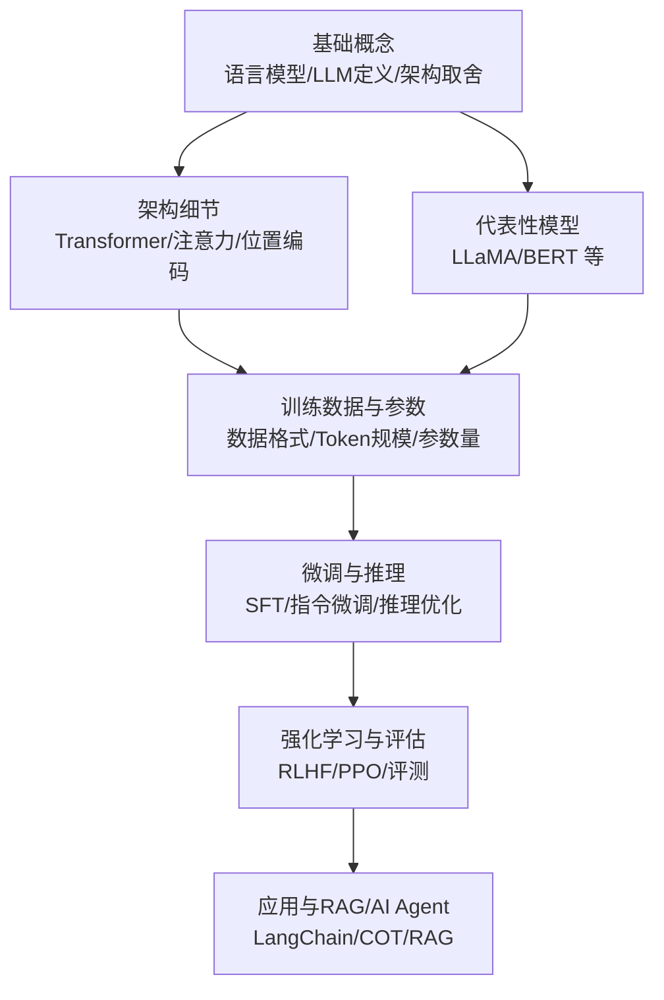
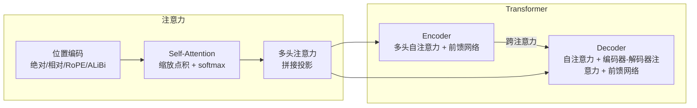
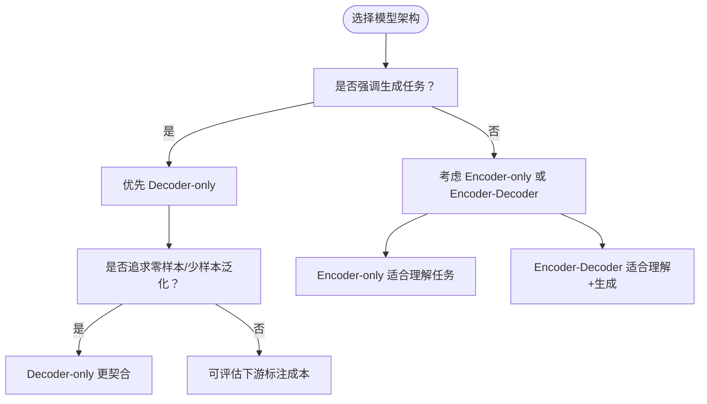
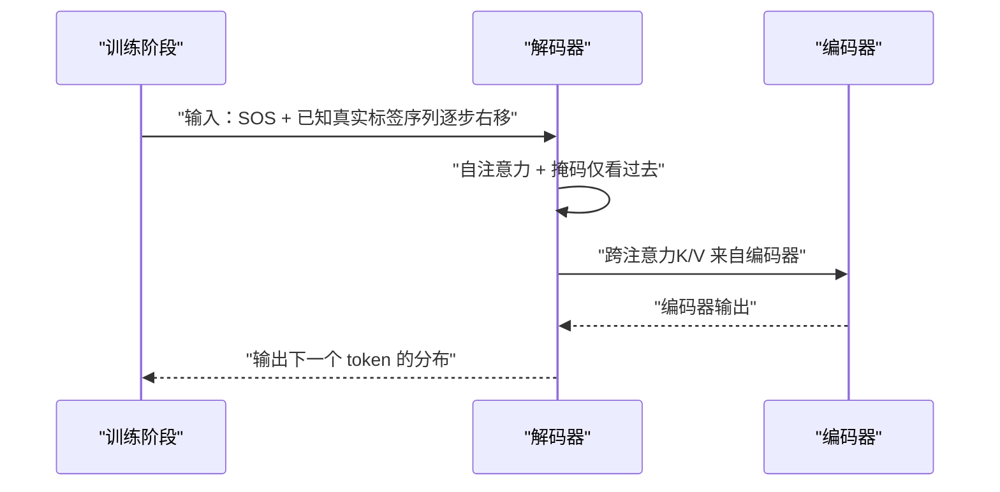
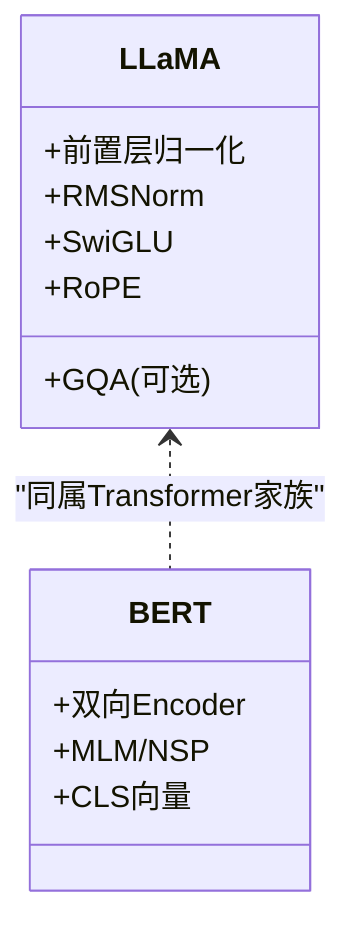
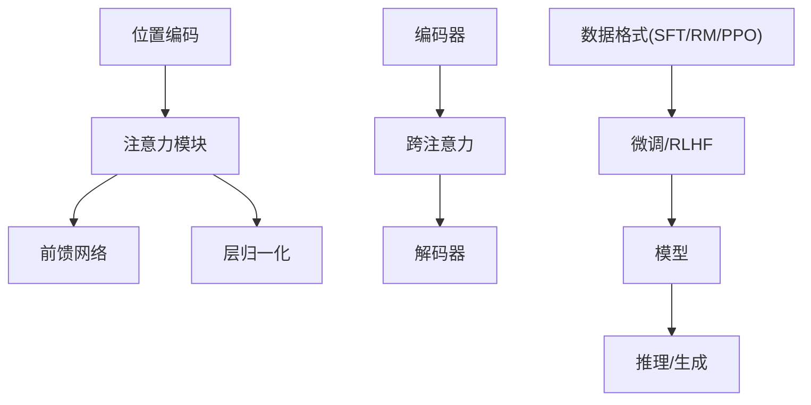

# 大模型核心概念

<cite>
**本文引用的文件**
- [01.大语言模型基础/1.llm概念/1.llm概念.md](file://01.大语言模型基础/1.llm概念/1.llm概念.md)
- [01.大语言模型基础/LLM为什么Decoder only架构/LLM为什么Decoder only架构.md](file://01.大语言模型基础/LLM为什么Decoder only架构/LLM为什么Decoder only架构.md)
- [01.大语言模型基础/1.语言模型/1.语言模型.md](file://01.大语言模型基础/1.语言模型/1.语言模型.md)
- [02.大语言模型架构/Transformer架构细节/Transformer架构细节.md](file://02.大语言模型架构/Transformer架构细节/Transformer架构细节.md)
- [02.大语言模型架构/1.attention/1.attention.md](file://02.大语言模型架构/1.attention/1.attention.md)
- [02.大语言模型架构/3.位置编码/3.位置编码.md](file://02.大语言模型架构/3.位置编码/3.位置编码.md)
- [02.大语言模型架构/5.token及模型参数/5.token及模型参数.md](file://02.大语言模型架构/5.token及模型参数/5.token及模型参数.md)
- [02.大语言模型架构/llama系列模型/llama系列模型.md](file://02.大语言模型架构/llama系列模型/llama系列模型.md)
- [02.大语言模型架构/bert细节/bert细节.md](file://02.大语言模型架构/bert细节/bert细节.md)
- [03.训练数据集/数据格式/数据格式.md](file://03.训练数据集/数据格式/数据格式.md)
</cite>

## 目录
1. [引言](#引言)
2. [项目结构](#项目结构)
3. [核心组件](#核心组件)
4. [架构总览](#架构总览)
5. [详细组件分析](#详细组件分析)
6. [依赖分析](#依赖分析)
7. [性能考量](#性能考量)
8. [故障排查指南](#故障排查指南)
9. [结论](#结论)
10. [附录](#附录)

## 引言
本文件围绕大语言模型（LLM）的核心概念，系统梳理其基本定义、关键指标、架构设计与发展趋势，重点解释为何当前主流大模型普遍采用 Decoder-only 架构，并对比 Encoder-only 与 Encoder-Decoder 的设计取舍。同时结合 LLaMA 系列、BERT 等代表性模型，说明训练数据、参数规模、预训练目标与生成策略等关键要素，帮助读者建立对 LLM 的整体认知。

## 项目结构
本仓库以主题化组织知识，涵盖“基础概念、架构细节、数据与训练、推理与优化、评估与应用”等模块。与本文件相关的核心路径如下：
- 01.大语言模型基础：语言模型定义、LLM 架构取舍、生成与提示工程等
- 02.大语言模型架构：Transformer 细节、注意力机制、位置编码、代表性模型
- 03.训练数据集：SFT/RM/PPO 数据格式与训练集选择
- 05.有监督微调：SFT、指令微调、LoRA、Adapter 等
- 06.推理：推理框架、参数与优化策略
- 07.强化学习：RLHF、PPO、DPO 等
- 08.检索增强 RAG：RAG 与 Agent 技术
- 09.大语言模型评估：评测与幻觉缓解
- 10.大语言模型应用：LangChain、思维链等

章节来源
- [01.大语言模型基础/1.llm概念/1.llm概念.md:1-164](file://01.大语言模型基础/1.llm概念/1.llm概念.md#L1-L164)
- [02.大语言模型架构/Transformer架构细节/Transformer架构细节.md:1-321](file://02.大语言模型架构/Transformer架构细节/Transformer架构细节.md#L1-L321)

## 核心组件
- 语言模型与自回归生成
  - 语言模型是对令牌序列的概率分布；自回归语言模型通过链式分解逐词生成，温度参数控制多样性。
  - 参考：[1.语言模型:1-215](file://01.大语言模型基础/1.语言模型/1.语言模型.md#L1-L215)
- LLM 的关键指标
  - 模型规模（参数量）、训练 Token 数、计算量（FLOPs）与性能的幂律关系；Token 重复训练对性能的负面影响。
  - 参考：[5.token及模型参数:1-196](file://02.大语言模型架构/5.token及模型参数/5.token及模型参数.md#L1-L196)
- 训练数据与数据格式
  - SFT/RM/PPO 数据格式；常用训练集（Common Crawl、Wikipedia、OpenWebText、BookCorpus 等）；数据增强策略。
  - 参考：[数据格式:1-117](file://03.训练数据集/数据格式/数据格式.md#L1-L117)

章节来源
- [01.大语言模型基础/1.语言模型/1.语言模型.md:1-215](file://01.大语言模型基础/1.语言模型/1.语言模型.md#L1-L215)
- [02.大语言模型架构/5.token及模型参数/5.token及模型参数.md:1-196](file://02.大语言模型架构/5.token及模型参数/5.token及模型参数.md#L1-L196)
- [03.训练数据集/数据格式/数据格式.md:1-117](file://03.训练数据集/数据格式/数据格式.md#L1-L117)

## 架构总览
- Transformer 架构
  - Encoder 与 Decoder 的模块组成、残差与层归一化、位置编码；自注意力与缩放点积注意力；多头注意力与维度降维；跨注意力在解码阶段连接编码器。
  - 参考：[Transformer架构细节:1-321](file://02.大语言模型架构/Transformer架构细节/Transformer架构细节.md#L1-L321)
- 注意力机制
  - 注意力计算步骤、Self-Attention 与 Target-Attention 的区别、Mask 处理、Q/K/V 的不同投影空间、缩放因子与 softmax 平滑。
  - 参考：[1.attention:1-544](file://02.大语言模型架构/1.attention/1.attention.md#L1-L544)
- 位置编码
  - 绝对/相对位置编码、RoPE、ALiBi；长度外推问题与解决方案。
  - 参考：[3.位置编码:1-397](file://02.大语言模型架构/3.位置编码/3.位置编码.md#L1-L397)

图表来源
- [02.大语言模型架构/Transformer架构细节/Transformer架构细节.md:7-321](file://02.大语言模型架构/Transformer架构细节/Transformer架构细节.md#L7-L321)
- [02.大语言模型架构/1.attention/1.attention.md:15-544](file://02.大语言模型架构/1.attention/1.attention.md#L15-L544)
- [02.大语言模型架构/3.位置编码/3.位置编码.md:10-397](file://02.大语言模型架构/3.位置编码/3.位置编码.md#L10-L397)

章节来源
- [02.大语言模型架构/Transformer架构细节/Transformer架构细节.md:1-321](file://02.大语言模型架构/Transformer架构细节/Transformer架构细节.md#L1-L321)
- [02.大语言模型架构/1.attention/1.attention.md:1-544](file://02.大语言模型架构/1.attention/1.attention.md#L1-L544)
- [02.大语言模型架构/3.位置编码/3.位置编码.md:1-397](file://02.大语言模型架构/3.位置编码/3.位置编码.md#L1-L397)

## 详细组件分析

### 1. LLM 的基本定义与核心特征
- 定义与目标
  - 语言模型是对令牌序列的概率分布；自回归语言模型通过条件概率链式分解实现生成；温度参数控制采样多样性。
  - 参考：[1.语言模型:1-215](file://01.大语言模型基础/1.语言模型/1.语言模型.md#L1-L215)
- 核心特征
  - 生成式任务优先、零样本/少样本泛化潜力、大规模预训练与下游微调范式、涌现能力与复读机问题。
  - 参考：[1.llm概念:1-164](file://01.大语言模型基础/1.llm概念/1.llm概念.md#L1-L164)

章节来源
- [01.大语言模型基础/1.语言模型/1.语言模型.md:1-215](file://01.大语言模型基础/1.语言模型/1.语言模型.md#L1-L215)
- [01.大语言模型基础/1.llm概念/1.llm概念.md:1-164](file://01.大语言模型基础/1.llm概念/1.llm概念.md#L1-L164)

### 2. LLM 的关键指标与发展趋势
- 指标与关系
  - 模型表现与参数量 N、训练 Token 数 D、计算量 C 呈幂律关系；在预算约束下需同比提升；Token 重复训练会降低性能。
  - 参考：[5.token及模型参数:9-196](file://02.大语言模型架构/5.token及模型参数/5.token及模型参数.md#L9-L196)
- 训练数据与数据集
  - 常用数据集与来源；数据增强方法；领域数据选择与质量。
  - 参考：[数据格式:71-117](file://03.训练数据集/数据格式/数据格式.md#L71-L117)

章节来源
- [02.大语言模型架构/5.token及模型参数/5.token及模型参数.md:9-196](file://02.大语言模型架构/5.token及模型参数/5.token及模型参数.md#L9-L196)
- [03.训练数据集/数据格式/数据格式.md:71-117](file://03.训练数据集/数据格式/数据格式.md#L71-L117)

### 3. 为什么采用 Decoder-only 架构
- 设计取舍
  - Encoder 的双向注意力存在低秩问题，削弱表达能力；Decoder-only 更适合生成任务与零样本泛化；支持 KV-Cache 复用，利于多轮对话。
  - 参考：[LLM为什么Decoder only架构:1-33](file://01.大语言模型基础/LLM为什么Decoder only架构/LLM为什么Decoder only架构.md#L1-L33)
- 与 Encoder-only/Encoder-Decoder 的对比
  - BERT（Encoder-only）擅长理解任务但不擅长生成；Encoder-Decoder（如 T5/BART）兼顾理解与生成但参数加倍；Decoder-only 在同等成本下更优。
  - 参考：[1.llm概念:73-90](file://01.大语言模型基础/1.llm概念/1.llm概念.md#L73-L90)

图表来源
- [01.大语言模型基础/LLM为什么Decoder only架构/LLM为什么Decoder only架构.md:18-33](file://01.大语言模型基础/LLM为什么Decoder only架构/LLM为什么Decoder only架构.md#L18-L33)
- [01.大语言模型基础/1.llm概念/1.llm概念.md:73-90](file://01.大语言模型基础/1.llm概念/1.llm概念.md#L73-L90)

章节来源
- [01.大语言模型基础/LLM为什么Decoder only架构/LLM为什么Decoder only架构.md:1-33](file://01.大语言模型基础/LLM为什么Decoder only架构/LLM为什么Decoder only架构.md#L1-L33)
- [01.大语言模型基础/1.llm概念/1.llm概念.md:73-90](file://01.大语言模型基础/1.llm概念/1.llm概念.md#L73-L90)

### 4. Transformer 架构与注意力机制
- 模块组成与训练/预测差异
  - Encoder/Decoder 每层子模块、Add&Norm、位置编码；解码端训练阶段输入拼接真实标签序列，预测阶段拼接上一轮预测。
  - 参考：[Transformer架构细节:7-60](file://02.大语言模型架构/Transformer架构细节/Transformer架构细节.md#L7-L60)
- 注意力计算与缩放
  - Scaled Dot-Product Attention、softmax 梯度问题、维度与点积大小关系、多头注意力降维与拼接。
  - 参考：[1.attention:15-123](file://02.大语言模型架构/1.attention/1.attention.md#L15-L123)
- 位置编码与外推
  - 绝对/相对位置编码、RoPE、ALiBi；长度外推问题与解决方案。
  - 参考：[3.位置编码:10-397](file://02.大语言模型架构/3.位置编码/3.位置编码.md#L10-L397)

图表来源
- [02.大语言模型架构/Transformer架构细节/Transformer架构细节.md:37-59](file://02.大语言模型架构/Transformer架构细节/Transformer架构细节.md#L37-L59)

章节来源
- [02.大语言模型架构/Transformer架构细节/Transformer架构细节.md:7-60](file://02.大语言模型架构/Transformer架构细节/Transformer架构细节.md#L7-L60)
- [02.大语言模型架构/1.attention/1.attention.md:15-123](file://02.大语言模型架构/1.attention/1.attention.md#L15-L123)
- [02.大语言模型架构/3.位置编码/3.位置编码.md:10-397](file://02.大语言模型架构/3.位置编码/3.位置编码.md#L10-L397)

### 5. 代表性模型与应用要点
- LLaMA 系列
  - 结构与细节：前置层归一化、RMSNorm、SwiGLU、旋转位置嵌入（RoPE）；维度设计与工程考量；GQA 在推理加速中的应用。
  - 参考：[llama系列模型:1-377](file://02.大语言模型架构/llama系列模型/llama系列模型.md#L1-L377)
- BERT
  - 仅使用 Encoder 部分，双向注意力与 MLM/NSP 多任务；CLS 向量用于分类；长文本处理策略。
  - 参考：[bert细节:1-272](file://02.大语言模型架构/bert细节/bert细节.md#L1-L272)

图表来源
- [02.大语言模型架构/llama系列模型/llama系列模型.md:1-100](file://02.大语言模型架构/llama系列模型/llama系列模型.md#L1-L100)
- [02.大语言模型架构/bert细节/bert细节.md:1-100](file://02.大语言模型架构/bert细节/bert细节.md#L1-L100)

章节来源
- [02.大语言模型架构/llama系列模型/llama系列模型.md:1-377](file://02.大语言模型架构/llama系列模型/llama系列模型.md#L1-L377)
- [02.大语言模型架构/bert细节/bert细节.md:1-272](file://02.大语言模型架构/bert细节/bert细节.md#L1-L272)

### 6. 应用场景与技术创新点
- 应用场景
  - 英文生成（LLaMA 系列）、中文对话（ChatGLM 系列）、代码生成（Code Llama）、多语言与多任务统一范式（T5）。
  - 参考：[1.llm概念:126-141](file://01.大语言模型基础/1.llm概念/1.llm概念.md#L126-L141)
- 技术创新点
  - 位置编码（RoPE/ALiBi）、注意力变体（GQA/MQA）、长文本外推、KV-Cache 复用、温度采样与解码策略。
  - 参考：[3.位置编码:194-317](file://02.大语言模型架构/3.位置编码/3.位置编码.md#L194-L317), [1.attention:268-330](file://02.大语言模型架构/1.attention/1.attention.md#L268-L330)

章节来源
- [01.大语言模型基础/1.llm概念/1.llm概念.md:126-141](file://01.大语言模型基础/1.llm概念/1.llm概念.md#L126-L141)
- [02.大语言模型架构/3.位置编码/3.位置编码.md:194-317](file://02.大语言模型架构/3.位置编码/3.位置编码.md#L194-L317)
- [02.大语言模型架构/1.attention/1.attention.md:268-330](file://02.大语言模型架构/1.attention/1.attention.md#L268-L330)

## 依赖分析
- 模块耦合与协作
  - 注意力模块（Self-Attention/Multi-Head）与前馈网络（FFN）在 Encoder/Decoder 中交替堆叠；跨注意力连接编码器与解码器；位置编码贯穿 Q/K/V 的投影阶段。
- 外部依赖与集成点
  - 训练数据格式（SFT/RM/PPO）与模型微调流程耦合；推理阶段依赖 KV-Cache 与解码策略（Top-k/Top-p/Temperature）。

图表来源
- [02.大语言模型架构/Transformer架构细节/Transformer架构细节.md:7-321](file://02.大语言模型架构/Transformer架构细节/Transformer架构细节.md#L7-L321)
- [02.大语言模型架构/1.attention/1.attention.md:15-123](file://02.大语言模型架构/1.attention/1.attention.md#L15-L123)
- [03.训练数据集/数据格式/数据格式.md:5-68](file://03.训练数据集/数据格式/数据格式.md#L5-L68)

章节来源
- [02.大语言模型架构/Transformer架构细节/Transformer架构细节.md:7-321](file://02.大语言模型架构/Transformer架构细节/Transformer架构细节.md#L7-L321)
- [02.大语言模型架构/1.attention/1.attention.md:15-123](file://02.大语言模型架构/1.attention/1.attention.md#L15-L123)
- [03.训练数据集/数据格式/数据格式.md:5-68](file://03.训练数据集/数据格式/数据格式.md#L5-L68)

## 性能考量
- 计算复杂度
  - Self-Attention 为 O(n²d)，是主要瓶颈；FFN 为 O(nd²)；多头注意力复杂度与单头相同但并行度更高。
  - 参考：[1.attention:374-441](file://02.大语言模型架构/1.attention/1.attention.md#L374-L441)
- KV-Cache 与解码效率
  - Decoder-only 支持 KV-Cache 复用，显著提升多轮对话与长序列生成效率。
  - 参考：[LLM为什么Decoder only架构:30-33](file://01.大语言模型基础/LLM为什么Decoder only架构/LLM为什么Decoder only架构.md#L30-L33)
- 长序列与外推
  - RoPE/ALiBi、注意力稀疏化、分块计算（FlashAttention）等技术缓解 O(n²) 瓶颈。
  - 参考：[3.位置编码](file://02.大语言模型架构/3.位置编码/3.位置编码.md:194-L317), [1.attention:268-330](file://02.大语言模型架构/1.attention/1.attention.md#L268-L330)

章节来源
- [02.大语言模型架构/1.attention/1.attention.md:374-441](file://02.大语言模型架构/1.attention/1.attention.md#L374-L441)
- [01.大语言模型基础/LLM为什么Decoder only架构/LLM为什么Decoder only架构.md:30-33](file://01.大语言模型基础/LLM为什么Decoder only架构/LLM为什么Decoder only架构.md#L30-L33)
- [02.大语言模型架构/3.位置编码/3.位置编码.md:194-317](file://02.大语言模型架构/3.位置编码/3.位置编码.md#L194-L317)
- [02.大语言模型架构/1.attention/1.attention.md:268-330](file://02.大语言模型架构/1.attention/1.attention.md#L268-L330)

## 故障排查指南
- 复读机问题
  - 数据偏差、训练目标限制、注意力机制与生成策略导致的复制倾向；可通过多样性数据、温度参数、解码策略与后处理缓解。
  - 参考：[1.llm概念:92-116](file://01.大语言模型基础/1.llm概念/1.llm概念.md#L92-L116)
- 多轮 epoch 导致的过拟合
  - 重复训练会降低模型性能；提高数据集规模、质量或引入正则（如 Dropout）可缓解；MoE 可作为预估大模型性能的工具。
  - 参考：[5.token及模型参数:29-196](file://02.大语言模型架构/5.token及模型参数/5.token及模型参数.md#L29-L196)
- 长文本处理
  - 截断/切分、层次建模、注意力机制优化；RoPE/ALiBi 与 FlashAttention 提升长序列效率。
  - 参考：[1.llm概念:153-164](file://01.大语言模型基础/1.llm概念/1.llm概念.md#L153-L164), [3.位置编码](file://02.大语言模型架构/3.位置编码/3.位置编码.md:318-L397)

章节来源
- [01.大语言模型基础/1.llm概念/1.llm概念.md:92-164](file://01.大语言模型基础/1.llm概念/1.llm概念.md#L92-L164)
- [02.大语言模型架构/5.token及模型参数/5.token及模型参数.md:29-196](file://02.大语言模型架构/5.token及模型参数/5.token及模型参数.md#L29-L196)
- [02.大语言模型架构/3.位置编码/3.位置编码.md:318-397](file://02.大语言模型架构/3.位置编码/3.位置编码.md#L318-L397)

## 结论
- LLM 的核心在于大规模预训练与自回归生成范式，Decoder-only 架构在生成任务、零样本泛化与工程效率上具备综合优势。
- Transformer 的注意力与位置编码是关键模块，配合 RoPE/ALiBi、多头注意力与 KV-Cache 复用，支撑长序列与多轮对话。
- 训练数据与 Token 规模、参数量与计算量的协同扩展，决定了模型性能与样本效率；数据重复训练会损害泛化。
- 实战中应结合任务需求选择架构（Decoder-only/Encoder-only/Encoder-Decoder），并采用合适的微调与推理策略。

## 附录
- 相关主题阅读
  - 有监督微调（SFT/LoRA/Adapter）、推理框架（vLLM/tgi/faster-transformer/trt_llm）、强化学习（RLHF/PPO/DPO）、RAG 与 Agent、评测与幻觉缓解、应用（LangChain、思维链）等。