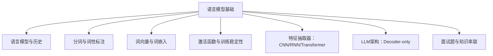
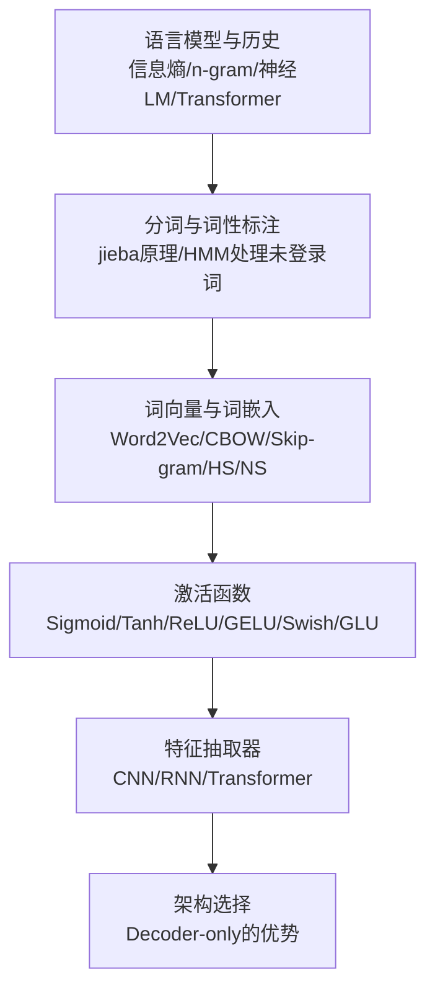
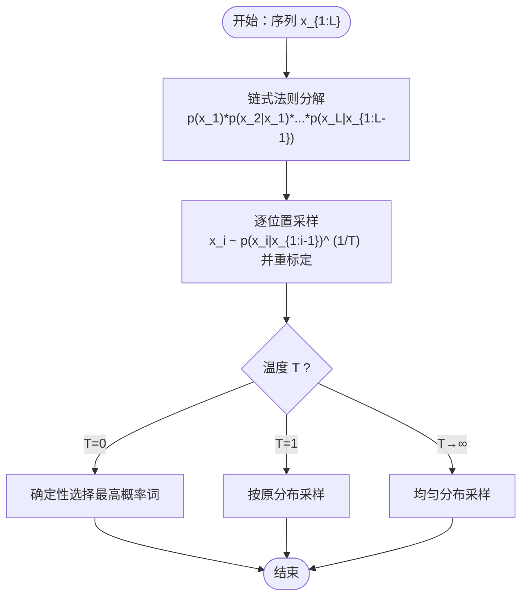
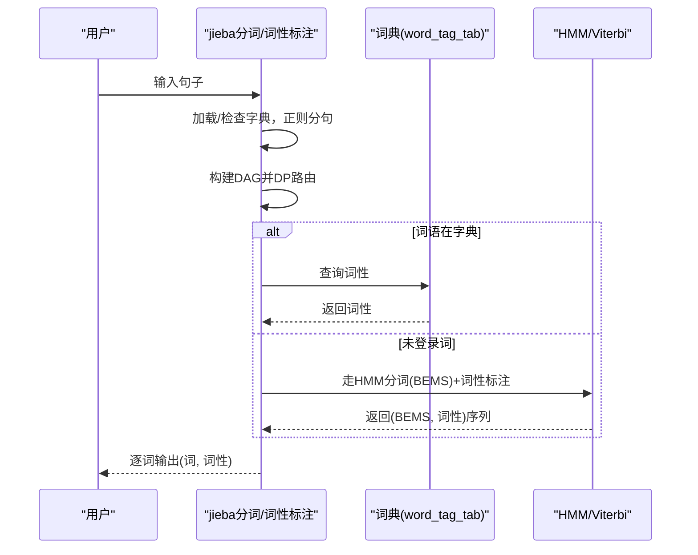
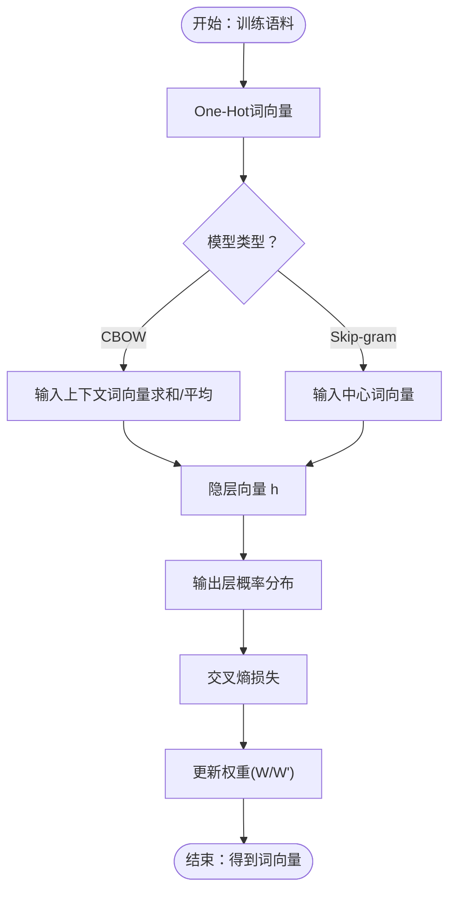
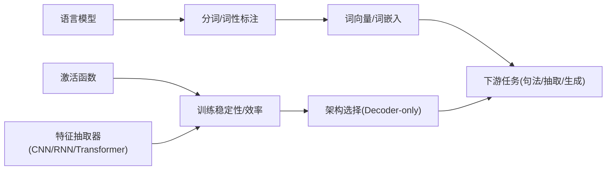

# 大语言模型基础

<cite>
**本文引用的文件**
- [01.大语言模型基础/1.语言模型/1.语言模型.md](file://01.大语言模型基础/1.语言模型/1.语言模型.md)
- [01.大语言模型基础/2.jieba分词用法及原理/jieba.ipynb](file://01.大语言模型基础/2.jieba分词用法及原理/jieba.ipynb)
- [01.大语言模型基础/3.词性标注/3.词性标注.md](file://01.大语言模型基础/3.词性标注/3.词性标注.md)
- [01.大语言模型基础/5.词向量/Word2Vec/Word2Vec.md](file://01.大语言模型基础/5.词向量/Word2Vec/Word2Vec.md)
- [01.大语言模型基础/NLP三大特征抽取器（CNN-RNN-TF）/NLP三大特征抽取器（CNN-RNN-TF）.md](file://01.大语言模型基础/NLP三大特征抽取器（CNN-RNN-TF）/NLP三大特征抽取器（CNN-RNN-TF）.md)
- [01.大语言模型基础/LLM为什么Decoder only架构/LLM为什么Decoder only架构.md](file://01.大语言模型基础/LLM为什么Decoder only架构/LLM为什么Decoder only架构.md)
- [01.大语言模型基础/1.激活函数/1.激活函数.md](file://01.大语言模型基础/1.激活函数/1.激活函数.md)
- [01.大语言模型基础/NLP面试题/NLP面试题.md](file://01.大语言模型基础/NLP面试题/NLP面试题.md)
- [01.大语言模型基础/README.md](file://01.大语言模型基础/README.md)
</cite>

## 目录
1. [引言](#引言)
2. [项目结构](#项目结构)
3. [核心组件](#核心组件)
4. [架构总览](#架构总览)
5. [详细组件分析](#详细组件分析)
6. [依赖分析](#依赖分析)
7. [性能考量](#性能考量)
8. [故障排查指南](#故障排查指南)
9. [结论](#结论)
10. [附录](#附录)

## 引言
本文件面向大语言模型（LLM）基础理论，系统梳理语言模型的发展脉络、分词与词性标注、词向量与词嵌入、以及支撑现代大模型的NLP基础（CNN/RNN/Transformer）。文档以仓库中的知识点为依据，配合图示与流程，帮助读者从零开始建立对大模型底层原理的完整认知。

## 项目结构
本专题位于“01.大语言模型基础”目录下，涵盖语言模型、分词、词性标注、词向量、激活函数、特征抽取器、架构选择与面试题等主题。下图为概念性结构示意（非代码映射）：

[本节为概览性说明，不直接分析具体文件，故不列出章节来源]

## 核心组件
- 语言模型与历史：从信息熵、n-gram 到神经语言模型，再到 Transformer 的演进。
- 分词与词性标注：jieba 的分词与词性标注原理、HMM 处理未登录词。
- 词向量与词嵌入：Word2Vec 的 CBOW/Skip-gram、Hierarchical Softmax、Negative Sampling。
- 激活函数：Sigmoid、Tanh、ReLU、GELU、Swish、GLU 等在训练与稳定性中的作用。
- 特征抽取器：CNN/RNN/Transformer 的适用性与并行性比较。
- 架构选择：Decoder-only 成为主流的原因与优势。
- 面试题与知识串联：BERT/GPT/ELMo 的对比、预训练范式与参数更新方法。

**章节来源**
- [01.大语言模型基础/README.md:1-36](file://01.大语言模型基础/README.md#L1-L36)

## 架构总览
下图展示从语言模型到现代大模型的关键路径：语言模型的历史演进 → 分词与词性标注 → 词向量与词嵌入 → 激活函数与特征抽取器 → 架构选择（Decoder-only）。

**图表来源**
- [01.大语言模型基础/1.语言模型/1.语言模型.md:98-215](file://01.大语言模型基础/1.语言模型/1.语言模型.md#L98-L215)
- [01.大语言模型基础/2.jieba分词用法及原理/jieba.ipynb:1-170](file://01.大语言模型基础/2.jieba分词用法及原理/jieba.ipynb#L1-L170)
- [01.大语言模型基础/3.词性标注/3.词性标注.md:18-285](file://01.大语言模型基础/3.词性标注/3.词性标注.md#L18-L285)
- [01.大语言模型基础/5.词向量/Word2Vec/Word2Vec.md:32-106](file://01.大语言模型基础/5.词向量/Word2Vec/Word2Vec.md#L32-L106)
- [01.大语言模型基础/1.激活函数/1.激活函数.md:1-292](file://01.大语言模型基础/1.激活函数/1.激活函数.md#L1-L292)
- [01.大语言模型基础/NLP三大特征抽取器（CNN-RNN-TF）/NLP三大特征抽取器（CNN-RNN-TF）.md:1-54](file://01.大语言模型基础/NLP三大特征抽取器（CNN-RNN-TF）/NLP三大特征抽取器（CNN-RNN-TF）.md#L1-L54)
- [01.大语言模型基础/LLM为什么Decoder only架构/LLM为什么Decoder only架构.md:1-33](file://01.大语言模型基础/LLM为什么Decoder only架构/LLM为什么Decoder only架构.md#L1-L33)

## 详细组件分析

### 语言模型与历史
- 经典定义：语言模型是对令牌序列的概率分布，自回归分解链式法则，条件概率可由前馈/递归/Transformer等高效计算。
- 温度参数 T：控制采样多样性，T=0 确定性，T=1 正常采样，T→∞ 均匀分布；需对分布重标定。
- 历史回顾：信息熵与交叉熵、n-gram 的局限（长依赖弱、统计估计差）、神经语言模型（RNN/LSTM/Transformer）与 Transformer 的可扩展性。
- 应用：噪声信道模型中语言模型与声学/翻译模型的结合。

**图表来源**
- [01.大语言模型基础/1.语言模型/1.语言模型.md:37-96](file://01.大语言模型基础/1.语言模型/1.语言模型.md#L37-L96)

**章节来源**
- [01.大语言模型基础/1.语言模型/1.语言模型.md:3-96](file://01.大语言模型基础/1.语言模型/1.语言模型.md#L3-L96)
- [01.大语言模型基础/1.语言模型/1.语言模型.md:98-215](file://01.大语言模型基础/1.语言模型/1.语言模型.md#L98-L215)

### 分词与词性标注（jieba）
- 分词模式：全模式、精确模式、搜索引擎模式；支持 HMM 控制与新词/词频调整。
- 词性标注：基于字典匹配与 HMM（Viterbi）联合处理；未登录词通过 HMM 获取 BEMS 状态与词性序列。
- 关键流程：DAG 构建与动态规划路由，未登录词走 HMM 分割，最终按 BEMS 组合词与词性。

**图表来源**
- [01.大语言模型基础/3.词性标注/3.词性标注.md:109-223](file://01.大语言模型基础/3.词性标注/3.词性标注.md#L109-L223)

**章节来源**
- [01.大语言模型基础/2.jieba分词用法及原理/jieba.ipynb:1-170](file://01.大语言模型基础/2.jieba分词用法及原理/jieba.ipynb#L1-L170)
- [01.大语言模型基础/3.词性标注/3.词性标注.md:18-285](file://01.大语言模型基础/3.词性标注/3.词性标注.md#L18-L285)

### 词向量与词嵌入（Word2Vec）
- 目标：将词映射到低维稠密向量，捕捉语义相似关系；对比 One-Hot 的高维与正交性不足。
- 模型：CBOW（以上下文预测中心词）、Skip-gram（以中心词预测上下文）。
- 训练：交叉熵损失 + 梯度下降；Hierarchical Softmax 与 Negative Sampling 降低 softmax 计算复杂度。
- 应用：相似词检索、类比推理等。

**图表来源**
- [01.大语言模型基础/5.词向量/Word2Vec/Word2Vec.md:32-106](file://01.大语言模型基础/5.词向量/Word2Vec/Word2Vec.md#L32-L106)

**章节来源**
- [01.大语言模型基础/5.词向量/Word2Vec/Word2Vec.md:1-106](file://01.大语言模型基础/5.词向量/Word2Vec/Word2Vec.md#L1-L106)

### 激活函数与训练稳定性
- Sigmoid/Tanh：输出有界，适合概率/门控，但易梯度消失；Tanh 均值更接近 0。
- ReLU 系列：计算简单、缓解梯度消失，但存在 Dead ReLU；Leaky/PReLU/RReLU/ELU 等改进。
- GELU：连续可导、负值区非零，加速收敛；Swish/GLU（SwiGLU）在现代架构中广泛应用。
- 训练技巧：梯度爆炸可用裁剪缓解；残差连接与归一化显著改善梯度问题。

**章节来源**
- [01.大语言模型基础/1.激活函数/1.激活函数.md:1-292](file://01.大语言模型基础/1.激活函数/1.激活函数.md#L1-L292)

### 特征抽取器：CNN/RNN/Transformer
- RNN：天然适配序列，LSTM/GRU 缓解梯度问题；但序列依赖导致并行性差。
- CNN：捕获 k-gram 片段，保留相对位置，具备强并行性；1D 卷积与扩张卷积等改进。
- Transformer：并行友好、长距离依赖建模能力强，成为主流特征抽取器。

**章节来源**
- [01.大语言模型基础/NLP三大特征抽取器（CNN-RNN-TF）/NLP三大特征抽取器（CNN-RNN-TF）.md:1-54](file://01.大语言模型基础/NLP三大特征抽取器（CNN-RNN-TF）/NLP三大特征抽取器（CNN-RNN-TF）.md#L1-L54)

### 架构选择：Decoder-only 为什么成为主流
- Encoder 的双向注意力可能带来低秩问题，削弱表达能力；对生成任务引入双向注意力无实质收益。
- Decoder-only 支持 KV-Cache 复用，多轮对话友好；在零样本/少样本泛化上表现更佳。
- 工程与效率：训练与推理成本更低，参数利用率更高。

**章节来源**
- [01.大语言模型基础/LLM为什么Decoder only架构/LLM为什么Decoder only架构.md:1-33](file://01.大语言模型基础/LLM为什么Decoder only架构/LLM为什么Decoder only架构.md#L1-L33)

### 面试题与知识串联
- BERT：双向编码器 + MLM/NSP；输入向量为位置/词片/段嵌入之和。
- GPT：单向解码器 + 下一词预测；适合生成与零样本泛化。
- ELMo：左右双向 LSTM 级联；早期双向上下文探索。
- 预训练范式：从 Word Embedding → Word2Vec → ELMo → Transformer → GPT/BERT → 更大更强的预训练。
- 参数更新：SGD/Momentum/Nesterov/AdaDelta/Adam 等。

**章节来源**
- [01.大语言模型基础/NLP面试题/NLP面试题.md:1-169](file://01.大语言模型基础/NLP面试题/NLP面试题.md#L1-L169)

## 依赖分析
- 语言模型是分词与词性标注的前置任务：分词质量影响词性标注与后续语义任务。
- 词向量/词嵌入为下游任务提供稠密表示，支撑句法分析、信息抽取与生成。
- 激活函数与特征抽取器决定模型训练稳定性与并行效率，直接影响大模型可扩展性。
- 架构选择（Decoder-only）决定推理效率与多轮对话能力。

[本节为概念性依赖关系说明，不直接分析具体文件，故不列出章节来源]

## 性能考量
- 训练效率：Transformer 并行友好；RNN 序列依赖限制并行；CNN 1D 卷积与扩张卷积提升长程特征捕获。
- 推理效率：Decoder-only 支持 KV-Cache 复用，适合多轮对话；Encoder-only 不利于缓存。
- 词向量训练：Hierarchical Softmax 与 Negative Sampling 显著降低 softmax 计算复杂度。
- 激活函数：ReLU/GELU/Swish/GLU 等有助于缓解梯度问题、加速收敛。

[本节为通用性能讨论，不直接分析具体文件，故不列出章节来源]

## 故障排查指南
- 分词误切/未登录词：检查 jieba 字典、新词添加与词频建议；必要时关闭 HMM 或调整分词模式。
- 词性标注歧义：字典匹配无法覆盖一词多性，可结合上下文或采用 HMM/Viterbi 提升未登录词标注质量。
- 词向量质量不佳：检查训练语料规模与窗口参数；优先使用 Hierarchical Softmax 或 Negative Sampling。
- 训练不稳定：梯度爆炸可用梯度裁剪；梯度消失通过残差连接与归一化缓解；激活函数选择 ReLU/GELU 等。

**章节来源**
- [01.大语言模型基础/3.词性标注/3.词性标注.md:18-285](file://01.大语言模型基础/3.词性标注/3.词性标注.md#L18-L285)
- [01.大语言模型基础/5.词向量/Word2Vec/Word2Vec.md:83-106](file://01.大语言模型基础/5.词向量/Word2Vec/Word2Vec.md#L83-L106)
- [01.大语言模型基础/1.激活函数/1.激活函数.md:12-22](file://01.大语言模型基础/1.激活函数/1.激活函数.md#L12-L22)

## 结论
- 语言模型是大模型的根基，从 n-gram 到神经 LM 再到 Transformer，体现了从统计到深度学习的范式跃迁。
- 分词与词性标注是下游任务的基石，jieba 的字典+HMM 方案兼顾速度与鲁棒性。
- 词向量/词嵌入为语义稠密表示奠定基础，Word2Vec 的 CBOW/Skip-gram 与优化策略（HS/NS）仍具指导意义。
- 激活函数与特征抽取器影响训练稳定性与并行效率，Transformer 成为主流。
- 架构选择上，Decoder-only 在生成与推理效率上具备综合优势。
- 面试题与知识串联帮助建立系统性认知，贯通预训练范式与参数更新方法。

[本节为总结性说明，不直接分析具体文件，故不列出章节来源]

## 附录
- 实际代码示例与应用场景请参考以下文件路径（不直接展示代码内容）：
  - 分词与词性标注示例：[01.大语言模型基础/2.jieba分词用法及原理/jieba.ipynb:1-170](file://01.大语言模型基础/2.jieba分词用法及原理/jieba.ipynb#L1-L170)
  - 词性标注原理与流程：[01.大语言模型基础/3.词性标注/3.词性标注.md:36-285](file://01.大语言模型基础/3.词性标注/3.词性标注.md#L36-L285)
  - Word2Vec 模型与训练策略：[01.大语言模型基础/5.词向量/Word2Vec/Word2Vec.md:32-106](file://01.大语言模型基础/5.词向量/Word2Vec/Word2Vec.md#L32-L106)
  - 激活函数与训练稳定性：[01.大语言模型基础/1.激活函数/1.激活函数.md:1-292](file://01.大语言模型基础/1.激活函数/1.激活函数.md#L1-L292)
  - 特征抽取器比较：[01.大语言模型基础/NLP三大特征抽取器（CNN-RNN-TF）/NLP三大特征抽取器（CNN-RNN-TF）.md:1-54](file://01.大语言模型基础/NLP三大特征抽取器（CNN-RNN-TF）/NLP三大特征抽取器（CNN-RNN-TF）.md#L1-L54)
  - 架构选择与优势：[01.大语言模型基础/LLM为什么Decoder only架构/LLM为什么Decoder only架构.md:1-33](file://01.大语言模型基础/LLM为什么Decoder only架构/LLM为什么Decoder only架构.md#L1-L33)
  - 面试题与知识串联：[01.大语言模型基础/NLP面试题/NLP面试题.md:1-169](file://01.大语言模型基础/NLP面试题/NLP面试题.md#L1-L169)